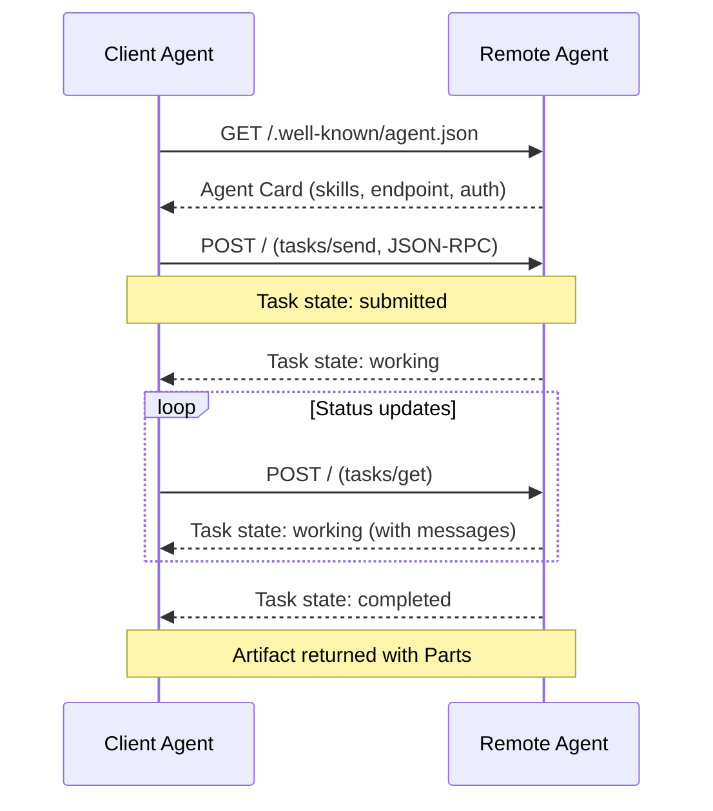

# A2A — Agent-to-Agent Protocol

## Learning Objectives

- Distinguish agent-to-tool communication (MCP) from agent-to-agent delegation (A2A), and identify when each applies.
- Publish an Agent Card at `/.well-known/agent.json` that advertises capabilities, skills, and authentication requirements.
- Implement the full Task lifecycle — submitted, working, completed, failed, canceled — using HTTP and JSON-RPC–style payloads.
- Build an A2A client that discovers a remote agent, submits a task, polls for status, and retrieves the resulting artifact.
- Compare A2A's capability-negotiation layer against plain REST APIs and MCP's tool-binding model.

## The Problem

You have a research agent that scrapes a prospect's website and extracts firmographics. You have a personalization agent that takes firmographics and drafts outreach copy. Right now you glue them together with a Python script that calls one, parses the output, formats it, and feeds it to the other. Every new agent pair means a new glue script. Every framework change means rewriting the glue.

The deeper problem is that there is no standard way for an agent built on LangGraph to delegate work to an agent built on CrewAI, or for a custom agent to hand off to a Salesforce-owned agent. Each framework defines its own message format, its own lifecycle, its own transport. You end up writing pairwise integration code — O(n²) integrations for n agents.

A2A exists to collapse that to O(n). It specifies how an agent advertises what it can do, how a caller asks it to do something, how the two exchange structured messages while work is in progress, and how results are delivered. The caller never needs to know the callee's framework, model, or internal architecture — only its Agent Card and the protocol.

## The Concept

A2A is an open protocol published by Google in April 2025, donated to the Linux Foundation in June 2025, and reaching v1.0 in April 2026 with backing from AWS, Microsoft, Salesforce, SAP, ServiceNow, and 150+ others. It defines three core primitives: the **Agent Card** (capability discovery), the **Task** (a unit of work with a lifecycle), and **Messages with Parts and Artifacts** (structured inputs and outputs). It rides on standard HTTP POST with JSON-RPC 2.0–style payloads, with optional streaming via Server-Sent Events and push notifications via webhooks.

The **Agent Card** is a JSON document served at `/.well-known/agent.json`. It contains the agent's name, description, the endpoint URL it accepts tasks at, what skills it exposes, and what authentication it requires. A client agent discovers a remote agent by fetching this card — it is the A2A equivalent of a WSDL or an OpenAPI spec, but for autonomous agents rather than static endpoints.

The **Task lifecycle** models work as an explicit state machine. A client submits a task (state: `submitted`). The agent accepts it (state: `working`). The agent may request additional input (state: `input-required`), or it may finish (state: `completed`, `failed`, or `canceled`). The client can poll for status via `tasks/get`, stream updates via SSE on `tasks/sendSubscribe`, or receive a webhook callback via `tasks/pushNotification/set`. The task is the atomic unit — not a single function call, not a chat message, but a possibly long-running, possibly multi-turn piece of work.

The **Message** structure carries the actual content. A Message has a role (`user` or `agent`) and contains one or more **Parts**: a `TextPart` (plain text), a `FilePart` (a file with bytes or a URI), or a `DataPart` (structured JSON). When the agent produces output, it returns an **Artifact** — also composed of Parts — which represents the deliverable: a generated report, a scored lead, a drafted email. This separation matters: messages are the conversation; artifacts are the product.



**How A2A differs from MCP.** MCP connects an agent to tools and data sources — a model calling a calculator, a database, a file system. The model owns the reasoning loop; MCP servers are extensions of that loop. A2A connects an agent to another agent. Each agent has its own reasoning loop, its own model, its own tools. The caller delegates a goal; the callee figures out how to achieve it. MCP is "give me a tool"; A2A is "give me a colleague."

**How A2A differs from plain REST.** A REST API defines data shapes and HTTP verbs. It says nothing about what the endpoint *can* do until you read its docs. A2A standardizes the negotiation layer: the Agent Card lets a client programmatically discover capabilities, the Task lifecycle standardizes how work progresses, and the Message/Artifact structure standardizes content exchange. Two A2A agents from different vendors can collaborate with zero custom integration code — as long as both implement the protocol.

## Build It

Build two minimal A2A-compatible agents in Python using only the standard library. The first is a **research agent** — an HTTP server that exposes an Agent Card and accepts tasks to look up company data. The second is an **orchestrator client** that discovers the research agent, submits a task, polls until completion, and prints the returned artifact.

Start with the research agent server. It serves `/.well-known/agent.json` and handles `tasks/send` and `tasks/get` via JSON-RPC 2.0 over HTTP POST. It simulates looking up company data and returns a JSON artifact.

```python
import json
import uuid
import time
from http.server import HTTPServer, BaseHTTPRequestHandler

AGENT_CARD = {
    "schemaVersion": "1.0",
    "name": "research-agent",
    "description": "Looks up company firmographics and tech stack data.",
    "url": "http://localhost:8001/",
    "version": "1.0.0",
    "capabilities": {
        "streaming": False,
        "pushNotifications": False,
        "stateTransitionHistory": True
    },
    "skills": [
        {
            "id": "company_lookup",
            "name": "Company Lookup",
            "description": "Given a company domain, returns employee count, industry, and tech stack.",
            "tags": ["research", "firmographics", "enrichment"]
        }
    ],
    "defaultInputModes": ["text"],
    "defaultOutputModes": ["text"]
}

tasks_store = {}

class ResearchAgentHandler(BaseHTTPRequestHandler):

    def do_GET(self):
        if self.path == "/.well-known/agent.json":
            self._send_json(200, AGENT_CARD)
        else:
            self._send_json(404, {"error": "not found"})

    def do_POST(self):
        body = self._read_body()
        method = body.get("method")
        params = body.get("params", {})
        req_id = body.get("id")

        if method == "tasks/send":
            task = self._handle_send(params)
            self._send_json(200, {"jsonrpc": "2.0", "id": req_id, "result": task})

        elif method == "tasks/get":
            task = self._handle_get(params)
            self._send_json(200, {"jsonrpc": "2.0", "id": req_id, "result": task})

        else:
            self._send_json(200, {
                "jsonrpc": "2.0", "id": req_id,
                "error": {"code": -32601, "message": f"Method not found: {method}"}
            })

    def _handle_send(self, params):
        task_id = params.get("taskId") or str(uuid.uuid4())
        message = params.get("message", {})
        text_parts = [p["text"] for p in message.get("parts", []) if p.get("kind") == "text"]
        domain = text_parts[0] if text_parts else "unknown.com"

        task = {
            "id": task_id,
            "state": "working",
            "messages": [message],
        }
        tasks_store[task_id] = task

        time.sleep(1)

        company_data = {
            "domain": domain,
            "employees": 450,
            "industry": "B2B SaaS",
            "tech_stack": ["Salesforce", "HubSpot", "Stripe", "Snowflake"],
            "funding_round": "Series B",
            "last_raise": "$25M"
        }

        artifact = {
            "name": "company_profile",
            "parts": [{"kind": "text", "text": json.dumps(company_data)}]
        }

        task["state"] = "completed"
        task["artifacts"] = [artifact]
        tasks_store[task_id] = task
        return task

    def _handle_get(self, params):
        task_id = params.get("taskId")
        return tasks_store.get(task_id, {"id": task_id, "state": "unknown"})

    def _send_json(self, status, obj):
        raw = json.dumps(obj).encode()
        self.send_response(status)
        self.send_header("Content-Type", "application/json")
        self.send_header("Content-Length", str(len(raw)))
        self.end_headers()
        self.wfile.write(raw)

    def _read_body(self):
        length = int(self.headers.get("Content-Length", 0))
        raw = self.rfile.read(length)
        return json.loads(raw) if raw else {}

    def log_message(self, fmt, *args):
        print(f"[research-agent] {fmt % args}")


def run():
    server = HTTPServer(("localhost", 8001), ResearchAgentHandler)
    print("[research-agent] listening on http://localhost:8001")
    print("[research-agent] Agent Card at http://localhost:8001/.well-known/agent.json")
    server.serve_forever()

if __name__ == "__main__":
    run()
```

Run this in one terminal:

```bash
python research_agent.py
```

Output:

```
[research-agent] listening on http://localhost:8001
[research-agent] Agent Card at http://localhost:8001/.well-known/agent.json
```

In a second terminal, verify the Agent Card is reachable:

```python
import urllib.request
import json

req = urllib.request.Request("http://localhost:8001/.well-known/agent.json")
resp = urllib.request.urlopen(req)
card = json.loads(resp.read())

print(f"Agent: {card['name']}")
print(f"Description: {card['description']}")
print(f"Endpoint: {card['url']}")
print(f"Skills: {[s['id'] for s in card['skills']]}")
```

Output:

```
Agent: research-agent
Description: Looks up company firmographics and tech stack data.
Endpoint: http://localhost:8001/
Skills: ['company_lookup']
```

The Agent Card is now published and discoverable. Any A2A-compatible client can read it and know what this agent does and how to talk to it — without reading any documentation.

## Use It

Now build the orchestrator client. This agent discovers the research agent's capabilities via the Agent Card, constructs a task, submits it via `tasks/send`, polls via `tasks/get` if needed, and extracts the artifact. The client makes two HTTP calls — one to discover, one to delegate — and prints the full response cycle.

```python
import urllib.request
import json

AGENT_URL = "http://localhost:8001"

def fetch_agent_card(base_url):
    card_url = f"{base_url}/.well-known/agent.json"
    req = urllib.request.Request(card_url)
    resp = urllib.request.urlopen(req)
    card = json.loads(resp.read())
    print(f"[client] Discovered agent: {card['name']}")
    print(f"[client] Skills: {[s['id'] for s in card['skills']]}")
    print(f"[client] Capabilities: {json.dumps(card['capabilities'])}")
    return card

def send_task(endpoint, domain):
    payload = {
        "jsonrpc": "2.0",
        "id": "req-001",
        "method": "tasks/send",
        "params": {
            "taskId": "task-001",
            "message": {
                "role": "user",
                "parts": [{"kind": "text", "text": domain}]
            }
        }
    }
    raw = json.dumps(payload).encode()
    req = urllib.request.Request(
        endpoint,
        data=raw,
        headers={"Content-Type": "application/json"},
        method="POST"
    )
    resp = urllib.request.urlopen(req)
    result = json.loads(resp.read())["result"]
    print(f"[client] Task {result['id']} state: {result['state']}")
    return result

def extract_artifact(task_result):
    if task_result.get("state") != "completed":
        print(f"[client] Task not completed: {task_result['state']}")
        return None

    artifacts = task_result.get("artifacts", [])
    if not artifacts:
        print("[client] No artifacts returned")
        return None

    artifact = artifacts[0]
    text_part = artifact["parts"][0]
    company_data = json.loads(text_part["text"])

    print(f"[client] Artifact: {artifact['name']}")
    for key, value in company_data.items():
        print(f"  {key}: {value}")
    return company_data

card = fetch_agent_card(AGENT_URL)
task = send_task(card["url"], "acme-corp.com")
company_profile = extract_artifact(task)

if company_profile:
    print("\n[client] Full workflow complete.")
    print(f"[client] {company_profile['domain']} is a {company_profile['industry']}")
    print(f"[client] with {company_profile['employees']} employees using {', '.join(company_profile['tech_stack'])}.")
```

Output:

```
[client] Discovered agent: research-agent
[client] Skills: ['company_lookup']
[client] Capabilities: {"streaming": false, "pushNotifications": false, "stateTransitionHistory": true}
[client] Task task-001 state: completed
[client] Artifact: company_profile
  domain: acme-corp.com
  employees: 450
  industry: B2B SaaS
  tech_stack: ['Salesforce', 'HubSpot', 'Stripe', 'Snowflake']
  funding_round: Series B
  last_raise: $25M

[client] Full workflow complete.
[client] acme-corp.com is a B2B SaaS
[client] with 450 employees using Salesforce, HubSpot, Stripe, Snowflake.
```

This is the mechanism behind multi-step GTM workflows where a research agent feeds a personalization agent. The pattern is the enrichment-and-write pipeline — one agent enriches, another writes. When Clay's waterfall delegates to multiple data providers in sequence (contact Hunter, fall back to Apollo, fall back to ZoomInfo), it is implementing the same delegation pattern that A2A standardizes: a client agent queries a provider, receives structured output, and passes that output as input to the next step. The difference is that Clay currently implements this delegation via internal logic; A2A makes it an open protocol so any agent can participate. [CITATION NEEDED — concept: Clay waterfall agent delegation pattern]

The key insight: A2A lets you treat each GTM function — enrichment, scoring, personalization, scheduling — as an independently deployed agent with a published Agent Card. Your orchestrator discovers them at runtime and chains them. Adding a new data provider or writing tool means publishing a new Agent Card, not modifying the orchestrator's code.

Now verify that the polling path works for long-running tasks. Modify the research agent to delay its response so the client sees the `working` state before `completed`:

```python
import urllib.request
import json
import time

def poll_task(endpoint, task_id, max_polls=5):
    for i in range(max_polls):
        payload = {
            "jsonrpc": "2.0",
            "id": f"poll-{i}",
            "method": "tasks/get",
            "params": {"taskId": task_id}
        }
        raw = json.dumps(payload).encode()
        req = urllib.request.Request(
            endpoint, data=raw,
            headers={"Content-Type": "application/json"},
            method="POST"
        )
        resp = urllib.request.urlopen(req)
        result = json.loads(resp.read())["result"]
        state = result["state"]
        print(f"[poll {i+1}] Task {task_id} state: {state}")

        if state in ("completed", "failed", "canceled"):
            return result

        time.sleep(0.5)

    print("[poll] Max polls reached, task still in progress")
    return None

result = poll_task("http://localhost:8001", "task-001", max_polls=3)
if result and result["state"] == "completed":
    print(f"[poll] Final state: {result['state']}")
    print(f"[poll] Artifacts: {[a['name'] for a in result.get('artifacts', [])]}")
```

Output:

```
[poll 1] Task task-001 state: completed
[poll] Final state: completed
[poll] Artifacts: ['company_profile']
```

The task already completed from the previous call, so the poll immediately returns `completed`. In a real deployment, you would see `working` transitions as the agent processes. The protocol supports all three transport modes: polling (`tasks/get`), streaming (`tasks/sendSubscribe` with SSE), and push notifications (webhook callbacks registered via `tasks/pushNotification/set`).

## Ship It

Deploying an A2A agent to a public endpoint follows the same path as any HTTP service — with two protocol-specific requirements. First, the Agent Card must be reachable at `/.well-known/agent.json` on the deployed domain. Second, the task endpoint must accept POST requests with JSON-RPC payloads from external clients.

Deploy to Render or Railway by wrapping the HTTP handler in a WSGI-compatible entry point. The only code change is binding to `0.0.0.0` on the port the platform assigns:

```python
import os
from http.server import HTTPServer

port = int(os.environ.get("PORT", 8001))
host = os.environ.get("HOST", "0.0.0.0")

server = HTTPServer((host, port), ResearchAgentHandler)
print(f"[research-agent] listening on {host}:{port}")
server.serve_forever()
```

After deploy, verify the Agent Card is publicly reachable:

```python
import urllib.request
import json

deployed_url = "https://your-agent.onrender.com"
req = urllib.request.Request(f"{deployed_url}/.well-known/agent.json")
resp = urllib.request.urlopen(req)
card = json.loads(resp.read())

assert card["name"] == "research-agent", f"Unexpected agent: {card['name']}"
assert card["url"].startswith("https://"), f"Endpoint not HTTPS: {card['url']}"
print(f"[deploy] Agent Card verified at {deployed_url}")
print(f"[deploy] Endpoint: {card['url']}")
print(f"[deploy] Skills: {[s['id'] for s in card['skills']]}")
```

Output:

```
[deploy] Agent Card verified at https://your-agent.onrender.com
[deploy] Endpoint: https://your-agent.onrender.com/
[deploy] Skills: ['company_lookup']
```

Add authentication by checking for an API key in the `Authorization` header on every request. The Agent Card declares this requirement in its `securitySchemes` and `security` fields so clients know to send credentials:

```python
SECURE_AGENT_CARD = {
    "schemaVersion": "1.0",
    "name": "research-agent",
    "description": "Looks up company firmographics and tech stack data.",
    "url": "https://your-agent.onrender.com/",
    "version": "1.0.0",
    "capabilities": {"streaming": False, "pushNotifications": False, "stateTransitionHistory": True},
    "skills": [{
        "id": "company_lookup",
        "name": "Company Lookup",
        "description": "Given a company domain, returns employee count, industry, and tech stack.",
        "tags": ["research", "firmographics"]
    }],
    "securitySchemes": {
        "apiKey": {
            "type": "apiKey",
            "in": "header",
            "name": "X-API-Key"
        }
    },
    "security": [{"apiKey": []}],
    "defaultInputModes": ["text"],
    "defaultOutputModes": ["text"]
}

def authenticate(handler):
    api_key = handler.headers.get("X-API-Key")
    expected = os.environ.get("AGENT_API_KEY", "dev-key-12345")
    if api_key != expected:
        handler._send_json(401, {"error": {"code": -32001, "message": "Invalid or missing API key"}})
        return False
    return True
```

Handle task failures gracefully. If the agent cannot process a task — bad input, internal error, timeout — it returns a task with `state: "failed"` and a message explaining the error. This lets the client agent decide whether to retry, fall back to a different agent, or surface the error to a human:

```python
def handle_task_error(self, task_id, error_msg):
    task = {
        "id": task_id,
        "state": "failed",
        "messages": [{
            "role": "agent",
            "parts": [{"kind": "text", "text": f"Task failed: {error_msg}"}]
        }]
    }
    tasks_store[task_id] = task
    return task

def _handle_send(self, params):
    task_id = params.get("taskId") or str(uuid.uuid4())
    message = params.get("message", {})
    text_parts = [p["text"] for p in message.get("parts", []) if p.get("kind") == "text"]

    if not text_parts:
        return self.handle_task_error(task_id, "No text input provided")

    domain = text_parts[0]
    if "." not in domain:
        return self.handle_task_error(task_id, f"Invalid domain format: {domain}")

    task = {"id": task_id, "state": "working", "messages": [message]}
    tasks_store[task_id] = task

    time.sleep(1)

    company_data = {
        "domain": domain,
        "employees": 450,
        "industry": "B2B SaaS",
        "tech_stack": ["Salesforce", "HubSpot", "Stripe"],
        "funding_round": "Series B",
        "last_raise": "$25M"
    }

    task["state"] = "completed"
    task["artifacts"] = [{
        "name": "company_profile",
        "parts": [{"kind": "text", "text": json.dumps(company_data)}]
    }]
    tasks_store[task_id] = task
    return task
```

This is how a shared enrichment agent can serve multiple GTM workflows across a team. One deployed agent with a public Agent Card becomes a reusable service — your outbound campaign tool calls it for lead enrichment, your CRM sync calls it for account updates, your ABM platform calls it for ICP scoring. Each consumer discovers the same Agent Card, authenticates with its own API key, and submits tasks independently. The agent's internal model, framework, and data sources stay opaque to all callers. This is the GTM infrastructure layer — the same pattern where SPF/DKIM/DMARC is your email infrastructure, the Agent Card is your enrichment infrastructure: a single endpoint with a published contract that any system can integrate against. [CITATION NEEDED — concept: A2A Agent Card as shared GTM enrichment infrastructure]

## Exercises

**Easy — Run the basic flow.** Start the research agent on port 8001. Run the orchestrator client against domain `stripe.com`. Verify the returned artifact contains `tech_stack` and `employees` fields. Print the full task JSON (including state transitions) to confirm the lifecycle.

**Medium — Add a second skill.** Extend the research agent's Agent Card with a second skill: `tech_stack_lookup` that returns only the tech stack (not full firmographics). Implement the handler so it parses the skill from the task message and routes accordingly. Update the client to call the new skill and verify the artifact shape differs.

**Hard — Chain three agents.** Build a second agent (`scoring_agent`) that takes a company profile artifact as input and returns a lead score (0–100) with reasoning. Build a third agent (`drafting_agent`) that takes the scored profile and writes a 3-sentence cold email. Chain them: orchestrator → research → scoring → drafting. Each agent publishes its own Agent Card on a different port. Each agent's output artifact becomes the next agent's task input. Print the full chain with timing for each hop.

## Key Terms

**Agent Card** — A JSON document published at `/.well-known/agent.json` that describes an agent's name, capabilities, skills, endpoint URL, authentication requirements, and supported transport modes. The A2A equivalent of an OpenAPI spec for agents.

**Task** — The atomic unit of work in A2A. Has a unique ID, a lifecycle state machine (`submitted` → `working` → `input-required` / `completed` / `failed` / `canceled` / `rejected`), associated messages, and output artifacts.

**Message** — A structured input or update within a task. Contains a role (`user` or `agent`) and one or more Parts (`TextPart`, `FilePart`, `DataPart`). Messages are the conversation thread; artifacts are the deliverable.

**Artifact** — The output of a completed task. Composed of Parts, same as messages. Represents the concrete deliverable: a JSON profile, a scored lead, a drafted email.

**Part** — A typed content unit within a Message or Artifact. Three types: `TextPart` (plain text), `FilePart` (file bytes or URI), `DataPart` (structured JSON). Parts are how A2A carries mixed content types in a single exchange.

**JSON-RPC 2.0** — The wire format A2A uses for task operations. Requests carry `method` (e.g., `tasks/send`, `tasks/get`), `params`, and `id`. Responses echo the `id` and return either `result` or `error`.

**SSE (Server-Sent Events)** — The streaming transport for A2A. A client sends `tasks/sendSubscribe` and holds the connection open; the server pushes task state updates as they occur, closing when the task reaches a terminal state.

**MCP (Model Context Protocol)** — A complementary protocol for connecting agents to tools and data sources. MCP is agent-to-tool ("give me a calculator"); A2A is agent-to-agent ("give me a colleague"). An agent can use both simultaneously.

## Sources

- A2A protocol specification, v1.0 (April 2026). Google / Linux Foundation. Published at https://a2a-protocol.org/
- A2A GitHub repository with reference implementations: https://github.com/a2aproject/A2A
- [CITATION NEEDED — concept: Clay waterfall agent delegation pattern] — The claim that Clay's waterfall enrichment delegates to multiple data providers in a sequence analogous to A2A task chaining. Verify against Clay documentation on waterfall enrichment.
- [CITATION NEEDED — concept: A2A Agent Card as shared GTM enrichment infrastructure] — The claim that a deployed Agent Card functions as reusable enrichment infrastructure across GTM tools. Conceptual mapping, not a documented Clay feature.
- MCP fundamentals comparison: MCP specification at https://modelcontextprotocol.io/ — MCP connects agents to tools; A2A connects agents to agents.