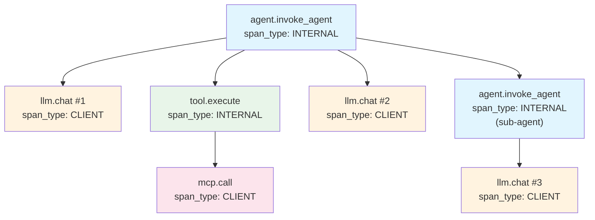

# OpenTelemetry GenAI — Tracing Tool Calls End-to-End

## Learning Objectives

- Name the required OTel GenAI semantic convention attributes for LLM spans and tool-execution spans.
- Build a nested trace hierarchy (agent → LLM → tool → MCP call) using the OpenTelemetry Python SDK.
- Configure a span processor that redacts PII from tool-call arguments before export.
- Compare head-based and tail-based sampling strategies for production agent workloads.
- Diagnose a failing multi-tool agent loop from an exported trace.

## The Problem

A GTM operations team runs a six-step enrichment waterfall on every new lead: Clay lookup → LLM classification → web scrape → CRM write → Slack notification → email send. One lead takes 45 seconds; the next takes 3 seconds. The CRM shows intermittent write failures. Slack messages sometimes arrive twice. The team has `print()` statements scattered across four scripts, and correlating a single lead's journey across those logs is manual, error-prone work.

This is the observability gap that matters at production scale. When an agent calls three tools in sequence and returns a wrong answer, you need to know *which call* failed and *what arguments it passed downstream*. Without end-to-end tracing, you reconstruct the chain from timestamped log lines, hoping the clocks agree. When the chain crosses process boundaries — a Python orchestrator calling an MCP server running in a separate container — log correlation breaks entirely.

OpenTelemetry's GenAI semantic conventions address this directly. They define a standard schema for capturing the full chain as a single trace: model invocation, tool selection, tool execution, sub-agent dispatch, and final response. The conventions settled through 2025–2026 under the OpenTelemetry semantic-conventions working group, and backends like Datadog, Langfuse, Arize Phoenix, and Grafana Tempo all parse the same attribute names. Instrument once; ship anywhere.

## The Concept

OpenTelemetry has three primitives: **traces**, **spans**, and **span attributes**. A trace is the complete journey of a single request through your system, identified by a 128-bit trace ID. A span is a single named, timestamped operation within that trace — it carries a span ID, a parent span ID, a start time, an end time, and a set of key-value attributes. A trace is just a tree of spans connected by parent-child relationships.

The GenAI semantic conventions layer on top of this by defining *which attributes belong on which span type*. An LLM span carries `gen_ai.system`, `gen_ai.request.model`, `gen_ai.usage.input_tokens`, `gen_ai.usage.output_tokens`, and `gen_ai.response.finish_reason`. A tool-execution span carries `gen_ai.tool.name`, `gen_ai.tool.arguments`, and `gen_ai.tool.result`. These names are not arbitrary — they are the stable contract that lets any OTel-compatible backend render a meaningful UI for agent traces without custom parsing.



Contrast this with ad-hoc `print()` debugging. A log line lives in one process's stdout, carries whatever format the developer chose that day, and disappears when the container restarts. A span survives across process boundaries via context propagation (W3C TraceContext headers), carries structured metadata that any backend can index and filter, and aggregates in a datastore where you can query it days later. The tradeoff is setup cost: you need a tracer provider, a span processor, an exporter, and a backend to receive the data.

One important caveat: the GenAI semantic conventions are still evolving. The attributes referenced here are stable as of semconv `1.28+` through the latest releases heading into late 2025, but specific attribute names may shift before full stabilization. The OTel Python SDK and the semconv Python package version-pin these definitions, so lock your versions and check the changelog when upgrading.

## Build It

Start by installing the OTel SDK packages. These are the official Python distributions from the OpenTelemetry project — no vendor lock-in yet.

```bash
pip install opentelemetry-api opentelemetry-sdk opentelemetry-exporter-otlp
```

Now build a minimal tracer provider that emits spans to the console. This uses `ConsoleSpanExporter`, which prints the serialized span JSON to stdout. No backend required — you can see the trace structure immediately.

```python
from opentelemetry import trace
from opentelemetry.sdk.trace import TracerProvider
from opentelemetry.sdk.trace.export import ConsoleSpanExporter, SimpleSpanProcessor
from opentelemetry.trace.status import Status, StatusCode
import json
import time

trace.set_tracer_provider(TracerProvider())
tracer = trace.get_tracer("gtm.agent.v1")

processor = SimpleSpanProcessor(ConsoleSpanExporter())
trace.get_tracer_provider().add_span_processor(processor)

def llm_chat(model_name, messages):
    with tracer.start_as_current_span(
        "llm.chat",
        kind=trace.SpanKind.CLIENT,
    ) as span:
        span.set_attribute("gen_ai.system", "openai")
        span.set_attribute("gen_ai.request.model", model_name)
        span.set_attribute("gen_ai.operation.name", "chat")

        input_tokens = sum(len(m.get("content", "").split()) for m in messages)
        response_text = f"Classification result for: {messages[-1]['content'][:40]}"
        output_tokens = len(response_text.split())

        span.set_attribute("gen_ai.usage.input_tokens", input_tokens)
        span.set_attribute("gen_ai.usage.output_tokens", output_tokens)
        span.set_attribute("gen_ai.response.finish_reason", "stop")
        span.set_attribute("gen_ai.response.text", response_text)

        return response_text

def execute_tool(tool_name, arguments):
    with tracer.start_as_current_span(
        "tool.execute",
        kind=trace.SpanKind.INTERNAL,
    ) as span:
        span.set_attribute("gen_ai.tool.name", tool_name)
        span.set_attribute("gen_ai.tool.arguments", json.dumps(arguments))

        time.sleep(0.15)

        if tool_name == "crm_write":
            result = {"status": "created", "record_id": "rec_8842"}
        elif tool_name == "web_scrape":
            result = {"title": "Acme Corp — About Page", "word_count": 1240}
        else:
            result = {"status": "ok"}

        span.set_attribute("gen_ai.tool.result", json.dumps(result))
        return result

with tracer.start_as_current_span(
    "agent.invoke_agent",
    kind=trace.SpanKind.INTERNAL,
) as agent_span:
    agent_span.set_attribute("gen_ai.agent.name", "gtm-enrichment-agent")

    messages = [{"role": "user", "content": "Enrich lead: jordan@acme.com, SaaS, 50 employees"}]

    llm_response = llm_chat("gpt-4o", messages)
    scrape_result = execute_tool("web_scrape", {"url": "https://acme.com/about"})
    crm_result = execute_tool("crm_write", {"email": "jordan@acme.com", "company": "Acme"})
    final_response = llm_chat("gpt-4o", messages + [{"role": "assistant", "content": llm_response}])

    agent_span.set_attribute("agent.final_response", final_response)

print("\n--- Trace exported above ---")
print(f"Trace ID visible in span output. All 4 child spans nest under agent.invoke_agent.")
```

When you run this, the console exporter prints each span as it closes. You will see five spans: one `agent.invoke_agent` (the root), two `llm.chat` spans, and two `tool.execute` spans. Each carries a `parent_span_id` field that links it back to the agent span. The `trace_id` is identical across all five — that is what makes them a single trace.

## Use It

In a GTM enrichment waterfall — the multi-step pipeline that takes a raw lead email and produces a enriched CRM record — every tool call is a span. When a Clay table lookup feeds an LLM classification, which feeds a web scrape, which feeds a CRM write, the trace captures the full chain. This is Pipeline Operations, Zone 3 in the GTM infrastructure map [CITATION NEEDED — concept: Zone 3 Pipeline Operations mapping]. Observability here is not a nice-to-have; it is how you find the slow step, the failing API call, and the token burn.

The GenAI semantic conventions make this practical because they standardize the attributes. When you set `gen_ai.response.finish_reason` to `"length"` instead of `"stop"`, any backend renders that as a truncated response — you do not need to teach your dashboard what "length" means. When you set `gen_ai.usage.input_tokens`, the backend can compute cost per trace without a custom parser. This is the mechanism by which instrumenting once lets you switch backends.

The redaction problem is real in GTM contexts. A tool-call argument containing `{"email": "jordan@acme.com", "phone": "+1-555-0100"}` becomes a span attribute, which gets exported to your tracing backend, which may be a third-party SaaS. The default should be to redact or hash PII before it lands on the span. The OTel SDK does not do this automatically — you build it as a span processor.

```python
from opentelemetry.sdk.trace import SpanProcessor
from opentelemetry.trace import Span
import re
import hashlib

EMAIL_RE = re.compile(r'\b[A-Za-z0-9._%+-]+@[A-Za-z0-9.-]+\.[A-Z|a-z]{2,}\b')
PHONE_RE = re.compile(r'\+1-\d{3}-\d{4}')

def redact_pii(value: str) -> str:
    def hash_email(match):
        email = match.group(0)
        h = hashlib.sha256(email.encode()).hexdigest()[:8]
        return f"[email:{h}]"

    value = EMAIL_RE.sub(hash_email, value)
    value = PHONE_RE.sub("[phone:REDACTED]", value)
    return value

class PIIRedactionProcessor(SpanProcessor):
    def on_start(self, span, parent_context=None):
        pass

    def on_end(self, span):
        redactable_keys = {
            "gen_ai.tool.arguments",
            "gen_ai.tool.result",
            "gen_ai.response.text",
            "gen_ai.prompt.text",
        }
        for attr_key in list(span.attributes.keys()):
            if attr_key in redactable_keys:
                original = span.attributes[attr_key]
                if isinstance(original, str):
                    span.set_attribute(attr_key, redact_pii(original))

    def shutdown(self):
        pass

    def force_flush(self, timeout_millis=30000):
        return True

trace.set_tracer_provider(TracerProvider())
tracer = trace.get_tracer("gtm.agent.v2")

exporter = ConsoleSpanExporter()
batch_processor = SimpleSpanProcessor(exporter)
redaction_processor = PIIRedactionProcessor()

trace.get_tracer_provider().add_span_processor(redaction_processor)
trace.get_tracer_provider().add_span_processor(batch_processor)

with tracer.start_as_current_span("agent.invoke_agent") as agent_span:
    agent_span.set_attribute("gen_ai.agent.name", "enrichment-agent")

    with tracer.start_as_current_span("tool.execute") as tool_span:
        tool_span.set_attribute(
            "gen_ai.tool.arguments",
            '{"email": "jordan@acme.com", "phone": "+1-555-0100", "company": "Acme Corp"}'
        )
        tool_span.set_attribute(
            "gen_ai.tool.result",
            '{"status": "created", "contact_email": "jordan@acme.com"}'
        )

print("\n--- Redacted trace exported above ---")
print("Check: email addresses are hashed, phone numbers are [phone:REDACTED]")
```

Run this and inspect the console output. The `gen_ai.tool.arguments` and `gen_ai.tool.result` attributes now show `[email:hashed_value]` and `[phone:REDACTED]` instead of raw PII. The span processor runs on `on_end`, after the span is fully populated but before the exporter serializes it. This is the correct insertion point because it catches all attributes regardless of where they were set.

## Ship It

Moving from local console output to a production backend changes the operational surface area. You need a sampling strategy (you cannot export every span at high volume), an exporter configuration (OTLP/gRPC vs OTLP/HTTP), and cardinality discipline (unbounded attribute values will tank your backend's query performance). These are Zone 3 concerns — the same zone as deployment and CI/CD infrastructure for GTM pipelines [CITATION NEEDED — concept: Zone 13 Deployment Infrastructure mapping to observability].

**Sampling**: head-based sampling decides at trace start whether to export, using a fixed ratio (e.g., 10% of traces). It is cheap and deterministic but blind to outcomes — it will drop the interesting error traces at the same rate as boring successes. Tail-based sampling inspects the completed trace before deciding, so you can keep 100% of traces with `gen_ai.response.finish_reason == "error"` and sample the rest at 5%. The tradeoff is memory: the collector must buffer the full trace before deciding. For GTM enrichment pipelines where error rates are low but each error is expensive to debug, tail-based sampling with an error-first rule is the right default.

**Exporter**: OTLP/gRPC is the default for most backends and handles high throughput well. OTLP/HTTP is simpler to firewall (single port, standard HTTP) and works better behind corporate proxies that block gRPC. Both serialize the same protobuf payloads — the choice is transport, not data model.

**Cardinality hygiene**: this is where production tracing silently fails. If you set `gen_ai.tool.arguments` to the raw user input on every span, and user input contains free-text queries, you create a unique attribute value per request. Your backend builds an index entry for each, and memory grows unbounded. The fix: hash, truncate, or bucket. Store the first 50 characters, or hash to a fixed-length identifier, or extract a category label instead of raw text.

```python
from opentelemetry import trace
from opentelemetry.sdk.trace import TracerProvider
from opentelemetry.sdk.trace.export import BatchSpanProcessor, ConsoleSpanExporter
from opentelemetry.sdk.resources import Resource
from opentelemetry.sdk.trace.sampling import TraceIdRatioBased
import time
import random

resource = Resource.create({
    "service.name": "gtm-enrichment-agent",
    "service.version": "1.4.0",
    "deployment.environment": "production",
})

sampler = TraceIdRatioBased(0.1)

provider = TracerProvider(resource=resource, sampler=sampler)
batch_processor = BatchSpanProcessor(
    ConsoleSpanExporter(),
    max_queue_size=2048,
    max_export_batch_size=512,
    export_timeout_millis=30000,
)
provider.add_span_processor(batch_processor)

trace.set_tracer_provider(provider)
tracer = trace.get_tracer("gtm.agent.production")

def truncate_for_cardinality(text: str, max_len: int = 80) -> str:
    if len(text) <= max_len:
        return text
    return text[:max_len] + "...[truncated]"

ERROR_MESSAGES = [
    "Tool execution failed: connection timeout to MCP server",
    "Tool execution failed: rate limit exceeded (429)",
    "Tool execution succeeded",
]

for i in range(10):
    with tracer.start_as_current_span("agent.invoke_agent") as agent_span:
        agent_span.set_attribute("gen_ai.agent.name", "enrichment-agent")
        agent_span.set_attribute("lead.batch_id", f"batch_{i // 3}")

        with tracer.start_as_current_span("llm.chat", kind=trace.SpanKind.CLIENT) as llm_span:
            llm_span.set_attribute("gen_ai.system", "openai")
            llm_span.set_attribute("gen_ai.request.model", "gpt-4o")
            llm_span.set_attribute("gen_ai.usage.input_tokens", random.randint(50, 200))
            llm_span.set_attribute("gen_ai.usage.output_tokens", random.randint(20, 100))

            if random.random() < 0.2:
                llm_span.set_attribute("gen_ai.response.finish_reason", "length")
                llm_span.set_status(Status(StatusCode.ERROR, "Response truncated"))
            else:
                llm_span.set_attribute("gen_ai.response.finish_reason", "stop")

        with tracer.start_as_current_span("tool.execute") as tool_span:
            raw_input = f"Enrich lead from source: campaign_{random.randint(1000, 9999)} extra context: " + "x" * 200
            tool_span.set_attribute("gen_ai.tool.name", "crm_write")
            tool_span.set_attribute("gen_ai.tool.arguments", truncate_for_cardinality(raw_input))
            tool_span.set_attribute("gen_ai.tool.result", random.choice(ERROR_MESSAGES))

        time.sleep(0.05)

print("\n--- Production trace batch exported ---")
print(f"Sampler ratio: 0.1 (roughly 1 of 10 traces exported)")
print(f"Batch processor: queues spans, exports in batches of 512")
print("Cardinality: arguments truncated to 80 chars, batch_id bucketed")
```

Run this and observe: roughly one in ten traces appears in the console output (the sampler drops the rest). The `lead.batch_id` attribute is bucketed to three values — `batch_0`, `batch_1`, `batch_2` — not ten unique values. The tool arguments are truncated, preventing unbounded cardinality from the variable-length input string. This is the shape of a production configuration.

**What to alert on**: start with two signals. First, `gen_ai.response.finish_reason` in `["length", "error", "content_filter"]` — these indicate the model did not complete normally, and in a GTM pipeline they usually mean the enrichment step produced garbage downstream. Second, tool-call latency at the 95th percentile — if `tool.execute` spans for `crm_write` suddenly jump from 200ms to 5s, your CRM API is degraded or rate-limited. These two alerts catch the majority of agent failures in practice. Add token-cost alerts (`gen_ai.usage.input_tokens + gen_ai.usage.output_tokens` summed per trace) once you have baseline data.

## Exercises

1. **Instrument a single LLM call.** Create a tracer provider with a `ConsoleSpanExporter`, wrap a single `llm_chat()` call in a span with `gen_ai.system`, `gen_ai.request.model`, `gen_ai.usage.input_tokens`, and `gen_ai.response.finish_reason` attributes. Print the trace ID from within the span context. Verify the trace ID appears in the exported JSON.

2. **Build a two-tool agent loop with nested spans.** Create an agent span as the root. Under it, call tool A (e.g., `web_scrape`), feed the result to tool B (e.g., `llm_classify`), and verify the parent-child relationship: both tool spans should show the agent span as their parent, and all three should share the same trace ID.

3. **Implement a span processor that redacts PII.** Write a `SpanProcessor` subclass that intercepts `gen_ai.tool.arguments` on `on_end`, applies regex-based redaction for email addresses and phone numbers, and replaces the attribute value. Test with a payload containing `{"email": "prospect@company.com", "phone": "+1-555-0199"}` and confirm the exported span shows redacted values.

4. **Diagnose a simulated failure.** Modify the production example to force `crm_write` to fail 30% of the time (set `gen_ai.tool.result` to an error JSON and set span status to ERROR). Run 20 iterations. From the exported traces, identify which traces contain the error and compute the ratio programmatically from the span attributes.

5. **Compare sampling strategies.** Run the same 50-iteration loop with `TraceIdRatioBased(1.0)` and then with `TraceIdRatioBased(0.1)`. Count exported spans in each case. Write a brief note on why head-based sampling alone is insufficient if you need to capture 100% of error traces.

## Key Terms

- **Trace**: A directed acyclic graph of spans sharing a single 128-bit trace ID, representing one complete request through a distributed system.
- **Span**: A named, timestamped operation within a trace. Carries a span ID, parent span ID, start/end timestamps, and key-value attributes.
- **Span attributes**: Key-value metadata attached to a span. GenAI semantic conventions define standard attribute names like `gen_ai.request.model` and `gen_ai.tool.name`.
- **Semantic conventions**: The OTel spec defining stable attribute names for specific domains (GenAI, HTTP, database, etc.). Versioned in the `opentelemetry-semconv` package.
- **Context propagation**: The mechanism (typically W3C TraceContext HTTP headers) by which trace context crosses process boundaries, linking spans from different services into one trace.
- **Span processor**: A hook in the OTel SDK pipeline that runs custom logic on each span (e.g., redaction, filtering, enrichment) before the exporter serializes it.
- **Head-based sampling**: A sampling strategy that decides at trace start whether to export, using a fixed ratio. Cheap but outcome-blind.
- **Tail-based sampling**: A sampling strategy that inspects the completed trace before deciding. Can prioritize error traces but requires buffering.
- **Cardinality**: The number of unique values an attribute can take. High-cardinality attributes (e.g., raw user input) cause unbounded index growth in tracing backends.

## Sources

- [OpenTelemetry Semantic Conventions for GenAI — stable attributes list](https://opentelemetry.io/docs/specs/semconv/gen-ai/) — OpenTelemetry documentation, GenAI semantic conventions
- [OpenTelemetry Python SDK — TracerProvider, SpanProcessor, exporters](https://opentelemetry.io/docs/languages/python/) — OpenTelemetry Python instrumentation guide
- [W3C TraceContext — propagating trace context across process boundaries](https://www.w3.org/TR/trace-context/) — W3C Recommendation
- [CITATION NEEDED — concept: Zone 3 Pipeline Operations mapping to GTM enrichment waterfalls] — requires cross-reference to `stages/00-b-gtm-content-mapping/output/gtm-topic-map.md`
- [CITATION NEEDED — concept: Zone 13 Deployment Infrastructure relationship to production observability] — requires cross-reference to `stages/00-b-gtm-content-mapping/output/gtm-topic-map.md`
- [CITATION NEEDED — concept: Clay waterfall as multi-step enrichment pipeline with tool-call spans] — requires GTM-specific source on Clay enrichment architecture