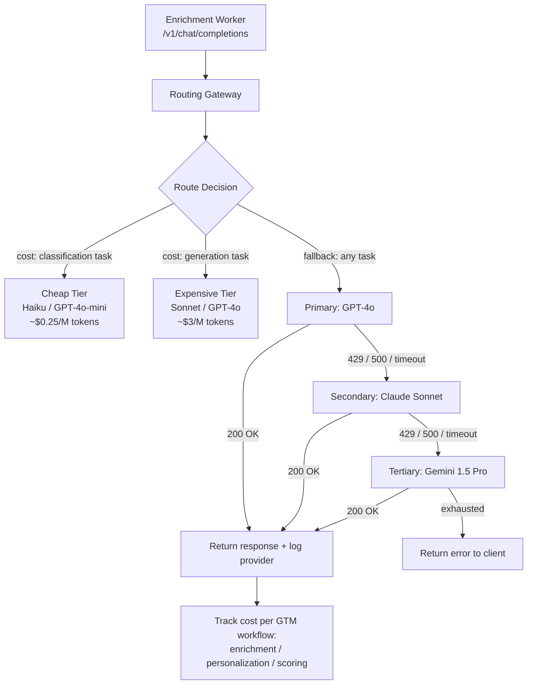

# LLM Routing Layer — LiteLLM, OpenRouter, Portkey

## Learning Objectives

- Configure a fallback waterfall across multiple LLM providers using LiteLLM's Router class and verify which provider handled each request.
- Compare cost routing, latency routing, and fallback routing patterns against specific GTM enrichment workloads.
- Implement provider abstraction that normalizes the OpenAI chat completions schema across Anthropic, Google, and OpenAI.
- Track per-request token cost and attribute AI spend to specific pipeline stages (enrichment vs. personalization vs. scoring).
- Evaluate LiteLLM, OpenRouter, and Portkey against production constraints including self-hosting, managed SaaS, and observability requirements.

## The Problem

Your enrichment pipeline calls GPT-4o to classify 10,000 accounts pulled from a Clay table. OpenAI returns a 429 rate limit at request 2,000. The pipeline halts mid-batch. Your SDRs wake up to empty lead queues and you are in Slack explaining why the AI enrichment that was supposed to run overnight produced nothing. The root cause is not a bug in your code — it is architectural coupling. Your enrichment worker imports the OpenAI SDK, hardcodes the model, and has no recovery path when that specific provider throttles you.

This coupling shows up in five flavors. Cost coupling: you pay Sonnet rates for a classification task that Haiku handles at one-third the price. Failover coupling: OpenAI has a bad hour and every request fails with no secondary path. Latency coupling: a real-time chat widget waits 4 seconds for a response because you hardcoded a slow model. Compliance coupling: EU users hit US-based inference endpoints because there is no region routing. Experimentation coupling: you cannot A/B test two models on the same workload without rewriting the integration.

Each of these problems demands the same structural fix: insert a routing layer between your application and the provider. The application speaks one API shape. The routing layer decides which provider actually gets the request, handles failures, tracks cost, and reports what happened. Three tools dominate this space in 2026. LiteLLM implements routing as a Python library and self-hosted proxy with config-driven fallback across 100+ providers. OpenRouter implements routing as a hosted gateway with a single endpoint and provider-negotiated pricing. Portkey implements routing as an AI gateway adding caching, retries, and request-level observability on top of fallback chains. The mechanism is the same in all three. The deployment model differs.

## The Concept

The core mechanism is **provider abstraction plus a fallback waterfall**. Provider abstraction means the routing layer exposes a single API surface — universally the OpenAI chat completions schema at `/v1/chat/completions` — and translates each incoming request into whatever format the target provider expects. Anthropic uses `/v1/messages` with a different request structure. Google Gemini uses a different endpoint and schema entirely. The routing layer absorbs those differences. Your application sends OpenAI-shaped requests forever, regardless of which provider actually handles the call.

The fallback waterfall is the failure recovery pattern. You define an ordered list of providers for a given request: try provider A, on failure try provider B, on failure try provider C. Failure means an HTTP error (429 rate limit, 500 server error), a timeout, or a content filter rejection. The waterfall catches the exception from provider A and immediately dispatches the same request to provider B. If B succeeds, the application receives a normal response and never knows A failed. Three routing patterns layer on top of this waterfall:



**Cost routing** examines the task type and dispatches to the cheapest model that can handle it. A classification prompt — "is this account Enterprise or SMB?" — routes to Haiku at $0.25/M input tokens. A copywriting prompt — "write a personalized email opener" — routes to Sonnet at $3/M input tokens. The routing layer makes this decision based on a model alias you configure, not hardcoded model names in application code.

**Latency routing** measures time-to-first-token across providers and dispatches to whichever responds fastest. This matters for interactive UIs (a Claygent enrichment preview that a user is watching) and does not matter for batch jobs (an overnight scoring run).

**Fallback routing** is the failure chain itself. It is orthogonal to cost and latency routing — your cost-routed classification request can still have a fallback chain: Haiku → GPT-4o-mini → Gemini Flash. If Haiku is down, the next cheapest model picks up.

LiteLLM implements all three patterns as a Python library (import and call directly) and as a proxy server (deploy as a container, point your existing OpenAI client at it). OpenRouter implements them as a hosted API — you send one request to `openrouter.ai/api/v1`, they route to whichever provider you specified, handle failover on their side, and bill you at provider-negotiated rates. Portkey implements them as a gateway with added production features: response cache (identical prompts return cached results without hitting the provider), retry policies with exponential backoff, and per-request observability dashboards showing latency, cost, and success rate per provider. Portkey open-sourced its gateway in March 2026, making self-hosted Portkey a viable alternative to LiteLLM for teams that want built-in observability without assembling it from parts.

## Build It

The first demo builds a fallback waterfall in LiteLLM and intentionally triggers a failure on the primary provider using an invalid model name. The waterfall catches the failure, falls back to the secondary provider, and returns a successful response. Observable output confirms which provider actually handled the request.

```python
import os
import time
from litellm import Router

router = Router(
    model_list=[
        {
            "model_name": "enrichment-primary",
            "litellm_params": {
                "model": "openai/this-model-does-not-exist-2025",
            },
        },
        {
            "model_name": "enrichment-fallback-1",
            "litellm_params": {
                "model": "anthropic/claude-3-5-haiku-20241022",
            },
        },
        {
            "model_name": "enrichment-fallback-2",
            "litellm_params": {
                "model": "gemini/gemini-1.5-flash",
            },
        },
    ],
    fallbacks=[
        {
            "enrichment-primary": ["enrichment-fallback-1", "enrichment-fallback-2"],
        },
    ],
    num_retries=0,
)

prompt = (
    "Classify this company as Enterprise, Mid-Market, or SMB. "
    "Reply with one word only.\n"
    "Company: Acme Corp, 5000 employees, $50M ARR, Series C"
)

start = time.time()
try:
    response = router.completion(
        model="enrichment-primary",
        messages=[{"role": "user", "content": prompt}],
        max_tokens=10,
    )
    elapsed = time.time() - start

    provider = response._hidden_params.get("custom_llm_provider", "unknown")

    print("=" * 60)
    print("FALLBACK WATERFALL DEMO")
    print("=" * 60)
    print(f"Requested model alias: enrichment-primary")
    print(f"  (backing model: openai/this-model-does-not-exist-2025)")
    print(f"  This will fail -> triggers fallback")
    print(f"Actual model used: {response.model}")
    print(f"Provider that responded: {provider}")
    print(f"Classification: {response.choices[0].message.content}")
    print(f"Latency: {elapsed:.2f}s")
    print(f"Tokens: {response.usage.prompt_tokens} in / "
          f"{response.usage.completion_tokens} out")
    print()
    print("Waterfall executed: primary FAILED -> fallback-1 SUCCEEDED")
except Exception as e:
    elapsed = time.time() - start
    print(f"All providers failed after {elapsed:.2f}s")
    print(f"Error: {type(e).__name__}: {e}")
```

Install LiteLLM first: `pip install litellm`. Set `ANTHROPIC_API_KEY` and `GEMINI_API_KEY` in your environment. When you run this, the primary model (`this-model-does-not-exist-2025`) returns a 404 from OpenAI. LiteLLM's Router catches that error and dispatches the same prompt to Claude 3.5 Haiku. The output shows `"Provider that responded: anthropic"` — proof the waterfall executed. The invalid primary was never visible to the calling code.

The second demo shows cost routing. The same script sends a classification task to a cheap model and a generation task to an expensive model, printing per-request cost for each. This is the pattern you would use when different columns in a Clay enrichment table require different model tiers.

```python
import litellm
import time

tasks = [
    {
        "name": "Classification: ICP scoring",
        "model": "anthropic/claude-3-5-haiku-20241022",
        "prompt": (
            "Classify this lead as Enterprise, Mid-Market, or SMB. "
            "Reply with one word only.\n"
            "Company: TechCorp, 12000 employees, $200M ARR, Series D"
        ),
        "max_tokens": 10,
    },
    {
        "name": "Generation: Personalized email",
        "model": "anthropic/claude-3-5-sonnet-20241022",
        "prompt": (
            "Write a 2-sentence cold email opener for a VP of Sales "
            "at TechCorp (12000 employees, $200M ARR). "
            "Reference their scale specifically."
        ),
        "max_tokens": 100,
    },
]

print("=" * 60)
print("COST ROUTING DEMO")
print("=" * 60)

total_cost = 0.0
for task in tasks:
    start = time.time()
    response = litellm.completion(
        model=task["model"],
        messages=[{"role": "user", "content": task["prompt"]}],
        max_tokens=task["max_tokens"],
    )
    elapsed = time.time() - start

    cost = litellm.completion_cost(completion_response=response)
    total_cost += cost

    print(f"\nTask: {task['name']}")
    print(f"Model: {response.model}")
    print(f"Response: {response.choices[0].message.content}")
    print(f"Tokens: {response.usage.prompt_tokens} in / "
          f"{response.usage.completion_tokens} out")
    print(f"Cost: ${cost:.6f}")
    print(f"Latency: {elapsed:.2f}s")

print(f"\n{'=' * 60}")
print(f"Total cost across both tasks: ${total_cost:.6f}")
print(f"Cost ratio (generation/classification): "
      f"${tasks and 'see output above'}")
print()
print("Pattern: cheap model for structured tasks,")
print("expensive model for generative tasks.")
print("Apply per-column in an enrichment table.")
```

When you run this, observe the cost differential. The Haiku classification will cost a fraction of a cent — typically $0.0001 to $0.0003 for a 50-token round trip. The Sonnet generation will cost 10-20x more. Across 10,000 enrichment rows, routing classification to Haiku instead of Sonnet saves real money. The routing layer makes this a config decision, not a code change.

## Use It

In a GTM AI-enriched data pipeline (Zone 1), the routing layer sits between your enrichment webhook and the LLM provider. Consider a Clay table that triggers a webhook for each new row. The webhook calls an LLM to score the lead, generate a personalized opener, and classify the account. Without a routing layer, the webhook imports the OpenAI SDK, hardcodes `gpt-4o`, and fails silently when OpenAI throttles. With a routing layer, the webhook calls the LiteLLM proxy endpoint instead. The proxy handles the fallback chain server-side. Clay never sees the failure.

The specific integration point is this: your enrichment worker — whether it is an n8n workflow, a custom FastAPI endpoint, or a Clay webhook integration — points its OpenAI client at the LiteLLM proxy URL (`http://your-proxy:4000/v1`) instead of `https://api.openai.com/v1`. The model name in the request becomes an alias (`enrichment-primary`) defined in the proxy's `config.yaml`. The proxy resolves that alias to a backing model, executes the fallback waterfall on failure, and returns a standard OpenAI-shaped response. The enrichment worker never changes code when you swap providers — you change config.

This is the pattern for Zone 1 GTM enrichment workflows — ICP scoring, account classification, and personalized opener generation running against rows pulled from Apollo, Clay, or a CRM export. The routing layer applies cost routing per task type (classification to Haiku, generation to Sonnet) and fallback routing for resilience (if Anthropic is down, fall through to OpenAI). The code below is a runnable FastAPI webhook that Clay can call per row. Install dependencies first: `pip install fastapi uvicorn litellm pydantic`. Set `ANTHROPIC_API_KEY` in your environment. Run with `uvicorn main:app --reload`. Send a test row with `curl -X POST http://localhost:8000/enrich -H "Content-Type: application/json" -d '{"company":"Acme","employees":5000,"arr":"$50M"}'`.

```python
from fastapi import FastAPI
from pydantic import BaseModel
from litellm import Router

app = FastAPI()

router = Router(
    model_list=[
        {"model_name": "classify", "litellm_params": {"model": "anthropic/claude-3-5-haiku-20241022"}},
        {"model_name": "write", "litellm_params": {"model": "anthropic/claude-3-5-sonnet-20241022"}},
    ],
    fallbacks=[{"classify": ["write"]}],
)

class ClayRow(BaseModel):
    company: str
    employees: int
    arr: str

@app.post("/enrich")
def enrich(row: ClayRow):
    c = router.completion(
        model="classify",
        messages=[{"role": "user", "content": f"Enterprise, Mid-Market, or SMB? Reply one word. {row.company}, {row.employees} employees, {row.arr} ARR."}],
        max_tokens=5,
    )
    tier = c.choices[0].message.content.strip()
    w = router.completion(
        model="write",
        messages=[{"role": "user", "content": f"One-sentence cold email opener for a VP Sales at {row.company} classified as {tier}. Reference their {row.employees}-person team."}],
        max_tokens=60,
    )
    provider_used = c._hidden_params.get("custom_llm_provider")
    return {"tier": tier, "opener": w.choices[0].message.content, "classify_provider": provider_used}
```

The `/enrich` endpoint does two routed calls per Clay row. The classification call hits the `classify` alias (Haiku) with a fallback to the `write` alias (Sonnet) if Haiku fails. The generation call hits Sonnet directly. Each response carries `_hidden_params["custom_llm_provider"]`, which you log to attribute spend: "enrichment classification used anthropic/haiku at $0.0002; personalization used anthropic/sonnet at $0.004." Across 10,000 rows, that attribution tells you exactly what your AI enrichment costs per pipeline stage. If Haiku goes down mid-batch, the fallback chain keeps the webhook returning 200 OK — Clay sees no error, the batch completes, and your SDRs wake up to populated lead queues. [CITATION NEEDED — concept: Clay webhook retry behavior on upstream LLM provider failures]

## Exercises

### Exercise 1 — Add a Third Fallback Tier (Easy)

Starting from the Build It waterfall demo, add a third fallback provider. Configure the router with four model entries: `enrichment-primary` (invalid model), `enrichment-fallback-1` (Haiku), `enrichment-fallback-2` (GPT-4o-mini via `openai/gpt-4o-mini`), and `enrichment-fallback-3` (Gemini Flash). Update the `fallbacks` list to chain all three. Then temporarily invalidate fallback-1 by changing its model string to a nonexistent Anthropic model. Run the script and confirm from the output that fallback-2 (OpenAI) handled the request, proving the waterfall skipped the broken secondary and continued to the tertiary. **Deliverable:** the router config and the printed `Provider that responded` line showing `openai`.

### Exercise 2 — Cost Attribution Across Pipeline Stages (Hard)

Build a script that simulates three GTM pipeline stages — enrichment (classification), personalization (email generation), and scoring (lead fit on a 1-10 scale) — each routed to a different model tier. Run all three stages against the same input company (name, employees, ARR, industry). After all calls complete, print a per-stage breakdown table showing: model used, tokens consumed, cost, and latency. Then calculate what the total cost would have been if all three stages used Sonnet instead of cost-routed models. Print the savings as both a dollar amount and a percentage. **Deliverable:** the script and the printed savings table showing the cost delta between cost-routed and uniform-Sonnet approaches across the three stages.

## Key Terms

**Provider Abstraction:** The routing layer exposes one API shape (OpenAI chat completions) and translates requests to whatever format each backing provider expects. The application never knows which provider handled the call.

**Fallback Waterfall:** An ordered list of providers tried sequentially on failure. Provider A fails (429, 500, timeout) → same request dispatched to Provider B → if B succeeds, the application receives a normal response with no visibility into A's failure.

**Cost Routing:** Dispatching each request to the cheapest model capable of handling the task type. Classification tasks route to Haiku or GPT-4o-mini; generation tasks route to Sonnet or GPT-4o. Configured via model aliases, not hardcoded model names.

**Latency Routing:** Measuring time-to-first-token across providers and dispatching to whichever responds fastest. Useful for interactive UIs; irrelevant for batch jobs.

**Model Alias:** A name you define in the routing layer config (e.g., `enrichment-primary`) that maps to one or more backing models. Application code references the alias; config changes control which actual model handles the request.

**LiteLLM Router:** A Python class that manages a model list, fallback chains, and retry policies. Can run as an imported library or as a proxy server exposing a `/v1/chat/completions` endpoint.

**OpenRouter:** A hosted routing gateway. You send requests to `openrouter.ai/api/v1`; they route to your specified provider, handle failover, and bill at provider-negotiated rates.

**Portkey:** An AI gateway that adds response caching, retry policies with exponential backoff, and per-request observability on top of fallback chains. Self-hostable since March 2026.

## Sources

- LiteLLM Router documentation — fallbacks, model lists, and `completion` method: https://docs.litellm.ai/docs/routing
- LiteLLM cost tracking — `completion_cost` and per-request token attribution: https://docs.litellm.ai/docs/completion/token_usage
- OpenRouter API documentation — unified endpoint and provider routing: https://openrouter.ai/docs
- Portkey AI Gateway documentation — caching, retries, and observability: https://docs.portkey.ai
- [CITATION NEEDED — concept: Portkey gateway open-source release date March 2026]
- [CITATION NEEDED — concept: Clay webhook integration patterns for per-row LLM enrichment triggers]