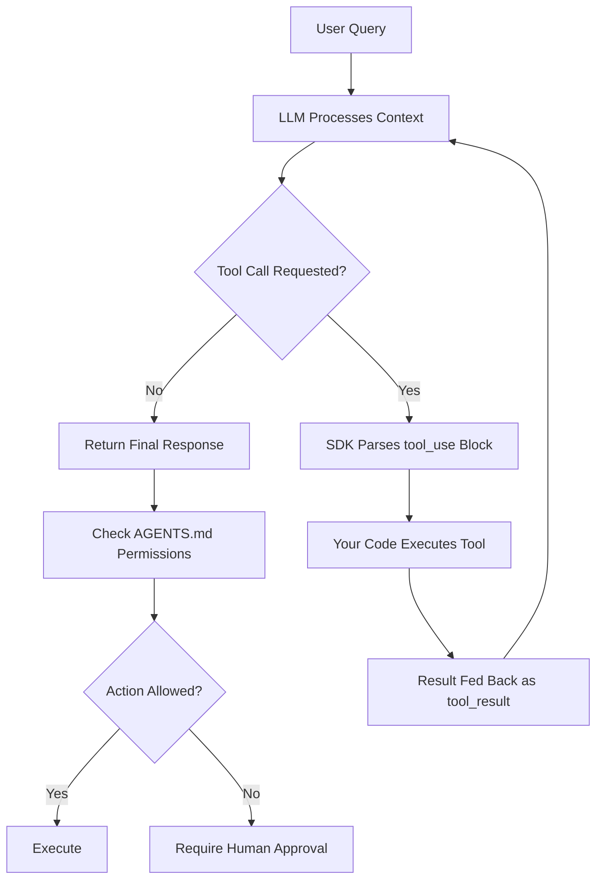

# Skills and Agent SDKs — Anthropic Skills, AGENTS.md, OpenAI Apps SDK

## Learning Objectives

- Implement a tool-calling loop in both the Anthropic Messages API and the OpenAI function-calling API, tracing the control flow from tool invocation through result feedback to final response.
- Write an `AGENTS.md` file that declares project context, capabilities, and permissions, then parse it programmatically to validate the schema.
- Distinguish three layers of agent specification — execution loop (SDK), reusable know-how (SKILL.md), and declarative permissions (AGENTS.md) — and explain when each applies.
- Build an enrichment agent that chains multiple data-provider tools using the SDK tool loop, halting when the model determines sufficient data has been collected.

## The Problem

You have an API key for an LLM. You have a set of tools — a company lookup endpoint, an email finder, a CRM writer. You can call the LLM, and you can call each tool independently. What you cannot do is let the LLM *decide* which tool to call, in what order, based on intermediate results. The raw API is stateless: you send a prompt, you get a response, the model forgets everything. There is no loop, no persistence, no mechanism for the model to yield control to your code, wait for a result, and resume reasoning.

This is the gap agent SDKs fill. An agent SDK wraps the orchestration cycle — model calls a tool, your code executes it, the result goes back to the model, the model decides what to do next — into a reusable abstraction. Without this loop, you would hand-write `if` statements chaining every possible tool sequence. With it, the model itself decides the next step, and your code just executes whatever it asks for and feeds results back.

The problem compounds when you want portability. A workflow distilled for Claude Code (via SKILL.md), for Cursor (via `.cursorrules`), and for Codex (via `.codex.md`) requires maintaining three copies of the same instructions. AGENTS.md — now present in over 60,000 repositories — addresses this by sitting at the repo root as a single file every compatible agent reads on session start. The three specs solve different layers of the same problem: how to bind tools, knowledge, and permissions to an agent in a way that travels.

## The Concept

Three specifications exist for agent-tool binding, and they operate at different layers. Conflating them is the most common mistake practitioners make when architecting an agent stack.

**Anthropic Skills** is a two-part system. The execution layer uses function declarations passed in the `tools` array of the Messages API. When Claude wants to call a tool, it returns a `tool_use` block and stops generation — yielding control back to your code. Your code executes the tool, sends the result as a `tool_result` in the next message, and Claude resumes. State lives on your side. The know-how layer, SKILL.md, packages reusable workflows as markdown with YAML frontmatter: a name, a description, and a body of instructions. Agents that support the skill format load them on demand by matching the description to the task. Progressive disclosure means the skill body can reference deeper subdirectories of context that are only loaded when relevant, keeping the context window lean.

**AGENTS.md** is a permission and context spec, not an execution engine. It sits at the repository root and is parsed by agent runtimes (Claude Code, Cursor, Codex CLI) at session start. It answers: What is this project? What conventions does it follow? What is the agent allowed to do without per-step human approval? The mechanism is simple — structured markdown — but the contract is powerful: any compatible agent in any IDE reads the same file and operates under the same constraints.

**OpenAI Apps SDK** (the evolution of the Assistants API into the Agents SDK) provides tool definitions, conversation threading, and a managed run loop. Tools are registered as `functions` on an assistant or agent object. The SDK handles the call-execute-feedback cycle, and conversation state can be persisted server-side via threads. The key architectural difference from Anthropic: OpenAI's framework can hold state server-side, so you do not need to pass the full message history on every turn. Anthropic's approach gives you more control but requires you to manage state yourself.



The diagram shows the shared loop all three specs participate in. The upper cycle — process, decide, execute, feed back — is the tool loop that Anthropic and OpenAI both implement. The lower decision gate — where AGENTS.md sits — is orthogonal to the loop itself. AGENTS.md does not execute tools. It declares whether the agent is *allowed* to, and under what conditions.

## Build It

Build the same minimal agent — look up a company's tech stack — in all three frameworks. Each example produces observable output so you can trace the loop.

### Anthropic Tool-Calling Loop

The Anthropic Messages API requires you to manage the loop yourself. The model returns a `stop_reason` of `tool_use` when it wants to call a tool, and you execute it, feed the result back, and call again.

```python
import anthropic
import json

client = anthropic.Anthropic()

tools = [
    {
        "name": "lookup_tech_stack",
        "description": "Look up a company's technology stack by domain.",
        "input_schema": {
            "type": "object",
            "properties": {
                "domain": {
                    "type": "string",
                    "description": "Company domain, e.g. stripe.com"
                }
            },
            "required": ["domain"]
        }
    }
]

def execute_tool(name, args):
    if name == "lookup_tech_stack":
        return {
            "domain": args["domain"],
            "stack": ["React", "TypeScript", "Node.js", "AWS", "Stripe"],
            "confidence": 0.92
        }
    return {"error": f"unknown tool: {name}"}

messages = [{"role": "user", "content": "What tech stack does stripe.com use?"}]

iteration = 0
while True:
    iteration += 1
    response = client.messages.create(
        model="claude-sonnet-4-20250514",
        max_tokens=1024,
        tools=tools,
        messages=messages
    )
    print(f"\n--- Iteration {iteration} ---")
    print(f"Stop reason: {response.stop_reason}")

    if response.stop_reason != "tool_use":
        for block in response.content:
            if hasattr(block, "text"):
                print(f"Final answer:\n{block.text}")
        break

    messages.append({"role": "assistant", "content": response.content})

    tool_results = []
    for block in response.content:
        if block.type == "tool_use":
            print(f"Tool call: {block.name}({json.dumps(block.input)})")
            result = execute_tool(block.name, block.input)
            print(f"Tool result: {json.dumps(result)}")
            tool_results.append({
                "type": "tool_result",
                "tool_use_id": block.id,
                "content": json.dumps(result)
            })

    messages.append({"role": "user", "content": tool_results})

print(f"\nTotal iterations: {iteration}")
print(f"Total messages exchanged: {len(messages)}")
```

Running this prints each loop iteration: the model requests the tool, your code executes it, the result goes back, and the model produces a final answer citing the data it received. The state — the full message array — lives in your process. If your script crashes, the conversation is gone unless you persisted it.

### OpenAI Function-Calling Loop

OpenAI's function-calling API uses a slightly different shape. Tools are typed as `"function"` and wrapped in an extra layer. The model returns `tool_calls` on the assistant message, each with a unique `tool_call_id` that you reference when returning results.

```python
from openai import OpenAI
import json

client = OpenAI()

tools = [
    {
        "type": "function",
        "function": {
            "name": "lookup_tech_stack",
            "description": "Look up a company's technology stack by domain.",
            "parameters": {
                "type": "object",
                "properties": {
                    "domain": {
                        "type": "string",
                        "description": "Company domain, e.g. stripe.com"
                    }
                },
                "required": ["domain"]
            }
        }
    }
]

def execute_tool(name, args):
    if name == "lookup_tech_stack":
        return {
            "domain": args["domain"],
            "stack": ["React", "Go", "GCP", "Stripe"],
            "confidence": 0.88
        }
    return {"error": f"unknown tool: {name}"}

messages = [{"role": "user", "content": "What tech stack does stripe.com use?"}]

iteration = 0
while True:
    iteration += 1
    response = client.chat.completions.create(
        model="gpt-4o",
        messages=messages,
        tools=tools
    )
    msg = response.choices[0].message
    finish = response.choices[0].finish_reason
    print(f"\n--- Iteration {iteration} ---")
    print(f"Finish reason: {finish}")

    if not msg.tool_calls:
        print(f"Final answer:\n{msg.content}")
        break

    messages.append(msg)

    for tool_call in msg.tool_calls:
        name = tool_call.function.name
        args = json.loads(tool_call.function.arguments)
        print(f"Tool call: {name}({json.dumps(args)})")
        result = execute_tool(name, args)
        print(f"Tool result: {json.dumps(result)}")
        messages.append({
            "role": "tool",
            "tool_call_id": tool_call.id,
            "content": json.dumps(result)
        })

print(f"\nTotal iterations: {iteration}")
```

The structural difference: OpenAI returns tool results as messages with `role: "tool"`, each keyed to a specific `tool_call_id`. Anthropic returns them as `tool_result` content blocks in a user message, keyed to a `tool_use_id`. Both implement the same loop. The choice between them comes down to where you want state to live and which ecosystem your other infrastructure targets.

### AGENTS.md Parser

AGENTS.md is not an execution engine — it is a declarative file that agent runtimes read. Build one, then write a parser that validates its structure.

First, the file itself:

```python
agents_md_content = """# AGENTS.md

## Description
GTM enrichment pipeline for B2B outbound. Scrapes company sites,
runs email waterfall, writes to CRM.

## Commands
- test: pytest tests/
- enrich: python -m pipeline.enrich --input leads.csv

## Capabilities
- web_scraper: Scrape company websites for firmographic data
- email_finder: Look up email addresses via provider waterfall
- crm_writer: Write or update records in the CRM

## Permissions
- web_scraper: ALLOW
- email_finder: ALLOW
- crm_writer: REQUIRE_APPROVAL

## Constraints
- Rate limit: 100 requests per minute
- Max pages per scrape: 50
- Data retention: 90 days
"""

with open("AGENTS.md", "w") as f:
    f.write(agents_md_content)

print("AGENTS.md written.")
```

Now the parser:

```python
import re
from pathlib import Path

def parse_agents_md(path):
    text = Path(path).read_text()
    sections = {}
    current = None
    for line in text.split("\n"):
        if line.startswith("## "):
            current = line[3:].lower().strip()
            sections[current] = []
        elif current and line.strip():
            sections[current].append(line.strip())
    return sections

def validate(sections):
    required = ["description", "capabilities", "permissions"]
    issues = []
    for req in required:
        if req not in sections:
            issues.append(f"MISSING section: {req}")
    caps = {}
    perms = {}
    for line in sections.get("capabilities", []):
        if ": " in line:
            name, desc = line.split(": ", 1)
            caps[name.strip()] = desc.strip()
    for line in sections.get("permissions", []):
        if ": " in line:
            name, level = line.split(": ", 1)
            perms[name.strip()] = level.strip()
    for cap_name in caps:
        if cap_name not in perms:
            issues.append(f"CAPABILITY '{cap_name}' has no permission declared")
    for perm_name in perms:
        if perm_name not in caps:
            issues.append(f"PERMISSION '{perm_name}' references unknown capability")
    return caps, perms, issues

sections = parse_agents_md("AGENTS.md")
caps, perms, issues = validate(sections)

print("=== AGENTS.md Validation ===")
print(f"Sections: {list(sections.keys())}")
print(f"\nCapabilities ({len(caps)}):")
for name, desc in caps.items():
    print(f"  {name}: {desc}")
print(f"\nPermissions ({len(perms)}):")
for name, level in perms.items():
    print(f"  {name}: {level}")
print(f"\nConstraints:")
for c in sections.get("constraints", []):
    print(f"  {c}")
print(f"\nValidation issues ({len(issues)}):")
for issue in issues:
    print(f"  - {issue}")
```

The parser reads the markdown, splits it into sections by header, and cross-references capabilities against permissions. If a capability has no permission level, or a permission references a non-existent capability, the validator flags it. This is the kind of pre-flight check a CI pipeline would run before deploying an agent to production.

## Use It

The agent tool loop and the enrichment waterfall share identical control flow. In a GTM enrichment pipeline, you call provider A (say, Clearbit) for firmographics, observe whether the result is sufficient, decide if provider B (say, Hunter) is needed for email, and repeat until you have enough data or exhaust providers. The agent SDK tool loop is this same pattern — except the model decides which provider to call next based on what it already has, rather than you hard-coding the sequence.

This is the enrichment waterfall described in the 80/20 GTM Engineer Handbook as part of "the essential machinery of outbound, enrichment, signals, and multichannel execution" [CITATION NEEDED — concept: enrichment waterfall as agent tool loop, source: Saruggia handbook]. Clay implements this as a built-in waterfall feature. The agent SDK approach gives you the same pattern programmatically — and lets the model make judgment calls about data sufficiency that a static waterfall cannot.

```python
from openai import OpenAI
import json

client = OpenAI()

enrichment_tools = [
    {
        "type": "function",
        "function": {
            "name": "lookup_clearbit",
            "description": "Get firmographics (industry, size, revenue) for a domain via Clearbit.",
            "parameters": {
                "type": "object",
                "properties": {
                    "domain": {"type": "string", "description": "Company domain"}
                },
                "required": ["domain"]
            }
        }
    },
    {
        "type": "function",
        "function": {
            "name": "lookup_hunter",
            "description": "Find email addresses for people at a domain via Hunter.io.",
            "parameters": {
                "type": "object",
                "properties": {
                    "domain": {"type": "string", "description": "Company domain"},
                    "role": {"type": "string", "description": "Role to search for, e.g. 'CTO'"}
                },
                "required": ["domain"]
            }
        }
    },
    {
        "type": "function",
        "function": {
            "name": "lookup_apollo",
            "description": "Get contact data (name, title, email, phone) via Apollo.io.",
            "parameters": {
                "type": "object",
                "properties": {
                    "domain": {"type": "string", "description": "Company domain"},
                    "role": {"type": "string", "description": "Role to search for"}
                },
                "required": ["domain"]
            }
        }
    }
]

enrichment_store = {
    "clearbit": {
        "stripe.com": {"industry": "Financial Services", "size": "5000-10000", "revenue": "$1B-$5B", "founded": 2010}
    },
    "hunter": {
        "stripe.com": {"cto@example.com": "CTO", "cpo@stripe.com": "CPO"}
    },
    "apollo": {
        "stripe.com": [{"name": "John Doe", "title": "VP Engineering", "email": "john@stripe.com"}]
    }
}

def execute_tool(name, args):
    domain = args.get("domain", "")
    if name == "lookup_clearbit":
        data = enrichment_store["clearbit"].get(domain, {"error": "not found"})
        print(f"  [Clearbit] {domain} -> {json.dumps(data)}")
        return data
    elif name == "lookup_hunter":
        data = enrichment_store["hunter"].get(domain, {"error": "not found"})
        print(f"  [Hunter] {domain} -> {json.dumps(data)}")
        return data
    elif name == "lookup_apollo":
        data = enrichment_store["apollo"].get(domain, {"error": "not found"})
        print(f"  [Apollo] {domain} -> {json.dumps(data)}")
        return data
    return {"error": "unknown tool"}

system_prompt = """You are a GTM enrichment agent. Your job is to gather 
sufficient data about a target company to create a complete prospect record.
A complete record needs: industry, company size, at least one decision-maker 
email, and a phone number if available.

Call tools in the most efficient order. If one provider returns enough data,
stop. If not, try the next provider. Announce your reasoning before each tool call.
"""

messages = [
    {"role": "system", "content": system_prompt},
    {"role": "user", "content": "Enrich stripe.com. I need firmographics and a CTO-level contact."}
]

iteration = 0
while True:
    iteration += 1
    response = client.chat.completions.create(
        model="gpt-4o",
        messages=messages,
        tools=enrichment_tools
    )
    msg = response.choices[0].message
    print(f"\n--- Enrichment Loop {iteration} ---")
    if msg.content:
        print(f"Agent reasoning: {msg.content}")
    print(f"Finish reason: {response.choices[0].finish_reason}")

    if not msg.tool_calls:
        print(f"\nFinal enrichment summary:\n{msg.content}")
        break

    messages.append(msg)

    for tool_call in msg.tool_calls:
        name = tool_call.function.name
        args = json.loads(tool_call.function.arguments)
        result = execute_tool(name, args)
        messages.append({
            "role": "tool",
            "tool_call_id": tool_call.id,
            "content": json.dumps(result)
        })

print(f"\nTotal provider calls: {iteration - 1