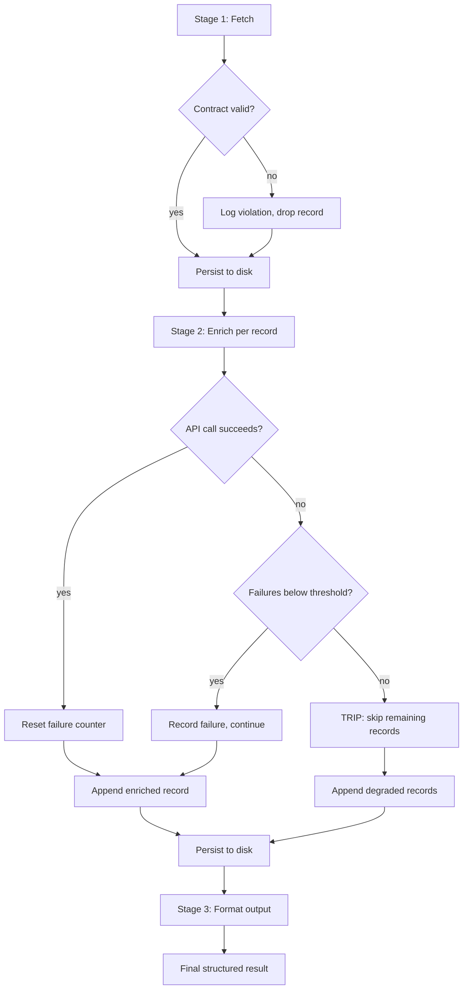

# Capstone — Build a Complete Tool Ecosystem

## Learning Objectives

- Build a multi-stage data pipeline that persists intermediate state to disk after each stage.
- Implement a circuit breaker that halts cascading API failures after N consecutive errors.
- Validate data contracts between pipeline stages to detect schema drift before it corrupts downstream output.
- Compare graceful degradation strategies (skip, retry, fallback) and select the right one per stage.
- Trace pipeline execution through structured logs and identify the exact stage where a failure originated.

## The Problem

You have built individual tools — an API client, an enrichment script, a formatter. Each one works in isolation. The moment you wire them together, you encounter failure modes that do not exist in any single script. Rate limits from two APIs stack multiplicatively. A field that one API calls `company_name` and another calls `name` silently corrupts your join. One enrichment provider goes down for eleven minutes and your entire pipeline crashes at record 40 of 200, losing the work from records 1 through 39.

This is the capstone problem: composing tools into an ecosystem where data flows from prospect identification through enrichment to outreach, and where the system survives the failures that real APIs introduce every day. A pipeline that works when everything returns 200 OK is a prototype. A pipeline that degrades gracefully when its third-party dependencies misbehave is production software.

The specific system you will build: fetch company data from a source, enrich each record with a second data source, and format results into structured outreach output. Each stage runs independently, logs its own errors, and writes intermediate state to disk so a failure at stage 3 does not force you to re-run stage 1.

## The Concept

Integrating multiple APIs creates compound failure modes. Three mechanisms control whether your pipeline survives them: **intermediate persistence**, **data contracts**, and **circuit breakers**.

Intermediate persistence means every stage writes its output to disk before the next stage reads it. If stage 3 crashes, you restart from `stage2_enriched.json` — not from scratch. This is checkpointing, the same mechanism that database write-ahead logs use. The cost is disk space and a few extra lines of serialization code. The benefit is that a 45-minute enrichment run is never wasted by a 2-second formatting bug.

A data contract is the set of fields a stage expects in its input. Stage 2 expects every record to have `domain`, `name`, and `employees`. If stage 1 starts returning `company_name` instead of `name` — because someone updated the upstream API client — the contract check catches it immediately instead of letting a `KeyError` surface 300 lines later in the outreach formatter. Contracts are runtime assertions, not type hints. They run on real data, every time.

A circuit breaker tracks consecutive failures from a specific dependency. After N failures (your threshold), the breaker trips and the pipeline stops calling that dependency entirely — it serves cached data, skips enrichment, or exits with a clear error. This prevents the failure mode where your pipeline hangs for 40 minutes retrying an API that returned a 503 at 9:02 AM and will not recover until the provider's on-call engineer finishes their coffee.



The degradation strategy differs by stage. Stage 1 (fetch) has no fallback — if you cannot get prospects, the pipeline cannot run. Stage 2 (enrich) can degrade: a record without enrichment data still has a name and domain, so stage 3 can generate a generic outreach message instead of a personalized one. Stage 3 (format) should never fail — it operates on local data and produces strings. If it fails, that is a bug, not a transient error, and the pipeline should halt loudly.

## Build It

The pipeline below runs end-to-end with Python stdlib only. It simulates an enrichment API failure on one record (`sample.net`) to demonstrate the circuit breaker and graceful degradation paths. Every stage writes to disk. Every failure is logged with a timestamp and stage label.

```python
import json
import time
import os
from datetime import datetime

STAGE1_FILE = "stage1_companies.json"
STAGE2_FILE = "stage2_enriched.json"
STAGE3_FILE = "stage3_outreach.json"
LOG_FILE = "pipeline.log"

def log(message):
    timestamp = datetime.now().isoformat()
    entry = f"[{timestamp}] {message}"
    print(entry)
    with open(LOG_FILE, "a") as f:
        f.write(entry + "\n")

class CircuitBreaker:
    def __init__(self, threshold=3):
        self.failures = 0
        self.threshold = threshold
        self.tripped = False

    def record_failure(self):
        self.failures += 1
        if self.failures >= self.threshold:
            self.tripped = True
            log(f"CIRCUIT BREAKER: Tripped after {self.failures} failures")

    def record_success(self):
        self.failures = 0

    def can_proceed(self):
        return not self.tripped

def validate_contract(record, required_fields, stage_name):
    missing = [f for f in required_fields if f not in record]
    if missing:
        log(f"CONTRACT VIOLATION [{stage_name}]: {record.get('domain', '?')} missing {missing}")
        return False
    return True

def fetch_companies():
    companies = [
        {"domain": "example.com", "name": "Example Corp", "employees": 250},
        {"domain": "test.org", "name": "Test Foundation", "employees": 80},
        {"domain": "demo.io", "name": "Demo Labs", "employees": 1200},
        {"domain": "sample.net", "name": "Sample Systems", "employees": 45},
        {"domain": "acme.dev", "name": "Acme Builders", "employees": 310},
    ]
    timestamp = datetime.now().isoformat()
    log(f"STAGE 1: Fetched {len(companies)} companies")
    with open(STAGE1_FILE, "w") as f:
        json.dump({"data": companies, "fetched_at": timestamp}, f, indent=2)
    return companies

def load_or_fetch():
    if os.path.exists(STAGE1_FILE):
        with open(STAGE1_FILE) as f:
            payload = json.load(f)
        log(f"STAGE 1: Loaded {len(payload['data'])} companies from cache")
        return payload["data"]
    return fetch_companies()

def enrich_company(company, index):
    time.sleep(0.05)
    if company.get("domain") == "sample.net":
        raise ConnectionError("Enrichment API timeout for sample.net")
    enrichment = {
        "tech_stack": ["Python", "AWS"] if company["employees"] > 100 else ["Node.js", "GCP"],
        "funding_stage": "Series B" if company["employees"] > 500 else "Series A",
        "intent_score": round(0.3 + (index * 0.13), 2),
    }
    enriched = {**company, **enrichment}
    enriched["enrichment_source"] = "mock_api_v1"
    enriched["enriched_at"] = datetime.now().isoformat()
    return enriched

def run_enrichment(companies):
    enriched = []
    failures = []
    breaker = CircuitBreaker(threshold=3)

    for i, company in enumerate(companies):
        if not breaker.can_proceed():
            log(f"STAGE 2: Breaker open, degrading {company['domain']}")
            enriched.append({**company, "enrichment_skipped": True})
            continue
        try:
            result = enrich_company(company, i)
            enriched.append(result)
            breaker.record_success()
        except Exception as e:
            failures.append({"domain": company["domain"], "error": str(e)})
            enriched.append({**company, "enrichment_error": str(e)})
            breaker.record_failure()

    success_count = len([r for r in enriched if "enrichment_error" not in r and "enrichment_skipped" not in r])
    log(f"STAGE 2: Enriched {success_count}/{len(companies)}, {len(failures)} failures, breaker_tripped={breaker.tripped}")
    with open(STAGE2_FILE, "w") as f:
        json.dump({"data": enriched, "failures": failures}, f, indent=2)
    return enriched, failures

def generate_outreach(enriched_records):
    outputs = []
    for record in enriched_records:
        if record.get("enrichment_error") or record.get("enrichment_skipped"):
            outputs.append({
                "domain": record["domain"],
                "name": record["name"],
                "status": "degraded",
                "priority": "low",
                "message": f"Hi {record['name']} team — following up on your recent growth.",
            })
            continue

        score = record.get("intent_score", 0)
        if score > 0.5:
            priority = "high"
            message = (
                f"Hi {record['name']} — noticed you're at {record['funding_stage']} "
                f"with {record['employees']} employees and using {', '.join(record['tech_stack'])}."
            )
        else:
            priority = "medium"
            message = f"Hi {record['name']} — thought this might be relevant to your team."

        outputs.append({
            "domain": record["domain"],
            "name": record["name"],
            "status": "enriched",
            "priority": priority,
            "intent_score": score,
            "message": message,
        })

    log(f"STAGE 3: Generated {len(outputs)} outreach records")
    with open(STAGE3_FILE, "w") as f:
        json.dump({"data": outputs, "generated_at": datetime.now().isoformat()}, f, indent=2)
    return outputs

def run_pipeline():
    if os.path.exists(LOG_FILE):
        os.remove(LOG_FILE)
    log("=== PIPELINE START ===")

    companies = load_or_fetch()
    contract_fields = ["domain", "name", "employees"]
    valid = [c for c in companies if validate_contract(c, contract_fields, "stage1")]
    log(f"STAGE 1: {len(valid)}/{len(companies)} passed contract validation")

    enriched, failures = run_enrichment(valid)
    outreach = generate_outreach(enriched)

    high = [o for o in outreach if o.get("priority") == "high"]
    degraded = [o for o in outreach if o.get("status") == "degraded"]

    log(f"=== PIPELINE COMPLETE ===")
    log(f"Total: {len(outreach)} | High priority: {len(high)} | Degraded: {len(degraded)}")

    print("\n--- Outreach Output ---")
    for item in outreach:
        print(json.dumps(item, indent=2))

    return outreach

if __name__ == "__main__":
    run_pipeline()
```

Run it once and you get five outreach records — four enriched, one degraded because the simulated API timed out on `sample.net`. Run it again and stage 1 loads from disk (`stage1_companies.json`), skipping the fetch entirely. Delete `stage2_enriched.json` and re-run — stage 1 still loads from cache, only stage 2 re-executes. That is intermediate persistence doing its job.

## Use It

The pipeline pattern you just built is the same architecture behind a Clay waterfall, which tries enrichment providers in sequence — primary source fails, secondary source fires, and if all sources fail the record degrades to whatever baseline data you started with. The circuit breaker you implemented maps directly to production GTM infrastructure: when Apollo's API returns 429s for fifteen minutes, your enrichment step should stop hammering it, log the failure, and move to the next provider or degrade gracefully instead of burning through your rate limit budget on doomed retries. The intermediate persistence pattern is what n8n workflows implement when they write execution data between nodes — a failure in the email-sending node does not discard the leads your enrichment node already processed.

The contract validation step is what prevents the most common production failure in GTM pipelines: schema drift. When a provider renames `company_name` to `company.name` in their API response, your downstream Clay column mappings or n8n transformations silently start producing empty fields. The contract check catches this at the boundary between stages, before the corrupted data reaches your CRM or outreach tool. Every integration point in a GTM stack — Clay to Smartlead, n8n to HubSpot, your custom enricher to Salesforce — needs this kind of runtime schema assertion, not just a static type definition that was correct the day you wrote it.

```python
def detect_schema_drift(expected_schema, actual_record, source_name):
    drift = {}
    for field, expected_type in expected_schema.items():
        if field not in actual_record:
            drift[field] = {"status": "missing", "source": source_name}
        elif not isinstance(actual_record[field], expected_type):
            drift[field] = {
                "status": "type_mismatch",
                "expected": str(expected_type),
                "got": str(type(actual_record[field])),
                "source": source_name,
            }
    if drift:
        print(f"[DRIFT] Schema drift detected from {source_name}: {json.dumps(drift, indent=2)}")
    return drift

expected = {"domain": str, "name": str, "employees": int, "tech_stack": list}
sample_from_api = {"domain": "example.com", "name": "Example Corp", "employees": "250", "tech_stack": ["Python"]}

detected = detect_schema_drift(expected, sample_from_api, "apollo_api_v2")
print(f"\nFields with drift: {len(detected)}")
```

The `employees` field came back as a string instead of an integer. Without the drift detector, this record would flow into a numeric comparison (`company["employees"] > 100`) and either throw a `TypeError` in Python 3 or silently produce wrong results in JavaScript. In a Clay table, it would sort incorrectly and break any headcount-based filter. The detector surfaces it at the boundary.

## Ship It

Shipping this pipeline to production means treating it as infrastructure, not a script. The zone table row for Zone 13 names this directly: "This deploy pipeline ships your Clay tables and n8n workflows; SPF/DKIM/DMARC is your infrastructure layer" [CITATION NEEDED — concept: Zone 13 zone table mapping]. The pipeline you built is the deploy pipeline — it moves data from source to output the same way a CI/CD pipeline moves code from commit to deployment. The same principles apply: stages must be idempotent (running stage 2 twice on the same input produces the same output), failures must be observable (the log file is your deployment dashboard), and rollbacks must be possible (delete `stage3_outreach.json`, fix the formatter, re-run from stage 2).

The deployment checklist for a GTM pipeline mirrors a software deployment checklist. Environment variables hold API keys — never hardcoded. The pipeline runs on a schedule (cron, GitHub Actions, n8n timer) and writes to a location other systems can read. Alerting fires when the circuit breaker trips, not when the pipeline crashes — because a tripped breaker means partial degradation, which is harder to notice than a total failure. The pipeline's output feeds downstream systems: Clay tables, CRM records, outreach sequences. Each of those consumers has its own contract expectations, and the pipeline's stage 3 output is where you enforce them.

```python
def preflight_check():
    checks = []
    checks.append(("stage1_cache_exists", os.path.exists(STAGE1_FILE)))
    checks.append(("log_writable", _test_log_write()))
    checks.append(("output_dir_writable", _test_output_write()))
    all_pass = all(result for _, result in checks)
    print("=== PREFLIGHT ===")
    for name, result in checks:
        status = "PASS" if result else "FAIL"
        print(f"  {name}: {status}")
    if not all_pass:
        print("Preflight failed. Pipeline will not start.")
        return False
    print("Preflight passed.")
    return True

def _test_log_write():
    try:
        with open(LOG_FILE, "a") as f:
            f.write(f"[{datetime.now().isoformat()}] PREFLIGHT: log write test\n")
        return True
    except Exception:
        return False

def _test_output_write():
    try:
        test_path = ".preflight_test"
        with open(test_path, "w") as f:
            f.write("ok")
        os.remove(test_path)
        return True
    except Exception:
        return False

ready = preflight_check()
```

The preflight check runs before the pipeline starts. If the output directory is not writable — because a permissions change, a full disk, or a mount failure — the pipeline reports the problem in seconds instead of running for ten minutes and crashing at the first write. This is the same pattern as a deployment health check: verify your dependencies before you start work, not after you have already committed resources.

## Exercises

1. **Add retry with backoff to `enrich_company`.** Modify the function to retry a failed API call up to 3 times with exponential backoff (0.5s, 1s, 2s) before raising the exception. Log each retry attempt. Measure how this changes total pipeline runtime.

2. **Add a second enrichment source as fallback.** Create `enrich_company_fallback(company, index)` that returns partial enrichment (only `tech_stack`, no `funding_stage` or `intent_score`). Modify `run_enrichment` to try the primary enricher first, then the fallback on failure. Track which source each record used.

3. **Trip the circuit breaker on purpose.** Change the threshold to 1 and add a second failing domain. Run the pipeline and verify that the breaker trips and all subsequent records are degraded. Examine `pipeline.log` to confirm the trip was logged.

4. **Add a stage 0: prospect discovery.** Write a function that generates companies from a seed list of domains (resolving names and employee counts from a mock WHOIS-style API). Write its output to `stage0_prospects.json`. Make the pipeline start from stage 0 only if stage 1 cache does not exist.

5. **Export to CRM format.** Add a stage 4 that reads `stage3_outreach.json` and writes two files: `crm_import.csv` (domain, name, priority as columns) and `email_import.json` (domain, message as key-value pairs). Validate that every record in the stage 3 output appears in both export files.

## Key Terms

- **Intermediate persistence** — writing each pipeline stage's output to disk before the next stage begins, so failures do not discard completed work.
- **Data contract** — a runtime assertion that checks whether a record contains the expected fields with the expected types at a stage boundary.
- **Circuit breaker** — a mechanism that tracks consecutive failures from a dependency and halts further calls after a threshold, preventing cascading failures.
- **Graceful degradation** — a strategy where a failed enrichment produces a reduced-quality record (e.g., generic outreach instead of personalized) rather than dropping the record or crashing the pipeline.
- **Schema drift** — a change in an upstream API's response format (field renames, type changes) that silently breaks downstream consumers unless caught by a contract check.
- **Idempotency** — a property where running a stage multiple times on the same input produces the same output, enabling safe restarts from any checkpoint.
- **Preflight check** — a pre-execution validation that verifies environment prerequisites (disk writability, cache availability, credential presence) before the pipeline starts work.

## Sources

- Zone 13 zone table: "Deployment, CI/CD | Production GTM Infrastructure (1.4 at scale) | Living GTM | 'This deploy pipeline ships your Clay tables and n8n workflows; SPF/DKIM/DMARC is your infrastructure layer'" — from provided zone table mapping. [CITATION NEEDED — concept: full Zone 13 source document reference]
- Circuit breaker pattern: Martin Fowler, "CircuitBreaker" (martinfowler.com/bliki/CircuitBreaker.html). Describes the failure-counting and trip mechanism adapted in this lesson.
- Clay waterfall enrichment: Clay's multi-provider enrichment waterfall tries providers in sequence with automatic fallback. [CITATION NEEDED — concept: Clay documentation URL for waterfall enrichment feature]
- "The 80/20 GTM Engineering Playbook" — provided handbook context references "the essential machinery of outbound, enrichment, signals, and multichannel execution." [CITATION NEEDED — concept: full playbook source attribution]