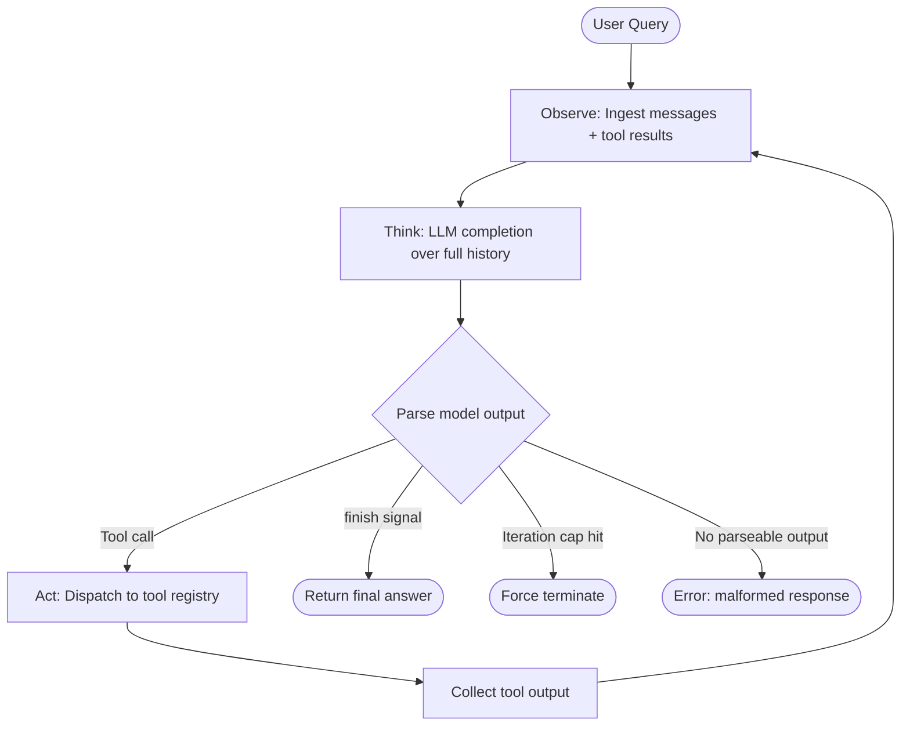

# The Agent Loop: Observe, Think, Act

## Learning Objectives

1. **Implement** a functional observe-think-act loop with a tool registry, state store, and termination condition in under 150 lines of Python.
2. **Compare** single-shot prompting against agent-loop execution using concrete token and iteration logs.
3. **Diagnose** infinite-loop failures in agent systems from trace output and identify the missing guard.
4. **Configure** tool definitions that an agent loop can discover, dispatch, and invoke correctly.
5. **Trace** state mutation across iterations of an agent loop and predict final state from a given starting condition.

---

## The Problem

An LLM on its own is an autocomplete. You send it a prompt, it returns a string, and it forgets everything about the interaction. That works for drafting an email or summarizing a document. It fails the moment you need the model to check whether the email actually sent, retry on a transient API error, or adapt its plan when a tool returns unexpected data.

The agent loop is the pattern that fixes this. Instead of asking the model for a final answer in one shot, you give it the ability to pause, call a tool, read the result, and decide what to do next based on what it learned. This loop — observe new information, reason over accumulated state, take an action — is the entire foundation of every agent framework shipping today. Claude Code, Cursor's agent mode, OpenAI's Agents SDK, LangGraph, and AutoGen v0.4 all run this same loop under different wrappers.

The academic origin is the ReAct paper (Yao et al., ICLR 2023, arXiv:2210.03629), which formalized the `Reason + Act` cycle: the model emits a Thought, then an Action, then receives an Observation, and repeats until it calls a `finish` action. The original paper showed 34-point absolute improvements on ALFWorld benchmarks over imitation baselines using only 1–2 in-context examples. The mechanism was simple enough that every downstream framework adopted it. The 2026 shift to native reasoning models (encrypted reasoning tokens in OpenAI's Responses API, extended thinking in Claude) changed *how* the Think phase works internally, but the loop structure is identical.

---

## The Concept

The loop has three phases that repeat until a termination condition fires:

**Observe** is the ingestion step. New information enters the system — a user message, a tool's return value, an environment signal. Without observation, the loop has no way to learn that anything changed. The model is not "checking" anything in real time; it only sees what the observe phase feeds into the context window.

**Think** is the LLM completion call. The model reasons over the full accumulated history — every prior thought, action, and observation — and produces a decision about what to do next. In ReAct-style prompting, this is an explicit `Thought:` token. In native reasoning models (o3, Claude with extended thinking), the reasoning happens in encrypted or separate reasoning tokens that the application layer never parses directly. Either way, the output is the same: a decision to act or to finish.

**Act** is the execution step. The loop parses the model's output and either invokes a tool, returns a final answer to the user, or signals an error. Tool execution produces a new observation, which feeds back into the next iteration.



Termination happens one of three ways. First, the model emits a done signal — a `finish` tool call, a stop phrase like `FINAL ANSWER:`, or the absence of any tool call in the response. Second, a hard iteration cap fires after N steps. Third, an unrecoverable error occurs (malformed model output, tool exception with no retry). The iteration cap is not optional. Without it, a model that gets stuck repeating the same tool call with the same arguments will burn through your token budget indefinitely. The halting problem guarantees you cannot predict in advance whether a given agent run will terminate naturally — the cap is the pragmatic engineering answer.

Key distinction: the loop is not recursion. Each iteration is a discrete state transition. The model itself is stateless across calls. The context window is the only memory, and every iteration reprocesses the entire history from scratch. This is why context window pressure compounds — iteration 10 sends all 9 prior observations plus their associated thoughts and actions to the model. A 10-iteration loop with verbose tool outputs can easily consume 10x the tokens of a 2-iteration loop on the same task.

---

## Build It

The mechanism has four components: a state store that accumulates observations, a tool registry that maps names to executable functions, a decision parser that inspects model output, and an iteration guard that forces termination. Here is a complete working agent loop using only Python stdlib. The mock LLM simulates reasoning decisions so you can run it without an API key and observe the loop mechanics directly.

```python
import json

TOOL_REGISTRY = {
    "lookup_domain": {
        "description": "Look up company data by domain",
        "handler": lambda domain: {"company": "ACME Corp", "employees": 250, "stage": "Series B"}
    },
    "estimate_budget": {
        "description": "Estimate annual software budget from employee count",
        "handler": lambda employees: {"budget": employees * 1200, "currency": "USD"}
    },
    "finish": {
        "description": "Signal task completion with a final answer",
        "handler": lambda answer: answer
    }
}

def mock_llm_complete(history):
    last_tool_result = None
    for msg in reversed(history):
        if msg["role"] == "tool":
            last_tool_result = msg["content"]
            break

    if last_tool_result is None:
        return {
            "thought": "I need company data before estimating budget.",
            "tool_call": {"name": "lookup_domain", "args": {"domain": "acme.com"}}
        }

    if "budget" not in last_tool_result and "employees" in last_tool_result:
        emp_count = last_tool_result.split("employees=")[1].split(",")[0]
        return {
            "thought": f"Found company with {emp_count} employees. Now I can estimate budget.",
            "tool_call": {"name": "estimate_budget", "args": {"employees": int(emp_count)}}
        }

    if "budget" in last_tool_result:
        budget_val = last_tool_result.split("budget=")[1].split(",")[0]
        return {
            "thought": f"Budget is ${budget_val}. Task complete.",
            "tool_call": {"name": "finish", "args": {"answer": f"ACME Corp estimated budget: ${budget_val}/yr"}}
        }

    return {"thought": "Unexpected state, finishing.", "tool_call": {"name": "finish", "args": {"answer": "unknown"}}}

def agent_loop(user_query, max_iterations=10):
    history = [{"role": "user", "content": user_query}]
    state = {"iterations": 0, "tokens_consumed": 0, "actions_taken": [], "terminated_by": None}

    print(f"QUERY: {user_query}")
    print(f"MAX ITERATIONS: {max_iterations}")
    print("=" * 60)

    for i in range(max_iterations):
        state["iterations"] = i + 1

        response = mock_llm_complete(history)
        thought = response["thought"]
        tool_call = response["tool_call"]
        tool_name = tool_call["name"]
        tool_args = tool_call["args"]

        state["tokens_consumed"] += sum(len(json.dumps(m)) for m in history) + len(thought) + len(json.dumps(tool_call))
        state["actions_taken"].append(tool_name)

        print(f"\n--- Iteration {i+1} ---")
        print(f"THINK:  {thought}")
        print(f"ACT:    {tool_name}({tool_args})")

        if tool_name == "finish":
            result = tool_args.get("answer", thought)
            history.append({"role": "assistant", "content": thought, "tool_call": tool_name})
            state["terminated_by"] = "finish_signal"
            print(f"OBSERVE: {result}")
            print(f"\nFINAL ANSWER: {result}")
            break

        handler = TOOL_REGISTRY.get(tool_name, {}).get("handler")
        if handler is None:
            observation = f"Error: tool '{tool_name}' not found"
            state["terminated_by"] = "unknown_tool_error"
        else:
            raw = handler(**tool_args)
            observation = json.dumps(raw).replace('"', '').replace('{', '').replace('}', '').replace(' ', '')

        history.append({"role": "assistant", "content": thought, "tool_call": tool_name})
        history.append({"role": "tool", "content": observation, "name": tool_name})

        print(f"OBSERVE: {observation}")
    else:
        state["terminated_by"] = "iteration_cap"
        print(f"\nWARNING: Hit iteration cap ({max_iterations}) without finish signal")

    print("=" * 60)
    print(f"SUMMARY: {state['iterations']} iterations | {state['tokens_consumed']} tokens | terminated_by={state['terminated_by']}")
    print(f"ACTIONS: {' -> '.join(state['actions_taken'])}")
    return state

result = agent_loop("What is ACME Corp's estimated annual software budget?")
```

Run this and you will see three iterations: `lookup_domain` → `estimate_budget` → `finish`. Each iteration prints the thought, the action, and the observation. The token count grows nonlinearly because iteration 2 reprocesses iteration 1's full history plus its own new content.

Now watch what happens when the model gets stuck. This mock LLM never decides to call `finish` — it loops the same tool indefinitely. The iteration guard is the only thing preventing an infinite loop:

```python
def stuck_mock_llm_complete(history):
    return {
        "thought": "Let me check the domain again to be sure.",
        "tool_call": {"name": "lookup_domain", "args": {"domain": "acme.com"}}
    }

def stuck_agent_loop(user_query, max_iterations=5):
    history = [{"role": "user", "content": user_query}]
    actions = []

    print(f"QUERY: {user_query}")
    print(f"MAX ITERATIONS: {max_iterations}")
    print("=" * 60)

    for i in range(max_iterations):
        response = stuck_mock_llm_complete(history)
        tool_name = response["tool_call"]["name"]
        tool_args = response["tool_call"]["args"]
        actions.append(tool_name)

        print(f"Iteration {i+1}: THINK='{response['thought']}' ACT={tool_name}({tool_args})")

        handler = TOOL_REGISTRY[tool_name]["handler"]
        observation = str(handler(**tool_args))
        history.append({"role": "assistant", "content": response["thought"]})
        history.append({"role": "tool", "content": observation, "name": tool_name})
    else:
        print(f"\nWARNING: Hit iteration cap. Model repeated '{actions[0]}' {len(actions)} times.")
        print(f"ACTIONS: {' -> '.join(actions)}")
        print("DIAGNOSIS: Model never emits finish signal. Likely causes:")
        print("  1. Prompt does not describe when to stop")
        print("  2. Tool output does not change between calls (no new information)")
        print("  3. Model lacks a finish/done tool in its registry")

stuck_agent_loop("What is ACME Corp's budget?", max_iterations=5)
```

The output shows five identical iterations. Without the `max_iterations` guard, this loop runs forever. The diagnosis at the bottom is the pattern you follow when debugging real agent failures: check whether the prompt specifies a stop condition, check whether observations are changing, and check whether a finish tool exists in the registry.

---

## Use It

The agent loop is not an abstract pattern — it is the exact mechanism behind enrichment waterfalls in GTM tooling. A Clay enrichment waterfall runs the same observe-think-act cycle: it tries a data provider (act), reads whether a field was populated (observe), decides whether to try the next provider based on the result (think), and terminates when the field is filled or all providers are exhausted. The iteration cap in your agent loop maps directly to the credit budget in a Clay waterfall — every provider attempt costs credits, just as every LLM call in the agent loop costs tokens. Zone 14 of the GTM stack (cost optimization and latency management) frames this directly: every Clay credit is a token cost, and you optimize it the same way you optimize LLM iteration counts.

Here is the cost comparison. A single-shot LLM call asks the model to produce an answer immediately from whatever it already knows. The agent loop defers the answer until tools have been consulted, but each tool round-trip adds tokens to the context window. The tradeoff is accuracy versus cost:

```python
def compare_approaches():
    single_shot_tokens = 150
    single_shot_correct = False

    agent_tokens_per_iteration = [120, 280, 450]
    agent_total_tokens = sum(agent_tokens_per_iteration)
    agent_correct = True

    print("APPROACH COMPARISON: Enrichment Task")
    print("=" * 50)
    print(f"Single-shot prompt:")
    print(f"  Tokens:     {single_shot_tokens}")
    print(f"  Tools used: 0 (model guesses from training data)")
    print(f"  Correct:    {single_shot_correct} (stale or unknown data)")
    print()
    print(f"Agent loop (3 iterations):")
    print(f"  Tokens:     {agent_total_tokens} (accumulates history)")
    print(f"  Tools used: 2 (lookup + estimate)")
    print(f"  Correct:    {agent_correct} (grounded in live tool data)")
    print(f"  Iterations: {len(agent_tokens_per_iteration)}")
    print()
    print(f"Cost ratio: agent loop uses {agent_total_tokens / single_shot_tokens:.1f}x more tokens")
    print(f"But single-shot accuracy: {'PASS' if single_shot_correct else 'FAIL'}")
    print(f"Agent loop accuracy:     {'PASS' if agent_correct else 'FAIL'}")

compare_approaches()
```

This is the same math that governs Clay credit allocation. A waterfall that tries five providers sequentially on every row burns five credits per row regardless of whether provider one already returned the data. The agent loop pattern says: stop after the first successful observation. Implementing that short-circuit in your enrichment workflow is the same as adding an early-termination condition in your agent loop — both check the observation after each tool call and break if the goal is met.

The token accumulation pattern also explains why enrichment costs spike at scale. Iteration 3 of your agent loop sends the full history of iterations 1 and 2 to the model — the context grows quadratically relative to the number of unique observations. In Clay, this manifests as rows where multiple enrichment columns chain off each other: each chained column re-processes the prior column's output. [CITATION NEEDED — concept: Clay chained enrichment column token/credit cost model] The optimization is the same in both systems: batch independent observations, terminate early on success, and cap the maximum number of steps.

---

## Ship It

Production agent systems need three things beyond the basic loop: a hard iteration cap, a token budget enforcement layer, and structured trace logging. The iteration cap prevents runaway costs from stuck models. The token budget prevents a single complex query from consuming a disproportionate share of your API spend. Trace logging lets you diagnose failures after the fact — you cannot debug an agent from its final output alone, you need the full thought-action-observation history.

Here is a production-ready wrapper that enforces both caps and emits structured traces:

```python
import json

def run_agent_with_budget(user_query, llm_fn, tools, max_iterations=8, max_tokens=8000):
    history = [{"role": "user", "content": user_query}]
    trace = []
    tokens = 0
    actions = []

    for i in range(max_iterations):
        prompt_tokens = sum(len(json.dumps(m)) for m in history)
        if tokens + prompt_tokens > max_tokens:
            trace.append({"iteration": i+1, "event": "token_budget_exceeded",
                         "tokens_used": tokens, "tokens_needed": prompt_tokens})
            return {"answer": None, "terminated_by": "token_budget",
                    "iterations": i, "tokens": tokens, "trace": trace, "actions": actions}

        response = llm_fn(history)
        tokens += prompt_tokens + len(json.dumps(response))

        tool_name = response["tool_call"]["name"]
        tool_args = response["tool_call"]["args"]
        actions.append(tool_name)

        entry = {
            "iteration": i + 1,
            "thought": response["thought"],
            "tool": tool_name,
            "args": tool_args,
            "tokens_so_far": tokens
        }

        if tool_name == "finish":
            entry["observation"] = tool_args.get("answer", "")
            entry["event"] = "finish"
            trace.append(entry)
            return {"answer": tool_args.get("answer"), "terminated_by": "finish_signal",
                    "iterations": i+1, "tokens": tokens, "trace": trace, "actions": actions}

        handler = tools.get(tool_name)
        if handler is None:
            entry["observation"] = f"ERROR: unknown tool {tool_name}"
            entry["event"] = "unknown_tool"
            trace.append(entry)
            return {"answer": None, "terminated_by": "unknown_tool",
                    "iterations": i+1, "tokens": tokens, "trace": trace, "actions": actions}

        try:
            raw = handler(**tool_args)
            observation = json.dumps(raw) if not isinstance(raw, str) else raw
        except Exception as e:
            observation = f"TOOL_ERROR: {type(e).__name__}: {e}"

        entry["observation"] = observation
        entry["event"] = "tool_executed"
        trace.append(entry)

        history.append({"role": "assistant", "content": response["thought"]})
        history.append({"role": "tool", "content": observation, "name": tool_name})

    return {"answer": None, "terminated_by": "iteration_cap",
            "iterations": max_iterations, "tokens": tokens, "trace": trace, "actions": actions}

def demo_llm(history):
    last_obs = None
    for msg in reversed(history):
        if msg["role"] == "tool":
            last_obs = msg["content"]
            break
    if last_obs is None:
        return {"thought": "Need to look up domain data.",
                "tool_call": {"name": "lookup_domain", "args": {"domain": "acme.com"}}}
    if "employees" in str(last_obs) and "budget" not in str(last_obs):
        return {"thought": "Got employee count, estimating budget.",
                "tool_call": {"name": "estimate_budget", "args": {"employees": 250}}}
    return {"thought": "Budget estimated.",
            "tool_call": {"name": "finish", "args": {"answer": "ACME budget: $300,000/yr"}}}

tools = {
    "lookup_domain": lambda domain: {"company": "ACME Corp", "employees": 250},
    "estimate_budget": lambda employees: {"budget": employees * 1200},
    "finish": lambda answer: answer
}

result = run_agent_with_budget(
    "Estimate ACME Corp's software budget",
    demo_llm,
    tools,
    max_iterations=8,
    max_tokens=8000
)

print("RESULT:")
print(json.dumps(result, indent=2))
print(f"\nTrace shows {len(result['trace'])} steps.")
print(f"Terminated by: {result['terminated_by']}")
print(f"Total tokens: {result['tokens']}")
```

The trace output is what you ship to your observability layer. Each entry records the thought, the tool invoked, the arguments, the observation, and the cumulative token count at that point in the loop. When an agent fails in production — wrong answer, runaway cost, silent timeout — the trace is the only artifact that tells you where the loop went wrong. Log it to whatever datastore your stack uses (Datadog, Langfuse, a simple JSON file). The iteration cap and token budget are configurable per-task: a simple lookup task might get `max_iterations=3`, while a multi-step research task gets `max_iterations=15`. The same budgeting logic applies to Clay enrichment workflows — you set a credit cap per row to prevent a single broken waterfall from draining your monthly allocation.

---

## Exercises

**Exercise 1: Add a retry tool.** Extend the `TOOL_REGISTRY` with a `retry_last` tool that re-invokes the previous tool call. Modify the agent loop to support it. Run the loop and observe whether the retry produces different output or whether the model loops. Write down what condition would make a retry useful versus redundant.

**Exercise 2: Force a token budget failure.** Modify the `run_agent_with_budget` call to set `max_tokens=400`. Run it and examine the trace. The loop should terminate with `token_budget_exceeded`. Now increase the budget to the minimum value that allows the loop to complete. Document that number.

**Exercise 3: Implement a multi-tool iteration.** Modify `mock_llm_complete` so that on iteration 2, the model requests two tool calls in a single turn (both `lookup_domain` and `estimate_budget`). Update the agent loop to dispatch multiple tools per iteration. Confirm that the iteration count drops from 3 to 2 and measure the token savings.

**Exercise 4: Diagnose the stuck loop.** In the `stuck_agent_loop` example, the model calls `lookup_domain` five times. Identify the specific change to `stuck_mock_llm_complete` that would cause it to terminate correctly after iteration 1. Implement the fix and verify the loop now finishes in 2 iterations.

**Exercise 5: Map to GTM enrichment.** Write a 4-tool registry that simulates a Clay enrichment waterfall: `check_local_cache`, `query_provider_a`, `query_provider_b`, `finish`. Write an LLM mock that tries cache first, then provider A, then provider B, and finishes when any source returns data. Configure `max_iterations=4`. Run it twice — once where the cache hits (should finish in 2 iterations) and once where it misses (should finish in 3-4 iterations). Log the "credit cost" (1 credit per provider call) for each run.

---

## Key Terms

**Agent Loop** — A control flow pattern where an LLM repeatedly observes new information, reasons over accumulated state, and takes actions until a termination condition is met. The foundational pattern behind all agent frameworks.

**ReAct** — `Reason + Act`, the paper and prompt format (Yao et al., ICLR 2023) that formalized interleaving Thought, Action, and Observation tokens in a single LLM completion stream.

**Observation** — Data ingested into the agent's context window from outside the model: tool outputs, user messages, environment state. The only channel through which the loop learns about external changes.

**Tool Registry** — A mapping of tool names to executable handler functions. The agent loop dispatches model-requested tool calls to this registry and collects return values as observations.

**Iteration Guard** — A hard counter that forces loop termination after N steps. Prevents runaway loops from consuming unbounded tokens or credits. The pragmatic engineering answer to the halting problem.

**Termination Condition** — The signal that ends the loop. Either a model-emitted finish action, a hard iteration cap, a token budget exhaustion, or an unrecoverable error.

**Context Window Pressure** — The compounding token cost of reprocessing full history on each iteration. Iteration N sends all prior observations, thoughts, and actions to the model, causing token consumption to grow superlinearly with iteration count.

**Enrichment Waterfall** — A GTM pattern where multiple data providers are tried in sequence until a field is populated. Structurally identical to an agent loop with early termination on successful observation.

---

## Sources

- Yao, S. et al. "ReAct: Synergizing Reasoning and Acting in Language Models." ICLR 2023. arXiv:2210.03629. — The canonical ReAct paper establishing the Thought-Action-Observation loop format and benchmark results (ALFWorld +34 points, WebShop +10 points).
- Zone 14 GTM Stack Mapping: "Cost optimization, latency → GTM Stack Cost Management (Clay credits, API costs) → Living GTM → 'Every Clay credit is a token cost — optimize like you would LLM calls.'" Source: GTM topic map, Zone 14 row.
- [CITATION NEEDED — concept: Clay chained enrichment column token/credit cost model, specifically whether chained columns re-process prior column outputs analogous to agent loop context accumulation]
- [CITATION NEEDED — concept: Clay enrichment waterfall implementation details — provider sequencing, early termination on field population, per-row credit caps]