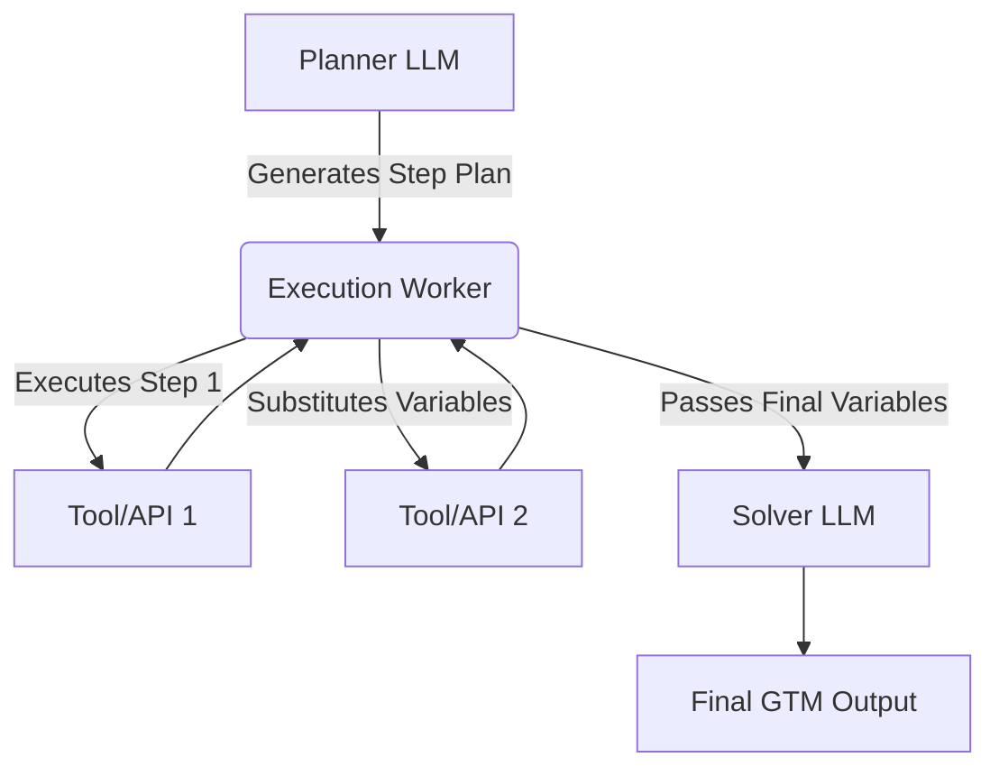

# ReWOO and Plan-and-Execute: Decoupled Planning

## Learning Objectives
1. **Compare** the token consumption and latency of standard ReAct agents against decoupled planning paradigms.
2. **Implement** a variable substitution engine to pass state between sequential API calls without LLM observation.
3. **Design** a decoupled planning pipeline for a multi-step GTM account research workflow.

## The Problem

If you have built an AI agent to research target accounts, you likely started with a ReAct (Reasoning and Acting) loop. In a ReAct loop, the LLM thinks, calls a tool, observes the output, thinks again, calls another tool, and repeats until it finishes. 

For a standard GTM task—say, finding a company's domain, scraping the homepage for the CEO's name, and finding that CEO's email—the ReAct loop creates a massive operational bottleneck. The LLM must ingest the full JSON response of a Clearbit or Apollo API call at every single step. By step three, your prompt context is bloated with raw HTML and massive JSON dictionaries. 

This bloat does three things:
1. **Increases Latency:** The LLM spends seconds processing massive context windows between every single tool call.
2. **Degrades Reasoning:** LLMs suffer from "lost in the middle" syndrome. When forced to parse 4,000 tokens of irrelevant JSON metadata to find a single email string, they hallucinate or fail to follow instructions.
3. **Spends Capital:** You pay input token costs for the LLM to re-read the entire conversation history at every sequential step.

If your ICP enrichment waterfall takes 15 seconds to run per company and costs $0.05 in API calls, you cannot scale it to a 10,000-account TAM list. You need a way to execute complex, multi-tool logic without forcing the LLM to baby-sit every HTTP request.

## The Concept

The solution is **decoupled planning**. Instead of asking the LLM to reason after every tool execution, you separate the process into three distinct phases: Plan, Execute, and Solve. 

The most prominent implementations of this are **Plan-and-Execute** and **ReWOO (Reasoning WithOut Observation)**. 

In ReWOO, the LLM makes exactly one call to generate the entire workflow plan upfront. It uses variable placeholders to chain dependencies. 

A standard ReAct prompt looks like this:
1. LLM: "I need to find the domain. I will use the Domain Tool."
2. Tool Output: `{"domain": "acme.com", "meta": "long json"}`
3. LLM reads JSON, thinks, outputs: "I found acme.com. Now I will use the CEO Tool on acme.com."

A ReWOO prompt asks the LLM to map the entire flow in step one:
1. `#E1 = DomainTool("Acme Corp")`
2. `#E2 = CEOTool(#E1)`
3. `#E3 = EmailTool(#E2)`

Once the LLM generates this plan, it steps out of the way. A deterministic Python script (the Worker) executes the steps. When it runs `#E2`, it simply replaces the `#E1` variable in the string with the output from step 1. The LLM does not need to observe the raw JSON output of the DomainTool; the script handles the data passing mechanically.

Finally, the script passes the clean, aggregated variables back to the LLM for a final Solve step (e.g., "Write a personalized cold email using #E3").



By removing the LLM from the execution loop, you reduce your token usage by up to 80%, drop latency to the bare minimum of the HTTP requests, and completely eliminate mid-process hallucinations. 

## Build It

To understand how ReWOO works mechanically, we will build a bare-bones variable substitution engine in Python. This script demonstrates how an execution worker passes state between tools without an LLM in the loop.

Create a file named `rewoo_engine.py` and run it.

```python
import re

def generate_plan(query):
    print(f"--- PLANNER LLM PHASE ---")
    print(f"Query: {query}")
    plan = [
        'CompanyDomainTool("Acme Corp")',
        'HomepageScraper(#E1)',
        'EmailFinder(#E2)'
    ]
    for i, step in enumerate(plan, 1):
        print(f"Planned Step #E{i}: {step}")
    return plan

def execute_worker(plan):
    print(f"\n--- WORKER EXECUTION PHASE ---")
    variables = {}
    
    for i, step in enumerate(plan, 1):
        var_name = f"#E{i}"
        
        for prev_var, prev_val in variables.items():
            step = step.replace(prev_var, f'"{prev_val}"')
            
        print(f"Executing {var_name}: {step}")
        
        if "CompanyDomainTool" in step:
            variables[var_name] = "acme.com"
        elif "HomepageScraper" in step:
            variables[var_name] = "Jane Doe, CEO"
        elif "EmailFinder" in step:
            variables[var_name] = "jane@acme.com"
            
    return variables

def solve(query, variables):
    print(f"\n--- SOLVER LLM PHASE ---")
    context = "\n".join([f"{k}: {v}" for k, v in variables.items()])
    final_output = f"Drafting email to {variables['#E3']} regarding {query}."
    return final_output

query = "Launch sequence for Acme Corp"
plan = generate_plan(query)
executed_vars = execute_worker(plan)
result = solve(query, executed_vars)

print(result)
```

When you run this code, observe the Worker Execution Phase. The script takes the literal string `"HomepageScraper(#E1)"`, identifies that `#E1` maps to `acme.com`, and programmatically substitutes the variable before parsing the execution. The LLM is never exposed to the intermediate steps.

## Use It

Decoupled planning separates the reasoning engine from the execution loop, allowing us to process massive JSON payloads from enrichment tools without blowing up the LLM's context window. 

In Go-To-Market engineering, this maps directly to **Cluster 4.2: AI Agents & Orchestration** for deep account research. If you are building a Claygent alternative or a custom Python enrichment backend, ReWOO is the architecture that makes 10,000-row account enrichment financially viable.

Below is a runnable GTM slice demonstrating how a ReWOO worker processes a multi-step intent and enrichment workflow.

```python
def run_gtm_rewoo_agent(company_name):
    plan = [
        'TechStackLookup(company_name)',
        'CheckJobOpenings(#E1_domain)',
        'ScoreICPFit(#E1_stack, #E2_roles)'
    ]
    
    context = {"company_name": company_name}
    
    for i, step in enumerate(plan, 1):
        step_eval = step
        
        for k, v in context.items():
            step_eval = step_eval.replace(k, f'"{v}"')
            
        if "TechStackLookup" in step_eval:
            context["#E1_domain"] = "saas.io"
            context["#E1_stack"] = ["Snowflake", "dbt", "Fivetran"]
            
        elif "CheckJobOpenings" in step_eval:
            context["#E2_roles"] = ["RevOps Analyst", "Data Engineer"]
            
        elif "ScoreICPFit" in step_eval:
            stack = context["#E1_stack"]
            roles = context["#E2_roles"]
            
            if "dbt" in stack and "RevOps" in str(roles):
                context["#E3_score"] = 95
            else:
                context["#E3_score"] = 40

    return f"Account {company_name} scored at {context['#E3_score']}/100."

print(run_gtm_rewoo_agent("Target SaaS Inc"))
```

This deterministic execution guarantees that if the Tech Stack lookup succeeds but the Job Openings API times out, you can catch the error in Python and pass a null value to the Solver, rather than having the LLM panic and hallucinate a workflow failure. [CITATION NEEDED — concept: industry standard error handling for ReWOO agents in GTM enrichment pipelines]

## Exercises

### Exercise 1: Medium
Modify the `execute_worker` function in the `Build It` section. Currently, it assumes the tool calls succeed. Add a `try/except` block inside the execution loop. If a tool fails (e.g., raise a manual exception if the company name is "Skynet"), inject the string `"ERROR"` into the variable dictionary instead of crashing the script. Observe how the Solver LLM phase handles the error state.

### Exercise 2: Hard
The current `generate_plan` function returns a static list. Write a mock function that simulates an LLM generating this plan based on a text prompt. Use regex or string parsing to extract tool names and arguments from a raw text string formatted as `Plan: 1. GetDomain(X) 2. Scrape(#E1)`. Pass this dynamically parsed list into your `execute_worker`. This tests your ability to bridge raw LLM text generation into executable Python logic.

## Key Terms
*   **ReAct (Reason + Act):** An agentic loop where the LLM alternates between generating reasoning steps and executing tools, observing the output of each tool before deciding the next step.
*   **ReWOO (Reasoning WithOut Observation):** An agentic architecture where the LLM generates a complete plan with variable dependencies upfront, and a non-LLM script executes the tools, saving token context and reducing latency.
*   **Planner:** The initial LLM call that breaks a complex goal into a sequence of executable steps, often using variable placeholders like `#E1`.
*   **Worker:** The deterministic execution script (usually Python) that parses the Planner's output, substitutes variables, and makes the actual API or tool calls.
*   **Solver:** The final LLM call that ingests the clean, aggregated variables from the Worker to generate the final user-facing output (e.g., drafting the email or formatting the JSON).
*   **Context Bloat:** The rapid consumption of an LLM's token limit caused by appending large, raw tool outputs (like JSON payloads) into the prompt history during a ReAct loop.

## Sources
*   *ReWOO: Decoupling Reasoning from Observations for Algorithmic Reasoning with Language Models* (Xu et al., 2023)
*   *Plan-and-Solve Prompting: Improving Zero-Shot Chain-of-Thought Reasoning by Large Language Models* (Wang et al., 2023)
*   LangChain Documentation: Plan-and-Execute Agents
*   [CITATION NEEDED — concept: empirical token cost reduction of ReWOO vs ReAct in RevOps enrichment workflows]