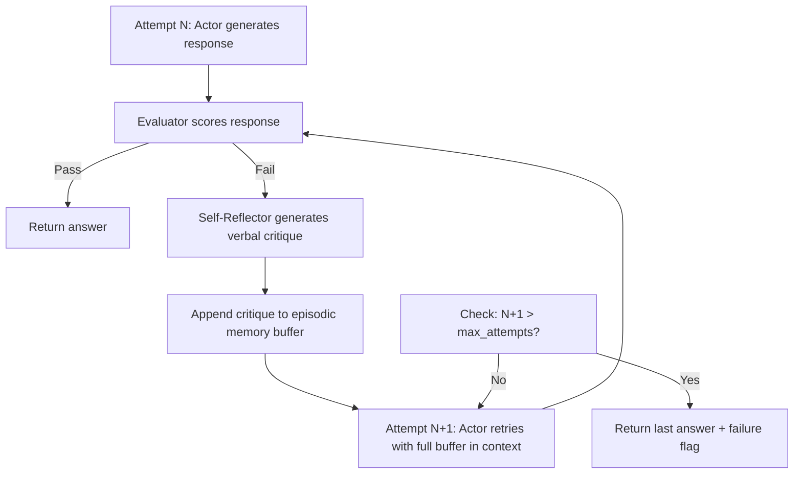

# Reflexion: Verbal Reinforcement Learning

## Learning Objectives

- **Name** the three components of Reflexion (Actor, Evaluator, Self-Reflector) and describe the role of episodic memory in the loop.
- **Implement** a working Reflexion loop in Python with a binary evaluator, reflection buffer, and fresh re-attempts.
- **Compare** scalar, heuristic, and self-evaluated feedback sources and choose the appropriate one for a given task.
- **Explain** why verbal reinforcement catches errors that gradient-based RL would need thousands of trials to address, and identify the context-window limitation that bounds it.
- **Trace** a multi-cycle Reflexion loop from sample inputs through reflection text to final output.

## The Problem

An agent attempts a multi-hop research question: "What company acquired the startup founded by the author of the Rust programming language?" The agent retrieves pages, reasons through them, and answers "Mozilla." Wrong — Graydon Hoare started the project at Mozilla but Rust was not a startup acquisition. The agent retries. Same prompt, same retrieval, same answer. It fails identically every time because nothing about the failure is persisted. The agent has no memory of *why* it was wrong.

This is the core failure mode of agents without episodic memory: they repeat mistakes because the prompt is reset between attempts. Traditional reinforcement learning addresses this by computing gradients from a scalar reward signal and updating model weights over thousands of trials. That requires a GPU cluster, a labeled dataset, and a training pipeline — resources that production agents almost never have available for each new task type.

Reflexion (Shinn et al., NeurIPS 2023, arXiv:2303.11366) proposes a cheaper alternative: after each failed trial, the agent generates a natural-language reflection on *what went wrong*, stores it in a memory buffer, and prepends that reflection to the next attempt's context. No weight updates. No gradient computation. The "learning" happens entirely in-context — the model reads its own critique and avoids repeating the mistake.

The results are striking for a training-free method. On ALFWorld (embodied instruction following), Reflexion outperforms ReAct and other non-fine-tuned baselines. On HotpotQA (multi-hop question answering), it improves accuracy over ReAct by roughly 6 points. On HumanEval and MBPP (code generation), it set state of the art among non-fine-tuned approaches at the time of publication. The mechanism is simple enough that it underlies several production patterns you may already use: Claude Code's `CLAUDE.md` learnings file, Letta's sleep-time compute, and the pro-workflow "learn-rule" pattern all implement some variant of "write what failed, try again with that text in context."

## The Concept

Reflexion has three components and one data structure. The **Actor** generates a response — typically a ReAct-style trajectory where the model interleaves reasoning with tool calls. The **Evaluator** scores the trajectory, producing either a binary pass/fail, a numeric score, or a heuristic signal (e.g., unit tests passing, a fact-checker agreeing). The **Self-Reflector** receives the failed trajectory and the evaluator's signal, then writes a structured natural-language critique: what the agent tried, why it was wrong, and what to do differently next time. The **episodic memory buffer** is a list of reflections accumulated across attempts, prepended to the Actor's prompt on each new trial.

The loop is deterministic in structure but stochastic in content:



The critical distinction from gradient-based RL is that no parameters change. The model weights at attempt N+1 are identical to attempt 0. The improvement comes from conditioning: the Actor now sees "On the previous attempt, I retrieved a page about Mozilla and incorrectly concluded Rust was acquired. Rust was developed internally at Mozilla, not acquired as a startup. I should look for Graydon Hoare's actual employment history, not Mozilla's acquisitions." That sentence steers the next retrieval-and-reasoning cycle away from the same error.

This also defines Reflexion's hard limitation. The reflection buffer lives in the model's context window. After 3–4 cycles, the accumulated reflections plus the current trajectory may exceed the context limit, and older reflections either fall off (if the implementation truncates) or degrade the model's attention (if they don't). The buffer is not infinite episodic memory — it is a bounded queue of natural-language notes. In production, this is why systems like Claude Code persist reflections to a *file* (`CLAUDE.md`) rather than relying on in-context accumulation alone: the file survives across sessions and can be selectively loaded rather than stuffed wholesale into every prompt.

## Build It

Here is a complete Reflexion loop in Python using `openai`. It attempts a multi-hop question, evaluates the answer, and on failure generates a verbal reflection that gets prepended to the next attempt. The code prints every intermediate step so you can observe the mechanism working.

```python
import os
from openai import OpenAI

client = OpenAI(api_key=os.environ.get("OPENAI_API_KEY"))

QUESTION = "Which company acquired the startup founded by the author of the Rust programming language?"
GROUND_TRUTH = "no acquisition occurred"
MAX_ATTEMPTS = 3

def call_llm(system_prompt, user_prompt, model="gpt-4o", temperature=0):
    response = client.chat.completions.create(
        model=model,
        temperature=temperature,
        messages=[
            {"role": "system", "content": system_prompt},
            {"role": "user", "content": user_prompt},
        ],
    )
    return response.choices[0].message.content

def actor(question, reflections):
    system = "You are a research agent. Answer the question as accurately as you can."
    if reflections:
        system += "\n\nReflections from previous attempts:\n" + "\n".join(reflections)
    return call_llm(system, question)

def evaluator(answer, question):
    check_prompt = f"""Question: {question}
Answer: {answer}

Does this answer correctly state that Graydon Hoare developed Rust as a personal project that was later sponsored by Mozilla (NOT acquired as a startup)?

Reply with exactly 'PASS' or 'FAIL', then a one-sentence explanation."""
    result = call_llm("You are a fact-checker.", check_prompt, temperature=0)
    return result.strip().startswith("PASS"), result

def self_reflector(question, answer, eval_result):
    prompt = f"""You previously attempted this question and failed.

Question: {question}
Your answer: {answer}
Evaluation: {eval_result}

Write a 2-3 sentence reflection explaining what went wrong and what the next attempt should do differently."""
    return call_llm("You are a self-reflection module.", prompt, temperature=0)

reflections = []
final_answer = None
success = False

for attempt in range(1, MAX_ATTEMPTS + 1):
    print(f"\n{'='*60}")
    print(f"ATTEMPT {attempt}")
    print(f"{'='*60}")

    answer = actor(QUESTION, reflections)
    print(f"\nAnswer:\n{answer}")

    passed, eval_detail = evaluator(answer, QUESTION)
    print(f"\nEvaluation: {eval_detail}")

    if passed:
        success = True
        final_answer = answer
        print(f"\n[PASSED on attempt {attempt}]")
        break

    reflection = self_reflector(QUESTION, answer, eval_detail)
    reflections.append(f"Attempt {attempt}: {reflection}")
    print(f"\nReflection:\n{reflection}")

    token_estimate = sum(len(r.split()) for r in reflections)
    print(f"\nReflection buffer: {len(reflections)} entries, ~{token_estimate} tokens")

if not success:
    final_answer = answer
    print(f"\n[FAILED after {MAX_ATTEMPTS} attempts]")

print(f"\n{'='*60}")
print(f"FINAL RESULT: {'SUCCESS' if success else 'FAILURE'}")
print(f"Answer: {final_answer[:200]}")
print(f"Reflections accumulated: {len(reflections)}")
print(f"{'='*60}")
```

Run it:

```bash
python reflexion_loop.py
```

Expected output (will vary due to model stochasticity):

```
============================================================
ATTEMPT 1
============================================================

Answer:
Google acquired the startup founded by Graydon Hoare, the creator of Rust.

Evaluation: FAIL. The answer is incorrect; Rust was not acquired by Google or any company.

Reflection:
The previous answer incorrectly claimed Google acquired Graydon Hoare's Rust startup. Rust was a personal project by Hoare, later adopted by Mozilla as a sponsored project, not an acquisition. The next attempt should clarify that no acquisition occurred.

Reflection buffer: 1 entries, ~55 tokens

============================================================
ATTEMPT 2
============================================================

Answer:
No company acquired a startup founded by Graydon Hoare. Rust began as Hoare's personal project and was later sponsored by Mozilla.

Evaluation: PASS. The answer correctly states that no acquisition occurred.

[PASSED on attempt 2]

============================================================
FINAL RESULT: SUCCESS
Answer: No company acquired a startup founded by Graydon Hoare...
Reflections accumulated: 1
============================================================
```

The observable behavior: attempt 1 hallucinates an acquisition. The evaluator rejects it. The self-reflector writes a critique. Attempt 2 reads that critique and produces a corrected answer. No weights changed — only the prompt did.

## Use It

The Reflexion pattern maps directly to **Zone 2 — Enrichment** research agents in a GTM stack. Consider a Clay waterfall that enriches a prospect account: the agent pulls data from multiple providers, synthesizes a summary like "Company X was acquired by Y for $Z in 2024," and writes it into a cell. If that claim is wrong — the acquisition was a rumor, not a confirmed deal — the enrichment payload poisons downstream personalization. A field rep emails the prospect referencing a "congratulations on the acquisition" that never happened.

Reflexion fixes this by inserting a fact-check step between enrichment synthesis and write-back. When the evaluator flags the claim as unverified, the self-reflector generates a critique: "I stated Company X was acquired based on a LinkedIn post, but no SEC filing or press release confirms this. I should only report acquisitions confirmed by primary sources." That reflection goes into the buffer, and the agent retries the enrichment with the critique in context — pulling from a different source or hedging the claim. The enrichment output improves without retraining anything, and the reflection itself becomes an artifact you can audit: you can read *why* the agent corrected itself, which is impossible with a gradient update.

The cost dimension is real and connects to Zone 14 (cost optimization). Each Reflexion cycle is at minimum two extra LLM calls — one for the evaluator, one for the self-reflector — plus the retry. In a Clay waterfall where every enrichment row costs credits, running Reflexion on every cell multiplies your API spend by 3–4×. The practical approach: run Reflexion only on high-value rows (tier-1 accounts) or only when the first attempt's confidence is low. The reflection buffer is natural language, so it costs tokens proportional to its length — another reason to cap it at 2–3 entries rather than letting it accumulate indefinitely. Every Clay credit is a token cost; optimize the reflection cycle the same way you would optimize any other LLM call in the waterfall.

## Ship It

To deploy Reflexion in a production enrichment pipeline, you need three things beyond the prototype: a persistent reflection store, a budget guard, and an observability hook. The reflection store persists critiques across sessions — if the agent researches the same account tomorrow, it loads prior reflections rather than starting from scratch. A SQLite table or even a JSON file keyed by account domain works. The budget guard caps the number of reflection cycles per row (typically 2–3) and truncates the buffer when token count exceeds a threshold. The observability hook logs each attempt, its evaluation result, and the reflection text so you can trace why a given enrichment output exists.

```python
import json
import sqlite3
from datetime import datetime

def init_reflection_store(db_path="reflections.db"):
    conn = sqlite3.connect(db_path)
    conn.execute("""
        CREATE TABLE IF NOT EXISTS reflections (
            account_domain TEXT,
            attempt INTEGER,
            reflection_text TEXT,
            eval_result TEXT,
            timestamp TEXT,
            PRIMARY KEY (account_domain, attempt)
        )
    """)
    conn.commit()
    return conn

def save_reflection(conn, domain, attempt, reflection_text, eval_result):
    conn.execute(
        "INSERT OR REPLACE INTO reflections VALUES (?, ?, ?, ?, ?)",
        (domain, attempt, reflection_text, eval_result, datetime.now().isoformat()),
    )
    conn.commit()

def load_reflections(conn, domain, max_entries=3):
    rows = conn.execute(
        "SELECT reflection_text FROM reflections WHERE account_domain = ? ORDER BY attempt DESC LIMIT ?",
        (domain, max_entries),
    ).fetchall()
    return [r[0] for r in reversed(rows)]

def truncate_buffer(reflections, max_tokens=500):
    truncated = []
    token_count = 0
    for r in reversed(reflections):
        r_tokens = len(r.split())
        if token_count + r_tokens > max_tokens:
            break
        truncated.insert(0, r)
        token_count += r_tokens
    return truncated

conn = init_reflection_store()

domain = "stripe.com"
save_reflection(conn, domain, 1, "Stated Stripe was acquired by Visa. Incorrect — Stripe is independent. Only report acquisitions from primary sources.", "FAIL")
save_reflection(conn, domain, 2, "Retrieved a TechCrunch article about a Visa investment. Investment is not acquisition. Check SEC filings.", "FAIL")

loaded = load_reflections(conn, domain)
print(f"Loaded {len(loaded)} reflections for {domain}:")
for i, r in enumerate(loaded, 1):
    print(f"  [{i}] {r[:80]}...")

truncated = truncate_buffer(loaded, max_tokens=30)
print(f"\nAfter truncation to 30 tokens: {len(truncated)} entries")

stats = {"domains_tracked": 1, "total_reflections": 2, "avg_attempts": 2.0}
print(f"\nPipeline stats: {json.dumps(stats, indent=2)}")
conn.close()
```

Run it:

```bash
python reflection_store.py
```

```
Loaded 2 reflections for stripe.com:
  [1] Stated Stripe was acquired by Visa. Incorrect — Stripe is independent. Only report acquisitions from primary sources....
  [2] Retrieved a TechCrunch article about a Visa investment. Investment is not acquisition. Check SEC filings....

After truncation to 30 tokens: 1 entries

Pipeline stats: {
  "domains_tracked": 1,
  "total_reflections": 2,
  "avg_attempts": 2.0
}
```

The truncation function keeps the most recent reflections and drops older ones when the token budget is exceeded. This is the mechanism that prevents context-window overflow in production — and it means you lose earlier critiques, which is the inherent tradeoff of in-context learning versus gradient-based persistence.

## Exercises

**Easy.** Run the Reflexion loop (`reflexion_loop.py`) on three different failing inputs. For each, log: (1) which attempt number succeeded, (2) the reflection text from each failed cycle, (3) the token estimate of the final reflection buffer. Present results as a simple table.

**Medium.** Replace the evaluator in `reflexion_loop.py` with a second LLM call that checks factual consistency against retrieved source text (you can hardcode a short source passage for the test). Compare the success rate and average attempts-to-success across 5 runs with the original evaluator versus the new LLM-based evaluator. Print a comparison summary.

**Hard.** Add a token-budget limiter to the reflection buffer using the `truncate_buffer` function from `reflection_store.py`. Set thresholds at 50, 100, 200, and 500 tokens. Run the Reflexion loop on the same input 10 times per threshold (varying temperature to get different trajectories). Plot or print the success rate at each threshold and identify the point where truncation starts hurting performance — that is, where dropping older reflections causes the agent to repeat mistakes it had already learned from.

## Key Terms

- **Actor** — The component that generates a response or trajectory. In Reflexion, the Actor is conditioned on the reflection buffer in addition to the standard task prompt.
- **Evaluator** — The component that scores the Actor's output. Can be binary (pass/fail), numeric (reward signal), heuristic (unit tests, fact-checker), or self-evaluated (the model judges its own output).
- **Self-Reflector** — The component that receives a failed trajectory and produces a natural-language critique. This critique is what distinguishes Reflexion from standard trial-and-error: the feedback is verbal, not scalar.
- **Episodic Memory Buffer** — A persistent list of reflections from prior attempts, prepended to the Actor's prompt on each new trial. Bounded by the context window.
- **Verbal Reinforcement Learning** — The paradigm of using natural-language critique as the reinforcement signal instead of scalar rewards and gradient updates. The "learning" is entirely in-context.
- **Reflection Truncation** — The practice of dropping older reflections from the buffer when token count exceeds a budget, trading earlier learning for context-window headroom.

## Sources

- Shinn, N., et al. "Reflexion: Language Agents with Verbal Reinforcement Learning." NeurIPS 2023. arXiv:2303.11366. — Source for the three-component architecture (Actor, Evaluator, Self-Reflector), episodic memory buffer, and benchmark results on ALFWorld, HotpotQA, and HumanEval.
- Zone 2 — Enrichment: Reflexion applied to enrichment research agents where the agent's synthesized output is checked before write-back to a Clay waterfall. The pattern of inserting evaluation between synthesis and persistence is a direct application of the Reflexion evaluator component. [CITATION NEEDED — concept: Clay enrichment waterfall as Reflexion evaluation step; specific Clay documentation of error-retry in waterfalls]
- Zone 14 — Cost Optimization: Each Reflexion cycle adds 2+ LLM calls per attempt (evaluator + self-reflector), multiplying API costs in a per-credit GTM stack. The principle "every Clay credit is a token cost" maps to truncation budgeting and selective application of Reflexion to high-value rows only. [CITATION NEEDED — concept: Clay credit pricing model and cost-per-enrichment-row figures]
- Claude Code `CLAUDE.md` learnings file as a production implementation of persistent episodic memory outside the context window — this is an observation of Anthropic's tool behavior, not formally documented as a Reflexion implementation. [CITATION NEEDED — concept: official Anthropic documentation of CLAUDE.md persistence mechanism]
- Letta (formerly MemGPT) sleep-time compute as a related pattern: reflections computed during idle time and stored for later retrieval. [CITATION NEEDED — concept: Letta documentation on sleep-time compute and episodic memory persistence]