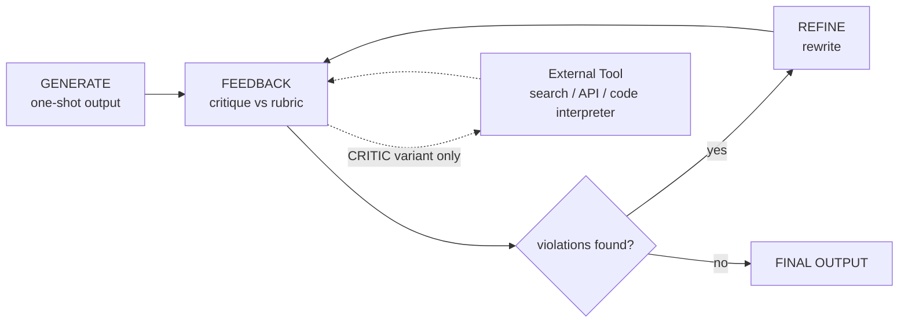

# Self-Refine and CRITIC: Iterative Output Improvement

## Learning Objectives

1. **Implement** the Self-Refine feedback-revise loop as a stateful iteration over a single LLM with an explicit rubric.
2. **Distinguish** Self-Refine (internal critique) from CRITIC (tool-grounded critique) by the source of feedback signal.
3. **Detect** when an iterative refinement loop has converged versus when it is over-editing.
4. **Configure** a CRITIC-style external verifier that grounds critique in a lookup rather than the model's prior.

## The Problem

You prompt an LLM to write a cold email to an account. The output is fine — and indistinguishable from every other cold email because it reaches for "AI-powered personalization at scale" and "leverage our platform." You write a longer prompt. Output improves marginally. You write a 2,000-character prompt with examples. Output improves again, then plateaus.

What's happening: a one-shot prompt samples the model's first mode for that input distribution. You are not getting closer to the model's best possible output for the task — you are getting the most likely token sequence given the prompt. Better prompts shift the mode, but they do not interrogate the output.

The fix that matters for GTM work is not another prompt template. It is a loop: generate, critique against an explicit rubric, revise, repeat until the critique stops finding violations. This is the difference between a model that *writes* a cold email and a model that *improves its own* cold email.

## The Concept

Two papers formalize this loop.

**Self-Refine** (Madaan et al., 2023) decomposes refinement into three operations on a single LLM:

- `GENERATE`: produce an initial output.
- `FEEDBACK`: critique the output against an explicit rubric.
- `REFINE`: rewrite the output to address the critique.

The same model performs all three. No external data enters the loop. The mechanism that makes this work is the explicit rubric — when you ask a model "make this better" you get surface edits. When you ask a model "which of these four properties does this output violate," you get structural critique. The rubric is what separates Self-Refine from "ask ChatGPT to be nicer."

**CRITIC** (Gou et al., 2023) extends the pattern with one critical change: the FEEDBACK step is grounded by an external tool — a search call, a code interpreter, a database lookup, an API check. The model still produces the critique, but the critique is verifiable against an external source rather than self-referential.



The dotted edge is the entire delta between the two papers. Self-Refine is the closed loop. CRITIC opens the loop and routes critique through a verifier.

Two empirical findings matter for production use. First, refinement converges — Madaan et al. report diminishing returns after roughly 3–4 iterations across most tasks; gains past iteration 5 are noise. Second, without a rubric the loop produces cosmetic revisions; the rubric is the load-bearing component.

A third finding matters for GTM specifically: both papers degrade when the model cannot know it is wrong. Self-Refine cannot catch a fabricated account signal because the model has no ground truth. This is the case for CRITIC — if your cold email claims "you recently raised Series B," you want that verified against Crunchbase, not asserted by the model.

## Build It

This script runs in any Python 3 environment. It implements the Self-Refine loop with a mock LLM so you can observe the loop mechanics without an API key. Swap `mock_llm` for a real call later.

```python
def mock_llm(prompt):
    p = prompt.lower()
    if "draft" in p:
        return "Hi Sarah — our AI-powered platform helps teams scale outreach at scale."
    if "feedback" in p:
        return "Violations: filler phrase 'AI-powered'; filler 'at scale' (repeated); no account signal; no quantified outcome."
    if "refine" in p:
        return "Hi Sarah — saw Acme is hiring 3 SDRs in Denver. Teams your size usually cut ramp from 90 to 54 days."
    return "No violations."

RUBRIC = [
    "specific account signal present",
    "quantified outcome present",
    "no filler phrases ('AI-powered', 'at scale', 'leverage', 'seamless')",
    "under 40 words",
]

def self_refine(draft_prompt, max_iters=4):
    draft = mock_llm(draft_prompt)
    trace = [("draft_0", draft)]
    for i in range(max_iters):
        fb = mock_llm(f"feedback on: {draft} | rubric: {RUBRIC}")
        trace.append((f"feedback_{i}", fb))
        if fb.strip().lower().startswith("no violations"):
            trace.append(("converged", f"stopped at iteration {i}"))
            break
        draft = mock_llm(f"refine: {draft} | using: {fb}")
        trace.append((f"refine_{i+1}", draft))
    return trace

for step, text in self_refine("draft a cold email"):
    print(f"[{step}] {text}\n")
```

Run it. Observe that `feedback_0` identifies three rubric violations; `refine_1` addresses them; `feedback_1` returns "No violations" and the loop converges before `max_iters`. The model that produced the weak draft is the same model that identified the weakness — separated only by the rubric in the prompt.

## Use It

This is the Self-Refine loop applied to outbound messaging — the cluster covering personalized cold email and LinkedIn outreach `[CITATION NEEDED — concept: exact cluster ID for outbound personalization]`. The AI mechanism is iterative self-critique against a fixed rubric, with a convergence check on the critique step.

```python
def llm(messages):
    last = messages[-1]["content"].lower()
    if "write a cold email" in last:
        return "Hi Sarah — leverage our AI platform to scale your GTM motion."
    if "critique" in last:
        return "violations: filler 'leverage'; filler 'AI'; no account signal; no quantified outcome"
    if "rewrite" in last:
        return "Sarah — saw Acme is hiring 3 SDRs. Teams your size cut ramp 90->54 days. Worth 15 min?"
    return "no violations"

ICP = "VP Sales, 50-200 person SaaS, pain: SDR ramp time"
PROSPECT = "Sarah at Acme"
RUBRIC = ["specific account signal", "quantified outcome", "no filler", "under 30 words"]

def refine_cold_email(icp, prospect, max_iters=4):
    msgs = [{"role":"user","content":f"Write a cold email to {prospect}, {icp}. Body only."}]
    draft = llm(msgs)
    for i in range(max_iters):
        msgs += [{"role":"assistant","content":draft},
                 {"role":"user","content":f"Critique against {RUBRIC}. Violations only."}]
        critique = llm(msgs)
        if critique.strip().lower().startswith("no violations"):
            return draft, i
        msgs += [{"role":"assistant","content":critique},
                 {"role":"user","content":"Rewrite fixing violations. Body only."}]
        draft = llm(msgs)
    return draft, max_iters

final, iters = refine_cold_email(ICP, PROSPECT)
print(f"Converged in {iters} iterations.\n\n{final}")
```

The `msgs` list carries the full conversation — the model sees its prior draft and prior critique when revising. This is what makes the loop closed: each REFINE call is conditioned on the FEEDBACK that preceded it, not on a fresh prompt.

## Exercises

**Exercise 1 (easy).** Add a `word_count` check to the rubric in `self_refine`. Print which iteration first satisfies it. Run with `max_iters=1` and confirm the loop exits early when the word-count rule is violated but unrecoverable.

**Exercise 2 (hard).** Convert `refine_cold_email` from Self-Refine to CRITIC. Add a `verify_account_claim(text)` function that takes a refined draft and returns any sentence containing a factual claim about the prospect (e.g., "hiring 3 SDRs"). Route that claim through a mock lookup that returns `False` (claim not found). If the verifier fails, inject "verification failed: account claim unverified" into the next critique step. Observe how the loop now corrects a class of error Self-Refine alone cannot detect — fabricated signals.

## Key Terms

- **Self-Refine** — closed-loop refinement where one LLM performs GENERATE, FEEDBACK (against an explicit rubric), and REFINE with no external data.
- **CRITIC** — Self-Refine extended so the FEEDBACK step is grounded by an external tool (search, code interpreter, API), making critique verifiable.
- **Rubric** — the explicit, enumerable list of properties the output must satisfy; the load-bearing component of the FEEDBACK step.
- **Convergence** — the iteration at which FEEDBACK returns no violations; empirically 3–5 iterations for most tasks per Madaan et al.
- **Over-editing** — revisions past convergence that add noise without improving quality; detected by tracking metric delta per iteration.
- **External verifier** — in CRITIC, the tool (search, API, code) that grounds a factual claim made in the model's output.

## Sources

- Madaan, A., Tandon, N., Gupta, P., et al. (2023). *Self-Refine: Iterative Refinement with Self-Feedback.* arXiv:2303.17651.
- Gou, Z., Shao, Z., Gong, Y., et al. (2023). *CRITIC: Large Language Models Can Self-Correct with Tool-Interactive Critiquing.* arXiv:2305.11738.
- GTM cluster reference for outbound personalization: `[CITATION NEEDED — concept: cluster ID for outbound / cold email personalization in gtm-topic-map]`