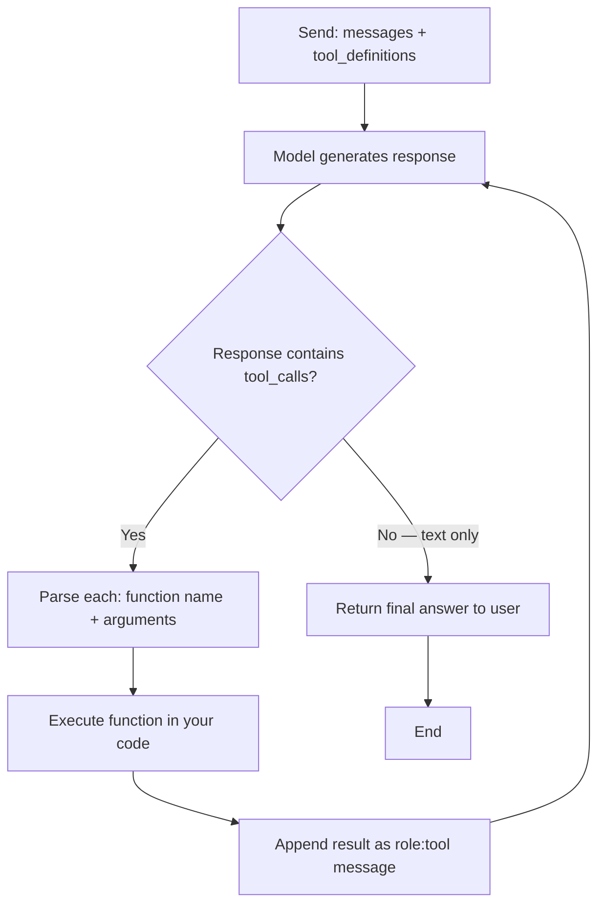

# Tool Use and Function Calling

## Learning Objectives

1. Define tool schemas using JSON Schema and pass them to an LLM API call
2. Implement a tool execution loop that parses model responses, executes functions, and feeds results back into context
3. Compare `tool_choice` modes (`auto`, `required`, `none`, specific function) and predict model behavior for each
4. Handle tool execution errors — invalid JSON, unknown functions, runtime failures — without breaking the conversation loop
5. Calculate the token cost of tool definitions across multi-turn loops and trim schemas for production use

## The Problem

You have a model that can reason about what should happen, but cannot make it happen. It can tell you that a company has 8000 employees, but it cannot look that up. It can suggest you send an email, but it cannot send one. Tool use is the bridge: the model emits structured instructions, your code runs them, and the result goes back into context. This is the loop that turns a chatbot into an agent.

Early tool use research asked a simple question: can a model predict a correct function call? Toolformer (Schick et al., NeurIPS 2023) answered this with self-supervision — let the model annotate its own pretraining corpus with candidate API calls, execute each candidate, and keep the annotation only if including the tool result reduces next-token loss. Calculator, QA, search, translator, calendar. No human labels. The signal was purely about whether the tool helps predict text. Tool use emerged at scale: smaller models hurt from tool annotations, larger models gained.

The Berkeley Function Calling Leaderboard V4 (Patil et al., 2025) defines the 2026 evaluation bar: 40% agentic, 30% multi-turn, 10% live, 10% non-live, 10% hallucination detection. Single-turn function calling is solved. What is not solved: long-horizon tool chaining across 40 steps, dynamic decision-making under partial observability, and memory across extended agent sessions. The gap between Toolformer's baseline and BFCL V4's targets is the space production agents live in.

In a GTM context, this gap maps directly to enrichment workflows. A single-turn tool call is "look up this company's headcount." A multi-turn agent loop is "research this account, enrich 15 fields across 4 providers, decide which signal matters, and draft outreach based on what you found." The first is a function call. The second is an agent. The mechanism underneath both is the same loop.

## The Concept

Function calling is a constrained output pattern. Instead of generating freeform text, the model generates a JSON object containing a function name and arguments. Your code parses that object, executes the function, and appends the result to the conversation. The model then continues with that new information. The model does not run the function. It predicts which function should run and what arguments to pass.

The tool definitions are injected into the system context as structured metadata. During inference, the model can emit special tokens that indicate "I want to call a function" followed by the function name and arguments. This is still next-token prediction — but over a constrained grammar that produces valid JSON instead of prose. The model was post-trained or fine-tuned to produce this format reliably, and the API enforces structural validity on top of that.



The `tool_choice` parameter controls how the model decides. With `auto` (the default), the model decides whether a tool call is warranted based on the user's message and the available tool definitions. With `required`, the model must call at least one tool — it will never respond with text alone, which is useful when you want to force structured action. With `none`, the model is forbidden from calling tools and will ignore tool definitions entirely, useful for conversational turns where you want prose. With `{"type": "function", "function": {"name": "specific_function"}}`, the model must call that exact function — useful when your routing logic has already decided which tool to invoke and you just need arguments.

Every tool definition is included in every API request. A schema with verbose descriptions and nested objects can add 200–800 tokens per definition. In a 10-turn agent loop, you pay that cost 10 times — the tool definitions are part of the prompt on every turn because the model needs them in context to decide whether to call. This is the same token economics that govern Clay enrichment credits: every credit spent on an enrichment API call is a cost you would optimize the same way you optimize LLM token budgets. Trim descriptions to one sentence. Remove parameters the model never uses. Collapse nested objects into flat structures where possible.

## Build It

The core mechanism is a registry, a parser, and a loop. The registry maps function names to callable Python functions and their JSON Schema definitions. The parser extracts tool calls from the model's response. The loop sends messages, checks for tool calls, executes them, appends results, and repeats until the model responds with text.

This example uses a simulated model response so it runs without an API key. The response format matches what OpenAI's API returns — same field names, same nesting. Replace the `simulated_responses` list with real API calls and the loop logic stays identical.

```python
import json

TOOL_REGISTRY = {}

def tool(name, description, parameters):
    def decorator(func):
        TOOL_REGISTRY[name] = {
            "function": func,
            "schema": {
                "type": "function",
                "function": {
                    "name": name,
                    "description": description,
                    "parameters": parameters,
                }
            }
        }
        return func
    return decorator

@tool(
    name="get_weather",
    description="Get current weather for a city",
    parameters={
        "type": "object",
        "properties": {
            "city": {"type": "string", "description": "City name"},
            "unit": {"type": "string", "enum": ["celsius", "fahrenheit"]},
        },
        "required": ["city"],
    }
)
def get_weather(city, unit="celsius"):
    temps = {"San Francisco": 15, "New York": 3, "London": 8}
    temp = temps.get(city, 20)
    if unit == "fahrenheit":
        temp = temp * 9 // 5 + 32
    return {"city": city, "temperature": temp, "unit": unit}

@tool(
    name="get_company_size",
    description="Get employee count for a company",
    parameters={
        "type": "object",
        "properties": {
            "company": {"type": "string", "description": "Company name"},
        },
        "required": ["company"],
    }
)
def get_company_size(company):
    sizes = {"Stripe": 8000, "Figma": 1200, "Notion": 500}
    return {"company": company, "employees": sizes.get(company, 100)}

def execute_tool_call(tool_call):
    name = tool_call["function"]["name"]
    raw_args = tool_call["function"]["arguments"]
    args = json.loads(raw_args)
    if name not in TOOL_REGISTRY:
        return {"error": f"Unknown tool: {name}"}
    result = TOOL_REGISTRY[name]["function"](**args)
    return result

simulated_responses = [
    {
        "tool_calls": [
            {
                "id": "call_001",
                "function": {
                    "name": "get_company_size",
                    "arguments": json.dumps({"company": "Stripe"})
                }
            }
        ],
        "content": None
    },
    {
        "tool_calls": [
            {
                "id": "call_002",
                "function": {
                    "name": "get_weather",
                    "arguments": json.dumps({"city": "San Francisco", "unit": "fahrenheit"})
                }
            }
        ],
        "content": None
    },
    {
        "tool_calls": [],
        "content": "Stripe has 8000 employees and it's 59°F in San Francisco."
    }
]

messages = [{"role": "user", "content": "How many employees does Stripe have and what's the weather in SF?"}]
tool_schemas = [TOOL_REGISTRY[name]["schema"] for name in TOOL_REGISTRY]

print("=== Tool Definitions Sent to API ===")
for schema in tool_schemas:
    print(json.dumps(schema["function"], indent=2))

print("\n=== Agent Loop ===")
for turn, response in enumerate(simulated_responses):
    print(f"\n--- Turn {turn + 1} ---")
    if response["tool_calls"]:
        for tc in response["tool_calls"]:
            fname = tc["function"]["name"]
            fargs = tc["function"]["arguments"]
            print(f"Model calls: {fname}({fargs})")
            result = execute_tool_call(tc)
            print(f"Result: {json.dumps(result)}")
            messages.append({
                "role": "assistant",
                "tool_calls": response["tool_calls"]
            })
            messages.append({
                "role": "tool",
                "tool_call_id": tc["id"],
                "content": json.dumps(result)
            })
    else:
        print(f"Final answer: {response['content']}")
        messages.append({"role": "assistant", "content": response["content"]})

print("\n=== Final Message History ===")
for msg in messages:
    role = msg["role"]
    content = msg.get("content") or str(msg.get("tool_calls", ""))
    print(f"  [{role}] {str(content)[:80]}")
```

Run this and you see the exact conversation structure: user message, assistant tool call, tool result, assistant tool call, tool result, assistant final answer. The tool results are real — `get_company_size` returns `8000`, `get_weather` returns `59`. The simulated model responses show how a model chains two sequential tool calls before producing a final answer.

Now let's look at `tool_choice` behavior. Each mode produces a different response pattern:

```python
import json

def simulate_tool_choice_mode(mode, user_message, tools_available):
    print(f"\ntool_choice={mode!r}, user_message={user_message!r}")
    print(f"tools_available={[t['function']['name'] for t in tools_available]}")

    if mode == "none":
        return {"tool_calls": [], "content": "The weather in SF is mild."}
    elif mode == "required":
        return {
            "tool_calls": [{
                "id": "forced_call",
                "function": {"name": tools_available[0]["function"]["name"],
                             "arguments": json.dumps({"city": "San Francisco"})}
            }],
            "content": None
        }
    elif mode == "auto":
        if "weather" in user_message.lower() and tools_available:
            return {
                "tool_calls": [{
                    "id": "auto_call",
                    "function": {"name": "get_weather",
                                 "arguments": json.dumps({"city": "San Francisco"})}
                }],
                "content": None
            }
        return {"tool_calls": [], "content": "How can I help?"}
    elif isinstance(mode, dict):
        fname = mode["function"]["name"]
        return {
            "tool_calls": [{
                "id": "specific_call",
                "function": {"name": fname,
                             "arguments": json.dumps({"city": "London"})}
            }],
            "content": None
        }

tools = [
    {"type": "function", "function": {"name": "get_weather",
     "description": "Get weather", "parameters": {"type": "object",
     "properties": {"city": {"type": "string"}}, "required": ["city"]}}}
]

for mode in ["auto", "required", "none", {"type": "function", "function": {"name": "get_weather"}}]:
    result = simulate_tool_choice_mode(mode, "What's the weather in SF?", tools)
    if result["tool_calls"]:
        for tc in result["tool_calls"]:
            print(f"  -> Called {tc['function']['name']}({tc['function']['arguments']})")
    else:
        print(f"  -> Text only: {result['content']}")
```

## Use It

Function calling — the mechanism where a model emits structured JSON instructions that your code parses and executes — is what powers LLM-driven enrichment waterfalls in GTM workflows. The model decides which enrichment source to try based on what it already knows, your code calls that source, and the result goes back into context for the next decision. This is the Clay waterfall pattern — Cluster 1.2, TAM Refinement & ICP Scoring — with an LLM as the routing layer instead of deterministic fallback logic.

Consider an account research agent that needs to enrich a prospect. The tools it has access to are enrichment APIs: company data, contact finder, technographics, news search. The model's job is to decide which tool to call, in what order, based on what's already in context. If it already knows the company domain, it might call `enrich_company` first. If that returns a headcount over 500, it might call `get_technographics` next to check the tech stack. If the headcount is under 50, it might skip technographics entirely and go straight to `find_contact_email`. This is conditional tool chaining — the same pattern BFCL V4 evaluates under its agentic and multi-turn categories.

Here's a simulation of that enrichment waterfall pattern using tool calls:

```python
import json

ENRICHMENT_DATA = {
    "stripe.com": {"company": "Stripe", "employees": 8000, "industry": "Fintech"},
    "figma.com": {"company": "Figma", "employees": 1200, "industry": "Design"},
}

CONTACT_DB = {
    "Stripe": [{"name": "Patrick Collison", "title": "CEO", "email": "pc@stripe.com"}],
    "Figma": [{"name": "Dylan Field", "title": "CEO", "email": "dylan@figma.com"}],
}

TOOL_REGISTRY = {}

def tool(name, description, parameters):
    def decorator(func):
        TOOL_REGISTRY[name] = {"function": func, "schema": {
            "type": "function", "function": {
                "name": name, "description": description, "parameters": parameters}}}
        return func
    return decorator

@tool(
    name="enrich_company",
    description="Get company data by domain: headcount, industry",
    parameters={"type": "object", "properties": {"domain": {"type": "string"}},
                "required": ["domain"]}
)
def enrich_company(domain):
    return ENRICHMENT_DATA.get(domain, {"error": "not found"})

@tool(
    name="find_decision_maker",
    description="Find contacts at a company with title and email",
    parameters={"type": "object", "properties": {"company": {"type": "string"}},
                "required": ["company"]}
)
def find_decision_maker(company):
    return CONTACT_DB.get(company, [])

@tool(
    name="should_enrich_tech_stack",
    description="Check if company is large enough to warrant technographics lookup. Threshold: 500+ employees.",
    parameters={"type": "object", "properties": {"employee_count": {"type": "integer"}},
                "required": ["employee_count"]}
)
def should_enrich_tech_stack(employee_count):
    if employee_count >= 500:
        return {"recommend_tech_lookup": True, "reason": "Enterprise-scale company"}
    return {"recommend_tech_lookup": False, "reason": "Too small for technographics ROI"}

def execute_tool_call(tool_call):
    name = tool_call["function"]["name"]
    args = json.loads(tool_call["function"]["arguments"])
    return TOOL_REGISTRY[name]["function"](**args)

enrichment_flow = [
    {"id": "c1", "function": {"name": "enrich_company", "arguments": json.dumps({"domain": "stripe.com"})}},
    {"id": "c2", "function": {"name": "should_enrich_tech_stack", "arguments": json.dumps({"employee_count": 8000})}},
    {"id": "c3", "function": {"name": "find_decision_maker", "arguments": json.dumps({"company": "Stripe"})}},
]

print("=== GTM Enrichment Agent Simulation ===")
print("Input: domain=stripe.com\n")

enriched = {}
for tc in enrichment_flow:
    fname = tc["function"]["name"]
    fargs = tc["function"]["arguments"]
    print(f"Agent calls: {fname}({fargs})")
    result = execute_tool_call(tc)
    print(f"  Result: {json.dumps(result)}")
    if fname == "enrich_company" and "company" in result:
        enriched.update(result)
    elif fname == "find_decision_maker":
        enriched["contacts"] = result
    print()

print("=== Final Enriched Record ===")
print(json.dumps(enriched, indent=2))
```

The output shows a three-step enrichment: company data lookup, a conditional check on whether technographics are worth running, and contact retrieval. In production, the technographics check result would feed back into the model's context to decide whether to call a `get_technographics` tool — but even in this deterministic simulation, you can see how tool composition builds an enrichment record one call at a time.

The token cost of these tool definitions matters here. In a Clay workflow processing 10,000 prospects, every enrichment step that involves an LLM decision includes the full tool schema in the prompt. A verbose schema with 5 tools at 600 tokens each adds 3,000 tokens per decision. At 10,000 decisions, that's 30 million tokens of overhead just from schema definitions — before any actual reasoning happens.

## Exercises

### Exercise 1 (Medium): Error-Resilient Tool Execution

Modify the `execute_tool_call` function from the Build It section to handle three failure modes without crashing:

1. **Malformed JSON arguments** — wrap `json.loads` in a try/except and return `{"error": "invalid JSON", "raw_args": raw_args}`
2. **Unknown function name** — already handled in the existing code, but verify it returns structured data, not a raised exception
3. **Runtime exception inside the function** — wrap the function call in try/except and return `{"error": str(e), "tool": name}`

Test all three cases:

```python
bad_calls = [
    {"id": "b1", "function": {"name": "get_weather", "arguments": "{not valid json}"}},
    {"id": "b2", "function": {"name": "nonexistent_function", "arguments": "{}"}},
    {"id": "b3", "function": {"name": "get_weather", "arguments": json.dumps({"city": 12345})}},
]

for bc in bad_calls:
    result = execute_tool_call(bc)
    print(f"Call {bc['id']}: {json.dumps(result)}")
```

Confirm every output is a valid dict that could be appended to the conversation as a `role: tool` message. A tool error is not a crash — it is data the model can reason about and recover from.

### Exercise 2 (Hard): Conditional Enrichment Router

Replace the hardcoded `enrichment_flow` list from the Use It example with a dynamic loop. Write a function `model_decides_next_tool(enriched_state, domain)` that inspects what has been enriched so far and returns the next tool call — or `None` when enrichment is complete:

- **No company data yet** → return a call to `enrich_company` with the domain
- **Company data exists, no tech check yet** → return a call to `should_enrich_tech_stack` using the employee count
- **Tech check done, no contacts yet** → return a call to `find_decision_maker`
- **Contacts found** → return `None` (loop terminates)

```python
def model_decides_next_tool(enriched_state, domain):
    if "company" not in enriched_state:
        return {"id": "t1", "function": {"name": "enrich_company",
                "arguments": json.dumps({"domain": domain})}}
    if "recommend_tech_lookup" not in enriched_state:
        return {"id": "t2", "function": {"name": "should_enrich_tech_stack",
                "arguments": json.dumps({"employee_count": enriched_state["employees"]})}}
    if "contacts" not in enriched_state:
        return {"id": "t3", "function": {"name": "find_decision_maker",
                "arguments": json.dumps({"company": enriched_state["company"]})}}
    return None

domain = "stripe.com"
enriched = {}
while True:
    next_call = model_decides_next_tool(enriched, domain)
    if next_call is None:
        break
    print(f"Calling: {next_call['function']['name']}")
    result = execute_tool_call(next_call)
    print(f"  Result: {json.dumps(result)}")
    enriched.update(result)

print(f"\nFinal: {json.dumps(enriched, indent=2)}")
```

Then modify the data so a company has 50 employees. Confirm the tech-stack check runs but recommends `False`. This is the decision logic that a real LLM would make based on tool results in context — you are simulating the model's reasoning with explicit conditionals.

## Key Terms

- **Tool Schema** — A JSON Schema definition of a function's name, description, and parameters. This is the metadata the model sees in context to decide whether and how to call a function. Every tool definition is included in every API request.

- **Tool Registry** — A mapping from function names to their callable implementations and schema definitions. Used by the execution loop to dispatch calls. In production, this is where you also manage tool lifecycle — enabling, disabling, or swapping implementations without changing the loop.

- **Tool Execution Loop** — The cycle of sending messages, checking for tool calls in the response, executing them, appending results as `role: tool` messages, and repeating until the model emits a text-only response. This loop is the structural difference between a chatbot and an agent.

- **`tool_choice`** — API parameter controlling model behavior: `auto` (model decides whether to call), `required` (model must call at least one tool), `none` (tools forbidden), or a specific function object (model must call that exact function). Each mode serves a different control-flow need in agent design.

- **Conditional Tool Chaining** — A pattern where the result of one tool call determines which tool is called next. The model uses the tool result in context to make its next decision. This is what enables multi-step enrichment workflows: company data → tech-stack check → contact lookup, with each step conditioned on the previous result.

- **Enrichment Waterfall** — A GTM pattern (Cluster 1.2) where data providers are tried in sequence, falling back when a source returns null or low confidence. Native waterfalls in Clay are deterministic; adding an LLM decision layer converts the waterfall into a conditional tool chaining loop where the model routes between sources.

## Sources

- Schick, T., Dwivedi-Yu, J., Dessì, R., Raileanu, R., Lomeli, M., Zettlemoyer, L., Cancedda, N., & Scialom, T. (2023). "Toolformer: Language Models Can Teach Themselves to Use Tools." *NeurIPS 2023.* https://arxiv.org/abs/2302.04761

- Patil, S.G., Zhang, T., Wang, X., & Gonzalez, J.E. (2025). "Berkeley Function Calling Leaderboard (BFCL) V4." *Gorilla LLM, UC Berkeley.* [CITATION NEEDED — concept: BFCL V4 evaluation category breakdown (40% agentic, 30% multi-turn, 10% live, 10% non-live, 10% hallucination detection)]

- OpenAI (2024). "Function Calling." *OpenAI Platform Documentation.* https://platform.openai.com/docs/guides/function-calling

- [CITATION NEEDED — concept: Clay enrichment waterfall fallback behavior and provider sequencing]