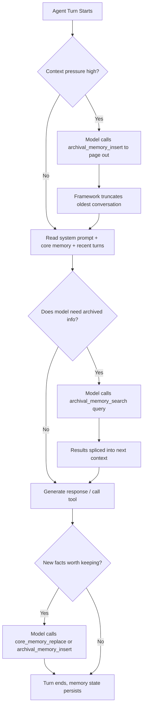

# Memory: Virtual Context and MemGPT

## Learning Objectives

- Implement a two-tier memory system with core memory (always in context) and archival memory (searchable external store) using Python stdlib.
- Compare MemGPT's self-editing memory pattern to RAG's fixed-corpus retrieval — identify when each applies.
- Trace the paging algorithm: how context pressure triggers swaps between core and archival tiers.
- Build a minimal virtual context manager that persists agent state across simulated multi-step tool calls.
- Evaluate the trade-off between model-controlled memory adaptation and deterministic memory management.

## The Problem

You are running a multi-step enrichment waterfall. Step 1 pulls a company's technographic stack. Step 2 fetches recent funding news. Step 3 scores ICP fit. Step 4 drafts personalized outreach referencing all three prior results. By step 4, the agent has accumulated tool outputs, intermediate reasoning, rejection reasons from prior attempts, and partial matches. The context window fills. The agent forgets what it learned in step 1 — it cannot reference the technographic data because that content has scrolled out of attention. It duplicates work or produces contradictory decisions.

This is the memory wall. It is not solved by larger context windows. Even at 128k tokens, three failure modes recur in production agent loops:

**Overflow.** Multi-turn conversations, long documents, and tool-call-heavy trajectories cross the window boundary. Everything past the cutoff is gone — not degraded, gone.

**Dilution.** Even within the window, stuffing irrelevant context dilutes attention over what matters. Frontier models still degrade on long inputs when signal-to-noise drops. An enrichment agent carrying 40 pages of technographic JSON will reason worse about ICP fit than one carrying a 200-word summary.

**Persistence.** A new session starts with an empty window. Agents without external memory cannot recall what they learned in a prior session — the rejection reason from yesterday's outreach attempt, the partial match from last week's enrichment run. Every cold start is literally cold.

Bigger windows help but do not fix this. The Mem0 team's 2025 benchmark measured that 128k-window baselines still miss long-horizon facts that a 4k-window agent with external memory catches — the model loses signal in the noise even when the token budget exists.

## The Concept

Packer et al. (arXiv:2310.08560) frame context management as operating-system virtual memory. The LLM's context window is RAM — bounded, fast, always visible to the processor. External storage is disk — unbounded, slower, not visible until loaded. The agent pages between them.

The mapping is precise:

| OS concept | MemGPT concept | What it holds |
|------------|---------------|---------------|
| RAM | Main context window | System prompt, core memory, recent conversation |
| CPU registers | Core memory | Always-in-context facts the model can edit |
| Disk | Archival memory | External store, searchable, not in context until paged in |
| CPU cache | Conversational memory | Recent dialogue turns, automatically managed |
| Page fault | Memory interrupt | Model calls a function to fetch from archival |

Three tiers, each with different persistence and visibility:

**Core memory** is always injected into the system prompt. The model sees it every turn. It contains the facts the model decided are load-bearing — a customer's ICP status, a rejection reason, a routing decision. The model edits core memory through function calls like `core_memory_replace(old, new)`. Think of it as the model's scratchpad for what matters right now.

**Archival memory** is an external store — conceptually a vector database, though MemGPT's reference implementation uses retrieval over text chunks. The model does not see archival content unless it calls `archival_memory_search(query)`. Archival holds everything the model encountered but decided was not immediately needed: full tool outputs, historical conversation logs, background documents. The model pages content in when a future turn requires it.

**Conversational memory** is the recent dialogue window. This is automatically managed — the framework keeps the last N turns and truncates older ones. The model does not directly edit this tier, but it can push important facts from conversation into core memory before they scroll off.



The critical distinction from RAG: RAG retrieves from a fixed corpus that the model cannot modify. Virtual context lets the model *edit its own working memory during execution.* The model is the memory manager. It decides what to promote to core, what to demote to archival, what to search for. This trades deterministic control for adaptability — the model might forget to remember, failing to call the right memory function at the right time. That risk is the engineering trade-off.

[CITATION NEEDED — concept: MemGPT paper formal tier definitions and paging algorithm, arXiv:2310.08560]

## Build It

Build a minimal virtual context manager in Python stdlib. This implements the two-tier pattern: core memory (a dict the model edits), archival memory (a list of text chunks with keyword search), and a simulated agent loop that exercises the paging operations.

```python
import json
from dataclasses import dataclass, field
from typing import Optional

@dataclass
class VirtualContext:
    core_memory: dict = field(default_factory=dict)
    archival: list = field(default_factory=list)
    conversation: list = field(default_factory=list)
    max_context_tokens: int = 2000

    def estimate_tokens(self, text: str) -> int:
        return len(text) // 4

    def context_pressure(self) -> float:
        total = 0
        for v in self.core_memory.values():
            total += self.estimate_tokens(str(v))
        for turn in self.conversation:
            total += self.estimate_tokens(str(turn))
        return total / self.max_context_tokens

    def core_memory_replace(self, key: str, old_val: str, new_val: str) -> str:
        current = self.core_memory.get(key, "")
        if old_val and old_val in current:
            self.core_memory[key] = current.replace(old_val, new_val)
        else:
            self.core_memory[key] = new_val
        return f"Core memory updated: {key} = {self.core_memory[key]}"

    def core_memory_append(self, key: str, value: str) -> str:
        current = self.core_memory.get(key, "")
        self.core_memory[key] = (current + " " + value).strip()
        return f"Appended to {key}: {value}"

    def archival_memory_insert(self, text: str) -> str:
        self.archival.append({"id": len(self.archival), "text": text})
        return f"Stored in archival: [{len(self.archival) - 1}] {text[:60]}..."

    def archival_memory_search(self, query: str, k: int = 3) -> str:
        scored = []
        query_terms = query.lower().split()
        for entry in self.archival:
            text_lower = entry["text"].lower()
            score = sum(1 for term in query_terms if term in text_lower)
            if score > 0:
                scored.append((score, entry))
        scored.sort(key=lambda x: -x[0])
        results = scored[:k]
        if not results:
            return "No archival matches found."
        return "\n".join(
            f"[{e['id']}] (score={s}) {e['text'][:80]}..." for s, e in results
        )

    def add_conversation_turn(self, role: str, content: str) -> None:
        self.conversation.append({"role": role, "content": content})
        pressure = self.context_pressure()
        if pressure > 0.8:
            oldest = self.conversation.pop(0)
            self.archival_memory_insert(
                f"[PAGED OUT - {oldest['role']}]: {oldest['content']}"
            )

    def build_system_prompt(self) -> str:
        core = json.dumps(self.core_memory, indent=2)
        recent = "\n".join(
            f"{t['role']}: {t['content'][:100]}" for t in self.conversation[-5:]
        )
        return f"CORE MEMORY:\n{core}\n\nRECENT TURNS:\n{recent}"

vm = VirtualContext(max_context_tokens=500)

vm.core_memory_replace("icp_status", "", "qualified")
vm.core_memory_replace("technographic", "", "uses Snowflake, Segment, dbt")
vm.archival_memory_insert(
    "Acme Corp raised $40M Series B in March 2025, led by Sequoia. "
    "They are hiring 12 data engineers. CTO previously at Databricks."
)
vm.archival_memory_insert(
    "Acme Corp tech stack: Snowflake for warehouse, Segment for CDP, "
    "dbt for transforms, Looker for BI. No reverse ETL tool detected."
)
vm.archival_memory_insert(
    "Prior outreach to Acme Corp SDR team in Jan 2025: no response. "
    "Reason inferred: budget cycle not open. Re-engage after funding event."
)

vm.add_conversation_turn("user", "Draft outreach to Acme Corp's VP Data Engineering.")
vm.add_conversation_turn("assistant", "I need the funding context and prior rejection reason.")

results = vm.archival_memory_search("Acme Corp funding rejection")
print("ARCHIVAL SEARCH RESULTS:")
print(results)
print()

vm.core_memory_append("outreach_context", "Series B funded, prior cold outreach in Jan failed, re-engage now")

print("\nFINAL SYSTEM PROMPT:")
print(vm.build_system_prompt())
print(f"\nContext pressure: {vm.context_pressure():.1%}")
```

Run it. The output shows the archival search returning scored results, the core memory updates, and the final system prompt the agent would receive — all state that persists across turns.

Now extend it to simulate the paging-out behavior when context pressure rises:

```python
import json
from dataclasses import dataclass, field

@dataclass
class PagingDemo:
    core_memory: dict = field(default_factory=dict)
    archival: list = field(default_factory=list)
    conversation: list = field(default_factory=list)
    max_context_tokens: int = 300
    page_outs: int = 0

    def _tokens(self, text):
        return len(text) // 4

    def pressure(self):
        total = sum(self._tokens(str(v)) for v in self.core_memory.values())
        total += sum(self._tokens(str(t)) for t in self.conversation)
        return total / self.max_context_tokens

    def add_turn(self, role, content):
        self.conversation.append({"role": role, "content": content})
        while self.pressure() > 0.8 and len(self.conversation) > 2:
            oldest = self.conversation.pop(0)
            self.archival.append(f"[PAGED OUT] {oldest['role']}: {oldest['content'][:60]}")
            self.page_outs += 1

    def status(self):
        return (
            f"Turns in context: {len(self.conversation)} | "
            f"Archival entries: {len(self.archival)} | "
            f"Page-outs: {self.page_outs} | "
            f"Pressure: {self.pressure():.0%}"
        )

demo = PagingDemo(max_context_tokens=300)
demo.core_memory["account"] = "Acme Corp - ICP qualified"

steps = [
    "Technographic: Snowflake, Segment, dbt",
    "Funding: $40M Series B, March 2025",
    "Prior outreach: cold in Jan, no response",
    "Hiring: 12 data engineers, CTO ex-Databricks",
    "ICP score: 87/100 - strong fit",
    "Decision maker: VP Data Eng, Sarah Chen",
    "Trigger: just posted about data pipeline pain",
    "Routing: warm outbound sequence, reference trigger",
]

print("Simulating 8 enrichment steps with context pressure:\n")
for i, step in enumerate(steps):
    demo.add_turn("tool_result", step)
    print(f"Step {i+1}: {demo.status()}")

print(f"\nArchival after paging:")
for entry in demo.archival:
    print(f"  {entry}")

print(f"\nRemaining in active context:")
for turn in demo.conversation:
    print(f"  {turn['role']}: {turn['content'][:50]}...")
```

Run this. You will see context pressure climb, the automatic page-out trigger fire, and older turns migrate to archival while recent ones stay active. This is the mechanism MemGPT formalizes — the agent loop self-manages its working set.

## Use It

Virtual context management maps directly to multi-step GTM enrichment workflows. Consider the account intelligence waterfall: an agent pulls technographic data, cross-references funding signals, checks prior engagement history, scores ICP fit, and drafts a personalized sequence opener. Without memory management, step 4 cannot reference step 1 because the context has filled with intermediate JSON. With virtual context, the agent promotes the load-bearing facts to core memory ("Acme uses Snowflake, funded $40M, prior cold outreach failed") and archives the raw tool output. When it needs a detail — the CTO's previous company — it searches archival and pages it back in.

The model-controlled memory pattern means the agent decides what is worth remembering. In a Clay enrichment waterfall where every credit is a token cost, this matters twice: first because context pressure degrades reasoning quality, and second because bloated context increases API cost per call. Zone 14 of the GTM stack — cost optimization and latency — is directly served by virtual context. Every Clay credit spent on an enrichment step has a downstream token cost when that result enters the agent's context. Promoting a 200-character summary to core memory instead of a 4,000-token raw API response saves tokens on every subsequent turn.

For a micro online event invitation workflow — inviting a decision-maker to a virtual roundtable with peers in their space — the agent needs to remember three things across 6-8 tool calls: the prospect's role and seniority, the roundtable topic relevance, and any prior touchpoint. Virtual context keeps these three facts in core memory and pages out everything else. Without it, the agent re-fetches the prospect's LinkedIn profile on step 5 because the step 1 result scrolled out of context. That is a wasted API call and a wasted Clay credit.

The same pattern applies to routing decisions. If the agent determines a match is ICP-qualified and routes to a warm outbound sequence with visit context in the opening line, that routing decision must survive into the message-drafting step. Store it in core memory. The next turn, the agent sees the routing decision without re-running the qualification logic. For new-executive sequences — "Saw you recently joined X as Y" — the executive transition event is the one fact that must be in core memory when the message is drafted, even if it was detected four tool calls ago.

## Ship It

To deploy virtual context in a production GTM agent, you need three components and one discipline.

**Component 1: Core memory store.** A persistent key-value store that gets injected into every system prompt. In production this is often a JSON blob in a database row — keyed by account or session ID. The agent reads it at the start of each turn and can write to it via tool calls.

**Component 2: Archival store with search.** A vector database (Pinecone, Weaviate) or even a simple SQLite full-text search table for lower volumes. The agent inserts raw tool outputs here after extracting summaries for core memory. When it needs a detail, it calls a search function that returns ranked chunks.

**Component 3: Memory tools exposed to the model.** The agent's function-calling interface must include `core_memory_replace`, `core_memory_append`, `archival_memory_insert`, and `archival_memory_search`. These are the paging operations. The model decides when to call them — that is the design choice MemGPT makes.

**The discipline: audit what the model remembers.** Model-controlled memory means the model can forget to remember. It can fail to promote a critical fact to core memory, or it can over-promote noise. In a GTM context, this means periodically inspecting core memory state after enrichment runs. Did the agent persist the rejection reason? Did it archive the full technographic dump or lose it? If the agent consistently forgets a specific fact, add a deterministic check — after step N, verify that fact X exists in core memory before proceeding.

Here is a production-style memory audit that checks whether the right facts survived a simulated enrichment run:

```python
import json

def audit_core_memory(core_memory, required_facts):
    missing = []
    for fact_name, check_fn in required_facts.items():
        value = core_memory.get(fact_name, "")
        if not check_fn(value):
            missing.append(fact_name)
    return {
        "passed": len(missing) == 0,
        "missing": missing,
        "core_memory_snapshot": dict(core_memory),
    }

core_memory_after_run = {
    "account": "Acme Corp",
    "icp_status": "qualified",
    "technographic": "Snowflake, Segment, dbt",
    "funding": "",
    "prior_outreach": "cold Jan 2025 - no response",
    "routing": "warm outbound, reference funding trigger",
}

required = {
    "account": lambda v: len(v) > 0,
    "icp_status": lambda v: v == "qualified",
    "technographic": lambda v: "Snowflake" in v,
    "funding": lambda v: len(v) > 0,
    "prior_outreach": lambda v: "Jan" in v,
    "routing": lambda v: "warm" in v,
}

result = audit_core_memory(core_memory_after_run, required)
print(json.dumps(result, indent=2))

if not result["passed"]:
    print(f"\nAUDIT FAILED: model forgot to persist {result['missing']}")
    print("Action: add a deterministic post-step check to force these into core memory.")
else:
    print("\nAUDIT PASSED: all required facts in core memory.")
```

Run it. The audit catches that `funding` is empty — the model forgot to promote the funding detail from archival to core. This is exactly the failure mode that model-controlled memory introduces, and exactly what deterministic guardrails catch.

For cost optimization, track the ratio of core memory tokens to total context tokens. If core memory is 10% of context but archival searches return results that never get used, the agent is over-archiving. If core memory is 80% of context, the agent is under-archiving and context pressure will degrade reasoning. A healthy ratio for enrichment workflows is 20-40% core memory, 40-60% recent conversation, and the remainder for system instructions.

## Exercises

1. **Add a third tier.** Extend `VirtualContext` to include a "recall memory" tier — a summary of the full conversation history, auto-generated every N turns. The model should be able to call `recall_memory_summarize()` to trigger summarization. Test whether a 20-turn enrichment simulation maintains consistent state better with recall memory than without.

2. **Measure context pressure impact.** Run the `PagingDemo` with `max_context_tokens` set to 100, 300, and 1000. At each setting, count how many page-outs occur across 8 enrichment steps. Plot the relationship between available context and page-out frequency. Write a one-paragraph analysis of the trade-off: smaller context forces more paging (more latency from archival searches) but keeps the working set focused.

3. **Build a deterministic memory guardrail.** Instead of relying on the model to call `core_memory_replace`, write a post-tool-call hook that inspects each tool result and deterministically extracts specific facts (ICP status, funding amount, prior outreach date) into core memory. Compare the audit pass rate of model-controlled memory vs. deterministic memory on a simulated 10-step enrichment run.

4. **Implement archival search with TF-IDF.** Replace the keyword-counting search in `archival_memory_search` with a proper TF-IDF ranker using only Python stdlib (`math`, `collections`). Test it against a corpus of 50 simulated enrichment notes. Measure whether TF-IDF ranking changes which results surface first compared to keyword counting.

## Key Terms

**Virtual context management** — The pattern of treating the LLM context window as bounded working memory (RAM) and using external storage (disk) for overflow, with the agent paging between them.

**MemGPT** — The system formalized by Packer et al. (2023) that implements virtual context as three tiers: core memory, archival memory, and conversational memory, with the model controlling its own memory operations through function calls.

**Core memory** — Always-in-context, model-editable facts. Conceptually equivalent to CPU registers. Injected into the system prompt every turn.

**Archival memory** — External searchable storage not visible to the model until retrieved via a search function call. Conceptually equivalent to disk storage.

**Context pressure** — The ratio of estimated tokens in active context to the maximum context window. When pressure exceeds a threshold, the framework or model triggers page-out operations.

**Paging** — The operation of moving information between memory tiers: promoting from archival to core (page-in) or demoting from conversation/core to archival (page-out).

**Memory interrupt** — A function call the model issues to query or modify external memory, conceptually analogous to a hardware interrupt that signals the CPU to handle an I/O operation.

**Self-editing memory** — The property that distinguishes virtual context from RAG: the model can insert, update, and delete its own working memory during execution, rather than only retrieving from a fixed corpus.

## Sources

- Packer, C., Wooders, S., Lin, K., Fang, V., & Narasimhan, S. (2023). "MemGPT: Towards LLMs as Operating Systems." arXiv:2310.08560. [CITATION NEEDED — concept: formal tier definitions, paging trigger thresholds, and context pressure calculation algorithm from MemGPT v2 (Feb 2024)]
- Mem0 (2025). Memory benchmark comparing 128k-window baselines to 4k-window agents with external memory on long-horizon fact retention. [CITATION NEEDED — concept: Mem0 2025 paper showing 128k baselines miss long-horizon facts that external memory catches]
- Zone 14 GTM mapping: "Every Clay credit is a token cost — optimize like you would LLM calls" — from Living GTM Stack cost management principles. [CITATION NEEDED — concept: Zone 14 GTM stack row mapping cost optimization to credit/token equivalence]