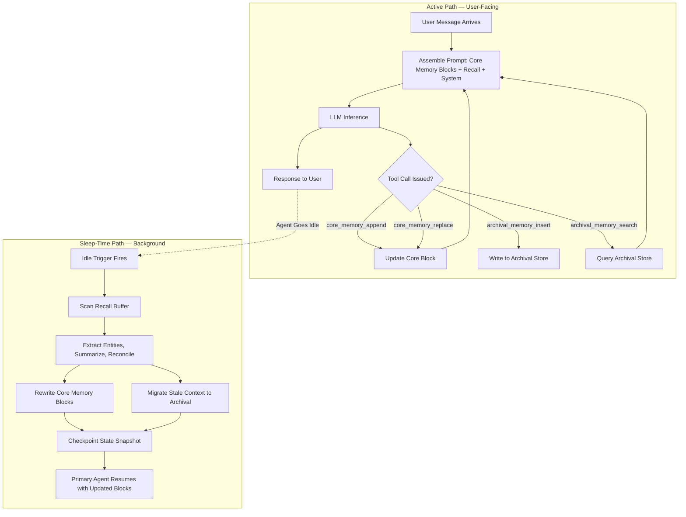

# Memory Blocks and Sleep-Time Compute (Letta)

## Learning Objectives

- Implement a three-tier memory hierarchy (core, recall, archival) using typed memory blocks that an agent reads and modifies through tool calls.
- Configure a sleep-time compute pass that consolidates, summarizes, and migrates information between memory tiers without blocking the primary inference path.
- Compare core-memory token costs against archival recall latency to make sizing decisions for production agents.
- Build a two-agent loop where a primary agent serves responses and a background agent reorganizes memory during idle periods.
- Trace the data flow from user input through memory tool calls to updated context state, identifying where memory corruption can occur and how checkpointing mitigates it.

## The Problem

The MemGPT pattern solved virtual memory for LLMs — paging context in and out of the context window via tool calls. But three production problems became visible once you tried to run MemGPT-style agents for more than a demo session.

First, latency. Every memory operation sits on the critical path. When the agent calls `core_memory_append` or `archival_memory_search`, that tool call consumes a round-trip. If the agent also needs to summarize or prune old context to make room, the user is waiting while the agent does bookkeeping. In a customer-facing workflow — a chat widget, a research agent, an outbound sequencer — tail latency of 8–12 seconds per turn is unacceptable.

Second, memory rot. Writes accumulate across sessions. Facts that were true yesterday are contradicted today, but the old fact stays in archival memory. Retrieval surfaces stale content because nothing ever prunes or reconciles. After a week of operation, the agent's memory is a landfill.

Third, structure loss. A flat archival store cannot express intent: this block always lives in the prompt, this block is per-session, this block holds persona instructions the agent should never overwrite. MemGPT had two hardcoded blocks (`human` and `persona`). Production agents need more.

Letta is the 2024–2026 rewrite that addresses all three. Memory blocks make structure explicit and first-class. Sleep-time compute moves consolidation off the critical path and into idle cycles.

## The Concept

### Three Memory Tiers

Letta applies the operating-system memory hierarchy to LLM context management. Three tiers, each with different latency, persistence, and cost characteristics:

| Tier | Scope | Where It Lives | Written By |
|------|-------|----------------|------------|
| Core | Always visible in prompt | Inside the main context window | Agent tool calls + sleep-time rewrites |
| Recall | Conversation history | Retrievable, not always in prompt | Automatic turn logging |
| Archival | Arbitrary facts, documents | Vector store / KV store / graph | Agent tool calls + sleep-time jobs |

Core memory is your registers and L1 cache — small, fast, always resident. Recall is RAM — paginated in as needed. Archival is disk — large, slow, searched by query.

### Memory Blocks: Named, Typed, Editable

Core memory is not a single blob. It is a set of named **memory blocks** — each with a label, a description, a character limit, and editable content. The Letta default agent ships with two: `human` (facts about the user) and `persona` (instructions and personality for the agent). You can define arbitrary additional blocks: `account_notes`, `task_state`, `project_context`, whatever your workflow needs.

The critical design choice is that the agent edits these blocks itself, via tool calls. The tool `core_memory_append(block_name, content)` adds text to the end of a block. The tool `core_memory_replace(block_name, old_str, new_str)` does substring replacement. The agent issues these calls during inference, just like calling any other function — except the return value is the updated block state, and the updated block is now part of the prompt for the next turn.

This is the agent rewriting its own system prompt at runtime. That is a powerful capability and a production risk, which we address in Ship It.

### Sleep-Time Compute

The second mechanism is **sleep-time compute** — a background process that runs when the primary agent is idle. Instead of burning context tokens and user-facing latency on memory consolidation during a conversation, the agent defers that work to a separate compute pass.



The sleep-time pass replays recent interactions, extracts entities, re-summarizes verbose recall into compact core-memory updates, and migrates stale facts to archival. Because it runs asynchronously, it can use a stronger model than the primary agent — the latency cost is invisible to the user. The agent effectively "dreams": consolidating the day's interactions into durable memory.

This pattern is directly analogous to offline batch processing in traditional data engineering. Online queries serve the user immediately. Offline jobs run overnight to reindex, deduplicate, and optimize. Letta applies the same architecture to agent memory.

## Build It

We will build the memory hierarchy mechanism in pure Python — no SDK dependency, no running server. This demonstrates the pattern directly. The Letta SDK (`pip install letta`) wraps this same logic behind a REST API, but the mechanism is what matters.

```python
import json
import hashlib
from datetime import datetime, timezone
from collections import deque


class MemoryBlock:
    def __init__(self, name, description="", value="", limit=2000):
        self.name = name
        self.description = description
        self.value = value
        self.limit = limit

    def append(self, text):
        new_value = self.value + text
        if len(new_value) > self.limit:
            return False
        self.value = new_value
        return True

    def replace(self, old_str, new_str):
        if old_str not in self.value:
            return False
        self.value = self.value.replace(old_str, new_str, 1)
        return True

    def token_estimate(self):
        return len(self.value) // 4

    def to_dict(self):
        return {
            "name": self.name,
            "description": self.description,
            "value": self.value,
            "limit": self.limit,
            "est_tokens": self.token_estimate(),
        }


class CoreMemory:
    def __init__(self, blocks):
        self.blocks = {b.name: b for b in blocks}

    def append(self, block_name, text):
        block = self.blocks.get(block_name)
        if not block:
            return {"ok": False, "error": f"No block named {block_name}"}
        ok = block.append(text)
        return {"ok": ok, "block": block.to_dict()}

    def replace(self, block_name, old_str, new_str):
        block = self.blocks.get(block_name)
        if not block:
            return {"ok": False, "error": f"No block named {block_name}"}
        ok = block.replace(old_str, new_str)
        return {"ok": ok, "block": block.to_dict()}

    def render(self):
        sections = []
        for name, block in self.blocks.items():
            sections.append(
                f"<{name}>\nDescription: {block.description}\nContent:\n{block.value}\n</{name}>"
            )
        return "\n\n".join(sections)

    def total_tokens(self):
        return sum(b.token_estimate() for b in self.blocks.values())


class ArchivalMemory:
    def __init__(self):
        self.records = {}
        self._next_id = 0

    def insert(self, text, metadata=None):
        idx = self._next_id
        self._next_id += 1
        keywords = set(
            w.strip(".,!?;:\"'()[]{}").lower()
            for w in text.split()
            if len(w.strip(".,!?;:\"'()[]{}")) > 2
        )
        self.records[idx] = {
            "id": idx,
            "text": text,
            "metadata": metadata or {},
            "keywords": keywords,
            "timestamp": datetime.now(timezone.utc).isoformat(),
        }
        return idx

    def search(self, query, limit=5):
        query_words = set(
            w.strip(".,!?;:\"'()[]{}").lower()
            for w in query.split()
            if len(w.strip(".,!?;:\"'()[]{}")) > 2
        )
        scored = []
        for idx, record in self.records.items():
            overlap = len(query_words & record["keywords"])
            if overlap > 0:
                scored.append((overlap, -idx, record))
        scored.sort(key=lambda x: (-x[0], x[1]))
        return [r for _, _, r in scored[:limit]]

    def count(self):
        return len(self.records)


class RecallMemory:
    def __init__(self, max_messages=100):
        self.messages = deque(maxlen=max_messages)

    def log(self, role, content):
        self.messages.append(
            {
                "role": role,
                "content": content,
                "timestamp": datetime.now(timezone.utc).isoformat(),
            }
        )

    def search(self, query, limit=5):
        query_lower = query.lower()
        results = [
            msg for msg in self.messages if query_lower in msg["content"].lower()
        ]
        return results[:limit]

    def recent(self, n=10):
        return list(self.messages)[-n:]


core = CoreMemory(
    [
        MemoryBlock(
            name="persona",
            description="Agent personality and instructions",
            value="You are a research assistant focused on B2B account intelligence.",
            limit=2000,
        ),
        MemoryBlock(
            name="human",
            description="Facts about the user and current account",
            value="User is a GTM engineer at a SaaS company.",
            limit=2000,
        ),
        MemoryBlock(
            name="account_notes",
            description="Accumulated account intelligence, updated by sleep-time jobs",
            value="",
            limit=3000,
        ),
    ]
)

archival = ArchivalMemory()
recall = RecallMemory()

simulated_tool_calls = [
    ("core_memory_append", "account_notes", "\n- Acme Corp uses Salesforce and Snowflake"),
    ("core_memory_append", "account_notes", "\n- Hiring 3 SDRs, posted Q1 2026"),
    ("core_memory_replace", "human", "SaaS company", "B2B SaaS company, 200 employees"),
]

for call in simulated_tool_calls:
    op = call[0]
    if op == "core_memory_append":
        result = core.append(call[1], call[2])
        print(f"[tool_call] {op}('{call[1]}', ...) -> ok={result['ok']}")
    elif op == "core_memory_replace":
        result = core.replace(call[1], call[2], call[3])
        print(f"[tool_call] {op}('{call[1]}', ...) -> ok={result['ok']}")

archival.insert(
    "Acme Corp 10-K filing: revenue grew 34% YoY. Expansion into EMEA market planned for Q2 2026.",
    metadata={"source": "10-K", "date": "2025-03-15"},
)
archival.insert(
    "CTO of Acme Corp, Sarah Chen, spoke at DataEngineering Summit about migrating from Redshift to Snowflake.",
    metadata={"source": "linkedin", "date": "2025-06-20"},
)
archival.insert(
    "Acme Corp recently acquired DataPipe Inc, a data observability startup, for $45M.",
    metadata={"source": "press_release", "date": "2025-09-03"},
)

print(f"\nArchival records stored: {archival.count()}")

results = archival.search("Snowflake migration Acme")
print("\nArchival search: 'Snowflake migration Acme'")
for r in results:
    print(f"  [{r['id']}] {r['text'][:80]}...")

print(f"\n--- Core Memory State ---")
print(f"Total estimated tokens: {core.total_tokens()}")
for name, block in core.blocks.items():
    print(f"\n[{name}] ({block.token_estimate()} tokens)")
    print(f"  {block.value}")

print(f"\n{'='*60}\n")
```

This is the mechanism. The agent calls `core_memory_append` and `core_memory_replace` as tool calls during inference. Core memory is always in the prompt. Archival memory is queried on demand. Now we add sleep-time compute — the background consolidation pass.

```python
import re
from datetime import datetime, timezone


def sleep_time_consolidation(core_memory, archival_memory, recall_memory, target_block="account_notes"):
    print(f"[sleep-time] Consolidation pass started at {datetime.now(timezone.utc).isoformat()}")
    print(f"[sleep-time] Scanning {len(recall_memory.messages)} recall messages...")

    recent_messages = recall_memory.recent(20)
    if not recent_messages:
        print("[sleep-time] No messages to consolidate.")
        return {"extracted": 0, "archived": 0, "summarized": 0}

    entity_pattern = re.compile(r"\b[A-Z][a-z]+(?:\s+[A-Z][a-z]+)*\b")
    money_pattern = re.compile(r"\$[\d,.]+[MBK]?")
    tech_pattern = re.compile(r"\b(Salesforce|Snowflake|Redshift|Databricks|Segment|HubSpot|Clay|Outreach|Gong|Salesloft)\b")

    all_entities = set()
    all_tech = set()
    all_money = set()

    for msg in recent_messages:
        content = msg["content"]
        entities = entity_pattern.findall(content)
        tech = tech_pattern.findall(content)
        money = money_pattern.findall(content)
        all_entities.update(entities)
        all_tech.update(tech)
        all_money.update(money)

    filter_words = {"The", "This", "That", "And", "But", "For", "With", "From", "They", "Are", "Was", "Were", "Will", "Has", "Have", "Had", "Not", "Yes", "No", "OK"}
    all_entities -= filter_words

    existing = core_memory.blocks[target_block].value
    new_facts = []

    if all_tech:
        tech_str = ", ".join(sorted(all_tech))
        if tech_str not in existing:
            new_facts.append(f"\n- Tech stack confirmed: {tech_str}")

    if all_money:
        money_str = ", ".join(sorted(all_money))
        if money_str not in existing:
            new_facts.append(f"\n- Financial signals: {money_str}")

    if all_entities:
        entity_str = ", ".join(sorted(list(all_entities)[:5]))
        if entity_str not in existing:
            new_facts.append(f"\n- Key people/orgs mentioned: {entity_str}")

    extracted_count = 0
    for fact in new_facts:
        result = core_memory.append(target_block, fact)
        if result["ok"]:
            extracted_count += 1
            print(f"[sleep-time] + Wrote to {target_block}: {fact.strip()}")

    messages_to_archive = recent_messages[: len(recent_messages) // 2]
    archived_count = 0
    for msg in messages_to_archive:
        archival_memory.insert(
            msg["content"],
            metadata={
                "source": "sleep_time_consolidation",
                "role": msg["role"],
                "original_timestamp": msg["timestamp"],
            },
        )
        archived_count += 1

    print(f"[sleep-time] Extracted {extracted_count} new facts to core memory.")
    print(f"[sleep-time] Archived {archived_count} older messages to archival store.")

    return {
        "extracted": extracted_count,
        "archived": archived_count,
        "entities_found": len(all_entities),
        "tech_found": len(all_tech),
    }


recall.log("user", "I looked into Acme Corp. Their CTO Sarah Chen just presented at DataEngineering Summit about their Snowflake migration from Redshift.")
recall.log("assistant", "Noted. Sarah Chen is the CTO at Acme Corp, and they migrated from Redshift to Snowflake. This aligns with the signal from their 10-K.")
recall.log("user", "Acme also acquired DataPipe Inc for $45M last quarter. They're expanding into EMEA with a $12M budget allocated.")
recall.log("assistant", "Tracking: DataPipe acquisition ($45M), EMEA expansion ($12M budget). These are strong intent signals for a data infrastructure pitch.")

print("=== BEFORE SLEEP-TIME ===")
print(f"[account_notes] tokens: {core.blocks['account_notes'].token_estimate()}")
print(f"[account_notes] value:\n{core.blocks['account_notes'].value}")
print(f"[archival] records: {archival.count()}")

print("\n=== RUNNING SLEEP-TIME CONSOLIDATION ===\n")
result = sleep_time_consolidation(core, archival, recall, "account_notes")

print(f"\n=== AFTER SLEEP-TIME ===")
print(f"[account_notes] tokens: {core.blocks['account_notes'].token_estimate()}")
print(f"[account_notes] value:\n{core.blocks['account_notes'].value}")
print(f"[archival] records: {archival.count()}")
print(f"\nConsolidation result: {json.dumps(result, indent=2)}")
```

Run both scripts in sequence. The first establishes the memory state with tool calls. The second shows the sleep-time pass extracting entities from recall, writing them to core memory, and archiving older messages. The before/after state prints confirm the consolidation happened.

## Use It

The memory hierarchy pattern maps directly to persistent account intelligence in a multi-touch outbound workflow. When an agent researches an account across sessions — scraping a 10-K, monitoring LinkedIn activity, capturing technographic signals, logging email replies — memory blocks are how that accumulated intelligence persists in a queryable form. Sleep-time compute is how you prevent that intelligence from rotting between touches.

Consider a Clay enrichment waterfall that runs weekly on a list of 500 target accounts. The naive approach: every run starts from scratch, re-scraping the same LinkedIn profiles, re-querying the same 10-K filings, re-enriching the same technographic data. This is the agent-without-memory pattern. Each enrichment run is a blank slate, burning credits and API calls on data you already collected. [CITATION NEEDED — concept: Clay enrichment workflows with persistent state across runs]

The memory-block approach: core memory holds the current account summary — the facts the agent needs in-context for every interaction. The `account_notes` block contains the compressed intelligence: tech stack, hiring signals, recent funding, key decision-makers. Archival memory holds the source documents — the full 10-K text, the LinkedIn post history, the raw press release. When the agent needs detail, it queries archival. When it needs the summary, the core block is already in the prompt.

Sleep-time compute handles the gap between enrichment runs. After a week of new signals — a funding announcement, a leadership change, a product launch — the sleep-time pass scans the recall buffer (recent interactions), extracts the new facts, reconciles them against existing core memory, and writes the updated summary. The next enrichment run starts with a richer core memory block, not a blank slate. This is the mechanism behind "account intelligence that improves with every touch" — the agent consolidates accumulated knowledge asynchronously rather than recomputing from scratch each cycle.

The cost connection is direct. Every memory operation has a token cost. Core memory burns context tokens on every inference — if the block is oversized, you pay for it on every turn. Archival search adds a retrieval round-trip but keeps the prompt lean. Sleep-time compute lets you run consolidation on a cheaper schedule (off-peak, batch, with a stronger model that only runs once per cycle) rather than paying for consolidation tokens on every user-facing turn. This is Zone 14 cost optimization applied to agent memory: every token is a line item, and the memory hierarchy is how you route tokens to the cheapest tier that meets your latency requirement. [CITATION NEEDED — concept: GTM Stack Cost Management applied to agent memory tiers, 80/20 GTM Engineer Handbook]

## Ship It

Four production concerns dominate once you deploy a Letta-style agent with memory blocks and sleep-time compute.

**Core memory sizing.** Every character in a core memory block is in the prompt on every inference call. A 3,000-character block costs roughly 750 tokens per turn. With four blocks at