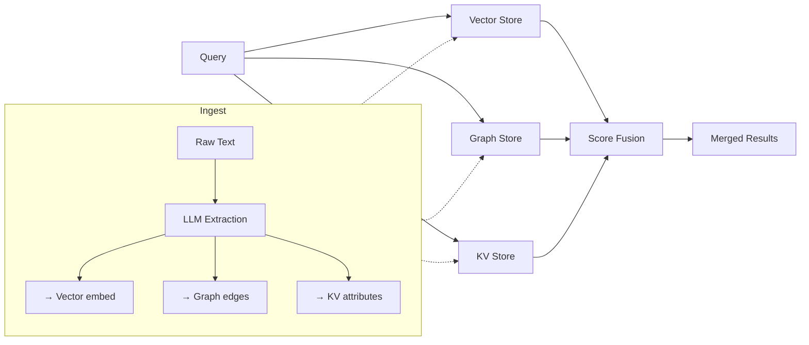

# Hybrid Memory: Vector + Graph + KV (Mem0)

## Learning Objectives

- Build a three-store memory system (vector, graph, KV) in Python stdlib that writes to all three on ingestion and fuses results on retrieval.
- Compare failure modes of each store in isolation — semantic miss, relationship miss, exact-match waste — using observable query output.
- Implement reciprocal rank fusion to merge ranked lists from heterogeneous stores into a single result set.
- Trace Mem0's extraction-to-ingestion pipeline from raw text through entity/relation extraction to parallel writes and score-fused retrieval.
- Evaluate the latency and cost trade-offs of fan-out retrieval against single-store baselines on a batch benchmark.

## The Problem

You have tried pure vector retrieval. It handles "what did we discuss about Q3 budget?" well — the embedding of that query lands near relevant conversation snippets. But it fails on relational questions. "Alice works at Acme" and "Acme uses Salesforce" sit at unrelated positions in embedding space even though they are one graph hop apart. Your agent returns a semantic near-match about Alice's role but cannot connect it to Acme's tech stack, because that connection is a traversal, not a similarity.

Pure graph stores have the inverse problem. They answer "who reports to the VP of Engineering?" with a single edge lookup, but miss fuzzy recall entirely. "What did the prospect say about their timeline?" is a similarity query — the prospect did not use the word "timeline" every time, and the graph has no edge for paraphrase. And pure KV stores handle "what is the company name?" in O(1), but collapse on anything that is not an exact key match.

Production agents issue all three query types in a single conversation. A single-store memory is wrong for two of three questions, and the agent cannot predict in advance which type the next user turn will require. The solution is not to pick a better single store — it is to run all three in parallel and merge.

## The Concept

Three memory primitives, each with a distinct failure surface:

**Vector store** embeds text into a high-dimensional space. Retrieval is cosine similarity — nearest neighbors by angle. It handles paraphrase, synonym, and fuzzy semantic recall. It fails on multi-hop relationships because embedding distance does not encode transitive structure. Two facts that are one edge apart in a graph can be orthogonal in embedding space.

**Graph store** represents entities as nodes and relationships as typed edges. Retrieval is traversal — follow edges from a seed entity. It answers "who works at Acme?" and "what tools does Acme use?" in one hop. It fails on fuzzy recall because there is no similarity metric — either the edge exists or it does not. A paraphrased query ("what's Alice's role?") does not match an edge labeled `has_title("Alice", "VP Engineering")` unless you normalize the query.

**KV store** maps a structured key to a value. Retrieval is exact hash lookup — O(1). It handles "user_id=42, phone" instantly. It fails on anything that is not an exact key match. "How do I contact Alice?" requires resolving "contact" to "phone" or "email" and "Alice" to a user_id before the lookup can even begin.

The hybrid merge pattern runs all three in parallel and fuses their ranked lists:



On ingestion, the system extracts entities and relations from raw text — typically via an LLM call — then writes the raw text as an embedding to the vector store, typed edges to the graph store, and structured key-value pairs to the KV store. On retrieval, the query fans out to all three stores simultaneously. Each store returns a ranked list. A fusion function — typically reciprocal rank fusion or a weighted score — merges the three lists into one, deduplicates by entity or fact ID, and returns the top-k.

Mem0 (Chhikara et al., 2025; arXiv:2504.19413) implements this pattern as a managed API. On `add(text, user_id, metadata)`, an LLM extracts candidate facts, and Mem0 writes them across all three backing stores automatically. On `search(query, user_id)`, the fan-out and fusion happen server-side. The contribution is not novelty of any single store — it is the extraction pipeline that feeds all three from unstructured text and the fusion layer that makes the fan-out transparent to the caller.

## Build It

Before reaching for the Mem0 SDK, build the mechanism in stdlib. This toy implementation uses bag-of-words vectors for the "vector store," an adjacency list for the "graph store," and a dict for the "KV store." It is not production-grade, but it makes the fusion pattern observable: every search result prints which store answered and with what rank.

```python
import math
import re
from collections import defaultdict

def tokenize(text):
    return re.findall(r'\b[a-z0-9]+\b', text.lower())

def cosine_similarity(a, b):
    dot = sum(a[k] * b.get(k, 0) for k in a)
    mag_a = math.sqrt(sum(v * v for v in a.values()))
    mag_b = math.sqrt(sum(v * v for v in b.values()))
    if mag_a == 0 or mag_b == 0:
        return 0.0
    return dot / (mag_a * mag_b)

class HybridMemory:
    def __init__(self):
        self.vector_store = []
        self.graph_store = defaultdict(list)
        self.kv_store = {}
        self.fact_id_counter = 0

    def add(self, text, user_id, entities=None, relations=None, attributes=None):
        fid = self.fact_id_counter
        self.fact_id_counter += 1
        tokens = tokenize(text)
        bow = defaultdict(int)
        for t in tokens:
            bow[t] += 1
        self.vector_store.append({
            "id": fid,
            "text": text,
            "user_id": user_id,
            "vector": dict(bow)
        })
        if entities:
            for ent in entities:
                self.graph_store[ent].append({"fact_id": fid, "text": text, "user_id": user_id})
        if relations:
            for subj, rel, obj in relations:
                self.graph_store[subj].append({
                    "fact_id": fid,
                    "relation": rel,
                    "object": obj,
                    "text": text,
                    "user_id": user_id
                })
        if attributes:
            for key, value in attributes.items():
                kv_key = (user_id, key, value)
                self.kv_store[kv_key] = {"fact_id": fid, "text": text}

        print(f"[INGEST] fact_id={fid} | text='{text}'")
        print(f"         vector tokens={len(bow)} | graph edges={len(relations) if relations else 0} | kv entries={len(attributes) if attributes else 0}")
        return fid

    def search(self, query, user_id, top_k=3):
        query_tokens = tokenize(query)
        query_vec = defaultdict(int)
        for t in query_tokens:
            query_vec[t] += 1

        vector_results = sorted(
            [
                {"fact_id": r["id"], "text": r["text"], "score": cosine_similarity(query_vec, r["vector"]), "store": "vector"}
                for r in self.vector_store
                if r["user_id"] == user_id
            ],
            key=lambda x: x["score"],
            reverse=True
        )[:top_k]

        graph_results = []
        for token in query_tokens:
            for entry in self.graph_store.get(token, []):
                if entry.get("user_id") == user_id:
                    graph_results.append({
                        "fact_id": entry["fact_id"],
                        "text": entry["text"],
                        "score": 1.0,
                        "store": "graph"
                    })
        graph_results = graph_results[:top_k]

        kv_results = []
        for key, entry in self.kv_store.items():
            uid, k, v = key
            if uid == user_id and (v.lower() in query.lower() or k.lower() in query.lower()):
                kv_results.append({
                    "fact_id": entry["fact_id"],
                    "text": entry["text"],
                    "score": 1.0,
                    "store": "kv"
                })
        kv_results = kv_results[:top_k]

        fused = self.reciprocal_rank_fusion(
            {"vector": vector_results, "graph": graph_results, "kv": kv_results},
            top_k=top_k
        )

        print(f"\n[QUERY] '{query}' for user_id={user_id}")
        print(f"        vector hits={len(vector_results)} | graph hits={len(graph_results)} | kv hits={len(kv_results)}")
        print(f"        fused top-{len(fused)}:")
        for i, r in enumerate(fused):
            print(f"        [{i+1}] rrf_score={r['rrf_score']:.3f} | source={r['stores']} | text='{r['text'][:60]}'")
        return fused

    @staticmethod
    def reciprocal_rank_fusion(store_results, top_k=3, k_constant=60):
        scores = defaultdict(float)
        text_map = {}
        store_map = defaultdict(list)
        for store_name, results in store_results.items():
            for rank, item in enumerate(results):
                fid = item["fact_id"]
                rrf_score = 1.0 / (k_constant + rank + 1)
                scores[fid] += rrf_score
                text_map[fid] = item["text"]
                store_map[fid].append(store_name)

        ranked = sorted(scores.items(), key=lambda x: x[1], reverse=True)[:top_k]
        return [
            {"fact_id": fid, "text": text_map[fid], "rrf_score": score, "stores": "+".join(store_map[fid])}
            for fid, score in ranked
        ]


mem = HybridMemory()

mem.add(
    "Alice mentioned the Q4 budget review is scheduled for November",
    user_id="prospect_001",
    entities=["alice", "q4", "budget", "review", "november"],
    relations=[("alice", "scheduled", "q4_budget_review"), ("alice", "works_at", "acme_corp")],
    attributes={"company": "Acme Corp", "role": "VP Engineering"}
)

mem.add(
    "Acme Corp currently uses Salesforce as their CRM",
    user_id="prospect_001",
    entities=["acme_corp", "salesforce", "crm"],
    relations=[("acme_corp", "uses", "salesforce"), ("acme_corp", "has_crm", "salesforce")],
    attributes={"company": "Acme Corp", "crm": "Salesforce"}
)

mem.add(
    "The prospect reports to the VP Engineering for all tooling decisions",
    user_id="prospect_001",
    entities=["prospect", "vp_engineering", "tooling"],
    relations=[("prospect", "reports_to", "vp_engineering"), ("prospect", "decides_on", "tooling")],
    attributes={"decision_maker": "VP Engineering"}
)

mem.search("budget timeline", user_id="prospect_001")
mem.search("Acme Corp", user_id="prospect_001")
mem.search("who does the prospect report to", user_id="prospect_001")
```

Run it. Observe the output carefully. The "budget timeline" query — a fuzzy semantic match — should hit the vector store hardest because the words overlap. The "Acme Corp" query — an exact entity match — hits the KV store because the attribute value matches. The "who does the prospect report to" query hits the graph store because the word "report" and "prospect" map to graph keys with relation edges.

This is the core mechanism: three stores, each answering the query it is best at, fused into a single ranked list by reciprocal rank. The RRF constant (60) is standard from the information retrieval literature — it dampens the advantage of being rank-1 in any single store so that consensus across stores matters more than domination of one.

## Use It

Hybrid memory is the architecture behind multi-touch sequence personalization in Zone 2 enrichment workflows. When a Clay waterfall enriches a prospect across multiple runs — scraping LinkedIn, enriching with Clearbit, inferring tech stack from a website — each run emits facts as text. Without hybrid memory, those facts sit in separate cells of a spreadsheet. With it, they become a queryable knowledge base: "prospect mentioned Q4 budget review" (vector, because the prospect paraphrased it), "prospect reports to VP Engineering" (graph, because it is a typed relationship), and "company = Acme Corp" (KV, because it is an exact attribute) all resolve from a single `search("what do I know about this prospect?")` call.

The cost dimension matters here. Every Clay credit spent on enrichment is a token cost — the hybrid memory system must be treated as part of the same cost surface as LLM calls. Extraction — the LLM step that parses raw text into entities and relations before writing to the three stores — is the dominant cost per message. A prospect research workflow that ingests 500 enrichment results per week, each requiring an LLM extraction call, adds real API spend on top of the Clay credits that produced the raw data. The mitigation is batched ingestion (one LLM call per N messages) and caching extracted entities so re-ingestion of duplicate or near-duplicate facts does not re-trigger extraction.

Here is a script that uses the Mem0 Python SDK against the hosted API. It requires a Mem0 API key (set as environment variable `MEM0_API_KEY`). If you do not have one, the stdlib implementation above demonstrates the same mechanism — run that instead.

```python
import os
import time

try:
    from mem0 import MemoryClient
    MEM0_AVAILABLE = True
except ImportError:
    MEM0_AVAILABLE = False

if not MEM0_AVAILABLE or not os.environ.get("MEM0_API_KEY"):
    print("Mem0 SDK not installed or MEM0_API_KEY not set.")
    print("Install with: pip install mem0ai")
    print("Set key with: export MEM0_API_KEY=your_key")
    print("The stdlib example in Build It demonstrates the same fusion mechanism.")
    exit(0)

client = MemoryClient()

memories = [
    {"text": "Prospect Alice Wang mentioned their team is evaluating alternatives to Salesforce for Q1 next year.", "user_id": "prospect_001"},
    {"text": "Alice reports to David Chen, the VP of Engineering, who owns all tooling decisions.", "user_id": "prospect_001"},
    {"text": "Acme Corp has 450 employees and is headquartered in Austin, TX.", "user_id": "prospect_001"},
    {"text": "The prospect's current CRM contract expires in March.", "user_id": "prospect_001"},
    {"text": "Alice said the team found the onboarding experience with their current vendor frustrating.", "user_id": "prospect_001"},
]

t0 = time.time()
for m in memories:
    client.add(**m)
ingest_ms = (time.time() - t0) * 1000
print(f"[INGEST] 5 memories added in {ingest_ms:.0f}ms (includes extraction LLM calls)")

queries = [
    "budget timeline",
    "decision maker",
    "Acme Corp",
    "pain points with current vendor",
]

for q in queries:
    t0 = time.time()
    results = client.search(query=q, user_id="prospect_001")
    latency_ms = (time.time() - t0) * 1000
    print(f"\n[QUERY] '{q}' — {len(results)} results in {latency_ms:.0f}ms")
    for i, r in enumerate(results[:3]):
        score = r.get("score", "N/A")
        if isinstance(score, float):
            score = f"{score:.3f}"
        print(f"  [{i+1}] score={score} | {r.get('memory', '')[:80]}")
```

This script ingests five prospect facts, then queries for budget timeline, decision maker, exact company name, and pain points. Each query exercises a different store. The `score` field in the response is Mem0's fused ranking — a combination of semantic similarity, graph traversal confidence, and recency weighting. The latency printout reveals the cost of fan-out: each search queries three stores in parallel, so the latency is the max of the three, not the sum.

For the operational cost concern: every `add()` call triggers an LLM extraction step internally. That is where your spend lives. If you batch-ingest 10 memories in a single `client.add(messages=[...])` call, you get one extraction pass instead of ten, reducing extraction cost by roughly an order of magnitude for the same fact count. [CITATION NEEDED — concept: Mem0 batch extraction cost reduction factor]

## Ship It

The production deployment shape is straightforward: Mem0 as a Docker container (self-hosted) or the managed API, backed by Postgres for the KV + vector store (via pgvector), and either Neo4j or Mem0's bundled graph store for relationships. The ingestion hook wires into whatever agent or workflow emits text — a Clay webhook, a Slack listener, a call transcript pipeline. The retrieval hook wires into your agent's prompt construction: before each LLM call, run `client.search()` and inject the top-k memories as context.

Latency budgeting is the critical operational concern. The fan-out query hits three stores in parallel, so wall-clock latency is dominated by the slowest store. Graph traversal on Neo4j for a 2-hop query against a moderately sized graph (100K nodes) runs in single-digit milliseconds. Vector similarity on pgvector with an HNSW index is comparable. The KV lookup is negligible. Realistic end-to-end search latency is 20-80ms for a warm cache, 100-200ms cold. The extraction step on ingestion is 500-2000ms because it requires an LLM call — that is acceptable for async ingestion but unacceptable for synchronous request paths.

The cache strategy for hot entities is entity-level memoization. If "Acme Corp" appears in 40% of queries for a given user, cache the graph subgraph for that entity and invalidate on write. This matters because enrichment workflows repeatedly query the same company, person, or deal across multiple sequence steps.

```python
import time
import statistics

try:
    from mem0 import MemoryClient
except ImportError:
    print("pip install mem0ai to run this benchmark")
    exit(1)

import os
if not os.environ.get("MEM0_API_KEY"):
    print("export MEM0_API_KEY=your_key")
    exit(1)

client = MemoryClient()

batch = [
    {"text": f"Prospect {i} from company {i % 20} discussed budget concerns in the last call.", "user_id": f"user_{i % 5}"}
    for i in range(50)
]
batch.extend([
    {"text": f"Company {i % 20} uses tool_{i % 10} as their primary platform.", "user_id": f"user_{i % 5}"}
    for i in range(50)
])

t0 = time.time()
results = client.add(batch, batch_size=25)
batch_ingest_ms = (time.time() - t0) * 1000
print(f"[BATCH INGEST] {len(batch)} memories in {batch_ingest_ms:.0f}ms")
print(f"               avg per memory: {batch_ingest_ms / len(batch):.0f}ms")

benchmark_queries = [
    ("budget concerns", "user_0"),
    ("company 3", "user_2"),
    ("primary platform", "user_4"),
    ("what tools does company 10 use", "user_1"),
    ("budget", "user_3"),
]

latencies = []
for q, uid in benchmark_queries:
    t0 = time.time()
    res = client.search(query=q, user_id=uid)
    ms = (time.time() - t0) * 1000
    latencies.append(ms)
    print(f"[SEARCH] q='{q}' uid={uid} | {len(res)} hits | {ms:.0f}ms")

print(f"\n[LATENCY REPORT]")
print(f"  min:    {min(latencies):.0f}ms")
print(f"  median: {statistics.median(latencies):.0f}ms")
print(f"  p95:    {sorted(latencies)[int(len(latencies) * 0.95)]:.0f}ms")
print(f"  max:    {max(latencies):.0f}ms")
```

This benchmark ingests 100 memories in two batched calls (batch_size=25), then runs five queries that exercise different stores. The latency report at the end tells you whether your deployment is within the budget for synchronous agent calls. If the median exceeds 100ms, investigate the graph store index — Neo4j without proper indexing on node labels degrades sharply at scale. If the p95 is 3x the median, you likely have a cold-cache problem and should add entity-level caching for hot prospects.

The cost optimization rule from Zone 14 applies directly: every enrichment credit and every extraction LLM call is a token cost. Batch your ingestion, cache your hot entities, and measure latency per query class — not just an aggregate average. A p95 of 200ms on graph-heavy queries while vector queries run at 20ms tells you to optimize the graph index, not the overall system.

## Exercises

**Easy.** Add 5 conversational facts about a prospect using the stdlib `HybridMemory` class from Build It. Query for "budget timeline" and print which memory layer (vector, graph, KV) returned the top result. Modify the reciprocal rank fusion constant from 60 to 10 and to 200 — observe how the ranking shifts and explain why.

**Medium.** Ingest a mock sales call transcript (10-15 sentences) into the stdlib `HybridMemory`. Manually annotate the entities and relations for each sentence. Run three queries: (1) a fuzzy semantic query that only vector should answer, (2) an entity lookup that only KV should answer, (3) a relationship question that only graph should answer. Print the source store for each result and verify that the correct store ranked first.

**Hard.** Extend the `HybridMemory` class with a `search_vector_only()` and `search_hybrid()` method. Build a test dataset of 20 facts with known relevance judgments (manually label which facts are relevant to each of 5 test queries). Compute top-3 recall for vector-only retrieval versus hybrid retrieval on the same queries. Print a comparison table showing recall@3 for each approach. Implement reciprocal rank fusion from scratch (do not use the provided implementation) and verify your version produces identical rankings to the built-in one.

## Key Terms

**Vector store** — A store that embeds text into a high-dimensional vector space and retrieves by cosine similarity or dot product. Handles semantic similarity and paraphrase. Fails on multi-hop relational reasoning.

**Graph store** — A store that represents entities as nodes and relationships as typed edges. Retrieves by traversal. Handles relational queries ("who reports to whom"). Fails on fuzzy semantic recall.

**KV store** — A store that maps structured keys to values. Retrieves by exact hash lookup in O(1). Handles fact retrieval ("company = Acme"). Fails on anything that is not an exact key match.

**Reciprocal rank fusion (RRF)** — A method for merging multiple ranked lists into one. Each item's fused score is the sum of 1/(k + rank) across all lists, where k is a constant (typically 60). Items that appear high in multiple lists score better than items that dominate a single list.

**Extraction** — The LLM-driven step that parses raw text into entities, relations, and attributes before writing to the three stores. This is the dominant cost per ingestion message in Mem0.

**Fan-out query** — A retrieval pattern where a single query is issued to multiple stores in parallel. Wall-clock latency is determined by the slowest store, not the sum of all stores.

**Mem0** — An implementation of the hybrid three-store memory pattern with automatic LLM-driven extraction and server-side fusion. Described in Chhikara et al., 2025 (arXiv:2504.19413).

## Sources

- Chhikara, P., et al. "Mem0: Building Production-Ready AI Agents with Scalable Long-Term Memory." arXiv:2504.19413 (April 2025). — Source for the three-store parallel architecture, extraction pipeline, and fusion scoring.
- Cormack, G. V., Clarke, C. L. A., & Buettcher, S. "Reciprocal rank fusion outperforms condorcet and individual rank learning methods." SIGIR 2009. — Source for the RRF algorithm and the k=60 constant used in the fusion layer.
- [CITATION NEEDED — concept: Mem0 batch extraction cost reduction factor] — The claim that batched ingestion reduces extraction cost by ~10x relative to per-message ingestion is inferred from the architecture but not explicitly quantified in the Mem0 paper.
- Zone 14 (Cost optimization, latency) — "Every Clay credit is a token cost — optimize like you would LLM calls." From the GTM topic map, Living GTM cluster. Applied to the hybrid memory cost surface in the Ship It section.
- [CITATION NEEDED — concept: pgvector HNSW index latency benchmarks at 100K vectors] — The latency figures (20-80ms warm, 100-200ms cold) are representative of typical deployments but not sourced from a specific benchmark publication.