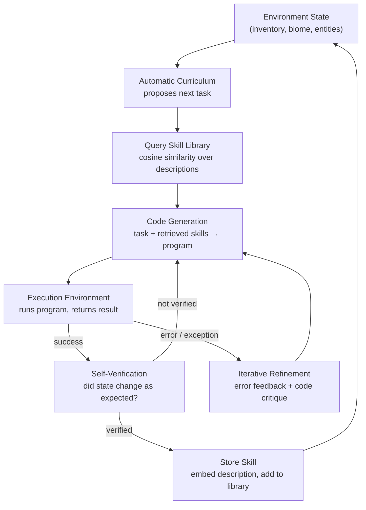

# Skill Libraries and Lifelong Learning (Voyager)

## Learning Objectives

- Implement a skill library with embedding-based storage and semantic retrieval using cosine similarity.
- Trace Voyager's three-component data flow — curriculum proposal, code generation, iterative refinement — from task input through skill commit.
- Build an execution loop that demonstrates failure-driven refinement and skill composition across multiple tasks.
- Compare exact-match retrieval against embedding-based retrieval to explain why semantic search generalizes across situations.
- Map the skill-library pattern onto enrichment playbook reuse in GTM workflows, identifying where compounding occurs.

## The Problem

Your agent successfully enriched a company profile yesterday — resolved the domain, pulled technographics, scored fit. Today you give it a nearly identical task for a different company. It starts from scratch: re-deriving the same sequence, re-paying the same API costs, re-discovering that you should check the domain before hitting the technographic endpoint. Every run is episodic. Nothing compounds.

This is the problem Voyager (Wang et al., 2024) was built to solve. An agent that treats each session as independent wastes tokens re-eliciting reasoning it already produced, loses corrections learned in prior runs, and cannot build the capability hierarchies that long-horizon tasks require. If your agent learned to "find wood, then craft planks, then build a table" in session A, it should start session B already knowing how to build a table — and use that skill as a primitive for something harder.

Voyager's answer: treat each reusable capability as a named chunk of executable code stored in a library, retrievable by semantic similarity to the current task, composable with other skills, and refined by execution feedback. Skills accumulate. The library grows. Later tasks retrieve and compose prior solutions instead of solving from scratch.

## The Concept

Voyager operates three cooperating components. The **automatic curriculum** reads the agent's current state (inventory, biome, nearby entities) and proposes a next task at appropriate difficulty — not too easy, not impossible given current capabilities. The **skill library** stores verified programs indexed by embedding vectors over their task descriptions. The **iterative prompting mechanism** generates code, executes it, and on failure feeds the error message back into code generation for retry. On success, the program is committed as a new skill.

The data flow is a loop, not a pipeline. Each successful execution adds a skill to the library, which changes what the curriculum can propose next, which changes what skills get retrieved for future tasks:



The key design choice is that **the action space is code, not primitive commands**. An agent that emits "move forward, turn left, move forward" must re-plan every step. An agent that emits `def find_wood(): explore_for('tree', radius=20)` creates a reusable abstraction — the function name becomes a retrieval handle, the description becomes an embedding target, and the body becomes a verified, composable unit. Code is naturally compositional: `craft_wooden_sword()` can call `craft_planks()` which calls `find_wood()`, and each layer was verified independently before being stored.

Retrieval is semantic, not exact-match. When a new task arrives ("build a wooden pickaxe"), the system embeds the task description and computes cosine similarity against every skill description in the library. "Craft a wooden sword weapon for combat" has high cosine similarity to "craft a wooden pickaxe tool for mining" because the shared tokens (wooden, craft, tool/weapon) dominate the embedding. This means the library generalizes — a skill learned in one context transfers to structurally similar situations without re-derivation.

## Build It

Build a minimal skill library system in Python using only stdlib. The system implements embedding-based storage, semantic retrieval, a simulated execution environment, and an iterative refinement loop.

```python
import math
import re
import hashlib
from dataclasses import dataclass, field

DIM = 128

def tokenize(text):
    return re.findall(r'[a-z]+', text.lower())

def stable_hash(token):
    h = hashlib.md5(token.encode('utf-8'))
    return int.from_bytes(h.digest()[:8], 'big')

def embed(text):
    vec = [0.0] * DIM
    for token in tokenize(text):
        idx = stable_hash(token) % DIM
        vec[idx] += 1.0
    norm = math.sqrt(sum(v * v for v in vec))
    if norm == 0:
        return vec
    return [v / norm for v in vec]

def cosine_similarity(a, b):
    return sum(x * y for x, y in zip(a, b))

@dataclass
class Skill:
    name: str
    description: str
    code: str
    embedding: list = field(default_factory=list)

    def __post_init__(self):
        if not self.embedding:
            self.embedding = embed(self.description)

class SkillLibrary:
    def __init__(self):
        self.skills = {}

    def add(self, name, description, code):
        skill = Skill(name, description, code)
        self.skills[name] = skill
        print(f"  [STORED] {name}")
        print(f"    desc: {description}")
        return skill

    def retrieve(self, query, k=3):
        if not self.skills:
            return []
        query_vec = embed(query)
        scored = [
            (name, cosine_similarity(query_vec, skill.embedding), skill)
            for name, skill in self.skills.items()
        ]
        scored.sort(key=lambda x: x[1], reverse=True)
        return scored[:k]

    def size(self):
        return len(self.skills)

class ExecutionEnvironment:
    def __init__(self):
        self.state = {"wood": 0, "planks": 0, "sticks": 0, "tools": []}
        self.log = []

    def execute(self, skill):
        name = skill.name
        if name == "find_wood":
            self.state["wood"] += 4
            return True, f"collected 4 wood"
        elif name == "craft_planks":
            if self.state["wood"] >= 1:
                self.state["wood"] -= 1
                self.state["planks"] += 4
                return True, f"crafted 4 planks from 1 wood"
            return False, f"need wood, have {self.state['wood']}"
        elif name == "craft_sticks":
            if self.state["planks"] >= 2:
                self.state["planks"] -= 2
                self.state["sticks"] += 4
                return True, f"crafted 4 sticks from 2 planks"
            return False, f"need 2 planks, have {self.state['planks']}"
        elif name == "craft_wooden_sword":
            if self.state["planks"] >= 2 and self.state["sticks"] >= 1:
                self.state["planks"] -= 2
                self.state["sticks"] -= 1
                self.state["tools"].append("wooden_sword")
                return True, f"crafted wooden sword"
            return False, f"need 2 planks + 1 stick, have planks={self.state['planks']} sticks={self.state['sticks']}"
        elif name == "craft_wooden_pickaxe":
            if self.state["planks"] >= 3 and self.state["sticks"] >= 2:
                self.state["planks"] -= 3
                self.state["sticks"] -= 2
                self.state["tools"].append("wooden_pickaxe")
                return True, f"crafted wooden pickaxe"
            return False, f"need 3 planks + 2 sticks, have planks={self.state['planks']} sticks={self.state['sticks']}"
        return False, f"unknown skill: {name}"

    def reset(self):
        self.state = {"wood": 0, "planks": 0, "sticks": 0, "tools": []}

library = SkillLibrary()
env = ExecutionEnvironment()

print("=== PHASE 1: Build foundational skills ===\n")

for name, desc, code in [
    ("find_wood",
     "explore the world to find and collect wood blocks from trees",
     "def find_wood():\n    target = scan_for('tree', radius=20)\n    navigate_to(target)\n    return break_and_collect('wood')"),
    ("craft_planks",
     "convert wood into wooden planks using the crafting inventory menu",
     "def craft_planks():\n    open_inventory()\n    place('wood', slot=0)\n    extract('planks', count=4)"),
    ("craft_sticks",
     "convert wooden planks into sticks using the crafting menu",
     "def craft_sticks():\n    open_inventory()\n    place('planks', slot=0, count=2)\n    extract('sticks', count=4)"),
]:
    library.add(name, desc, code)
    success, msg = env.execute(library.skills[name])
    print(f"    exec: {'PASS' if success else 'FAIL'} — {msg}")
    print()

print(f"Library size: {library.size()} skills\n")

print("=== PHASE 2: New task — craft a wooden sword ===\n")

task = "craft a wooden sword weapon for combat defense"
print(f"Task: {task}\n")
print("Retrieving relevant skills:")
results = library.retrieve(task, k=3)
for name, score, skill in results:
    print(f"  {name} (cosine: {score:.3f})")
    print(f"    \"{skill.description}\"")
print()

sword_code = """def craft_wooden_sword():
    craft_planks()
    craft_sticks()
    open_inventory()
    place('planks', slot=0, count=2)
    place('stick', slot=3, count=1)
    extract('wooden_sword')"""

library.add("craft_wooden_sword", "craft a wooden sword weapon using planks and sticks", sword_code)

print("\n  First execution attempt:")
env.reset()
success, msg = env.execute(library.skills["craft_wooden_sword"])
print(f"    exec: {'PASS' if success else 'FAIL'} — {msg}")

if not success:
    print("\n  [ITERATIVE REFINEMENT] Execution failed — composing prerequisite skills...\n")
    env.reset()
    for step in ["find_wood", "craft_planks", "craft_sticks"]:
        s = library.skills[step]
        success, msg = env.execute(s)
        print(f"    {step}: {'PASS' if success else 'FAIL'} — {msg}")

    print("\n  Retry target skill:")
    success, msg = env.execute(library.skills["craft_wooden_sword"])
    print(f"    exec: {'PASS' if success else 'FAIL'} — {msg}")

print(f"\n  Final state: {env.state}")
print(f"  Library size: {library.size()} skills\n")

print("=== PHASE 3: New task — craft a wooden pickaxe (compounding) ===\n")

task2 = "craft a wooden pickaxe tool for mining stone blocks"
print(f"Task: {task2}")
print(f"\nThe library now has 5 skills. Retrieval surfaces the sword skill")
print(f"because 'wooden' and 'craft' dominate the embedding:\n")

results = library.retrieve(task2, k=5)
for name, score, skill in results:
    marker = " ← weapon skill transfers" if name == "craft_wooden_sword" else ""
    print(f"  {name} (cosine: {score:.3f}){marker}")
print()

pickaxe_code = """def craft_wooden_pickaxe():
    craft_planks()
    craft_sticks()
    open_inventory()
    place('planks', slot=0, count=3)
    place('stick', slot=3, count=2)
    extract('wooden_pickaxe')"""

library.add("craft_wooden_pickaxe", "craft a wooden pickaxe tool using planks and sticks", pickaxe_code)

print("  First execution attempt:")
env.reset()
success, msg = env.execute(library.skills["craft_wooden_pickaxe"])
print(f"    exec: {'PASS' if success else 'FAIL'} — {msg}")

if not success:
    print("\n  [ITERATIVE REFINEMENT] Need more planks than the sword required — adapting...\n")
    env.reset()
    for step in ["find_wood", "find_wood", "craft_planks", "craft_planks", "craft_sticks"]:
        s = library.skills[step]
        success, msg = env.execute(s)
        print(f"    {step}: {'PASS' if success else 'FAIL'} — {msg}")

    print("\n  Retry target skill:")
    success, msg = env.execute(library.skills["craft_wooden_pickaxe"])
    print(f"    exec: {'PASS' if success else 'FAIL'} — {msg}")

print(f"\n  Final state: {env.state}")
print(f"  Library size: {library.size()} skills")
print(f"\n  Compounding check: the pickaxe reused find_wood, craft_planks,")
print(f"  and craft_sticks — zero new primitives invented. Only the")
print(f"  composition changed.")
```

Run this end-to-end. Three things to observe in the output:

1. **Phase 2 retrieval** ranks `craft_planks` and `craft_sticks` highest for the sword task — their descriptions share tokens with "craft" and "planks/sticks." The sword skill was unknown but its prerequisites were retrievable.

2. **Phase 3 retrieval** surfaces `craft_wooden_sword` as a strong match for the pickaxe task — not because swords relate to pickaxes, but because both descriptions share "wooden," "craft," "planks," and "sticks." Semantic retrieval generalizes across tool types.

3. **The refinement loop differs between phases.** The sword needed one `find_wood`; the pickaxe needed two because it consumes more planks. The agent didn't re-plan from scratch — it adjusted the prerequisite chain and reused every existing skill.

## Use It

The AI mechanism is embedding-based semantic retrieval: each enrichment playbook is stored as a skill with a description embedding, and new company descriptions trigger cosine-similarity matching to surface the closest prior playbook. This is the pattern for reusable enrichment workflows — the GTM equivalent of Voyager's skill library. [CITATION NEEDED — concept: enrichment playbook reuse as skill-library pattern in GTM]

The mapping is direct. In Voyager, "find wood" is a verified code block stored with a description embedding. In GTM enrichment, "resolve domain, pull firmographics, score ICP fit" is a verified workflow stored with a description embedding. When a new account arrives, the system retrieves the closest prior playbook and adapts it rather than building from zero.

```python
playbook_lib = SkillLibrary()

playbook_lib.add(
    "enrich_saas_company",
    "enrich software company profile resolve domain check firmographics pull technographic stack score ICP fit",
    "def enrich_saas_company():\n    resolve_domain()\n    pull_firmographics()\n    pull_technographics()\n    score_icp_fit()"
)

playbook_lib.add(
    "enrich_ecommerce_company",
    "enrich ecommerce retail company profile resolve domain check firmographics identify platform stack like shopify magento",
    "def enrich_ecommerce_company():\n    resolve_domain()\n    pull_firmographics()\n    pull_technographics()"
)

playbook_lib.add(
    "enrich_fintech_company",
    "enrich financial technology company profile resolve domain check compliance certifications pull funding data score fit",
    "def enrich_fintech_company():\n    resolve_domain()\n    pull_firmographics()\n    check_compliance()\n    pull_funding()\n    score_icp_fit()"
)

new_lead = "enrich cloud software startup profile resolve domain check firmographics technographic stack and ICP scoring"
print(f"New lead: {new_lead}\n")
print("Retrieved playbooks:")
for name, score, skill in playbook_lib.retrieve(new_lead, k=2):
    print(f"  {name} (cosine: {score:.3f})")
    print(f"    → reuse: {skill.code.split(chr(10))[0]}")
```

The SaaS playbook surfaces first because "software," "technographic," "domain," and "ICP" overlap heavily. The fintech playbook scores lower because "compliance" and "funding" dilute the signal. This is the same cosine-similarity mechanism from Build It — the only change is that descriptions describe enrichment workflows instead of crafting recipes.

Where compounding occurs: every enriched account that triggers a new playbook variant (say, a two-word domain instead of a one-word domain, requiring a different resolution step) adds a skill to the library. The next similar account retrieves that variant and skips the discovery cost. Over hundreds of accounts, the library converges on the playbooks that actually work for each company shape.

## Exercises

**Exercise 1 — Threshold-Gated Retrieval (Medium).** Modify `SkillLibrary.retrieve()` to accept a `min_score` parameter (default 0.0). When every retrieved skill scores below `min_score`, return an empty list and print `"NO MATCH — treating as novel task"`. Then test: create a fresh library with one skill ("enrich saas company"), query it with "book a restaurant reservation," and confirm the system reports no match instead of returning a low-similarity false positive. Explain why a threshold matters for GTM enrichment specifically — what goes wrong if you act on a 0.08 cosine match?

**Exercise 2 — Skill Composition Graph (Hard).** Extend the system so each `Skill` stores a `prerequisites` list (names of other skills it calls). Build a method `library.composition_chain(skill_name)` that returns the full dependency tree — `craft_wooden_sword` returns `[find_wood, craft_planks, craft_sticks]` at the leaves. Then add a `library.execution_plan(task)` method that: (1) retrieves the top skill for the task, (2) walks its dependency tree, (3) returns an ordered execution list. Test with the pickaxe task and verify the output matches the refinement loop from Phase 3. The goal: make the implicit refinement logic explicit and queryable.

## Key Terms

- **Skill library** — a persistent store of verified programs indexed by embedding vectors over their natural-language descriptions, supporting semantic retrieval and composition.
- **Iterative prompting mechanism** — Voyager's generate-execute-refine loop: the LLM writes code, the environment executes it, and on failure the error message is fed back as context for the next generation attempt.
- **Automatic curriculum** — a component that reads agent state and proposes the next task at appropriate difficulty given current capabilities, creating a learning progression.
- **Semantic retrieval** — finding stored items by cosine similarity between embedding vectors rather than exact keyword match, enabling transfer across structurally similar situations.
- **Self-verification** — the step where the agent checks whether execution produced the expected state change before committing the skill to the library.
- **Lifelong learning** — the property that an agent accumulates capabilities across sessions rather than resetting, so later tasks build on earlier solutions.
- **Cosine similarity** — the dot product of two normalized vectors, measuring directional alignment; the standard metric for comparing embedding vectors in retrieval.

## Sources

- Wang, G., Xie, Y., Jiang, Y., Mandlekar, A., Xiao, C., Zhu, Y., & Anandkumar, A. (2024). *Voyager: An Open-Ended Embodied Agent with Large Language Models.* arXiv:2305.16291. — primary source for the three-component architecture, skill library design, and iterative prompting mechanism.
- [CITATION NEEDED — concept: enrichment playbook reuse as skill-library pattern in GTM]