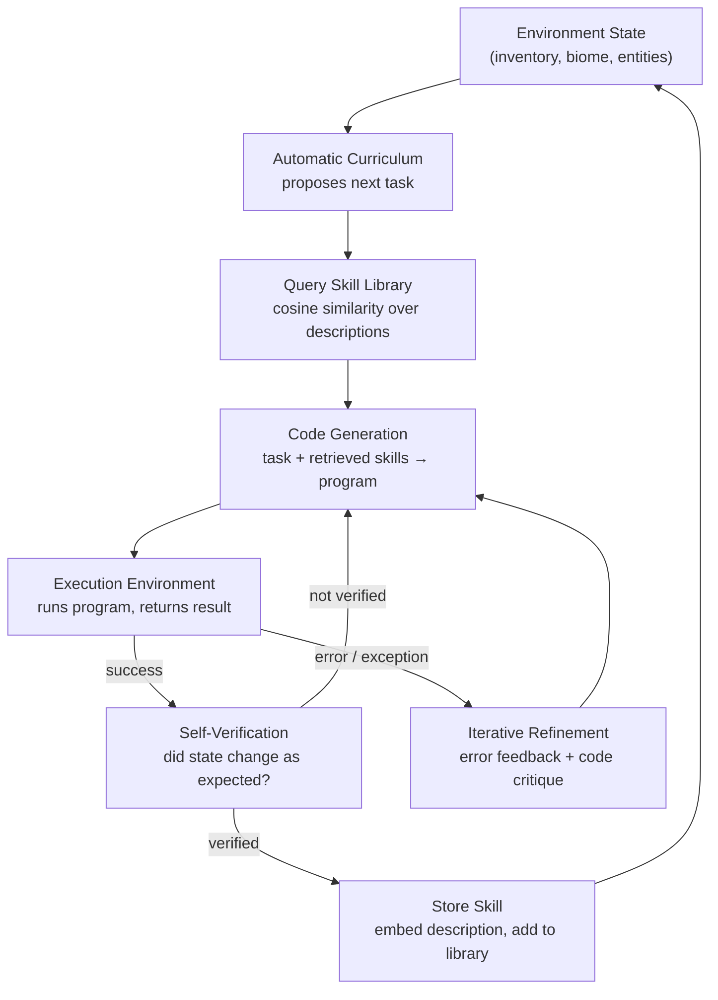

# Skill Libraries and Lifelong Learning (Voyager)

## Learning Objectives

- Implement a skill library with embedding-based storage and semantic retrieval using cosine similarity.
- Trace Voyager's three-component data flow — curriculum proposal, code generation, iterative refinement — from task input through skill commit.
- Build an execution loop that demonstrates failure-driven refinement and skill composition across multiple tasks.
- Compare exact-match retrieval against embedding-based retrieval to explain why semantic search generalizes across situations.
- Map the skill-library pattern onto enrichment playbook reuse in GTM workflows, identifying where compounding occurs.

## The Problem

Your agent successfully enriched a company profile yesterday — resolved the domain, pulled technographics, scored fit. Today you give it a nearly identical task for a different company. It starts from scratch: re-deriving the same sequence, re-paying the same API costs, re-discovering that you should check the domain before hitting the technographic endpoint. Every run is episodic. Nothing compounds.

This is the problem Voyager (Wang et al., 2024) was built to solve. An agent that treats each session as independent wastes tokens re-eliciting reasoning it already produced, loses corrections learned in prior runs, and cannot build the capability hierarchies that long-horizon tasks require. If your agent learned to "find wood, then craft planks, then build a table" in session A, it should start session B already knowing how to build a table — and use that skill as a primitive for something harder.

Voyager's answer: treat each reusable capability as a named chunk of executable code stored in a library, retrievable by semantic similarity to the current task, composable with other skills, and refined by execution feedback. Skills accumulate. The library grows. Later tasks retrieve and compose prior solutions instead of solving from scratch.

## The Concept

Voyager operates three cooperating components. The **automatic curriculum** reads the agent's current state (inventory, biome, nearby entities) and proposes a next task at appropriate difficulty — not too easy, not impossible given current capabilities. The **skill library** stores verified programs indexed by embedding vectors over their task descriptions. The **iterative prompting mechanism** generates code, executes it, and on failure feeds the error message back into code generation for retry. On success, the program is committed as a new skill.

The data flow is a loop, not a pipeline. Each successful execution adds a skill to the library, which changes what the curriculum can propose next, which changes what skills get retrieved for future tasks:



The key design choice is that **the action space is code, not primitive commands**. An agent that emits "move forward, turn left, move forward" must re-plan every step. An agent that emits `def find_wood(): explore_for('tree', radius=20)` creates a reusable abstraction — the function name becomes a retrieval handle, the description becomes an embedding target, and the body becomes a verified, composable unit. Code is naturally compositional: `craft_wooden_sword()` can call `craft_planks()` which calls `find_wood()`, and each layer was verified independently before being stored.

Retrieval is semantic, not exact-match. When a new task arrives ("build a wooden pickaxe"), the system embeds the task description and computes cosine similarity against every skill description in the library. "Craft a wooden sword weapon for combat" has high cosine similarity to "craft a wooden pickaxe tool for mining" because the shared tokens (wooden, craft, tool/weapon) dominate the embedding. This means the library generalizes — a skill learned in one context transfers to structurally similar situations without re-derivation.

## Build It

Build a minimal skill library system in Python using only stdlib. The system implements embedding-based storage, semantic retrieval, a simulated execution environment, and an iterative refinement loop.

```python
import math
import re
import hashlib
from dataclasses import dataclass, field

DIM = 128

def tokenize(text):
    return re.findall(r'[a-z]+', text.lower())

def stable_hash(token):
    h = hashlib.md5(token.encode('utf-8'))
    return int.from_bytes(h.digest()[:8], 'big')

def embed(text):
    vec = [0.0] * DIM
    for token in tokenize(text):
        idx = stable_hash(token) % DIM
        vec[idx] += 1.0
    norm = math.sqrt(sum(v * v for v in vec))
    if norm == 0:
        return vec
    return [v / norm for v in vec]

def cosine_similarity(a, b):
    return sum(x * y for x, y in zip(a, b))

@dataclass
class Skill:
    name: str
    description: str
    code: str
    embedding: list = field(default_factory=list)

    def __post_init__(self):
        if not self.embedding:
            self.embedding = embed(self.description)

class SkillLibrary:
    def __init__(self):
        self.skills = {}

    def add(self, name, description, code):
        skill = Skill(name, description, code)
        self.skills[name] = skill
        print(f"  [STORED] {name}")
        print(f"    desc: {description}")
        return skill

    def retrieve(self, query, k=3):
        if not self.skills:
            return []
        query_vec = embed(query)
        scored = [
            (name, cosine_similarity(query_vec, skill.embedding), skill)
            for name, skill in self.skills.items()
        ]
        scored.sort(key=lambda x: x[1], reverse=True)
        return scored[:k]

    def size(self):
        return len(self.skills)

class ExecutionEnvironment:
    def __init__(self):
        self.state = {"wood": 0, "planks": 0, "sticks": 0, "tools": []}
        self.log = []

    def execute(self, skill):
        name = skill.name
        if name == "find_wood":
            self.state["wood"] += 4
            return True, f"collected 4 wood"
        elif name == "craft_planks":
            if self.state["wood"] >= 1:
                self.state["wood"] -= 1
                self.state["planks"] += 4
                return True, f"crafted 4 planks from 1 wood"
            return False, f"need wood, have {self.state['wood']}"
        elif name == "craft_sticks":
            if self.state["planks"] >= 2:
                self.state["planks"] -= 2
                self.state["sticks"] += 4
                return True, f"crafted 4 sticks from 2 planks"
            return False, f"need 2 planks, have {self.state['planks']}"
        elif name == "craft_wooden_sword":
            if self.state["planks"] >= 2 and self.state["sticks"] >= 1:
                self.state["planks"] -= 2
                self.state["sticks"] -= 1
                self.state["tools"].append("wooden_sword")
                return True, f"crafted wooden sword"
            return False, f"need 2 planks + 1 stick, have planks={self.state['planks']} sticks={self.state['sticks']}"
        elif name == "craft_wooden_pickaxe":
            if self.state["planks"] >= 3 and self.state["sticks"] >= 2:
                self.state["planks"] -= 3
                self.state["sticks"] -= 2
                self.state["tools"].append("wooden_pickaxe")
                return True, f"crafted wooden pickaxe"
            return False, f"need 3 planks + 2 sticks, have planks={self.state['planks']} sticks={self.state['sticks']}"
        return False, f"unknown skill: {name}"

    def reset(self):
        self.state = {"wood": 0, "planks": 0, "sticks": 0, "tools": []}

library = SkillLibrary()
env = ExecutionEnvironment()

print("=== PHASE 1: Build foundational skills ===\n")

for name, desc, code in [
    ("find_wood",
     "explore the world to find and collect wood blocks from trees",
     "def find_wood():\n    target = scan_for('tree', radius=20)\n    navigate_to(target)\n    return break_and_collect('wood')"),
    ("craft_planks",
     "convert wood into wooden planks using the crafting inventory menu",
     "def craft_planks():\n    open_inventory()\n    place('wood', slot=0)\n    extract('planks', count=4)"),
    ("craft_sticks",
     "convert wooden planks into sticks using the crafting menu",
     "def craft_sticks():\n    open_inventory()\n    place('planks', slot=0, count=2)\n    extract('sticks', count=4)"),
]:
    library.add(name, desc, code)
    success, msg = env.execute(library.skills[name])
    print(f"    exec: {'PASS' if success else 'FAIL'} — {msg}")
    print()

print(f"Library size: {library.size()} skills\n")

print("=== PHASE 2: New task — craft a wooden sword ===\n")

task = "craft a wooden sword weapon for combat defense"
print(f"Task: {task}\n")
print("Retrieving relevant skills:")
results = library.retrieve(task, k=3)
for name, score, skill in results:
    print(f"  {name} (cosine: {score:.3f})")
    print(f"    \"{skill.description}\"")
print()

sword_code = """def craft_wooden_sword():
    craft_planks()
    craft_sticks()
    open_inventory()
    place('planks', slot=0, count=2)
    place('stick', slot=3, count=1)
    extract('wooden_sword')"""

library.add("craft_wooden_sword", "craft a wooden sword weapon using planks and sticks", sword_code)

print("\n  First execution attempt:")
env.reset()
success, msg = env.execute(library.skills["craft_wooden_sword"])
print(f"    exec: {'PASS' if success else 'FAIL'} — {msg}")

if not success:
    print("\n  [ITERATIVE REFINEMENT] Execution failed — composing prerequisite skills...\n")
    env.reset()
    for step in ["find_wood", "craft_planks", "craft_sticks"]:
        s = library.skills[step]
        success, msg = env.execute(s)
        print(f"    {step}: {'PASS' if success else 'FAIL'} — {msg}")

    print("\n  Retry target skill:")
    success, msg = env.execute(library.skills["craft_wooden_sword"])
    print(f"    exec: {'PASS' if success else 'FAIL'} — {msg}")

print(f"\n  Final state: {env.state}")
print(f"  Library size: {library.size()} skills\n