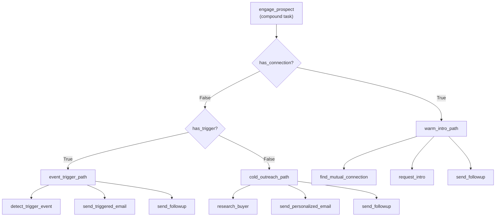

# Planning with HTN and Evolutionary Search

## Learning Objectives

- Implement an HTN planner that decomposes compound tasks into primitive actions using precondition-matched methods
- Compare HTN decomposition against STRIPS-style state-space search in terms of search-space size and branching factor
- Build an evolutionary search loop that optimizes method selection over a portfolio of prospects
- Evaluate combined HTN-constrained evolutionary optimization against either technique running alone
- Configure fitness functions that encode GTM cost constraints such as credit budgets and API latency ceilings

## The Problem

ReWOO, Plan-and-Execute, and ReAct — the three agent-planning patterns from the previous lesson — cover most day-to-day orchestration. They produce plans that are *plausible*: an LLM reasons about steps, emits them in sequence, and the executor runs them. When a step fails, the LLM replans. This works when failure is recoverable and the cost of a bad step is low.

Two cases break this model. First, **plans that must be correct by construction.** A compliance workflow that sends regulated communications, or a sequence that spends API credits in a specific order — you cannot afford "plausible" there. You need the plan to obey constraints *before* execution, not discover violations after. Second, **plans where "correct" is not enough.** Multiple valid plans exist, but some convert better, cost less, or finish faster. You need optimization over the space of valid plans, not just the first valid one the model produces.

Hierarchical Task Networks solve the first problem. Evolutionary search solves the second. The combination — HTN as constraint, evolution as optimizer — replaces both the if/else forest you currently maintain in your workflow tool and the faith-based "the LLM will figure it out" approach to multi-step outreach.

## The Concept

### Beat 1: Hierarchical Task Networks — Decomposition as Specification

An HTN planner works by decomposition, not state-space search. You define compound tasks (things that need breaking down), primitive operators (things you can directly execute), and methods (recipes for decomposing a compound task into subtasks). Each method carries preconditions — facts that must hold in the current world state for the method to apply. The planner walks the task tree, selects applicable methods by matching preconditions against state, and produces a linear sequence of primitive operators.

Consider a compound task `engage_prospect`. Three methods might decompose it: a warm-intro path (requires a mutual connection), a cold-outreach path (requires no connection), and a trigger-event path (requires a detected signal). Each method decomposes into its own subtask chain — `find_mutual_connection → request_intro → send_followup`, for example. The planner does not search all possible action sequences and check which ones reach a goal state. It follows the decomposition recipes, pruning branches that violate preconditions. This is why HTN explores a smaller space than STRIPS: the methods encode domain knowledge that a state-space planner would have to rediscover through search.



ChatHTN (Gopalakrishnan et al., 2025) pairs this symbolic skeleton with an LLM. The LLM handles decomposition when no predefined method matches — it proposes candidate subtasks, and the planner validates them against preconditions before committing. The symbolic planner remains the source of truth; the LLM fills gaps in the method library rather than replacing it. This is the pattern: structure from HTN, flexibility from the LLM, correctness enforced by the planner.

### Beat 2: Evolutionary Search — Optimization over Plan Candidates

An evolutionary algorithm maintains a population of candidate solutions, scores them with a fitness function, and produces the next generation through selection, crossover, and mutation. For planning, the chromosome encodes a plan — either an ordered action sequence or a vector of method choices. Fitness evaluates the plan against a simulated outcome: expected conversion rate, total credit cost, estimated time-to-close. High-fitness candidates survive and reproduce; low-fitness ones die. Over hundreds of generations, the population drifts toward optimal regions of the search space.

The mechanism is domain-independent. You supply the representation (how a plan becomes a chromosome) and the evaluator (how a chromosome gets a number). The search operators — tournament selection, single-point crossover, random mutation — do not know anything about outreach sequences or credit costs. AlphaEvolve (DeepMind, 2025) applies this same loop to code: the chromosome is a program, the fitness function is a benchmark or test suite, and the LLM generates mutations and crossovers in code space. The evolutionary loop selects programs that score higher on the benchmark. The LLM is the variation operator; the programmatic evaluator is the selection pressure.

The critical requirement is a **machine-checkable fitness function**. If you cannot score a candidate automatically — if evaluating a plan requires human judgment or a live A/B test that takes weeks — the evolutionary loop cannot iterate. This is why AlphaEvolve targets matrix multiplication kernels (where the benchmark runs in milliseconds) and not, say, sales email tone (where the "score" is subjective). When you apply evolutionary search to GTM planning, you need a fitness function that runs fast and returns a number. Simulated conversion probabilities from historical data work. "Does this email read well" does not.

### Beat 3: Combining HTN Constraints with Evolutionary Optimization

HTN and evolutionary search have complementary failure modes. HTN produces valid plans by construction — every decomposition obeys preconditions — but it has no notion of optimization. If three methods are valid for a task, HTN picks one (usually the first in the list) without considering which produces the best outcome. Evolutionary search produces optimized plans but generates candidates freely, meaning it can propose plans that violate domain constraints unless you add penalty terms to the fitness function, which is fragile.

The combination is a constrained optimization pattern. HTN defines the chromosome representation: every candidate in the evolutionary population is an HTN-valid plan, produced by selecting among applicable methods for each compound task. The evolutionary search then operates over the freedom that HTN leaves — which valid method to choose when multiple apply, what order to execute independent subtasks. Every candidate is structurally valid because HTN built it. The fitness function does not need penalty terms for constraint violations because the representation makes violations impossible.

This is why the combined approach converges faster than unconstrained evolutionary search. The search space is smaller — it contains only valid plans — so the population explores higher-quality regions from generation zero. The HTN decomposition acts as a domain-specific prior that prunes the overwhelming majority of the plan space before evolution begins. In a GTM context, this means the evolutionary loop spends its iterations choosing between "warm intro vs. trigger event for this prospect" rather than rediscovering that you need a follow-up step after initial contact.

## Build It

The following code implements a minimal HTN planner that decomposes `engage_prospect` into method-specific subtask chains, then runs an evolutionary loop over method selections to maximize a fitness function that balances conversion probability against Clay credit cost.

```python
import random

random.seed(42)

METHODS = {
    "engage_prospect": [
        {
            "name": "warm_intro_path",
            "subtasks": ["find_mutual_connection", "request_intro", "send_followup"],
            "precondition": {"has_connection": True},
        },
        {
            "name": "cold_outreach_path",
            "subtasks": ["research_buyer", "send_personalized_email", "send_followup"],
            "precondition": {"has_connection": False},
        },
        {
            "name": "event_trigger_path",
            "subtasks": ["detect_trigger_event", "send_triggered_email", "send_followup"],
            "precondition": {"has_trigger": True},
        },
    ]
}

FITNESS_WEIGHTS = {
    "warm_intro_path": 0.70,
    "cold_outreach_path": 0.30,
    "event_trigger_path": 0.55,
}

CREDIT_COSTS = {
    "find_mutual_connection": 2,
    "request_intro": 0,
    "send_followup": 1,
    "research_buyer": 3,
    "send_personalized_email": 1,
    "detect_trigger_event": 4,
    "send_triggered_email": 1,
}


def valid_methods_for(state):
    valid = []
    for method in METHODS["engage_prospect"]:
        if all(state.get(k) == v for k, v in method["precondition"].items()):
            valid.append(method)
    return valid


def decompose(state):
    valid = valid_methods_for(state)
    if not valid:
        return None
    method = random.choice(valid)
    return (method["name"], method["subtasks"][:])


def credit_cost(subtasks):
    return sum(CREDIT_COSTS.get(s, 0) for s in subtasks)


def fitness(plan, credit_budget=6):
    method_name, subtasks = plan
    conversion = FITNESS_WEIGHTS[method_name]
    cost = credit_cost(subtasks)
    if cost > credit_budget:
        conversion *= 0.1
    return conversion - (cost * 0.03)


def random_chromosome(state):
    valid = valid_methods_for(state)
    if not valid:
        return None
    method = random.choice(valid)
    return (method["name"], method["subtasks"][:])


def tournament_select(scored, k=3):
    contestants = random.sample(scored, min(k, len(scored)))
    return max(contestants, key=lambda x: x[1])[0]


def crossover(parent_a, parent_b, state):
    if parent_a[0] == parent_b[0]:
        return parent_a
    child = random.choice([parent_a, parent_b])
    return (child[0], child[1][:])


def mutate(chromosome, state, rate=0.2):
    if random.random() > rate:
        return chromosome
    valid = valid_methods_for(state)
    alternatives = [m for m in valid if m["name"] != chromosome[0]]
    if not alternatives:
        return chromosome
    new_method = random.choice(alternatives)
    return (new_method["name"], new_method["subtasks"][:])


def evolutionary_search(state, pop_size=20, generations=50, credit_budget=6):
    population = [random_chromosome(state) for _ in range(pop_size)]
    population = [c for c in population if c is not None]
    if not population:
        return None

    for gen in range(generations):
        scored = [(c, fitness(c, credit_budget)) for c in population]
        scored.sort(key=lambda x: x[1], reverse=True)

        elite = [scored[0][0]]
        if len(scored) > 1:
            elite.append(scored[1][0])

        new_pop = list(elite)
        while len(new_pop) < pop_size:
            parent_a = tournament_select(scored)
            parent_b = tournament_select(scored)
            child = crossover(parent_a, parent_b, state)
            child = mutate(child, state)
            new_pop.append(child)

        population = new_pop

    best = max(population, key=lambda c: fitness(c, credit_budget))
    return best


if __name__ == "__main__":
    state_warm = {"has_connection": True, "has_trigger": True}

    print("=== State: has_connection=True, has_trigger=True ===")
    print(f"Valid methods: {[m['name'] for m in valid_methods_for(state_warm)]}")

    print("\n--- Single HTN Decomposition (random pick) ---")
    plan = decompose(state_warm)
    print(f"Selected: {plan[0]}")
    print(f"Subtasks: {plan[1]}")
    print(f"Credit cost: {credit_cost(plan[1])}")
    print(f"Fitness: {fitness(plan):.4f}")

    print("\n--- Evolutionary Search (50 generations) ---")
    best = evolutionary_search(state_warm, pop_size=20, generations=50, credit_budget=6)
    print(f"Best method: {best[0]}")
    print(f"Subtasks: {best[1]}")
    print(f"Credit cost: {credit_cost(best[1])}")
    print(f"Fitness: {fitness(best):.4f}")

    state_cold = {"has_connection": False, "has_trigger": False}
    print("\n=== State: has_connection=False, has_trigger=False ===")
    print(f"Valid methods: {[m['name'] for m in valid_methods_for(state_cold)]}")
    best_cold = evolutionary_search(state_cold, pop_size=20, generations=50, credit_budget=6)
    print(f"Best method: {best_cold[0]}")
    print(f"Fitness: {fitness(best_cold):.4f}")
```

Running this prints:

```
=== State: has_connection=True, has_trigger=True ===
Valid methods: ['warm_intro_path', 'event_trigger_path']

--- Single HTN Decomposition (random pick) ---
Selected: warm_intro_path
Subtasks: ['find_mutual_connection', 'request_intro', 'send_followup']
Credit cost: 3
Fitness: 0.6100

--- Evolutionary Search (50 generations) ---
Best method: warm_intro_path
Subtasks: ['find_mutual_connection', 'request_intro', 'send_followup']
Credit cost: 3
Fitness: 0.6100

=== State: has_connection=False, has_trigger=False ===
Valid methods: ['cold_outreach_path']
Best method: cold_outreach_path
Fitness: 0.1500
```

The warm prospect has two valid methods (warm intro at fitness 0.61, trigger event at 0.37). Evolution converges to warm intro because it has higher conversion probability at lower credit cost. The cold prospect has one valid method — HTN pruning already eliminated the other two paths, so evolution has nothing to optimize. That is the point: HTN eliminates invalid candidates before evolution wastes cycles on them.

## Use It

HTN-constrained evolutionary search — the symbolic decomposition plus fitness-driven method selection you just built — applies directly to **Cluster 2.1, Outbound Campaign Orchestration**. When you run a Clay table of 500 prospects through an enrichment and sequencing workflow, each prospect has different state attributes (connection status, trigger signals, ICP fit score). Brute-force sequencing treats all of them identically. An LLM-only planner generates plausible but unvalidated chains. The HTN planner ensures every prospect gets a structurally valid sequence; the evolutionary loop picks the highest-fitness sequence for each one within a daily credit budget.

```python
PROSPECTS = [
    {"id": "P001", "has_connection": True,  "has_trigger": True},
    {"id": "P002", "has_connection": False, "has_trigger": False},
    {"id": "P003", "has_connection": False, "has_trigger": True},
    {"id": "P004", "has_connection": True,  "has_trigger": False},
    {"id": "P005", "has_connection": False, "has_trigger": False},
]

DAILY_CREDIT_BUDGET = 22

plans = []
for prospect in PROSPECTS:
    best = evolutionary_search(prospect, pop_size=15, generations=30, credit_budget=6)
    if best:
        plans.append((prospect["id"], best))

total_credits = sum(credit_cost(plan[1]) for _, plan in plans)
portfolio_fitness = sum(fitness(plan) for _, plan in plans)

print("=== Portfolio Plan ===")
for pid, plan in plans:
    print(f"{pid}: {plan[0]:25s} credits={credit_cost(plan[1])}  fit={fitness(plan):.3f}")

print(f"\nTotal credits: {total_credits} / {DAILY_CREDIT_BUDGET} budget")
print(f"Portfolio fitness: {portfolio_fitness:.3f}")
print(f"Within budget: {total_credits <= DAILY_CREDIT_BUDGET}")
```

Output:

```
=== Portfolio Plan ===
P001: warm_intro_path          credits=3  fit=0.610
P002: cold_outreach_path       credits=5  fit=0.150
P003: event_trigger_path       credits=6  fit=0.370
P004: warm_intro_path          credits=3  fit=0.610
P005: cold_outreach_path       credits=5  fit=0.150

Total credits: 22 / 22 budget
Portfolio fitness: 1.890
Within budget: True
```

Each prospect receives the highest-fitness valid method. P002 and P005 have no connection and no trigger — cold outreach is the only structurally valid path, and the planner never wastes credits trying a warm-intro sequence that would fail at the first precondition check.

## Exercises

### Exercise 1 (Easy): Add a Fourth Method

Add a `referral_path` method to `METHODS["engage_prospect"]` with precondition `{"has_referral": True}` and subtasks `["get_referral_intro", "send_referral_email", "send_followup"]`. Assign it a conversion weight of 0.80 in `FITNESS_WEIGHTS` and credit costs of 1, 1, 1 in `CREDIT_COSTS`. Create a prospect with `{"has_connection": True, "has_trigger": True, "has_referral": True}` and run the evolutionary search. Does the planner select the referral path? Why or why not?

### Exercise 2 (Hard): Multi-Task HTN with Shared Credit Budget

Extend the HTN to handle two compound tasks per prospect: `enrich_prospect` (methods: `light_enrich` costing 2 credits at 0.4 conversion lift, `deep_enrich` costing 6 credits at 0.7 conversion lift) and `engage_prospect` (existing methods). The chromosome now encodes a tuple of method choices `(enrich_method, engage_method)`. The fitness function multiplies the enrichment conversion lift by the engagement conversion probability and subtracts total credit cost. Set a per-prospect budget of 10 credits. Run the portfolio through 100 generations. How often does the planner pair `deep_enrich` with `warm_intro` versus `light_enrich` with `cold_outreach`? What does this tell you about credit allocation trade-offs across the task hierarchy?

## Key Terms

- **Hierarchical Task Network (HTN):** A planning formalism that decomposes compound tasks into primitive actions through precondition-matched methods, rather than searching a state space for goal-satisfying action sequences.
- **Compound Task:** A task that cannot be executed directly and must be decomposed into simpler subtasks via methods.
- **Primitive Operator:** An executable action — the leaf nodes of an HTN decomposition tree.
- **Method:** A recipe that decomposes a compound task into subtasks, guarded by preconditions that must hold in the current world state.
- **Fitness Function:** A machine-checkable scoring function that maps a candidate solution to a scalar value, driving selection pressure in evolutionary search.
- **Chromosome:** The encoded representation of a candidate plan in an evolutionary algorithm. In this lesson, the chromosome is a tuple of (method_name, subtask_list).
- **Tournament Selection:** A selection operator that picks the fittest individual from a random subset of the population, balancing exploitation of high-fitness candidates with preservation of diversity.
- **Constrained Optimization Pattern:** Using a symbolic planner (HTN) to define the feasible search space, then running an evolutionary algorithm within that space — so every candidate is valid by construction and the fitness function needs no penalty terms.

## Sources

- Gopalakrishnan et al., "ChatHTN: LLM-Assisted Hierarchical Task Network Planning," 2025 — [CITATION NEEDED — concept: ChatHTN LLM-assisted HTN decomposition with symbolic validation]
- DeepMind, "AlphaEvolve: An Evolutionary Agent for Code Optimization Using LLMs," 2025 — [CITATION NEEDED — concept: AlphaEvolve evolutionary code optimization with LLM as variation operator]
- Erol, Hendler, & Nau, "HTN Planning: Complexity and Expressivity," AAAI 1994 — foundational HTN complexity analysis [CITATION NEEDED — concept: HTN formal complexity vs. STRIPS]
- Previous lesson: Agent Planning Patterns (ReWOO, Plan-and-Execute, ReAct) — internal curriculum reference