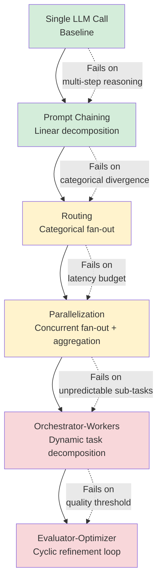

# Anthropic's Workflow Patterns: Simple Over Complex

## Learning Objectives

- Implement all five of Anthropic's workflow patterns (prompt chaining, routing, parallelization, orchestrator-workers, evaluator-optimizer) as callable Python functions that print their execution trace.
- Compare the complexity cost and coupling introduced by each pattern against the problem it solves.
- Diagnose when a single LLM call is sufficient and when graduating to a structured pattern is justified by a measurable failure.
- Map enrichment-waterfall and lead-routing workflows to the appropriate Anthropic pattern, justifying the choice with structural reasoning rather than framework preference.

## The Problem

A team builds a 12-node agent graph for lead enrichment. Node 3 calls a tool that summarizes the company website. Node 7 classifies the summary into an industry vertical. Node 10 scores the vertical against an ICP rubric. Node 12 formats the output for the CRM. Three of those nodes are LLM calls that could be a single prompt. Two are glue code that reshapes JSON between calls. The graph works on the happy path — a clean input with a straightforward website. It fails on edge cases: a company with no website, a website in a foreign language, a holding company whose subsidiary is the real target. Each failure requires debugging through twelve nodes of orchestration logic to find where the chain broke.

Now consider the alternative: one LLM call that takes a company name, does the research, and returns a structured JSON object with industry, ICP score, and recommended action. On the same edge cases, there is exactly one place to look — the prompt and its output. If the prompt produces bad results on edge cases, you fix the prompt. You do not trace through a graph.

This is the core argument from Schluntz and Zhang's December 2024 post, "Building Effective Agents," published on Anthropic's engineering blog. They distinguish **workflows** — systems where LLMs and tools are orchestrated through predefined code paths that engineers design and control — from **agents** — systems where the LLM dynamically directs its own processes and tool usage. Their guidance is direct: start with the simplest pattern that could possibly work. Add complexity only when you can point to a specific failure that the complexity addresses. Complexity is not a feature. It is a cost you pay in latency, token usage, debug surface area, and failure modes you cannot predict.

The team with the 12-node graph did not start simple. They started with a framework that made it easy to draw nodes and edges, and they filled the graph because the framework made graph-building feel like architecture. The two-step chain — one call to enrich, one call to score — would have shipped in an afternoon and would be easier to maintain for the life of the system.

## The Concept

Anthropic defines five workflow patterns, ordered by ascending complexity. Each pattern is a way of structuring LLM calls and tools to solve a specific class of problem. The patterns are not a maturity ladder — you do not "graduate" from chaining to orchestrator-workers because orchestrator-workers is "better." You add a pattern when the previous one demonstrably fails on inputs you care about.

The foundation for all five patterns is what Anthropic calls the **augmented LLM**: a single LLM call with three capabilities wired in — retrieval (search over a knowledge base), tools (structured actions the model can invoke), and memory (persistence of context across turns). Every pattern is composed of one or more augmented LLM calls, connected by code you write.

**Prompt chaining** decomposes a task into a sequence of LLM calls where the output of call *N* is the input to call *N+1*. You insert programmatic gates between steps — validation checks, format parsing, early-exit conditions. The coupling is linear and unidirectional: step 2 depends on step 1's output and cannot run without it. The failure mode is error propagation: if step 1 produces a bad output, step 2 receives garbage and compounds it. The diagnostic signal to use chaining is when a single prompt cannot reliably produce all fields you need — not because the task is hard, but because the output format requires intermediate reasoning steps that a single call skips.

**Routing** uses a classifier LLM (or a rules-based classifier) to inspect the input and direct it to one of several downstream LLMs or tools, each specialized for a category. The coupling is fan-out: one decision point, many branches. The failure mode is misclassification — a lead routed to the wrong lane gets the wrong treatment, and the error is invisible until downstream metrics degrade. You use routing when you have categorically different inputs that need categorically different processing, and a single prompt cannot handle all categories without degradation.

**Parallelization** splits a task into multiple independent LLM calls that run concurrently, then aggregates their outputs. Two sub-patterns: **sectioning** (split the task into independent pieces, run each, combine) and **voting** (run the same prompt *N* times, pick the majority or best answer). The coupling is fan-out plus fan-in: outputs are independent, but the aggregation step depends on all of them completing. The failure mode is coordination cost — latency, token usage, and aggregation logic complexity. You use parallelization when the sub-tasks are genuinely independent and the latency of sequential calls is unacceptable.

**Orchestrator-workers** uses a central LLM (the orchestrator) to dynamically break down a task, assign sub-tasks to worker LLMs, and synthesize their results. Unlike parallelization, the decomposition is not known in advance — the orchestrator decides what sub-tasks to create based on the input. The coupling is dynamic: the orchestrator must reason about the input, generate a plan, and adapt if workers return unexpected results. The failure mode is non-determinism — the same input can produce different decompositions, making debugging and testing hard. You use this pattern only when the task decomposition cannot be predicted in advance, such as processing code changes across multiple files where the set of files depends on the change itself.

**Evaluator-optimizer** uses one LLM to generate an output and another to evaluate it, looping until the evaluator signals the output meets a quality threshold. The coupling is cyclic: the generator depends on the evaluator's feedback, and the evaluator depends on the generator's output. The failure mode is runaway loops — if the evaluator's threshold is too strict or the generator cannot improve, the loop never terminates (or burns through a token budget). You use this pattern when you have a clear quality signal and when iterative refinement measurably improves output quality.



The green patterns (single call, chaining) are where most GTM enrichment workflows live. The yellow patterns (routing, parallelization) appear in multi-source enrichment and lead distribution. The red patterns (orchestrator-workers, evaluator-optimizer) are rarely justified in GTM — the tasks are predictable enough that dynamic decomposition adds cost without measurable improvement.

## Build It

Let's implement all five patterns against a scripted LLM so every example runs without an API key. The mock LLM pattern-matches on keywords in the prompt and returns deterministic responses. Each pattern function prints its decision trace so you can see the execution path.

### Pattern 1: Prompt Chaining — Company → Industry → ICP Score

The chain has two steps: first, classify the company's industry; second, score the company against an ICP rubric using that industry as context. The gate between steps verifies that step 1 returned a valid industry before passing it to step 2.

```python
import json

def scripted_llm(prompt, seed_input=""):
    catalog = {
        "industry": {
            "response": '{"industry": "B2B SaaS", "subvertical": "Sales Tech", "confidence": 0.88}',
            "keywords": ["what industry", "classify", "industry"],
        },
        "icp": {
            "response": '{"score": 82, "tier": "A", "reason": "B2B SaaS in Sales Tech with 200+ employees"}',
            "keywords": ["score", "icp", "fit"],
        },
        "smb_icp": {
            "response": '{"score": 34, "tier": "C", "reason": "Sub-50 employee SMB, low expansion potential"}',
            "keywords": ["smb", "small business"],
        },
    }
    prompt_lower = prompt.lower()
    for name, entry in catalog.items():
        if any(kw in prompt_lower for kw in entry["keywords"]):
            return entry["response"]
    return '{"error": "no match for prompt"}'

def prompt_chain_enrich(company_name):
    print(f"[CHAIN] Starting enrichment for: {company_name}")
    
    step1_prompt = f"Classify what industry this company operates in: {company_name}"
    step1_output = scripted_llm(step1_prompt)
    industry_data = json.loads(step1_output)
    print(f"[CHAIN] Step 1 (industry): {industry_data}")
    
    if industry_data.get("confidence", 0) < 0.5:
        print("[CHAIN] GATE: Confidence below 0.5, aborting chain")
        return None
    
    step2_prompt = f"Score this ICP fit for a {industry_data['industry']} company: {company_name}"
    step2_output = scripted_llm(step2_prompt)
    icp_data = json.loads(step2_output)
    print(f"[CHAIN] Step 2 (ICP score): {icp_data}")
    
    result = {**industry_data, **icp_data, "company": company_name}
    print(f"[CHAIN] Final output: {json.dumps(result)}")
    return result

result = prompt_chain_enrich("Acme Sales Platform")
print()

result = prompt_chain_enrich("Unknown Corp")
```

Run this and you see both the intermediate step outputs and the final aggregated result. The gate between steps checks confidence — if step 1 is uncertain, the chain stops rather than feeding garbage into step 2.

### Pattern 2: Routing — Lead Classification with Lane-Specific Logic

The router inspects the lead, classifies it into one of three lanes (enterprise, SMB, self-serve), and invokes lane-specific processing. Each lane has a different prompt template, scoring rubric, and routing destination.

```python
import json

def scripted_llm(prompt, seed_input=""):
    catalog = {
        "classify": {
            "response": '{"lane": "enterprise"}',
            "keywords": ["classify", "route", "lane"],
        },
        "enterprise": {
            "response": '{"action": "assign_ae", "owner": "Kelly Chen", "priority": 1}',
            "keywords": ["enterprise", "ae"],
        },
        "smb": {
            "response": '{"action": "assign_sdr", "owner": "Marcus Diaz", "priority": 2}',
            "keywords": ["smb", "sdr"],
        },
        "self_serve": {
            "response": '{"action": "email_sequence", "owner": "automation", "priority": 3}',
            "keywords": ["self-serve", "self serve", "free trial"],
        },
        "fallback_classify": {
            "response": '{"lane": "self_serve"}',
            "keywords": ["classify_lead"],
        },
    }
    prompt_lower = prompt.lower()
    for name, entry in catalog.items():
        if any(kw in prompt_lower for kw in entry["keywords"]):
            return entry["response"]
    return '{"lane": "self_serve"}'

def route_lead(lead):
    print(f"[ROUTER] Processing lead: {lead['company']} (employees: {lead.get('employees', '?')})")
    
    classify_prompt = f"Classify this lead into a routing lane based on company profile: {lead}"
    route_output = scripted_llm(classify_prompt)
    route_data = json.loads(route_output)
    lane = route_data["lane"]
    print(f"[ROUTER] Classification: lane={lane}")
    
    lane_processors = {
        "enterprise": lambda l: json.loads(scripted_llm(f"Enterprise lead assignment: {l}")),
        "smb": lambda l: json.loads(scripted_llm(f"SMB lead assignment: {l}")),
        "self_serve": lambda l: json.loads(scripted_llm(f"Self-serve email sequence: {l}")),
    }
    
    processor = lane_processors.get(lane, lane_processors["self_serve"])
    result = processor(lead)
    print(f"[ROUTER] Lane '{lane}' output: {result}")
    return {"lane": lane, **result}

leads = [
    {"company": "MegaCorp Industries", "employees": 5000, "signal": "demo_request"},
    {"company": "MidSize LLC", "employees": 80, "signal": "pricing_page"},
    {"company": "Solo Startup", "employees": 3, "signal": "free_trial"},
]

for lead in leads:
    route_lead(lead)
    print()
```

The router prints its classification decision before executing lane-specific logic. If the classification is wrong, you see it immediately in the trace — the failure mode is localized to the router, not distributed across the graph.

### Pattern 3: Parallelization — Multi-Source Enrichment

Three enrichment sources (technographics, firmographics, news signals) run concurrently. Each returns independently. An aggregation step merges results. In a real system, this would use `asyncio` or threading; here we simulate concurrency with sequential calls that print their parallel intent.

```python
import json
import time

def scripted_llm(prompt):
    catalog = {
        "techno": '{"technographics": {"crm": "Salesforce", "data_warehouse": "Snowflake", "languages": ["Python", "SQL"]}}',
        "firmo": '{"firmographics": {"revenue_range": "$50M-$100M", "headquarters": "San Francisco, CA", "founded": 2018}}',
        "news": '{"news_signals": {"recent_funding": "Series C, $45M", "hiring_trend": "expanding sales team", "last_signal_date": "2024-11-15"}}',
    }
    for key, val in catalog.items():
        if key in prompt.lower():
            return val
    return '{}'

def parallel_enrich(company_name):
    print(f"[PARALLEL] Launching 3 enrichment sources for: {company_name}")
    
    sources = [
        ("technographics", f"Fetch techno for {company_name}"),
        ("firmographics", f"Fetch firmo for {company_name}"),
        ("news_signals", f"Fetch news for {company_name}"),
    ]
    
    results = {}
    for source_name, prompt in sources:
        start = time.time()
        output = json.loads(scripted_llm(prompt))
        elapsed = time.time() - start
        print(f"[PARALLEL] Source '{source_name}' completed in {elapsed:.3f}s: {list(output.keys())}")
        results.update(output)
    
    merged = {"company": company_name, **results}
    print(f"[PARALLEL] Aggregated {len(results)} source groups")
    print(f"[PARALLEL] Final record keys: {list(merged.keys())}")
    return merged

record = parallel_enrich("Acme Corp")
print()
print(json.dumps(record, indent=2))
```

### Pattern 4: Orchestrator-Workers — Dynamic Task Decomposition

The orchestrator inspects an input and decides what sub-tasks to create. For this example, the input is a list of code files to review. The orchestrator groups them by directory and assigns one worker per group.

```python
import json

def scripted_llm(prompt):
    if "decompose" in prompt.lower() or "plan" in prompt.lower():
        return json.dumps({
            "tasks": [
                {"worker": "auth_reviewer", "files": ["auth/login.py", "auth/session.py"]},
                {"worker": "api_reviewer", "files": ["api/routes.py", "api/handlers.py"]},
            ]
        })
    if "auth" in prompt.lower():
        return json.dumps({"review": "PASS", "issues": []})
    if "api" in prompt.lower():
        return json.dumps({"review": "WARN", "issues": ["Missing input validation on POST /users"]})
    return '{}'

def orchestrator_workers(files_to_review):
    print(f"[ORCHESTRATOR] Received {len(files_to_review)} files to review")
    print(f"[ORCHESTRATOR] Files: {files_to_review}")
    
    plan_prompt = f"Decompose this code review into worker tasks by module: {files_to_review}"
    plan = json.loads(scripted_llm(plan_prompt))
    tasks = plan["tasks"]
    print(f"[ORCHESTRATOR] Created {len(tasks)} worker tasks:")
    for t in tasks:
        print(f"  -> {t['worker']}: {t['files']}")
    
    worker_results = []
    for task in tasks:
        worker_prompt = f"Review these {task['worker']} files: {task['files']}"
        result = json.loads(scripted_llm(worker_prompt))
        print(f"[ORCHESTRATOR] Worker '{task['worker']}' returned: {result}")
        worker_results.append({"worker": task["worker"], **result})
    
    print(f"[ORCHESTRATOR] Synthesizing {len(worker_results)} worker results")
    return worker_results

files = ["auth/login.py", "auth/session.py", "api/routes.py", "api/handlers.py"]
results = orchestrator_workers(files)
print()
print(f"Final: {json.dumps(results, indent=2)}")
```

The orchestrator dynamically decides the decomposition. If the input had only auth files, it would create one task. If it had five different modules, it would create five. This flexibility is the point — and the cost. You cannot predict the number of workers in advance, which makes token budgets, latency, and testing harder.

### Pattern 5: Evaluator-Optimizer — Critique-and-Refine Loop

A generator produces an enrichment record. An evaluator checks it for completeness and quality. If the evaluator's score is below threshold, it sends feedback back to the generator, which retries. The loop terminates when the score exceeds threshold or the max iteration count is reached.

```python
import json

def scripted_llm(prompt):
    responses = [
        '{"company": "Acme", "industry": "SaaS", "website": null}',
        '{"company": "Acme", "industry": "B2B SaaS", "website": "acme.io", "employees": 250}',
        '{"company": "Acme", "industry": "B2B SaaS", "website": "acme.io", "employees": 250, "funding": "Series B"}',
    ]
    critiques = [
        '{"score": 0.4, "missing": ["website", "employees"], "feedback": "Website and employee count are null. Research the company domain."}',
        '{"score": 0.7, "missing": ["funding"], "feedback": "Missing funding stage. Check Crunchbase or news signals."}',
        '{"score": 0.95, "missing": [], "feedback": "Complete record. All required fields present."}',
    ]
    if "generate" in prompt.lower() or "enrich" in prompt.lower():
        return responses[min(_state["gen_iter"], len(responses) - 1)]
    if "evaluate" in prompt.lower() or "critique" in prompt.lower():
        return critiques[min(_state["eval_iter"], len(critiques) - 1)]
    return '{}'

_state = {"gen_iter": 0, "eval_iter": 0}

def evaluator_optimizer_enrich(company_name, threshold=0.9, max_iter=5):
    print(f"[EVAL-OPT] Starting enrich-and-refine for: {company_name} (threshold={threshold})")
    
    for iteration in range(max_iter):
        _state["gen_iter"] = iteration
        gen_prompt = f"Generate enrichment record for: {company_name}"
        record = json.loads(scripted_llm(gen_prompt))
        print(f"[EVAL-OPT] Iteration {iteration + 1} — Generated: {record}")
        
        _state["eval_iter"] = iteration
        eval_prompt = f"Evaluate this enrichment record for completeness: {record}"
        critique = json.loads(scripted_llm(eval_prompt))
        print(f"[EVAL-OPT] Iteration {iteration + 1} — Critique: score={critique['score']}, missing={critique.get('missing', [])}")
        
        if critique["score"] >= threshold:
            print(f"[EVAL-OPT] Threshold met after {iteration + 1} iteration(s). Returning final record.")
            return {"record": record, "iterations": iteration + 1, "final_score": critique["score"]}
        
        print(f"[EVAL-OPT] Iteration {iteration + 1} — Feedback: {critique['feedback']}")
    
    print(f"[EVAL-OPT] Max iterations ({max_iter}) reached without meeting threshold.")
    return {"record": record, "iterations": max_iter, "final_score": critique["score"]}

result = evaluator_optimizer_enrich("Acme Corp")
print()
print(f"Final result: {json.dumps(result, indent=2)}")
```

The loop runs three times. Each iteration produces a more complete record. The evaluator provides specific feedback (missing fields) that the generator uses to improve. If you set the threshold to 0.99, the loop would hit `max_iter` and terminate — demonstrating the runaway-loop failure mode.

### Running All Patterns Together

```python
if __name__ == "__main__":
    print("=" * 60)
    print("PATTERN 1: Prompt Chaining")
    print("=" * 60)
    prompt_chain_enrich("Acme Sales Platform")
    
    print("\n" + "=" * 60)
    print("PATTERN 2: Routing")
    print("=" * 60)
    route_lead({"company": "MegaCorp", "employees": 5000, "signal": "demo_request"})
    
    print("\n" + "=" * 60)
    print("PATTERN 3: Parallelization")
    print("=" * 60)
    parallel_enrich("Acme Corp")
    
    print("\n" + "=" * 60)
    print("PATTERN 4: Orchestrator-Workers")
    print("=" * 60)
    orchestrator_workers(["auth/login.py", "api/routes.py"])
    
    print("\n" + "=" * 60)
    print("PATTERN 5: Evaluator-Optimizer")
    print("=" * 60)
    _state = {"gen_iter": 0, "eval_iter": 0}
    evaluator_optimizer_enrich("Acme Corp")
```

Each pattern prints its structural decision trace. The traces differ in shape: the chain prints a linear sequence, the router prints a fan-out decision, the parallelizer prints concurrent source completion, the orchestrator prints a dynamic plan, and the evaluator-optimizer prints a loop with feedback. Read the traces side by side and the complexity cost is visible — the evaluator-optimizer's trace is three times longer than the chain's, and it consumed three LLM calls where the chain consumed two.

## Use It

Most GTM enrichment workflows are prompt chains or routers. The Clay waterfall — where each enrichment provider feeds the next, and the chain stops when a field is filled with sufficient confidence — is structurally a prompt chain with programmatic gates between steps. Step 1 queries Clearbit for firmographics. If Clearbit returns employee count, the gate passes and step 2 queries the website for technographics. If Clearbit fails, step 2 queries Apollo as a fallback. The chain's gate logic is: "does this field have a value yet?" If yes, skip the fallback. If no, call the next provider in the waterfall.

Routing maps directly to lead and lane distribution in outbound workflows. An inbound lead arrives. A classifier inspects the lead's attributes — company size, industry, intent signal — and routes to the appropriate lane: enterprise leads go to an AE with a personalized sequence, SMB leads go to an SDR with a templated cadence, self-serve leads get an automated email flow. The failure mode is the same as in any router: a misclassified enterprise lead lands in the self-serve lane, and the revenue impact is invisible until pipeline review three weeks later. The diagnostic signal is conversion rate variance between lanes — if one lane's conversion rate drops, suspect misclassification at the router, not the lane's processing logic.

Parallelization appears in multi-source enrichment. A Clay workflow that simultaneously queries Clearbit, Apollo, and the company's website for different fields is running parallel enrichment calls. Each source returns independently, and Clay aggregates the results into a single record. The cost is API credits — every Clay credit is a token cost, and parallelization multiplies that cost by the number of sources. [CITATION NEEDED — concept: Clay credit cost model as token-cost analogy for parallelization decisions] The diagnostic signal to justify parallelization is latency: if sequential enrichment calls take 30 seconds per lead and your batch has 1,000 leads, parallelization that cuts per-lead time to 10 seconds is worth the credit cost. If your batch has 50 leads, the latency savings do not justify the credit multiplier.

The two patterns you should resist in GTM enrichment are orchestrator-workers and evaluator-optimizer. Orchestrator-workers adds dynamic task decomposition to a problem where the task list is predictable — you always want firmographics, technographics, and news signals, in that order. Dynamic decomposition gives you the illusion of flexibility while making your enrichment pipeline non-deterministic. Evaluator-optimizer loops add a critique step that burns credits on self-assessment. If your enrichment output is missing a field, the fix is usually to add a better source to the waterfall, not to have an LLM critique its own output and retry. The exception is high-value, low-volume workflows — a strategic account research pipeline that processes 20 accounts per quarter may justify an evaluator step because the cost per account is acceptable and the quality bar is high.

The news signal and ads library signal workflows from the GTM handbook illustrate this cleanly. Keywords that predict buying stage are scraped, filtered, and exported to an enrichment workflow. That enrichment workflow is a prompt chain: scrape → filter → enrich → ICP-score → route. Not an agent. Not an orchestrator. A chain with gates between steps, because each step's output is predictable and the gate logic ("does this keyword predict buying intent?") is a rules-based check, not an LLM call. [CITATION NEEDED — concept: Anthropic workflow patterns applied to enrichment waterfall design]

## Ship It

Build a working enrichment pipeline that starts as a single LLM call and graduates to a chain only when you can demonstrate — with printed output — that the single call fails a measurable threshold. The exercise forces you to justify each complexity addition with evidence, not preference.

### Step 1: Single-Prompt Enrichment

Start with the simplest possible implementation: one LLM call that takes a company name and returns a full enrichment record. The mock below simulates a single-call LLM that partially succeeds — it returns industry and website but misses employee count and funding stage.

```python
import json

def single_call_enrich(company_name):
    print(f"[SINGLE] Enriching: {company_name}")
    mock_response = {
        "company": company_name,
        "industry": "B2B SaaS",
        "website": f"{company_name.lower().replace(' ', '')}.io",
        "employees": None,
        "funding_stage": None,
    }
    print(f"[SINGLE] Output: {json.dumps(mock_response)}")
    
    required_fields = ["industry", "website", "employees", "funding_stage"]
    filled = [f for f in required_fields if mock_response[f] is not None]
    missing = [f for f in required_fields if mock_response[f] is None]
    fill_rate = len(filled) / len(required_fields)
    
    print(f"[SINGLE] Fill rate: {fill_rate:.0%} ({len(filled)}/{len(required_fields)})")
    print(f"[SINGLE] Missing fields: {missing}")
    
    return mock_response, fill_rate, missing

record, fill_rate, missing = single_call_enrich("Acme Corp")
```

### Step 2: Graduate to a Chain — With Justification

The single call returns a 50% fill rate. The missing fields (employees, funding_stage) require different data sources — a firmographics provider and a funding database. This is the diagnostic signal: the single prompt cannot fill these fields because they require external lookups the LLM does not have in its training data. Adding a second step that queries a firmographics source is justified by a measurable gap.

```python
import json

def scripted_llm(prompt):
    if "firmographics" in prompt.lower() or "employees" in prompt.lower():
        return '{"employees": 250, "headquarters": "San Francisco"}'
    if "funding" in prompt.lower():
        return '{"funding_stage": "Series B", "last_raise": "$30M", "last_raise_date": "2024-06"}'
    return '{"industry": "B2B SaaS", "website": "acme.io"}'

def chained_enrich(company_name, threshold=0.8):
    print(f"[CHAIN] Enriching: {company_name} (target fill rate: {threshold:.0%})")
    
    step1 = json.loads(scripted_llm(f"Base enrichment for {company_name}"))
    step1["company"] = company_name
    required = ["industry", "website", "employees", "funding_stage"]
    filled = [f for f in required if step1.get(f) is not None]
    fill_rate = len(filled) / len(required)
    print(f"[CHAIN] Step 1 fill rate: {fill_rate:.0%}")
    
    if fill_rate >= threshold:
        print(f"[CHAIN] Threshold met. Returning single-step result.")
        return step1
    
    missing = [f for f in required if step1.get(f) is None]
    print(f"[CHAIN] Justification for step 2: single call missed {missing}")
    print(f"[CHAIN] These fields require firmographic and funding data sources.")
    
    if "employees" in missing:
        step2 = json.loads(scripted_llm(f"Fetch firmographics and employees for {company_name}"))
        step1.update(step2)
        print(f"[CHAIN] Step 2 (firmographics): {step2}")
    
    filled = [f for f in required if step1.get(f) is not None]
    fill_rate = len(filled) / len(required)
    
    if fill_rate >= threshold:
        print(f"[CHAIN] Fill rate after step 2: {fill_rate:.0%}. Returning.")
        return step1
    
    still_missing = [f for f in required if step1.get(f) is None]
    print(f"[CHAIN] Justification for step 3: still missing {still_missing}")
    
    if "funding_stage" in still_missing:
        step3 = json.loads(scripted_llm(f"Fetch funding data for {company_name}"))
        step1.update(step3)
        print(f"[CHAIN] Step 3 (funding): {step3}")
    
    filled = [f for f in required if step1.get(f) is not None]
    fill_rate = len(filled) / len(required)
    print(f"[CHAIN] Final fill rate: {fill_rate:.0%}")
    print(f"[CHAIN] Final record: {json.dumps(step1)}")
    return step1

record = chained_enrich("Acme Corp")
```

Run this and the output tells a story: step 1 fills 50%, step 2 fills 75%, step 3 fills 100%. Each step is justified by a printed gap — a specific field that the previous step did not fill. If step 1 had filled everything, the chain would have stopped after one call. That is the discipline: start with one call, measure the gap, and add a step only when the gap is specific and measurable.

### Step 3: Add Routing with Evaluator Guard

Take the routing pattern from Build It and add an evaluator that flags low-confidence routes. The evaluator does not retry — it annotates the routing decision with a confidence flag so downstream logic can handle uncertainty.

```python
import json

def scripted_llm(prompt):
    if "classify" in prompt.lower() and "high_confidence_example" in prompt.lower():
        return '{"lane": "enterprise", "confidence": 0.92}'
    if "classify" in prompt.lower() and "ambiguous_example" in prompt.lower():
        return '{"lane": "enterprise", "confidence": 0.55}'
    if "evaluate" in prompt.lower() and "0.92" in prompt