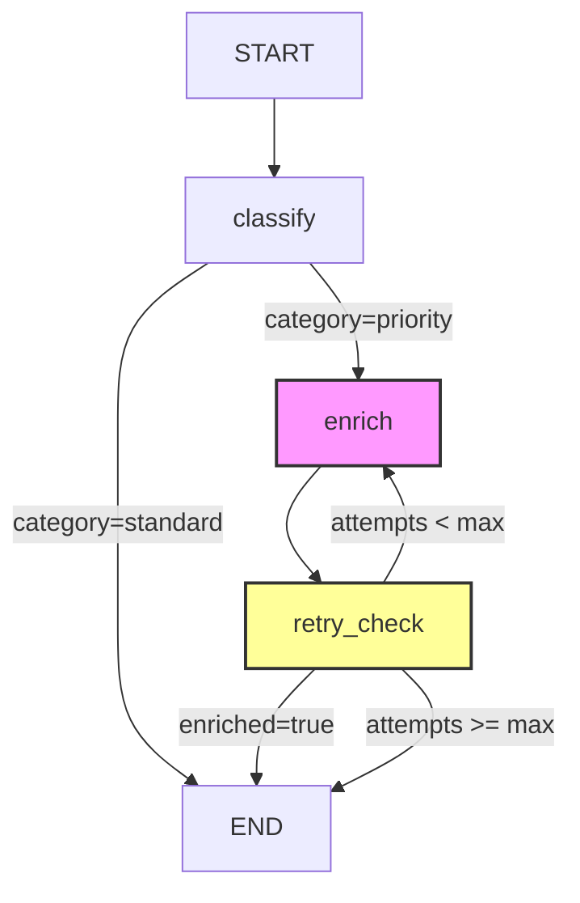

# LangGraph: Stateful Graphs and Durable Execution

## Learning Objectives

- Build a `StateGraph` with typed state, conditional edges, and cycles that executes and prints observable state transitions.
- Compare linear chain execution to checkpointed state machine execution by tracing state mutations across node transitions.
- Implement durable execution with a `MemorySaver` checkpointer that pauses mid-graph and resumes from the exact interruption point.
- Configure a retry loop using conditional edges and attempt counters that terminates on a threshold.
- Evaluate the cost implications of checkpointed state machines for multi-step enrichment waterfalls where each node invocation maps to a billed API call.

## The Problem

Standard LLM chains execute top-to-bottom and forget everything when they finish. That model breaks the moment your workflow needs to do anything non-linear: branch on a classification result, retry a failed API call, wait for a human to approve a draft, or loop through an enrichment waterfall that tries multiple data providers until one returns a usable result.

The deeper problem is failure recovery. When a 12-step enrichment pipeline crashes at step 9—maybe the third data provider timed out, maybe the process was killed—you want to resume from step 9, not re-run steps 1 through 8. Re-running means re-paying for API calls you already made. In a GTM context where each enrichment step costs Clay credits or third-party API spend, that re-run is actual money lost, not just wasted compute time.

LangGraph's answer is to model the workflow as a checkpointed finite-state machine. State is a first-class typed object. Every node transition is persisted to a checkpointer before the next node executes. Resume is loading the checkpoint and continuing. This is the same execution model that GTM orchestration platforms use internally: enrichment waterfalls with fallback logic, multi-channel outreach sequences with waiting periods, and lead routing that branches on scoring thresholds are all state machines with persisted transitions.

## The Concept

A LangGraph `StateGraph` has three primitives that work together.

**State schema.** A typed dictionary (typically `TypedDict` or a Pydantic model) that all nodes read from and write to. This is the shared memory of the graph. Each node receives the full state as input but returns only a partial update—a dictionary containing the keys it wants to modify. The runtime merges that partial update into the existing state. A node that classifies a lead returns `{"category": "enterprise"}`, not the entire state object.

**Graph topology.** Nodes are functions with the signature `(state) -> partial_update`. Edges are transitions between nodes. Conditional edges evaluate the current state and return the name of the next node to execute. Unlike a DAG (directed acyclic graph), LangGraph allows cycles: a node can route back to itself or to an earlier node. This is what makes retry loops, iterative refinement, and multi-attempt enrichment possible without external orchestration glue.

**Checkpointing and durability.** A `Checkpointer` (such as `MemorySaver` for in-memory testing, `SqliteSaver` for local persistence, or `PostgresSaver` for production) serializes the full state object after every node execution. This enables three things: resuming a graph after a crash or restart, replaying execution from any prior checkpoint (time travel), and human-in-the-loop patterns where execution pauses at a designated node and resumes when an external signal arrives.



One distinction worth stating plainly: LangGraph is not LangChain. LangChain implements chains—linear composition where the output of one step feeds into the next. LangGraph implements state machines—arbitrary topology with typed state, conditional routing, cycles, and persistence. The packages share a namespace and an author, but the architectural models are different. LangChain chains have no concept of checkpointing, conditional edges, or resume-after-failure.

The enrichment waterfall pattern common in GTM tools is a direct instance of this state machine. Provider A is tried first. If the result is insufficient (empty email, low-confidence firmographic data), a conditional edge routes to Provider B. If Provider B also fails, the graph either tries Provider C or routes to a terminal "manual review" node. Each provider call is a node. The sufficiency check is a conditional edge. The accumulated enrichment data lives in the state schema. And if the process crashes after Provider A succeeds but before Provider B runs, the checkpoint lets you resume without re-calling Provider A—saving the credit or API cost that call would have incurred.

## Build It

Install LangGraph first:

```bash
pip install langgraph
```

**Demo A: Stateful graph with branching and retry loop.** This graph classifies a company, enriches it, and retries enrichment up to 3 times if the first attempt fails. The retry loop is a cycle: `enrich` runs, `retry_check` evaluates the result, and if enrichment hasn't succeeded and attempts remain, execution routes back to `enrich`.

```python
from typing import TypedDict
from langgraph.graph import StateGraph, START, END


class State(TypedDict):
    company: str
    category: str
    enriched: bool
    attempt_count: int


def classify(state: State) -> dict:
    company = state["company"]
    if "ai" in company.lower() or "tech" in company.lower():
        category = "priority"
    else:
        category = "standard"
    print(f"  [classify] {company} -> category={category}")
    return {"category": category, "attempt_count": 0}


def route_by_category(state: State) -> str:
    if state["category"] == "priority":
        return "enrich"
    return END


def enrich(state: State) -> dict:
    attempt = state["attempt_count"]
    print(f"  [enrich] Attempt {attempt + 1} for {state['company']}")
    success = attempt >= 1
    print(f"  [enrich] Result: enriched={success}")
    return {"enriched": success}


def retry_check(state: State) -> dict:
    attempt = state["attempt_count"]
    print(f"  [retry_check] enriched={state['enriched']}, attempt_count={attempt}")
    return {"attempt_count": attempt + 1}


def route_after_retry(state: State) -> str:
    if state["enriched"]:
        return END
    if state["attempt_count"] >= 3:
        print("  [route] Max attempts reached, exiting")
        return END
    return "enrich"


builder = StateGraph(State)
builder.add_node("classify", classify)
builder.add_node("enrich", enrich)
builder.add_node("retry_check", retry_check)

builder.add_edge(START, "classify")
builder.add_conditional_edges("classify", route_by_category)
builder.add_edge("enrich", "retry_check")
builder.add_conditional_edges("retry_check", route_after_retry)

graph = builder.compile()

print("=== Demo A: Branching + Retry Loop ===\n")
print("--- Run 1: AI company (priority, retries once) ---")
result = graph.invoke({
    "company": "Acme AI",
    "category": "",
    "enriched": False,
    "attempt_count": 0,
})
print(f"\nFinal state: {result}\n")

print("--- Run 2: Non-tech company (standard, skips enrichment) ---")
result = graph.invoke({
    "company": "Bob's Bakery",
    "category": "",
    "enriched": False,
    "attempt_count": 0,
})
print(f"\nFinal state: {result}")
```

Expected output:

```
=== Demo A: Branching + Retry Loop ===

--- Run 1: AI company (priority, retries once) ---
  [classify] Acme AI -> category=priority
  [enrich] Attempt 1 for Acme AI
  [enrich] Result: enriched=False
  [retry_check] enriched=False, attempt_count=0
  [enrich] Attempt 2 for Acme AI
  [enrich] Result: enriched=True
  [retry_check] enriched=True, attempt_count=1

Final state: {'company': 'Acme AI', 'category': 'priority', 'enriched': True, 'attempt_count': 2}

--- Run 2: Non-tech company (standard, skips enrichment) ---
  [classify] Bob's Bakery -> category=standard

Final state: {'company': "Bob's Bakery", 'category': 'standard', 'enriched': False, 'attempt_count': 0}
```

Run 1 shows the cycle: `enrich` fails on attempt 1, `retry_check` increments the counter, the conditional edge routes back to `enrich`, and attempt 2 succeeds. Run 2 shows the branch: the conditional edge after `classify` routes directly to `END`, skipping enrichment entirely because the company isn't priority-tier.

**Demo B: Durable execution with checkpointing.** Same graph, but compiled with a `MemorySaver` checkpointer and an `interrupt_before` directive that pauses execution before `retry_check`. This simulates a human-in-the-loop pattern: the graph runs enrichment, pauses for review, then resumes when given the signal.

```python
from langgraph.checkpoint.memory import MemorySaver
from langgraph.graph import StateGraph, START, END


class State(TypedDict):
    company: str
    category: str
    enriched: bool
    attempt_count: int


def classify(state: State) -> dict:
    company = state["company"]
    category = "priority" if "ai" in company.lower() else "standard"
    print(f"  [classify] {company} -> category={category}")
    return {"category": category, "attempt_count": 0}


def enrich(state: State) -> dict:
    attempt = state["attempt_count"]
    print(f"  [enrich] Attempt {attempt + 1} for {state['company']}")
    success = attempt >= 1
    print(f"  [enrich] Result: enriched={success}")
    return {"enriched": success}


def retry_check(state: State) -> dict:
    attempt = state["attempt_count"]
    print(f"  [retry_check] enriched={state['enriched']}, attempt_count={attempt}")
    return {"attempt_count": attempt + 1}


def route_by_category(state: State) -> str:
    return "enrich" if state["category"] == "priority" else END


def route_after_retry(state: State) -> str:
    if state["enriched"]:
        return END
    if state["attempt_count"] >= 3:
        return END
    return "enrich"


builder = StateGraph(State)
builder.add_node("classify", classify)
builder.add_node("enrich", enrich)
builder.add_node("retry_check", retry_check)

builder.add_edge(START, "classify")
builder.add_conditional_edges("classify", route_by_category)
builder.add_edge("enrich", "retry_check")
builder.add_conditional_edges("retry_check", route_after_retry)

checkpointer = MemorySaver()
graph = builder.compile(
    checkpointer=checkpointer,
    interrupt_before=["retry_check"],
)

config = {"configurable": {"thread_id": "thread-demo-1"}}

print("=== Demo B: Durable Execution ===\n")
print("--- Phase 1: Run until interrupt ---\n")

for event in graph.stream(
    {
        "company": "Acme AI",
        "category": "",
        "enriched": False,
        "attempt_count": 0,
    },
    config=config,
    stream_mode="values",
):
    print(f"  State snapshot: company={event.get('company')}, "
          f"enriched={event.get('enriched')}, "
          f"attempt_count={event.get('attempt_count')}")

print("\n--- Phase 2: Graph paused. Inspecting checkpoint. ---\n")

state_snapshot = graph.get_state(config)
print(f"  Checkpoint values: {state_snapshot.values}")
print(f"  Next node to execute: {state_snapshot.next}")
print(f"  Interrupted: {len(state_snapshot.tasks) > 0 and state_snapshot.tasks[0].interrupts}")

print("\n--- Phase 3: Resume execution from checkpoint ---\n")

for event in graph.stream(None, config=config, stream_mode="values"):
    print(f"  State snapshot: company={event.get('company')}, "
          f"enriched={event.get('enriched')}, "
          f"attempt_count={event.get('attempt_count')}")

final_state = graph.get_state(config)
print(f"\nFinal checkpoint: {final_state.values}")
print(f"Next: {final_state.next}")
```

Expected output:

```
=== Demo B: Durable Execution ===

--- Phase 1: Run until interrupt ---

  State snapshot: company=Acme AI, enriched=False, attempt_count=0
  [classify] Acme AI -> category=priority
  State snapshot: company=Acme AI, enriched=False, attempt_count=0
  [enrich] Attempt 1 for Acme AI
  [enrich] Result: enriched=False
  State snapshot: company=Acme AI, enriched=False, attempt_count=0

--- Phase 2: Graph paused. Inspecting checkpoint. ---

  Checkpoint values: {'company': 'Acme AI', 'category': 'priority', 'enriched': False, 'attempt_count': 0}
  Next node to execute: ('retry_check',)
  Interrupted: True

--- Phase 3: Resume execution from checkpoint ---

  [retry_check] enriched=False, attempt_count=0
  State snapshot: company=Acme AI, enriched=False, attempt_count=1
  [enrich] Attempt 2 for Acme AI
  [enrich] Result: enriched=True
  State snapshot: company=Acme AI, enriched=True, attempt_count=1
  [retry_check] enriched=True, attempt_count=1
  State snapshot: company=Acme AI, enriched=True, attempt_count=2

Final checkpoint: {'company': 'Acme AI', 'category': 'priority', 'enriched': True, 'attempt_count': 2}
Next: ()
```

Phase 1 runs `classify` and `enrich`, then stops before `retry_check` because of `interrupt_before`. Phase 2 inspects the checkpoint: the state shows `enriched=False` and `attempt_count=0`—exactly where execution paused. Phase 3 passes `None` as input, which tells the graph to resume from the checkpoint rather than start fresh. The retry loop completes: attempt 2 succeeds, and the final state shows `enriched=True`.

The `thread_id` in the config is the session key. A checkpointer can store thousands of concurrent threads. Each thread is an independent execution with its own state history.

## Use It

The `StateGraph` with conditional edges is the execution pattern behind multi-step enrichment waterfalls. In a Clay table, a row triggers a waterfall that tries data provider A, checks if the returned email or phone is valid, and if not, falls through to provider B. Each provider call is a node in the graph. The validity check is a conditional edge. The accumulated enrichment data—email, phone, firmographics—lives in the state schema. The retry loop from Demo A maps directly to the waterfall's fallback logic.

The checkpointing mechanism has a direct cost implication. Every Clay credit spent on a data provider lookup is a real expense. [CITATION NEEDED — concept: Clay credit pricing per enrichment lookup] If an enrichment pipeline crashes after provider A returns a valid email but before the row is written to the destination, the checkpoint lets you resume from the write step without re-calling provider A. Without checkpointing, you re-run the entire pipeline from the top, re-paying for provider A's lookup. In a table with 10,000 rows and a 3-provider waterfall averaging 2 credits per lookup, a single crash-restart cycle without checkpointing wastes up to 20,000 credits on redundant calls.

The `interrupt_before` pattern from Demo B maps to human-in-the-loop approval gates in GTM workflows. Consider a sequence where an enrichment node fills in a contact's details, a drafting node generates a personalized email, and then execution pauses for a human to review and approve the draft before it's sent. The checkpoint holds the full state—the enriched data, the drafted email, the routing context—so the reviewer sees everything when they resume the thread. No re-enrichment, no re-drafting, no lost context.

For cost optimization specifically, the state schema itself becomes a budget-tracking instrument. Add fields like `credits_spent` and `credits_budget` to the state. Each enrichment node increments `credits_spent` by the provider's known cost. A conditional edge checks `credits_spent < credits_budget` before routing to the next provider in the waterfall. If the budget is exhausted, the graph routes to a terminal "partial enrichment" node instead of calling another paid API. This is the same pattern as token-budget management in LLM agent loops, applied to GTM data enrichment costs.

## Ship It

Moving from in-memory checkpoints (`MemorySaver`) to production persistence means swapping the checkpointer. `SqliteSaver` writes to a local SQLite file—sufficient for single-process workflows and local development. `PostgresSaver` writes to a Postgres database—the production choice for concurrent threads, multi-process execution, and durability across machine restarts. The swap is one line of code: pass a different checkpointer to `compile()`. The graph topology, node logic, and state schema stay identical.

In a production GTM context, the `thread_id` becomes a natural join key against your CRM or Clay table. Each row in a Clay table can map to one LangGraph thread. The thread ID might be `clay_row_{row_id}` or `lead_{salesforce_id}`. When a webhook fires indicating a lead's status changed, you load the thread's checkpoint, inspect the current state, and either resume the graph or trigger a new one. The checkpoint is the persistence layer that connects the enrichment pipeline to the rest of your GTM stack.

The cost-optimization angle from Zone 14 applies directly to production deployment. A checkpointed state machine that retries failed enrichment calls is trading compute cost (running the graph runtime, storing checkpoints) for API cost (avoiding redundant provider calls). The break-even depends on your provider pricing and your crash rate. For a workflow with 5 enrichment steps averaging 2 credits each and a 5% crash rate per step, checkpointing saves approximately 0.5 credits per row on average across a large table. At 50,000 rows, that's 25,000 credits saved—or whatever the per-credit dollar equivalent is in your Clay plan. [CITATION NEEDED — concept: Clay credit-to-dollar conversion rates across plan tiers]

One production caveat: `MemorySaver` loses all state when the process dies. It exists for development and testing only. If you ship a LangGraph workflow to production with `MemorySaver`, a server restart wipes every in-flight thread. Use `SqliteSaver` for single-instance deployments and `PostgresSaver` for anything that needs to survive restarts or run across multiple workers.

## Exercises

1. **Add a budget guard node.** Extend the Demo A graph with a `budget_check` node between `classify` and `enrich`. Add `credits_spent: int` and `credits_budget: int` to the state schema. The `enrich` node increments `credits_spent` by 3 each call. The conditional edge after `budget_check` routes to `enrich` if `credits_spent < credits_budget`, otherwise to `END`. Initialize `credits_budget` to 5 and verify that enrichment runs at most once before the budget is exhausted.

2. **Add a second enrichment provider.** Create two enrichment nodes: `enrich_provider_a` and `enrich_provider_b`. Provider A always fails (returns `enriched: False`). Provider B always succeeds. The conditional edge after Provider A routes to Provider B if enrichment failed. Run the graph and confirm the final state shows data from Provider B, not Provider A.

3. **Checkpoint to SQLite.** Replace `MemorySaver` with `SqliteSaver` from `langgraph.checkpoint.sqlite`. Initialize it with `SqliteSaver.from_conn_string("checkpoints.sqlite")`. Run Demo B's interrupt-and-resume cycle. Kill the Python process after Phase 2 (the interrupt). Start a new Python process, load the same `thread_id`, and call `graph.get_state(config)`. Confirm the checkpoint survived the process restart.

4. **Trace state mutations.** Modify Demo A to print the full state dictionary at the start of each node function (before any modifications). Compare the state entering `enrich` on attempt 1 vs. attempt 2. Identify which fields changed between the two invocations and explain why the partial update from `retry_check` (which only returns `attempt_count`) didn't overwrite `enriched`.

## Key Terms

- **StateGraph** — LangGraph's core class. Defines a typed state schema, a set of function nodes, and edges (direct or conditional) connecting them. Compiled into an executable graph with optional checkpointing.
- **State schema** — A `TypedDict` or Pydantic model that defines the shape of the shared memory. All nodes read from it. Each node returns a partial update (a dict with a subset of keys) that gets merged into the existing state.
- **Conditional edge** — A transition that evaluates the current state and returns the name of the next node to execute. Enables branching: route to different nodes based on classification results, enrichment success, or budget thresholds.
- **Checkpointer** — A persistence backend (`MemorySaver`, `SqliteSaver`, `PostgresSaver`) that serializes the full state after every node execution. Enables durable execution, time travel (replay from prior checkpoints), and human-in-the-loop interrupts.
- **Thread** — An independent execution session identified by a `thread_id`. A checkpointer stores state for many concurrent threads. Each thread has its own state history and can be resumed independently.
- **Interrupt** — A directive (`interrupt_before` or `interrupt_after`) that pauses graph execution at a specified node. The checkpoint captures the current state. Execution resumes when the graph is invoked again with `None` input and the same `thread_id`.
- **Enrichment waterfall** — A GTM pattern where multiple data providers are tried in sequence until one returns a usable result. Maps directly to a LangGraph state machine where each provider is a node, the sufficiency check is a conditional edge, and the accumulated data lives in the state schema.

## Sources

- LangGraph implements checkpointed state machines with typed state, conditional edges, and durable execution. Source: LangGraph documentation, "Why LangGraph" and "Persistence" sections. https://langchain-ai.github.io/langgraph/
- LangGraph supports `MemorySaver`, `SqliteSaver`, and `PostgresSaver` as checkpointer backends. Source: LangGraph documentation, "Persistence" > "Checkpointers". https://langchain-ai.github.io/langgraph/concepts/persistence/
- Clay implements enrichment waterfalls where multiple data providers are tried in sequence. Source: Clay documentation