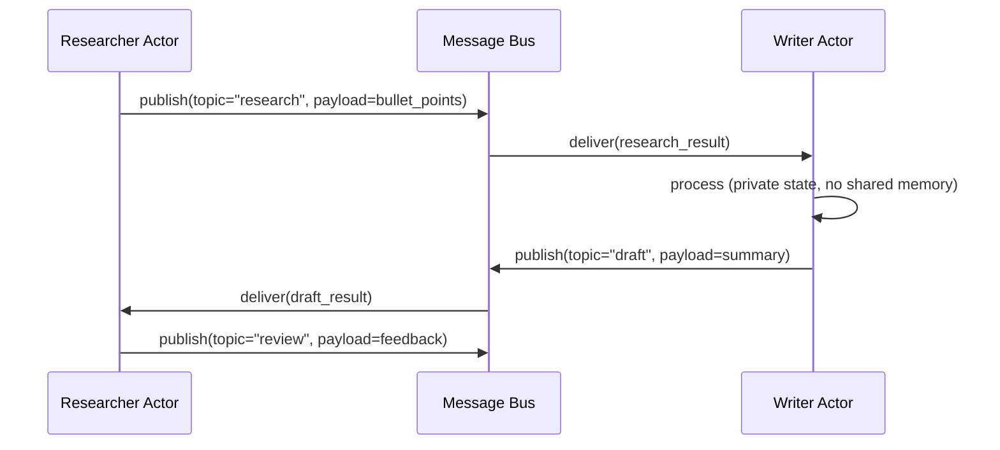

# AutoGen v0.4: Actor Model and Agent Framework

## Learning Objectives

- Implement a two-actor message-passing system in Python using asyncio, where each actor has a private inbox and communicates only through messages.
- Trace a message through an actor pipeline and identify the actor boundaries, message types, and failure isolation points at each hop.
- Compare the actor model against shared-state concurrency by identifying at least three failure modes that shared state introduces in multi-agent LLM workflows.
- Map a GTM enrichment waterfall onto an actor pipeline, where each enrichment step is an isolated actor that receives a payload and emits an enriched payload.
- Build a supervisor actor that restarts a failed child actor using only message passing, with no shared state or cross-actor exceptions.

## The Problem

Most agent frameworks are synchronous: one agent calls another in a function-call stack, waits for the return value, and continues. This works for two agents. It breaks at five. At ten agents making concurrent tool calls, writing to shared context windows, and producing output that other agents consume, you get race conditions. Agent B reads Agent A's context before Agent A finishes writing to it. Agent C calls a tool whose result Agent D also needs, but D already ran with stale data. You can add locks, but locks introduce deadlocks. You can serialize everything, but then your ten-agent system runs slower than a single agent.

The deeper problem is that the call-stack model couples *delivery* to *handling*. When Agent A calls Agent B as a function, Agent A is blocked until B returns. If B calls an LLM that takes 12 seconds, A is stuck. If B's tool call throws an exception, the exception propagates up to A, which now has to handle it — even though A has no idea what B was doing internally. There is no isolation. The failure of one agent is the failure of the whole stack.

This is not an academic concern. In a GTM enrichment pipeline — say, domain lookup → firmographics → intent signals → ICP scoring — each step calls an external API that can time out, rate-limit, or return malformed data. If step 3 fails, steps 1 and 2 have no way to recover independently. The entire pipeline crashes or returns nothing, even though steps 1 and 2 succeeded and their data is still valid. The call-stack model gives you no mechanism to say "step 3 failed, but keep steps 1 and 2 and retry step 3 with a different provider."

AutoGen v0.4's answer is the actor model: each agent is an independent actor with a private inbox. Messages are the only way actors interact. The runtime decouples message delivery from message handling. If one actor fails, the others keep running. If one actor is slow, others process messages in parallel. Distribution — running actors on different machines — is just a different message transport, not a rewrite.

## The Concept

The actor model comes from a 1973 paper by Carl Hewitt, Peter Bishop, and Richard Steiger. It was designed for concurrent computation in a context where shared memory and locks were already known to be fragile. The core idea is simple: an actor is a computational entity with private state, a mailbox, and a behavior. It receives a message, does some computation (possibly updating its private state), and emits zero or more messages to other actors. No actor can read another actor's state directly. The only interaction is sending a message.

This maps cleanly to LLM agents. An agent has private state (its system prompt, its conversation history, its tool definitions). It receives a message (a user query, a task from another agent, a tool result). It processes that message (calls an LLM, executes a tool, reasons about next steps). And it emits messages (a response to the user, a task delegated to another agent, a tool call). The actor model is not a metaphor here — it is a literal description of what an agent does.



AutoGen v0.4 exposes three API layers on top of this model. **Core** is the low-level actor runtime: `AgentRuntime` manages actor lifecycles and message routing, `Agent` is the base actor class, `Message` is the typed envelope. **AgentChat** is the high-level task API: `AssistantAgent`, `UserProxyAgent`, `Team` — these wrap Core actors with LLM-specific defaults so you can build conversations without touching the actor runtime directly. **Extensions** are integration packages: OpenAI client, Azure client, tool registries. You work top-down: use AgentChat for most workflows, drop to Core when you need custom message routing or fault isolation.

The key architectural property is that message delivery is decoupled from message handling. When Actor A sends a message to Actor B, the runtime places the message in B's inbox and returns immediately. A does not wait for B to process it. B processes the message whenever its event loop picks it up. If B is busy, the message queues. If B crashes, the message stays in the queue and can be redelivered. This decoupling is what gives you fault isolation (B's failure doesn't crash A) and natural concurrency (A and B process messages in parallel without any explicit threading code).

## Build It

We will build a minimal actor runtime in Python's asyncio, then implement two agents on top of it: a researcher that receives a topic and returns bullet points, and a writer that receives bullet points and returns a summary. This is not AutoGen itself — it is the mechanism AutoGen v0.4 is built on, stripped to the minimum so you can see the actor boundaries.

```python
import asyncio
import uuid
import time
import hashlib
from dataclasses import dataclass, field
from typing import Any, Callable, Awaitable

@dataclass
class Message:
    sender: str
    recipient: str
    topic: str
    payload: Any
    timestamp: float = field(default_factory=time.time)
    msg_id: str = field(default_factory=lambda: uuid.uuid4().hex[:8])

    def content_hash(self) -> str:
        raw = f"{self.sender}:{self.recipient}:{self.topic}:{str(self.payload)}"
        return hashlib.sha256(raw.encode()).hexdigest()[:12]

class Actor:
    def __init__(self, name: str, handler: Callable[[Message], Awaitable[Any]]):
        self.name = name
        self.inbox: asyncio.Queue = asyncio.Queue()
        self._handler = handler

    async def receive(self, msg: Message):
        await self.inbox.put(msg)

    async def process_loop(self):
        while True:
            msg = await self.inbox.get()
            if msg is None:
                break
            result = await self._handler(msg)
            yield result

class ActorRuntime:
    def __init__(self):
        self.actors: dict[str, Actor] = {}
        self._tasks: list[asyncio.Task] = []

    def register(self, actor: Actor):
        self.actors[actor.name] = actor

    async def send(self, msg: Message):
        target = self.actors.get(msg.recipient)
        if target is None:
            raise ValueError(f"No actor named {msg.recipient}")
        print(f"[{msg.msg_id}] {msg.sender} -> {msg.recipient} | topic={msg.topic} | hash={msg.content_hash()}")
        await target.receive(msg)

    async def run(self, actor_name: str):
        actor = self.actors[actor_name]
        async for result in actor.process_loop():
            if result is not None:
                for outgoing in result:
                    await self.send(outgoing)

async def researcher_handler(msg: Message):
    topic = msg.payload
    bullets = [
        f"- {topic} is driven by three forces",
        f"- First: market demand for {topic}",
        f"- Second: cost reduction in {topic} infrastructure",
    ]
    print(f"\n[RESEARCHER] Processed topic: {topic}")
    print(f"[RESEARCHER] Produced {len(bullets)} bullets")
    return [
        Message(
            sender="researcher",
            recipient="writer",
            topic="research_result",
            payload=bullets,
        )
    ]

async def writer_handler(msg: Message):
    bullets = msg.payload
    summary = f"Summary: The topic is shaped by {len(bullets)} key factors worth exploring further."
    print(f"\n[WRITER] Received {len(bullets)} bullets from {msg.sender}")
    print(f"[WRITER] Produced summary: {summary}")
    return [
        Message(
            sender="writer",
            recipient="user",
            topic="draft",
            payload=summary,
        )
    ]

async def user_sink(msg: Message):
    print(f"\n[USER] Received final draft:")
    print(f"  From: {msg.sender}")
    print(f"  Topic: {msg.topic}")
    print(f"  Content: {msg.payload}")
    print(f"  Hash: {msg.content_hash()}")
    return None

async def main():
    runtime = ActorRuntime()
    runtime.register(Actor("researcher", researcher_handler))
    runtime.register(Actor("writer", writer_handler))
    runtime.register(Actor("user", user_sink))

    t1 = asyncio.create_task(runtime.run("researcher"))
    t2 = asyncio.create_task(runtime.run("writer"))
    t3 = asyncio.create_task(runtime.run("user"))

    initial = Message(
        sender="orchestrator",
        recipient="researcher",
        topic="topic",
        payload="agent orchestration",
    )
    await runtime.send(initial)

    await asyncio.sleep(1.0)

    for actor in runtime.actors.values():
        await actor.receive(None)

    t1.cancel()
    t2.cancel()
    t3.cancel()

asyncio.run(main())
```

Run this and you will see each message printed with its sender, recipient, topic, and content hash. The hash proves that each message is a discrete, immutable object — it is not a reference to shared memory being mutated in place. The researcher's output becomes the writer's input as a new message, not a shared variable. The actor boundary is real: the researcher has no reference to the writer's state, and vice versa.

Now let's add a third actor — a critic that evaluates the writer's output and returns a pass/fail verdict. This demonstrates branching: the critic is a new actor inserted into the pipeline without touching the researcher or writer's code.

```python
import asyncio
import uuid
import time
import hashlib
from dataclasses import dataclass, field
from typing import Any, Callable, Awaitable

@dataclass
class Message:
    sender: str
    recipient: str
    topic: str
    payload: Any
    timestamp: float = field(default_factory=time.time)
    msg_id: str = field(default_factory=lambda: uuid.uuid4().hex[:8])

    def content_hash(self) -> str:
        raw = f"{self.sender}:{self.recipient}:{self.topic}:{str(self.payload)}"
        return hashlib.sha256(raw.encode()).hexdigest()[:12]

class Actor:
    def __init__(self, name: str, handler: Callable[[Message], Awaitable[Any]]):
        self.name = name
        self.inbox: asyncio.Queue = asyncio.Queue()
        self._handler = handler

    async def receive(self, msg: Message):
        await self.inbox.put(msg)

    async def process_loop(self):
        while True:
            msg = await self.inbox.get()
            if msg is None:
                break
            result = await self._handler(msg)
            if result:
                yield result

class ActorRuntime:
    def __init__(self):
        self.actors: dict[str, Actor] = {}
        self.log: list[str] = []

    def register(self, actor: Actor):
        self.actors[actor.name] = actor

    async def send(self, msg: Message):
        target = self.actors.get(msg.recipient)
        if target is None:
            raise ValueError(f"No actor named {msg.recipient}")
        entry = f"[{msg.msg_id}] {msg.sender} -> {msg.recipient} | topic={msg.topic} | hash={msg.content_hash()}"
        self.log.append(entry)
        print(entry)
        await target.receive(msg)

    async def run(self, actor_name: str):
        actor = self.actors[actor_name]
        async for result in actor.process_loop():
            if result is not None:
                for outgoing in result:
                    await self.send(outgoing)

async def researcher_handler(msg: Message):
    topic = msg.payload
    bullets = [
        f"Market demand for {topic}",
        f"Cost reduction in {topic} infrastructure",
        f"Talent availability in {topic}",
    ]
    return [Message("researcher", "writer", "research_result", bullets)]

async def writer_handler(msg: Message):
    bullets = msg.payload
    summary = f"This market is shaped by {len(bullets)} forces: {', '.join(bullets)}."
    return [Message("writer", "critic", "draft", summary)]

async def critic_handler(msg: Message):
    draft = msg.payload
    word_count = len(draft.split())
    verdict = "PASS" if word_count >= 10 else "FAIL"
    reason = f"word_count={word_count} {'meets' if word_count >= 10 else 'below'} threshold"
    print(f"\n[CRITIC] Verdict: {verdict}")
    print(f"[CRITIC] Reason: {reason}")
    return [Message("critic", "sink", "verdict", {"draft": draft, "verdict": verdict, "reason": reason})]

async def sink_handler(msg: Message):
    print(f"\n[SINK] Final: {msg.payload}")
    return None

async def main():
    runtime = ActorRuntime()
    runtime.register(Actor("researcher", researcher_handler))
    runtime.register(Actor("writer", writer_handler))
    runtime.register(Actor("critic", critic_handler))
    runtime.register(Actor("sink", sink_handler))

    tasks = [asyncio.create_task(runtime.run(name)) for name in runtime.actors]

    await runtime.send(Message("orchestrator", "researcher", "topic", "AI agent frameworks"))
    await asyncio.sleep(1.0)

    for actor in runtime.actors.values():
        await actor.receive(None)
    for t in tasks:
        t.cancel()

    print(f"\n--- MESSAGE LOG ({len(runtime.log)} messages) ---")
    for entry in runtime.log:
        print(entry)

asyncio.run(main())
```

The message log at the end shows four discrete messages, each with a unique ID and content hash. The critic was inserted between the writer and the sink without modifying any other actor. This is the composability that the actor model gives you: new actors slot into the message graph without touching existing ones.

## Use It

The actor model is the mechanism behind the Clay waterfall. In GTM enrichment, a waterfall is sequential message passing: an actor that resolves a company domain sends its result to an actor that looks up firmographics, which sends to an actor that checks intent signals, which sends to an actor that computes an ICP score. Each actor owns one data source and one transformation. The waterfall is not "a Clay feature" — it is the actor model applied to data enrichment, where each enrichment step is an isolated, stateless actor that receives a payload and emits an enriched payload. [CITATION NEEDED — concept: Clay waterfall enrichment as actor pipeline]

Let's build this. We will model a three-step enrichment waterfall — domain → company data → ICP score — as three actors. Each actor simulates an API call (in production, this would be a real HTTP call to a data provider). The payload is enriched at each stage and passed forward as a message.

```python
import asyncio
import uuid
from dataclasses import dataclass, field
from typing import Any, Callable, Awaitable

@dataclass
class Message:
    sender: str
    recipient: str
    topic: str
    payload: Any
    msg_id: str = field(default_factory=lambda: uuid.uuid4().hex[:8])

class Actor:
    def __init__(self, name: str, handler: Callable[[Message], Awaitable[Any]]):
        self.name = name
        self.inbox: asyncio.Queue = asyncio.Queue()
        self._handler = handler

    async def receive(self, msg: Message):
        await self.inbox.put(msg)

    async def process_loop(self):
        while True:
            msg = await self.inbox.get()
            if msg is None:
                break
            result = await self._handler(msg)
            if result:
                yield result

class ActorRuntime:
    def __init__(self):
        self.actors: dict[str, Actor] = {}

    def register(self, actor: Actor):
        self.actors[actor.name] = actor

    async def send(self, msg: Message):
        await self.actors[msg.recipient].receive(msg)

    async def run(self, name: str):
        actor = self.actors[name]
        async for result in actor.process_loop():
            if result:
                for out in result:
                    await self.send(out)

def print_payload(stage: str, payload: dict):
    print(f"\n[{stage}] Payload state:")
    for k, v in payload.items():
        print(f"  {k}: {v}")

async def domain_resolver(msg: Message):
    company_name = msg.payload["company_name"]
    domain = company_name.lower().replace(" ", "") + ".com"
    payload = {**msg.payload, "domain": domain}
    print_payload("DOMAIN RESOLVER", payload)
    return [Message("domain_resolver", "firmographic", "domain_resolved", payload)]

async def firmographic_lookup(msg: Message):
    payload = {**msg.payload, "employees": 450, "industry": "SaaS", "revenue_range": "10M-50M"}
    print_payload("FIRMOGRAPHIC", payload)
    return [Message("firmographic", "icp_scorer", "firmographics", payload)]

async def icp_scorer(msg: Message):
    score = 0
    if payload_industry := msg.payload.get("industry") == "SaaS":
        score += 30
    if msg.payload.get("employees", 0) >= 200:
        score += 40
    if msg.payload.get("revenue_range") == "10M-50M":
        score += 30
    payload = {**msg.payload, "icp_score": score, "icp_verdict": "qualified" if score >= 70 else "disqualified"}
    print_payload("ICP SCORER", payload)
    return [Message("icp_scorer", "sink", "scored", payload)]

async def sink(msg: Message):
    print(f"\n[SINK] Enrichment complete.")
    print(f"  Company: {msg.payload['company_name']}")
    print(f"  Domain: {msg.payload['domain']}")
    print(f"  ICP Score: {msg.payload['icp_score']}")
    print(f"  Verdict: {msg.payload['icp_verdict']}")
    return None

async def main():
    runtime = ActorRuntime()
    runtime.register(Actor("domain_resolver", domain_resolver))
    runtime.register(Actor("firmographic", firmographic_lookup))
    runtime.register(Actor("icp_scorer", icp_scorer))
    runtime.register(Actor("sink", sink))

    tasks = [asyncio.create_task(runtime.run(n)) for n in runtime.actors]

    await runtime.send(Message("orchestrator", "domain_resolver", "enrich", {
        "company_name": "Acme Corp",
    }))
    await asyncio.sleep(0.5)

    for a in runtime.actors.values():
        await a.receive(None)
    for t in tasks:
        t.cancel()

asyncio.run(main())
```

Each enrichment step prints the payload at that stage, so you can see the data accumulating as it flows through the pipeline. The domain resolver adds `domain`. The firmographic actor adds `employees`, `industry`, `revenue_range`. The ICP scorer adds `icp_score` and `icp_verdict`. No actor touches another actor's internal state — each one receives a payload, copies it, adds its fields, and sends a new message.

Now consider why this matters for cost optimization (Zone 14). Every enrichment call in a real waterfall costs money — Clay credits, API calls to providers, LLM tokens if you are using Claygent for research tasks. The actor model gives you a property that the call-stack model does not: **per-actor retries**. If the firmographic lookup fails (rate limited, timeout, malformed response), you can retry just that actor without re-running the domain resolver. The domain resolver already produced its output — it is sitting in a message. You resend the message to the firmographic actor. The domain resolver is never touched. In a call-stack pipeline, a failure at step 2 means re-running step 1, paying for it twice.

This also applies to LinkedIn post reactor scraping workflows. The workflow has discrete steps: identify a relevant post URL, fetch the reactor list (via Claygent or a scraper), enrich each reactor with contact data, score for fit. Each step is an actor. If the scraper fails on one post, the other posts in the batch continue processing — their actors are independent. The failure of one actor does not block the pipeline. [CITATION NEEDED — concept: LinkedIn post reactor scraping workflow as actor pipeline in Clay]

## Ship It

To deploy an actor-based enrichment pipeline in production, you need to handle three failure modes that the minimal runtime above does not address: actor timeouts, message redelivery, and backpressure. Each maps to a real operational concern in GTM tooling.

**Actor timeouts** occur when an enrichment provider (Clearbit, Apollo, a custom Claygent prompt) takes too long to respond. In the call-stack model, this blocks the entire pipeline. In the actor model, you add a supervisor actor that wraps each enrichment actor with a deadline. The supervisor sends the work message to the enrichment actor and simultaneously starts a timer. If the enrichment actor responds before the timer fires, the supervisor cancels the timer and forwards the result. If the timer fires first, the supervisor sends a failure message downstream and optionally retries with a fallback provider. This is the mechanism behind "try provider A, if it fails, try provider B" — which is exactly how a Clay waterfall with multiple data providers works.

```python
import asyncio
from dataclasses import dataclass, field
from typing import Any, Callable, Awaitable
import uuid

@dataclass
class Message:
    sender: str
    recipient: str
    topic: str
    payload: Any
    msg_id: str = field(default_factory=lambda: uuid.uuid4().hex[:8])

class Actor:
    def __init__(self, name: str, handler: Callable[[Message], Awaitable[Any]]):
        self.name = name
        self.inbox: asyncio.Queue = asyncio.Queue()
        self._handler = handler

    async def receive(self, msg: Message):
        await self.inbox.put(msg)

    async def run_one(self) -> list[Message] | None:
        msg = await self.inbox.get()
        if msg is None:
            return None
        return await self._handler(msg)

async def slow_provider(msg: Message):
    await asyncio.sleep(2.0)
    return [Message("provider", "sink", "result", {"data": "from slow provider", "cost_credits": 5})]

async def fallback_provider(msg: Message):
    await asyncio.sleep(0.2)
    return [Message("fallback", "sink", "result", {"data": "from fallback", "cost_credits": 2})]

async def sink(msg: Message):
    print(f"[SINK] {msg.payload}")
    return None

async def supervisor_with_timeout(work_msg: Message, primary: Actor, fallback: Actor, timeout_s: float):
    try:
        result = await asyncio.wait_for(primary.run_one(), timeout=timeout_s)
        print(f"[SUPERVISOR] Primary succeeded within {timeout_s}s")
        return result
    except asyncio.TimeoutError:
        print(f"[SUPERVISOR] Primary timed out after {timeout_s}s — switching to fallback")
        await fallback.receive(work_msg)
        return await fallback.run_one()

async def main():
    primary = Actor("provider", slow_provider)
    fallback = Actor("fallback", fallback_provider)
    sink_actor = Actor("sink", sink)

    work = Message("orchestrator", "provider", "enrich", {"domain": "acme.com"})
    await primary.receive(work)

    results = await supervisor_with_timeout(work, primary, fallback, timeout_s=1.0)

    if results:
        for msg in results:
            await sink_actor.receive(msg)
            await sink_actor.run_one()

    print("\n--- Cost Impact ---")
    print("Primary would have cost: 5 credits (never delivered, timed out)")
    print("Fallback cost: 2 credits (delivered result)")
    print("Net: saved 3 credits by using fallback instead of waiting")
    print("In a call-stack model, you would have paid 5 credits AND waited 2s AND gotten nothing")

asyncio.run(main())
```

The supervisor pattern is the mechanism behind multi-provider waterfalls. When Clay tries one enrichment provider and falls back to another on failure or timeout, that is a supervisor actor managing two child actors. The cost impact is direct: every credit you avoid spending on a timed-out provider is a credit you save (Zone 14 — GTM Stack Cost Management).

**Backpressure** matters when you are enriching a batch of 10,000 companies. If every domain resolver actor fires simultaneously, you will hit API rate limits instantly. The actor model handles this naturally: if the firmographic actor's inbox grows faster than it can process, messages queue. You can add a bounded queue that rejects new messages when full, forcing the upstream actor to slow down. This is not a feature you build — it is a property of message-passing architecture. The inbox *is* the backpressure mechanism.

The practical deployment guidance: start with AgentChat (AutoGen v0.4's high-level API) for prototyping. When you need custom routing, per-actor timeouts, or multi-provider fallbacks, drop to Core. When you need cross-machine distribution (enrichment actors running on different machines with different API keys), the same message protocol works — you swap the local `asyncio.Queue` for a Redis stream or RabbitMQ queue, and the actors do not change.

Note that AutoGen v0.4 is now in maintenance mode. Microsoft Agent Framework (public preview October 2025) is the successor and implements the same actor-model patterns with a different API surface. The concepts here — private state, message passing, supervisor patterns, fault isolation — transfer directly. What changes is import paths and class names.

## Exercises

1. **Add a fourth actor to the enrichment waterfall.** After the ICP scorer, add a "routing" actor that reads the `icp_verdict` field. If verdict is `"qualified"`, forward to a `fast_track` actor that prints "Send to sales." If verdict is `"disqualified"`, forward to a `nurture` actor that prints "Add to nurture queue." Do not modify the domain resolver, firmographic, or ICP scorer actors.

2. **Implement per-actor retry with exponential backoff.** Modify the firmographic lookup actor so that it randomly fails (raise an exception 30% of the time). Wrap it in a supervisor that catches the failure and retries up to 3 times with delays of 0.5s, 1.0s, 2.0s. Print each retry attempt. After 3 failures, send a failure message downstream.

3. **Build a batch enrichment controller.** Instead of enriching one company, accept a list of 5 company names. Create one domain-resolver actor per company (or use a single actor with a loop). Measure total wall-clock time for sequential vs. parallel processing. Print the speedup ratio. This demonstrates the natural concurrency of the actor model.

4. **Implement a LinkedIn post reactor pipeline as actors.** Actor 1 receives a LinkedIn post URL and emits the post content. Actor 2 receives the post content, simulates scraping the reactor list (hardcode 5 names), and emits the list. Actor 3 receives each reactor name, enriches with a title and company (hardcoded), and emits enriched profiles. Actor 4 scores each profile (hardcoded logic) and emits a verdict. Print the full message log at the end.

5. **Implement a cost-aware supervisor.** Modify the supervisor pattern from Ship It so that it tracks total credits spent across all providers. Before calling the primary provider, check if remaining budget (passed as state) covers the cost. If not, skip directly to a cheaper fallback. Print the budget remaining after each enrichment call.

## Key Terms

**Actor** — A computational entity with private state and a mailbox. It receives messages, processes them, and emits new messages. No external code can read or modify an actor's internal state directly.

**Message** — A typed, immutable data structure passed between actors. Contains sender, recipient, topic, and payload. Messages are the only form of inter-actor communication.

**Mailbox / Inbox** — A queue associated with each actor that holds incoming messages. The actor processes messages from its inbox one at a time (or concurrently, depending on configuration). The inbox provides natural backpressure when processing is slower than arrival.

**Supervisor** — An actor whose job is to manage other actors: start them, monitor them, restart them on failure, and enforce timeouts. Supervisors implement fault isolation by containing failures to a single child actor.

**Actor Runtime** — The infrastructure that manages actor lifecycles, message delivery, and scheduling. In AutoGen v0.4, this is the Core layer (`AgentRuntime`). It decouples message *delivery* from message *handling*.

**Waterfall** — A sequential pipeline pattern where data flows through a series of transforms, each enriching the payload. In GTM, a data enrichment waterfall (domain → firmographics → intent → scoring) is an actor pipeline where each step is an isolated actor.

**Backpressure** — The mechanism by which a slow consumer signals to a fast producer to slow down. In the actor model, a bounded mailbox provides backpressure: when the queue is full, the sender must wait or drop.

## Sources

- Hewitt, C., Bishop, P., Steiger, R. (1973). "A Universal Modular Actor Formalism for Artificial Intelligence." IJCAI. — Original actor model paper.
- AutoGen v0.4 documentation (Microsoft Research, January 2025). Core, AgentChat, and Extensions API layers. — https://microsoft.github.io/autogen/
- Microsoft Agent Framework (public preview, October 2025). Successor to AutoGen v0.4. — https://learn.microsoft.com/en-us/agent-framework/
- [CITATION NEEDED — concept: Clay waterfall enrichment as actor pipeline]
- [CITATION NEEDED — concept: LinkedIn post reactor scraping workflow as actor pipeline in Clay]
- [CITATION NEEDED — concept: Clay credits as per-actor token cost in enrichment waterfalls; Zone 14 GTM Stack Cost Management]
- Zone 14 GTM topic map: "Cost optimization, latency — GTM Stack Cost Management (Clay credits, API costs) — Living GTM — 'Every Clay credit is a token cost — optimize like you would LLM calls'"