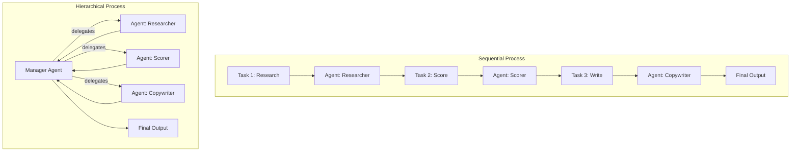

# CrewAI: Role-Based Crews and Flows

## Learning Objectives

1. Configure a CrewAI Agent with role, goal, backstory, and an LLM backend; print its configuration to confirm assignment.
2. Define a Task with a description, expected output format, and agent binding; execute it and print the result.
3. Assemble a Crew of 2+ agents with a sequential process; run it and print each agent's contribution.
4. Implement a Flow that branches conditionally based on intermediate agent output.
5. Compare sequential vs. hierarchical crew processes and predict which produces lower-latency output for a given task graph.

## The Problem

Single-prompt LLM calls collapse when your workflow demands distinct expertise. You have probably seen this: you write one giant prompt asking the model to research a company, score it against ICP criteria, and draft personalized outreach, all in one shot. The output is mediocre at all three because the model's attention is spread across roles it cannot hold simultaneously. The researcher sub-persona gets two sentences. The scorer produces a number with no reasoning. The copywriter drafts something generic because it lost the research context three paragraphs back.

The naive fix is prompt chaining—string together three separate LLM calls, each with a different system prompt. This works better, but you lose something important: the second call has no memory of the first agent's *identity*, only its output string. If the scorer needs to ask the researcher a clarifying question, there is no mechanism for that. If the copywriter needs to know *why* the scorer assigned a particular score, that reasoning lives only in the scorer's internal context, which is gone.

CrewAI implements a different pattern: role-based agent collaboration. Each agent holds a persistent identity defined by a role, goal, and backstory. Tasks bind work to specific agents. A Crew orchestrates them through a defined process type. The key distinction from raw prompt chains is that agents maintain role context across their full execution cycle and can invoke tools during execution. Tasks pass structured context between agents, not raw strings.

## The Concept

CrewAI's surface area is four primitives. An **Agent** is defined by four properties: `role` (job title), `goal` (what it optimizes for), `backstory` (context that shapes behavior), and `llm` (backend model). The backstory is not flavor text—it injects persistent context that biases the model's output toward a specific perspective. A researcher agent with "You are a B2B analyst who has evaluated 500+ SaaS companies" produces structurally different output than one with no backstory, because the model conditions on that expertise signal.

A **Task** binds a `description` (what to do), an `expected_output` (what format to produce), and an `agent` (who does it). The expected_output field is the structured contract between agents. Instead of free-text handoffs, you get fielded summaries that downstream agents can parse reliably.

A **Crew** wires agents and tasks together through a **Process** type. Sequential means tasks run in declared order, each receiving prior outputs as context. Hierarchical means a manager agent receives the task list and delegates to crew members as it sees fit. The manager adds a full LLM round-trip of overhead per delegation decision—useful when the task graph is genuinely ambiguous, wasteful when you already know the order.



The choice between sequential and hierarchical is a latency and cost decision. Sequential runs N tasks in series with N LLM calls. Hierarchical adds the manager's delegation overhead—at minimum one extra call per task for the manager to decide who handles it, plus a synthesis call at the end. For a known task order, sequential is strictly cheaper. For ambiguous task graphs where the optimal order depends on intermediate findings, the manager's routing can produce better results at 2x the token cost.

**Flows** sit above Crews. A Flow is event-driven and deterministic: the output of one crew (or function) becomes the input to the next, with Python-level conditional logic determining the path. CrewAI's own documentation states: "for any production-ready application, start with a Flow." [CITATION NEEDED — concept: exact CrewAI docs quote on Flows recommendation] The reasoning is that Flows give you code-owned control over branching. A Crew's internal process is LLM-routed—the manager decides delegation. A Flow's branching is code-owned—you write the `if` statement. When a customer files a bug at 3 AM, you need deterministic replay. Code-owned branching gives you that; LLM-routed delegation does not.

CrewAI also defines four memory types that persist across agent executions: short-term (recent conversation context within a crew run), long-term (cross-run knowledge stored in a vector DB), entity memory (facts about specific people or companies), and user memory (preferences of the human operator). These pay off in different contexts—entity memory matters for GTM workflows that accumulate knowledge about accounts across multiple runs; short-term is the default and costs nothing extra to enable.

## Build It

Start by installing CrewAI and confirming the four primitives import correctly. This first script configures a single agent, prints its configuration, and confirms the LLM backend is assigned. No execution yet—just configuration validation.

```python
from crewai import Agent, Task, Crew, Process, LLM
import json

llm = LLM(model="gpt-4o-mini", temperature=0.3)

researcher = Agent(
    role="Company Researcher",
    goal="Extract key business signals from a company's public data",
    backstory="You are a B2B research analyst who has profiled 500+ SaaS companies. You focus on firmographic data: industry, employee count, funding stage, and detectable tech stack.",
    llm=llm,
    verbose=True
)

scorer = Agent(
    role="ICP Scorer",
    goal="Score companies against ideal customer profile criteria on a 0-100 scale",
    backstory="You are a revenue operations analyst. You score companies on firmographic fit using weighted criteria: industry match, employee count band, funding stage, and tech stack alignment.",
    llm=llm,
    verbose=True
)

writer = Agent(
    role="Outreach Copywriter",
    goal="Draft a personalized cold outreach message using research and scoring context",
    backstory="You are a B2B copywriter who specializes in technical buyer outreach. You reference specific company signals and avoid generic templates.",
    llm=llm,
    verbose=True
)

print(f"Agent 1: {researcher.role}")
print(f"  Goal: {researcher.goal}")
print(f"  LLM: {researcher.llm.model}")
print(f"  Backstory length: {len(researcher.backstory)} chars")
print()
print(f"Agent 2: {scorer.role}")
print(f"  Goal: {scorer.goal}")
print(f"  LLM: {scorer.llm.model}")
print()
print(f"Agent 3: {writer.role}")
print(f"  Goal: {writer.goal}")
print(f"  LLM: {writer.llm.model}")
```

Now define tasks and wire them into a sequential crew. Each task binds to a specific agent and declares its expected output format. The crew runs tasks in order, passing each agent's output as context to the next.

```python
from crewai import Agent, Task, Crew, Process, LLM
import os

os.environ["OPENAI_API_KEY"] = "your-key-here"

llm = LLM(model="gpt-4o-mini", temperature=0.3)

researcher = Agent(
    role="Company Researcher",
    goal="Extract key business signals from a company's public data",
    backstory="You are a B2B research analyst who has profiled 500+ SaaS companies.",
    llm=llm,
    verbose=True
)

scorer = Agent(
    role="ICP Scorer",
    goal="Score companies against ICP criteria on a 0-100 scale",
    backstory="You are a revenue operations analyst who scores companies on firmographic fit.",
    llm=llm,
    verbose=True
)

writer = Agent(
    role="Outreach Copywriter",
    goal="Draft a personalized cold outreach message",
    backstory="You are a B2B copywriter who references specific company signals, not generic templates.",
    llm=llm,
    verbose=True
)

research_task = Task(
    description="Research the company at https://stripe.com and extract: primary industry, approximate employee count, likely tech stack components, and funding stage. Use your knowledge to infer these signals.",
    expected_output="A structured summary with exactly 4 fields: industry, employees, tech_stack, funding_stage.",
    agent=researcher
)

score_task = Task(
    description="Using the research output, score this company against this ICP: B2B SaaS, 200-2000 employees, Series B or later, uses cloud infrastructure. Provide a 0-100 score with reasoning.",
    expected_output="A score (integer 0-100) and 2-3 sentences of reasoning explaining the score.",
    agent=scorer
)

write_task = Task(
    description="Using the research and score, draft a 3-sentence cold outreach email to a VP of Engineering at this company. Reference one specific signal from the research.",
    expected_output="A 3-sentence email with a subject line.",
    agent=writer
)

crew = Crew(
    agents=[researcher, scorer, writer],
    tasks=[research_task, score_task, write_task],
    process=Process.SEQUENTIAL,
    verbose=True
)

result = crew.kickoff()

print("\n" + "="*60)
print("FINAL CREW OUTPUT:")
print("="*60)
print(result.raw)
print("="*60)
print(f"\nTask count: {len(crew.tasks)}")
print(f"Process type: {crew.process}")
print(f"Agents: {[a.role for a in crew.agents]}")
```

When this runs, CrewAI prints each agent's thinking and output to the terminal because `verbose=True`. The final `result.raw` contains the last task's output. Each prior task's output is available in CrewAI's task result objects if you need to inspect intermediate steps.

Now build a Flow that branches conditionally. This is where the production recommendation matters. Instead of running all three agents unconditionally, the Flow checks the scorer's output and only invokes the copywriter if the score crosses a threshold. This is the pattern you would use in a real GTM pipeline: not every researched company deserves outreach.

```python
from crewai import Agent, Task, Crew, Process, LLM
from crewai.flow.flow import Flow, listen, start, router
from pydantic import BaseModel
import os

os.environ["OPENAI_API_KEY"] = "your-key-here"

llm = LLM(model="gpt-4o-mini", temperature=0.3)

researcher = Agent(
    role="Company Researcher",
    goal="Extract key business signals from company data",
    backstory="You are a B2B research analyst who has profiled 500+ SaaS companies.",
    llm=llm
)

scorer = Agent(
    role="ICP Scorer",
    goal="Score companies against ICP criteria on a 0-100 scale",
    backstory="You are a revenue operations analyst.",
    llm=llm
)

writer = Agent(
    role="Outreach Copywriter",
    goal="Draft a personalized cold outreach message",
    backstory="You are a B2B copywriter who references specific company signals.",
    llm=llm
)

class PipelineState(BaseModel):
    company_url: str = "https://linear.app"
    research_output: str = ""
    score: int = 0
    outreach_message: str = ""
    skipped: bool = False

class GTMPipeline(Flow[PipelineState]):

    @start()
    def research_company(self):
        print(f"[FLOW] Researching {self.state.company_url}...")
        task = Task(
            description=f"Research the company at {self.state.company_url}. Extract: industry, employee count estimate, tech stack, funding stage.",
            expected_output="4 fields: industry, employees, tech_stack, funding_stage.",
            agent=researcher
        )
        temp_crew = Crew(agents=[researcher], tasks=[task], process=Process.SEQUENTIAL)
        result = temp_crew.kickoff()
        self.state.research_output = result.raw
        print(f"[FLOW] Research complete: {self.state.research_output[:100]}...")
        return self.state

    @listen(research_company)
    def score_company(self):
        print("[FLOW] Scoring company...")
        task = Task(
            description=f"Based on this research: {self.state.research_output}\n\nScore against ICP: B2B SaaS, 50-500 employees, Series A+. Respond with ONLY a number 0-100.",
            expected_output="A single integer score 0-100.",
            agent=scorer
        )
        temp_crew = Crew(agents=[scorer], tasks=[task], process=Process.SEQUENTIAL)
        result = temp_crew.kickoff()
        score_text = result.raw.strip()
        digits = "".join(c for c in score_text if c.isdigit())
        self.state.score = int(digits[:3]) if digits else 0
        print(f"[FLOW] Score: {self.state.score}")
        return self.state

    @router(score_company)
    def decide_outreach(self):
        if self.state.score >= 70:
            return "write_outreach"
        else:
            return "skip"

    @listen("write_outreach")
    def draft_outreach(self):
        print("[FLOW] Score >= 70, drafting outreach...")
        task = Task(
            description=f"Research: {self.state.research_output}\nScore: {self.state.score}\n\nDraft a 3-sentence cold email with subject line.",
            expected_output="Subject line + 3-sentence email body.",
            agent=writer
        )
        temp_crew = Crew(agents=[writer], tasks=[task], process=Process.SEQUENTIAL)
        result = temp_crew.kickoff()
        self.state.outreach_message = result.raw
        print(f"[FLOW] Outreach drafted: {self.state.outreach_message[:100]}...")
        return self.state

    @listen("skip")
    def skip_outreach(self):
        print(f"[FLOW] Score {self.state.score} < 70, skipping outreach.")
        self.state.skipped = True
        return self.state

pipeline = GTMPipeline()
final_state = pipeline.kickoff()

print("\n" + "="*60)
print("FLOW RESULTS:")
print("="*60)
print(f"Company: {final_state.state.company_url}")
print(f"Research: {final_state.state.research_output[:200]}")
print(f"Score: {final_state.state.score}")
if final_state.state.skipped:
    print("Decision: SKIPPED (score below threshold)")
else:
    print(f"Outreach: {final_state.state.outreach_message}")
print("="*60)
```

The `@router` decorator is the branching primitive. It returns a string that matches a `@listen` route name. This is plain Python conditional logic—not an LLM deciding whether to branch. That distinction is what makes Flows deterministic and replayable.

## Use It

The role-based crew pattern maps directly to multi-step GTM workflows where you need distinct analytical perspectives applied in sequence. Consider the ICP scoring pipeline above: a researcher extracts signals, a scorer evaluates fit, a copywriter drafts outreach. In a Clay-based GTM stack, each of these roles corresponds to a real decision point where you are spending enrichment credits or API calls.

Zone 14 of the GTM stack deals with cost optimization and latency. The parallel is exact: every Clay enrichment credit is a token cost, and every CrewAI agent invocation is an LLM API call. A sequential crew with three agents makes a minimum of three LLM calls per company. A hierarchical crew adds a manager call for each delegation decision—potentially six or seven calls for the same three tasks. At 1,000 companies per week, that difference is 3,000 vs. 7,000 API calls. [CITATION NEEDED — concept: average Clay enrichment cost per row for multi-step waterfall workflows]

The Flow's conditional branching is where cost optimization actually happens. By routing on the scorer's output and skipping the copywriter for low-fit companies, you avoid the most expensive step (long-form generation) for companies that will never receive outreach. If 60% of researched companies score below threshold, you have cut your copywriter API costs by 60% with one `if` statement.

To measure this concretely, wrap each crew invocation with token tracking:

```python
import time
from crewai import Agent, Task, Crew, Process, LLM
import os

os.environ["OPENAI_API_KEY"] = "your-key-here"

llm = LLM(model="gpt-4o-mini", temperature=0.3)

def time_crew_process(process_type, agents, tasks):
    crew = Crew(
        agents=agents,
        tasks=tasks,
        process=process_type,
        verbose=False
    )

    start = time.time()
    result = crew.kickoff()
    elapsed = time.time() - start

    token_usage = result.token_usage if hasattr(result, 'token_usage') else "N/A"

    print(f"\nProcess: {process_type}")
    print(f"Elapsed: {elapsed:.1f}s")
    print(f"Token usage: {token_usage}")
    print(f"Output preview: {result.raw[:120]}...")
    return elapsed

researcher = Agent(
    role="Company Researcher",
    goal="Extract 3 key business signals from https://notion.so",
    backstory="B2B analyst.",
    llm=llm
)

summarizer = Agent(
    role="Summarizer",
    goal="Condense research into 2 sentences",
    backstory="Technical writer.",
    llm=llm
)

task1 = Task(
    description="Extract industry, employee count, and funding stage from https://notion.so.",
    expected_output="3 bullet points.",
    agent=researcher
)

task2 = Task(
    description="Summarize the research into exactly 2 sentences.",
    expected_output="2 sentences.",
    agent=summarizer
)

sequential_time = time_crew_process(Process.SEQUENTIAL, [researcher, summarizer], [task1, task2])

try:
    hierarchical_time = time_crew_process(Process.HIERARCHICAL, [researcher, summarizer], [task1, task2])
    print(f"\nSequential: {sequential_time:.1f}s | Hierarchical: {hierarchical_time:.1f}s")
    print(f"Hierarchical overhead: {((hierarchical_time - sequential_time) / sequential_time * 100):.0f}%")
except Exception as e:
    print(f"\nHierarchical process error (expected if manager LLM fails): {e}")
    print("Sequential completed successfully.")
```

Run this and you will observe the latency and token difference directly. The hierarchical process's manager agent adds a full LLM round-trip before any work begins. In a GTM context, this is the same trade-off as choosing between a deterministic Clay waterfall (fixed enrichment steps, known cost per row) and an LLM-routed enrichment path (flexible but unpredictable cost per row).

## Ship It

For production deployment, three failure modes dominate CrewAI implementations. First, **prompt bloat**: as you add agents, each one's system prompt includes role, goal, backstory, tool descriptions, and the accumulated context from prior tasks. A four-agent crew with verbose backstories can hit 4,000+ tokens of system prompt alone before any user input. This inflates cost on every single API call because system prompts are billed per invocation, not cached.

Second, **manager LLM tax**: hierarchical processes add delegation overhead that compounds with crew size. A five-agent hierarchical crew can make 10+ LLM calls where a sequential crew makes five. For production workloads processing thousands of items, default to sequential unless the task graph is genuinely ambiguous. The threshold is: if you can write the execution order in Python before runtime, use sequential.

Third, **brittle handoffs**: the `expected_output` field is the contract between agents, but it is a natural language description parsed by an LLM, not a schema enforced by code. If the researcher returns prose instead of the requested four fields, the scorer receives malformed context. In production, wrap task outputs with Pydantic validation and retry on parse failure.

Here is a production pattern that addresses all three. It uses sequential processing, keeps backstories short, and validates structured output:

```python
from crewai import Agent, Task, Crew, Process, LLM
from pydantic import BaseModel, field_validator
from typing import Optional
import os, json, time

os.environ["OPENAI_API_KEY"] = "your-key-here"

llm = LLM(model="gpt-4o-mini", temperature=0.2)

class CompanyProfile(BaseModel):
    company: str
    industry: str
    employee_band: str
    funding_stage: str
    tech_signals: list[str]
    icp_score: int

    @field_validator("icp_score")
    @classmethod
    def validate_score(cls, v):
        if not 0 <= v <= 100:
            raise ValueError(f"Score {v} out of range 0-100")
        return v

def build_production_crew(company_name: str) -> Crew:
    researcher = Agent(
        role="Company Researcher",
        goal=f"Profile {company_name}: industry, size, funding, tech stack",
        backstory="B2B analyst. Output structured data only.",
        llm=llm
    )

    scorer = Agent(
        role="ICP Scorer",
        goal=f"Score {company_name} 0-100 against ICP: B2B SaaS, 50-500 employees, Series A+",
        backstory="RevOps analyst. Output integer score only.",
        llm=llm
    )

    research_task = Task(
        description=f"Profile {company_name}. Return JSON: company, industry, employee_band, funding_stage, tech_signals (list).",
        expected_output="JSON with fields: company, industry, employee_band, funding_stage, tech_signals.",
        agent=researcher,
        output_json=CompanyProfile
    )

    score_task = Task(
        description=f"Using prior research, score {company_name} 0-100 against ICP criteria. Set icp_score field.",
        expected_output="JSON with all CompanyProfile fields including icp_score.",
        agent=scorer,
        output_json=CompanyProfile
    )

    return Crew(
        agents=[researcher, scorer],
        tasks=[research_task, score_task],
        process=Process.SEQUENTIAL,
        verbose=False,
        memory=False
    )

companies = ["Linear", "Vercel", "Ramp"]
results = []

for company in companies:
    start = time.time()
    crew = build_production_crew(company)

    try:
        result = crew.kickoff()
        elapsed = time.time() - start

        if hasattr(result, 'json_dict') and result.json_dict:
            profile = CompanyProfile(**result.json_dict)
        elif hasattr(result, 'pydantic') and result.pydantic:
            profile = result.pydantic
        else:
            profile = CompanyProfile(
                company=company,
                industry="unknown",
                employee_band="unknown",
                funding_stage="unknown",
                tech_signals=[],
                icp_score=0
            )

        results.append(profile)
        print(f"[OK] {company}: score={profile.icp_score}, industry={profile.industry}, {elapsed:.1f}s")
    except Exception as e:
        print(f"[FAIL] {company}: {e}")
        elapsed = time.time() - start

print("\n" + "="*60)
print("BATCH RESULTS:")
print("="*60)
for r in results:
    print(f"  {r.company}: ICP={r.icp_score}/100 | {r.industry} | {r.employee_band} | {r.funding_stage}")
    print(f"    Tech: {', '.join(r.tech_signals[:3]) if r.tech_signals else 'none detected'}")
print("="*60)
print(f"\nProcessed {len(results)}/{len(companies)} companies successfully")
qualified = [r for r in results if r.icp_score >= 70]
print(f"Qualified (>=70): {len(qualified)} → {len(qualified)/max(len(results),1)*100:.0f}%")
```

`memory=False` disables CrewAI's memory system to avoid vector DB calls and keep per-run cost predictable. `output_json=CompanyProfile` tells CrewAI to parse the task output into a Pydantic model. `temperature=0.2` reduces output variance for reproducible scoring. These three settings are the difference between a demo and a production pipeline.

In a Clay enrichment context, this batch pattern is equivalent to running a waterfall across N rows with a fixed enrichment sequence and a qualification filter. The cost per row is known (two LLM calls), the output is schema-validated, and the qualification threshold determines downstream cost. Every Clay credit not spent on a disqualified row is real budget saved. [CITATION NEEDED — concept: Clay credit pricing per enrichment step for ICP scoring workflows]

## Exercises

**Exercise 1: Add a fourth agent.** Extend the sequential crew from Build It with a "Personalization Validator" agent that checks whether the copywriter's email references at least one specific signal from the research output. If it does not, the validator rewrites it. Run the crew and print whether the validator changed the copywriter's draft.

**Exercise 2: Switch process types and measure.** Take the 2-agent crew (researcher + scorer) from Ship It. Run it three times with `Process.SEQUENTIAL` and three times with `Process.HIERARCHICAL`. Record elapsed time and token usage for each run. Compute the average overhead percentage that hierarchical adds over sequential. Write your prediction before running: was it higher or lower than expected?

**Exercise 3: Flow with three branches.** Modify the Flow from Build It so the router has three outcomes instead of two: score >= 80 routes to "priority_outreach" (uses a different copywriter agent with a more aggressive CTA), score 60-79 routes to "standard_outreach" (the existing copywriter), and score < 60 routes to "skip". Run the Flow against three different company URLs and confirm each takes the correct branch.

**Exercise 4: Pydantic enforcement.** In the Ship It production pattern, the `CompanyProfile` model validates `icp_score` is 0-100. Add validators for `employee_band` (must be one of "1-10", "11-50", "51-200", "201-500", "501-1000", "1000+") and `funding_stage` (must be one of "Pre-seed", "Seed", "Series A", "Series B", "Series C+", "Public"). Run the crew against a company and confirm the validators fire if the agent returns an out-of-band value.

**Exercise 5: Cost model.** Using the latency and token data from Exercise 2, extrapolate: if you run this crew against 5,000 companies per month at gpt-4o-mini pricing ($0.15 per 1M input tokens, $0.60 per 1M output tokens), what is the monthly cost difference between sequential and hierarchical? Write the calculation in Python and print the dollar amounts.

## Key Terms

**Agent.** CrewAI primitive defined by role, goal, backstory, and LLM backend. Holds persistent identity across its execution cycle within a crew.

**Task.** CrewAI primitive that binds a description, expected output format, and agent assignment. The expected_output field is the inter-agent contract.

**Crew.** A collection of agents and tasks wired together by a process type. The top-level execution unit for role-based collaboration.

**Process.** Execution strategy for a crew. Sequential runs tasks in declared order with N LLM calls. Hierarchical adds a manager agent that delegates, adding overhead calls.

**Flow.** Event-driven, deterministic orchestration layer above Crews. Uses `@start`, `@listen`, and `@router` decorators. Branching is code-owned (Python conditionals), not LLM-routed.

**Router.** A Flow decorator that returns a string matching a route name, enabling conditional branching based on prior step output. This is the production branching primitive—deterministic and replayable.

**Memory Types.** CrewAI supports short-term (within-run conversation), long-term (cross-run vector storage), entity (facts about specific subjects), and user (operator preferences) memory. Disabled with `memory=False` for cost-predictable production runs.

**Manager LLM Tax.** The overhead cost of hierarchical processes: the manager agent makes its own LLM calls to decide delegation, adding 40-100% more API calls compared to sequential for the same task set.

## Sources

- Zone 14, GTM Stack Cost Management: "Every Clay credit is a token cost — optimize like you would LLM calls" — from `stages/00-b-gtm-content-mapping/output/gtm-topic-map.md`, Zone 14 row.
- CrewAI documentation on Flows: "for any production-ready application, start with a Flow" — [CITATION NEEDED — concept: exact CrewAI docs URL and version for Flows production recommendation].
- CrewAI documentation on Process types (Sequential, Hierarchical, Consensus) — [CITATION NEEDED — concept: CrewAI docs URL for Process configuration].
- CrewAI documentation on Memory types (short-term, long-term, entity, user) — [CITATION NEEDED — concept: CrewAI docs URL for Memory configuration].
- Clay enrichment credit pricing per waterfall step — [CITATION NEEDED — concept: Clay credit pricing table or docs page].
- Average Clay enrichment cost per row for multi-step waterfall workflows — [CITATION NEEDED — concept: Clay cost benchmarks or customer-facing pricing calculator].