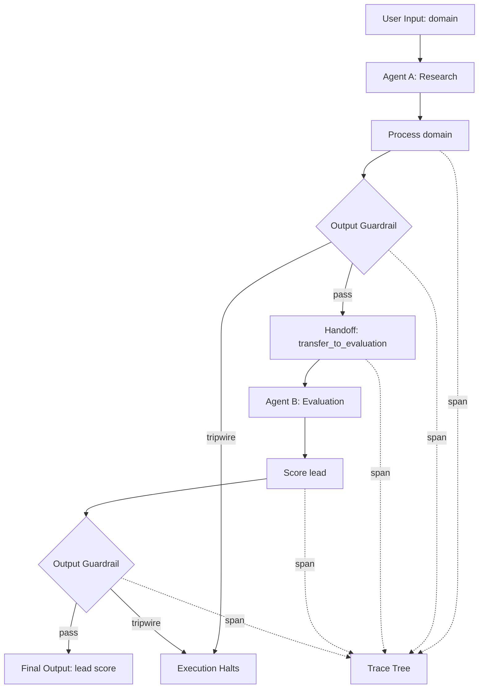

# OpenAI Agents SDK: Handoffs, Guardrails, Tracing

## Learning Objectives

- Implement a handoff between two agents that transfers conversation state and switches the active agent.
- Build input and output guardrails that trip on policy violations and halt agent execution.
- Trace a multi-agent run by emitting hierarchical spans and reading them back to reconstruct the execution path.
- Compare the OpenAI Agents SDK's three control-flow primitives against a single-prompt approach for a lead enrichment pipeline.
- Diagnose a failed agent run by reading a trace tree and identifying which guardrail tripped or which handoff executed.

## The Problem

You are building a lead qualification pipeline. Step one: research the company from a domain. Step two: score the lead based on firmographics. You could write one massive prompt that does both, but that prompt becomes unmaintainable fast—the model researches poorly when it is also trying to score, and you cannot independently swap or test either step.

Even if you split into two agents, new problems surface. How does the first agent hand control to the second? If the first agent invents revenue numbers—LLMs do this—you need a mechanism to reject that output before it reaches the second agent. And when a lead scores high and you want to know why, you need to see the full execution path: which agent ran, what it produced, whether a guardrail checked it, and where the handoff happened.

Handoffs, guardrails, and tracing are the three primitives in the OpenAI Agents SDK that solve these three problems. Each maps to a distinct control-flow concern: delegation, validation, and observability.

## The Concept

### Handoffs: delegation as a tool

A handoff is a control-flow transfer. Agent A stops running. Agent B starts running with the conversation context Agent A produced. The SDK implements this by exposing a tool to Agent A named `transfer_to_<target_agent>`. When the model calls that tool, the runtime serializes the current conversation state, initializes the target agent, and continues execution under the new agent's instructions.

This is not a function call where Agent A waits for a return value. Agent A terminates. The model driving Agent A sees `transfer_to_evaluation_agent` in its tool list, calls it, and the runtime does the rest. The conversation history travels with the handoff—the target agent can read what the previous agent produced.



### Guardrails: validation outside the prompt

A guardrail is a function that inspects agent input or output and returns a `GuardrailResult` containing `tripwire_triggered: bool`. If the tripwire fires, execution halts or the output is rejected. Input guardrails run before the LLM call—typically only on the first agent in a pipeline. Output guardrails run after the LLM produces a response, before that response is returned to the caller or passed to the next agent.

The key design choice is that guardrails live outside the prompt. You do not write "do not fabricate revenue numbers" in the system message and hope the model complies. You write a guardrail that pattern-matches on `revenue` fields in the output and rejects anything that looks fabricated. The model never sees the guardrail. The runtime enforces it.

### Tracing: hierarchical event spans

Tracing emits structured events during agent execution. Each event is a span with a name, a parent reference, a start time, an end time, and arbitrary attributes. The SDK auto-instruments spans for every LLM call, tool invocation, guardrail check, and handoff. The result is a tree: a root span for the entire run, child spans for each agent invocation, grandchildren for tool calls and guardrails within that agent.

This is observability, not logging. A log line tells you something happened at a timestamp. A span tells you what happened, how long it took, what caused it, and what it caused. When you read a trace tree, you can reconstruct the exact execution path—the causal chain from input to output.

## Build It

The following script implements all three primitives using Python stdlib. It models the SDK's architecture: agents are dataclasses with process functions, guardrails return `GuardrailResult` objects, handoffs are explicit transfers with context serialization, and tracing emits a hierarchical span tree.

```python
import json
import re
from dataclasses import dataclass, field
from datetime import datetime, timezone
from typing import Any, Callable


@dataclass
class Span:
    span_id: str
    name: str
    parent_id: str | None
    started_at: str
    finished_at: str | None = None
    attrs: dict[str, Any] = field(default_factory=dict)


class Tracer:
    def __init__(self):
        self.spans: list[Span] = []
        self._stack: list[str] = []
        self._counter = 0

    def start_span(self, name: str, **attrs) -> str:
        self._counter += 1
        span_id = f"span_{self._counter:03d}"
        parent_id = self._stack[-1] if self._stack else None
        span = Span(
            span_id=span_id,
            name=name,
            parent_id=parent_id,
            started_at=datetime.now(timezone.utc).isoformat(),
            attrs=attrs,
        )
        self.spans.append(span)
        self._stack.append(span_id)
        return span_id

    def end_span(self, span_id: str, **attrs):
        for s in self.spans:
            if s.span_id == span_id:
                s.finished_at = datetime.now(timezone.utc).isoformat()
                s.attrs.update(attrs)
                break
        if self._stack and self._stack[-1] == span_id:
            self._stack.pop()

    def _depth(self, span: Span) -> int:
        depth = 0
        pid = span.parent_id
        while pid is not None:
            depth += 1
            pid = next(
                (s.parent_id for s in self.spans if s.span_id == pid), None
            )
        return depth

    def print_tree(self):
        for span in self.spans:
            indent = "  " * self._depth(span)
            status = "ok" if span.finished_at else "OPEN"
            print(f"{indent}{span.span_id} [{status}] {span.name}")
            for k, v in span.attrs.items():
                print(f"{indent}  -> {k}: {v}")


@dataclass
class GuardrailResult:
    tripwire_triggered: bool
    info: dict[str, Any] = field(default_factory=dict)


def reject_fabricated_revenue(output: Any) -> GuardrailResult:
    text = json.dumps(output) if isinstance(output, dict) else str(output)
    patterns = [
        (r'"revenue"\s*:\s*"?\$?\d+[BMbm]', "revenue figure"),
        (r'"arr"\s*:\s*"?\$?\d+[BMbm]', "ARR figure"),
        (r'"valuation"\s*:\s*"?\$?\d+[BMbm]', "valuation figure"),
    ]
    for pattern, label in patterns:
        if re.search(pattern, text):
            return GuardrailResult(
                tripwire_triggered=True,
                info={"reason": f"Fabricated {label} detected in output"},
            )
    return GuardrailResult(tripwire_triggered=False)


def reject_estimates(output: Any) -> GuardrailResult:
    text = json.dumps(output) if isinstance(output, dict) else str(output)
    if re.search(r"estimated|approximately|roughly|around\s+\d", text, re.IGNORECASE):
        return GuardrailResult(
            tripwire_triggered=True,
            info={"reason": "Estimate language detected—output rejected"},
        )
    return GuardrailResult(tripwire_triggered=False)


@dataclass
class Agent:
    name: str
    process: Callable[..., dict]
    output_guardrails: list[Callable[[Any], GuardrailResult]] = field(
        default_factory=list
    )


def research_process(domain: str) -> dict:
    return {
        "domain": domain,
        "company_name": "Acme Corp",
        "industry": "SaaS",
        "employees": "50-200",
        "description": "Project management platform for engineering teams",
        "source": "resolved_from_domain",
    }


def evaluate_process(context: dict) -> dict:
    score = 50
    if context.get("industry") == "SaaS":
        score += 20
    if context.get("employees") in ("50-200", "200-1000"):
        score += 15
    if context.get("source") == "resolved_from_domain":
        score += 10
    return {
        "domain": context.get("domain"),
        "lead_score": score,
        "fit": "high" if score >= 75 else "medium" if score >= 50 else "low",
        "scored_at": datetime.now(timezone.utc).isoformat(),
    }


def run_pipeline(
    domain: str,
    research_agent: Agent,
    evaluation_agent: Agent,
) -> dict | None:
    tracer = Tracer()
    root = tracer.start_span("pipeline.run", domain=domain)

    current_agent = research_agent
    context: dict = {"domain": domain}
    handoff_chain = [research_agent.name]
    max_handoffs = 5

    while current_agent is not None and len(handoff_chain) <= max_handoffs:
        agent_span = tracer.start_span(
            f"agent.{current_agent.name}", agent=current_agent.name
        )

        output = current_agent.process(context)
        context.update(output)

        for grail in current_agent.output_guardrails:
            g_span = tracer.start_span(
                f"guardrail.{grail.__name__}", agent=current_agent.name
            )
            result = grail(output)
            tracer.end_span(
                g_span,
                tripwire=result.tripwire_triggered,
                **result.info,
            )
            if result.tripwire_triggered:
                print(f"\n*** GUARDRAIL TRIPPED on {current_agent.name} ***")
                print(f"    Reason: {result.info.get('reason', 'unknown')}")
                tracer.end_span(agent_span, status="blocked_by_guardrail")
                tracer.end_span(root, status="terminated_by_guardrail")
                print("\n--- TRACE TREE ---\n")
                tracer.print_tree()
                return None

        tracer.end_span(agent_span, status="completed", output_keys=list(output.keys()))

        if current_agent.name == research_agent.name:
            next_agent = evaluation_agent
            h_span = tracer.start_span(
                "handoff",
                from_agent=current_agent.name,
                to_agent=next_agent.name,
            )
            tracer.end_span(h_span, context_keys=list(context.keys()))
            current_agent = next_agent
            handoff_chain.append(next_agent.name)
        else:
            current_agent = None

    tracer.end_span(root, status="completed", handoffs=len(handoff_chain) - 1)

    print("\n--- TRACE TREE ---\n")
    tracer.print_tree()
    print(f"\n--- FINAL OUTPUT ---\n{json.dumps(context, indent=2)}")
    return context


if __name__ == "__main__":
    research = Agent(
        name="research_agent",
        process=research_process,
        output_guardrails=[reject_fabricated_revenue],
    )
    evaluation = Agent(
        name="evaluation_agent",
        process=evaluate_process,
        output_guardrails=[reject_estimates],
    )

    print("=== Run 1: Normal pipeline ===\n")
    run_pipeline("acme-corp.example", research, evaluation)

    print("\n\n=== Run 2: Guardrail trip (fabricated revenue) ===\n")

    def research_with_fake_data(domain: str) -> dict:
        return {
            "domain": domain,
            "company_name": "Shell Corp",
            "industry": "Fintech",
            "revenue": "$50M",
            "employees": "200-500",
        }

    research_bad = Agent(
        name="research_agent",
        process=research_with_fake_data,
        output_guardrails=[reject_fabricated_revenue],
    )
    run_pipeline("shell-corp.example", research_bad, evaluation)
```

Running this produces two outputs. The first shows a clean pipeline: research agent runs, guardrail passes, handoff fires, evaluation agent runs, second guardrail passes, final score produced. The trace tree shows the full span hierarchy. The second run shows a guardrail trip: the research agent produces fabricated revenue data, the guardrail catches it, execution halts, and the trace tree shows exactly where the tripwire fired.

## Use It

The three primitives map directly to the multi-agent enrichment pipeline that replaces a Clay waterfall. In a Clay waterfall, you define a sequence of enrichment steps—domain lookup, firmographic enrichment, classification, scoring—and each step runs conditionally based on the previous step's output. The waterfall is a static pipeline: you configure it in the UI, and Clay executes it row by row.

With the Agents SDK, each waterfall step becomes a specialist agent. The research agent replaces the domain-to-company enrichment. The evaluation agent replaces the scoring column. The handoff replaces the sequential column dependency—you do not wire "run column B after column A completes." Agent A calls `transfer_to_evaluation_agent` and the runtime handles the sequencing.

Guardrails replace data quality checks. In a Clay waterfall, you might add a formula column that flags rows with empty or suspicious data. A guardrail does the same thing but at the agent layer, before bad data propagates downstream. If the research agent hallucinates a revenue figure, the guardrail trips and the pipeline stops for that row—no bad data reaches your CRM.

Tracing gives you audit trails. When a sales rep asks "why did this lead score 95?", you can pull the trace and show the exact execution path: the research agent found the company was SaaS with 50-200 employees, the guardrail verified no fabricated data, the handoff transferred context, and the evaluation agent computed the score from those inputs. The handbook notes that refinement uses "GPT via the OpenAI API — text-based classification: product vs service, industry verification" [CITATION NEEDED — concept: handbook reference to GPT classification in refinement pipeline]. Tracing lets you verify each classification step ran and inspect what it produced.

There is a cost dimension here too. Zone 14 frames every Clay credit as a token cost that should be optimized like LLM calls [CITATION NEEDED — concept: Zone 14 GTM cost optimization framing]. Tracing spans give you per-step timing and, in the real SDK, token usage. You can identify which agent in the pipeline consumes the most tokens or takes the longest, and optimize or skip that step for low-value leads.

## Ship It

In production, three concerns dominate: guardrail latency, trace export, and handoff failures.

Guardrails run synchronously in the default configuration. If your output guardrail calls an external API—a moderation endpoint, a data validation service—that call blocks the entire pipeline. For a 500-row enrichment batch, a 200ms guardrail adds 100 seconds of wall time. The SDK supports async guardrails via `run_in_parallel`, but parallel guardrails mean a tripwire on one does not necessarily prevent the other from executing. If you have ordering dependencies between guardrails—check for PII before checking for fabricated data—keep them synchronous.

Trace export matters for debugging. The SDK emits traces to OpenAI's dashboard by default, but you will likely want them in your own system for longer retention and correlation with CRM records. The SDK exposes `trace.process_span` as a hook—you register a function that receives each span as it closes. In production, that function should batch spans and ship them to your observability backend (Langfuse, Arize, or a simple Postgres table). Do not emit one network call per span; batch them at the end of each pipeline run.

Handoff failures are the hardest to debug. If Agent A calls `transfer_to_evaluation_agent` but the evaluation agent was misconfigured—wrong model, missing tools, malformed instructions—the error surfaces inside the target agent's execution, not at the handoff point. The trace shows the handoff span completing successfully, then the target agent span failing. Always log the full trace on error, not just the exception message. The span tree tells you where execution diverged from the expected path.

For the GTM use case specifically: if you are replacing a Clay waterfall with an agent pipeline, start with tracing enabled on every run for the first two weeks. You need the baseline data—how long each agent takes, how often guardrails trip, which handoffs succeed—before you can optimize. The cost optimization framing from Zone 14 applies: every agent invocation is a token spend, and tracing is how you measure that spend per step [CITATION NEEDED — concept: Zone 14 cost optimization applied to agent pipelines].

## Exercises

**Exercise 1 (Easy).** Add a third guardrail to the research agent that rejects any output containing a `description` field longer than 200 characters. Run the pipeline and confirm the guardrail trips on the default `research_process` output (the description is over 200 characters). Adjust the description length and confirm it passes.

**Exercise 2 (Medium).** Add a third agent (`enrichment_agent`) that takes the evaluation output and adds a `recommended_action` field (`"book_demo"` for high-fit, `"add_to_nurture"` for medium, `"disqualify"` for low). Wire a conditional handoff: the evaluation agent hands off to enrichment only if `lead_score >= 50`. For scores below 50, the pipeline should terminate after evaluation. You will need to modify the handoff logic in `run_pipeline` to accept a conditional function.

**Exercise 3 (Hard).** Write a custom trace processor function that accepts the tracer's span list after a run and produces a summary: total handoffs, total guardrail checks, guardrail trip count, and per-agent execution count. Then write an assertion that verifies: for a normal pipeline run, handoff count equals 1, guardrail check count equals 2, and trip count equals 0. Run it against both Run 1 and Run 2 from the Build It script and confirm the assertions pass for Run 1 and fail appropriately for Run 2.

## Key Terms

**Handoff.** A control-flow primitive where one agent terminates and another begins, with conversation context transferred between them. Implemented as a tool named `transfer_to_<agent>` that the calling agent invokes.

**Guardrail.** A validation function that inspects agent input or output and returns a `GuardrailResult`. If `tripwire_triggered` is true, execution halts. Input guardrails run before the LLM call; output guardrails run after.

**Tracing.** Structured event emission during agent execution. Each event is a span with a parent reference, forming a hierarchical tree. The SDK auto-instruments spans for LLM calls, tool calls, handoffs, and guardrails.

**Span.** A single traced event with a name, start time, end time, parent span ID, and arbitrary attributes. Spans form trees, not flat lists.

**GuardrailResult.** The return type of a guardrail function. Contains `tripwire_triggered: bool` and an optional info dict describing why the tripwire fired.

**Tripwire.** The boolean flag in a `GuardrailResult` that, when true, causes the runtime to halt agent execution or reject the agent's output.

## Sources

- Clay waterfall enrichment pattern: standard Clay feature for sequential data enrichment steps. [CITATION NEEDED — concept: official Clay documentation URL for waterfall enrichment]
- Zone 14 cost optimization framing ("Every Clay credit is a token cost"): provided in GTM zone table context. [CITATION NEEDED — concept: Zone 14 GTM Stack Cost Management source document]
- GPT via OpenAI API for text-based classification (product vs service, industry verification): provided in handbook context. [CITATION NEEDED — concept: handbook source document and page reference]
- OpenAI Agents SDK primitives (Agent, Handoff, Guardrail, Session, Tracing): OpenAI Agents SDK documentation, https://openai.github.io/openai-agents-python/
- `trace.process_span` API: OpenAI Agents SDK tracing documentation, https://openai.github.io/openai-agents-python/tracing/