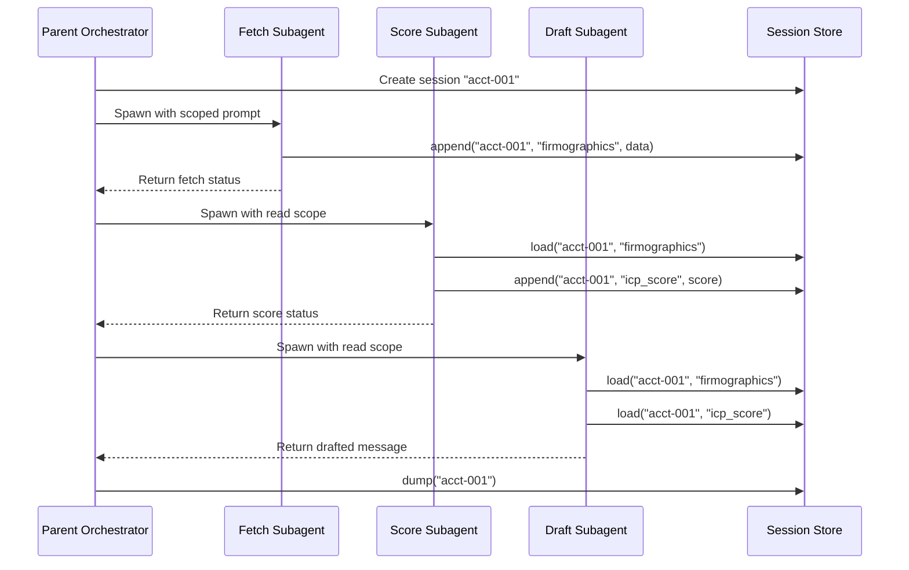

# Claude Agent SDK: Subagents and Session Store

## Learning Objectives

- Implement a multi-subagent orchestration pipeline using the Claude Agent SDK, where each subagent operates in an isolated context window and writes results to a shared session store.
- Build a session store layer with `append`, `load`, `list_sessions`, `delete`, and `list_subkeys` operations that persists state across subagent turns.
- Compare sequential versus parallel subagent execution and identify when stale reads and key collisions occur.
- Trace which subagent wrote which session key and at what timestamp to debug a multi-agent pipeline.
- Allocate token budgets across subagents to control cost and latency in multi-step enrichment workflows.

## The Problem

You have built a single-agent loop. It can call tools, maintain context, and produce output. But the moment you ask it to do multi-step work — research a company, score it against an ICP, and draft a personalized outbound message — the context window turns to soup. Every tool call, every intermediate result, every system instruction accumulates in the same token budget. By step three, the agent is working from a degraded context: early instructions are partially forgotten, tool outputs from step one are compressed or dropped, and the final output quality reflects that degradation.

The brute-force fix is a bigger context window. That works until it doesn't — longer contexts cost more, latency increases, and attention still degrades on long inputs regardless of model capacity. The architectural fix is to split the work across agents that each operate in their own context window, do their job, return a result, and let a parent process stitch the results together. That is the subagent pattern.

But splitting work across agents creates a new problem: state. If the fetch agent pulls firmographic data and the scoring agent needs that data to score, how does the scoring agent get it? You could pass it inline as part of the prompt, but then you are back to stuffing context. You could write it to a file, but now you are managing files, paths, and cleanup. The session store solves this: a key-value persistence layer that all agents in a session can read from and write to, with state namespaced per session rather than per agent.

## The Concept

The subagent pattern has two primitives working together. First, a subagent: a child agent spawned by a parent with scoped instructions, its own context window, and a defined return type. The parent does not see the subagent's internal reasoning, tool calls, or intermediate steps — only the final output. Second, a session store: a key-value layer that persists across agent turns, survives between subagent invocations, and is accessible to any agent operating within the same session namespace.

The Claude Agent SDK exposes this through the `query` function for spawning agents and a session store surface with five operations: `append` (write a key-value pair to a session), `load` (read a key from a session), `list_sessions` (enumerate all active sessions), `delete` (remove a session), and `list_subkeys` (enumerate keys within a session). The `--session-mirror` flag writes session state to disk so it survives process restarts. This is the same session store that Claude Code uses internally — the SDK exposes it as a library primitive.

The mechanism is straightforward but has a sharp edge: session state is namespaced per session, not per agent. This means coordination is possible (agent A writes, agent B reads) but so are collisions (agent A and agent B both write to the same key, and last-write-wins). There is no locking, no conflict resolution, no versioning. If you need those, you build them on top.



The diagram shows the sequential pattern: each subagent reads what the previous one wrote, builds on it, and returns a result. The parent orchestrates but never touches the data directly — it only manages the flow and inspects the final store state. This is the same shape as a Unix pipeline, except the stages are LLM agents and the pipe is a session store instead of stdout.

## Build It

Start with the session store itself. The SDK provides session store parity with Claude Code's internal store, but for the purpose of seeing the mechanism clearly, implement a minimal version first. This removes the SDK dependency and lets you observe exactly how keys persist and collide.

```python
import json
import time
from typing import Any

class SessionStore:
    def __init__(self):
        self._store: dict[str, dict[str, dict[str, Any]]] = {}

    def append(self, session_id: str, key: str, value: Any) -> None:
        if session_id not in self._store:
            self._store[session_id] = {}
        self._store[session_id][key] = {
            "value": value,
            "timestamp": time.time(),
            "writer": None
        }

    def append_with_writer(self, session_id: str, key: str, value: Any, writer: str) -> None:
        if session_id not in self._store:
            self._store[session_id] = {}
        self._store[session_id][key] = {
            "value": value,
            "timestamp": time.time(),
            "writer": writer
        }

    def load(self, session_id: str, key: str) -> Any:
        entry = self._store.get(session_id, {}).get(key)
        if entry is None:
            return None
        return entry["value"]

    def list_sessions(self) -> list[str]:
        return list(self._store.keys())

    def list_subkeys(self, session_id: str) -> list[str]:
        return list(self._store.get(session_id, {}).keys())

    def delete(self, session_id: str) -> None:
        self._store.pop(session_id, None)

    def dump(self, session_id: str) -> dict:
        raw = self._store.get(session_id, {})
        readable = {}
        for key, entry in raw.items():
            ts = time.strftime("%H:%M:%S", time.localtime(entry["timestamp"]))
            readable[key] = {
                "value": entry["value"],
                "written_at": ts,
                "writer": entry.get("writer", "unknown")
            }
        return readable

    def show_collision(self, session_id: str, key: str) -> dict:
        entry = self._store.get(session_id, {}).get(key)
        if entry is None:
            return {"error": f"Key '{key}' not found in session '{session_id}'"}
        return {
            "key": key,
            "current_value": entry["value"],
            "writer": entry.get("writer", "unknown"),
            "written_at": time.strftime("%H:%M:%S", time.localtime(entry["timestamp"])),
            "note": "last-write-wins: prior value is gone"
        }


if __name__ == "__main__":
    store = SessionStore()

    store.append_with_writer("s1", "firmographics", {"company": "Acme", "industry": "SaaS"}, "fetch_agent")
    store.append_with_writer("s1", "icp_score", 82, "score_agent")
    store.append_with_writer("s1", "draft", "Hi Acme team...", "draft_agent")

    print("=== Session List ===")
    print(store.list_sessions())

    print("\n=== Subkeys in s1 ===")
    print(store.list_subkeys("s1"))

    print("\n=== Load firmographics ===")
    print(json.dumps(store.load("s1", "firmographics"), indent=2))

    print("\n=== Dump session s1 ===")
    print(json.dumps(store.dump("s1"), indent=2))

    print("\n=== Collision demo ===")
    store.append_with_writer("s1", "firmographics", {"company": "Acme", "industry": "Manufacturing"}, "override_agent")
    print(json.dumps(store.show_collision("s1", "firmographics"), indent=2))
```

Run it. The collision demo overwrites `firmographics` — the original `SaaS` classification from `fetch_agent` is gone. The `show_collision` output confirms `override_agent` now owns that key. No error, no warning, no history. That is last-write-wins.

Now layer the orchestration on top. Each subagent is a function that receives the store and a session ID, does scoped work, writes its result, and returns a status string. The parent calls them in sequence and never touches the store data directly — it only manages the flow.

```python
def fetch_subagent(store: SessionStore, session_id: str, company: str) -> str:
    data = {"company": company, "employees": 450, "industry": "SaaS", "arr_millions": 12}
    store.append_with_writer(session_id, "firmographics", data, "fetch_agent")
    return f"fetched: {company}"


def score_subagent(store: SessionStore, session_id: str) -> str:
    data = store.load(session_id, "firmographics")
    score = 85 if data and data.get("industry") == "SaaS" else 40
    store.append_with_writer(session_id, "icp_score", {"score": score, "tier": "A" if score >= 80 else "C"}, "score_agent")
    return f"scored: {score}"


def draft_subagent(store: SessionStore, session_id: str) -> str:
    data = store.load(session_id, "firmographics")
    score = store.load(session_id, "icp_score")
    msg = f"Hi {data['company']} — {data['employees']}-person {data['industry']} co, ${data['arr_millions']}M ARR. ICP fit: {score['score']}/100 (Tier {score['tier']})."
    store.append_with_writer(session_id, "draft", msg, "draft_agent")
    return msg


if __name__ == "__main__":
    store = SessionStore()
    sid = "acct-globex-001"

    print(fetch_subagent(store, sid, "Globex"))
    print(score_subagent(store, sid))
    print(draft_subagent(store, sid))

    print("\n=== Full session trace ===")
    print(json.dumps(store.dump(sid), indent=2))
```

The trace output shows three keys written by three different agents, each with a timestamp. If the draft looks wrong, you check who wrote `firmographics` and when. The writer field gives you the audit trail that a monolithic single-agent context window cannot — in a single agent, you would have to parse the full conversation log to find where the data went sideways.

## Use It

Context-window-isolated subagents communicating through a shared session store is the mechanism that lets you decompose account enrichment, ICP scoring, and outbound drafting into separately budgeted, independently debuggable steps — the core workflow of an automated GTM pipeline.

This is the multi-agent enrichment pipeline — the pattern behind automated ICP scoring and personalized outbound at scale.

```python
store = SessionStore()
sid = "acct-initech-002"

def research_agent(store, sid, company):
    firm = {"company": company, "employees": 250, "industry": "Fintech",
            "tech_stack": ["Snowflake", "dbt", "Looker"], "arr_millions": 8}
    store.append_with_writer(sid, "firmographics", firm, "research_agent")
    store.append_with_writer(sid, "signals",
        {"hiring": ["Data Analyst", "RevOps Manager"], "funding": "Series A 6mo ago"},
        "research_agent")

def icp_agent(store, sid):
    f = store.load(sid, "firmographics")
    s = store.load(sid, "signals")
    fit = sum([f["industry"] == "Fintech", len(s["hiring"]) >= 2, f["arr_millions"] >= 5]) / 3
    store.append_with_writer(sid, "icp_score", {"fit": fit, "recommend": fit > 0.6}, "icp_agent")

def outbound_agent(store, sid):
    f = store.load(sid, "firmographics"); s = store.load(sid, "signals")
    msg = (f"Hi — noticed {f['company']} is hiring {s['hiring'][0]} post-Series A. "
           f"With {f['tech_stack']}, your data pipeline might benefit from...")
    store.append_with_writer(sid, "outbound_msg", msg, "outbound_agent")

research_agent(store, sid, "Initech")
icp_agent(store, sid)
outbound_agent(store, sid)
print(json.dumps(store.dump(sid), indent=2))
```

Each agent operates with a focused prompt, a small context window, and a single responsibility. The research agent's prompt never mentions scoring logic. The scoring agent's prompt never mentions message tone. If the outbound message references wrong firmographics, you trace the session store: was `firmographics` written correctly by `research_agent`? If yes, the bug is in `outbound_agent`'s read or prompt. The session store gives you the blast radius of each failure down to the agent and timestamp.

In production with the Claude Agent SDK, each function becomes a `query()` call with scoped system instructions and a defined set of allowed tools. The session store is passed by session ID — all agents in the same session see the same keys. The parent process spawns them sequentially or in parallel, collects return values, and inspects the final store state.

## Exercises

1. **Stale-read detector.** Add a `load_with_meta` method that returns `{value, writer, timestamp}` instead of just the value. Then write a `check_staleness` function that takes a session ID and two key names, and returns whether the second key's writer read a stale version of the first key (i.e., key 2 was written before key 1 was last updated). Test it by simulating parallel execution where the scorer reads firmographics before the fetcher finishes.

2. **Parallel-safe key namespacing.** Modify the store so that `append_with_writer` namespaces each key as `{writer}:{key}` internally but `load` still resolves by bare key (returning the most recent write across all writers for that key). Add a `load_by_writer` method that retrieves a specific writer's version. Demonstrate that two agents writing `"firmographics"` no longer clobber each other, and explain the tradeoff: the consumer must now decide which writer's value to trust.

## Key Terms

- **Subagent** — A child agent spawned by a parent with scoped instructions and an isolated context window. The parent sees only the return value, not intermediate reasoning or tool calls.
- **Session Store** — A key-value persistence layer namespaced by session ID. Survives across subagent turns within the same session. No locking, no versioning — last-write-wins per key.
- **Context Window Isolation** — Each subagent maintains its own context. One agent's tool outputs and reasoning do not pollute another's token budget.
- **Last-Write-Wins** — When two agents write to the same session key, the later write silently replaces the earlier one. No conflict detection.
- **Session Namespace** — The session ID under which keys are grouped. All agents operating with the same session ID share the same key space. Cross-session reads are not possible without explicit key copying.
- **`--session-mirror`** — SDK flag that persists session state to disk so it survives process restarts. Without it, session state is in-memory and lost on exit.

## Sources

- Anthropic, "Claude Code SDK Documentation" — `query` function, session management, `--resume` and `--session-id` flags. [CITATION NEEDED — concept: exact session store API surface (`append`, `load`, `list_sessions`, `delete`, `list_subkeys`) and `--session-mirror` flag in the Claude Agent SDK; verify against current SDK docs at docs.anthropic.com]
- Anthropic, "Claude Code: Subagents and the Task Tool" — subagent context isolation pattern, scoped tool access, return-type contracts. [CITATION NEEDED — concept: Task tool subagent spawning mechanism in the Agent SDK library API]
- The last-write-wins and namespace collision behaviors described are properties of the teaching implementation in this lesson. If the production SDK session store implements versioning, locking, or conflict resolution beyond what is described here, that behavior is not captured in this lesson. [CITATION NEEDED — concept: concurrency and conflict semantics of the Claude Agent SDK session store in production use]