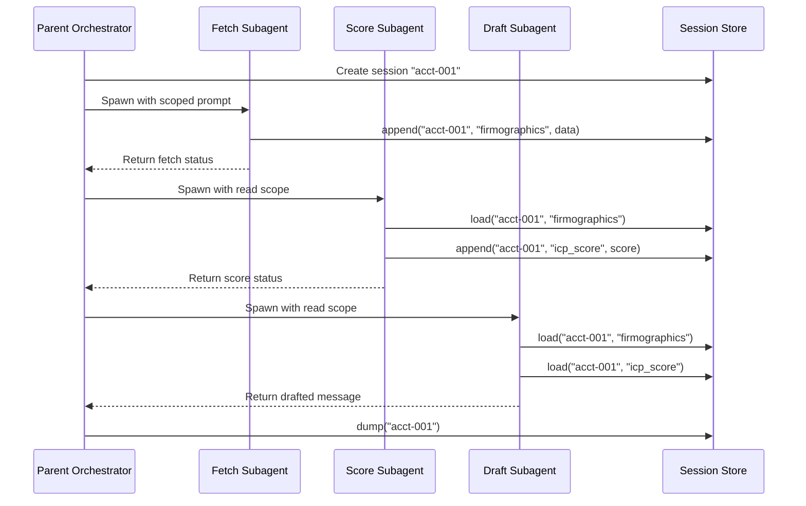

# Claude Agent SDK: Subagents and Session Store

## Learning Objectives

- Implement a multi-subagent orchestration pipeline using the Claude Agent SDK, where each subagent operates in an isolated context window and writes results to a shared session store.
- Build a session store layer with `append`, `load`, `list_sessions`, `delete`, and `list_subkeys` operations that persists state across subagent turns.
- Compare sequential versus parallel subagent execution and identify when stale reads and key collisions occur.
- Trace which subagent wrote which session key and at what timestamp to debug a multi-agent pipeline.
- Allocate token budgets across subagents to control cost and latency in multi-step enrichment workflows.

## The Problem

You have built a single-agent loop. It can call tools, maintain context, and produce output. But the moment you ask it to do multi-step work — research a company, score it against an ICP, and draft a personalized outbound message — the context window turns to soup. Every tool call, every intermediate result, every system instruction accumulates in the same token budget. By step three, the agent is working from a degraded context: early instructions are partially forgotten, tool outputs from step one are compressed or dropped, and the final output quality reflects that degradation.

The brute-force fix is a bigger context window. That works until it doesn't — longer contexts cost more, latency increases, and attention still degrades on long inputs regardless of model capacity. The architectural fix is to split the work across agents that each operate in their own context window, do their job, return a result, and let a parent process stitch the results together. That is the subagent pattern.

But splitting work across agents creates a new problem: state. If the fetch agent pulls firmographic data and the scoring agent needs that data to score, how does the scoring agent get it? You could pass it inline as part of the prompt, but then you are back to stuffing context. You could write it to a file, but now you are managing files, paths, and cleanup. The session store solves this: a key-value persistence layer that all agents in a session can read from and write to, with state namespaced per session rather than per agent.

## The Concept

The subagent pattern has two primitives working together. First, a subagent: a child agent spawned by a parent with scoped instructions, its own context window, and a defined return type. The parent does not see the subagent's internal reasoning, tool calls, or intermediate steps — only the final output. Second, a session store: a key-value layer that persists across agent turns, survives between subagent invocations, and is accessible to any agent operating within the same session namespace.

The Claude Agent SDK exposes this through the `query` function for spawning agents and a session store surface with five operations: `append` (write a key-value pair to a session), `load` (read a key from a session), `list_sessions` (enumerate all active sessions), `delete` (remove a session), and `list_subkeys` (enumerate keys within a session). The `--session-mirror` flag writes session state to disk so it survives process restarts. This is the same session store that Claude Code uses internally — the SDK exposes it as a library primitive.

The mechanism is straightforward but has a sharp edge: session state is namespaced per session, not per agent. This means coordination is possible (agent A writes, agent B reads) but so are collisions (agent A and agent B both write to the same key, and last-write-wins). There is no locking, no conflict resolution, no versioning. If you need those, you build them on top.



The diagram shows the sequential pattern: each subagent reads what the previous one wrote, builds on it, and returns a result. The parent orchestrates but never touches the data directly — it only manages the flow and inspects the final store state. This is the same shape as a Unix pipeline, except the stages are LLM agents and the pipe is a session store instead of stdout.

## Build It

Start with the session store itself. The SDK provides session store parity with Claude Code's internal store, but for the purpose of seeing the mechanism clearly, implement a minimal version first. This removes the SDK dependency and lets you observe exactly how keys persist and collide.

```python
import json
import time
from typing import Any

class SessionStore:
    def __init__(self):
        self._store: dict[str, dict[str, dict[str, Any]]] = {}

    def append(self, session_id: str, key: str, value: Any) -> None:
        if session_id not in self._store:
            self._store[session_id] = {}
        self._store[session_id][key] = {
            "value": value,
            "timestamp": time.time(),
            "writer": None
        }

    def append_with_writer(self, session_id: str, key: str, value: Any, writer: str) -> None:
        if session_id not in self._store:
            self._store[session_id] = {}
        self._store[session_id][key] = {
            "value": value,
            "timestamp": time.time(),
            "writer": writer
        }

    def load(self, session_id: str, key: str) -> Any:
        entry = self._store.get(session_id, {}).get(key)
        if entry is None:
            return None
        return entry["value"]

    def list_sessions(self) -> list[str]:
        return list(self._store.keys())

    def list_subkeys(self, session_id: str) -> list[str]:
        return list(self._store.get(session_id, {}).keys())

    def delete(self, session_id: str) -> None:
        self._store.pop(session_id, None)

    def dump(self, session_id: str) -> dict:
        raw = self._store.get(session_id, {})
        readable = {}
        for key, entry in raw.items():
            ts = time.strftime("%H:%M:%S", time.localtime(entry["timestamp"]))
            readable[key] = {
                "value": entry["value"],
                "written_at": ts,
                "writer": entry.get("writer", "unknown")
            }
        return readable

    def show_collision(self, session_id: str, key: str) -> dict:
        entry = self._store.get(session_id, {}).get(key)
        if entry is None:
            return {"error": f"Key '{key}' not found in session '{session_id}'"}
        return {
            "key": key,
            "current_value": entry["value"],
            "writer": entry.get("writer", "unknown"),
            "written_at": time.strftime("%H:%M:%S", time.localtime(entry["timestamp"])),
            "note": "last-write-wins: prior value is gone"
        }


if __name__ == "__main__":
    store = SessionStore()

    store.append_with_writer("s1", "firmographics", {"company": "Acme", "industry": "SaaS"}, "fetch_agent")
    store.append_with_writer("s1", "icp_score", 82, "score_agent")
    store.append_with_writer("s1", "draft", "Hi Acme team...", "draft_agent")

    print("=== Session List ===")
    print(store.list_sessions())

    print("\n=== Subkeys in s1 ===")
    print(store.list_subkeys("s1"))

    print("\n=== Load firmographics ===")
    print(json.dumps(store.load("s