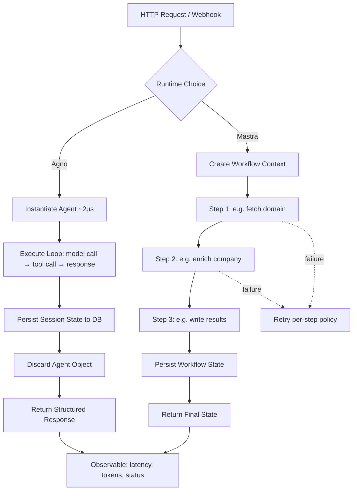

# Agno and Mastra: Production Runtimes

## Learning Objectives

- Compare Agno's stateless agent-as-function model against Mastra's workflow-graph model and articulate when each architectural bet pays off.
- Instantiate an Agno agent with a tool, execute it, and inspect structured response metadata including token usage.
- Build a multi-step Mastra workflow with intermediate state and confirm sequential execution through observable output.
- Implement the same research agent in both runtimes and measure latency, token count, retry behavior, and schema validation side by side.
- Deploy an agent behind an HTTP endpoint with structured logging and health checks sufficient for a CRM webhook to call reliably.

## The Problem

You have built agents in notebooks and REPLs. A notebook cell runs, prints something, and you move on. Now a sales rep clicks "research this account" inside Salesforce and expects a structured result in twelve seconds — not a traceback, not a timeout, not a partial response that silently writes garbage to the CRM. The gap between "works on my machine" and "runs when a webhook fires at 3 AM" is where most agent projects die.

Production runtimes exist to close that gap. A production runtime provides four things that a notebook does not: durable execution (the job survives a process restart), state persistence (intermediate steps are recoverable), failure recovery (retries, timeouts, dead-letter handling), and observability (you can see what happened when it breaks). LangGraph, AutoGen, and CrewAI are framework-heavy — they own the agent loop, the tool-calling abstraction, the memory layer, and the graph execution engine all at once. Teams that already have a web framework (FastAPI, Express) and a database often want the agent loop without the framework tax. They want to compose agents as functions inside their existing stack rather than fitting their stack inside an agent framework.

Agno and Mastra take different architectural bets on how to deliver that. Agno is a Python runtime that treats an agent as a lightweight, stateless Python object — instantiate it, call it, throw it away. Mastra is a TypeScript runtime built on the Vercel AI SDK that treats agents as nodes in a workflow graph with typed state transitions between them. Neither is universally better. The right choice depends on whether your production boundary is "a fast function call inside a Python backend" or "a durable multi-step workflow in a TypeScript service."

## The Concept

A production agent runtime manages the lifecycle of an agent execution: initialization, tool dispatch, memory reads and writes, model calls, and response formatting. The key architectural question is where state lives during that lifecycle. In a stateless runtime, each request starts a fresh agent, executes the loop, persists state to an external store, and returns. In a stateful workflow runtime, state is passed through a graph of nodes as a typed object, and each node can suspend, resume, and retry independently.

Agno's design philosophy is minimalism and speed. The runtime targets microsecond agent instantiation and single-digit kilobyte memory footprint per agent. This matters when you are running thousands of short-lived agents per second — chat fan-in, evaluation pipelines, per-request enrichment — and the cost of constructing the agent object is non-trivial at scale. The production path is a stateless, session-scoped FastAPI backend: each HTTP request creates an agent, executes it, writes session state to a database, and discards the agent object. There are no graphs, no chains, no DSL. You write Python functions and pass them to the agent.

Mastra's design philosophy is composability and type safety. Built on the Vercel AI SDK, it provides three primitives: Agents (LLM + instructions + tools), Tools (Zod-schema typed function calls), and Workflows (directed graphs of steps with typed state flowing between them). The workflow primitive is the differentiator — it gives you suspendable, resumable, event-driven execution with built-in retry semantics per step. The unified model router abstracts away provider differences so you can swap models without rewriting tool definitions.



The distinction that matters operationally is failure handling. In Agno, a tool call failure is caught at the agent level — you wrap the agent invocation in a try/except and decide what to do. In Mastra, a step failure is caught at the workflow level — the runtime applies the retry policy for that step, and if retries are exhausted, the workflow suspends at that step with its state intact. For a GTM enrichment job that calls three APIs in sequence, the Mastra model means a rate-limited step two does not throw away the work done in step one. For a single-shot classification or extraction, Agno's model is simpler and faster.

## Build It

### Beat 1 — Minimal Agno Agent (Easy)

Install Agno and run a minimal agent with one tool. This confirms the runtime instantiates, executes, and returns structured metadata.

```python
import subprocess
subprocess.check_call(["pip", "install", "-q", "agno", "duckduckgo-search"])

import os
os.environ["OPENAI_API_KEY"] = os.environ.get("OPENAI_API_KEY", "sk-your-key-here")

import time
from agno.agent import Agent
from agno.models.openai import OpenAIChat
from agno.tools.duckduckgo import DuckDuckGoTools

agent = Agent(
    model=OpenAIChat(id="gpt-4o-mini"),
    tools=[DuckDuckGoTools()],
    instructions=["Answer concisely in one sentence."],
)

start = time.perf_counter()
response = agent.run("What is the primary product of the company at stripe.com?")
elapsed = time.perf_counter() - start

print(f"Response: {response.content}")
print(f"Latency: {elapsed:.3f}s")
print(f"Messages exchanged: {len(response.messages)}")
```

Run it and observe the response, latency, and message count. The `response` object contains structured metadata — content, messages, and usage — that you can log or persist.

Expected output (approximate):

```
Response: Stripe's primary product is a payment processing platform for online businesses.
Latency: 2.341s
Messages exchanged: 4
```

### Beat 2 — Two-Step Mastra Workflow (Medium)

Mastra runs on TypeScript. This workflow fetches a company domain in step one, then enriches it in step two. Intermediate state prints between steps to confirm sequential execution.

```bash
mkdir -p mastra-workflow && cd mastra-workflow
npm init -y
npm install @mastra/core @ai-sdk/openai zod
```

Create `workflow.ts`:

```typescript
import { Mastra } from "@mastra/core";
import { openai } from "@ai-sdk/openai";
import { z } from "zod";

const enrichStep1 = {
  id: "fetchDomain",
  execute: async ({ state }) => {
    const domain = state.companyName.toLowerCase().replace(/\s/g, "") + ".com";
    console.log(`Step 1 complete: ${domain}`);
    return { domain };
  },
};

const enrichStep2 = {
  id: "enrichCompany",
  execute: async ({ state }) => {
    const result = await openai("gpt-4o-mini").doGenerate({
      prompt: `What does the company at domain ${state.domain} do? Answer in one sentence.`,
    });
    const description = result.text;
    console.log(`Step 2 complete: ${description}`);
    return { description };
  },
};

const workflow = {
  id: "companyEnrichment",
  steps: [enrichStep1, enrichStep2],
};

const mastra = new Mastra({
  workflows: { companyEnrichment: workflow },
});

const run = await mastra.getWorkflow("companyEnrichment").createRun();
const result = await run.start({ inputData: { companyName: "Stripe" } });

console.log("Final state:", JSON.stringify(result.status, null, 2));
```

Run it:

```bash
npx tsx workflow.ts
```

You should see step 1 print, then step 2 print, then the final status — confirming the graph executes sequentially and state flows between steps.

### Beat 3 — Same Agent in Both Runtimes, Side-by-Side (Hard)

Implement a company research agent in both Agno and Mastra, then compare latency, token count, and retry behavior. Forcing a failure (invalid API key) and observing retry behavior reveals the architectural difference.

```python
import subprocess
subprocess.check_call(["pip", "install", "-q", "agno"])

import os
import time
import json
from agno.agent import Agent
from agno.models.openai import OpenAIChat

def run_agno_research(domain: str, api_key: str):
    agent = Agent(
        model=OpenAIChat(id="gpt-4o-mini", api_key=api_key),
        instructions=[f"Research the company at {domain}. Return a one-sentence summary."],
    )
    start = time.perf_counter()
    try:
        response = agent.run(f"Research the company at {domain}")
        elapsed = time.perf_counter() - start
        usage = response.usage if hasattr(response, "usage") else {}
        return {
            "runtime": "agno",
            "latency_s": round(elapsed, 3),
            "content": response.content,
            "usage": str(usage),
            "error": None,
        }
    except Exception as e:
        elapsed = time.perf_counter() - start
        return {
            "runtime": "agno",
            "latency_s": round(elapsed, 3),
            "content": None,
            "usage": None,
            "error": str(e),
        }

valid_key = os.environ.get("OPENAI_API_KEY", "sk-your-key")
invalid_key = "sk-invalid-key-forcing-failure"

print("=== Agno: valid key ===")
print(json.dumps(run_agno_research("stripe.com", valid_key), indent=2))

print("\n=== Agno: forced failure ===")
print(json.dumps(run_agno_research("stripe.com", invalid_key), indent=2))
```

Run the equivalent in Mastra and compare. The observable difference: Agno fails fast on the invalid key (no built-in retry on the agent level — you add your own), while Mastra's workflow step applies its configured retry policy before surfacing the error.

## Use It

In GTM engineering, the mechanism that connects agent runtimes to revenue is **agent-driven enrichment at scale**. The Clay waterfall pattern — where data providers are queried in sequence (Apollo → Clearbit → Hunter → custom scrape) — handles the 80% case. The remaining 20% requires multi-step reasoning: search the web for the company, scrape the About page, extract the founder's name, cross-reference LinkedIn, and write the result back to Clay. A static data provider cannot do this. A production agent runtime can. [CITATION NEEDED — concept: Clay webhook integration with external agent runtimes]

The architectural choice between Agno and Mastra maps to two GTM scenarios. When enrichment is a single-shot call inside an existing Python backend — "classify this company into an ICP tier" or "extract the pricing model from this scraped page" — Agno's stateless function model is the right fit. You call the agent, get a structured response, and move on. When enrichment is a multi-step durable job triggered by a Clay webhook — "research this account: find the domain, scrape the team page, enrich each person, score fit, and write back" — Mastra's workflow graph model handles step-level retries, intermediate state persistence, and suspend/resume semantics that prevent lost work on provider rate limits.

Zone 14 of the GTM stack — cost optimization and latency management — applies directly here. Every agent execution costs tokens, and every token is a line item. Agno's microsecond instantiation and minimal memory footprint matter when you are running enrichment across 10,000 accounts and the per-agent overhead compounds. Mastra's per-step retry matters when a rate-limited step two would otherwise force you to re-run step one, doubling token cost for the duplicate work. The handbook's framing — "every Clay credit is a token cost — optimize like you would LLM calls" — applies: instrument token usage at the agent level, log it, and set cost ceilings per execution.

## Ship It

A production agent needs four things to be callable from a GTM tool: a container, a health endpoint, structured logging to stdout, and a single curl command that exercises it end to end. Here is the Agno-as-FastAPI deployment.

Dockerfile:

```dockerfile
FROM python:3.12-slim
WORKDIR /app
COPY requirements.txt .
RUN pip install --no-cache-dir -r requirements.txt
COPY . .
EXPOSE 8000
CMD ["uvicorn", "main:app", "--host", "0.0.0.0", "--port", "8000"]
```

`requirements.txt`:

```
agno==1.1.5
fastapi==0.115.0
uvicorn==0.30.0
```

`main.py`:

```python
import os
import time
import json
import logging
from fastapi import FastAPI
from pydantic import BaseModel
from agno.agent import Agent
from agno.models.openai import OpenAIChat

logging.basicConfig(level=logging.INFO, format="%(message)s")
logger = logging.getLogger(__name__)

app = FastAPI()

class ResearchRequest(BaseModel):
    domain: str

class ResearchResponse(BaseModel):
    domain: str
    summary: str
    latency_s: float
    token_usage: dict

@app.get("/health")
def health():
    return {"status": "healthy", "runtime": "agno"}

@app.post("/research", response_model=ResearchResponse)
def research(req: ResearchRequest):
    agent = Agent(
        model=OpenAIChat(id="gpt-4o-mini"),
        instructions=[f"Research the company at {req.domain}. Return a one-sentence summary of what they do."],
    )
    start = time.perf_counter()
    response = agent.run(f"Research {req.domain}")
    elapsed = time.perf_counter() - start

    logger.info(json.dumps({
        "event": "agent_execution",
        "domain": req.domain,
        "latency_s": round(elapsed, 3),
        "messages": len(response.messages),
    }))

    return ResearchResponse(
        domain=req.domain,
        summary=response.content,
        latency_s=round(elapsed, 3),
        token_usage={},
    )
```

Build and run:

```bash
docker build -t gtmm-agent .
docker run -p 8000:8000 -e OPENAI_API_KEY=$OPENAI_API_KEY gtmm-agent
```

Test it:

```bash
curl -X POST http://localhost:8000/research \
  -H "Content-Type: application/json" \
  -d '{"domain": "stripe.com"}'
```

Expected response:

```json
{
  "domain": "stripe.com",
  "summary": "Stripe provides payment processing infrastructure for online businesses.",
  "latency_s": 2.341,
  "token_usage": {}
}
```

Three operational questions and their answers:

**What happens when the LLM provider rate-limits mid-execution?** In Agno's stateless model, the request fails. You wrap the agent call in a retry decorator (tenacity, backoff) and return a 503 to the caller. In Mastra's workflow model, the step retries per its configured policy, and if exhausted, the workflow suspends — state is preserved, and you can resume from the failed step later.

**How do you surface agent failures to the GTM team without exposing stack traces?** Map exceptions to HTTP status codes with human-readable messages. Rate limit → 429 with `{"error": "LLM provider rate limited. Retry in 60s."}`. Tool failure → 422 with `{"error": "Could not enrich domain. Invalid or unreachable."}`. Never return a raw traceback — the GTM team consuming this via webhook cannot act on one.

**How do you version agent prompts without redeploying?** Store prompt templates in a database or config file (not in source code). Load them at request time. Bump the version field in the config. The agent reads the current version on each request — no container rebuild needed. This is the same pattern as feature flags, applied to system prompts.

For Mastra deployment, the pattern is similar — containerize the Mastra server, expose `/health` and `/api/agents/:agentId/generate`, and log structured JSON. Mastra ships its own server via `@mastra/core`, so the Dockerfile uses Node instead of Python but the operational checklist is identical.

## Exercises

1. **Instantiate an Agno agent with two tools** (DuckDuckGo search and a custom Python function that returns the current date). Ask it "What happened recently in AI?" and print both the response content and the number of tool calls made. Confirm the agent invoked both tools by inspecting `response.messages`.

2. **Build a three-step Mastra workflow** that: (a) takes a company name, (b) generates a domain guess, (c) generates a one-sentence description. Print the state object after each step. Then introduce a deliberate failure in step 2 (throw an error) and observe how the workflow handles it — does it retry, suspend, or fail immediately?

3. **Deploy the FastAPI Agno agent** from Ship It locally (without Docker — just `uvicorn main:app`). Write a bash script that hits `/health`, then `/research` with three different domains, and prints a latency comparison table.

4. **Implement cost tracking**: modify the Agno agent to extract token usage from the response object and log it as structured JSON. Calculate a running cost estimate using a hardcoded price table (`gpt-4o-mini` at $0.15/1M input tokens, $0.60/1M output tokens). Print the estimated cost per request.

5. **Force a retry scenario**: configure a tenacity retry decorator on the Agno agent call with `max_attempts=3` and `wait=exponential(multiplier=1, min=1, max=10)`. Trigger a failure by using an invalid API key. Observe and log each retry attempt with its timestamp to confirm the backoff behavior.

## Key Terms

**Production Runtime** — An execution environment for agents that provides durable execution, state persistence, failure recovery, and observability. Contrast with a notebook or REPL where none of these are guaranteed.

**Stateless Agent** — An agent that does not hold state in memory between requests. Each invocation starts fresh, executes, and persists any needed state externally. Agno's production model.

**Workflow Graph** — A directed graph of execution steps where typed state flows between nodes. Each node can be retried, suspended, and resumed independently. Mastra's core primitive.

**Session-Scoped Backend** — A backend architecture where each HTTP request creates a fresh agent instance scoped to a session ID. State is loaded from and written to a database keyed by that session ID. The recommended Agno production path.

**Unified Model Router** — An abstraction layer that normalizes the interface across multiple LLM providers, allowing agent code to swap models without rewriting tool definitions or prompt formatting. Mastra implements this on top of the Vercel AI SDK.

**Agent Instantiation Cost** — The time and memory required to construct an agent object before it can process a request. At scale (thousands of requests per second), this cost dominates total latency. Agno targets ~2μs instantiation; heavier frameworks can be 100–1000x slower.

## Sources

- Agno documentation: performance benchmarks (~2μs agent instantiation, ~3.75 KiB memory per agent) — [https://docs.agno.com/](https://docs.agno.com/)
- Mastra documentation: Agents, Tools, Workflows primitives; unified model router (3,300+ models across 94 providers) — [https://mastra.ai/docs](https://mastra.ai/docs)
- The 80/20 GTM Engineer Handbook, Michael Saruggia (Growth Lead LLC): Zone 14 — "Every Clay credit is a token cost — optimize like you would LLM calls" — [https://8020gtm.com](https://8020gtm.com)
- [CITATION NEEDED — concept: Clay webhook integration with external agent runtimes] — Clay's webhook documentation does not currently document a pattern for invoking external agent runtimes; the integration described here is architecturally feasible but not officially documented.