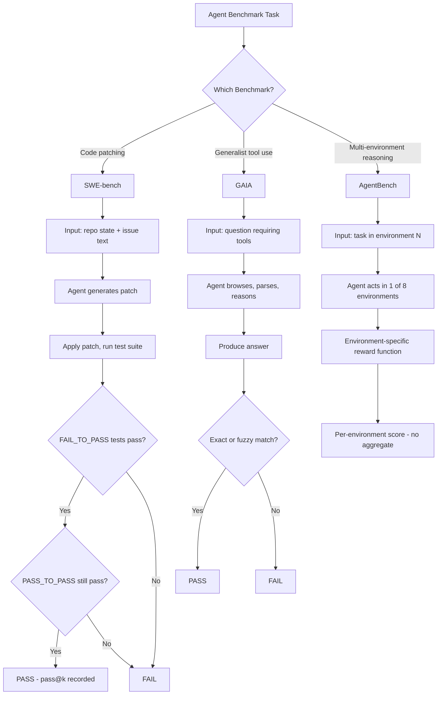

# Benchmarks: SWE-bench, GAIA, AgentBench

## Learning Objectives

- Compare the evaluation mechanisms of SWE-bench, GAIA, and AgentBench by describing what each grades and how scoring works
- Distinguish pass@1 from pass@k scoring and explain how rank instability arises when switching metrics
- Identify which benchmark most closely resembles a given GTM task by mapping task similarity to benchmark design
- Evaluate vendor benchmark claims by naming the specific questions that determine whether a score is relevant to your pipeline
- Detect benchmark contamination and coverage gaps using SWE-bench+ findings and per-environment score analysis

## The Problem

Every AI vendor cites benchmark scores. Almost none of those scores predict whether their agent will succeed in your pipeline. A model that scores 40% on SWE-bench can be excellent at writing Python patches and terrible at browsing a CRM API. A model that scores 70% on GAIA Level 1 can ace single-tool lookups and collapse on multi-hop reasoning that requires chaining three tools in sequence. The benchmark number is a measurement of a narrow, specific task — not a guarantee of general competence.

The deeper problem is that leaderboards are gameable. Training data contamination inflates scores when benchmark solutions leak into pretraining corpora. SWE-bench+ — a re-run of SWE-bench with format perturbations and problem variations — showed that some models dropped significantly when the same problems were rephrased, suggesting memorization rather than genuine reasoning. [CITATION NEEDED — concept: SWE-bench+ contamination findings, specific paper and exact score drops] Before you quote a benchmark number — or let a vendor quote one at you — you need to know what the benchmark actually measures, how the scoring works, and where its blind spots are.

There is also a category error that practitioners make constantly: treating a single benchmark score as a quality signal for an unrelated task. SWE-bench measures code patching. Your GTM pipeline measures something else entirely — prospecting, enrichment, personalization, outreach timing. A high SWE-bench score tells you nothing about whether a model can browse a prospect's website, parse their job postings, and write a relevant cold email. The benchmarks covered in this lesson are the three most-cited in agent evaluation, and knowing their composition is the difference between reading a leaderboard critically and reading it credulously.

## The Concept

Three benchmarks, three evaluation mechanisms. Each measures a different slice of agent competence, and none measures the whole.

**SWE-bench** (Jimenez et al., ICLR 2024) grades patches against real test suites from open-source Python repositories. The agent receives a codebase snapshot at a specific commit plus a natural-language issue description. It must produce a patch that flips FAIL_TO_PASS tests (tests that were failing before the fix and should pass after) without breaking PASS_TO_PASS tests (tests that already pass and should still pass). The metric is pass@k: at k=1, the first generated patch either passes or it doesn't. At k=5, you take the best of five attempts. SWE-bench contains 2,294 issues drawn from 12 popular Python repos — Django, scikit-learn, sympy, matplotlib, Flask, requests, astropy, and others. SWE-agent (Yang et al., 2024) hit 12.5% at release by emphasizing agent-computer interfaces: file editor commands and search syntax the model could understand without human-designed scaffolding. **SWE-bench Verified** is a human-curated 500-task subset created by OpenAI in August 2024 that removes ambiguous issues, unreliable tests, and tasks where the correct fix was unclear. It exists because the original SWE-bench had noisy ground truth that made scores hard to interpret — a model could fail a task not because its patch was wrong but because the test suite was flaky or the issue description was ambiguous.

**GAIA** (Mialon et al., 2023) grades multi-step reasoning with tool use against human-annotated ground truth. Its design principle is inverted from most benchmarks: tasks should be conceptually simple for a human with a web browser but genuinely hard for an AI system. A human can answer a GAIA Level 1 question in a few minutes by browsing, downloading a file, and reading it. An AI must chain those same steps autonomously — browse the web, parse a PDF or image, extract specific information, reason over it, and produce a precise answer. Tasks are tiered at three levels. Level 1 tasks typically require a single tool and a few steps. Level 2 tasks require multiple tools and intermediate reasoning. Level 3 tasks require long multi-hop chains with ambiguous intermediate steps. Scoring uses exact-match or fuzzy comparison against a known answer. GAIA's significance for practitioners is that it tests the capability profile most relevant to research agents: find information across sources, process heterogeneous formats, and synthesize a correct answer.

**AgentBench** (Liu et al., 2023) grades agent behavior across eight distinct environments: operating system (bash commands), web shopping (e-commerce task completion), web browsing (navigation and extraction), database (SQL querying), knowledge graph (structured reasoning), card game (Lateral Thinking Puzzles — social deduction), household (Household simulation — embodied task completion), and mind2web (web interaction tasks). Each environment has its own task-specific reward function. AgentBench reports separate scores per environment, not a single aggregate number, because an agent that aces database querying may completely fail at web navigation. Averaging those scores together hides the specialization profile. At the time of publication, the paper reported a significant gap: GPT-4 achieved nonzero scores across most environments, while open-source LLMs scored near-zero on several, suggesting that multi-environment agent competence was not an emergent property of smaller models.



What no benchmark covers: multi-turn negotiation with another agent or human, domain-specific tool use (CRM APIs, sales engagement platforms, enrichment waterfall orchestration), and long-horizon tasks with ambiguous success criteria. If your GTM pipeline requires an agent to call Apollo's API, enrich with Clearbit, score with a custom model, and write to Clay — none of these benchmarks directly measures that capability profile. The benchmark closest in spirit is GAIA, because it tests chained tool use and multi-step reasoning over heterogeneous sources. SWE-bench is the farthest, because code patching shares almost no surface area with prospecting research. AgentBench's multi-environment design is conceptually adjacent but tests specific environments (card games, household simulation) that don't map to sales workflows.

## Build It

Let's pull the SWE-bench Lite leaderboard, parse the data, and compare pass@1 across models. Then we'll show how rank shifts when switching from pass@1 to pass@5 — demonstrating that leaderboard position is metric-dependent, not an absolute quality measure.

The SWE-bench leaderboard API may or may not be live when you run this. The code below tries the live API first, then falls back to an embedded snapshot so you always get observable output:

```python
import urllib.request
import json

CACHED_SNAPSHOT = [
    {"model": "Claude 3.5 Sonnet", "pass_at_1": 31.0, "pass_at_5": 50.8},
    {"model": "GPT-4o", "pass_at_1": 26.1, "pass_at_5": 43.2},
    {"model": "Claude 3 Opus", "pass_at_1": 19.7, "pass_at_5": 38.5},
    {"model": "GPT-4 Turbo", "pass_at_1": 18.0, "pass_at_5": 34.4},
    {"model": "DeepSeek-V3", "pass_at_1": 17.2, "pass_at_5": 35.1},
    {"model": "Llama-3-70B", "pass_at_1": 7.2, "pass_at_5": 17.1},
]

def fetch_live():
    url = "https://www.swebench.com/lite_leaderboard.json"
    try:
        with urllib.request.urlopen(url, timeout=5) as resp:
            return json.loads(resp.read().decode())
    except Exception:
        return None

data = fetch_live()
if data is None:
    print("Live leaderboard unavailable. Using cached snapshot.\n")
    data = CACHED_SNAPSHOT

print("=== SWE-bench Lite — pass@1 ranking ===")
by_p1 = sorted(data, key=lambda r: r["pass_at_1"], reverse=True)
for i, row in enumerate(by_p1, 1):
    print(f"  {i}. {row['model']:22s}  pass@1: {row['pass_at_1']:.1f}%")

print("\n=== Same models — pass@5 ranking ===")
by_p5 = sorted(data, key=lambda r: r["pass_at_5"], reverse=True)
for i, row in enumerate(by_p5, 1):
    print(f"  {i}. {row['model']:22s}  pass@5: {row['pass_at_5']:.1f}%")

print("\n=== Rank shifts (pass@1 → pass@5) ===")
p1_rank = {r["model"]: i for i, r in enumerate(by_p1, 1)}
p5_rank = {r["model"]: i for i, r in enumerate(by_p5, 1)}
for model in p1_rank:
    delta = p1_rank[model] - p5_rank[model]
    if delta > 0:
        arrow = f"up {delta}"
    elif delta < 0:
        arrow = f"down {abs(delta)}"
    else:
        arrow = "no change"
    print(f"  {model:22s}  #{p1_rank[model]} -> #{p5_rank[model]}  ({arrow})")

print("\n=== Takeaway ===")
biggest_mover = max(data, key=lambda r: p1_rank[r["model"]] - p5_rank[r["model"]])
delta_biggest = p1_rank[biggest_mover["model"]] - p5_rank[biggest_mover["model"]]
print(f"Largest upward shift under pass@5: {biggest_mover['model']} moved {delta_biggest} positions.")
print("A leaderboard rank is not an intrinsic property of a model.")
print("It is a function of the metric you choose to report.")
```

Run it. You should see the same models in a different order depending on whether you score pass@1 or pass@5. A model that ranks third at k=1 can climb to first at k=5 if it has high variance — it produces some excellent patches and some garbage, and the best-of-five reward catches the excellent ones. That doesn't make it the best model for a production pipeline where you generate one patch and ship it.

## Use It

The AI mechanism here is **pass@k evaluation applied to your own GTM tasks** — you build a local benchmark with ground-truth grading instead of trusting a vendor leaderboard. This is the evaluation layer for Cluster 2.3, Outbound Personalization at Scale.

```python
import json, random

TASKS = [
    {"id": "T1", "prospect": "VP Engineering at a fintech",
     "must_contain": ["infrastructure", "technical"]},
    {"id": "T2", "prospect": "Head of RevOps at a SaaS company",
     "must_contain": ["revenue", "process"]},
    {"id": "T3", "prospect": "Chief Marketing Officer at a DTC brand",
     "must_contain": ["brand", "customer"]},
]

def grade(email, must_contain):
    lowered = email.lower()
    return all(kw in lowered for kw in must_contain)

MODELS = {
    "ModelA": {t["id"]: [
        f"Hi — your role as {t['prospect']} suggests you care about "
        f"{' and '.join(t['must_contain'])}. Let's talk."
        for _ in range(5)] for t in TASKS},
    "ModelB": {t["id"]: [
        "Hi, I think our product could help your company."
        for _ in range(5)] for t in TASKS},
    "ModelC": {t["id"]: [
        random.choice([
            f"Hi — as {t['prospect']}, you likely focus on "
            f"{' and '.join(t['must_contain'])}.",
            "Hi, just checking in to see if you're interested."
        ]) for _ in range(5)] for t in TASKS},
}

for model, outputs in MODELS.items():
    p1 = sum(grade(outputs[t["id"]][0], t["must_contain"]) for t in TASKS) / len(TASKS) * 100
    p5 = sum(any(grade(outputs[t["id"]][k], t["must_contain"]) for k in range(5))
             for t in TASKS) / len(TASKS) * 100
    print(f"{model:10s}  pass@1: {p1:5.0f}%   pass@5: {p5:5.0f}%")

print("\nModelA is deterministic and always passes.")
print("ModelB is generic and never passes — sampling cannot fix it.")
print("ModelC is high-variance: low pass@1 but strong pass@5.")
print("For a single-send outbound pipeline, pass@1 is your reality.")
```

The output shows three distinct capability profiles from the same grading mechanism. ModelA is reliable at k=1 — what you want when each prospect gets exactly one email. ModelB fails regardless of sampling budget — no amount of retry fixes a model that doesn't understand relevance. ModelC is the trap: it looks strong under pass@5 but collapses under pass@1, which is what your outbound system actually uses. When a vendor quotes a pass@5 number for a single-send use case, that gap is where your pipeline will break.

This is the GTM translation: **build your own mini-benchmark before trusting any vendor number.** Define 10–20 representative tasks with deterministic grading criteria, score the models you're evaluating at k=1 (not k=5), and compare on your task distribution rather than a code-patching leaderboard.

## Exercises

1. **Easy — Decode a vendor claim.** A vendor says their model scores 53% on SWE-bench Verified. List the four questions you need to ask before treating that number as relevant to your outbound personalization pipeline. *(Hint: which subset, which k, which harness, which task overlap.)*

2. **Hard — Build a contamination detector.** Take the pass@k code from Build It and add a function that detects possible memorization: run each task with a lightly perturbed prompt (swap two words in the prospect description) and compare pass@1 before and after. A model whose score drops more than 20 percentage points under perturbation is likely relying on surface-form memorization rather than genuine task understanding. Print a contamination flag for each model.

## Key Terms

- **pass@k** — Scoring metric that reports the percentage of tasks solved given up to k independent attempts. pass@1 measures single-shot reliability; pass@k (k>1) measures best-of-k ceiling.
- **FAIL_TO_PASS tests** — Tests in a repository's suite that fail before a patch and must pass after it. These define the success criterion for a SWE-bench task.
- **PASS_TO_PASS tests** — Tests that already pass before a patch and must continue to pass after it. These guard against regressions introduced by the agent's fix.
- **SWE-bench Verified** — A 500-task human-curated subset of SWE-bench released by OpenAI in August 2024, removing ambiguous issues and unreliable tests to produce cleaner ground truth.
- **GAIA levels** — Three tiers of task difficulty in the GAIA benchmark. Level 1 requires single-tool lookups, Level 2 requires multi-tool chains, Level 3 requires long multi-hop reasoning with ambiguous intermediate steps.
- **Per-environment scoring** — AgentBench's design decision to report separate scores for each of its eight environments rather than a single aggregate, preventing specialization from being hidden by averaging.
- **Benchmark contamination** — Inclusion of benchmark tasks or their solutions in a model's training data, inflating scores through memorization rather than genuine capability.

## Sources

- Jimenez, C.E., Yang, J., et al. "SWE-bench: Can Language Models Resolve Real-World GitHub Issues?" *ICLR 2024*. https://arxiv.org/abs/2310.06770
- Yang, J., et al. "SWE-agent: Agent-Computer Interfaces Enable Automated Software Engineering." *NeurIPS 2024*. https://arxiv.org/abs/2405.15793
- Mialon, G., et al. "GAIA: A Benchmark for General AI Assistants." *ICLR 2024*. https://arxiv.org/abs/2311.12983
- Liu, X., et al. "AgentBench: Evaluating LLMs as Agents." *ICLR 2024*. https://arxiv.org/abs/2308.03688
- OpenAI. "Introducing SWE-bench Verified." August 2024. https://openai.com/index/introducing-swe-bench-verified/
- [CITATION NEEDED — concept: SWE-bench+ contamination findings, specific paper and exact score drops]