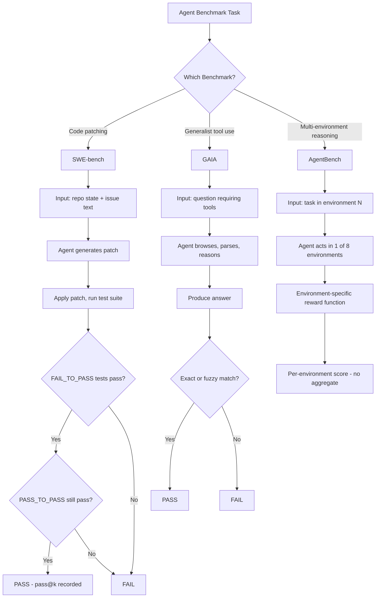

# Benchmarks: SWE-bench, GAIA, AgentBench

## Learning Objectives

- Compare the evaluation mechanisms of SWE-bench, GAIA, and AgentBench by describing what each grades and how scoring works
- Distinguish pass@1 from pass@k scoring and explain how rank instability arises when switching metrics
- Identify which benchmark most closely resembles a given GTM task by mapping task similarity to benchmark design
- Evaluate vendor benchmark claims by naming the specific questions that determine whether a score is relevant to your pipeline
- Detect benchmark contamination and coverage gaps using SWE-bench+ findings and per-environment score analysis

## The Problem

Every AI vendor cites benchmark scores. Almost none of those scores predict whether their agent will succeed in your pipeline. A model that scores 40% on SWE-bench can be excellent at writing Python patches and terrible at browsing a CRM API. A model that scores 70% on GAIA Level 1 can ace single-tool lookups and collapse on multi-hop reasoning that requires chaining three tools in sequence. The benchmark number is a measurement of a narrow, specific task — not a guarantee of general competence.

The deeper problem is that leaderboards are gameable. Training data contamination inflates scores when benchmark solutions leak into pretraining corpora. SWE-bench+ — a re-run of SWE-bench with format perturbations and problem variations — showed that some models dropped significantly when the same problems were rephrased, suggesting memorization rather than genuine reasoning. [CITATION NEEDED — concept: SWE-bench+ contamination findings, specific paper and exact score drops] Before you quote a benchmark number — or let a vendor quote one at you — you need to know what the benchmark actually measures, how the scoring works, and where its blind spots are.

There is also a category error that practitioners make constantly: treating a single benchmark score as a quality signal for an unrelated task. SWE-bench measures code patching. Your GTM pipeline measures something else entirely — prospecting, enrichment, personalization, outreach timing. A high SWE-bench score tells you nothing about whether a model can browse a prospect's website, parse their job postings, and write a relevant cold email. The benchmarks covered in this lesson are the three most-cited in agent evaluation, and knowing their composition is the difference between reading a leaderboard critically and reading it credulously.

## The Concept

Three benchmarks, three evaluation mechanisms. Each measures a different slice of agent competence, and none measures the whole.

**SWE-bench** (Jimenez et al., ICLR 2024) grades patches against real test suites from open-source Python repositories. The agent receives a codebase snapshot at a specific commit plus a natural-language issue description. It must produce a patch that flips FAIL_TO_PASS tests (tests that were failing before the fix and should pass after) without breaking PASS_TO_PASS tests (tests that already pass and should still pass). The metric is pass@k: at k=1, the first generated patch either passes or it doesn't. At k=5, you take the best of five attempts. SWE-bench contains 2,294 issues drawn from 12 popular Python repos — Django, scikit-learn, sympy, matplotlib, Flask, requests, astropy, and others. SWE-agent (Yang et al., 2024) hit 12.5% at release by emphasizing agent-computer interfaces: file editor commands and search syntax the model could understand without human-designed scaffolding. **SWE-bench Verified** is a human-curated 500-task subset created by OpenAI in August 2024 that removes ambiguous issues, unreliable tests, and tasks where the correct fix was unclear. It exists because the original SWE-bench had noisy ground truth that made scores hard to interpret — a model could fail a task not because its patch was wrong but because the test suite was flaky or the issue description was ambiguous.

**GAIA** (Mialon et al., 2023) grades multi-step reasoning with tool use against human-annotated ground truth. Its design principle is inverted from most benchmarks: tasks should be conceptually simple for a human with a web browser but genuinely hard for an AI system. A human can answer a GAIA Level 1 question in a few minutes by browsing, downloading a file, and reading it. An AI must chain those same steps autonomously — browse the web, parse a PDF or image, extract specific information, reason over it, and produce a precise answer. Tasks are tiered at three levels. Level 1 tasks typically require a single tool and a few steps. Level 2 tasks require multiple tools and intermediate reasoning. Level 3 tasks require long multi-hop chains with ambiguous intermediate steps. Scoring uses exact-match or fuzzy comparison against a known answer. GAIA's significance for practitioners is that it tests the capability profile most relevant to research agents: find information across sources, process heterogeneous formats, and synthesize a correct answer.

**AgentBench** (Liu et al., 2023) grades agent behavior across eight distinct environments: operating system (bash commands), web shopping (e-commerce task completion), web browsing (navigation and extraction), database (SQL querying), knowledge graph (structured reasoning), card game (Lateral Thinking Puzzles — social deduction), household (Household simulation — embodied task completion), and mind2web (web interaction tasks). Each environment has its own task-specific reward function. AgentBench reports separate scores per environment, not a single aggregate number, because an agent that aces database querying may completely fail at web navigation. Averaging those scores together hides the specialization profile. At the time of publication, the paper reported a significant gap: GPT-4 achieved nonzero scores across most environments, while open-source LLMs scored near-zero on several, suggesting that multi-environment agent competence was not an emergent property of smaller models.



What no benchmark covers: multi-turn negotiation with another agent or human, domain-specific tool use (CRM APIs, sales engagement platforms, enrichment waterfall orchestration), and long-horizon tasks with ambiguous success criteria. If your GTM pipeline requires an agent to call Apollo's API, enrich with Clearbit, score with a custom model, and write to Clay — none of these benchmarks directly measures that capability profile. The benchmark closest in spirit is GAIA, because it tests chained tool use and multi-step reasoning over heterogeneous sources. SWE-bench is the farthest, because code patching shares almost no surface area with prospecting research. AgentBench's multi-environment design is conceptually adjacent but tests specific environments (card games, household simulation) that don't map to sales workflows.

## Build It

Let's pull the SWE-bench Lite leaderboard, parse the data, and compare pass@1 across models. Then we'll show how rank shifts when switching from pass@1 to pass@5 — demonstrating that leaderboard position is metric-dependent, not an absolute quality measure.

The SWE-bench leaderboard API may or may not be live when you run this. The code below tries the live API first, then falls back to an embedded snapshot so you always get observable output:

```python
import urllib.request
import json

CACHED_SNAPSHOT = [
    {"model": "Claude 3.5 Sonnet", "pass_at_1": 31.0, "pass_at_5": 50.8},
    {"model": "GPT-4o", "pass_at_1": 26.1,