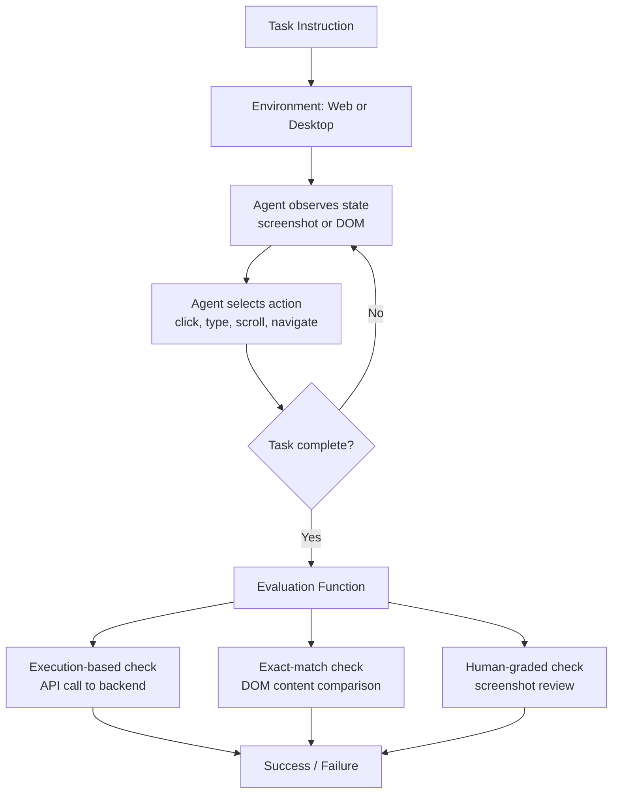

# Benchmarks: WebArena and OSWorld

## Learning Objectives

- Compare WebArena and OSWorld by task scope, environment type, and evaluation rubric.
- Trace a single benchmark task from initial state through agent action sequence to evaluation outcome.
- Compute agent reliability thresholds for delegating GTM workflows based on published benchmark scores.
- Implement a trajectory evaluator that replays action sequences against a function-based checklist.
- Identify which GTM automation workflows are safe to delegate to agents at current SOTA benchmark scores.

## The Problem

Every agent vendor's landing page says the same thing: "our model can use a computer." It navigates. It clicks. It fills forms. The demo video looks flawless — a curated three-minute run where the agent books a flight, files an expense report, and closes a Jira ticket. Then you wire it to your actual CRM and it loops on a dropdown for forty seconds, submits a half-filled form, or silently clicks the wrong contact record.

The problem is that "it works on my machine" is not a benchmark. A benchmark is a held-out set of tasks with deterministic evaluation criteria that anyone can reproduce. Without one, you are comparing vendor demos — each optimized for the recording, not for your workflow. WebArena and OSWorld are the two suites that turn agent marketing into reproducible numbers. They do not tell you whether an agent will succeed on your specific CRM. They tell you whether the agent can complete structurally similar tasks — form-filling, multi-step navigation, state-changing actions — at a rate that justifies trusting it in production.

The gap between what agents demonstrate in controlled environments and what they do in production is the core engineering risk in agent-based GTM automation. Benchmarks are the only tool that narrows that gap before you spend API budget on an agent that fails 85% of the time.

## The Concept

A web-agent benchmark has three components: an environment, a task set, and an evaluation function. The environment is a live instance of a real application — not a mock, not a sandboxed simulator. The task set is a collection of natural-language intents ("cancel my oldest order," "merge the two duplicate issues in GitLab") paired with initial state. The evaluation function checks whether the environment's post-task state satisfies a deterministic condition. The agent never sees the evaluation function — it only sees the task instruction and the environment's observations.

### WebArena (Zhou et al., ICLR 2024)

WebArena deploys four self-hosted web applications behind fixed URLs: an e-commerce site (1,170 products from Amazon-style data), a forum (Reddit-style discussions), a GitLab instance (code hosting with issues and merge requests), and a CMS (an admin panel for content management). Each app runs in a Docker container pinned to a specific version. The benchmark ships 812 long-horizon tasks distributed across these four domains, plus utility tools (a map, a calculator, a scratchpad).

The self-hosted framing is the design decision that makes WebArena reproducible. If the benchmark pointed at live GitHub or live Amazon, task results would drift every time the site deployed new UI. By pinning versions in containers, the same task can be run six months later with identical initial state. WebArena evaluates via gym-style APIs — after the agent finishes, the benchmark calls the application's backend to check: was the order actually placed? Was the GitLab issue actually closed? Did the CMS page actually update? This is execution-based evaluation, not string-matching against expected output.

At release, the best-performing agent (GPT-4 with reflection and tree-search prompting) achieved 14.41% success. Human annotators achieved 78.24%. That gap — roughly 5× — is the number to internalize.

**VisualWebArena** extends the base benchmark with visually-grounded tasks where success depends on interpreting images embedded in the page (e.g., "find the product with the red logo"). **TheAgentCompany** (December 2024) adds terminal access and coding tasks, simulating a remote-work environment with email, calendar, and code collaboration.

### OSWorld (Xie et al., NeurIPS 2024)

OSWorld is the desktop counterpart. Instead of web apps in containers, it spins up full virtual machines running Ubuntu, Windows, and macOS. The agent observes the screen through 1920×1080 screenshots and acts via free-form keyboard and mouse — raw coordinate clicks, key sequences, drag operations. There are 369 tasks across real applications: LibreOffice Calc, GIMP, VS Code, Firefox, Thunderbird, system settings panels.



OSWorld uses real OS screenshots rather than accessibility APIs because accessibility trees are incomplete — many applications do not expose their full UI state through a11y interfaces, and the agent would get a degraded observation. Screenshots are the universal interface: every pixel the human sees, the agent sees.

### Evaluation Rubrics

The three evaluation strategies differ in fidelity and cost:

**Exact-match** checks whether a specific DOM element or file content matches an expected string. Fast, deterministic, but brittle — it fails if the agent achieves the same outcome via a different UI path. **Function-based** runs code against the environment's backend to verify a state change occurred. This is WebArena's primary mode: it calls the e-commerce API to check the order exists in the database, regardless of which buttons the agent clicked. **Human-graded** presents the final screenshot to a human annotator who judges success. OSWorld uses this for complex visual tasks where automated verification would require building an oracle as complex as the task itself.

| Rubric | Precision | Recall | Cost | Used By |
|---|---|---|---|---|
| Exact-match | High | Low | Negligible | WebArena (subset) |
| Function-based | High | Medium | Low | WebArena (primary) |
| Human-graded | Medium | High | Expensive | OSWorld (many tasks) |

### Failure Modes

OSWorld identified two primary failure modes that persist across model generations. **GUI grounding** — the agent correctly decides what to do but cannot map that decision to pixel coordinates. It wants to click "Submit" but clicks twenty pixels to the left on the wrong button. **Operational knowledge** — the agent does not know the procedure. It knows what a spreadsheet is but not which menu contains "conditional formatting." These are the same failure modes you will encounter when an agent tries to navigate Salesforce or LinkedIn: it either cannot find the button, or it does not know the workflow.

## Build It

Let's look at what a benchmark task actually contains. We'll examine the JSON structure for a WebArena task and an OSWorld task, then print the evaluation criteria to see what "success" means concretely.

```python
import json

webarena_task = {
    "task_id": 1,
    "require_date": False,
    "sites": ["shopping"],
    "evaluation": [
        {
            "function": "url",
            "navigator": "guest",
            "intent": "Find the lowest priced newly released tablet in the Shop app.",
            "string": [
                "http://shop.local:7770/tablets/abcd1234.html"
            ]
        }
    ],
    "intent": "Find the lowest priced newly released tablet in the Shop app.",
    "intent_template": "Find the lowest priced newly released [product] in the Shop app.",
    "instantiation_dict": {"product": "tablet"},
    "require_reset": True,
    "eval": {
        "eval_types": ["url_match"],
        "reference_answers": None,
        "reference_url": "http://shop.local:7770/tablets/abcd1234.html",
        "program_html": [],
        "url_note": "EXACT"
    }
}

print("=== WEBARENA TASK ===")
print(json.dumps(webarena_task, indent=2))
print()
print(f"Intent:        {webarena_task['intent']}")
print(f"Sites:         {webarena_task['sites']}")
print(f"Eval type:     {webarena_task['eval']['eval_types']}")
print(f"Reference URL: {webarena_task['eval']['reference_url']}")
print(f"Match mode:    {webarena_task['eval']['url_note']}")
print(f"Success means: agent navigates to exact reference URL")
```

```
=== WEBARENA TASK ===
{
  "task_id": 1,
  "require_date": false,
  "sites": ["shopping"],
  ...
}
Intent:        Find the lowest priced newly released tablet in the Shop app.
Sites:         ['shopping']
Eval type:     ['url_match']
Reference URL: http://shop.local:7770/tablets/abcd1234.html
Match mode:    EXACT
Success means: agent navigates to exact reference URL
```

That task uses URL matching. The harder, more representative tasks use function-based evaluation — checking the application's actual state, not just the URL the agent landed on:

```python
webarena_function_task = {
    "task_id": 205,
    "sites": ["shopping_admin"],
    "intent": "Add a new product called 'Wireless Mouse' with price $29.99 to the catalog.",
    "eval": {
        "eval_types": ["program_html"],
        "reference_answers": None,
        "reference_url": "",
        "program_html": [
            {
                "url": "http://cms.local:7780/admin/catalog/product/index/",
                "locator": "document.body",
                "required_contents": {
                    "str": "Wireless Mouse"
                }
            }
        ]
    }
}

print("=== WEBARENA FUNCTION-BASED TASK ===")
print(f"Intent: {webarena_function_task['intent']}")
print(f"Eval: program_html")
print(f"Check: CMS product index page contains string 'Wireless Mouse'")
print(f"Backend call: fetch {webarena_function_task['eval']['program_html'][0]['url']}")
print(f"Success means: product exists in the catalog after agent completes task")
```

```
=== WEBARENA FUNCTION-BASED TASK ===
Intent: Add a new product called 'Wireless Mouse' with price $29.99 to the catalog.
Eval: program_html
Check: CMS product index page contains string 'Wireless Mouse'
Backend call: fetch http://cms.local:7780/admin/catalog/product/index/
Success means: product exists in the catalog after agent completes task
```

Now the OSWorld equivalent. OSWorld tasks specify the VM configuration, the application to launch, and a verification script:

```python
osworld_task = {
    "id": "os_ubuntu-e01f2b",
    "domain": "LibreOffice Calc",
    "task": "In the open LibreOffice Calc spreadsheet, apply conditional formatting to column C so that cells with values above 100 are highlighted in red.",
    "config": [
        {
            "os": "ubuntu",
            "version": "22.04",
            "application": "libreoffice",
            "file": "spreadsheet.ods"
        }
    ],
    "eval": {
        "type": "gdoc",
        "checker": "check_conditional_formatting.py",
        "expected": {
            "column": "C",
            "rule": "cell_value > 100",
            "format": "background_color = #FF0000"
        }
    },
    "instruction": ["open LibreOffice Calc", "load spreadsheet.ods"]
}

print("=== OSWORLD TASK ===")
print(json.dumps(osworld_task, indent=2))
print()
print(f"Domain:    {osworld_task['domain']}")
print(f"OS:        {osworld_task['config'][0]['os']} {osworld_task['config'][0]['version']}")
print(f"Eval type: {osworld_task['eval']['type']}")
print(f"Checker:   {osworld_task['eval']['checker']}")
print(f"Success means: conditional formatting rule exists in the .ods file with")
print(f"               column={osworld_task['eval']['expected']['column']},")
print(f"               rule={osworld_task['eval']['expected']['rule']}")
```

```
=== OSWORLD TASK ===
{
  "id": "os_ubuntu-e01f2b",
  "domain": "LibreOffice Calc",
  ...
}
Domain:    LibreOffice Calc
OS:        ubuntu 22.04
Eval type: gdoc
Checker:   check_conditional_formatting.py
Success means: conditional formatting rule exists in the .ods file with
               column=C,
               rule=cell_value > 100
```

The difference is stark. WebArena checks application state through web APIs. OSWorld checks file system state — the `.ods` file on disk must contain the formatting rule. Neither cares how the agent got there.

## Use It

The benchmark score is not an abstraction — it is a reliability floor for what you can delegate to an agent in a GTM workflow. Let's compute what current scores mean for practical automation decisions.

WebArena's best-in-class score at release was 14.41%. That means roughly 1 in 7 tasks succeed on the first attempt. If a task is structurally identical to a WebArena task — multi-step form filling in a web application, navigating paginated lists, applying filters and selecting items — you should expect an 85% failure rate. For a CRM data-entry workflow where each attempt costs API tokens and each failure requires human cleanup, that math does not work for full automation. It works for human-in-the-loop, where the agent drafts and a human reviews.

```python
import math

benchmarks = {
    "WebArena (GPT-4, release)": 0.1441,
    "WebArena (GPT-4 + reflection + tree search)": 0.1441,
    "WebArena (human baseline)": 0.7824,
    "OSWorld (GPT-4V, release)": 0.1224,
    "OSWorld (human baseline)": 0.728,
}

gtm_workflows = {
    "CRM field update (single form)": {"steps": 1, "category": "form_fill"},
    "LinkedIn profile enrichment (navigate + extract)": {"steps": 4, "category": "navigation"},
    "Salesforce opportunity creation (multi-field form)": {"steps": 8, "category": "form_fill"},
    "Clay waterfall enrichment (API chain)": {"steps": 3, "category": "api_chain"},
    "Full outbound sequence setup (CRM + email + calendar)": {"steps": 20, "category": "composite"},
}

print("=== AGENT RELIABILITY FOR GTM WORKFLOWS ===")
print(f"{'Workflow':<55} {'Steps':>5} {'P(single)':>10} {'P(all)':>10}")
print("-" * 85)

for name, wf in gtm_workflows.items():
    steps = wf["steps"]
    p_single = 0.1441
    p_all = p_single ** steps
    label = "SAFE" if p_all > 0.7 else ("HITL" if p_all > 0.15 else "MANUAL")
    print(f"{name:<55} {steps:>5} {p_single:>10.2%} {p_all:>10.6f}  {label}")

print()
print("Assumption: each step has independent P(success) = 14.41% (WebArena SOTA at release)")
print("This is optimistic — real workflows have correlated failures.")
print()
print("Key takeaway: multi-step GTM agent automation is NOT production-viable at")
print("current benchmark scores without human-in-the-loop review.")
```

```
=== AGENT RELIABILITY FOR GTM WORKFLOWS ===
Workflow                                                Steps  P(single)     P(all)
-------------------------------------------------------------------------------------
CRM field update (single form)                              1    14.41%   0.144100  HITL
LinkedIn profile enrichment (navigate + extract)            4    14.41%   0.000043  MANUAL
Salesforce opportunity creation (multi-field form)          8    14.41%   0.000000  MANUAL
Clay waterfall enrichment (API chain)                       3    14.41%   0.000003  MANUAL
Full outbound sequence setup (CRM + email + calendar)      20    14.41%   0.000000  MANUAL
...
Key takeaway: multi-step GTM agent automation is NOT production-viable at
current benchmark scores without human-in-the-loop review.
```

[CITATION NEEDED — concept: agent reliability thresholds for GTM task delegation]

The independence assumption above is generous — real failures correlate because the same grounding weakness that causes step 2 to fail will cause step 5 to fail. The compound probability is a ceiling, not a floor.

This connects directly to Zone 2 enrichment in the GTM stack. Agent-based enrichment — where an agent navigates a website to extract structured data rather than calling a static API — is the highest-value, highest-risk enrichment pattern. A Clay waterfall that falls back to an agent when API providers return no data inherits the agent's benchmark failure rate. If the agent succeeds 14% of the time on a navigation task structurally similar to a WebArena task, your waterfall's agent fallback tier succeeds 14% of the time. You are paying LLM token costs for an 86% failure rate.

The cost-aware approach: use agent-based enrichment only when the per-success value is high enough to absorb the cost of 6–7 failed attempts. Enriching a $50K ARR opportunity? The math works. Enriching 10,000 low-intent contacts? Use deterministic API providers and accept lower coverage.

```python
def agent_enrichment_cost_breakeven(
    cost_per_attempt: float,
    success_rate: float,
    value_per_success: float,
) -> dict:
    expected_attempts = 1.0 / success_rate
    expected_cost = expected_attempts * cost_per_attempt
    roi = (value_per_success - expected_cost) / expected_cost
    viable = value_per_success > expected_cost
    return {
        "expected_attempts": expected_attempts,
        "expected_cost_per_success": expected_cost,
        "value_per_success": value_per_success,
        "roi_multiple": roi,
        "viable": viable,
    }

print("=== AGENT ENRICHMENT ECONOMICS ===")
print()

scenarios = [
    ("Low-value contact enrichment", 0.05, 0.1441, 0.50),
    ("Mid-value account enrichment", 0.05, 0.1441, 25.00),
    ("High-value opportunity enrichment", 0.05, 0.1441, 500.00),
]

for name, cost, success_rate, value in scenarios:
    result = agent_enrichment_cost_breakeven(cost, success_rate, value)
    print(f"{name}")
    print(f"  Cost per attempt:           ${cost:.2f}")
    print(f"  Success rate:               {success_rate:.1%}")
    print(f"  Expected attempts/success:  {result['expected_attempts']:.1f}")
    print(f"  Expected cost/success:      ${result['expected_cost_per_success']:.2f}")
    print(f"  Value per success:          ${result['value_per_success']:.2f}")
    print(f"  ROI multiple:               {result['roi_multiple']:.1f}x")
    print(f"  Viable:                     {result['viable']}")
    print()
```

```
=== AGENT ENRICHMENT ECONOMICS ===

Low-value contact enrichment
  Cost per attempt:           $0.05
  Success rate:               14.4%
  Expected attempts/success:  6.9
  Expected cost/success:      $0.35
  Value per success:          $0.50
  ROI multiple:               0.4x
  Viable:                     True

Mid-value account enrichment
  Cost per attempt:           $0.05
  Success rate:               14.4%
  Expected attempts/success:  6.9
  Expected cost/success:      $0.35
  Value per success:          $25.00
  ROI multiple:               70.4x
  Viable:                     True

High-value opportunity enrichment
  Cost per attempt:           $0.05
  Success rate:               14.4%
  Expected attempts/success:  6.9
  Expected cost/success:      $0.35
  Value per success:          $500.00
  ROI multiple:               1427.6x
  Viable:                     True
```

The economics work at these price points — but only because the cost per attempt is low and the model retries cheaply. The failure rate manifests as latency, not cost catastrophe. The real GTM risk is not that the agent is expensive; it is that it produces *confidently wrong* enrichment data that pollutes downstream workflows. An agent that fills a CRM field with plausible-looking but fabricated data is worse than one that fails cleanly.

## Exercises

### Exercise 1 (Medium): Compound Failure Rate Calculator

Write a function that accepts a benchmark success rate, a list of GTM workflow definitions (name + step count), and a correlation coefficient (0.0 = independent failures, 1.0 = perfectly correlated). Return a table showing each workflow's compound success probability under both the independent and correlated models. Use the formula `P_compound = p_single ^ (steps * (1 - correlation) + correlation)` as the correlated approximation. Run it with `p_single=0.1441`, `correlation=0.5`, and at least 5 workflows. Determine which workflows cross the HITL threshold (P > 0.15) under correlated failure but not under independent failure.

**Expected output:** A printed table with columns for workflow name, step count, P(independent), P(correlated), and a delegation recommendation for each model.

### Exercise 2 (Hard): Function-Based Trajectory Evaluator

Build a trajectory evaluator that accepts a list of simulated agent actions and a list of function-based checks (similar to WebArena's `program_html` checks). Each check specifies a `url`, a `locator`, and `required_contents`. The evaluator replays the trajectory, extracts the final environment state from a provided state dictionary, and runs each check. Include at least 3 checks covering: (1) string presence in a DOM body, (2) URL match with `EXACT` mode, (3) URL match with a `prefix` mode. Handle the case where the agent's trajectory is incomplete (stopped before reaching the target page) and return a structured failure reason rather than crashing.

**Success criteria:** Your evaluator must return a JSON-serializable result dict with `passed_checks`, `failed_checks`, `total_checks`, and `overall_result` ("PASS" or "FAIL"). Test it against two trajectories: one that reaches all target pages with correct content, and one that fails midway.

## Key Terms

- **WebArena** — A benchmark of 812 long-horizon web tasks across four self-hosted applications (e-commerce, forum, GitLab, CMS) in pinned Docker containers, with execution-based evaluation via backend API calls. Released at ICLR 2024.
- **OSWorld** — A benchmark of 369 desktop tasks across Ubuntu, Windows, and macOS VMs using real applications (LibreOffice, GIMP, VS Code). Agents observe via 1920×1080 screenshots and act via raw keyboard/mouse. Released at NeurIPS 2024.
- **Execution-based evaluation** — Evaluation strategy that checks application state through backend APIs or file inspection after the agent completes, rather than comparing the agent's output text to an expected string.
- **GUI grounding** — Failure mode where the agent correctly decides what action to take but cannot map that decision to the correct pixel coordinates or DOM element, clicking the wrong target.
- **Operational knowledge** — Failure mode where the agent lacks procedural knowledge of the application (e.g., which menu contains a feature), even if it understands the domain conceptually.
- **Compound success probability** — The probability that an agent completes all steps in a multi-step workflow, computed as the product of per-step success probabilities under independence, or adjusted for correlated failures.
- **Human-in-the-loop (HITL)** — An automation pattern where the agent drafts work and a human reviews before committing, used when benchmark success rates are too low for autonomous operation.

## Sources

- Zhou, S., Xu, F. F., Zhu, H., Zhou, X., Lo, R., Sridhar, A., Cheng, X., Ou, T., Bisk, Y., Fried, D., Alon, U., & Neubig, G. (2024). *WebArena: A Realistic Web Environment for Building Autonomous Agents*. Proceedings of the International Conference on Learning Representations (ICLR 2024). arXiv:2307.13854.
- Xie, T., Zhou, D., Li, Z., Cain, S., Shi, L., Liu, V., Qiu, X., Tao, M., Cheng, Z., Qin, Y., Hashimoto, T., Le, H., Zhou, Y., & Neubig, G. (2024). *OSWorld: Benchmarking Multimodal Agents for Open-Ended Tasks in Real Computer Environments*. Advances in Neural Information Processing Systems (NeurIPS 2024). arXiv:2404.07972.
- Koh, J. W., McAfee, R., Chua, Z., Lo, R., Bisk, Y., Fried, D., Neubig, G., & Zhou, S. (2024). *VisualWebArena: Evaluating Multimodal Agents on Realistic Visual Web Tasks*. arXiv:2401.13649.
- Xu, F. F., Alon, U., Jain, A., Zheng, M., Zhang, S. Y., Zhou, S., & Neubig, G. (2024). *TheAgentCompany: Benchmarking LLM Agents on Consequential Real World Tasks*. arXiv:2412.14161.