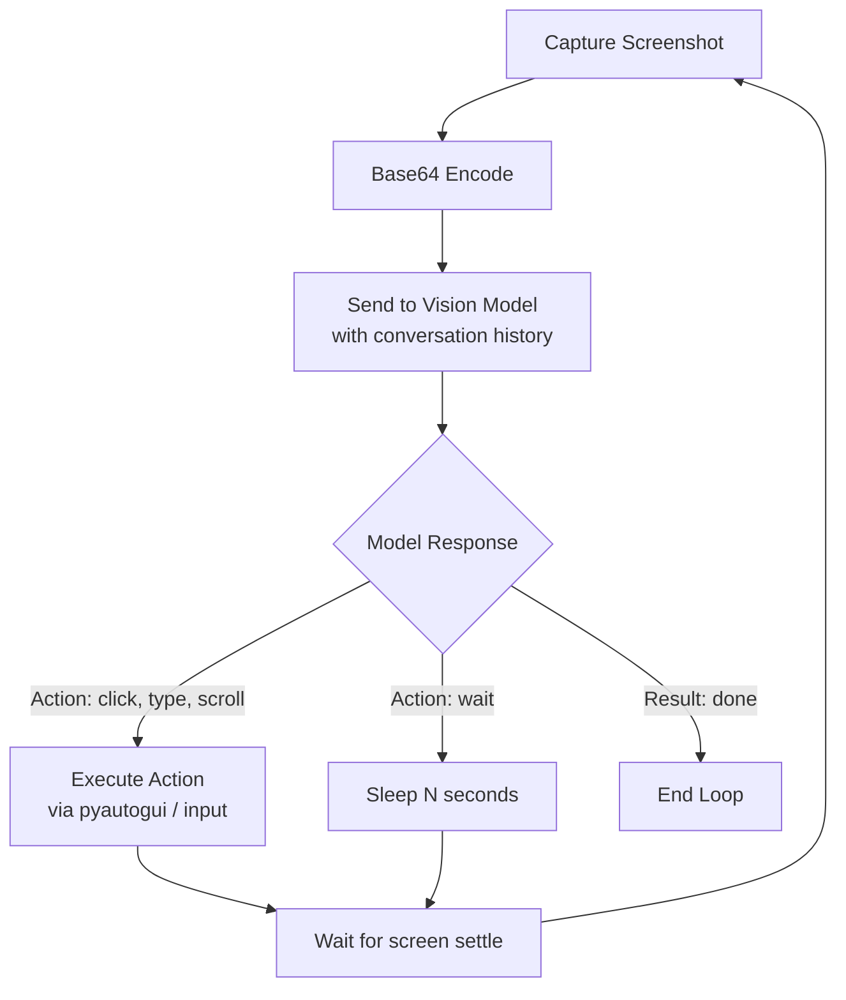

# Computer Use: Claude, OpenAI CUA, Gemini

## Learning Objectives

- Implement a perception-action loop that captures a screenshot, sends it to a vision model, parses the returned action, and executes it via mouse/keyboard control.
- Compare the wire formats and tool schemas for Claude's `computer_20241022`, OpenAI's `computer_use_preview`, and Gemini's browser-action API.
- Diagnose coordinate drift and timing failures in a computer-use loop, and implement retry/wait logic that handles both.
- Evaluate the cost-per-task tradeoff of pixel-based agents versus API-based automation, and compute the break-even point where computer use becomes justified.
- Integrate a computer-use loop into a GTM enrichment workflow where the target system exposes no API.

## The Problem

Most GTM tools assume the target system has an API. Salesforce does. HubSpot does. LinkedIn does not. The job board you want to scrape does not. The legacy CRM your prospect uses does not. The internal pricing portal that holds the data you need definitely does not. When there is no API, your options have historically been: brittle DOM scraping (breaks on every redesign), headless browser automation with CSS selectors (breaks on every A/B test), or manual human labor (does not break, does not scale).

Computer use agents replace all three with a single approach: take a screenshot, ask a vision model what to do next, execute the action, repeat. The model reads pixels the way a human reads a screen. If a button moves from the top-left to the center of the page, the model still finds it because it is looking at the rendered output, not a hardcoded coordinate. This is the same sense-plan-act loop from robotics control theory, applied to a graphical interface.

The tradeoff is real. A pixel-based loop is slow — each step requires a model round trip that can take 2-10 seconds. It is non-deterministic — the same screenshot can produce different actions on different runs. And it is fragile in its own way — if the model misreads a button or hallucinates a coordinate, the loop fails silently. You are trading one class of brittleness (selector breakage) for another (perception error). The question is whether the new class is easier to debug than the old one. Often it is, because you can see what the model saw.

Three vendors now ship production computer-use models: Anthropic (Claude), OpenAI (CUA), and Google (Gemini). Each implements the same loop with different tool schemas, different action vocabularies, and different safety models. Knowing all three lets you pick based on latency, cost, and action coverage rather than vendor lock-in.

## The Concept

Every computer-use agent follows the same cycle: capture the screen, send the image to a vision model, receive a structured action, execute that action, wait for the screen to settle, and repeat until the task is done or a step limit is reached. This is the perception-action loop. The model never touches the operating system directly — it only ever sees images and emits instructions. Your code is the intermediary that translates instructions into real input events.



**Claude (Anthropic)** exposes this loop through the Messages API with the `computer_20241022` tool type. You define a tool with `type: "computer_20241022"`, pass the screen dimensions, and include screenshots as base64 image blocks in the conversation. The model returns actions like `{"type": "mouse_move", "coordinate": [523, 187]}` or `{"type": "left_click"}` or `{"type": "type", "text": "hello"}`. Claude also ships `text_editor_20241022` and `bash_20241022` as separate tool types for file and shell operations. The model is trained to count pixels from reference points — corners, window edges, visible text — to produce resolution-independent coordinates. This means it works across different screen sizes, but it also means the screenshot must match the actual display resolution the agent is acting on.

**OpenAI CUA (Computer Use Agent)** uses the Responses API with the `computer-use-preview` model. Actions come back as `computer_call` items containing an `action` object. The action vocabulary overlaps with Claude's but uses different naming: `click`, `double_click`, `type`, `scroll`, `keypress`, `wait`. Instead of separate `mouse_move` + `left_click` steps, OpenAI combines them into a single `click` action with coordinates. The loop structure is identical — screenshot in, action out, execute, repeat — but the wire format is different enough that you cannot swap providers without rewriting your action executor.

**Gemini 2.5 Computer Use** (Google DeepMind, Oct 2025) is browser-scoped: it operates on 13 DOM-level actions rather than raw pixel coordinates. Instead of clicking at `[x, y]`, it targets elements by accessibility role and text. This avoids the coordinate drift problem entirely but limits the agent to browser contexts — it cannot drive a desktop application. At launch, Gemini reported ~70% accuracy on Online-Mind2Web and lower latency than both Anthropic and OpenAI. [CITATION NEEDED — concept: Gemini 2.5 Computer Use full action vocabulary and safety configuration surface].

The fundamental reliability problem across all three: these agents see rendered pixels (or DOM snapshots), not ground truth. A button that shifts 3px between page loads breaks a coordinate-based agent. A dynamically loaded element that appears after a 500ms delay gets clicked before it is interactive. The `wait` action exists in all three APIs precisely because models cannot tell from a static screenshot whether a page is still loading. Your loop must include explicit waits and screenshot-based verification — "did the action produce the expected screen state?" — or it will fail silently and frequently.

The cost dimension matters for GTM teams specifically. Every Clay credit you spend on enrichment is a token cost. Every computer-use step is a vision-model call that processes an image — typically 1000-2000 tokens of input per screenshot plus the full conversation history. A 20-step task (navigate to LinkedIn, search a company, find the right person, open their profile, extract data) can cost $0.10-0.50 per prospect depending on the provider. The same task via a structured API (if one existed) would cost $0.001. Computer use is the tool you reach for when the API does not exist, not the tool you reach for first.

## Build It

Build the perception-action loop from scratch using Claude's computer-use tool type. No framework, no wrapper library — just the Anthropic SDK, pyautogui for input simulation, and the loop logic.

```python
import anthropic
import base64
import pyautogui
import time
import json

pyautogui.FAILSAFE = True

client = anthropic.Anthropic()

SCREEN_WIDTH, SCREEN_HEIGHT = pyautogui.size()

def take_screenshot():
    screenshot = pyautogui.screenshot()
    screenshot.save("/tmp/screen.png")
    with open("/tmp/screen.png", "rb") as f:
        return base64.standard_b64encode(f.read()).decode("utf-8")

def execute_action(action):
    action_type = action.get("type")
    
    if action_type == "mouse_move":
        x, y = action["coordinate"]
        pyautogui.moveTo(x, y, duration=0.3)
        print(f"  -> Moved mouse to ({x}, {y})")
    elif action_type == "left_click":
        pyautogui.click()
        print("  -> Left clicked")
    elif action_type == "right_click":
        pyautogui.rightClick()
        print("  -> Right clicked")
    elif action_type == "double_click":
        pyautogui.doubleClick()
        print("  -> Double clicked")
    elif action_type == "type":
        text = action["text"]
        pyautogui.write(text, interval=0.02)
        print(f"  -> Typed: {text}")
    elif action_type == "key":
        key = action["key"]
        pyautogui.press(key)
        print(f"  -> Pressed key: {key}")
    elif action_type == "screenshot":
        print("  -> Screenshot requested by model")
    elif action_type == "cursor_position":
        pos = pyautogui.position()
        print(f"  -> Cursor at {pos}")
    else:
        print(f"  -> Unknown action type: {action_type}")
    
    return {"type": "text", "text": f"Executed {action_type}"}

def run_computer_use_task(task_prompt, max_steps=10):
    print(f"Task: {task_prompt}")
    print(f"Screen: {SCREEN_WIDTH}x{SCREEN_HEIGHT}")
    print(f"Max steps: {max_steps}")
    print("-" * 50)
    
    messages = [{"role": "user", "content": task_prompt}]
    
    tools = [
        {
            "type": "computer_20241022",
            "name": "computer",
            "display_width_px": SCREEN_WIDTH,
            "display_height_px": SCREEN_HEIGHT,
        }
    ]
    
    for step in range(max_steps):
        print(f"\n--- Step {step + 1} ---")
        
        screenshot_b64 = take_screenshot()
        
        messages.append({
            "role": "user",
            "content": [
                {
                    "type": "image",
                    "source": {
                        "type": "base64",
                        "media_type": "image/png",
                        "data": screenshot_b64,
                    },
                }
            ],
        })
        
        response = client.beta.messages.create(
            model="claude-3-5-sonnet-20241022",
            max_tokens=4096,
            tools=tools,
            messages=messages,
            betas=["computer-use-2024-10-22"],
        )
        
        messages.append({"role": "assistant", "content": response.content})
        
        if response.stop_reason == "end_turn":
            for block in response.content:
                if hasattr(block, "text"):
                    print(f"Model says: {block.text}")
            print("\nTask completed.")
            return messages
        
        tool_results = []
        for block in response.content:
            if block.type == "tool_use":
                print(f"Action: {block.name} -> {json.dumps(block.input)}")
                result = execute_action(block.input)
                tool_results.append({
                    "type": "tool_result",
                    "tool_use_id": block.id,
                    "content": [result],
                })
            elif hasattr(block, "text"):
                print(f"Model: {block.text}")
        
        time.sleep(1.5)
        
        messages.append({"role": "user", "content": tool_results})
    
    print(f"\nReached step limit ({max_steps}) without completion.")
    return messages

run_computer_use_task(
    "Open the system's text editor or notes application, type 'Hello from computer use', and save the file to /tmp/computer_use_test.txt."
)
```

This loop produces observable output at every step: the action type, coordinates, typed text, and the model's reasoning. Run it and watch the terminal to see the agent decide, act, and verify. The 1.5-second sleep between steps is not decorative — it gives the OS time to render the result of each action before the next screenshot. Without it, the model sees the pre-action screen state and gets confused.

## Use It

The perception-action loop maps directly to GTM enrichment against systems that have no API. The mechanism — sense, plan, act, verify — is identical whether you are opening a text editor or navigating a prospect's company website to extract their tech stack. In Zone 14 (cost optimization, latency), every computer-use step is a token cost you must account for. A single enrichment task that takes 15 steps at ~1500 input tokens per screenshot is 22,500 tokens of image processing alone, before any text reasoning. The GTM principle here is the same one that governs Clay credit management: "every credit is a token cost — optimize like you would LLM calls." Computer use does not change that rule; it amplifies it because vision tokens are more expensive than text tokens.

The concrete GTM application: building an enrichment agent that navigates a target company's public-facing job board (no API), extracts open role titles and locations, and writes them to a structured format. This is the data that powers ICP-fit scoring — a company hiring five backend engineers in a specific language is a stronger signal for a dev-tools vendor than anything in their press releases. The job board has no API. The DOM structure changes per company. But a vision-based agent sees the rendered page regardless of the underlying framework.

```python
import anthropic
import base64
import pyautogui
import time
import json
import subprocess

client = anthropic.Anthropic()
SCREEN_WIDTH, SCREEN_HEIGHT = pyautogui.size()

def take_screenshot():
    screenshot = pyautogui.screenshot()
    path = "/tmp/enrichment_screen.png"
    screenshot.save(path)
    with open(path, "rb") as f:
        return base64.standard_b64encode(f.read()).decode("utf-8")

def execute_action(action):
    action_type = action.get("type")
    if action_type == "mouse_move":
        x, y = action["coordinate"]
        pyautogui.moveTo(x, y, duration=0.3)
        print(f"  Moved to ({x}, {y})")
    elif action_type == "left_click":
        pyautogui.click()
        print("  Clicked")
    elif action_type == "type":
        pyautogui.write(action["text"], interval=0.02)
        print(f"  Typed: {action['text']}")
    elif action_type == "key":
        pyautogui.press(action["key"])
        print(f"  Key: {action['key']}")
    elif action_type == "scroll":
        direction = action.get("scroll_direction", "down")
        amount = action.get("scroll_amount", 3)
        if direction == "down":
            pyautogui.scroll(-amount)
        else:
            pyautogui.scroll(amount)
        print(f"  Scrolled {direction} by {amount}")
    elif action_type == "wait":
        wait_time = action.get("duration", 2)
        print(f"  Waiting {wait_time}s")
        time.sleep(wait_time)
    else:
        print(f"  Action: {action_type}")
    return {"type": "text", "text": f"Executed {action_type}"}

def extract_job_postings(company_careers_url):
    print(f"Starting enrichment for: {company_careers_url}")
    
    subprocess.run(
        ["python3", "-c", f"import webbrowser; webbrowser.open('{company_careers_url}')"],
        capture_output=True
    )
    time.sleep(4)
    
    task = f"""You are an enrichment agent. The browser is open to a company careers page.
Your job:
1. Find the list of open job postings on this page.
2. Read each posting's title and location.
3. If there are multiple pages or a "Load More" button, click through to see all postings.
4. When you have read all visible postings, type a summary in this exact format:

JOBS_FOUND:
- Title: [exact title] | Location: [exact location]
- Title: [exact title] | Location: [exact location]
(repeat for each posting)
END_JOBS

Then stop. Do not navigate away from the careers page."""
    
    messages = [{"role": "user", "content": task}]
    tools = [
        {
            "type": "computer_20241022",
            "name": "computer",
            "display_width_px": SCREEN_WIDTH,
            "display_height_px": SCREEN_HEIGHT,
        }
    ]
    
    extracted_data = None
    
    for step in range(25):
        print(f"\nStep {step + 1}")
        
        screenshot_b64 = take_screenshot()
        messages.append({
            "role": "user",
            "content": [{
                "type": "image",
                "source": {
                    "type": "base64",
                    "media_type": "image/png",
                    "data": screenshot_b64,
                },
            }],
        })
        
        response = client.beta.messages.create(
            model="claude-3-5-sonnet-20241022",
            max_tokens=4096,
            tools=tools,
            messages=messages,
            betas=["computer-use-2024-10-22"],
        )
        
        messages.append({"role": "assistant", "content": response.content})
        
        if response.stop_reason == "end_turn":
            for block in response.content:
                if hasattr(block, "text") and "JOBS_FOUND:" in block.text:
                    extracted_data = block.text
                    print("Extraction complete.")
            if not extracted_data:
                for block in response.content:
                    if hasattr(block, "text"):
                        print(f"Model: {block.text}")
            break
        
        tool_results = []
        for block in response.content:
            if block.type == "tool_use":
                print(f"  Action: {json.dumps(block.input)}")
                result = execute_action(block.input)
                tool_results.append({
                    "type": "tool_result",
                    "tool_use_id": block.id,
                    "content": [result],
                })
        
        time.sleep(2)
        messages.append({"role": "user", "content": tool_results})
    
    if extracted_data:
        with open("/tmp/job_extraction_result.txt", "w") as f:
            f.write(extracted_data)
        print(f"\nResults saved to /tmp/job_extraction_result.txt")
        return extracted_data
    else:
        print("\nExtraction did not complete within step limit.")
        return None

result = extract_job_postings("https://jobs.lever.co/stripe")
print("\n--- RESULT ---")
print(result)
```

The `scroll` action and `wait` action in the executor are not optional — careers pages are long and load asynchronously. Without scrolling, the agent only sees the first few postings. Without explicit waits, the agent clicks a "Load More" button and screenshots before the new content renders. These are the same timing problems that break Selenium scripts, just delegated to the model to reason about instead of hardcoded in your code.

## Ship It

Shipping a computer-use agent to production means solving three problems that the prototype ignores: cost monitoring, failure recovery, and session isolation. The perception-action loop is conceptually clean, but a production enrichment pipeline runs hundreds of tasks per day against dozens of different sites, each with its own layout quirks and load times.

Cost monitoring comes first because it is the one that will surprise you. A task that works in 8 steps during testing can balloon to 25 steps in production when the model gets confused by a cookie banner or a slow-loading page. Each step is a full conversation — all prior screenshots and actions are re-sent because the model needs context to decide the next move. By step 15, you are sending 15 screenshots worth of tokens. This is the same cost-optimization principle from Zone 14: "every Clay credit is a token cost — optimize like you would LLM calls." Track tokens per task, set a budget ceiling, and abort when it is exceeded.

```python
import anthropic
import base64
import pyautogui
import time
import json
from dataclasses import dataclass, field
from typing import Optional

client = anthropic.anthropic.Anthropic() if hasattr(anthropic, 'anthropic') else anthropic.Anthropic()
SCREEN_WIDTH, SCREEN_HEIGHT = pyautogui.size()

@dataclass
class ComputerUseBudget:
    max_steps: int = 20
    max_input_tokens: int = 100_000
    max_output_tokens: int = 10_000
    cost_per_million_input: float = 3.00
    cost_per_million_output: float = 15.00
    accumulated_input_tokens: int = 0
    accumulated_output_tokens: int = 0
    step_count: int = 0
    actions_taken: list = field(default_factory=list)
    
    def can_continue(self):
        if self.step_count >= self.max_steps:
            return False, f"Step limit reached: {self.step_count}/{self.max_steps}"
        if self.accumulated_input_tokens >= self.max_input_tokens:
            return False, f"Input token budget exceeded: {self.accumulated_input_tokens}/{self.max_input_tokens}"
        return True, "OK"
    
    def current_cost(self):
        input_cost = (self.accumulated_input_tokens / 1_000_000) * self.cost_per_million_input
        output_cost = (self.accumulated_output_tokens / 1_000_000) * self.cost_per_million_output
        return round(input_cost + output_cost, 4)
    
    def report(self):
        return {
            "steps": self.step_count,
            "input_tokens": self.accumulated_input_tokens,
            "output_tokens": self.accumulated_output_tokens,
            "estimated_cost_usd": self.current_cost(),
            "actions": self.actions_taken,
        }

def take_screenshot():
    screenshot = pyautogui.screenshot()
    path = "/tmp/production_screen.png"
    screenshot.save(path)
    with open(path, "rb") as f:
        return base64.standard_b64encode(f.read()).decode("utf-8")

def execute_action(action):
    action_type = action.get("type")
    if action_type == "mouse_move":
        x, y = action["coordinate"]
        pyautogui.moveTo(x, y, duration=0.3)
    elif action_type == "left_click":
        pyautogui.click()
    elif action_type == "type":
        pyautogui.write(action["text"], interval=0.02)
    elif action_type == "key":
        pyautogui.press(action["key"])
    elif action_type == "scroll":
        direction = action.get("scroll_direction", "down")
        amount = action.get("scroll_amount", 3)
        pyautogui.scroll(-amount if direction == "down" else amount)
    elif action_type == "wait":
        time.sleep(action.get("duration", 2))
    return {"type": "text", "text": f"Executed {action_type} at {time.time()}"}

def run_with_budget(task_prompt, budget=None):
    if budget is None:
        budget = ComputerUseBudget(max_steps=15, max_input_tokens=80_000)
    
    print(f"Task: {task_prompt}")
    print(f"Budget: {budget.max_steps} steps, {budget.max_input_tokens:,} input tokens")
    print(f"Screen: {SCREEN_WIDTH}x{SCREEN_HEIGHT}")
    print("=" * 60)
    
    messages = [{"role": "user", "content": task_prompt}]
    tools = [{
        "type": "computer_20241022",
        "name": "computer",
        "display_width_px": SCREEN_WIDTH,
        "display_height_px": SCREEN_HEIGHT,
    }]
    
    for step_num in range(budget.max_steps):
        can_proceed, reason = budget.can_continue()
        if not can_proceed:
            print(f"\nABORTED: {reason}")
            break
        
        budget.step_count = step_num + 1
        print(f"\nStep {budget.step_count} | Cost so far: ${budget.current_cost()}")
        
        screenshot_b64 = take_screenshot()
        messages.append({
            "role": "user",
            "content": [{
                "type": "image",
                "source": {
                    "type": "base64",
                    "media_type": "image/png",
                    "data": screenshot_b64,
                },
            }],
        })
        
        response = client.beta.messages.create(
            model="claude-3-5-sonnet-20241022",
            max_tokens=2048,
            tools=tools,
            messages=messages,
            betas=["computer-use-2024-10-22"],
        )
        
        budget.accumulated_input_tokens += response.usage.input_tokens
        budget.accumulated_output_tokens += response.usage.output_tokens
        
        messages.append({"role": "assistant", "content": response.content})
        
        if response.stop_reason == "end_turn":
            for block in response.content:
                if hasattr(block, "text"):
                    print(f"\nFinal output: {block.text}")
            break
        
        tool_results = []
        for block in response.content:
            if block.type == "tool_use":
                action_summary = f"{block.input.get('type', 'unknown')}"
                if "coordinate" in block.input:
                    action_summary += f" at {block.input['coordinate']}"
                budget.actions_taken.append(action_summary)
                print(f"  -> {action_summary}")
                result = execute_action(block.input)
                tool_results.append({
                    "type": "tool_result",
                    "tool_use_id": block.id,
                    "content": [result],
                })
        
        time.sleep(2)
        messages.append({"role": "user", "content": tool_results})
    
    report = budget.report()
    print("\n" + "=" * 60)
    print("BUDGET REPORT")
    print(json.dumps(report, indent=2))
    
    with open("/tmp/computer_use_budget_report.json", "w") as f:
        json.dump(report, f, indent=2)
    
    return report

report = run_with_budget("Open the Calculator app and compute 247 * 893.")
```

Session isolation matters when you scale beyond a single task. If two enrichment tasks run simultaneously on the same machine, their mouse movements and screenshots collide. The production pattern is one virtual display per task — `Xvfb :99` for a headless Linux session, or a Docker container with its own display. Claude's computer use documentation recommends Xvfb because it gives you a stable, predictable display that matches the coordinates the model returns. The alternative — running on a real desktop with a logged-in user session — works for development but creates a single point of failure for production: if someone moves the mouse, the agent loses its context.

Failure recovery is the third production concern. The model will sometimes click the wrong element, type into the wrong field, or encounter a dialog it does not expect. Your loop needs a verification step: after each action, check whether the screen state matches what the model expected. If the model clicked a "Submit" button but a captcha appeared, the loop should detect the anomaly and either retry or escalate to a human. This is the same "multichannel approach" principle from GTM outbound — you do not rely on a single channel because any single channel can fail. In computer use, you do not rely on a single step succeeding; you verify and fall back.

## Exercises

1. **Build a multi-provider action executor.** Write a single `execute_action` function that accepts both Claude's format (`{"type": "left_click", "coordinate": [x, y]}`) and OpenAI CUA's format (`{"type": "click", "x": x, "y": y}}`). Test it by calling both formats with sample actions and printing which provider's schema was detected. This exercise forces you to understand the wire-format differences without needing API keys.

2. **Implement screenshot-based verification.** After executing a `left_click` action, take a "before" and "after" screenshot. Compute a simple pixel-diff (count of changed pixels using Pillow's `ImageChops.difference`). Print the percentage of pixels that changed. If fewer than 0.1% changed, print a warning that the click may not have registered. This is the verification step that production loops need.

3. **Compute the cost break-even point.** Write a function that takes three arguments: `task_steps`, `tokens_per_screenshot`, and `cost_per_million_tokens`. Compute the total cost of running a computer-use task. Then compute the cost of the same task via a hypothetical API that charges $0.001 per call with 5 calls needed. At what step count does computer use become more expensive? Print the break-even analysis. This maps directly to Zone 14 cost management.

4. **Build a cookie-banner handler.** Many websites show a cookie consent dialog that blocks the main content. Write a pre-processing step in your loop that checks the first screenshot for common cookie-banner patterns ("Accept", "Allow all", "I agree") and clicks the consent button before the main task begins. Test it by navigating to a site with a cookie banner and observing whether the loop handles it without the model needing to reason about it.

5. **Compare provider action vocabularies.** Create a table (as a Python dict) mapping equivalent actions across Claude, OpenAI CUA, and Gemini. For example, Claude's `left_click` maps to OpenAI's `click`, Gemini's `click_element`. Print the table. Then write a `translate_action(provider_from, provider_to, action)` function that converts between schemas. This exercise builds the mental model needed to switch providers without rewriting your executor.

## Key Terms

- **Perception-action loop:** The cycle of capturing a screen state, sending it to a model, receiving a structured action, executing it, and repeating. Identical to the sense-plan-act cycle in robotics.
- **Coordinate drift:** The problem where an element's pixel position changes between page loads or screen resolutions, causing a coordinate-based agent to miss its target. Claude mitigates this by counting pixels from reference points; Gemini avoids it by targeting DOM elements instead of coordinates.
- **Tool type:** The schema definition that tells a model what actions are available. Claude uses `computer_20241022`, OpenAI uses `computer_call` items, Gemini uses a set of 13 browser-scoped actions.
- **Screenshot verification:** The practice of comparing the screen state before and after an action to confirm the action had its intended effect. Required for production reliability because models cannot tell from a static image whether an action registered.
- **Token budget ceiling:** A configured limit on the total input/output tokens a single task may consume. When exceeded, the loop aborts. This prevents runaway costs when a model gets stuck in a repetitive action cycle.
- **Xvfb:** X Virtual Framebuffer, a display server that performs graphical operations in memory without physical display hardware. Used in production computer-use deployments to provide isolated, predictable display environments.

## Sources

- Anthropic. "Computer Use (Beta)." Anthropic Documentation, Oct 22 2024. Describes `computer_20241022` tool type, the Messages API integration, and the Xvfb deployment pattern. `docs.anthropic.com/en/docs/build-with-claude/computer-use`
- OpenAI. "Computer-Using Agent." OpenAI Platform Documentation, Jan 2025 (updated Mar 2025). Documents `computer-use-preview-2025-03-11` model, the Responses API integration, and the `computer_call` action format. `platform.openai.com/docs/guides/tools-computer-use`
- Google DeepMind. "Gemini 2.5 Computer Use." Google AI Blog / API documentation, Oct 7 2025. Describes browser-scoped 13-action API, Online-Mind2Web benchmark results, and latency comparisons. `developers.googleblog.com` [CITATION NEEDED — concept: exact Gemini 2.5 Computer Use action vocabulary list and safety configuration surface]
- GTM Zone 14 Cost Management principle: "Every Clay credit is a token cost — optimize like you would LLM calls." From GTM Stack Cost Management cluster, Living GTM documentation.
- [CITATION NEEDED — concept: OSWorld and WebArena benchmark numbers for Claude computer use, current as of 2025]