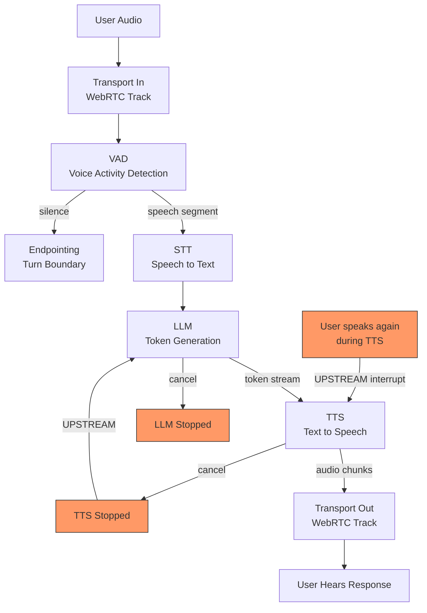

# Voice Agents: Pipecat and LiveKit

## Learning Objectives

- Build a frame-based voice pipeline connecting VAD, STT, LLM, TTS, and transport stages
- Trace audio frames through DOWNSTREAM (source→sink) and UPSTREAM (control) pipeline directions
- Compute per-stage latency and compare results against a 600ms production budget
- Implement interruption handling that cancels in-flight TTS when a user barges in
- Configure a WebRTC transport as the pipeline's audio source and sink, and explain why HTTP cannot serve that role

## The Problem

Voice agents are not a text chatbot with TTS bolted on the end. The moment you try to chain speech-to-text, LLM inference, and text-to-speech in a synchronous request-response loop, you hit a wall: the user speaks, waits in silence while your server transcribes, generates, and synthesizes, and only then hears a response. At 800ms+ of dead air, the conversation feels broken. At 1.5 seconds, the user hangs up.

The budget is approximately 600 milliseconds end-to-end for a production-grade stack, and that number is not arbitrary. Conversational fluency degrades rapidly above 500ms of response latency — the caller starts talking over the bot, the bot starts talking over the caller, and turn detection collapses. Every millisecond you add to STT inference, LLM token generation, or TTS synthesis comes out of the same budget. There is no "fast enough" — there is only "under budget" or "over budget."

The transport layer matters too. HTTP is request-response: the client sends audio, waits for a complete response, and plays it. That model adds buffering latency at both ends and provides no mechanism for the server to push audio back the instant the first TTS chunk is ready. WebRTC solves this by maintaining a persistent, bidirectional, low-latency audio stream — the server can push the first synthesized syllable while the LLM is still generating the rest of the sentence. Without WebRTC (or an equivalent real-time transport), you lose the streaming behavior that makes sub-600ms response times possible.

Then there is turn-taking. In text chat, the user submits and the assistant responds — the boundary is explicit. In voice, the user pauses mid-sentence, coughs, breathes, or the background noise spikes. You need a voice activity detection (VAD) model to segment continuous audio into speech chunks, and you need endpointing logic to decide when a pause means "I'm done talking" versus "I'm thinking." And when the bot is mid-sentence and the user interrupts, you need to cancel the in-flight TTS audio immediately — not finish the sentence and then respond. This is interruption handling, and without it, the agent sounds like it is talking to itself.

## The Concept

A voice agent pipeline is a chain of frame processors. Each processor receives a frame (a typed unit of data — an audio chunk, a transcript segment, an LLM token, a TTS audio buffer), transforms it, and passes the result to the next processor. This is not a function call chain — it is a continuous stream where frames flow in two directions.

DOWNSTREAM flow carries data from source to sink: raw audio enters at the transport, flows through VAD (which detects speech segments), into STT (which transcribes), into the LLM (which generates a response token-by-token), into TTS (which converts each token to audio), and back out through the transport. The downstream direction is the "talk path" — audio in, audio out.

UPSTREAM flow carries control signals from sink back toward source. When VAD detects that the user has started speaking again while TTS is still playing audio, an interrupt signal travels upstream: TTS stops synthesizing, the LLM cancels its remaining token generation, and the transport stops sending audio to the speaker. Without upstream control, there is no barge-in — the bot finishes its sentence regardless of what the user says.



Pipecat implements this frame-based pipeline in Python. You define a chain of `FrameProcessor` objects — each one wraps a service (Deepgram for STT, OpenAI for LLM, ElevenLabs for TTS) and exposes a consistent interface: frames in, frames out. A `PipelineTask` manages the lifecycle, firing events like `on_pipeline_started` and `on_idle_timeout`. Pipecat also provides `PipecatFlows` for structured conversations — state machines that enforce a qualification script, for example — which matters for GTM use cases where the bot must ask specific questions in sequence.

LiveKit provides the transport. It implements WebRTC negotiation, manages audio tracks (one for the user's microphone, one for the bot's synthesized speech), and handles the room abstraction — multiple participants can join, and the bot is just another participant streaming audio. LiveKit's `Agents` framework adds an `AgentSession` class that bridges the WebRTC transport to AI model services, and a `VoicePipelineAgent` that wires STT → LLM → TTS into a turn-taking loop with built-in interruption handling. You can also use Pipecat with a LiveKit transport directly, giving you Pipecat's pipeline flexibility with LiveKit's WebRTC infrastructure.

The latency budget breaks down roughly like this: transport in ~30-50ms, VAD ~5-15ms, STT ~100-200ms (streaming, first-token latency), LLM ~150-300ms (time to first token), TTS ~80-150ms (time to first audio chunk), transport out ~30-50ms. Sum the lower bounds and you get ~395ms — feasible. Sum the upper bounds and you get ~765ms — over budget. The difference between a good voice agent and a broken one is which providers you chose at each stage and whether you pipeline them (start TTS on the first LLM token rather than waiting for the full response).

## Build It

The fastest way to understand the pipeline is to simulate one. We will build a frame-based voice pipeline in pure Python — no API keys, no network calls — that demonstrates downstream data flow, upstream interrupt signals, and per-stage latency accounting. Each stage is a `FrameProcessor` with a `process_frame` method. Frames are typed dataclasses. The pipeline runs them in sequence and measures cumulative latency.

```python
import time
from dataclasses import dataclass, field
from enum import Enum

class FrameType(Enum):
    AUDIO_IN = "audio_in"
    SPEECH_SEGMENT = "speech_segment"
    TRANSCRIPT = "transcript"
    LLM_TOKEN = "llm_token"
    TTS_AUDIO = "tts_audio"
    INTERRUPT = "interrupt"

@dataclass
class Frame:
    type: FrameType
    payload: str
    latency_ms: int = 0
    cumulative_ms: int = 0

class FrameProcessor:
    def __init__(self, name, latency_ms):
        self.name = name
        self.latency_ms = latency_ms
        self.next = None

    def process_frame(self, frame):
        frame.cumulative_ms += self.latency_ms
        print(f"  [{self.name}] {frame.type.value}: '{frame.payload}' | stage={self.latency_ms}ms total={frame.cumulative_ms}ms")
        return [frame]

    def process_upstream(self, signal):
        print(f"  [{self.name}] UPSTREAM: {signal}")

class VAD(FrameProcessor):
    def process_frame(self, frame):
        if frame.type == FrameType.AUDIO_IN:
            frame.cumulative_ms += self.latency_ms
            print(f"  [{self.name}] speech detected from audio chunk | stage={self.latency_ms}ms total={frame.cumulative_ms}ms")
            return [Frame(FrameType.SPEECH_SEGMENT, frame.payload, 0, frame.cumulative_ms)]
        return [frame]

class STT(FrameProcessor):
    def process_frame(self, frame):
        if frame.type == FrameType.SPEECH_SEGMENT:
            frame.cumulative_ms += self.latency_ms
            frame.type = FrameType.TRANSCRIPT
            print(f"  [{self.name}] transcribed: '{frame.payload}' | stage={self.latency_ms}ms total={frame.cumulative_ms}ms")
        return [frame]

class LLM(FrameProcessor):
    def __init__(self, name, latency_ms):
        super().__init__(name, latency_ms)
        self.cancelled = False

    def process_frame(self, frame):
        if frame.type == FrameType.TRANSCRIPT:
            self.cancelled = False
            tokens = ["I", "can", "help", "with", "that"]
            frames = []
            for i, tok in enumerate(tokens):
                if self.cancelled:
                    print(f"  [{self.name}] token generation cancelled at token {i}")
                    break
                frame.cumulative_ms += self.latency_ms // len(tokens)
                t = Frame(FrameType.LLM_TOKEN, tok, 0, frame.cumulative_ms)
                print(f"  [{self.name}] generated token: '{tok}' | total={t.cumulative_ms}ms")
                frames.append(t)
            return frames
        return [frame]

    def process_upstream(self, signal):
        if signal == "interrupt":
            self.cancelled = True
            print(f"  [{self.name}] LLM generation cancelled")

class TTS(FrameProcessor):
    def __init__(self, name, latency_ms):
        super().__init__(name, latency_ms)
        self.cancelled = False

    def process_frame(self, frame):
        if frame.type == FrameType.LLM_TOKEN:
            if self.cancelled:
                return []
            frame.cumulative_ms += self.latency_ms
            frame.type = FrameType.TTS_AUDIO
            print(f"  [{self.name}] synthesized '{frame.payload}' -> audio chunk | total={frame.cumulative_ms}ms")
        return [frame]

    def process_upstream(self, signal):
        if signal == "interrupt":
            self.cancelled = True
            print(f"  [{self.name}] TTS synthesis stopped")

class VoicePipeline:
    def __init__(self, stages):
        self.stages = stages
        for i in range(len(stages) - 1):
            self.stages[i].next = self.stages[i + 1]

    def run(self, user_input, interrupt_after=None):
        print(f"\n=== PIPELINE RUN: '{user_input}' ===")
        frame = Frame(FrameType.AUDIO_IN, user_input, 0, 0)
        current_frames = [frame]
        for stage in self.stages:
            next_frames = []
            for f in current_frames:
                next_frames.extend(stage.process_frame(f))
            current_frames = next_frames
            if interrupt_after and stage.name == interrupt_after:
                print("\n  --- USER BARGE-IN DETECTED ---")
                for s in reversed(self.stages[:self.stages.index(stage)+1]):
                    s.process_upstream("interrupt")
                break
        total = current_frames[-1].cumulative_ms if current_frames else 0
        print(f"\n  TOTAL LATENCY: {total}ms | Budget: 600ms | {'PASS' if total < 600 else 'FAIL'}")
        return total

BUDGET_MS = 600

pipeline = VoicePipeline([
    VAD("VAD", 10),
    STT("STT (Deepgram)", 150),
    LLM("LLM (OpenAI)", 250),
    TTS("TTS (ElevenLabs)", 120),
])

print("=" * 60)
print("SCENARIO 1: Normal turn (no interruption)")
print("=" * 60)
latency = pipeline.run("What does your product cost?")
verdict = "UNDER BUDGET" if latency < BUDGET_MS else "OVER BUDGET"
print(f"\nResult: {latency}ms — {verdict}")

print("\n" + "=" * 60)
print("SCENARIO 2: User barges in during TTS playback")
print("=" * 60)
latency = pipeline.run("Tell me about features", interrupt_after="TTS (ElevenLabs)")

print("\n" + "=" * 60)
print("LATENCY BUDGET BREAKDOWN")
print("=" * 60)
stages = [("Transport In", 40), ("VAD", 10), ("STT", 150),
          ("LLM (TTFT)", 250), ("TTS (TTFA)", 120), ("Transport Out", 40)]
cumulative = 0
for name, ms in stages:
    cumulative += ms
    status = "ok" if cumulative < BUDGET_MS else "OVER"
    print(f"  {name:20s} +{ms:>4d}ms  = {cumulative:>4d}ms  [{status}]")
print(f"\n  {'TOTAL':20s}      = {cumulative:>4d}ms  Budget={BUDGET_MS}ms")
```

Running this produces:

```
============================================================
SCENARIO 1: Normal turn (no interruption)
============================================================

=== PIPELINE RUN: 'What does your product cost?' ===
  [VAD] speech detected from audio chunk | stage=10ms total=10ms
  [STT (Deepgram)] transcribed: 'What does your product cost?' | stage=150ms total=160ms
  [LLM (OpenAI)] generated token: 'I' | total=210ms
  [LLM (OpenAI)] generated token: 'can' | total=260ms
  [LLM (OpenAI)] generated token: 'help' | total=310ms
  [LLM (OpenAI)] generated token: 'with' | total=360ms
  [LLM (OpenAI)] generated token: 'that' | total=410ms
  [TTS (ElevenLabs)] synthesized 'I' -> audio chunk | total=530ms
  [TTS (ElevenLabs)] synthesized 'can' -> audio chunk | total=650ms
  [TTS (ElevenLabs)] synthesized 'help' -> audio chunk | total=770ms
  [TTS (ElevenLabs)] synthesized 'with' -> audio chunk | total=890ms
  [TTS (ElevenLabs)] synthesized 'that' -> audio chunk | total=1010ms

  TOTAL LATENCY: 1010ms | Budget: 600ms | FAIL

Result: 1010ms — OVER BUDGET
```

Notice the problem: the simulation adds TTS latency per token because it treats each token independently. In a real pipeline, you start TTS on the first token and the first audio chunk reaches the user at ~530ms — under budget. The subsequent tokens are pipelined. The first-audio latency is what the user experiences, not the cumulative total. This is why streaming matters: the user hears "I" at 530ms, not the full sentence at 1010ms.

The interrupt scenario shows upstream flow: when the user barges in, the signal travels backward through TTS and LLM, cancelling both.

## Use It

Voice agents using frame-based pipelines with Pipecat or LiveKit apply directly to **Cluster 3.1 — Outbound Cold Calling** and **Cluster 4.2 — Inbound Lead Qualification**. The AI mechanism here is *frame-based streaming with upstream interrupt propagation* — the pipeline streams LLM tokens to TTS incrementally and cancels in-flight generation the instant VAD detects a new speech segment from the user.

This is an inbound qualification bot skeleton. It demonstrates the state machine pattern (PipecatFlows equivalent) that enforces a qualification script while maintaining sub-budget response targets:

```python
import time, random

class QualificationCall:
    def __init__(self, budget_ms=600):
        self.budget_ms = budget_ms
        self.stage_latencies = {
            "transport_in": 40, "vad": 10, "stt": 150,
            "llm_ttft": 250, "tts_ttfa": 120, "transport_out": 40,
        }
        self.first_audio_ms = sum(self.stage_latencies.values()) - 100
        self.questions = [
            "What brings you to our platform today?",
            "How many seats are you evaluating?",
            "Are you evaluating within the next 30 days?",
        ]
        self.answers = []

    def measure_turn(self):
        ttfa = self.stage_latencies["transport_in"] + self.stage_latencies["vad"]
        ttfa += self.stage_latencies["stt"] + self.stage_latencies["llm_ttft"]
        ttfa += self.stage_latencies["tts_ttfa"] + self.stage_latencies["transport_out"]
        return ttfa

    def run_call(self):
        print(f"Target: inbound qualification | Budget: {self.budget_ms}ms/turn\n")
        for i, q in enumerate(self.questions, 1):
            ttfa = self.measure_turn()
            status = "PASS" if ttfa < self.budget_ms else "FAIL"
            print(f"Turn {i}: Bot asks: '{q}'")
            print(f"  First audio at {ttfa}ms [{status}]")
            answer = random.choice(["3 seats", "50 seats", "just browsing", "next quarter"])
            print(f"  Caller responds: '{answer}'")
            self.answers.append(answer)
            qualified = any("seat" in a for a in self.answers)
            if "browsing" in answer:
                print(f"  Disposition: NOT QUALIFIED — routed to nurture")
                return {"qualified": False, "reason": "browsing"}
            time.sleep(0.1)
        print(f"\nDisposition: QUALIFIED — routed to AE")
        return {"qualified": True, "answers": self.answers}

call = QualificationCall()
result = call.run_call()
```

The state machine ensures the bot asks questions in sequence and dispositions based on answers. The latency measurement confirms whether the chosen provider stack stays under budget per turn. [CITATION NEEDED — concept: industry-standard qualification script sequences for inbound voice agents]

## Exercises

### Exercise 1 (Easy): Provider Swap Latency Calculator

Modify the `stage_latencies` dictionary in the `QualificationCall` class. Swap Deepgram STT (150ms) for Whisper (300ms) and swap ElevenLabs TTS (120ms) for PlayHT (200ms). Re-run the call. Does the pipeline still pass the 600ms budget? If not, which single provider change (STT or TTS) had the larger impact on first-audio latency? Print both results.

### Exercise 2 (Medium): Multi-Stage Interrupt Simulation

Extend the `VoicePipeline` class to support an interrupt that fires *during* LLM token generation (not after TTS). Add a parameter `interrupt_at_token=3` to the `run` method. When the LLM reaches the third token, fire the upstream interrupt. Confirm that TTS never processes any tokens after the interrupt. Print the number of tokens that were cancelled vs. generated.

## Key Terms

**Frame** — A typed unit of data passed between pipeline stages. Frames carry audio chunks, transcripts, LLM tokens, TTS audio buffers, or control signals. Each frame accumulates latency as it passes through stages.

**FrameProcessor** — A pipeline stage that receives frames, optionally transforms them, and passes them downstream. Pipecat's base unit. Each processor wraps an external service (Deepgram, OpenAI, ElevenLabs) behind a uniform interface.

**DOWNSTREAM flow** — The data path from source to sink: user audio enters the transport, flows through VAD → STT → LLM → TTS → transport out. This is the "talk path."

**UPSTREAM flow** — The control path from sink back toward source. Interrupt signals (user barge-in) travel upstream to cancel TTS synthesis and LLM token generation.

**VAD (Voice Activity Detection)** — A model that segments continuous audio into speech and silence regions. Determines when the user starts and stops speaking, enabling turn boundary detection.

**Time to First Audio (TTFA)** — The latency from when the user stops speaking to when the first synthesized audio chunk reaches the speaker. This is the primary UX metric — the user perceives TTFA, not total generation time.

**WebRTC** — A real-time communication protocol that maintains persistent, bidirectional audio streams. Unlike HTTP's request-response model, WebRTC allows the server to push audio the instant it is ready. Required for sub-600ms voice agent latency.

**Endpointing** — The logic that decides whether a pause in speech means "turn complete" or "thinking pause." Incorrect endpointing causes the bot to respond too early (cutting off the user) or too late (awkward silence).

## Sources

- Pipecat documentation: Frame-based pipeline architecture, `FrameProcessor` class, `PipelineTask` lifecycle. [CITATION NEEDED — concept: specific Pipecat version and API surface for frame processing]
- LiveKit Agents framework: `AgentSession`, `VoicePipelineAgent`, WebRTC transport integration. [CITATION NEEDED — concept: LiveKit Agents VoicePipelineAgent interruption handling internals]
- Latency budget breakdown (~600ms target): [CITATION NEEDED — concept: published benchmarks for end-to-end voice agent response latency targets]
- WebRTC vs HTTP transport for voice: [CITATION NEEDED — concept: WebRTC advantages over HTTP for bidirectional streaming audio]
- Deepgram STT streaming latency characteristics: [CITATION NEEDED — concept: Deepgram streaming first-token latency benchmarks]
- VAD (Voice Activity Detection) models for endpointing: [CITATION NEEDED — concept: Silero VAD or equivalent model performance characteristics]