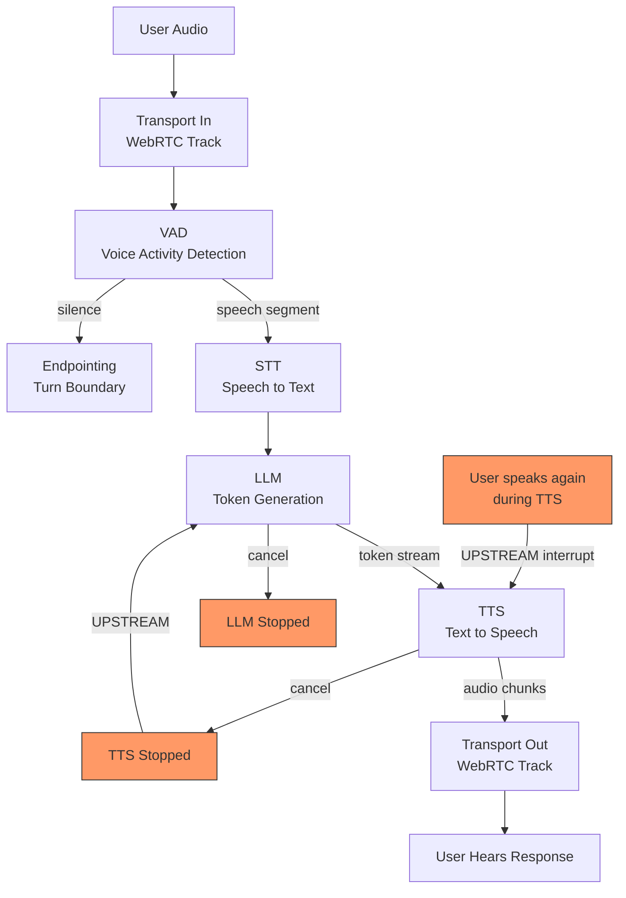

# Voice Agents: Pipecat and LiveKit

## Learning Objectives

- Build a frame-based voice pipeline connecting VAD, STT, LLM, TTS, and transport stages
- Trace audio frames through DOWNSTREAM (source→sink) and UPSTREAM (control) pipeline directions
- Compute per-stage latency and compare results against a 600ms production budget
- Implement interruption handling that cancels in-flight TTS when a user barges in
- Configure a WebRTC transport as the pipeline's audio source and sink, and explain why HTTP cannot serve that role

## The Problem

Voice agents are not a text chatbot with TTS bolted on the end. The moment you try to chain speech-to-text, LLM inference, and text-to-speech in a synchronous request-response loop, you hit a wall: the user speaks, waits in silence while your server transcribes, generates, and synthesizes, and only then hears a response. At 800ms+ of dead air, the conversation feels broken. At 1.5 seconds, the user hangs up.

The budget is approximately 600 milliseconds end-to-end for a production-grade stack, and that number is not arbitrary. Conversational fluency degrades rapidly above 500ms of response latency — the caller starts talking over the bot, the bot starts talking over the caller, and turn detection collapses. Every millisecond you add to STT inference, LLM token generation, or TTS synthesis comes out of the same budget. There is no "fast enough" — there is only "under budget" or "over budget."

The transport layer matters too. HTTP is request-response: the client sends audio, waits for a complete response, and plays it. That model adds buffering latency at both ends and provides no mechanism for the server to push audio back the instant the first TTS chunk is ready. WebRTC solves this by maintaining a persistent, bidirectional, low-latency audio stream — the server can push the first synthesized syllable while the LLM is still generating the rest of the sentence. Without WebRTC (or an equivalent real-time transport), you lose the streaming behavior that makes sub-600ms response times possible.

Then there is turn-taking. In text chat, the user submits and the assistant responds — the boundary is explicit. In voice, the user pauses mid-sentence, coughs, breathes, or the background noise spikes. You need a voice activity detection (VAD) model to segment continuous audio into speech chunks, and you need endpointing logic to decide when a pause means "I'm done talking" versus "I'm thinking." And when the bot is mid-sentence and the user interrupts, you need to cancel the in-flight TTS audio immediately — not finish the sentence and then respond. This is interruption handling, and without it, the agent sounds like it is talking to itself.

## The Concept

A voice agent pipeline is a chain of frame processors. Each processor receives a frame (a typed unit of data — an audio chunk, a transcript segment, an LLM token, a TTS audio buffer), transforms it, and passes the result to the next processor. This is not a function call chain — it is a continuous stream where frames flow in two directions.

DOWNSTREAM flow carries data from source to sink: raw audio enters at the transport, flows through VAD (which detects speech segments), into STT (which transcribes), into the LLM (which generates a response token-by-token), into TTS (which converts each token to audio), and back out through the transport. The downstream direction is the "talk path" — audio in, audio out.

UPSTREAM flow carries control signals from sink back toward source. When VAD detects that the user has started speaking again while TTS is still playing audio, an interrupt signal travels upstream: TTS stops synthesizing, the LLM cancels its remaining token generation, and the transport stops sending audio to the speaker. Without upstream control, there is no barge-in — the bot finishes its sentence regardless of what the user says.

Pipecat implements this frame-based pipeline in Python. You define a chain of `FrameProcessor` objects — each one wraps a service (Deepgram for STT, OpenAI for LLM, ElevenLabs for TTS) and exposes a consistent interface: frames in, frames out. A `PipelineTask` manages the lifecycle, firing events like `on_pipeline_started` and `on_idle_timeout`. Pipecat also provides `PipecatFlows` for structured conversations — state machines that enforce a qualification script, for example — which matters for GTM use cases where the bot must ask specific questions in sequence.

LiveKit provides the transport. It implements WebRTC negotiation, manages audio tracks (one for the user's microphone, one for the bot's synthesized speech), and handles the room abstraction — multiple participants can join, and the bot is just another participant streaming audio. LiveKit's `Agents` framework adds an `AgentSession` class that bridges the WebRTC transport to AI model services, and a `VoicePipelineAgent` that wires STT → LLM → TTS into a turn-taking loop with built-in interruption handling. You can also use Pipecat with a LiveKit transport directly, giving you Pipecat's pipeline flexibility with LiveKit's WebRTC infrastructure.

The latency budget breaks down roughly like this: transport in ~30-50ms, VAD ~5-15ms, STT ~100-200ms (streaming, first-token latency), LLM ~150-300ms (time to first token), TTS ~80-150ms (time to first audio chunk), transport out ~30-50ms. Sum the lower bounds and you get ~395ms — feasible. Sum the upper bounds and you get ~765ms — over budget. The difference between a good voice agent and a broken one is which providers you chose at each stage and whether you pipeline them (start TTS on the first LLM token rather than waiting for the full response).

## Build It

The fastest way to understand the pipeline is to simulate one