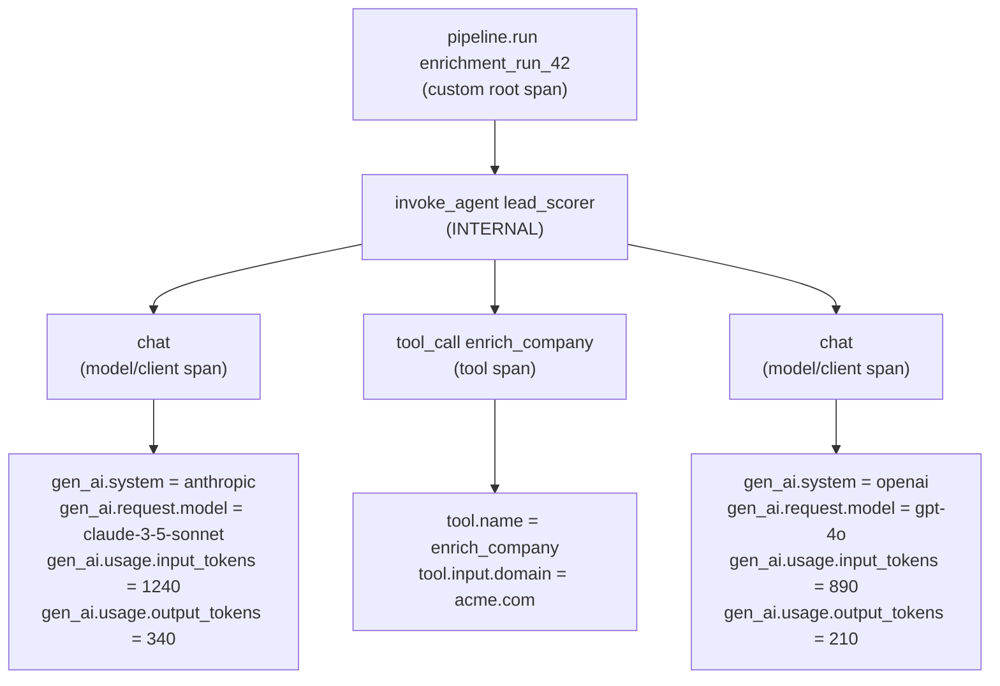

# OpenTelemetry GenAI Semantic Conventions

## Learning Objectives

- Implement GenAI semantic conventions on a raw LLM call using manual OTel spans with the correct attribute names for provider, model, and token usage
- Compare span attributes emitted by different providers under the same convention schema to prove cross-provider aggregation works
- Configure content-capture opt-in via `OTEL_SEMCONV_STABILITY_OPT_IN` and explain why prompt body capture defaults to off
- Compute cost-per-enrichment-run by grouping GenAI span attributes by model and pipeline correlation ID
- Trace a multi-step enrichment pipeline's token spend back to the originating input record using parent-child span relationships

## The Problem

Every LLM provider SDK instruments telemetry differently. Anthropic's SDK logs token counts under one key shape, OpenAI's under another, and Bedrock wraps everything behind an AWS-specific event format. If you run a Clay waterfall enrichment that calls three different models in sequence — say, Claude to classify industry, GPT-4o to score intent, then Claude again to draft a personalized opener — you end up with three incompatible telemetry streams. Your observability backend shows three separate traces with no shared vocabulary. You cannot answer "how much did enriching Acme Corp cost across all model calls?" without writing custom parsers per provider.

The practical consequence is that cost attribution becomes a manual exercise. You export billing CSVs from each provider console, manually reconcile timestamps against pipeline runs, and still miss the per-call granularity that tells you *which* step in the enrichment burned the most tokens. This is the observability gap the OpenTelemetry GenAI Special Interest Group set out to close in April 2024.

The deeper problem is not just parsing — it is semantic alignment. Even if every provider exported JSON, "input tokens" in Anthropic's API and "prompt tokens" in OpenAI's API refer to the same concept but use different names. Without a shared dictionary, every dashboard, alert rule, and cost report is bespoke. The GenAI semantic conventions define that dictionary so that a span emitted by an Anthropic call and a span emitted by an OpenAI call carry identically named attributes for the same underlying concepts.

## The Concept

Semantic conventions are a pre-agreed dictionary of span attribute names and values. The OpenTelemetry GenAI SIG defines attributes like `gen_ai.system` (the provider: `anthropic`, `openai`, `aws.bedrock`), `gen_ai.request.model` (the model ID string), `gen_ai.usage.input_tokens`, and `gen_ai.usage.output_tokens`. Any OTel-instrumented SDK that adopts these conventions emits the same keys for the same concepts. Your backend — whether Jaeger, Honeycomb, Datadog, or Grafana Tempo — parses, aggregates, and alerts on those attributes without provider-specific custom logic.

The conventions define three span categories. **Model/client spans** wrap raw LLM API calls and carry the usage attributes you need for cost analysis. **Agent spans** (`invoke_agent`) wrap the orchestration loop of an agent framework — LangGraph, CrewAI, a custom ReAct loop — and carry the agent's name and configuration. **Tool spans** wrap individual tool executions invoked by the agent. These nest as parent-child: an agent span is the parent of the model and tool spans it orchestrates, which means you can walk the span tree to attribute total cost back to the agent run that incurred it.

Agent span naming follows a template: `invoke_agent {gen_ai.agent.name}` if the agent has a name, otherwise just `invoke_agent`. The span kind distinguishes how the agent runs. A **CLIENT** span means the agent is a remote service — OpenAI Assistants API, Bedrock Agents — where your code calls an external endpoint. An **INTERNAL** span means the agent runs in-process — LangChain, CrewAI, or a hand-rolled loop. This distinction matters for sampling: remote agent calls cross network boundaries and may need different sampling rates than in-process orchestration.

Content capture — logging the actual prompt and response text — is opt-in by default. The conventions specify that sensitive content (user prompts, model completions) should not be captured unless you explicitly enable it. You opt in by setting the environment variable `OTEL_SEMCONV_STABILITY_OPT_IN` to include `gen_ai` and configuring capture settings in your instrumentation library. The recommendation is to capture external references (document IDs, image URLs) rather than raw content, reducing both privacy risk and storage cost. This is particularly relevant for GTM pipelines where prompts may contain customer PII scraped from LinkedIn or company websites.

The span tree below shows how GenAI attributes attach to different span types in a typical enrichment pipeline:



Both model/client spans emit the same attribute names (`gen_ai.system`, `gen_ai.request.model`, `gen_ai.usage.input_tokens`, `gen_ai.usage.output_tokens`) despite calling different providers. This is the mechanism that makes cross-provider aggregation possible — your cost dashboard groups by `gen_ai.request.model` and sums `gen_ai.usage.input_tokens` regardless of which provider SDK emitted the span.

## Build It

To see the conventions in action, you need the OpenTelemetry SDK and a console exporter that prints span attributes to stdout. Install the required packages first:

```bash
pip install opentelemetry-api opentelemetry-sdk
```

The code below creates two manual spans that simulate LLM calls to different providers. Each span carries the GenAI convention attributes. The `SimpleSpanProcessor` with `ConsoleSpanExporter` prints each span's full attribute set as JSON when it ends, so you can verify the convention keys appear correctly.

```python
from opentelemetry import trace
from opentelemetry.sdk.trace import TracerProvider
from opentelemetry.sdk.trace.export import SimpleSpanProcessor, ConsoleSpanExporter

provider = TracerProvider()
exporter = ConsoleSpanExporter()
provider.add_span_processor(SimpleSpanProcessor(exporter))
trace.set_tracer_provider(provider)
tracer = trace.get_tracer("genai-conventions-demo")


def simulate_llm_call(provider_name, model, input_text, input_tokens, output_tokens):
    with tracer.start_as_current_span("chat") as span:
        span.set_attribute("gen_ai.system", provider_name)
        span.set_attribute("gen_ai.request.model", model)
        span.set_attribute("gen_ai.operation.name", "chat")
        span.set_attribute("gen_ai.usage.input_tokens", input_tokens)
        span.set_attribute("gen_ai.usage.output_tokens", output_tokens)
        response = f"[{model}] Processed {len(input_text)} chars of input"
        span.set_attribute("gen_ai.response.finish_reason", "stop")
        return response


result_anthropic = simulate_llm_call(
    "anthropic",
    "claude-3-5-sonnet",
    "Score this lead: Acme Corp, 500 employees, Series B",
    input_tokens=1240,
    output_tokens=340,
)

result_openai = simulate_llm_call(
    "openai",
    "gpt-4o",
    "Draft a personalized opener for Acme Corp based on their recent funding",
    input_tokens=890,
    output_tokens=210,
)

print(f"\nAnthropic result: {result_anthropic}")
print(f"OpenAI result: {result_openai}")
print(f"\nBoth spans emitted identical attribute names despite different providers.")
```

When you run this, the console exporter prints two JSON span objects. Look for the `attributes` key in each — both spans contain `gen_ai.system`, `gen_ai.request.model`, `gen_ai.usage.input_tokens`, and `gen_ai.usage.output_tokens`. The values differ (different provider names, different model IDs, different token counts) but the keys are identical. That is the entire point of semantic conventions: same keys, different values, uniform parsing.

Now let us build a realistic enrichment pipeline span tree. This creates a parent pipeline span, a child agent span, and two grandchild model spans — the structure you would see in a Clay waterfall enrichment that calls multiple models per company:

```python
from opentelemetry import trace
from opentelemetry.sdk.trace import TracerProvider
from opentelemetry.sdk.trace.export import SimpleSpanProcessor, ConsoleSpanExporter
from opentelemetry.trace import SpanKind

provider = TracerProvider()
provider.add_span_processor(SimpleSpanProcessor(ConsoleSpanExporter()))
trace.set_tracer_provider(provider)
tracer = trace.get_tracer("enrichment-pipeline")


def enrich_company(domain, run_id):
    with tracer.start_as_current_span("pipeline.run") as pipeline:
        pipeline.set_attribute("pipeline.run_id", run_id)
        pipeline.set_attribute("pipeline.input.domain", domain)
        pipeline.set_attribute("pipeline.step", "enrich_company")

        with tracer.start_as_current_span(
            "invoke_agent lead_scorer", kind=SpanKind.INTERNAL
        ) as agent:
            agent.set_attribute("gen_ai.agent.name", "lead_scorer")

            with tracer.start_as_current_span("chat") as step1:
                step1.set_attribute("gen_ai.system", "anthropic")
                step1.set_attribute("gen_ai.request.model", "claude-3-5-sonnet")
                step1.set_attribute("gen_ai.operation.name", "chat")
                step1.set_attribute("gen_ai.usage.input_tokens", 1240)
                step1.set_attribute("gen_ai.usage.output_tokens", 340)

            with tracer.start_as_current_span("chat") as step2:
                step2.set_attribute("gen_ai.system", "openai")
                step2.set_attribute("gen_ai.request.model", "gpt-4o")
                step2.set_attribute("gen_ai.operation.name", "chat")
                step2.set_attribute("gen_ai.usage.input_tokens", 890)
                step2.set_attribute("gen_ai.usage.output_tokens", 210)

    return f"Enriched {domain} (run {run_id}): 2 model calls, 2680 total tokens"


result = enrich_company("acme.com", "enrich_2024_001")
print(f"\n{result}")
```

The output shows four spans with a clear parent-child hierarchy. The pipeline span is the root. The agent span is its child. Both model spans are children of the agent span. This tree structure is what lets you walk from any leaf span (a single LLM call) up to its pipeline run — and that is how you attribute token cost back to the input company that triggered the enrichment.

## Use It

The GenAI semantic conventions map directly onto the **AI Enrichment** cluster in Zone 2. When your Clay waterfall or custom enrichment agent calls an LLM to score leads, extract firmographics, or draft personalization, each call emits a model/client span with `gen_ai.request.model` and token usage attributes. By adding a custom `pipeline.run_id` attribute to every span in the tree, you create a join key that links every token spent back to the specific enrichment run — and therefore to the specific input company.

This is the observability layer for Zone 14's cost management mandate: "Every Clay credit is a token cost — optimize like you would LLM calls" [CITATION NEEDED — concept: Clay credit