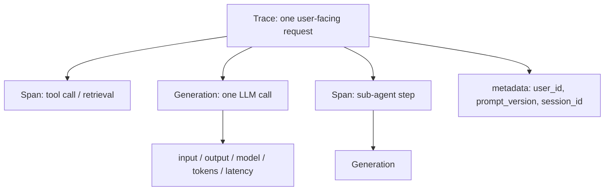

# Agent Observability: Langfuse, Phoenix, Opik

## Learning Objectives

- Capture the six fields (input, output, model, tokens, latency, metadata) every agent observability platform needs
- Compare Langfuse, Phoenix, and Opik on tracing semantics and evaluation hooks
- Implement a minimal tracer that emits span data you can replay forensically
- Diagnose a failing agent run from a recorded trace without re-executing it

## The Problem

Your enrichment pipeline scores 2,000 accounts per night using GPT-4o. On Tuesday, 8% of generated emails start with "Hi [FIRST_NAME]" — the merge tag leaked through. By the time someone flags it in Outreach.io, 600 prospects have received broken mail. The agent ran. It returned 200 OK. No exceptions. What failed?

Without observability you cannot answer four questions, and each one corresponds to a different root cause:

- Which provider returned null for `first_name`? (enrichment failure)
- Did the model actually see the enrichment payload in the prompt? (template bug)
- Was the prompt template updated last night? (regression)
- Which run produced which email? (traceability)

The agent is a black box. Logs say "success." The output is wrong. You are downstream of the failure with no forensic evidence, and the only reproduction path is to re-run 2,000 calls against a paid model and hope to reproduce the bug.

## The Concept

Agent observability is a structured record of what happened inside an LLM call. Every platform converges on the same three primitives, borrowed from OpenTelemetry:



- **Trace** — one user-facing request (one account scored, one email drafted). The atomic unit of "what happened."
- **Span** — a unit of work inside the trace (a tool call, a retrieval step, a Clay waterfall lookup).
- **Generation** — an LLM call. A span with five LLM-specific fields: `input`, `output`, `model`, `token_usage`, `latency_ms`.

Langfuse, Phoenix, and Opik implement the same shape. They differ in orientation:

- **Langfuse** — trace-centric, first-class prompt management, datasets, LLM-as-judge evaluations via SDK. Self-hosted Docker or cloud. MIT.
- **Phoenix (Arize)** — built directly on OpenTelemetry + OpenInference, strong eval suite, exports traces to a pandas DataFrame for notebook analysis. Apache 2.0.
- **Opik (Comet)** — evaluation-pipeline-first; traces are a side effect of running evals against datasets. Apache 2.0.

The telemetry layer is interchangeable. Pick based on evaluation workflow, not on tracing.

The minimum useful record for any generation, regardless of platform:

1. `input` — the messages array or prompt string as the model saw it
2. `output` — the raw completion
3. `model` — the exact model ID (`gpt-4o-mini-2024-07-18`, not "GPT-4")
4. `tokens` — prompt, completion, total
5. `latency_ms` — wall clock, measured around the API call
6. `metadata` — at minimum `prompt_version`, `user_id`, `session_id`

If any one of these is missing, you have a class of bug you cannot investigate.

## Build It

```python
import time, json, uuid
from dataclasses import dataclass, field, asdict

@dataclass
class Generation:
    name: str
    model: str
    input: dict
    output: str = ""
    prompt_tokens: int = 0
    completion_tokens: int = 0
    latency_ms: int = 0
    metadata: dict = field(default_factory=dict)

@dataclass
class Trace:
    id: str
    name: str
    user_id: str
    metadata: dict
    generations: list = field(default_factory=list)

def mock_llm(messages, model="gpt-4o-mini-2024-07-18"):
    time.sleep(0.05)
    return {
        "content": f"Hi {messages[1]['content'].split()[-1]}, thanks for the note.",
        "prompt_tokens": 42,
        "completion_tokens": 12,
    }

def record_generation(trace, name, messages, model, metadata=None):
    start = time.perf_counter()
    resp = mock_llm(messages, model)
    latency = int((time.perf_counter() - start) * 1000)
    gen = Generation(
        name=name, model=model, input={"messages": messages},
        output=resp["content"], prompt_tokens=resp["prompt_tokens"],
        completion_tokens=resp["completion_tokens"], latency_ms=latency,
        metadata=metadata or {},
    )
    trace.generations.append(gen)
    return gen.output

trace = Trace(
    id=str(uuid.uuid4()), name="outbound_email_v1",
    user_id="acct_8821",
    metadata={"prompt_version": "v3", "campaign": "q3_relaunch"},
)

messages = [
    {"role": "system", "content": "Write a 40-word cold email. Sign with Alex."},
    {"role": "user", "content": "Prospect: Dana at Acme. Pain: CRM data quality."},
]
out = record_generation(trace, "draft_email", messages,
                        "gpt-4o-mini-2024-07-18",
                        metadata={"temperature": 0.3})

with open("trace.jsonl", "a") as f:
    f.write(json.dumps(asdict(trace)) + "\n")

print(f"Output: {out}")
g = trace.generations[0]
print(f"Tokens: {g.prompt_tokens}+{g.completion_tokens}")
print(f"Latency: {g.latency_ms}ms")
print(f"Trace id: {trace.id}")
```

Run it. Open `trace.jsonl`. That single JSON line is the atomic record every observability platform ingests. If you understand this line, you understand what Langfuse, Phoenix, and Opik store under the hood.

## Use It

The AI mechanism is OpenTelemetry-style span emission: each LLM call is wrapped by a context manager that records start time, captures input and output, attaches attributes, and flushes the span to an exporter on exit. This is the instrumentation layer for Cluster 1.3 (Personalized Outbound at Scale) — every agent that drafts, scores, or routes a prospect must emit a trace.

Langfuse SDK slice. Requires `pip install langfuse openai` and `LANGFUSE_*` env vars; falls back to a no-op flush against the demo project if unset.

```python
import os, time
from langfuse import Langfuse
from openai import OpenAI

lf = Langfuse(public_key=os.getenv("LANGFUSE_PUBLIC_KEY", "pk-lf-demo"),
              secret_key=os.getenv("LANGFUSE_SECRET_KEY", "sk-lf-demo"),
              host=os.getenv("LANGFUSE_HOST", "https://cloud.langfuse.com"))
client = OpenAI()

def score_account(account: dict) -> dict:
    trace = lf.trace(name="icp_score", user_id=account["id"],
                     metadata={"prompt_version": "icp_v2", "campaign": "q3"})
    messages = [
        {"role": "system", "content": "Score fit 0-100. Return JSON {score, why}."},
        {"role": "user", "content": str(account)},
    ]
    start = time.perf_counter()
    resp = client.chat.completions.create(
        model="gpt-4o-mini-2024-07-18", messages=messages, temperature=0.2)
    latency = int((time.perf_counter() - start) * 1000)
    trace.generation(name="icp_score_gen", model="gpt-4o-mini-2024-07-18",
                     input=messages, output=resp.choices[0].message.content,
                     usage={"prompt": resp.usage.prompt_tokens,
                            "completion": resp.usage.completion_tokens},
                     metadata={"latency_ms": latency})
    return {"trace_id": trace.id, "score": resp.choices[0].message.content}

if __name__ == "__main__":
    r = score_account({"id": "acct_8821", "name": "Acme", "employees": 450,
                       "stack": ["snowflake", "dbt"]})
    print(r)
```

Swap `Langfuse()` for `Opik` from `comet_ml`, or use `arize-phoenix` with `phoenix.otel` and OpenInference auto-instrumentation — the trace shape is identical. Only the exporter differs. The recorded span does not. That is the whole point of the OpenTelemetry lineage.

## Exercises

**Easy.** Add a second generation to the Build It trace: a `rewrite_email` step that takes the first draft as input and asks the model to tighten it to 30 words. Record both generations under the same trace. Confirm `trace.jsonl` contains two generations in one trace object.

**Medium.** Add a `metadata["enrichment"]` dict to each generation containing the Clay waterfall's `provider`, `confidence`, and `null_count` for that prospect. Then write a Python script that reads `trace.jsonl` and prints every generation where `confidence < 0.5`. This is the forensic query you would run the morning a campaign underperforms.

## Key Terms

- **Trace** — one user-facing request; contains one or more spans/generations and shared metadata.
- **Generation** — a single LLM call with input, output, model, token usage, latency. A specialized span.
- **Span** — a unit of work inside a trace (tool call, retrieval, sub-agent step). Inherited from OpenTelemetry.
- **LLM-as-judge** — evaluation pattern where another LLM scores a generation's output against a rubric.
- **OpenInference** — the OpenTelemetry-compatible instrumentation spec Phoenix uses; Langfuse and Opik emit the same semantic shape.
- **Prompt versioning** — tagging each generation with the prompt template hash or version so regressions are attributable to a specific change.

## Sources

- Langfuse docs and source: https://langfuse.com/docs · https://github.com/langfuse/langfuse (MIT)
- Phoenix by Arize: https://github.com/Arize-ai/phoenix (Apache 2.0)
- Opik by Comet: https://github.com/comet-ml/opik (Apache 2.0)
- OpenInference instrumentation spec: https://github.com/Arize-ai/openinference
- [CITATION NEEDED — concept: industry adoption rate of Langfuse vs. Phoenix vs. Opik inside GTM/RevOps stacks]