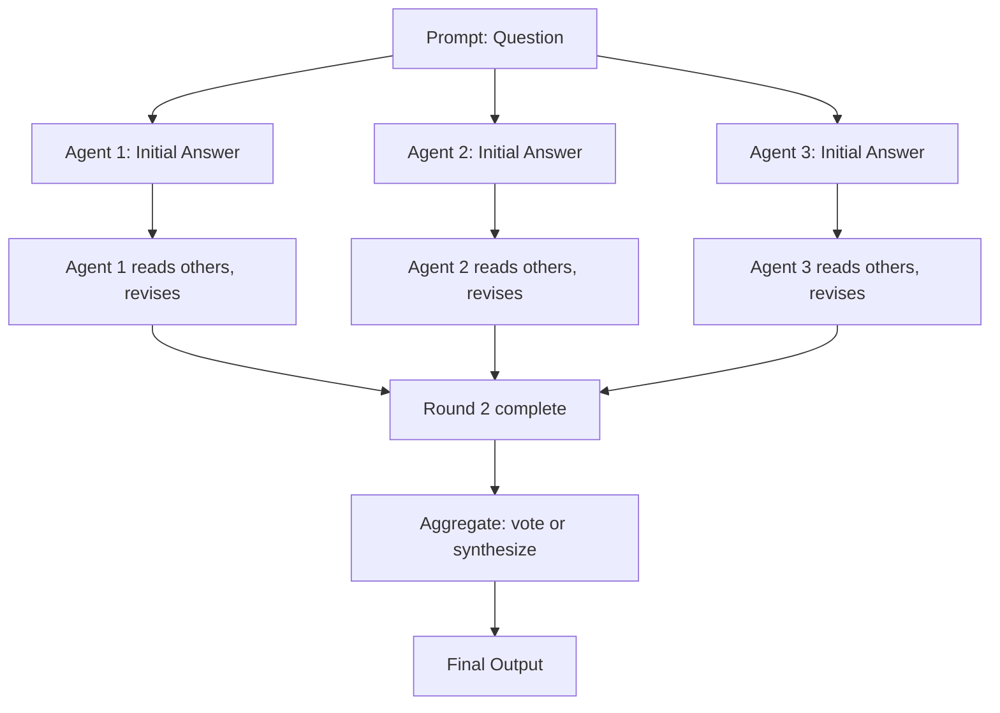

# Multi-Agent Debate and Collaboration

## Learning Objectives

1. Implement a multi-agent debate loop where N agents critique and revise each other's outputs across R rounds
2. Detect when debate produces measurably different outputs than a single-agent baseline
3. Configure agent roles with divergent instructions so their critiques are complementary, not redundant

## The Problem

You run an account scoring workflow: a single LLM call reads a company's website and returns an ICP fit score from 1–10. The model says "8 — strong fit." You push that score into HubSpot. Your AE books a meeting. The prospect has 12 employees, no budget, and no use case. The score was a hallucination.

The single-call pattern has no internal friction. Whatever the model produces on pass one is what you act on. There is no check, no dissenting opinion, no second look. In research workflows — account qualification, contact enrichment, message drafting — this is the failure mode that erodes trust in AI-generated GTM data. You either accept the output blindly or hire a human to review every call, which defeats the purpose of automation.

## The Concept

Multi-agent debate is a technique where multiple LLM instances answer the same question independently, then read each other's answers and revise. The process repeats for R rounds. After the final round, you aggregate — by vote, by synthesis, or by selecting the most defended answer.



The mechanism rests on one assumption: if three independent reasoning processes arrive at the same answer through different paths, the answer is more likely correct than if one process asserts it. This is not the same as running the same prompt three times and averaging — debate forces agents to confront specific disagreements. Agent 2 does not just produce a different number; it says "Agent 1's claim about company size is wrong because the LinkedIn data shows 12 employees, not 200."

The key design decisions:

- **Number of agents (N)**: Typically 2–4. More agents increase cost linearly and provide diminishing returns past 3. Du et al. (2023) found that 3 agents with 2 rounds captures most of the benefit.
- **Number of rounds (R)**: 2–3 rounds. Beyond that, agents tend to converge and stop producing useful critique.
- **Role assignment**: Agents can be identical (same system prompt) or role-specialized (one focuses on firmographic accuracy, one on technographic fit, one on behavioral signals). Role specialization produces more divergent initial answers, which produces sharper critique in later rounds.

The failure mode to watch for: **sycophantic convergence**. If agents are too polite or too easily swayed, round 2 answers collapse toward whichever agent sounded most confident in round 1. The debate produces consensus without rigor. This is why agent system prompts should explicitly instruct disagreement — "if you see a claim you cannot verify, challenge it."

## Build It

Install dependencies:

```bash
pip install anthropic
```

Export your API key:

```bash
export ANTHROPIC_API_KEY="sk-ant-..."
```

Run the debate:

```python
import anthropic

client = anthropic.Anthropic()

def agent_call(system_prompt, user_message):
    response = client.messages.create(
        model="claude-sonnet-4-5-20250514",
        max_tokens=1024,
        system=system_prompt,
        messages=[{"role": "user", "content": user_message}]
    )
    return response.content[0].text

def run_debate(question, num_agents=3, rounds=2):
    roles = [
        "You are a skeptical analyst. You distrust confident claims without evidence. If another agent makes a claim you cannot verify, challenge it directly.",
        "You are a data-first researcher. You prioritize quantitative signals over narrative. If another agent's reasoning lacks numbers, point it out.",
        "You are a devil's advocate. Your job is to find the strongest counterargument to whatever position seems most popular."
    ]

    answers = []
    for i in range(num_agents):
        role = roles[i] if i < len(roles) else roles[0]
        answers.append(agent_call(role, question))

    print("=== ROUND 1 INITIAL ANSWERS ===")
    for i, a in enumerate(answers):
        print(f"\n--- Agent {i+1} ---")
        print(a[:300] + "...\n")

    for round_num in range(1, rounds):
        print(f"\n=== ROUND {round_num + 1} ===")
        new_answers = []
        for i in range(num_agents):
            others = "\n\n".join(
                f"Agent {j+1} said: {answers[j]}"
                for j in range(num_agents) if j != i
            )
            critique_prompt = (
                f"Original question:\n{question}\n\n"
                f"Other agents' answers:\n{others}\n\n"
                f"Your previous answer:\n{answers[i]}\n\n"
                f"Critique the other answers. Identify specific claims you disagree with. "
                f"Then revise your own answer based on valid points raised by others."
            )
            role = roles[i] if i < len(roles) else roles[0]
            revised = agent_call(role, critique_prompt)
            new_answers.append(revised)
            print(f"Agent {i+1} revised: {revised[:200]}...\n")
        answers = new_answers

    synthesis = agent_call(
        "You are a neutral judge. Synthesize the final position from the debate.",
        f"Question: {question}\n\n" + "\n\n".join(f"Agent {i+1}: {a}" for i, a in enumerate(answers))
    )

    print("=== FINAL SYNTHESIS ===")
    print(synthesis)
    return synthesis

question = (
    "A B2B SaaS company called 'TechFlow' has 45 employees, raised a $12M Series A, "
    "uses Salesforce and Marketo, and sells to mid-market logistics companies. "
    "Our product is a RevOps platform for companies with 100-500 employees using Salesforce. "
    "Score the ICP fit from 1-10 and explain your reasoning."
)

run_debate(question, num_agents=3, rounds=2)
```

When you run this, you will see three different initial scores and reasonings, agents challenging each other's specific claims (e.g., "Agent 1 said 45 employees fits mid-market, but the ICP requires 100+"), and a final synthesis that weighs the debate.

The observable difference: a single-agent call might return a confident "7/10" with a plausible-sounding but unverified justification. The debate surfaces the employee count gap as a specific point of contention because the devil's advocate agent is instructed to find it. You pay roughly 3N×R API calls, but you get an auditable trail of disagreement.

## Use It

Multi-agent debate applies iterative adversarial refinement — multiple LLM instances critique each other's outputs to filter hallucinated or unsupported claims before they reach downstream systems. This maps to **Cluster 1.2, TAM Refinement & ICP Scoring**, where account qualification requires cross-checking signals across firmographic, technographic, and behavioral dimensions.

```python
def score_account_with_debate(company_data, icp_criteria):
    agents = [
        {"role": "You score firmographic fit. Reject if employee count is outside ICP range.", "focus": "firmographic"},
        {"role": "You score technographic fit. Reject if the tech stack doesn't match.", "focus": "technographic"},
        {"role": "You are the deal skeptic. If the score is above 5, find a reason it should be lower.", "focus": "challenge"},
    ]
    answers = []
    for a in agents:
        prompt = f"Company: {company_data}\nICP: {icp_criteria}\nScore 1-10 with reasoning."
        answers.append(agent_call(a["role"], prompt))
    revised = []
    for i, a in enumerate(agents):
        others = "\n".join(f"Agent {j+1}: {answers[j][:500]}" for j in range(3) if j != i)
        prompt = f"Other agents:\n{others}\n\nRevise your score based on their arguments."
        revised.append(agent_call(a["role"], prompt))
    return agent_call("Extract only the final score and one-line justification.", "\n\n".join(revised))

company = {"name": "TechFlow", "employees": 45, "funding": "$12M Series A", "tech": ["Salesforce", "Marketo"]}
icp = {"employees": "100-500", "tech": ["Salesforce"], "stage": "Series A+"}
print(score_account_with_debate(company, icp))
```

The cost trade-off is real: debate is roughly 3×N×R API calls versus a single call. Use it for high-stakes decisions where the downstream cost of a wrong answer exceeds the API cost — account qualification for enterprise deals, automated research that writes directly to CRM fields without human review, or any scoring that gates AE outreach.

## Exercises

1. **Change the parameters.** Modify the `run_debate` function to use 2 agents and 3 rounds. Run it on the same question and compare the final synthesis to the 3-agent, 2-round version. Note: does the additional round produce better critique or just restate round 2? Write down your observation.

2. **Add a fact-checker.** Create a fourth agent role whose sole job is to scan other agents' answers for unsupported factual claims and flag them before the revision round. Insert the fact-checker between rounds. Run the debate again and count how many flagged claims appear in round 1 versus round 2 — this tells you whether the revision rounds actually fix problems or just paper over them.

## Key Terms

- **Multi-agent debate**: A technique where multiple LLM instances independently answer the same prompt, then iteratively critique and revise based on each other's outputs across R rounds.
- **Sycophantic convergence**: A failure mode where agents agree too quickly, producing consensus without rigorous disagreement — often because agents are swayed by confident-sounding answers rather than correct ones.
- **Role specialization**: Assigning different system prompts or personas to each agent so their initial answers approach the problem from different angles, producing sharper critique in later rounds.
- **Round (R)**: One complete pass where every agent reads all other agents' answers from the previous round and revises its own.
- **Aggregation**: The final step where revised answers are combined — by voting, synthesis, or judge selection — into a single output.

## Sources

- Du, Y., Li, S., Torralba, A., et al. (2023). "Improving Factuality and Reasoning in Language Models through Multiagent Debate." arXiv:2305.14325.
- Liang, T., He, Z., Jiao, W., et al. (2023). "Encouraging Divergent Thinking in Large Language Models through Multi-Agent Debate." arXiv:2305.19118.
- [CITATION NEEDED — concept: GTM-specific cost-benefit threshold for multi-agent debate vs single-call in account scoring workflows]