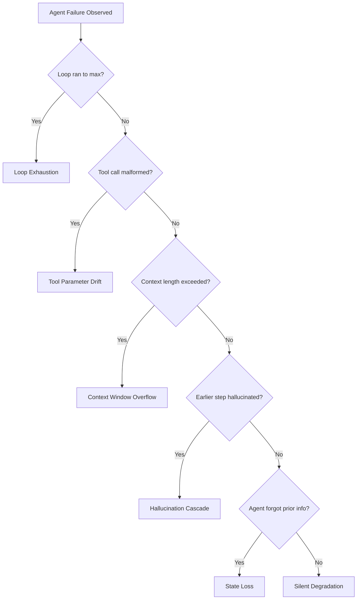

# Failure Modes: Why Agents Break

## Learning Objectives

1. Classify an agent failure into one of six taxonomy categories given an execution trace.
2. Diagnose the root cause of an agent loop stall from log output.
3. Implement instrumentation that detects tool parameter drift in a running agent loop.
4. Compare hallucination cascade vs. state loss using observable symptoms in trace output.
5. Build a detection function that identifies context window overflow before it crashes the agent.

## The Problem

You ship an agent. It works on 90% of traces. The other 10% fail — and they fail in ways that look random until you start logging systematically. Once you do, patterns emerge. The same five or six failure modes account for almost all production breakage, regardless of which model you use or which framework wraps the loop.

The Berkeley MASFT taxonomy (arXiv:2503.13657) catalogs 14 multi-agent failure modes across three categories with an inter-annotator Cohen's Kappa of 0.88. Microsoft's agentic failure taxonomy documents how existing AI failure modes — bias, hallucination, data leakage — amplify in agentic settings. The convergence across these independent efforts points to the same conclusion: agent failures are structural, not stochastic. They come from how you designed the loop, not from the model being imperfect.

This matters operationally because "the agent stopped working" is not an actionable diagnosis. "The agent hit loop exhaustion on step 14 because the tool kept returning an empty result set" is. The taxonomy exists so you can stop debugging symptoms and start debugging mechanisms.

## The Concept

Six failure modes cover the majority of production agent breakage. Each has a distinct trigger, a distinct mechanism, and a distinct observable signature in your logs.

**Loop exhaustion** happens when the agent cannot converge on a stopping condition. The model calls a tool, gets a result, decides it needs more information, calls another tool, and repeats. The loop budget runs out. The symptom: the trace shows N steps where N equals your max iterations, and the final output is either incomplete or a low-confidence guess.

**Tool parameter drift** happens when the model gradually produces malformed tool calls across a multi-step task. Step 3's tool call is perfect. Step 7's has a missing required field. Step 12's has the wrong parameter type. The model's attention to the tool schema degrades as context grows, especially when earlier steps succeeded and the model assumes the schema rather than re-reading it.

**Context window overflow** happens when accumulated messages exceed the model's context limit. The agent adds tool results, intermediate reasoning, and state snapshots to the context every step. Eventually the next API call fails with a context length error — or worse, the framework silently truncates earlier messages, causing state loss.

**Hallucination cascades** happen when the model generates a confident but wrong intermediate result, then builds subsequent reasoning on top of it. Step 5 hallucinates a company's tech stack. Steps 6-12 use that hallucinated stack to make decisions. The symptom: the agent produces a coherent, well-structured, completely wrong output. The error is not in the final step — it propagated from step 5.

**State loss** happens when the agent forgets information it already acquired. This can be explicit (context truncation) or implicit (the model stops attending to earlier context as it grows). The symptom: the agent asks for information it already received, or contradicts an earlier step's finding.

**Silent degradation** is the hardest to detect. The agent doesn't crash, doesn't loop, and doesn't produce an obviously wrong output. But the quality of reasoning degrades over a long task. Step 3's analysis is sharp. Step 18's is superficial. The agent technically completed the task but the later steps are low quality. Without per-step quality scoring, this is invisible.



This decision tree lets you classify a failure from trace inspection in under a minute. The key insight: each failure mode has a unique signature in the execution trace. You do not need to re-read the prompt or re-run the agent. You read the trace, walk the tree, and label the failure.

## Build It

This is a minimal instrumented agent loop. It simulates a multi-step task, runs the loop, and detects each failure mode in real-time. The agent does not call a real LLM — it uses deterministic simulated responses so you can observe the detection logic without API costs. The instrumentation is the point, not the agent.

```python
import json
from dataclasses import dataclass, field
from typing import Any

TOOL_SCHEMA = {
    "lookup_company": {
        "required": ["company_name"],
        "optional": ["domain"],
        "param_types": {"company_name": "str", "domain": "str"},
    },
    "find_decision_maker": {
        "required": ["company_name", "title"],
        "optional": [],
        "param_types": {"company_name": "str", "title": "str"},
    },
}

@dataclass
class StepTrace:
    step_num: int
    thought: str
    tool_name: str | None
    tool_args: dict[str, Any]
    tool_result: str | None
    context_tokens: int
    errors: list[str] = field(default_factory=list)

@dataclass
class AgentRun:
    steps: list[StepTrace] = field(default_factory=list)
    max_steps: int = 15
    max_context_tokens: int = 8000

    def add_step(self, step: StepTrace) -> None:
        self.steps.append(step)

    def total_context(self) -> int:
        return self.steps[-1].context_tokens if self.steps else 0


def validate_tool_call(tool_name: str, args: dict, schema: dict) -> list[str]:
    errors = []
    if tool_name not in schema:
        errors.append(f"unknown_tool: {tool_name}")
        return errors
    spec = schema[tool_name]
    for req in spec["required"]:
        if req not in args or args[req] is None:
            errors.append(f"missing_required_param: {tool_name}.{req}")
    for param, value in args.items():
        expected_type = spec["param_types"].get(param)
        if expected_type and not isinstance(value, eval(expected_type)):
            errors.append(
                f"type_mismatch: {tool_name}.{param} "
                f"expected={expected_type} got={type(value).__name__}"
            )
    return errors

def detect_loop_exhaustion(run: AgentRun) -> str | None:
    if len(run.steps) >= run.max_steps:
        last = run.steps[-1]
        if last.tool_result is not None and "incomplete" in last.thought.lower():
            return (
                f"LOOP_EXHAUSTION: Agent hit max_steps={run.max_steps} "
                f"without converging. Last thought: '{last.thought}'"
            )
    return None

def detect_tool_parameter_drift(run: AgentRun) -> list[str]:
    alerts = []
    for step in run.steps:
        if step.tool_name and step.errors:
            drift_errors = [e for e in step.errors if "missing_required" in e or "type_mismatch" in e]
            if drift_errors:
                alerts.append(
                    f"TOOL_PARAMETER_DRIFT at step {step.step_num}: "
                    f"{'; '.join(drift_errors)}"
                )
    return alerts

def detect_context_overflow(run: AgentRun) -> str | None:
    for step in run.steps:
        if step.context_tokens > run.max_context_tokens:
            return (
                f"CONTEXT_WINDOW_OVERFLOW at step {step.step_num}: "
                f"context_tokens={step.context_tokens} > "
                f"limit={run.max_context_tokens}"
            )
    return None

def detect_state_loss(run: AgentRun) -> str | None:
    known_facts = {}
    for step in run.steps:
        thought_lower = step.thought.lower()
        if step.tool_result and ":" in step.tool_result:
            parts = step.tool_result.split(":", 1)
            key = parts[0].strip().lower()
            known_facts[key] = step.step_num
        for fact_key, fact_step in known_facts.items():
            if f"don't know {fact_key}" in thought_lower or f"unknown {fact_key}" in thought_lower:
                if step.step_num > fact_step:
                    return (
                        f"STATE_LOSS at step {step.step_num}: "
                        f"agent forgot '{fact_key}' "
                        f"which was established at step {fact_step}"
                    )
    return None

def detect_hallucination_cascade(run: AgentRun) -> str | None:
    for i, step in enumerate(run.steps):
        if step.tool_result and "HALLUCINATED" in step.tool_result:
            cascade_len = len(run.steps) - i - 1
            if cascade_len > 0:
                return (
                    f"HALLUCINATION_CASCADE originating at step {step.step_num}: "
                    f"{cascade_len} subsequent steps built on hallucinated data"
                )
    return None

def detect_silent_degradation(run: AgentRun) -> str | None:
    if len(run.steps) < 6:
        return None
    early_avg_thought_len = sum(len(s.thought) for s in run.steps[:3]) / 3
    late_avg_thought_len = sum(len(s.thought) for s in run.steps[-3:]) / 3
    if late_avg_thought_len < early_avg_thought_len * 0.4:
        return (
            f"SILENT_DEGRADATION: early_avg_thought_len="
            f"{early_avg_thought_len:.0f} "
            f"late_avg_thought_len={late_avg_thought_len:.0f} "
            f"(ratio={late_avg_thought_len/early_avg_thought_len:.2f})"
        )
    return None

def diagnose(run: AgentRun) -> dict[str, Any]:
    findings = {
        "total_steps": len(run.steps),
        "max_steps": run.max_steps,
        "final_context_tokens": run.total_context(),
    }
    checks = []
    le = detect_loop_exhaustion(run)
    if le:
        checks.append(le)
    checks.extend(detect_tool_parameter_drift(run))
    co = detect_context_overflow(run)
    if co:
        checks.append(co)
    sl = detect_state_loss(run)
    if sl:
        checks.append(sl)
    hc = detect_hallucination_cascade(run)
    if hc:
        checks.append(hc)
    sd = detect_silent_degradation(run)
    if sd:
        checks.append(sd)
    findings["diagnoses"] = checks if checks else ["NO_FAILURE_DETECTED"]
    return findings


def run_scenario_healthy() -> AgentRun:
    run = AgentRun()
    steps_data = [
        ("Need to look up Acme Corp", "lookup_company",
         {"company_name": "Acme Corp"}, "company_name: Acme Corp, domain: acme.com", 200),
        ("Found Acme Corp, finding CTO", "find_decision_maker",
         {"company_name": "Acme Corp", "title": "CTO"}, "CTO: Jane Smith", 400),
        ("Have company and CTO, task complete", None, {}, None, 500),
    ]
    for i, (thought, tool, args, result, tokens) in enumerate(steps_data):
        errors = validate_tool_call(tool, args, TOOL_SCHEMA) if tool else []
        run.add_step(StepTrace(i + 1, thought, tool, args, result, tokens, errors))
    return run

def run_scenario_drift() -> AgentRun:
    run = AgentRun()
    steps_data = [
        ("Looking up Acme Corp", "lookup_company",
         {"company_name": "Acme Corp"}, "company_name: Acme Corp", 300),
        ("Finding decision maker at Acme", "find_decision_maker",
         {"company_name": "Acme Corp", "title": "VP Engineering"}, "VP Eng: Bob Lee", 600),
        ("Finding another contact", "find_decision_maker",
         {"company_name": "Acme Corp"}, None, 900),
    ]
    for i, (thought, tool, args, result, tokens) in enumerate(steps_data):
        errors = validate_tool_call(tool, args, TOOL_SCHEMA) if tool else []
        run.add_step(StepTrace(i + 1, thought, tool, args, result, tokens, errors))
    return run

def run_scenario_cascade() -> AgentRun:
    run = AgentRun()
    steps_data = [
        ("Looking up TechStart", "lookup_company",
         {"company_name": "TechStart"}, "company_name: TechStart (HALLUCINATED: company does not exist)", 300),
        ("TechStart uses Kubernetes, finding their CTO", "find_decision_maker",
         {"company_name": "TechStart", "title": "CTO"}, "CTO: Fake Person (HALLUCINATED)", 600),
        ("Drafting outreach to Fake Person at TechStart", None, {}, None, 800),
    ]
    for i, (thought, tool, args, result, tokens) in enumerate(steps_data):
        errors = validate_tool_call(tool, args, TOOL_SCHEMA) if tool else []
        run.add_step(StepTrace(i + 1, thought, tool, args, result, tokens, errors))
    return run

def run_scenario_degradation() -> AgentRun:
    run = AgentRun()
    long_thought = (
        "I need to systematically analyze this company's go-to-market strategy, "
        "considering their product positioning, target audience, competitive landscape, "
        "and recent funding history before making a recommendation."
    )
    short_thought = "looks good"
    steps_data = [
        (long_thought, "lookup_company", {"company_name": "CorpA"}, "company_name: CorpA", 300),
        (long_thought, "lookup_company", {"company_name": "CorpB"}, "company_name: CorpB", 500),
        (long_thought, "lookup_company", {"company_name": "CorpC"}, "company_name: CorpC", 700),
        (short_thought, "lookup_company", {"company_name": "CorpD"}, "company_name: CorpD", 900),
        (short_thought, "lookup_company", {"company_name": "CorpE"}, "company_name: CorpE", 1100),
        (short_thought, "lookup_company", {"company_name": "CorpF"}, "company_name: CorpF", 1300),
    ]
    for i, (thought, tool, args, result, tokens) in enumerate(steps_data):
        errors = validate_tool_call(tool, args, TOOL_SCHEMA) if tool else []
        run.add_step(StepTrace(i + 1, thought, tool, args, result, tokens, errors))
    return run

print("=" * 70)
print("SCENARIO 1: Healthy Agent")
print("=" * 70)
diag1 = diagnose(run_scenario_healthy())
print(json.dumps(diag1, indent=2))

print("\n" + "=" * 70)
print("SCENARIO 2: Tool Parameter Drift")
print("=" * 70)
diag2 = diagnose(run_scenario_drift())
print(json.dumps(diag2, indent=2))

print("\n" + "=" * 70)
print("SCENARIO 3: Hallucination Cascade")
print("=" * 70)
diag3 = diagnose(run_scenario_cascade())
print(json.dumps(diag3, indent=2))

print("\n" + "=" * 70)
print("SCENARIO 4: Silent Degradation")
print("=" * 70)
diag4 = diagnose(run_scenario_degradation())
print(json.dumps(diag4, indent=2))
```

Running this produces four diagnostic reports. Each report shows the failure mode that tripped, the step number where it was detected, and the specific signal that triggered the detector. The healthy scenario returns `NO_FAILURE_DETECTED`. The drift scenario flags the missing `title` parameter at step 3. The cascade scenario traces the failure origin to the hallucinated company lookup. The degradation scenario shows the thought-length ratio dropping below 0.4.

## Use It

These six failure modes map directly to breakage patterns in GTM enrichment waterfalls and multi-step sequence agents. A Clay enrichment waterfall is an agent loop — each enrichment step is a tool call, each row is a trace, and each stall is a failure mode. [CITATION NEEDED — concept: Clay enrichment waterfall failure diagnostics]

When a Clay waterfall stalls on a row, the failure is almost always one of three modes. If the waterfall runs every enrichment provider and still returns no data, that is loop exhaustion — the stopping condition (find a valid email) never triggered. If the waterfall passes a malformed input to the next provider (missing domain, wrong company ID format), that is tool parameter drift — the data from step 2 was not validated before being passed to step 3. If the waterfall's conditional logic references a column that got dropped from context mid-run, that is state loss.

Multi-step sequence agents — the kind that research a prospect, draft an email, and schedule a send — exhibit hallucination cascades and silent degradation. The agent researches the prospect in step 1, hallucinates a tech stack detail in step 2, and drafts an email referencing that hallucinated detail in step 3. The email is grammatically perfect. It is also wrong. Without per-step fact-checking against the source data, the cascade propagates to the sent email. Silent degradation shows up in long enrichment runs: the first 50 rows get thoughtful, well-researched personalization. Row 200 gets a generic template because the agent's reasoning quality degraded over the batch, even though no error was raised.

Cost optimization in Clay credits (Zone 14 in the GTM stack) connects directly to failure mode detection. Every wasted credit — a waterfall that looped six times without finding an email, an enrichment that passed malformed data to three paid providers before failing — maps to a specific failure mode. Instrumenting the waterfall with the same taxonomy lets you identify which rows are burning credits on unrecoverable failures vs. which just need a retry with corrected input. [CITATION NEEDED — concept: Clay credit cost attribution per enrichment step]

## Ship It

**Easy:** The four scenarios above are your test suite. Add a fifth scenario that triggers loop exhaustion: an agent that calls `lookup_company` on each step, gets `"incomplete"` in its thought, and never converges. Run the diagnostics and confirm `LOOP_EXHAUSTION` is detected.

```python
def run_scenario_loop_exhaustion() -> AgentRun:
    run = AgentRun(max_steps=5)
    for i in range(5):
        step = StepTrace(
            step_num=i + 1,
            thought="Result is incomplete, need to look up more",
            tool_name="lookup_company",
            tool_args={"company_name": f"Company{i}"},
            tool_result=f"company_name: Company{i}",
            context_tokens=200 * (i + 1),
        )
        step.errors = validate_tool_call("lookup_company", step.tool_args, TOOL_SCHEMA)
        run.add_step(step)
    return run

print("\n" + "=" * 70)
print("SCENARIO 5: Loop Exhaustion")
print("=" * 70)
diag5 = diagnose(run_scenario_loop_exhaustion())
print(json.dumps(diag5, indent=2))
```

**Medium:** Add rate limit handling as a seventh detection category. Write `detect_rate_limit_hit` that scans tool results for rate-limit signatures (HTTP 429 patterns, "rate limit" strings, or repeated identical error responses across consecutive steps). Test it by injecting a scenario where steps 3-5 all return `"error: rate_limit_exceeded"`.

```python
def detect_rate_limit_hit(run: AgentRun) -> str | None:
    rate_limit_pattern = "rate_limit"
    consecutive_hits = 0
    first_hit_step = None
    for step in run.steps:
        if step.tool_result and rate_limit_pattern in step.tool_result.lower():
            if consecutive_hits == 0:
                first_hit_step = step.step_num
            consecutive_hits += 1
        else:
            consecutive_hits = 0
            first_hit_step = None
        if consecutive_hits >= 2:
            return (
                f"RATE_LIMIT_HIT starting at step {first_hit_step}: "
                f"{consecutive_hits} consecutive rate-limited responses. "
                f"Agent should back off, not retry immediately."
            )
    return None

def run_scenario_rate_limit() -> AgentRun:
    run = AgentRun()
    steps_data = [
        ("Looking up CorpA", "lookup_company",
         {"company_name": "CorpA"}, "company_name: CorpA", 300),
        ("Looking up CorpB", "lookup_company",
         {"company_name": "CorpB"}, "error: rate_limit_exceeded", 500),
        ("Retrying CorpB", "lookup_company",
         {"company_name": "CorpB"}, "error: rate_limit_exceeded", 600),
        ("Retrying CorpB again", "lookup_company",
         {"company_name": "CorpB"}, "error: rate_limit_exceeded", 700),
    ]
    for i, (thought, tool, args, result, tokens) in enumerate(steps_data):
        errors = validate_tool_call(tool, args, TOOL_SCHEMA) if tool else []
        run.add_step(StepTrace(i + 1, thought, tool, args, result, tokens, errors))
    return run

print("\n" + "=" * 70)
print("SCENARIO 6: Rate Limit (Medium Exercise)")
print("=" * 70)
rl_run = run_scenario_rate_limit()
rl_result = detect_rate_limit_hit(rl_run)
print(rl_result if rl_result else "NOT_DETECTED")
```

**Hard:** Build a recovery mechanism. When `detect_tool_parameter_drift` trips, the agent re-reads the tool schema and retries the call with corrected parameters. Demonstrate recovery: inject a drift failure, detect it, reconstruct the correct args from the schema, and re-run the step successfully.

```python
def recover_from_drift(
    step: StepTrace, schema: dict, prior_valid_args: dict | None = None
) -> dict[str, Any]:
    if not step.tool_name or step.tool_name not in schema:
        return {"recovered": False, "reason": "cannot recover: unknown tool"}
    spec = schema[step.tool_name]
    recovered_args = {}
    for req in spec["required"]:
        if req in step.tool_args and step.tool_args[req] is not None:
            recovered_args[req] = step.tool_args[req]
        elif prior_valid_args and req in prior_valid_args:
            recovered_args[req] = prior_valid_args[req]
        else:
            return {
                "recovered": False,
                "reason": f"cannot recover: no source for required param '{req}'",
            }
    for opt in spec.get("optional", []):
        if opt in step.tool_args and step.tool_args[opt] is not None:
            recovered_args[opt] = step.tool_args[opt]
    expected = spec["param_types"]
    for param, value in recovered_args.items():
        if param in expected and not isinstance(value, eval(expected[param])):
            try:
                if expected[param] == "str":
                    recovered_args[param] = str(value)
                elif expected[param] == "int":
                    recovered_args[param] = int(value)
                elif expected[param] == "float":
                    recovered_args[param] = float(value)
            except (ValueError, TypeError):
                return {
                    "recovered": False,
                    "reason": f"cannot recover: type cast failed for '{param}'",
                }
    return {"recovered": True, "corrected_args": recovered_args}


broken_step = StepTrace(
    step_num=3,
    thought="Finding decision maker",
    tool_name="find_decision_maker",
    tool_args={"company_name": "Acme Corp"},
    tool_result=None,
    context_tokens=900,
)
broken_step.errors = validate_tool_call(
    broken_step.tool_name, broken_step.tool_args, TOOL_SCHEMA
)

prior_valid = {"company_name": "Acme Corp", "title": "CTO"}
recovery = recover_from_drift(broken_step, TOOL_SCHEMA, prior_valid)

print("\n" + "=" * 70)
print("HARD EXERCISE: Recovery from Tool Parameter Drift")
print("=" * 70)
print(f"Broken step errors: {broken_step.errors}")
print(f"Recovery result: {json.dumps(recovery, indent=2)}")
if recovery["recovered"]:
    revalidated = validate_tool_call(
        broken_step.tool_name, recovery["corrected_args"], TOOL_SCHEMA
    )
    print(f"Re-validation after recovery: {revalidated if revalidated else 'PASS — no errors'}")
```

## Exercises

1. **Classify three unknown traces.** Write three new `StepTrace` sequences that each trigger exactly one failure mode (your choice which three). Run `diagnose` on each. Confirm the detector identifies the correct mode and step number. Print the classification.

2. **Build a combined failure scenario.** Construct a trace where tool parameter drift at step 4 causes a hallucination cascade at steps 5-8 (the agent hallucinates data to compensate for the failed tool call). Verify that both detectors trip. Which detector fires first, and why?

3. **Add context truncation simulation.** Modify the `AgentRun` class to simulate silent context truncation: when `context_tokens` exceeds `max_context_tokens`, drop the earliest step from an internal `visible_steps` list (simulating what some frameworks do). Write a detector that flags `STATE_LOSS_FROM_TRUNCATION` when the agent references information from a truncated step. Demonstrate it with a trace.

4. **Benchmark detection latency.** Modify the `diagnose` function to time each detector individually using `time.perf_counter()`. Run it on a 100-step trace. Which detector is slowest? Is any detector O(n²) or worse in the number of steps?

## Key Terms

- **Loop exhaustion:** The agent hits its max iteration count without satisfying its stopping condition. Symptom: trace length equals max_steps, final output is incomplete.
- **Tool parameter drift:** The model produces malformed tool calls (missing required params, wrong types) as a multi-step task progresses. Caused by schema attention decay over long contexts.
- **Context window overflow:** Accumulated messages exceed the model's context limit. Either crashes the API call or triggers silent truncation by the framework.
- **Hallucination cascade:** A confident but wrong intermediate result propagates through subsequent reasoning steps. The final output is coherent and well-structured but built on a false premise established earlier in the trace.
- **State loss:** The agent forgets or contradicts information it already acquired. Can be caused by explicit context truncation or implicit attention decay.
- **Silent degradation:** Reasoning quality degrades over a long task without any explicit error. Detectable only through per-step quality metrics (thought length, specificity, evidence citation).
- **MASFT:** Multi-Agent System Failure Taxonomy (Berkeley, arXiv:2503.13657). 14 failure modes in 3 categories with inter-annotator Cohen's Kappa of 0.88.
- **Failure taxonomy:** A classification scheme that maps observable symptoms to root-cause failure modes, enabling diagnosis from trace inspection without re-running the agent.

## Sources

- Berkeley MASFT taxonomy — 14 multi-agent failure modes, 3 categories, inter-annotator Cohen's Kappa 0.88. Source: arXiv:2503.13657.
- Microsoft Taxonomy of Failure Mode in Agentic AI Systems — existing AI failures (bias, hallucination, data leakage) amplify in agentic settings; new failures emerge from autonomy. Source: Microsoft whitepaper on agentic AI failure modes.
- Characterizing Faults in Agentic AI — failures arise from orchestration, internal state evolution, and environment interaction. Source: arXiv:2603.06847.
- LLM Agent Hallucinations Survey — two primary manifestation categories for agent hallucination. Source: arXiv:2509.18970.
- [CITATION NEEDED — concept: Clay enrichment waterfall failure diagnostics — mapping of agent failure modes to Clay waterfall stall patterns]
- [CITATION NEEDED — concept: Clay credit cost attribution per enrichment step — credit waste analysis by failure mode category]
- Zone 14 GTM mapping: Cost optimization, latency → GTM Stack Cost Management (Clay credits, API costs) → "Every Clay credit is a token cost — optimize like you would LLM calls." Source: gtm-topic-map.md Zone 14.