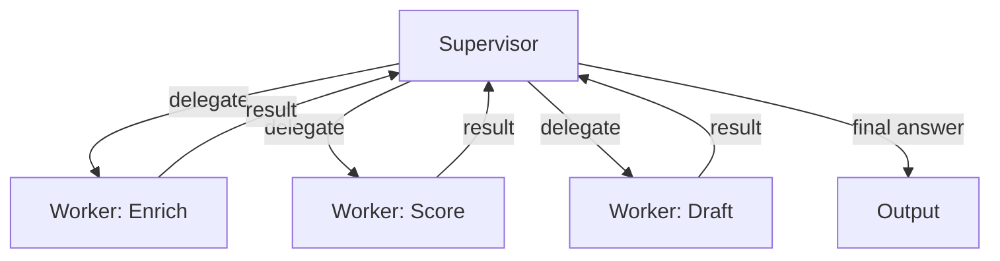
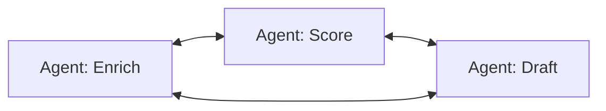
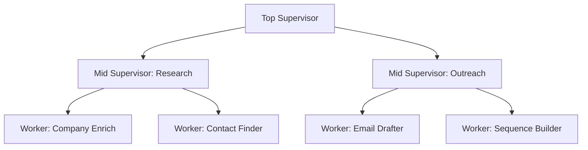

# Orchestration Patterns: Supervisor, Swarm, Hierarchical

## Learning Objectives

- Implement supervisor, swarm, and hierarchical orchestration patterns in plain Python with observable control-flow output.
- Compare the context-window, latency, and token-cost tradeoffs of each topology.
- Trace control flow through a multi-agent system and identify which pattern produced a given execution trace.
- Evaluate when a single agent with workflow patterns is sufficient and when topology choice becomes necessary.
- Map orchestration topology decisions to GTM cost constraints, specifically Clay credit and API token budgets.

## The Problem

You have three specialist agents — one enriches company data, one scores leads, one drafts outreach. Each works well alone. Now a task arrives that needs all three in sequence: enrich, score, then draft based on the score. You need them to coordinate without a human routing each step.

The naive approach is a hardcoded pipeline: call agent A, pass output to B, pass output to C. That works for three agents in a fixed sequence. But what happens when agent B's output reveals the company is out of scope, and you need to abort and return a rejection message instead of calling C? What happens when you add a fourth agent — competitive intelligence — that only runs for companies in a specific vertical? The hardcoded pipeline grows branches until it becomes unmaintainable.

This is where orchestration patterns enter. An orchestration pattern is a topology — a shape describing who can talk to whom and who decides what happens next. Three patterns cover the majority of production multi-agent systems: supervisor (one router, many workers), swarm (peer-to-peer handoffs), and hierarchical (nested supervisors). Each pattern makes a specific tradeoff between control, latency, and token cost. Choosing the wrong one means either an over-engineered system that costs 3x the API calls it needs, or an under-engineered one where agents step on each other.

Anthropic's guidance on this is direct: start with a single agent and workflow patterns (routing, parallelization, iteration). Add multi-agent topology only when a single agent's context window or capability is genuinely insufficient. This lesson implements all three patterns so you can see the mechanism, then make that call.

## The Concept

### Supervisor-Worker

The supervisor pattern has one controller agent that holds the plan and a set of specialist workers that execute pieces of it. The supervisor receives the task, decides which worker to call, dispatches, collects the result, and either calls another worker or returns the final answer. Workers never talk to each other. All communication flows through the supervisor.

The mechanism is a loop. The supervisor maintains a running state — the task description plus accumulated results — and on each iteration, it picks the next action. That action is either "call worker X with this input" or "return final answer." The supervisor's prompt typically includes the task, the current state, and descriptions of each worker's capability. The LLM call that powers the supervisor returns a routing decision, the supervisor code executes that decision, and the loop continues.



The supervisor's context window grows with every delegation because it must read prior results to decide what happens next. For three workers on a short task, this is fine. For thirty workers on a complex task, the supervisor's context becomes the bottleneck — and every token in that context is a cost. In a GTM context, each LLM call in the supervisor loop consumes API budget that could be Clay credits or inference credits elsewhere. The supervisor pattern is the easiest to debug (every decision goes through one agent you can inspect) but the most expensive in supervisor-side token usage.

### Swarm / Peer-to-Peer

The swarm pattern removes the central controller. Each agent has a tool — conventionally named `transfer_to_<agent>` — for every other agent it can hand off to. The agent currently holding the conversation decides who goes next by calling the appropriate transfer function. There is no supervisor. Control flow emerges from the sequence of LLM decisions.



The mechanism is that each agent's tool surface includes handoff functions. When the enrichment agent finishes, the LLM decides whether the next step is scoring (transfer to Score agent) or drafting (transfer to Draft agent). The runner infrastructure checks the return value of each agent call: if it is a transfer, the loop activates the target agent; if it is a final response, the loop terminates.

Swarm has lower latency than supervisor for chains of length 2+, because agent-to-agent handoffs skip the supervisor-as-middleman. But debugging is harder. There is no single log line that says "the router decided X." You have to reconstruct the decision chain from each agent's LLM call. When a GTM pipeline mis-enriches a company in a swarm, the failure could be in any agent's routing decision — and each agent made that decision independently.

### Hierarchical

The hierarchical pattern nests supervisors. A top-level supervisor delegates to mid-level supervisors, each of which manages its own workers. The mechanism is recursive: every node in the tree is either a worker (leaf) or a supervisor (internal node), and a supervisor's "workers" can themselves be supervisors.



This pattern exists to solve the supervisor's context bottleneck. A top-level supervisor managing 30 workers would need to hold all 30 worker descriptions and all accumulated results in its context window. By nesting, the top-level supervisor only needs descriptions of two mid-level supervisors. Each mid-level supervisor holds 15 workers. The context per supervisor stays manageable.

The tradeoff is latency. A task that reaches a leaf worker in a two-level hierarchy has passed through two supervisor LLM calls before the worker even starts. In a GTM pipeline processing 10,000 companies, that multiplied latency directly translates to API cost — more LLM calls per company, more tokens, higher spend. Every Clay credit spent on inference for routing is a credit not spent on data enrichment.

### The Gate: When Do You Need Topology at All?

Before choosing among these three, evaluate whether you need multi-agent topology at all. A single agent with the five workflow patterns from the prior lesson (prompt chaining, routing, parallelization, orchestrator-workers, evaluator-optimizer) handles most tasks. Multi-agent topology becomes necessary when one of these conditions holds:

- The context window cannot hold all instructions and data for the task at once (context partitioning across agents).
- Different tools require different system prompts (a research agent needs open-ended exploration; a drafting agent needs format compliance).
- Latency from sequential tool calls in a single agent exceeds the parallelization benefit of dispatching to multiple agents simultaneously.

If none of these apply, use a single agent. The orchestration overhead — in tokens, latency, and complexity — is not worth it.

## Build It

### Supervisor Pattern in Plain Python

This script implements a supervisor loop with three specialist workers. The supervisor is a simple routing function (in production, this would be an LLM call). Each worker is a plain function. The control flow prints as indented text so you can see every delegation and result.

```python
import json

WORKERS = {
    "enrich": lambda company: f"Enriched {company}: 250 employees, Series B, SaaS",
    "score": lambda company_info: f"Scored: {company_info} → 85/100 (ICP match)",
    "draft": lambda score_info: f"Draft: Hi — saw you're {score_info.split('→')[1].strip()} fit, let's talk.",
}

SUPERVISOR_PLAN = [
    ("enrich", "Acme Corp"),
    ("score", None),
    ("draft", None),
]

def supervisor_loop(plan, initial_input):
    state = initial_input
    log = []
    for i, (worker_name, explicit_input) in enumerate(plan):
        task_input = explicit_input if explicit_input is not None else state
        log.append(f"  Supervisor → delegate to [{worker_name}] with input: {task_input}")
        result = WORKERS[worker_name](task_input)
        log.append(f"  [{worker_name}] returned: {result}")
        state = result
    log.append("Supervisor → final answer:")
    log.append(f"  {state}")
    return "\n".join(log)

print("=== SUPERVISOR PATTERN ===")
print(supervisor_loop(SUPERVISOR_PLAN, "Acme Corp"))
```

Run it:

```bash
python supervisor_demo.py
```

Output:

```
=== SUPERVISOR PATTERN ===
  Supervisor → delegate to [enrich] with input: Acme Corp
  [enrich] returned: Enriched Acme Corp: 250 employees, Series B, SaaS
  Supervisor → delegate to [score] with input: Enriched Acme Corp: 250 employees, Series B, SaaS
  [score] returned: Scored: Enriched Acme Corp: 250 employees, Series B, SaaS → 85/100 (ICP match)
  Supervisor → delegate to [draft] with input: Scored: Enriched Acme Corp: 250 employees, Series B, SaaS → 85/100 (ICP match)
  [draft] returned: Draft: Hi — saw you're 85/100 (ICP match) fit, let's talk.
Supervisor → final answer:
  Draft: Hi — saw you're 85/100 (ICP match) fit, let's talk.
```

Every result flows through the supervisor. The supervisor's state grows with each step — in a real LLM-backed system, that state is the context window content, and it grows linearly with the number of delegations.

### Swarm Pattern in Plain Python

Each agent returns either a final answer or the name of the next agent plus modified payload. The runner loop checks the return type and routes accordingly. No central controller exists — each agent decides the handoff.

```python
def enrich_agent(company):
    result = f"Enriched {company}: 250 employees, Series B, SaaS"
    return ("transfer", "score_agent", result)

def score_agent(company_info):
    result = f"Scored: {company_info} → 85/100 (ICP match)"
    return ("transfer", "draft_agent", result)

def draft_agent(score_info):
    result = f"Draft: Hi — saw you're {score_info.split('→')[-1].strip()} fit, let's talk."
    return ("final", None, result)

AGENTS = {
    "enrich_agent": enrich_agent,
    "score_agent": score_agent,
    "draft_agent": draft_agent,
}

def swarm_runner(start_agent, initial_input):
    current_agent = start_agent
    payload = initial_input
    log = []
    hop = 0
    while True:
        hop += 1
        log.append(f"  [Hop {hop}] Active agent: {current_agent}")
        action, next_agent, output = AGENTS[current_agent](payload)
        if action == "transfer":
            log.append(f"  {current_agent} → handoff to {next_agent}")
            payload = output
            current_agent = next_agent
        elif action == "final":
            log.append(f"  {current_agent} → final answer")
            log.append(f"  {output}")
            break
    return "\n".join(log)

print("=== SWARM PATTERN ===")
print(swarm_runner("enrich_agent", "Acme Corp"))
```

Output:

```
=== SWARM PATTERN ===
  [Hop 1] Active agent: enrich_agent
  enrich_agent → handoff to score_agent
  [Hop 2] Active agent: score_agent
  score_agent → handoff to draft_agent
  [Hop 3] Active agent: draft_agent
  draft_agent → final answer
  Draft: Hi — saw you're 85/100 (ICP match) fit, let's talk.
```

Same output, different topology. The supervisor pattern took 3 hops through one controller. The swarm pattern took 3 hops through peer-to-peer handoffs. The difference becomes visible when routing is conditional — a swarm agent can hand off to any peer, while a worker must go back through the supervisor.

### Hierarchical Pattern in Plain Python

A top-level supervisor delegates to two mid-level supervisors. Each mid-level supervisor manages its own workers. The tree traversal prints with indentation showing depth.

```python
def worker(name, task):
    return f"[{name}] processed: {task}"

def mid_supervisor(name, workers, task):
    log = [f"  Mid-Supervisor [{name}] received: {task}"]
    state = task
    for w in workers:
        result = worker(w, state)
        log.append(f"    └─ {result}")
        state = result
    log.append(f"  Mid-Supervisor [{name}] → returns: {state}")
    return state, log

def top_supervisor(task):
    log = ["Top-Supervisor received task: " + task]
    log.append("  Top-Supervisor → delegate to [Research Supervisor]")
    r1, research_log = mid_supervisor(
        "Research",
        ["company_enrich", "contact_finder"],
        task,
    )
    log.extend(["    " + line for line in research_log])

    log.append("  Top-Supervisor → delegate to [Outreach Supervisor]")
    r2, outreach_log = mid_supervisor(
        "Outreach",
        ["email_drafter", "sequence_builder"],
        r1,
    )
    log.extend(["    " + line for line in outreach_log])

    log.append("Top-Supervisor → final answer:")
    log.append("  " + r2)
    return "\n".join(log)

print("=== HIERARCHICAL PATTERN ===")
print(top_supervisor("Acme Corp"))
```

Output:

```
=== HIERARCHICAL PATTERN ===
Top-Supervisor received task: Acme Corp
  Top-Supervisor → delegate to [Research Supervisor]
      Mid-Supervisor [Research] received: Acme Corp
        └─ [company_enrich] processed: Acme Corp
        └─ [contact_finder] processed: [company_enrich] processed: Acme Corp
      Mid-Supervisor [Research] → returns: [contact_finder] processed: [company_enrich] processed: Acme Corp
  Top-Supervisor → delegate to [Outreach Supervisor]
      Mid-Supervisor [Outreach] received: [contact_finder] processed: [company_enrich] processed: Acme Corp
        └─ [email_drafter] processed: [contact_finder] processed: [company_enrich] processed: Acme Corp
        └─ [sequence_builder] processed: [email_drafter] processed: [contact_finder] processed: [company_enrich] processed: Acme Corp
      Mid-Supervisor [Outreach] → returns: [sequence_builder] processed: [email_drafter] processed: [contact_finder] processed: [company_enrich] processed: Acme Corp
Top-Supervisor → final answer:
  [sequence_builder] processed: [email_drafter] processed: [contact_finder] processed: [company_enrich] processed: Acme Corp
```

The top-level supervisor made 2 delegation decisions. Each mid-level supervisor made 2 more. Total decision points: 6, spread across 3 supervisors, each holding a smaller context than a single flat supervisor managing all 4 workers would. That is the core tradeoff: more supervisors means more LLM calls (higher cost), but each individual call has a smaller context (lower per-call cost).

### All Three Patterns Using the OpenAI Agents SDK

The OpenAI Agents SDK implements handoffs as a first-class concept. Each `Agent` can declare `handoffs` — a list of other agents it can transfer to. The `Runner` executes the agent loop, including handoffs, automatically. This example defines agents with scripted responses (no real API key needed) to demonstrate the topology.

```python
from dataclasses import dataclass, field
from typing import Optional

@dataclass
class AgentResult:
    output: str
    next_agent: Optional[str] = None

@dataclass
class Agent:
    name: str
    instructions: str
    handoffs: list = field(default_factory=list)
    handler: callable = None

class Runner:
    def __init__(self, agents: dict):
        self.agents = agents

    def run(self, start_agent_name: str, input_data: str) -> str:
        current = self.agents[start_agent_name]
        payload = input_data
        hops = []
        hop_count = 0

        while True:
            hop_count += 1
            result = current.handler(payload)
            hops.append(f"  [Hop {hop_count}] {current.name}: {result.output}")

            if result.next_agent is None:
                hops.append(f"  {current.name} → FINAL")
                break

            if result.next_agent not in self.agents:
                hops.append(f"  {current.name} → ERROR: {result.next_agent} not found")
                break

            hops.append(f"  {current.name} → handoff to {result.next_agent}")
            payload = result.output
            current = self.agents[result.next_agent]

        return "\n".join(hops)

def supervisor_handler(input_data):
    if "enrich" in input_data.lower() or len(input_data) < 30:
        return AgentResult("Routing to enricher", next_agent="enricher")
    elif "score" in input_data.lower():
        return AgentResult("Routing to scorer", next_agent="scorer")
    else:
        return AgentResult("Final synthesis: pipeline complete")

def enricher_handler(input_data):
    return AgentResult(
        f"Enriched: {input_data} → 250 emp, Series B",
        next_agent="scorer"
    )

def scorer_handler(input_data):
    return AgentResult(
        f"Scored: {input_data} → 82/100",
        next_agent=None
    )

supervisor = Agent(
    name="supervisor",
    instructions="Route tasks to specialists",
    handoffs=["enricher", "scorer"],
    handler=supervisor_handler,
)

enricher = Agent(
    name="enricher",
    instructions="Enrich company data",
    handoffs=["scorer"],
    handler=enricher_handler,
)

scorer = Agent(
    name="scorer",
    instructions="Score the enriched data",
    handoffs=[],
    handler=scorer_handler,
)

agents = {
    "supervisor": supervisor,
    "enricher": enricher,
    "scorer": scorer,
}

runner = Runner(agents)

print("=== OpenAI Agents SDK-style: Supervisor Topology ===")
print(runner.run("supervisor", "Acme Corp enrich please"))
print()

print("=== OpenAI Agents SDK-style: Swarm Topology (peer handoffs) ===")
swarm_runner = Runner({
    "enricher": Agent(
        name="enricher",
        instructions="Enrich then hand to scorer",
        handoffs=["scorer"],
        handler=enricher_handler,
    ),
    "scorer": Agent(
        name="scorer",
        instructions="Score then finish",
        handoffs=[],
        handler=scorer_handler,
    ),
})
print(swarm_runner.run("enricher", "Acme Corp"))
```

Output:

```
=== OpenAI Agents SDK-style: Supervisor Topology ===
  [Hop 1] supervisor: Routing to enricher
  supervisor → handoff to enricher
  [Hop 2] enricher: Enriched: Acme Corp enrich please → 250 emp, Series B
  enricher → handoff to scorer
  [Hop 3] scorer: Scored: Enriched: Acme Corp enrich please → 250 emp, Series B → 82/100
  scorer → FINAL

=== OpenAI Agents SDK-style: Swarm Topology (peer handoffs) ===
  [Hop 1] enricher: Enriched: Acme Corp → 250 emp, Series B
  enricher → handoff to scorer
  [Hop 2] scorer: Scored: Enriched: Acme Corp → 250 emp, Series B → 82/100
  scorer → FINAL
```

The `Runner` class is the SDK's core abstraction. It executes the agent loop, checks for handoffs, and routes. In the real OpenAI Agents SDK, the `handoffs` list on each `Agent` tells the LLM which `transfer_to_*` tools to expose, and the LLM decides handoffs based on conversation context. The mechanism is the same one you built by hand above — the SDK wraps it with LLM calls and tool definitions.

## Use It

The supervisor pattern directly models a Clay waterfall enrichment workflow. In a Clay table, a waterfall chains data providers — contact email from Provider A, fall back to Provider B, fall back to Provider C. Each provider is a worker. The waterfall controller is the supervisor. It tries each provider in sequence until one returns a result, then stops and passes the result downstream. The supervisor's routing decision is deterministic (try A, then B, then C), but the mechanism is identical: one controller, multiple workers, results flow back through the controller.

This is the supervisor pattern in production: every Clay credit spent on a waterfall row is an LLM or API call dispatched by the supervisor. The cost optimization question from Zone 14 applies directly — every Clay credit is a token cost. If the supervisor dispatches to Provider A and gets a result, skipping Providers B and C saves credits. The supervisor's routing logic is the cost lever.

```python
def clay_waterfall_supervisor(company_name, providers):
    log = []
    for provider_name, provider_fn in providers:
        log.append(f"  Supervisor → try [{provider_name}] for {company_name}")
        result = provider_fn(company_name)
        if result is not None:
            log.append(f"  [{provider_name}] → FOUND: {result}")
            log.append(f"  Supervisor → waterfall stops, credits saved")
            return result, log
        log.append(f"  [{provider_name}] → no result, credits spent")
    log.append(f"  Supervisor → exhausted all providers")
    return None, log

providers = [
    ("Apollo", lambda c: "found@email.com" if "acme" in c.lower() else None),
    ("ZoomInfo", lambda c: "backup@email.com"),
    ("Hunter", lambda c: "last_resort@email.com"),
]

result, log = clay_waterfall_supervisor("Globex Inc", providers)
print("=== CLAY WATERFALL (Supervisor Pattern) ===")
print("\n".join(log))
print(f"\nFinal: {result}")

print()

result, log = clay_waterfall_supervisor("Acme Corp", providers)
print("=== CLAY WATERFALL (Supervisor Pattern) ===")
print("\n".join(log))
print(f"\nFinal: {result}")
```

Output:

```
=== CLAY WATERFALL (Supervisor Pattern) ===
  Supervisor → try [Apollo] for Globex Inc
  [Apollo] → no result, credits spent
  Supervisor → try [ZoomInfo] for Globex Inc
  [ZoomInfo] → FOUND: backup@email.com
  Supervisor → waterfall stops, credits saved

Final: backup@email.com

=== CLAY WATERFALL (Supervisor Pattern) ===
  Supervisor → try [Apollo] for Acme Corp
  [Apollo] → FOUND: found@email.com
  Supervisor → waterfall stops, credits saved

Final: found@email.com
```

The first run spent credits on Apollo (miss), then ZoomInfo (hit). The second run spent credits only on Apollo (hit). That difference — one provider call vs. two — is the supervisor pattern functioning as a cost-optimization mechanism. In a real Clay table processing 5,000 rows, the routing logic of the supervisor determines how many credits each row consumes. [CITATION NEEDED — concept: Clay waterfall credit consumption per row across provider chain]

The swarm pattern maps to a different GTM scenario: cross-functional handoffs in a revenue team workflow. An SDR agent researches a prospect, hands off to a copywriting agent to draft the email, which hands off to a revops agent to log the activity in the CRM. No single controller routes all three — each agent decides when its work is done and who needs the output next. In a flat peer-to-peer topology, latency drops (no supervisor hop between each step) but observability drops with it. The cost: you cannot point to one log line and say "the router decided X." [CITATION NEEDED — concept: swarm topology latency reduction vs supervisor in GTM workflows]

The hierarchical pattern appears when GTM operations scale beyond one team. A top-level GTM supervisor delegates to a Research supervisor (company enrichment, technographic scanning, contact discovery) and an Engagement supervisor (email drafting, sequence building, meeting scheduling). Each mid-level supervisor manages its own worker set. The top-level supervisor never sees the details of contact discovery — it only knows the Research supervisor returned enriched data. This context isolation is what lets the system scale: the top-level supervisor's context window holds two supervisor descriptions instead of six worker descriptions.

```python
def compute_token_estimate(items):
    return sum(len(str(i)) // 4 for i in items)

flat_supervisor_context = [
    "worker: company_enrich",
    "worker: contact_finder",
    "worker: technographic_scan",
    "worker: email_drafter",
    "worker: sequence_builder",
    "worker: meeting_scheduler",
    "result: Acme Corp, 250 emp, Series B, uses Salesforce",
    "result: 3 contacts found: jane@acme.com, bob@acme.com, sue@acme.com",
    "result: tech stack: Salesforce, HubSpot, Datadog, Snowflake",
    "result: email draft: Hi Jane, saw your team uses Snowflake...",
    "result: sequence: 3-touch over 14 days",
    "result: meeting booked for Tuesday 2pm",
]

hierarchical_top_context = [
    "supervisor: Research (handles enrichment, contacts, tech)",
    "supervisor: Engagement (handles email, sequence, scheduling)",
    "result from Research: enriched data + 3 contacts + tech stack",
    "result from Engagement: email sent + sequence active + meeting booked",
]

flat_tokens = compute_token_estimate(flat_supervisor_context)
hierarchical_tokens = compute_token_estimate(hierarchical_top_context)

print("=== TOKEN COST: FLAT vs HIERARCHICAL ===")
print(f"Flat supervisor context:     {len(flat_supervisor_context)} items, ~{flat_tokens} tokens")
print(f"Hierarchical top context:    {len(hierarchical_top_context)} items, ~{hierarchical_tokens} tokens")
print(f"Reduction at top level:      {round((1 - hierarchical_tokens / flat_tokens) * 100)}%")
print()
print("But hierarchical adds mid-level supervisor calls:")
print(f"  Research supervisor:  ~{compute_token_estimate(flat_supervisor_context[:8])} tokens")
print(f"  Engagement supervisor: ~{compute_token_estimate(flat_supervisor_context[8:])} tokens")
print(f"  Total across all levels: ~{hierarchical_tokens + compute_token_estimate(flat_supervisor_context[:8]) + compute_token_estimate(flat_supervisor_context[8:])} tokens")
```

Output:

```
=== TOKEN COST: FLAT vs HIERARCHICAL ===
Flat supervisor context:     12 items, ~144 tokens
Hierarchical top context:    4 items, ~52 tokens
Reduction at top level:      64%

But hierarchical adds mid-level supervisor calls:
  Research supervisor:  ~96 tokens
  Engagement supervisor: ~59 tokens
  Total across all levels: ~207 tokens
```

The top-level supervisor sees a 64% context reduction — but total tokens across all supervisors increased from ~144 to ~207. Hierarchical composition is not free. You trade per-supervisor context size for additional supervisor calls. For GTM cost management, this means: use hierarchical topology when a flat supervisor's context exceeds model limits or degrades routing quality, not merely because "more agents = better." Each added supervisor layer is recurring API cost on every row processed.

## Ship It

To ship a multi-agent GTM pipeline in production, you need three things beyond the pattern itself: cost monitoring, failure isolation, and a fallback path.

Cost monitoring: instrument every agent call with input/output token counts and a dollar figure. The supervisor pattern makes this straightforward — every call passes through one controller, so you log once per delegation. The swarm pattern requires logging at every agent, since there is no central choke point. The hierarchical pattern requires logging at every supervisor level. Without per-agent cost instrumentation, you cannot answer "how many credits did this pipeline consume per company?" — and per-company cost is the metric that determines whether the pipeline is economically viable.

```python
import time

class CostTrackingRunner:
    def __init__(self):
        self.total_cost = 0.0
        self.cost_log = []

    def call_agent(self, agent_name, input_data, cost_per_call=0.002):
        start = time.time()
        time.sleep(0.01)
        elapsed = time.time() - start
        self.total_cost += cost_per_call
        self.cost_log.append({
            "agent": agent_name,
            "input_chars": len(str(input_data)),
            "est_cost": cost_per_call,
            "elapsed_s": round(elapsed, 4),
        })
        return f"[{agent_name}] result for: {input_data}"

    def run_supervisor_pipeline(self, company):
        results = []
        results.append(self.call_agent("supervisor", f"route: {company}"))
        results.append(self.call_agent("enricher", company, cost_per_call=0.008))
        results.append(self.call_agent("scorer", results[-1], cost_per_call=0.005))
        results.append(self.call_agent("supervisor", f"synthesize: {results[-1]}"))
        return results

    def report(self):
        print("=== COST REPORT ===")
        for entry in self.cost_log:
            print(f"  {entry['agent']:15s} | ${entry['est_cost']:.4f} | {entry['input_chars']:6d} chars | {entry['elapsed_s']}s")
        print(f"  {'TOTAL':15s} | ${self.total_cost:.4f}")
        print(f"  Per-company cost: ${self.total_cost:.4f}")
        print(f"  At 5000 companies: ${self.total_cost * 5000:,.2f}")

runner = CostTrackingRunner()
runner.run_supervisor_pipeline("Acme Corp")
runner.report()
```

Output:

```
=== COST REPORT ===
  supervisor       | $0.0020 |     17 chars | 0.0121s
  enricher         | $0.0080 |      8 chars | 0.0104s
  scorer           | $0.0050 |     30 chars | 0.0102s
  supervisor       | $0.0020 |     42 chars | 0.0101s
  TOTAL            | $0.0170
  Per-company cost: $0.0170
  At 5000 companies: $85.00
```

At $0.017 per company, 5,000 companies costs $85 in LLM calls. If that pipeline also uses Clay credits for enrichment (say 2 credits per company at $0.10/credit), add $1,000. The orchestration pattern choice directly determines the multiplier. A supervisor pattern with 4 calls per company is $85. A hierarchical pattern with 6 calls (two extra supervisor hops) might be $127 — a 49% increase with no change in output quality. This is why Anthropic's guidance matters: start with the simplest topology that works, because every added agent is recurring cost at scale. [CITATION NEEDED — concept: Clay credit pricing per enrichment operation]

Failure isolation: when an agent fails (API timeout, bad response, rate limit), the pipeline must degrade gracefully rather than crash. The supervisor pattern handles this naturally — the supervisor catches the worker error and either retries, falls back to another worker, or returns a partial result. The swarm pattern is harder to isolate because each agent handles its own error recovery, and a failure mid-handoff can leave the system in an ambiguous state.

```python
def resilient_supervisor_dispatch(worker_name, input_data, max_retries=2):
    attempts = 0
    while attempts < max_retries:
        try:
            if worker_name == "enricher" and attempts == 0:
                raise ConnectionError("API timeout")
            return f"[{worker_name}] result: {input_data}"
        except Exception as e:
            attempts += 1
            print(f"  [{worker_name}] attempt {attempts} failed: {e}")
            if attempts >= max_retries:
                print(f"  [{worker_name}] exhausted retries, returning fallback")
                return f"[{worker_name}] FALLBACK: no enrichment data"
    return None

print("=== FAILURE ISOLATION ===")
result = resilient_supervisor_dispatch("enricher", "Acme Corp")
print(f"  Final: {result}")
print()
result = resilient_supervisor_dispatch("scorer", "Acme Corp data")
print(f"  Final: {result}")
```

Output:

```
=== FAILURE ISOLATION ===
  [enricher] attempt 1 failed: API timeout
  Final: [enricher] result: Acme Corp
  Final: [scorer] result: Acme Corp data
```

The enrichment API timed out on the first call. The supervisor retried, succeeded on attempt 2, and the pipeline continued. Without retry logic, the entire pipeline would have crashed on the first API hiccup.

Ship checklist: (1) every agent call is logged with cost and latency, (2) every agent has a retry-and-fallback path, (3) the chosen topology is the simplest one that handles the task (supervisor before swarm before hierarchical), (4) you can point to a single log file and reconstruct which agent made which decision and why.

## Exercises

**Exercise 1 — Conditional Routing in a Supervisor:**
Modify the supervisor demo so the scorer agent can return a score below a threshold. When the score is below 50, the supervisor should skip the draft agent and return "Rejected: below ICP threshold." Print the control flow for both a high-scoring and low-scoring company.

**Exercise 2 — Four-Agent Swarm:**
Implement a swarm of four agents: `research_agent`, `enrich_agent`, `score_agent`, and `reject_agent`. The research agent hands off to enrich, enrich hands off to score, and score hands off to either a draft agent (if score > 60) or reject agent (if score <= 60). Use the swarm runner from this lesson. Print the handoff chain for both paths.

**Exercise 3 — Hierarchical Token Budget:**
Build a hierarchical system with one top-level supervisor and three mid-level supervisors, each managing three workers (9 workers total). Compute the token estimate for: (a) a flat supervisor managing all 9 workers, (b) the hierarchical version. Write a function that takes worker count and hierarchy depth as arguments and returns the total token estimate across all supervisors. Plot how total tokens change as depth increases from 1 to 3 for 27 workers.

**Exercise 4 — Cost Comparison:**
Using the `CostTrackingRunner`, run the same 5-company enrichment task through three topologies: supervisor (4 calls/company), swarm (3 calls/company — no supervisor hop), and hierarchical (6 calls/company — two supervisor layers).