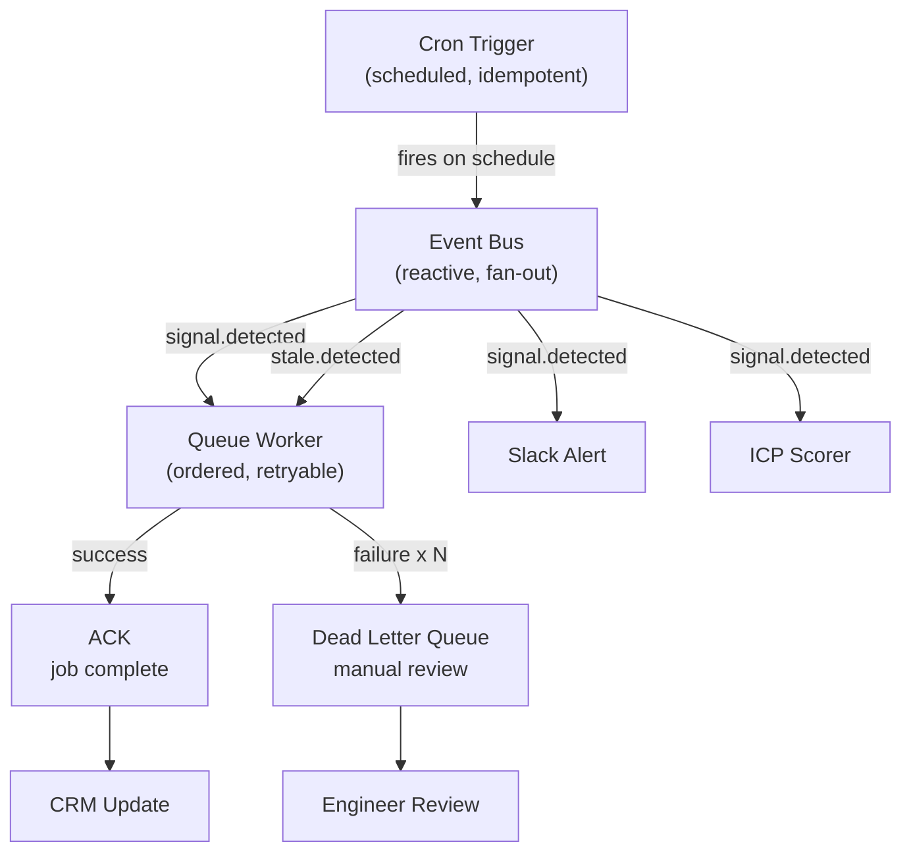

# Production Runtimes: Queue, Event, Cron

## Learning Objectives

- Implement a queue with retry, exponential backoff, and dead-letter routing in pure Node.js
- Wire a cron scheduler to an event bus that fans out to queue workers
- Compare the delivery guarantees of queue, event, and cron runtimes against specific failure modes
- Trace a job from schedule through event trigger through queue processing to ack or dead-letter
- Diagnose which runtime primitive a GTM automation requires based on its failure tolerance

## The Problem

You built the enrichment workflow. It works in your terminal. Now it needs to run at 2:14 AM when a prospect's job changes, retry when the CRM API returns 429, and refresh your ICP scoring every Monday without you touching it. The gap between "works on my machine" and "works in production" is which runtime primitive you choose and whether you chose correctly.

Production agents fail in ways a notebook never surfaces. Network timeouts at step 37. CRM rate limits at the worst possible moment. A cron job that dies on machine reboot. A background worker that runs out of memory halfway through a batch. The runtime shape determines which of these failures are survivable and which ones lose data.

The six production runtime shapes are request-response, streaming, durable execution, queue-based background, event-driven, and scheduled. This lesson focuses on the last three because they are the ones that keep unattended GTM automation alive. Durable execution (LangGraph) covers long-horizon agent workflows. Queue covers work that must complete exactly once. Event covers reactive fan-out from state changes. Cron covers work that runs on a clock. Pick the shape before you pick the framework.

## The Concept

Three distinct execution models, each solving a different failure mode. The mechanism that separates them is the guarantee each one makes about delivery, ordering, and exactly-once semantics.

A **queue** is ordered, persistent, and retryable. Jobs enter in sequence, workers pull them off one at a time, and if a job fails it goes back for another attempt. The delivery guarantee is at-least-once: the same job may execute more than once if a worker crashes mid-processing, so handlers must be idempotent. After a configurable number of failures, the job moves to a dead-letter queue for manual inspection. This is the primitive you want when a write must land — CRM updates, enrichment persistence, email sends with per-provider rate limits. BullMQ implements this pattern on Redis. AWS SQS implements it as a managed service. The mechanism is the same: enqueue, process, ack or retry, dead-letter on exhaustion.

An **event** is reactive, decoupled, and supports fan-out. Something happens — a signal is detected, a record changes state — and that fact is broadcast to any number of listeners. The emitter does not know who is listening. This decoupling is the value: you can add a new reaction (Slack alert, CRM creation, scoring update) without touching the detector. EventEmitter implements this in-process. Kafka, SNS, or EventBridge implement it across services. The guarantee is looser than a queue: if no listener is attached, the event is lost. If multiple listeners are attached, they all fire. There is no retry unless the listener itself wraps its work in a queue.

A **cron** is scheduled and idempotent. It fires on a clock regardless of system state. Every Monday at 9:00 AM. Every 5 minutes. The idempotency requirement is strict: if the previous run is still in progress, or if the clock fires twice, the work must not corrupt state. Cron does not care whether the last run succeeded. It fires. Your handler must be safe to run twice. node-cron implements this in-process. systemd timers or Kubernetes CronJobs implement it at the OS level. The guarantee is temporal, not delivery-based: the job will attempt to run at the configured time, and what happens after that is the handler's problem.



Pick wrong and you lose data or duplicate it. A cron job that sends emails without idempotency will double-send when it re-runs. An event handler that writes to the CRM without a queue will lose writes if the listener crashes mid-call. A queue used for a scheduled task will accumulate stale jobs that no longer reflect current state. The failure mode of each primitive is specific and predictable — which is exactly why you can choose correctly if you know the guarantees.

## Build It

Build all three primitives in a single Node.js script. The Queue class implements retry with exponential backoff and a dead-letter queue. EventEmitter provides the in-process event bus. A setInterval timer stands in for cron — in production you would use node-cron for cron-expression parsing or a systemd timer for machine-level durability, but the control flow is identical: schedule fires, emits an event, the event handler enqueues work, the queue processes with retry, and dead letters land in a separate list for inspection.

This first script isolates the queue mechanism so you can observe retry and dead-letter behavior directly. It enqueues five jobs, two of which will always fail, and prints every state transition:

```javascript
const { EventEmitter } = require('events');

class Queue {
  constructor(name, options = {}) {
    this.name = name;
    this.jobs = [];
    this.deadLetters = [];
    this.maxAttempts = options.maxAttempts || 3;
    this.baseDelayMs = options.baseDelayMs || 200;
    this.processing = false;
    this.completed = 0;
    this.failed = 0;
  }

  enqueue(data, handler) {
    const job = {
      id: `job_${Date.now()}_${Math.random().toString(36).slice(2, 6)}`,
      data,
      handler,
      attempts: 0,
      enqueuedAt: Date.now()
    };
    this.jobs.push(job);
    console.log(`[${this.name}] ENQUEUE ${job.id} | depth=${this.jobs.length} | data=${JSON.stringify(data).slice(0, 50)}`);
    this._processNext();
    return job.id;
  }

  async _processNext() {
    if (this.processing || this.jobs.length === 0) return;
    this.processing = true;
    const job = this.jobs.shift();
    job.attempts++;

    try {
      await job.handler(job.data);
      this.completed++;
      console.log(`[${this.name}] ACK ${job.id} | attempts=${job.attempts} | completed=${this.completed}`);
    } catch (err) {
      if (job.attempts < this.maxAttempts) {
        const delay = this.baseDelayMs * Math.pow(2, job.attempts - 1);
        console.log(`[${this.name}] RETRY ${job.id} | attempt=${job.attempts}/${this.maxAttempts} | backoff=${delay}ms | err=${err.message}`);
        setTimeout(() => {
          this.jobs.push(job);
          this.processing = false;
          this._processNext();
        }, delay);
        return;
      }
      this.deadLetters.push({ id: job.id, data: job.data, error: err.message });
      this.failed++;
      console.log(`[${this.name}] DLQ ${job.id} | attempts=${job.attempts} | dead_letters=${this.deadLetters.length} | err=${err.message}`);
    }
    this.processing = false;
    this._processNext();
  }

  depth() {
    return this.jobs.length;
  }
}

const q = new Queue('enrichment', { maxAttempts: 3, baseDelayMs: 300 });

const jobs = [
  { domain: 'acme.com', fail: false },
  { domain: 'globex.io', fail: false },
  { domain: 'initech.dev', fail: true },
  { domain: 'hooli.com', fail: false },
  { domain: 'piedpiper.com', fail: true }
];

console.log('=== QUEUE ISOLATION TEST ===\n');

jobs.forEach((j, i) => {
  setTimeout(() => {
    q.enqueue(j, async (data) => {
      if (data.fail) throw new Error(`CRM API 429: rate limited on ${data.domain}`);
      const score = Math.floor(Math.random() * 30 + 65);
      console.log(`  [WORKER] enriched ${data.domain} | icp_score=${score}`);
    });
  }, i * 100);
});

setTimeout(() => {
  console.log(`\n=== QUEUE FINAL STATE ===`);
  console.log(`completed=${q.completed} failed=${q.failed} dead_letters=${q.deadLetters.length}`);
  q.deadLetters.forEach(dl => {
    console.log(`  DLQ: ${dl.id} | domain=${dl.data.domain} | error=${dl.error}`);
  });
  process.exit(0);
}, 5000);
```

Run it with `node queue-test.js`. The two failing jobs will retry three times each with exponential backoff (300ms, 600ms, 1200ms) before landing in the dead-letter queue. The three succeeding jobs will ack on the first attempt. The output shows every transition: enqueue, process, ack or retry, dead-letter.

Now wire all three primitives together. The cron timer triggers a stale-record scan. The scan emits events. The event handler enqueues jobs. The queue processes with retry and dead-letter routing. This is the same control flow that runs in production — only the timer implementation and queue backing store change:

```javascript
const { EventEmitter } = require('events');

class Queue {
  constructor(name, options = {}) {
    this.name = name;
    this.jobs = [];
    this