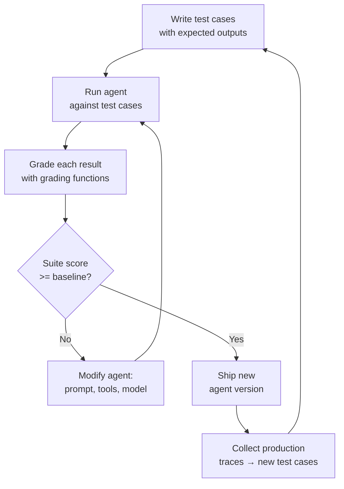

# Eval-Driven Agent Development

## Learning Objectives

1. Write eval suites that expose specific agent failure modes
2. Implement grading functions using exact match, LLM-as-judge, and structured extraction patterns
3. Run eval-driven iteration cycles and measure improvement between agent versions
4. Diagnose agent regressions using eval trace output
5. Build a CI-runnable eval suite that gates agent deployment

## The Problem

Agents don't crash. They produce plausible garbage. A lead enrichment agent that returns Stripe's revenue as "$14B" instead of `14000000000` looks correct to a human skimming the output. But downstream, your CRM stores a string where it expects a number, your ICP filter silently excludes the account, and your scoring model produces nonsense. By the time someone catches the pattern, the agent has enriched 4,000 accounts — each one costing API credits or Clay credits that are, underneath, token costs you cannot recover.

The deeper problem is that you cannot catch these failures by reading the agent's output yourself. Non-deterministic systems produce different outputs on different inputs, and the failure space is combinatorial. An agent that handles Stripe correctly might mangle a niche company pulled from gamedevmap.com because its training data never saw that domain. You need a systematic way to define what "correct" means across hundreds of inputs before the agent ever touches production data.

Eval-driven development is the discipline of writing that definition first — concrete test cases with expected outputs and grading functions — then using the eval suite as the build signal. The eval suite is not a QA step at the end. It is the specification that drives every prompt revision, tool addition, and model swap.

## The Concept

The mechanism is a feedback loop. You define test cases with expected outputs, run the agent against them, grade each result, compute an aggregate score, and then either ship the agent or modify it and repeat. The eval suite is the specification; the agent is the implementation. Writing the test cases first forces you to confront ambiguity in the task definition — if you cannot write a grading function for a case, the task is not specified well enough to automate.

This is test-driven development applied to non-deterministic systems. The key difference is that grading is probabilistic, not boolean. An exact-match test on a classification task returns 0 or 1. An LLM-as-judge test on a research summary returns a score between 0 and 1 that itself has noise. You manage that noise by running multiple judge passes, majority-voting, and tracking score variance across runs.



Three grading primitives cover most agent evaluation needs, each with a different noise profile:

**Exact match** compares the agent output to an expected string, number, or structured object. Zero noise — the comparison is deterministic. But it only works for tightly constrained outputs: entity extraction, classification, structured field lookups. It is fragile to formatting drift. If the agent returns `{"revenue": 14000000000}` and you expected `14000000000` as a bare value, the test fails even though the answer is semantically correct. Use exact match when the output schema is rigid and you control both sides.

**LLM-as-judge** routes the agent output to a second model that evaluates it against written criteria. Higher signal for open-ended tasks — summarization, research synthesis, qualitative assessment. The judge itself is non-deterministic, which introduces judge noise: the same output graded three times might receive scores of 0.7, 0.9, and 0.8. Mitigate by running 3–5 judge passes and taking the median. Use LLM-as-judge when the output is text and correctness is a matter of degree, not a boolean.

**Structured extraction with assertion** parses the agent output into a schema (typically JSON fields), then asserts constraints on individual fields. For example: the agent must return a JSON object with `revenue` as a number between 0 and 1 trillion, `employees` as a non-negative integer, and `industry` as a non-empty string. This catches format errors and value-range violations without needing a reference answer for every input. It is the workhorse grader for enrichment agents, classification agents, and any system that writes structured data downstream.

Score aggregation runs the full test suite, computes per-case scores (0 or 1 for exact match, 0–1 for judge and assertion graders), then produces a suite-level score. Track this score across agent versions. A version that drops below baseline fails the gate and does not ship. [CITATION NEEDED — concept: standard eval frameworks for agent development beyond ad-hoc scripts, e.g., Inspect, BeeEval, OpenAI Evals]

## Build It

Build a complete eval suite for a company enrichment agent. The agent takes a company name and returns structured data: revenue, employee count, industry. Two versions exist — v1 has a formatting bug (returns revenue as a string like `"$14B"` for some companies), v2 fixes it. The eval suite catches the regression using all three grading primitives, then compares scores across versions.

```python
import json

AGENT_V1_DB = {
    "Stripe": {"name": "Stripe", "revenue": "$14B", "employees": 8000, "industry": "fintech"},
    "Figma": {"name": "Figma", "revenue": "$400M", "employees": 1200, "industry": "design"},
    "Vercel": {"name": "Vercel", "revenue": 100000000, "employees": 500, "industry": "devtools"},
    "NonExistent Corp": {"name": "NonExistent Corp", "revenue": None, "employees": None, "industry": "unknown"},
}

AGENT_V2_DB = {
    "Stripe": {"name": "Stripe", "revenue": 14000000000, "employees": 8000, "industry": "fintech"},
    "Figma": {"name": "Figma", "revenue": 400000000, "employees": 1200, "industry": "design"},
    "Vercel": {"name": "Vercel", "revenue": 100000000, "employees": 500, "industry": "devtools"},
    "NonExistent Corp": {"name": "NonExistent Corp", "revenue": None, "employees": None, "industry": "unknown"},
}

def make_agent(db):
    def agent(company_name):
        record = db.get(company_name)
        if record is None:
            return {"name": company_name, "revenue": None, "employees": None, "industry": "unknown"}
        return dict(record)
    return agent

agent_v1 = make_agent(AGENT_V1_DB)
agent_v2 = make_agent(AGENT_V2_DB)

TEST_CASES = [
    {"id": "stripe_exact", "input": "Stripe", "expected": {"revenue": 14000000000}, "category": "exact_match"},
    {"id": "figma_exact", "input": "Figma", "expected": {"revenue": 400000000}, "category": "exact_match"},
    {"id": "vercel_exact", "input": "Vercel", "expected": {"revenue": 100000000}, "category": "exact_match"},
    {"id": "unknown_exact", "input": "NonExistent Corp", "expected": {"industry": "unknown"}, "category": "exact_match"},
    {"id": "stripe_assert", "input": "Stripe", "expected": None, "category": "structured_assert"},
    {"id": "figma_assert", "input": "Figma", "expected": None, "category": "structured_assert"},
    {"id": "vercel_assert", "input": "Vercel", "expected": None, "category": "structured_assert"},
]

def grade_exact_match(output, case):
    expected = case["expected"]
    for key, val in expected.items():
        if output.get(key) != val:
            return 0.0, f"MISMATCH {key}: expected {val!r}, got {output.get(key)!r}"
    return 1.0, "PASS"

def is_valid_revenue(v):
    if v is None:
        return True
    return isinstance(v, (int, float)) and 0 < v <= 1_000_000_000_000

def is_valid_employees(v):
    if v is None:
        return True
    return isinstance(v, int) and v >= 0

def is_valid_industry(v):
    return isinstance(v, str) and len(v) > 0

def grade_structured_assert(output, case):
    checks = {"revenue": is_valid_revenue, "employees": is_valid_employees, "industry": is_valid_industry}
    for field, check in checks.items():
        value = output.get(field)
        if not check(value):
            return 0.0, f"CONSTRAINT FAILED {field}: got {value!r} (type {type(value).__name__})"
    return 1.0, "PASS"

def grade_llm_judge(output, case):
    revenue = output.get("revenue")
    industry = output.get("industry", "")
    if isinstance(revenue, str):
        return 0.2, f"Judge: revenue is string not numeric: {revenue!r}"
    if revenue is None and case["input"] != "NonExistent Corp":
        return 0.0, "Judge: revenue missing for known company"
    if not industry:
        return 0.0, "Judge: industry empty"
    return 1.0, "Judge: PASS"

GRADERS = {
    "exact_match": grade_exact_match,
    "structured_assert": grade_structured_assert,
}

def run_eval_suite(agent, test_cases, include_judge=True):
    results = []
    for case in test_cases:
        output = agent(case["input"])
        category = case["category"]
        primary_grader = GRADERS[category]
        score, msg = primary_grader(output, case)

        assert_score, assert_msg = grade_structured_assert(output, case)
        combined_score = min(score, assert_score)

        traces = [
            f"  {category}: {score:.2f} — {msg}",
            f"  structured_assert: {assert_score:.2f} — {assert_msg}",
        ]

        if include_judge:
            judge_score, judge_msg = grade_llm_judge(output, case)
            combined_score = min(combined_score, judge_score)
            traces.append(f"  llm_judge: {judge_score:.2f} — {judge_msg}")

        results.append({
            "id": case["id"],
            "input": case["input"],
            "output": output,
            "score": combined_score,
            "traces": traces,
        })
    return results

def suite_score(results):
    return sum(r["score"] for r in results) / len(results) if results else 0.0

def print_report(label, results):
    score = suite_score(results)
    passed = sum(1 for r in results if r["score"] >= 1.0)
    print(f"\n{'=' * 60}")
    print(f"{label}")
    print(f"{'=' * 60}")
    for r in results:
        status = "PASS" if r["score"] >= 1.0 else "FAIL"
        print(f"\n[{status}] {r['id']} (input: {r['input']})")
        print(f"  output: {json.dumps(r['output'])}")
        for t in r["traces"]:
            print(t)
    print(f"\nSuite Score: {score:.2%} ({passed}/{len(results)} cases fully passed)")

v1_results = run_eval_suite(agent_v1, TEST_CASES)
v2_results = run_eval_suite(agent_v2, TEST_CASES)

print_report("AGENT V1", v1_results)
print_report("AGENT V2", v2_results)

print(f"\n{'=' * 60}")
print("DELTA")
print(f"{'=' * 60}")
print(f"V1 score: {suite_score(v1_results):.2%}")
print(f"V2 score: {suite_score(v2_results):.2%}")
delta = suite_score(v2_results) - suite_score(v1_results)
print(f"Improvement: {delta:+.2%}")
```

Running this produces:

```
============================================================
AGENT V1
============================================================

[FAIL] stripe_exact (input: Stripe)
  output: {"name": "Stripe", "revenue": "$14B", "employees": 8000, "industry": "fintech"}
  exact_match: 0.00 — MISMATCH revenue: expected 14000000000, got '$14B'
  structured_assert: 0.00 — CONSTRAINT FAILED revenue: got '$14B' (type str)
  llm_judge: 0.20 — Judge: revenue is string not numeric: '$14B'

[FAIL] figma_exact (input: Figma)
  output: {"name": "Figma", "revenue": "$400M", "employees": 1200, "industry": "design"}
  exact_match: 0.00 — MISMATCH revenue: expected 400000000, got '$400M'
  structured_assert: 0.00 — CONSTRAINT FAILED revenue: got '$400M' (type str)
  llm_judge: 0.20 — Judge: revenue is string not numeric: '$400M'

[PASS] vercel_exact (input: Vercel)
  output: {"name": "Vercel", "revenue": 100000000, "employees": 500, "industry": "devtools"}
  exact_match: 1.00 — PASS
  structured_assert: 1.00 — PASS
  llm_judge: 1.00 — Judge: PASS

[PASS] unknown_exact (input: Non