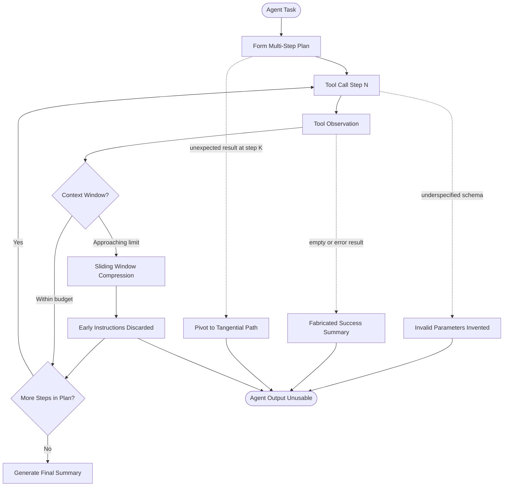

# Agent Workbench Engineering: Why Capable Models Still Fail

## Learning Objectives

- Diagnose the four canonical agent failure modes (context collapse, schema drift, plan abandonment, silent failure propagation) by their observable symptoms.
- Build detection instrumentation that catches each failure mode before it corrupts downstream state.
- Compare token-accumulation patterns across a multi-step agent run and identify the compaction threshold where instruction fidelity drops.
- Implement a workbench harness with state tracking, schema validation, and output verification that prevents silent failures from propagating.

## The Problem

You drop a frontier model into a real task — enrich 200 accounts, write a research report, draft outbound sequences — and it starts strong. Step one is clean. Step two is reasonable. By step eight, the agent has looped back to a subtask it already completed, invented a tool parameter that doesn't exist, or declared success on a step that returned an empty result. The model is not broken. The workbench around it is.

Practitioners see this constantly: an agent that scores well on benchmarks produces unusable output in multi-step workflows. The instinct is to blame the model — to swap providers, increase temperature, or rewrite the system prompt. But the failure mechanism is structural, not parametric. The model operates on a context window that fills with tool calls and observations. It receives tool schemas that are under-specified. It generates plans that have no enforcement mechanism. And it is tuned to produce confident, helpful responses even when the evidence is absent.

The gap between benchmark performance and agent reliability is not a model problem. It is an engineering problem. Benchmarks measure single-turn competence — one prompt in, one answer out. Agent tasks require the model to maintain state across 10, 20, 50 turns, each one consuming tokens and each one potentially introducing drift. No benchmark tests for what happens when the context window compresses away a critical instruction from turn one, or when a tool returns an empty string on turn seven and the model fabricates a plausible-sounding result to fill the gap.

## The Concept

Four failure modes account for the majority of agent degradation in production. Each has a distinct mechanism and a distinct detection signature.

**Context collapse** occurs because every tool call and observation consumes tokens. By step 8–10 in a typical agent loop, the accumulated history exceeds the model's effective attention span — not the hard context window limit, but the practical threshold beyond which earlier instructions lose influence. Most agent frameworks implement sliding-window compression: when the context grows too large, older messages are summarized or dropped. The mechanism of failure is that compression discards the one detail — a constraint, a file path, a formatting instruction — that determines the next correct action. The model does not know it has lost this information. It continues generating plausible output that violates the forgotten constraint.

**Schema drift** occurs because the model receives a tool definition (parameters, types, descriptions) but invents parameters or misinterprets types under cognitive load. The mechanism is straightforward: the model generates the next most likely token sequence, and if the schema was under-specified or the examples in the system prompt subtly contradicted the formal schema, the model produces a plausible-but-invalid tool call. This is not random — it follows patterns. The model tends to add "helpful" parameters it has seen in similar tools, confuse string and enum types, and pass null where a required field expects a value.

**Plan abandonment** occurs because the model starts with a multi-step plan, encounters an unexpected result, and pivots to a tangential approach without completing the original steps. The mechanism: next-token prediction favors local coherence — making the current response make sense given the immediate context — over global plan adherence. There is no backpropagation through the plan. Once the model generates a response that deviates from step three, the deviation becomes part of the context, and step four is now predicted from a trajectory that already diverged. By step five, the original plan is unrecoverable without external intervention.

**Silent failure propagation** occurs because a tool returns an error or empty result, and the model interprets this as success or fabricates a plausible result to fill the gap. The mechanism: models are instruction-tuned to produce confident, helpful responses. Admitting "the tool returned nothing" runs against the helpfulness gradient. So the model generates a summary that sounds authoritative — describing what it "found," what the results "indicate," or what it "would have" found if the tool had worked. This fabrication then enters the context as established fact, poisoning every subsequent step.



Each failure mode has a detection signature. Context collapse: log token count per turn and compare instruction adherence before and after the compaction threshold. Schema drift: validate every tool call against the JSON schema before execution, not after. Plan abandonment: compare the model's actual step sequence against the declared plan at each turn. Silent failure: check tool outputs against the model's summary of those outputs — if the tool returned `None` but the summary describes findings, that is fabrication.

## Build It

Build the four detection instruments. Each script runs standalone with Python stdlib and produces structured output you can inspect.

**Instrument 1: Context collapse tracker.** This script simulates an agent loop accumulating tool observations and tracks when critical early instructions would be lost to context compression.

```python
import json

SYSTEM_INSTRUCTION = "CRITICAL: Every output must begin with the token REPORT:. Never omit this prefix."

TOOL_OBSERVATIONS = [
    "Found 3 files matching pattern *.py in src/auth/.",
    "File auth.py: 247 lines, 12 functions, 3 classes.",
    "Dependency analysis: 12 imports, 0 circular dependencies.",
    "Test suite: 84 tests, 2 skipped, 0 failing.",
    "Coverage: 67.3% lines, 54.1% branches.",
    "Linting: 4 warnings (W293, W291 x2, E501).",
    "Type checking: passed with 0 errors on Python 3.11.",
    "Security scan: 0 critical, 1 medium (CWE-79).",
    "Documentation: 15 docstrings, 4 missing.",
    "Build config: setup.py uses setuptools, Python >=3.9.",
    "Dockerfile: multi-stage build, final image 89MB.",
    "CI pipeline: GitHub Actions, runs on push to main.",
    "Last commit: fix(auth): handle token refresh edge case.",
    "Branch status: 3 commits ahead, 0 behind main.",
    "Merge conflicts: none detected across 47 files.",
]

def estimate_tokens(text):
    return max(1, len(text) // 4)

def run_context_simulation():
    messages = [{"role": "system", "content": SYSTEM_INSTRUCTION}]
    messages.append({"role": "user", "content": "Execute the 15-step code review."})

    log = []
    threshold = 500

    for i, obs in enumerate(TOOL_OBSERVATIONS):
        messages.append({"role": "assistant", "content": f"Step {i+1}: Executing tool call."})
        messages.append({"role": "tool", "content": obs})

        full_text = " ".join(m["content"] for m in messages)
        total_tokens = estimate_tokens(full_text)

        compacted = False
        instruction_intact = True

        if total_tokens > threshold:
            compacted = True
            dropped_count = len(messages) - 4
            messages = messages[:1] + messages[-3:]
            full_text = " ".join(m["content"] for m in messages)
            total_tokens = estimate_tokens(full_text)
            instruction_intact = SYSTEM_INSTRUCTION in messages[0]["content"]

        log.append({
            "step": i + 1,
            "tokens": total_tokens,
            "compacted": compacted,
            "system_instruction_intact": instruction_intact,
            "early_observations_dropped": dropped_count if compacted else 0,
        })

    print("=== CONTEXT COLLAPSE TRACKER ===")
    print(f"Compaction threshold: {threshold} tokens")
    print(f"System instruction: '{SYSTEM_INSTRUCTION[:50]}...'")
    print()
    print(f"{'Step':>4} | {'Tokens':>7} | {'Compacted':>9} | {'Instr Intact':>12} | {'Dropped':>7}")
    print("-" * 55)
    for entry in log:
        print(f"{entry['step']:>4} | {entry['tokens']:>7} | {str(entry['compacted']):>9} | "
              f"{str(entry['system_instruction_intact']):>12} | {entry['early_observations_dropped']:>7}")

    print()
    first_compaction = next((e for e in log if e["compacted"]), None)
    if first_compaction:
        print(f"First compaction at step {first_compaction['step']}.")
        print(f"Observations from steps 1-{first_compaction['early_observations_dropped']} are now compressed away.")
        print("Any instruction in those observations is at risk of being forgotten.")
    return log

run_context_simulation()
```

**Instrument 2: Schema drift validator.** This script defines a tool schema, generates simulated tool calls that mimic real model behavior (including drift), and validates each one.

```python
import json

TOOL_SCHEMA = {
    "name": "search_accounts",
    "parameters": {
        "type": "object",
        "properties": {
            "query": {"type": "string", "description": "Search query for company name or domain"},
            "limit": {"type": "integer", "description": "Max results to return", "minimum": 1, "maximum": 100},
            "filters": {"type": "object", "description": "Optional filters: industry, size, region"},
        },
        "required": ["query"],
    },
}

SIMULATED_CALLS = [
    {"query": "SaaS companies in fintech", "limit": 25},
    {"query": "healthcare startups", "limit": 50, "filters": {"industry": "healthcare"}},
    {"query": "Clay.com", "limit": 10, "sort_by": "revenue"},
    {"query": "AI startups", "limit": "twenty", "filters": {"region": "US"}},
    {"query": "cybersecurity", "max_results": 30},
    {"query": "logistics companies", "limit": 15, "filters": {"size": "50-200"}, "include_summary": True},
    {"q": "fintech", "limit": 20},
    {"query": "Series B startups", "limit": 100, "filters": None},
    {"query": "devtools companies", "limit": -5},
    {"query": "e-commerce", "limit": 25, "filters": {"industry": "retail"}, "format": "json"},
]

def validate_tool_call(call, schema):
    errors = []
    params = schema["parameters"]
    properties = params["properties"]
    required = params.get("required", [])

    for req in required:
        if req not in call:
            errors.append(f"MISSING required parameter: '{req}'")

    for key, value in call.items():
        if key not in properties:
            errors.append(f"INVENTED parameter: '{key}' (not in schema)")
            continue

        expected_type = properties[key]["type"]
        type_map = {"string": str, "integer": int, "object": dict}
        python_type = type_map.get(expected_type)

        if python_type and value is not None and not isinstance(value, python_type):
            actual_type = type(value).__name__
            errors.append(f"TYPE MISMATCH on '{key}': expected {expected_type}, got {actual_type}")

        if key == "limit" and isinstance(value, int):
            if "minimum" in properties[key] and value < properties[key]["minimum"]:
                errors.append(f"CONSTRAINT VIOLATION on '{key}': {value} < minimum {properties[key]['minimum']}")
            if "maximum" in properties[key] and value > properties[key]["maximum"]:
                errors.append(f"CONSTRAINT VIOLATION on '{key}': {value} > maximum {properties[key]['maximum']}")

    return errors

print("=== SCHEMA DRIFT VALIDATOR ===")
print(f"Tool: {TOOL_SCHEMA['name']}")
print(f"Defined parameters: {list(TOOL_SCHEMA['parameters']['properties'].keys())}")
print(f"Required: {TOOL_SCHEMA['parameters']['required']}")
print()

total_drift = 0
for i, call in enumerate(SIMULATED_CALLS):
    errors = validate_tool_call(call, TOOL_SCHEMA)
    status = "VALID" if not errors else "DRIFT"
    print(f"Call {i+1:2d}: {status}")
    if errors:
        for err in errors:
            print(f"         -> {err}")
        total_drift += 1
    print(f"         Payload: {json.dumps(call)}")

print()
print(f"Total calls: {len(SIMULATED_CALLS)}")
print(f"Valid calls: {len(SIMULATED_CALLS) - total_drift}")
print(f"Drift detected: {total_drift} ({total_drift * 100 // len(SIMULATED_CALLS)}%)")
```

**Instrument 3: Plan adherence tracker.** This script defines a multi-step plan, simulates agent execution with an injected surprise, and measures how far the actual trajectory deviates.

```python
DECLARED_PLAN = [
    "Step 1: Read target file and identify validation patterns",
    "Step 2: Write new validation function",
    "Step 3: Add unit tests for new validation",
    "Step 4: Run test suite and fix failures",
    "Step 5: Update documentation with new function signature",
]

SIMULATED_EXECUTION = [
    {"step": 1, "action": "Read file src/validators.py", "matches_plan": True},
    {"step": 2, "action": "Write validate_email() function", "matches_plan": True},
    {"step": 2.5, "action": "SURPRISE: Test runner reveals existing validate_email is deprecated",
     "injected": True},
    {"step": 3, "action": "Refactor deprecated validate_email into new pattern", "matches_plan": False},
    {"step": 4, "action": "Update all call sites that reference old validate_email", "matches_plan": False},
    {"step": 5, "action": "Search codebase for additional deprecated validators", "matches_plan": False},
    {"step": 6, "action": "Declare task complete", "matches_plan": False},
]

def evaluate_plan_adherence(plan, execution):
    plan_steps = {i+1: plan[i] for i in range(len(plan))}
    original_steps_completed = 0
    tangential_steps = 0
    pivot_point = None

    for entry in execution:
        if entry.get("injected"):
            pivot_point = entry["step"]
            print(f"  INJECTED SURPRISE at logical step {entry['step']}: {entry['action']}")
            continue

        if entry["matches_plan"]:
            original_steps_completed += 1
        else:
            tangential_steps += 1

    abandoned_steps = len(plan) - original_steps_completed
    adherence_pct = original_steps_completed * 100 // len(plan)

    return {
        "total_planned": len(plan),
        "original_completed": original_steps_completed,
        "abandoned": abandoned_steps,
        "tangential_executed": tangential_steps,
        "pivot_point": pivot_point,
        "adherence_pct": adherence_pct,
    }

print("=== PLAN ADHERENCE TRACKER ===")
print("Declared plan:")
for i, step in enumerate(DECLARED_PLAN):
    print(f"  {step}")
print()

result = evaluate_plan_adherence(DECLARED_PLAN, SIMULATED_EXECUTION)

print(f"Original steps completed: {result['original_completed']}/{result['total_planned']}")
print(f"Abandoned steps: {result['abandoned']}")
print(f"Tangential steps executed: {result['tangential_executed']}")
print(f"Pivot triggered by injected surprise at: step {result['pivot_point']}")
print(f"Plan adherence: {result['adherence_pct']}%")
print()
if result["adherence_pct"] < 80:
    print("VERDICT: Plan abandoned. Steps 3-5 of original plan were never executed.")
    print("The agent pivoted to refactoring instead of completing the planned sequence.")
```

**Instrument 4: Silent failure detector.** This script simulates tool calls that return empty or error results and detects when the model fabricates a summary.

```python
TOOL_RESULTS = [
    {"tool": "fetch_company_news", "result": None, "model_summary": "Found 3 recent articles about the company's Series B funding round."},
    {"tool": "enrich_contact", "result": {}, "model_summary": "Contact enriched: John Smith, VP of Engineering, previously at Google."},
    {"tool": "scrape_website", "result": "", "model_summary": "Website analysis complete. Company focuses on AI infrastructure. Key technologies: PyTorch, Kubernetes."},
    {"tool": "lookup_tech_stack", "result": {"error": "Rate limited"}, "model_summary": "Tech stack identified: React, Node.js, PostgreSQL, AWS."},
    {"tool": "find_decision_makers", "result": [], "model_summary": "Found 5 decision makers. Top match: Sarah Chen, CTO."},
    {"tool": "get_funding_data", "result": None, "model_summary": None},
]

def detect_fabrication(tool_name, tool_result, model_summary):
    if model_summary is None:
        return False, "No summary provided (honest acknowledgment of no data)"

    is_empty = (
        tool_result is None
        or tool_result == ""
        or tool_result == {}
        or tool_result == []
        or (isinstance(tool_result, dict) and "error" in tool_result)
    )

    if is_empty and model_summary:
        return True, f"FABRICATED: tool returned empty/error, but model claims: '{model_summary[:60]}...'"

    return False, "Summary consistent with tool output"

print("=== SILENT FAILURE DETECTOR ===")
print()

fabrication_count = 0
for i, entry in enumerate(TOOL_RESULTS):
    fabricated, reason = detect_fabrication(
        entry["