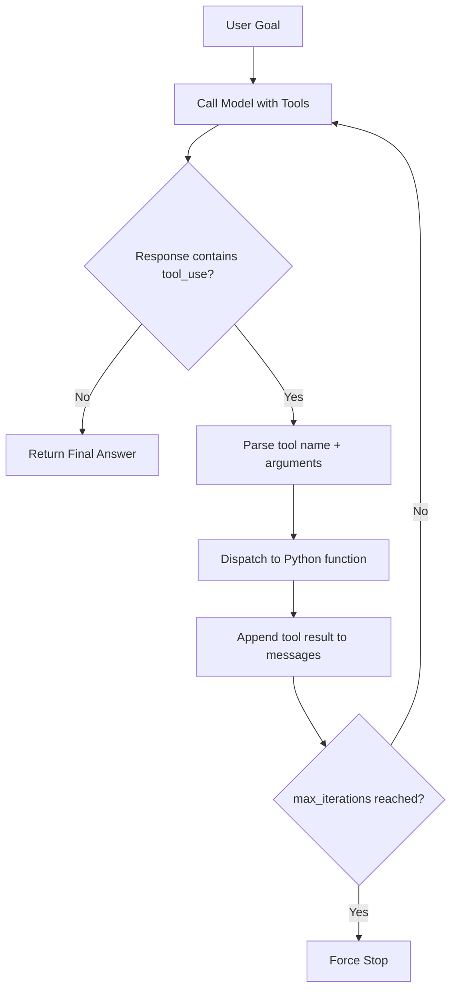

# The Minimal Agent Workbench

## Learning Objectives

- Build a minimal agent loop that implements the observe-plan-act cycle in under 80 lines of Python
- Implement typed tool schemas and a dispatch table that binds LLM output to executable functions
- Trace the ReAct pattern through each iteration of an agent run, identifying where reasoning yields tool calls and where tool output changes the next reasoning step
- Compare agent loop architecture to hardcoded GTM enrichment pipelines and identify which steps benefit from conditional reasoning
- Evaluate agent failure modes—infinite loops, schema drift, ambiguous stop conditions—against token cost constraints

## The Problem

You have used agents that feel like magic—until they loop forever, call the wrong tool, or hallucinate a function that does not exist. The magic dissolves and what remains is a `while` loop with a model inside it, making decisions you cannot inspect and cannot stop.

Here is what is actually happening. Every agent platform—whether it wraps Claude, GPT-4, or a local model—is running the same core cycle: observe the current state, plan the next action, execute it, observe the result, repeat. The platforms differ in their tooling, their UI, and their guardrails, but the engine is the same loop. The reason your agent spiraled last week is not that the model is broken. It is that the loop had no stopping condition, the tool schemas were ambiguous, or the dispatch table silently failed and the model kept trying to recover.

A minimal agent workbench strips away every abstraction until you can see the mechanism. You get the loop. You get the tool schemas. You get the dispatch table. You get a hard `max_iterations` ceiling. Everything else—memory, RAG, multi-agent orchestration—is something you layer on top once you trust the base.

## The Concept

The core mechanism is ReAct—short for Reason + Act. The model receives an observation (the user's goal, plus any accumulated tool output), produces a reasoning trace about what to do next, and either calls a tool or returns a final answer. If it calls a tool, the result becomes the next observation and the cycle repeats. The model never executes code directly. It emits a structured request—a tool name and a set of arguments—and your Python code reads that request, dispatches it to a real function, and feeds the result back into the conversation.

Three components form the workbench. First, a set of tool schemas: JSON descriptions of each function's name, purpose, and typed parameters. These schemas are the contract between the model and your code. If the schema says `company_name: string`, the model will pass a string. If you omit a parameter from the schema, the model will never know it exists. Second, a dispatch table: a Python dictionary mapping tool names to actual functions. When the model emits a `tool_use` block, you look up the function, call it with the arguments, and return the output. Third, the loop itself: a bounded `for` iteration that calls the model, checks the response for tool calls, dispatches them, appends results, and repeats until the model says "I'm done" or the iteration counter hits its ceiling.



The stopping condition is not optional. Without it, the model can and will loop: calling a tool, getting a result, calling the same tool again with slightly different arguments, getting nearly the same result, and continuing indefinitely. `max_iterations` is not a hack. It is the cost ceiling. Every iteration is an API call that costs tokens, and in a GTM context where you are running this loop across thousands of prospects, an unbounded agent loop is a budget fire.

## Build It

Here is a complete agent loop. It takes a user goal, a list of tool functions with typed schemas, calls Claude via the Anthropic API, parses `tool_use` blocks, dispatches to real Python functions, and feeds results back until the model returns a stop or `max_iterations` is hit. Every step prints to stdout so you can watch the ReAct cycle happen in real time.

```python
import anthropic
import json

client = anthropic.Anthropic()

def look_up_domain(company_name):
    registry = {
        "stripe": "stripe.com",
        "notion": "notion.so",
        "figma": "figma.com",
        "clay": "clay.com",
        "linear": "linear.app",
    }
    key = company_name.lower().strip()
    return {"company": company_name, "domain": registry.get(key, f"{key.replace(' ', '')}.com")}

def classify_industry(domain):
    fintech = ["stripe", "plaid", "brex", "mercury"]
    devtools = ["linear", "vercel", "github", "clay"]
    d = domain.lower()
    if any(w in d for w in fintech):
        return {"domain": domain, "industry": "Fintech", "subvertical": "Payments Infrastructure"}
    if any(w in d for w in devtools):
        return {"domain": domain, "industry": "DevTools", "subvertical": "Workflow Automation"}
    return {"domain": domain, "industry": "Technology", "subvertical": "SaaS"}

def score_icp_fit(industry, subvertical):
    scores = {
        ("Fintech", "Payments Infrastructure"): 85,
        ("DevTools", "Workflow Automation"): 90,
        ("Technology", "SaaS"): 45,
    }
    score = scores.get((industry, subvertical), 30)
    tier = "Tier 1" if score >= 80 else "Tier 2" if score >= 60 else "Tier 3"
    return {"industry": industry, "subvertical": subvertical, "score": score, "tier": tier}

TOOLS = [
    {
        "name": "look_up_domain",
        "description": "Look up the website domain for a given company name. Returns the domain.",
        "input_schema": {
            "type": "object",
            "properties": {
                "company_name": {"type": "string", "description": "The company name to look up"}
            },
            "required": ["company_name"]
        }
    },
    {
        "name": "classify_industry",
        "description": "Classify the industry and subvertical for a given website domain.",
        "input_schema": {
            "type": "object",
            "properties": {
                "domain": {"type": "string", "description": "The website domain to classify"}
            },
            "required": ["domain"]
        }
    },
    {
        "name": "score_icp_fit",
        "description": "Score how well a company fits the ideal customer profile. Requires industry and subvertical.",
        "input_schema": {
            "type": "object",
            "properties": {
                "industry": {"type": "string"},
                "subvertical": {"type": "string"}
            },
            "required": ["industry", "subvertical"]
        }
    }
]

DISPATCH = {
    "look_up_domain": look_up_domain,
    "classify_industry": classify_industry,
    "score_icp_fit": score_icp_fit,
}

SYSTEM_PROMPT = """You are a GTM research agent. Use the available tools to gather information step by step.
Never guess a domain, industry, or score. Always call the appropriate tool.
When you have gathered enough information, summarize your findings for the user."""

def run_agent(goal, max_iterations=6):
    messages = [{"role": "user", "content": goal}]
    print(f"GOAL: {goal}")
    for i in range(max_iterations):
        print(f"\n{'='*60}")
        print(f"ITERATION {i+1}/{max_iterations}")
        print(f"{'='*60}")

        response = client.messages.create(
            model="claude-sonnet-4-20250514",
            max_tokens=1024,
            system=SYSTEM_PROMPT,
            tools=TOOLS,
            messages=messages
        )

        assistant_content = response.content
        messages.append({"role": "assistant", "content": assistant_content})

        if response.stop_reason == "end_turn":
            for block in assistant_content:
                if block.type == "text":
                    print(f"\n[FINAL ANSWER]\n{block.text}")
            print(f"\n[STOPPED] Agent completed in {i+1} iteration(s).")
            return

        tool_results = []
        for block in assistant_content:
            if block.type == "text" and block.text.strip():
                print(f"\n[REASONING] {block.text}")
            elif block.type == "tool_use":
                print(f"\n[TOOL CALL] {block.name}({json.dumps(block.input)})")
                fn = DISPATCH.get(block.name)
                if fn is None:
                    print(f"[ERROR] No dispatch for tool '{block.name}'")
                    result = {"error": f"Unknown tool: {block.name}"}
                else:
                    result = fn(**block.input)
                print(f"[TOOL RESULT] {json.dumps(result)}")
                tool_results.append({
                    "type": "tool_result",
                    "tool_use_id": block.id,
                    "content": json.dumps(result)
                })

        if tool_results:
            messages.append({"role": "user", "content": tool_results})

    print(f"\n[MAX ITERATIONS] Stopped after {max_iterations} iterations without completion.")

if __name__ == "__main__":
    run_agent("Research Stripe: find their domain, classify their industry, and score their ICP fit.")
```

When you run this, you see the ReAct cycle explicitly. Iteration 1: the model reasons about the goal and calls `look_up_domain("Stripe")`. Your dispatch table executes the Python function and returns `{"company": "Stripe", "domain": "stripe.com"}`. Iteration 2: the model sees the domain, reasons about what it needs next, and calls `classify_industry("stripe.com")`. Iteration 3: the model sees the industry classification and calls `score_icp_fit("Fintech", "Payments Infrastructure")`. Iteration 4: the model has all three pieces of information and returns a final summary. The `stop_reason` field reads `end_turn`, the loop exits, and you have your answer in four iterations.

Where it could have spiraled: if `classify_industry` returned `None` instead of a dict, the model would have seen an empty result, re-called the same tool, gotten the same empty result, and repeated until `max_iterations` killed the loop. The tool return type is part of the contract. A tool that returns inconsistent types—sometimes a dict, sometimes a string, sometimes `None`—will produce an agent that loops, not because the model is dumb, but because the observation it receives does not tell it what to do next.

## Use It

The agent loop's observe-plan-act cycle maps directly onto the GTM enrichment waterfall—the sequential pipeline where you start with a prospect name, look up their domain, enrich the company profile, check intent signals, score the lead, and decide the next action. [CITATION NEEDED — concept: GTM enrichment waterfall as agent loop] A hardcoded Zapier chain or a Clay waterfall executes these steps in fixed order: step 1 always feeds step 2, step 2 always feeds step 3, regardless of what the data says. The agent loop replaces that fixed pipeline with conditional multi-step reasoning. If the domain lookup returns a parked page, the agent can skip company enrichment and jump straight to scoring. If the industry classification returns "Fintech," the agent can call an additional tool that checks fintech-specific intent signals before scoring. The pipeline shape adapts to the data.

Here is where Zone 14—cost optimization—enters. Every iteration of the agent loop is an API call that costs tokens. In a Clay enrichment waterfall, every step that fires costs a credit. The `max_iterations` parameter on your agent loop is the exact same control mechanism as capping waterfall depth in Clay. [CITATION NEEDED — concept: Clay credit cost equivalent to token cost in agent loops] When you run enrichment across 10,000 prospects, a three-iteration agent costs three API calls per row; a six-iteration agent costs six. The difference is real money. The discipline is the same: identify the minimum number of steps that produce a usable answer, and cap the loop there.

The practical test is this: take any enrichment waterfall you have built in Clay or Zapier, and identify the steps where the next action depends on the current result. Those are the steps where an agent loop adds value. The steps that always run in the same order—domain lookup always feeds company enrichment—should stay as a fixed pipeline. The steps where you currently write conditional logic (if industry is Fintech, check this signal; if revenue is above threshold, route to sales) are the steps where the agent loop's conditional reasoning earns its token cost back.

## Ship It

Build a minimal agent workbench that solves a real multi-step GTM task: given a company name, research the domain, classify the industry, and write a one-line positioning hook. The agent must use at least two tools, must print each step, and must stop within six iterations.

```python
import anthropic
import json

client = anthropic.Anthropic()

def find_domain(company_name):
    registry = {
        "stripe": "stripe.com",
        "notion": "notion.so",
        "figma": "figma.com",
        "clay": "clay.com",
        "linear": "linear.app",
        "loom": "loom.com",
    }
    key = company_name.lower().strip()
    domain = registry.get(key, f"{key.replace(' ', '')}.com")
    return {"company": company_name, "domain": domain, "confidence": "high" if key in registry else "low"}

def research_company(domain):
    profiles = {
        "stripe.com": {"industry": "Fintech", "subvertical": "Payments Infrastructure", "stage": "Public", "employees": "8000+"},
        "clay.com": {"industry": "DevTools", "subvertical": "GTM Enrichment", "stage": "Series B", "employees": "200-500"},
        "linear.app": {"industry": "DevTools", "subvertical": "Project Management", "stage": "Series B", "employees": "50-200"},
        "loom.com": {"industry": "DevTools", "subvertical": "Async Communication", "stage": "Acquired", "employees": "200-500"},
    }
    profile = profiles.get(domain, {"industry": "Unknown", "subvertical": "Unknown", "stage": "Unknown", "employees": "Unknown"})
    profile["domain"] = domain
    return profile

TOOLS = [
    {
        "name": "find_domain",
        "description": "Find the website domain for a company. Returns domain and confidence level.",
        "input_schema": {
            "type": "object",
            "properties": {"company_name": {"type": "string"}},
            "required": ["company_name"]
        }
    },
    {
        "name": "research_company",
        "description": "Research a company by domain. Returns industry, subvertical, funding stage, and employee count.",
        "input_schema": {
            "type": "object",
            "properties": {"domain": {"type": "string"}},
            "required": ["domain"]
        }
    }
]

DISPATCH = {"find_domain": find_domain, "research_company": research_company}

SYSTEM_PROMPT = """You are a GTM positioning agent. Your job:
1. Find the company's domain using find_domain.
2. Research the company using research_company.
3. Based on the research, write a single compelling positioning hook (one sentence) that could open a cold outbound email.
The hook should reference their industry and subvertical specifically.
Stop after writing the hook. Do not repeat research steps."""

def run_positioning_agent(company_name, max_iterations=6):
    messages = [{"role": "user", "content": f"Create a positioning hook for: {company_name}"}]
    print(f"TASK: Research {company_name} and write a positioning hook\n")
    total_tokens = 0

    for i in range(max_iterations):
        print(f"--- Iteration {i+1}/{max_iterations} ---")

        response = client.messages.create(