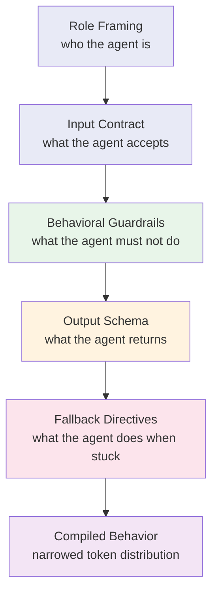

# Agent Instructions as Executable Constraints

## Learning Objectives

- Write constraint stacks that define input contracts, output schemas, behavioral guardrails, and fallback directives for LLM agents.
- Implement a rule checker that scores agent outputs against machine-checkable constraints and reports failures by category.
- Compare soft prompt-text constraints against hard structured-output constraints (JSON schema, function signatures) and predict failure modes for each.
- Package a tested constraint stack into a versioned configuration file with embedded regression test cases.
- Diagnose constraint conflicts, prompt drift, and polite compliance failures from agent output logs.

## The Problem

When you give an agent an instruction like "be helpful," you've given it a wish. When you give it "respond with exactly one JSON object containing keys `company_name` and `confidence_score` between 0.0 and 1.0," you've given it an executable constraint. The difference is the gap between "mostly works" and "pipeline-grade."

A typical set of agent instructions reads like onboarding documentation. It tells the agent to "be careful," "test thoroughly," and "ask if unsure." Three days later, the agent ships a change with no tests, writes to a forbidden directory, and never asks — because it never knew where the line was. The instructions were aspirational, not operational. An aspiration cannot fail a test. A constraint can.

In a GTM context, this gap is expensive. An enrichment agent that returns free-text descriptions instead of structured company records breaks the downstream pipeline that feeds your CRM. A research agent that infers industry classifications without confidence scores contaminates your ICP tiering. An outreach agent that drifts off-brand voice because its instructions said "be conversational" instead of specifying tone, length, and forbidden phrases costs you meetings. Each of these failures traces back to prose that described intent instead of constraints that defined behavior.

The fix is not better prose. The fix is treating instructions as a stack of checkable rules — each with a name, a category, and a test — that the workbench can evaluate at runtime and a reviewer can verify after the fact.

## The Concept

Agent instructions operate as soft programs. They define input expectations, behavioral boundaries, output schemas, and failure modes using natural language that the model compiles into behavior at inference time. The mechanism is constraint propagation: each clause in an instruction narrows the sampling distribution of the model's output tokens. Add a clause that says "respond in JSON" and the model's probability mass shifts toward token sequences that parse as JSON. Add "keys must be `company_name` and `confidence_score`" and the distribution narrows further. Stack enough constraints and the output space collapses to something you can build a pipeline around.

This works because of how attention functions during inference. Each token the model generates attends back to the full prompt — including every instruction clause. A well-placed constraint creates an attention anchor that biases generation toward compliance. But attention is finite and competitive. A constraint buried on line 40 of a 60-line prompt competes against every other clause for attention weight, and if a more recent instruction contradicts it, recency bias wins. This is why constraint ordering matters: the model weights recent context more heavily, so the last instruction the model reads before generating tends to dominate.



There is a fidelity cliff: adding constraints improves output quality up to a point, then each additional constraint slightly degrades adherence to all of them. The model has finite attention capacity for instructions. Past a threshold — roughly 8-12 operational constraints in a single prompt, though this varies by model and context length — the model begins to drop earlier constraints to satisfy later ones. You can observe this directly: ask the model to follow 15 rules, then check which ones it actually followed. The ones near the end of the prompt will have higher adherence than the ones near the beginning.

Structured output formats change this dynamic. A JSON schema enforced by the inference layer (not the prompt text) is a hard constraint — the model physically cannot produce tokens that violate the schema because the decoder restricts the token vocabulary at each position. This is fundamentally different from writing "respond in JSON" in the prompt, which is a soft constraint the model can and will occasionally ignore. Function signatures and tool definitions work the same way: they constrain the output space at the decoding level, not the attention level. When you have access to structured output enforcement, use it. When you don't — or when the constraint is behavioral rather than structural — you fall back on prompt text and accept the soft-constraint failure rate.

Three failure modes are worth naming because you will see them repeatedly. **Constraint conflicts** happen when two rules contradict each other ("be concise" vs. "explain your reasoning") and the model picks one, usually the more recent. **Prompt drift** happens in long contexts where the original instructions lose attention weight as the conversation grows, causing the model to slowly abandon early constraints. **Polite compliance** is the most insidious: the model acknowledges a constraint ("I will not include personal data") and then includes it anyway, because the acknowledgment itself became the attention anchor rather than the prohibition.

## Build It

Build a constraint checker that takes an agent's output and scores it against a rule set. Each rule has a name, a category, and a check function. The checker runs all checks and produces a report showing which constraints passed, which failed, and the specific failure detail. This is the tool you will use throughout the rest of the lesson — it turns "did the agent follow instructions?" from a judgment call into a pass/fail score.

The five categories that cover most constraint stacks are: **startup** (what must be true before work begins), **forbidden** (what must never happen), **definition of done** (what proves the task is complete), **uncertainty** (what the agent does when unsure), and **output schema** (what structure the response must take). These map directly to the constraint stack layers from the concept section — each category is a layer of narrowing on the model's output distribution.

```python
import json
from dataclasses import dataclass
from typing import Callable

@dataclass
class Constraint:
    name: str
    category: str
    description: str
    check: Callable[[str], bool]

@dataclass
class ConstraintResult:
    name: str
    category: str
    passed: bool
    description: str

def is_valid_json(output: str) -> bool:
    try:
        json.loads(output)
        return True
    except (json.JSONDecodeError, TypeError):
        return False

def has_required_keys(output: str, keys: list) -> bool:
    try:
        data = json.loads(output)
        return all(k in data for k in keys)
    except (json.JSONDecodeError, TypeError):
        return False

def value_in_range(output: str, key: str, min_val: float, max_val: float) -> bool:
    try:
        data = json.loads(output)
        val = data.get(key)
        if val is None:
            return False
        return min_val <= val <= max_val
    except (json.JSONDecodeError, TypeError):
        return False

def contains_none_of(output: str, phrases: list) -> bool:
    lowered = output.lower()
    return not any(p.lower() in lowered for p in phrases)

def has_key_when_low_confidence(output: str, conf_key: str, threshold: float, required_key: str) -> bool:
    try:
        data = json.loads(output)
        if data.get(conf_key, 1.0) < threshold:
            return required_key in data
        return True
    except (json.JSONDecodeError, TypeError):
        return False

def score_constraints(output: str, constraints: list) -> list:
    results = []
    for c in constraints:
        results.append(ConstraintResult(
            name=c.name,
            category=c.category,
            passed=c.check(output),
            description=c.description
        ))
    return results

def print_report(results: list) -> None:
    total = len(results)
    passed = sum(1 for r in results if r.passed)
    print(f"\nConstraint Report: {passed}/{total} passed\n")
    print(f"{'Status':<8} {'Category':<22} {'Name':<28} Description")
    print("-" * 90)
    for r in results:
        status = "PASS" if r.passed else "FAIL"
        print(f"[{status:<4}] {r.category:<22} {r.name:<28} {r.description}")
    print(f"\nScore: {passed}/{total} = {passed/total*100:.0f}%")

agent_constraints = [
    Constraint(
        name="valid_json",
        category="output_schema",
        description="Output must be parseable JSON",
        check=is_valid_json
    ),
    Constraint(
        name="required_keys_present",
        category="output_schema",
        description="Must contain company_name and confidence_score",
        check=lambda o: has_required_keys(o, ["company_name", "confidence_score"])
    ),
    Constraint(
        name="confidence_in_range",
        category="output_schema",
        description="confidence_score must be 0.0-1.0",
        check=lambda o: value_in_range(o, "confidence_score", 0.0, 1.0)
    ),
    Constraint(
        name="no_hedging",
        category="behavioral_guardrail",
        description="Must not contain hedging language",
        check=lambda o: contains_none_of(o, ["i'm not sure", "it depends", "might be", "could be"])
    ),
    Constraint(
        name="uncertainty_flagged",
        category="fallback_directive",
        description="Low confidence must include uncertainty_reason",
        check=lambda o: has_key_when_low_confidence(o, "confidence_score", 0.5, "uncertainty_reason")
    ),
]

good_output = json.dumps({
    "company_name": "Acme Corp",
    "confidence_score": 0.85
})

bad_output = json.dumps({
    "company_name": "I'm not sure, might be Acme",
    "confidence_score": 1.5
})

uncertain_output = json.dumps({
    "company_name": "Possibly Acme Corp",
    "confidence_score": 0.3
})

for label, output in [("GOOD OUTPUT", good_output), ("BAD OUTPUT", bad_output), ("UNCERTAIN OUTPUT", uncertain_output)]:
    print(f"\n{'='*60}")
    print(f"{label}: {output}")
    results = score_constraints(output, agent_constraints)
    print_report(results)
```

Run this and you get three reports. The good output passes all five constraints. The bad output fails three: the confidence score is out of range, the hedging language trips the guardrail, and the JSON technically parses but contains hedge phrases in the company name. The uncertain output fails the fallback directive because confidence is 0.3 (below the 0.5 threshold) but no `uncertainty_reason` key is present. Every failure points to a specific clause in the instruction set — which means you can fix the instruction, re-run the check, and confirm the fix worked.

The key insight: the checker does not care about the instruction text. It cares about the observable behavior. This is what separates executable constraints from prose. "Be careful with uncertain data" is prose. "If confidence_score < 0.5, include uncertainty_reason" is a constraint — because you can write a test for it.

## Use It

In GTM workflows, constraint propagation turns a general-purpose LLM into a domain-specific tool without fine-tuning. The same model that writes poetry can function as an ICP filter, an enrichment normalizer, or a brand-voice enforcer — but only if you constrain its output space tightly enough that the unconstrained behaviors never surface.

Consider the enrichment pipeline. You need company data normalized into specific fields for your CRM. Without constraints, the agent returns "Acme Corp is a fast-growing SaaS company based in San Francisco with about 200 employees." That's a summary, not a record. With constraints — "respond with JSON containing `company_name` (string), `employee_count` (integer), `industry` (enum: SaaS, Fintech, DevTools, Other), `confidence_score` (float 0.0-1.0), and `uncertainty_reason` (string or null, required when confidence < 0.5)" — the same model returns a structured record you can pipe directly into Salesforce.

```python
import json

def build_icp_constraint_stack(icp: dict) -> list:
    stack = []
    
    stack.append({
        "name": "output_is_json",
        "category": "output_schema",
        "instruction": f"Respond with exactly one JSON object. No prose before or after.",
        "check": lambda o: _is_json(o)
    })
    
    required = ["company_name", "employee_count", "industry", "funding_stage", "confidence_score"]
    stack.append({
        "name": "required_enrichment_fields",
        "category": "output_schema",
        "instruction": f"JSON must contain: {', '.join(required)}",
        "check": lambda o: _has_keys(o, required)
    })
    
    stack.append({
        "name": "employee_count_in_icp_range",
        "category": "behavioral_guardrail",
        "instruction": f"Flag companies outside {icp['min_employees']}-{icp['max_employees']} employees with confidence_score below 0.5.",
        "check": lambda o: _icp_employee_check(o, icp['min_employees'], icp['max_employees'])
    })
    
    stack.append({
        "name": "industry_in_target_set",
        "category": "behavioral_guardrail",
        "instruction": f"industry must be one of: {', '.join(icp['target_industries'])}. If none fit, use 'Other' and reduce confidence.",
        "check": lambda o: _industry_check(o, icp['target_industries'])
    })
    
    stack.append({
        "name": "no_speculation",
        "category": "forbidden",
        "instruction": "Do not guess. If a field cannot be determined, set it to null and reduce confidence_score by 0.3.",
        "check": lambda o: _speculation_check(o)
    })
    
    return stack

def _is_json(o: str) -> bool:
    try:
        json.loads(o)
        return True
    except (json.JSONDecodeError, TypeError):
        return False

def _has_keys(o: str, keys: list) -> bool:
    try:
        return all(k in json.loads(o) for k in keys)
    except (json.JSONDecodeError, TypeError):
        return False

def _icp_employee_check(o: str, min_e: int, max_e: int) -> bool:
    try:
        data = json.loads(o)
        count = data.get("employee_count")
        if count is None:
            return data.get("confidence_score", 1.0) < 0.5
        if min_e <= count <= max_e:
            return True
        return data.get("confidence_score", 1.0) < 0.5
    except (json.JSONDecodeError, TypeError):
        return False

def _industry_check(o: str, targets: list) -> bool:
    try:
        data = json.loads(o)
        industry = data.get("industry")
        if industry in targets:
            return True
        if industry == "Other":
            return data.get("confidence_score", 1.0) < 0.5
        return False
    except (json.JSONDecodeError, TypeError):
        return False

def _speculation_check(o: str) -> bool:
    hedge_words = ["approximately", "roughly", "around", "estimated", "likely"]
    try:
        data = json.loads(o)
        values_str = json.dumps(data.get("company_name", "")).lower()
        return not any(w in values_str for w in hedge_words)
    except (json.JSONDecodeError, TypeError):
        return False

def run_constraint_report(output: str, stack: list) -> None:
    print(f"Output: {output}\n")
    passed = 0
    for c in stack:
        result = c["check"](output)
        if result:
            passed += 1
        status = "PASS" if result else "FAIL"
        print(f"  [{status}] {c['name']}: {c['instruction'][:70]}...")
    print(f"\n  Score: {passed}/{len(stack)}")

icp_config = {
    "min_employees": 50,
    "max_employees": 5000,
    "target_industries": ["SaaS", "Fintech", "DevTools", "Other"]
}

stack = build_icp_constraint_stack(icp_config)

test_a = json.dumps({
    "company_name": "Stripe",
    "employee_count": 4000,
    "industry": "Fintech",
    "funding_stage": "Series D",
    "confidence_score": 0.92
})

test_b = json.dumps({
    "company_name": "approximately Acme",
    "employee_count": 10,
    "industry": "Manufacturing",
    "funding_stage": "Bootstrapped",
    "confidence_score": 0.9
})

print("=" * 70)
print("TEST A: Strong ICP fit")
print("=" * 70)
run_constraint_report(test_a, stack)

print("\n" + "=" * 70)
print("TEST B: Outside ICP + speculation")
print("=" * 70)
run_constraint_report(test_b, stack)
```

Test A — Stripe with 4000 employees, Fintech, high confidence — passes every constraint. Test B — a 10-person manufacturing company with hedging in the name — fails three: the employee count is outside the ICP range but confidence is not lowered, the industry is not in the target set (and not flagged as "Other"), and the company name contains "approximately," tripping the speculation guardrail. Each failure maps to a constraint clause that you can tighten in the agent's system prompt.

The cost dimension matters here. Every enrichment call consumes API credits — whether it returns clean structured data or a paragraph of prose you have to re-parse. A constraint stack that fails fast on bad inputs (rejecting ambiguous company names before the expensive research step) saves credits. The principle is the same as any pipeline: garbage in, garbage out, but constraints let you catch the garbage early.

[CITATION NEEDED — concept: Clay agent instruction formatting and constraint enforcement in enrichment workflows]

## Ship It

Production constraint stacks need three things the prototype does not: a serialized configuration that lives outside the code, embedded test cases that validate constraint adherence on every change, and a versioning scheme that lets you roll back when a model update breaks compliance.

The serialized configuration is your constraint contract. It defines the agent's role, its instruction stack, and its test cases in a format that both humans and machines can read. When a reviewer opens a pull request that changes a constraint, they see the diff in the config file — not a buried edit in a 200-line prompt string. When the CI pipeline runs, it loads the config, executes the test cases, and reports whether the constraint checks still pass.

```python
import json
import copy

CONFIG = {
    "agent_name": "company-research-agent",
    "version": "1.3.0",
    "model": "claude-sonnet-4-20250514",
    "constraint_stack": [
        {
            "name": "role_framing",
            "category": "role",
            "instruction": "You are a company research analyst. Extract factual business data from provided sources only."
        },
        {
            "name": "input_contract",
            "category": "startup",
            "instruction": "Input is a company name string. If