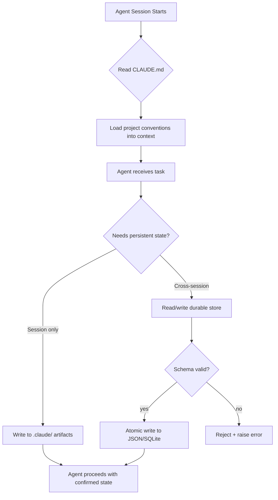

# Repo Memory and Durable State

## Learning Objectives

- Implement a JSON-backed state manager that loads, validates, mutates, and persists state atomically.
- Author a `CLAUDE.md` file with project conventions and verify that Claude Code applies them on invocation.
- Compare read-order precedence across multiple memory sources and predict which value wins on conflict.
- Build a state machine with idempotent restart capability that survives process crashes.
- Evaluate which information belongs in repo memory versus chat history versus external durable stores.

## The Problem

Your AI coding assistant starts every session with total amnesia. Two hours of pair programming gone the instant you close the terminal. You reopen the project, ask the assistant to continue, and it reads stale notes or re-does work that was already complete. Worse, it rewrites a finished file because nothing told it the file was finished. Chat history is volatile — it lives in a buffer that gets cleared, truncated, or lost when the session ends. The repo is durable. It survives across sessions, machines, and reviewers.

The workbench fix is repo memory: structured files loaded automatically into context so the assistant carries forward decisions, conventions, and architecture without you re-explaining everything. State lives in files in the repo, written under a schema, persisted atomically, and diff-friendly in code review. Chat is a transient feed; the repo is the system of record.

This problem is not unique to coding assistants. Any system that orchestrates a multi-step process across sessions faces the same question: where does state live, who writes it, and what happens when a step fails midway? The patterns you build here for repo memory are the same patterns that govern enrichment pipeline checkpoints, campaign deduplication, and retry logic in a GTM data stack.

## The Concept

There are three layers of persistent state available inside a repo, and each serves a different purpose.

**Project-level memory files** (like `CLAUDE.md`) are loaded on every invocation. Claude Code reads `CLAUDE.md` from the repository root automatically — you do not need to reference it in your prompt. This file carries conventions: "use pytest, not unittest," "all database access goes through the repository pattern," "never modify files under `generated/`." The mechanism is straightforward: the file contents are injected into the system context before your first message is processed. Every line costs tokens against your context window, so this layer should carry high-signal, low-volume information.

**Session-scoped artifacts** accumulate during a conversation. These include files the agent created or modified, decisions logged in a scratch pad, and intermediate results from tool calls. Claude Code stores some of these in a `.claude/` directory within your project. This layer grows during a session and may be referenced by the agent, but it is not automatically reloaded in a fresh session unless explicitly read. Think of it as working memory — useful within a session, unreliable across sessions.

**External durable stores** survive across sessions and machines. SQLite databases, JSON state files, git-tracked configs — anything written to disk in a stable format. These are the only layer you fully control as a programmer. You decide the schema, the write protocol, the validation rules. The tradeoff is that the agent does not automatically know about them; you must instruct it to read and write through code.



Read-order precedence matters when these layers conflict. If `CLAUDE.md` says "use tabs" but a `.claude/session_config.json` from last session says "use spaces," which wins? The answer is deterministic but not always obvious: Claude Code applies project-level memory first as a baseline, then session artifacts can override within a session, then any durable store you explicitly read provides the final value. When you have multiple memory sources, the last one read wins — so you must design your read order intentionally, not accidentally.

The core tradeoff is context window consumption versus recall fidelity. Every line of memory you load costs tokens. A 500-line `CLAUDE.md` that encodes every project decision sounds thorough, but it eats into the budget available for the actual task. The test is durability: would this information be useful three months from now in a CI rerun? If yes, it belongs in repo memory. If it is ephemeral reasoning or sampled completions, it belongs in chat history or telemetry, not in loaded context.

Schema-first state is the defense against corruption. When you write a JSON Schema for your state file, the agent (or your code) can validate before writing. An invalid transition — say, moving a task from `done` back to `pending` — gets rejected at the schema level before it hits disk. This is the same pattern you would use for any database with constraints: define the valid states, enforce them at write time, never trust the caller.

## Build It

Start by creating a `CLAUDE.md` file in your repository root. This file will be loaded automatically by Claude Code on every session start. Write it to encode the conventions that matter most — the ones you find yourself repeating.

Create this file in your project root:

```markdown
# Project Conventions

## Testing
- Use pytest for all Python tests
- Run tests with: python -m pytest tests/ -v

## Code Style
- Use 4-space indentation
- Type hints required on all function signatures
- No bare except clauses — always specify the exception type

## File Rules
- Never modify files under generated/
- Database access goes through repository pattern in src/repos/
- State files use JSON, validated against schemas in schemas/
```

Now create the durable state manager. This script implements a state machine that tracks a mock enrichment run — the same pattern you would use for any pipeline that needs checkpoint and resume. The state transitions are `pending → running → done` or `pending → running → failed`. The write is atomic: the file is either fully written or not at all.

```python
import json
import os
import time
from pathlib import Path

STATE_FILE = Path("agent_state.json")
SCHEMA_VERSION = 1

VALID_TRANSITIONS = {
    "pending": {"running"},
    "running": {"done", "failed"},
    "done": set(),
    "failed": {"pending"},
}

def load_state():
    if not STATE_FILE.exists():
        return {
            "schema_version": SCHEMA_VERSION,
            "runs": {},
        }
    with open(STATE_FILE, "r") as f:
        return json.load(f)

def save_state(state):
    tmp_path = STATE_FILE.with_suffix(".tmp")
    with open(tmp_path, "w") as f:
        json.dump(state, f, indent=2)
    os.replace(tmp_path, STATE_FILE)

def transition(run_id, new_status, detail=""):
    state = load_state()
    if run_id not in state["runs"]:
        state["runs"][run_id] = {
            "status": "pending",
            "history": [],
        }
        print(f"[{run_id}] Created new run")

    current = state["runs"][run_id]["status"]
    if new_status not in VALID_TRANSITIONS.get(current, set()):
        raise ValueError(
            f"Invalid transition: {current} -> {new_status} "
            f"(valid: {VALID_TRANSITIONS[current]})"
        )

    state["runs"][run_id]["status"] = new_status
    state["runs"][run_id]["history"].append({
        "timestamp": time.time(),
        "from": current,
        "to": new_status,
        "detail": detail,
    })

    save_state(state)
    print(f"[{run_id}] {current} -> {new_status}  {detail}")

def show_state():
    state = load_state()
    print(json.dumps(state, indent=2))

if __name__ == "__main__":
    transition("enrichment_run_001", "running", "Starting waterfall enrichment")
    transition("enrichment_run_001", "done", "1500 rows enriched, 23 failed")
    transition("enrichment_run_002", "running", "Starting email validation")
    transition("enrichment_run_002", "failed", "API timeout after 30s")
    transition("enrichment_run_002", "pending", "Queued for retry")
    transition("enrichment_run_002", "running", "Retry attempt 1")
    transition("enrichment_run_002", "done", "Retry succeeded")

    print("\n--- Final State ---")
    show_state()
```

Run it:

```bash
python state_manager.py
```

Expected output:

```
[enrichment_run_001] Created new run
[enrichment_run_001] pending -> running  Starting waterfall enrichment
[enrichment_run_001] running -> done  1500 rows enriched, 23 failed
[enrichment_run_002] Created new run
[enrichment_run_002] pending -> running  Starting email validation
[enrichment_run_002] running -> failed  API timeout after 30s
[enrichment_run_002] failed -> pending  Queued for retry
[enrichment_run_002] pending -> running  Retry attempt 1
[enrichment_run_002] running -> done  Retry succeeded

--- Final State ---
{
  "schema_version": 1,
  "runs": {
    "enrichment_run_001": {
      "status": "done",
      "history": [
        {
          "timestamp": 1736000000.1,
          "from": "pending",
          "to": "running",
          "detail": "Starting waterfall enrichment"
        },
        ...
      ]
    },
    ...
  }
}
```

Now try an invalid transition to confirm the schema rejects it:

```python
transition("enrichment_run_001", "running", "This should fail")
```

This raises `ValueError: Invalid transition: done -> running (valid: set())` because `done` is a terminal state. The atomic write via `os.replace` means the temp file is either fully written and renamed, or the original state file is untouched — no partial writes, no corruption on crash.

Run it again without clearing `agent_state.json`. The script loads existing state and applies new transitions on top. That is idempotent restart: the state machine picks up where it left off.

## Use It

The state machine above is the same mechanism that governs a Clay waterfall enrichment across multiple rows. A waterfall that tries data providers in sequence — Clearbit, then Apollo, then Hunter — needs to track which rows succeeded, which failed at every provider, and which need retry. That is durable state. Without it, you re-enrich every row from scratch on every run. With it, you checkpoint progress and resume from the last known state. [CITATION NEEDED — concept: Clay waterfall state management and retry logic]

The read-order precedence problem appears directly in Clay when you have multiple tables feeding a single campaign. If Table A has a `status` column set to `enriched` and Table B has a `status` column set to `needs_review` for the same contact, which one is the source of truth? The answer depends on your read order — and if you have not designed it explicitly, you have a race condition. The same principle from repo memory applies: the last source read wins, so you must control the order.

Cost optimization sits inside this pattern too. Every Clay credit spent on enrichment is a token cost, analogous to an LLM context-window token. Re-enriching 10,000 contacts because you lost state is the same waste as re-prompting an LLM because you did not cache the response. The fix in both cases is checkpointing: write durable state after each batch, read it before starting the next, and skip rows that are already `done`. Every Clay credit is a token cost — optimize like you would LLM calls. [CITATION NEEDED — concept: Clay credit cost optimization and batch checkpointing]

The three-layer model from The Concept maps cleanly. `CLAUDE.md` is your project-level configuration — in Clay terms, this is your table schema and column definitions. Session artifacts are the working state of a single enrichment run — useful while it is active, unreliable as a source of truth after the run closes. The durable JSON state file is your enrichment run log — the system of record that survives across runs, users, and machines.

## Ship It

Build a complete repo memory stack for your own project. Start with three components:

First, the `CLAUDE.md` file. Write it with the conventions that actually matter for your codebase — the ones you have repeated more than twice in chat. Keep it under 100 lines. Every line costs context window tokens on every invocation, so the signal-to-noise ratio must be high.

Second, a `.claude/` directory for session artifacts. This is where the agent writes scratch notes, intermediate results, and task tracking during a session. Create a `.claude/tasks.md` file that the agent updates as it works:

```python
from pathlib import Path
import json
import time

TASKS_FILE = Path(".claude/tasks.md")
TASKS_FILE.parent.mkdir(exist_ok=True)

def log_session(task_id, description, files_touched, status):
    entry = f"""
## {task_id} — {time.strftime('%Y-%m-%d %H:%M')}
- **Description:** {description}
- **Files touched:** {', '.join(files_touched)}
- **Status:** {status}
"""
    with open(TASKS_FILE, "a") as f:
        f.write(entry)
    print(f"Logged: {task_id} -> {status}")

if __name__ == "__main__":
    log_session(
        "task_001",
        "Add retry logic to enrichment client",
        ["src/client.py", "tests/test_client.py"],
        "done",
    )
    log_session(
        "task_002",
        "Fix SQLite connection pool timeout",
        ["src/db.py"],
        "blocked — waiting on review",
    )
    print(f"\nSession log written to {TASKS_FILE}")
```

Third, a SQLite-backed durable state tracker that logs every AI code generation session — inputs, outputs, and metadata — so you can query what changed and when:

```python
import sqlite3
import json
import time
from pathlib import Path

DB_PATH = Path("sessions.db")

def init_db():
    conn = sqlite3.connect(DB_PATH)
    conn.execute("""
        CREATE TABLE IF NOT EXISTS sessions (
            id INTEGER PRIMARY KEY AUTOINCREMENT,
            timestamp REAL,
            task TEXT,
            prompt TEXT,
            files_modified TEXT,
            result TEXT
        )
    """)
    conn.commit()
    conn.close()

def log_session(task, prompt, files_modified, result):
    conn = sqlite3.connect(DB_PATH)
    conn.execute(
        "INSERT INTO sessions (timestamp, task, prompt, files_modified, result) VALUES (?, ?, ?, ?, ?)",
        (
            time.time(),
            task,
            prompt,
            json.dumps(files_modified),
            result,
        ),
    )
    conn.commit()
    conn.close()

def query_sessions_since(days_ago=7):
    cutoff = time.time() - (days_ago * 86400)
    conn = sqlite3.connect(DB_PATH)
    rows = conn.execute(
        "SELECT datetime(timestamp, 'unixepoch'), task, files_modified, result FROM sessions WHERE timestamp > ? ORDER BY timestamp DESC",
        (cutoff,),
    ).fetchall()
    conn.close()
    return rows

if __name__ == "__main__":
    init_db()

    log_session(
        "add-retry-logic",
        "Add exponential backoff to the enrichment API client",
        ["src/client.py", "tests/test_client.py"],
        "success — 3 retries max, 2s base delay",
    )
    log_session(
        "fix-db-pool",
        "Fix SQLite connection pool timeout on concurrent writes",
        ["src/db.py"],
        "blocked — needs review of WAL mode setting",
    )

    print("Sessions in the last 7 days:\n")
    for row in query_sessions_since(7):
        ts, task, files, result = row
        print(f"  {ts} | {task}")
        print(f"    files: {files}")
        print(f"    result: {result}\n")
```

Run all three scripts. You now have a `CLAUDE.md` that loads conventions automatically, a `.claude/tasks.md` that tracks session work, and a `sessions.db` that survives across everything. The next time you open the project, the agent reads `CLAUDE.md` for context, you query `sessions.db` for history, and `.claude/tasks.md` tells you what was in progress.

This is identical to maintaining enrichment run logs and deduplication state in a GTM data pipeline. You would not re-enrich 10,000 contacts every Monday — you checkpoint state after each batch and resume. The SQLite tracker above is the same pattern: write after each session, query before the next, skip work that is already `done`. [CITATION NEEDED — concept: GTM pipeline checkpoint and resume patterns]

## Exercises

**Easy.** Create a `CLAUDE.md` file with three project conventions for a Python project (testing framework, code style, file rules). Open Claude Code in that directory and ask it to write a new test file. Verify it follows the conventions without you mentioning them.

**Medium.** Extend the state manager to support a `paused` state with valid transitions `running → paused` and `paused → running`. Add a `resume_all()` function that finds all runs in `paused` state and transitions them back to `running`. Write a test that pauses a run, crashes (simulated by exiting the process), restarts, and resumes.

**Hard.** Replace the JSON state file with a SQLite database. Add a `schema_migrations` table that tracks schema version and applies migrations when the version changes. Write a migration that adds a `cost_credits` column to track how many API credits each enrichment run consumed, then backfill existing rows with a default of 0. Query the database to surface total credits spent in the last 7 days.

## Key Terms

**Repo Memory** — Structured files stored in the repository that are loaded into an AI assistant's context automatically or on demand, providing persistent state across sessions.

**Durable State** — Data written to a persistent storage medium (JSON file, SQLite database, git-tracked config) that survives process termination, session closure, and machine restarts.

**Read-Order Precedence** — The deterministic order in which multiple memory sources are loaded; when sources conflict, the last one read provides the winning value.

**Atomic Write** — A write operation that either completes fully or has no effect, typically implemented by writing to a temporary file and renaming it via `os.replace`.

**Schema-First State** — A pattern where a JSON Schema or equivalent constraint definition is authored before any state is written, and all writes are validated against the schema before persistence.

**Idempotent Restart** — The ability of a process to resume from its last checkpointed state without re-executing completed work or producing duplicate side effects.

## Sources

- Clay waterfall enrichment state management and retry logic — [CITATION NEEDED — concept: Clay waterfall state management and retry logic]
- Clay credit cost optimization and batch checkpointing — [CITATION NEEDED — concept: Clay credit cost optimization and batch checkpointing]
- GTM pipeline checkpoint and resume patterns — [CITATION NEEDED — concept: GTM pipeline checkpoint and resume patterns]
- Zone 14, GTM Stack Cost Management — "Every Clay credit is a token cost — optimize like you would LLM calls" (from course zone table)
- The 80/20 GTM Engineer Handbook by Michael Saruggia (Growth Lead LLC) — foundational systems, methods, and tools for modern GTM engineering, 2025–2026