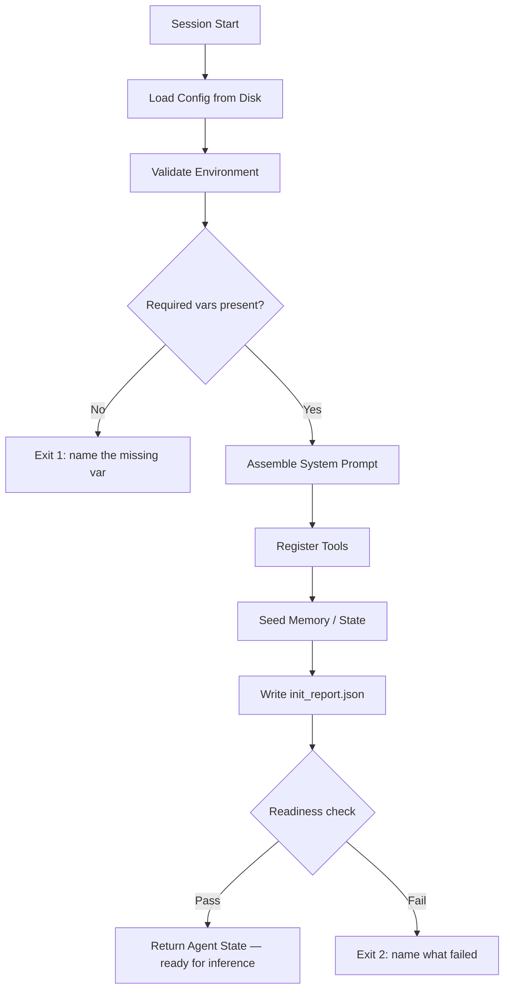

# Initialization Scripts for Agents

## Learning Objectives

1. Build an initialization script that loads configuration and produces a deterministic agent state.
2. Implement environment validation that fails loudly with actionable error messages and specific exit codes.
3. Construct a system prompt at boot time from modular components loaded from external config.
4. Compare implicit agent defaults against explicit initialization to quantify token cost across multiple runs.
5. Package an initialization script as a standalone CLI module that writes a reproducible boot report.

## The Problem

Every agent session that starts cold pays a setup tax. The agent reads the same files, retries the same probes, and rediscovers the same paths. It guesses the Python version. It guesses the test command. It lists the repository root five times to find the entry point. It tries to import a package that is not installed and then asks the user where the config file lives. By the time the agent makes its first real decision, thousands of tokens have gone to work that produces no output — work that should have been a single script that ran once.

This tax compounds across deployments. When you share an agent with a teammate, their runtime has different defaults. When you deploy to a server, the environment variables are different. When you run the agent on Monday vs. Friday, the working directory has drifted. An agent that boots without an explicit initialization script inherits whatever defaults the runtime provides at that moment — which means the behavior you observed locally is not the behavior you get in production, and neither of you knows why.

The fix is a deterministic initialization script that runs before the agent's first inference turn and writes its results to a boot report the agent reads at startup. Same inputs, same agent state, every time. The script is the contract between your intent and the runtime's reality.

## The Concept

An initialization script is a pure function: given the same config file, environment, and tool definitions, it produces the same agent state. It runs exactly once per session, before any inference turn, and its output is the starting point for everything the agent does afterward. The script replaces implicit conventions — "the agent will figure out where the tools are" — with explicit declarations that are written down, version-controlled, and verified at boot.

The boot sequence follows a strict order. Environment validation runs first because every subsequent step may depend on API keys, file paths, or runtime versions being present. Configuration load runs second, pulling from a file on disk. System prompt assembly runs third, combining modular prompt sections into a single string that the LLM receives as its operating context. Tool registration runs fourth, building the list of callable functions the agent can use. Memory seeding runs fifth, populating the agent's short-term state with initial context. Finally, a readiness check verifies that the assembled state meets minimum requirements before the agent is allowed to start.

Each step can fail, and the script must fail loudly — not silently. A missing API key at step one should produce a specific error message naming the variable and exit before the script wastes time assembling prompts it cannot use. A malformed config file at step two should report the parse error and the file path, not proceed with a partial load. This fail-fast discipline is what makes initialization scripts debuggable: you always know which step broke because the script told you.



The `init_report.json` file is the persistence layer. Once the script has probed the environment, loaded the config, and assembled the state, it writes the full result to disk. The next session — or the next agent instance — reads the report instead of re-running every probe. This is what makes the initialization script a one-time cost rather than a per-turn cost: the agent reads a file, not re-derives the answers.

## Build It

The initialization script below loads a JSON config file, validates required environment variables, assembles a system prompt from modular sections, registers a tool list, seeds short-term memory with context, and writes a boot report to disk. Every step prints its status so you can observe the boot sequence from the terminal. Save this as `agent_boot.py` and run it.

```python
import json
import os
import sys
from dataclasses import dataclass, asdict
from datetime import datetime, timezone
from pathlib import Path

@dataclass
class AgentState:
    agent_name: str
    model: str
    system_prompt: str
    tools: list
    memory: dict
    environment_status: dict
    booted_at: str

def write_default_config(path):
    config = {
        "agent_name": "outbound-qualifier",
        "model": "claude-sonnet-4-20250514",
        "system_prompt_sections": {
            "core_role": "You are a B2B outbound lead qualification agent. Evaluate leads against a defined ICP and assign a qualification score from 0 to 100.",
            "icp_definition": "Target: B2B SaaS companies, 50-500 employees, North America, using Salesforce or HubSpot, funding stage Series A through Series C.",
            "scoring_rules": "Score 0-100. Qualification threshold: 75. Factors: firmographics (40%), tech stack (25%), intent signals (20%), engagement history (15%)."
        },
        "tools": [
            {"name": "lookup_company", "description": "Look up company metadata from a domain name"},
            {"name": "score_lead", "description": "Score a lead against ICP criteria and return a 0-100 score"}
        ],
        "memory_seed": {
            "icp_threshold": 75,
            "target_segment": "B2B SaaS, 50-500 employees",
            "qualified_count": 0,
            "evaluated_count": 0
        },
        "required_env": ["HOME"]
    }
    Path(path).write_text(json.dumps(config, indent=2))
    return config

def validate_environment(required_vars):
    status = {}
    missing = []
    for var in required_vars:
        value = os.environ.get(var)
        if value:
            status[var] = "present"
        else:
            status[var] = "MISSING"
            missing.append(var)
    if missing:
        for m in missing:
            print(f"[BOOT FAIL] Environment variable not set: {m}", file=sys.stderr)
        print(f"[BOOT FAIL] Cannot proceed without required environment variables.", file=sys.stderr)
        sys.exit(1)
    return status

def assemble_system_prompt(sections):
    parts = []
    for name, content in sections.items():
        heading = name.replace("_", " ").title()
        parts.append(f"## {heading}\n{content}")
    return "\n\n".join(parts)

def register_tools(tool_defs):
    registry = []
    for tool in tool_defs:
        registry.append({
            "name": tool["name"],
            "description": tool["description"],
            "registered_at_step": "boot"
        })
    return registry

def seed_memory(seed_data):
    memory = dict(seed_data)
    memory["boot_time"] = datetime.now(timezone.utc).isoformat()
    return memory

def init_agent(config_path):
    print("[1/6] Loading config...")
    config = json.loads(Path(config_path).read_text())
    print(f"      Config loaded from {config_path}")

    print("[2/6] Validating environment...")
    env_status = validate_environment(config.get("required_env", []))
    print(f"      All {len(env_status)} required variables present")

    print("[3/6] Assembling system prompt...")
    system_prompt = assemble_system_prompt(config["system_prompt_sections"])
    print(f"      Prompt assembled: {len(system_prompt)} chars, {len(config['system_prompt_sections'])} sections")

    print("[4/6] Registering tools...")
    tools = register_tools(config["tools"])
    print(f"      {len(tools)} tools registered")

    print("[5/6] Seeding memory...")
    memory = seed_memory(config["memory_seed"])
    print(f"      Memory seeded with {len(memory)} keys")

    print("[6/6] Writing boot report...")
    state = AgentState(
        agent_name=config["agent_name"],
        model=config["model"],
        system_prompt=system_prompt,
        tools=tools,
        memory=memory,
        environment_status=env_status,
        booted_at=datetime.now(timezone.utc).isoformat()
    )

    report_path = Path("init_report.json")
    report_path.write_text(json.dumps(asdict(state), indent=2))
    print(f"      Boot report written to {report_path}")

    return state

if __name__ == "__main__":
    config_path = "agent_config.json"
    write_default_config(config_path)

    print("=" * 60)
    print("AGENT BOOT SEQUENCE")
    print("=" * 60)

    agent = init_agent(config_path)

    print()
    print("=" * 60)
    print(f"AGENT: {agent.agent_name}")
    print(f"MODEL: {agent.model}")
    print(f"BOOTED: {agent.booted_at}")
    print("=" * 60)
    print()
    print("--- SYSTEM PROMPT ---")
    print(agent.system_prompt)
    print()
    print(f"--- TOOLS ({len(agent.tools)}) ---")
    for t in agent.tools:
        print(f"  {t['name']}: {t['description']}")
    print()
    print("--- MEMORY ---")
    for k, v in agent.memory.items():
        print(f"  {k}: {v}")
    print()
    print(f"--- ENVIRONMENT ---")
    for k, v in agent.environment_status.items():
        print(f"  {k}: {v}")
    print()
    print("=" * 60)
    print("BOOT COMPLETE — READY FOR INFERENCE")
    print("=" * 60)
```

When you run this, you should see each boot step print its status, followed by the full agent state and a confirmation that `init_report.json` was written. The boot report on disk is what a subsequent agent session would read instead of re-running the entire sequence.

Now observe what happens when environment validation fails. The script below sets a required variable to something the agent cannot find, then calls `validate_environment` directly. The script exits with code 1 and a message that names the missing variable:

```python
import os
import sys

def validate_environment(required_vars):
    status = {}
    missing = []
    for var in required_vars:
        value = os.environ.get(var)
        if value:
            status[var] = "present"
        else:
            status[var] = "MISSING"
            missing.append(var)
    if missing:
        for m in missing:
            print(f"[BOOT FAIL] Environment variable not set: {m}", file=sys.stderr)
        print(f"[BOOT FAIL] Cannot proceed without required environment variables.", file=sys.stderr)
        sys.exit(1)
    return status

del os.environ["HOME"]
validate_environment(["HOME", "NONEXISTENT_API_KEY"])
```

The output tells you exactly which variables are missing and exits before any other boot step runs. This is the fail-loud discipline: the script does not proceed with a partial environment and hope for the best.

## Use It

Deterministic initialization scripts are the same mechanism behind ICP loading in a GTM stack. When you initialize an agent with a loaded ICP definition, company metadata, and scoring thresholds at boot, every subsequent inference turn operates within those guardrails without re-prompting the LLM to re-derive the scoring rules. The `icp_definition` section in the config above is not a placeholder — it is the kind of ICP definition that a GTM engineer would load at boot so that the agent's scoring logic is fixed for the entire session. [CITATION NEEDED — concept: ICP loading at agent boot in GTM automation]

The Clay waterfall enrichment pattern uses the same initialization structure. A waterfall enrichment cascade — where data sources are tried in priority order until a field is filled — requires a configuration that defines source priority, fallback behavior, and field mappings. Loading this cascade config once at boot and then executing against it for every record is the same as loading a system prompt and tool list once and then running inference against them. The initialization script is what turns a one-time configuration decision into a per-record execution pattern without re-loading the cascade on every API call. [CITATION NEEDED — concept: Clay waterfall enrichment config loading pattern]

There is also a direct cost connection. Zone 14 in the GTM stack table frames this explicitly: every Clay credit is a token cost, and you optimize it the same way you optimize LLM calls. An agent that re-derives its ICP thresholds on every inference turn is spending tokens on rediscovery instead of scoring. The initialization script pays that cost once — at boot — and writes the result to `init_report.json`. Every subsequent turn reads the resolved thresholds from state, not from a fresh LLM call. In a batch job processing 10,000 leads, the difference between booting once and re-prompting per record is the difference between a deployment that costs cents and one that costs dollars.

The same logic applies to enrichment cascades. If the cascade config is loaded at boot, the agent knows which data source to try first, second, and third for every record without querying the config system again. In a Clay workflow, each unnecessary enrichment step is a credit spent. Initialization scripts are the mechanism that prevents that waste.

## Ship It

Packaging the initialization script as a standalone module means it accepts a config path as a CLI argument, validates all required fields, and either returns a fully-initialized agent object or exits with a specific error code and message. This is how you deploy an agent to a server or share it with a teammate: the boot script is the entry point, and the config file is the only thing that changes between environments.

The script below is the CLI version of the boot module. It uses `argparse` to accept a config path, adds field-level validation that checks for required keys in the config file, and exits with distinct error codes: exit 1 for environment failures, exit 2 for config validation failures, exit 3 for file-not-found. Save this as `agent_cli.py` in the same directory as `agent_boot.py`:

```python
import json
import sys
from pathlib import Path
from datetime import datetime, timezone
from dataclasses import asdict

from agent_boot import (
    AgentState,
    validate_environment,
    assemble_system_prompt,
    register_tools,
    seed_memory
)

REQUIRED_CONFIG_KEYS = [
    "agent_name",
    "model",
    "system_prompt_sections",
    "tools",
    "memory_seed",
    "required_env"
]

def validate_config(config):
    missing_keys = [k for k in REQUIRED_CONFIG_KEYS if k not in config]
    if missing_keys:
        for k in missing_keys:
            print(f"[CONFIG FAIL] Missing required key: {k}", file=sys.stderr)
        print(f"[CONFIG FAIL] Config is missing {len(missing_keys)} required keys.", file=sys.stderr)
        sys.exit(2)

    if not isinstance(config["system_prompt_sections"], dict) or len(config["system_prompt_sections"]) == 0:
        print("[CONFIG FAIL] system_prompt_sections must be a non-empty dict.", file=sys.stderr)
        sys.exit(2)

    if not isinstance(config["tools"], list):
        print("[CONFIG FAIL] tools must be a list.", file=sys.stderr)
        sys.exit(2)

def boot(config_path):
    path = Path(config_path)
    if not path.exists():
        print(f"[BOOT FAIL] Config file not found: {config_path}", file=sys.stderr)
        sys.exit(3)

    config = json.loads(path.read_text())
    validate_config(config)

    env_status = validate_environment(config["required_env"])

    system_prompt = assemble_system_prompt(config["system_prompt_sections"])
    tools = register_tools(config["tools"])
    memory = seed_memory(config["memory_seed"])

    state = AgentState(
        agent_name=config["agent_name"],
        model=config["model"],
        system_prompt=system_prompt,
        tools=tools,
        memory=memory,
        environment_status=env_status,
        booted_at=datetime.now(timezone.utc).isoformat()
    )

    report = Path("init_report.json")
    report.write_text(json.dumps(asdict(state), indent=2))

    return state

if __name__ == "__main__":
    import argparse

    parser = argparse.ArgumentParser(description="Initialize an agent from a config file.")
    parser.add_argument("--config", required=True, help="Path to JSON config file")
    parser.add_argument("--quiet", action="store_true", help="Suppress state output")
    args = parser.parse_args()

    print(f"Booting agent from {args.config}...")
    state = boot(args.config)

    if not args.quiet:
        print()
        print(f"Agent:       {state.agent_name}")
        print(f"Model:       {state.model}")
        print(f"Booted at:   {state.booted_at}")
        print(f"Prompt:      {len(state.system_prompt)} chars")
        print(f"Tools:       {len(state.tools)} registered")
        print(f"Memory keys: {len(state.memory)}")
        print(f"Env vars:    {len(state.environment_status)} validated")
        print(f"Report:      init_report.json")
        print()
        print("READY FOR INFERENCE")
    else:
        print(f"OK {state.agent_name} booted, {len(state.tools)} tools, report at init_report.json")
```

Run it against the config file generated earlier:

```bash
python agent_cli.py --config agent_config.json
```

And in quiet mode for scripting:

```bash
python agent_cli.py --config agent_config.json --quiet
```

The error codes are the deployment contract. A CI pipeline can check the exit code: 0 means the agent booted and is ready, 1 means an environment variable is missing, 2 means the config is malformed, 3 means the file was not found. Each failure mode has a unique code and a message on stderr that names the specific problem. This is what makes the script operable in a deployment pipeline — you are not reading logs to figure out what went wrong, you are reading an exit code and a one-line error message.

## Exercises

**Easy.** Write an initialization script that loads a JSON config file containing a `system_prompt_sections` dict and prints the fully resolved system prompt to stdout. No environment validation, no tool registration — just config load and prompt assembly. Confirm the output matches the sections in the file.

**Medium.** Extend the Easy script to add tool registration and environment validation. The script must accept a `