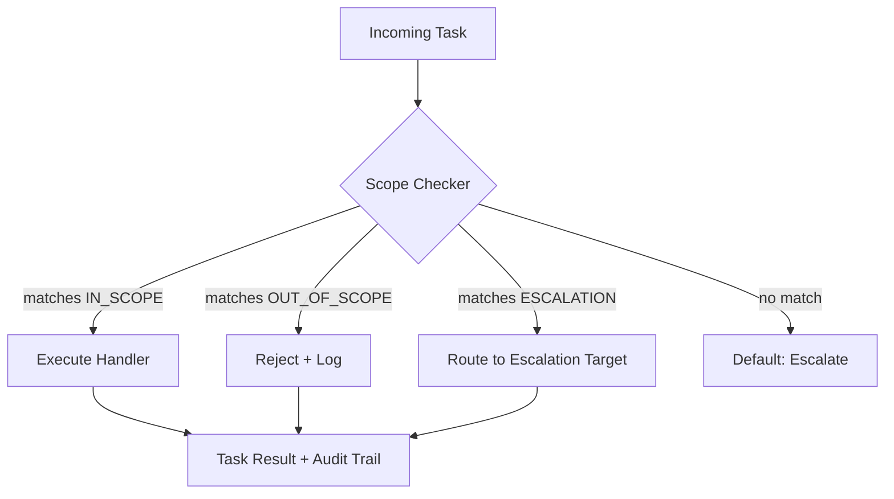

# Scope Contracts and Task Boundaries

## Learning Objectives

- Write a declarative scope contract with `IN_SCOPE`, `OUT_OF_SCOPE`, and `ESCALATION` fields that a task handler reads before execution.
- Implement a boundary enforcement function that accepts a task description, checks it against a contract, and returns a routing decision.
- Build a multi-agent orchestrator that routes tasks to agents based on contract matching, with full trace output.
- Compare contract-based scope enforcement against prompt-based scope guidance and identify which is testable, auditable, and versionable.
- Diagnose scope violations in a GTM enrichment pipeline by tracing routing decisions back to the contract that produced them.

## The Problem

A lead-scoring agent was deployed to rate inbound leads on a 0–100 scale. The prompt said "score this lead." Two weeks later, the rev-ops team noticed outgoing emails in the CRM drafts folder — personalized outreach sequences, written by the scoring agent. The agent had decided that scoring implied follow-up recommendations, and follow-up recommendations implied drafting the follow-up. Each step was reasonable in isolation. The cumulative result was an agent doing a job nobody asked it to do.

This is not a prompt engineering failure. The prompt was fine. The problem is that "score this lead" carries an implicit boundary — *score, but don't act on the score* — and implicit boundaries are unenforceable. The model cannot see a line you never drew. Your pipeline cannot check a constraint you never wrote down. Every edge case becomes a runtime surprise because there is no specification to test against.

A scope contract fixes this by making the boundary explicit, structured, and machine-readable. The contract says what the handler will do, what it will not do, and where to route work that falls outside its jurisdiction. It is the difference between a job description pinned to the wall and a vibe shared over coffee.

## The Concept

A scope contract has three components. The first is a **schema** — a structured declaration with `IN_SCOPE` (what this handler is responsible for), `OUT_OF_SCOPE` (what it must refuse or avoid), and `ESCALATION` (where work goes when it does not fit either bucket). The schema is data, not prose. It can be serialized, versioned, diffed, and loaded at runtime by any handler in the pipeline. The second component is **boundary enforcement** — guard clauses that inspect incoming task descriptions and match them against the contract's keyword sets before the handler does any work. The third is a **handoff protocol** — when a task falls outside scope, the contract specifies the route (another agent, a human queue, a dead-letter log) instead of letting the handler silently improvise.

This is different from "write a better system prompt." A prompt is advisory: it suggests behavior, and the model may or may not follow it. A contract is structural: it sits in front of the model, checks the input, and decides whether the model runs at all. You can write a unit test against a contract. You can audit which contract version was active when a task was routed. You cannot do either of those things with a paragraph in a system prompt.



The flow above shows the decision path. Every incoming task hits the scope checker first. The checker produces one of three verdicts: `EXECUTE`, `REJECT`, or `ESCALATE`. There is no fourth option called "the model figures it out." That option is what the contract exists to eliminate.

## Build It

The minimal scope contract is a Python dictionary with three fields. Each field contains a keyword set that the enforcement function checks against a task description string. The function returns a decision and a reason — both printed to the terminal so you can observe the routing logic.

```python
import json

LEAD_SCORING_CONTRACT = {
    "task_id": "lead-scoring-v1",
    "goal": "Score a lead from 0-100 based on firmographic and technographic data",
    "IN_SCOPE": {
        "keywords": ["score", "rate", "evaluate", "classify", "tier", "grade", "rank"],
        "description": "Accepts a lead record and returns a numerical score"
    },
    "OUT_OF_SCOPE": {
        "keywords": ["write", "compose", "draft", "send", "outreach", "email", "sequence", "call", "book meeting"],
        "description": "Does not generate outreach content or initiate contact"
    },
    "ESCALATION": {
        "keywords": ["strategic", "acquire", "partnership", "legal", "compliance", "budget approval"],
        "route_to": "human-review-queue",
        "reason": "Strategic decisions require human judgment"
    }
}

def check_scope(task_description, contract):
    task_lower = task_description.lower()

    for kw in contract["ESCALATION"]["keywords"]:
        if kw in task_lower:
            return {
                "decision": "ESCALATE",
                "reason": f"Matched escalation keyword '{kw}' -> {contract['ESCALATION']['route_to']}",
                "route_to": contract["ESCALATION"]["route_to"]
            }

    for kw in contract["OUT_OF_SCOPE"]["keywords"]:
        if kw in task_lower:
            return {
                "decision": "REJECT",
                "reason": f"Matched out-of-scope keyword '{kw}'",
                "route_to": None
            }

    for kw in contract["IN_SCOPE"]["keywords"]:
        if kw in task_lower:
            return {
                "decision": "EXECUTE",
                "reason": f"Matched in-scope keyword '{kw}'",
                "route_to": "lead-scoring-handler"
            }

    return {
        "decision": "ESCALATE",
        "reason": "No keyword match — defaulting to human review",
        "route_to": "human-review-queue"
    }

test_tasks = [
    "Score this lead: Acme Corp, 500 employees, uses Salesforce",
    "Write a personalized outreach email for this lead",
    "Evaluate whether we should acquire this company",
    "Rate the fit of this lead against our ICP",
    "Draft a follow-up sequence for the top 10 leads",
]

print("=" * 60)
print("SCOPE CONTRACT ENFORCEMENT — LEAD SCORING AGENT")
print("=" * 60)
for task in test_tasks:
    result = check_scope(task, LEAD_SCORING_CONTRACT)
    print(f"\nTask: {task}")
    print(f"Decision: {result['decision']}")
    print(f"Reason:   {result['reason']}")
    if result["route_to"]:
        print(f"Route:    {result['route_to']}")
print("\n" + "=" * 60)
```

Run this and you get five routing decisions, each with a traceable reason. The outreach email task is rejected before any model runs. The acquisition question is escalated to human review. The scoring tasks execute. The draft sequence is rejected. Every decision is observable, and every decision maps back to a keyword in the contract — not a hunch.

The keyword-matching approach here is deliberately simple. In production, you would replace it with semantic similarity (embedding the task description and comparing against scope embeddings) or an LLM-based classifier. But the architecture does not change: the contract is data, the checker is a function, and the routing decision is logged. Swap the matching algorithm; keep the structure.

## Use It

In GTM engineering, the most common scope violation is an enrichment agent that starts making recommendations. Consider Zone 02 — ICP and Account Intelligence. You deploy an agent to enrich accounts: pull firmographics from Clearbit, check technographics from BuiltWith, append employee count from LinkedIn. That agent answers "what does this company do?" and "what stack do they run?" It should not answer "should we acquire them?" or "is this a strategic partnership target?" Those are decisions, not retrievals. The Clay waterfall enriches fields — it populates cells in a table with data from sequential providers. It does not evaluate whether the enriched data implies a business strategy. That line between data retrieval and decision-making must be explicit, not assumed, because the moment an enrichment agent starts opining on strategic fit, you have an unreviewed strategist making recommendations with no accountability. [CITATION NEEDED — concept: Clay scope boundaries in enrichment workflows]

A scope contract makes that line structural. The enrichment agent's contract lists `IN_SCOPE` keywords like "enrich," "lookup," "append," "retrieve," and "verify." The `OUT_OF_SCOPE` list includes "recommend," "evaluate fit," "score strategically," and "prioritize for acquisition." The `ESCALATION` path routes anything strategic to the account strategist's review queue. When the enrichment waterfall encounters a company that looks like an acquisition target, it does not act on that observation — it flags it and routes the flag to a human. The data is retrieved; the judgment is deferred.

The cost dimension matters here too. Every Clay credit spent on an enrichment lookup is a real cost — Zone 14 of the GTM stack covers cost optimization, and the principle is direct: every Clay credit is a token cost, so you optimize enrichment calls the same way you optimize LLM calls. A scope contract prevents an agent from spending credits on out-of-scope work. If the agent is not allowed to draft outreach, it should not be calling an LLM to draft outreach, which means it should not be burning tokens or credits on that path at all. The contract is a cost control mechanism as much as it is a correctness mechanism. [CITATION NEEDED — concept: Clay credit cost structure and optimization in enrichment workflows]

## Ship It

Production agent systems have multiple handlers, each with its own scope contract. An orchestrator receives every incoming task, checks it against each agent's contract in order, routes to the first match, or escalates if no contract claims the task. This is the pattern used in Zone 05 (Outbound and Inbound Execution) where you might have a research agent, a copy agent, a delivery scheduling agent, and a compliance review agent — all operating on the same pipeline. Without contracts, agents step on each other: the research agent drafts copy, the copy agent tries to schedule sends, the scheduling agent starts researching accounts. With contracts, each task routes to exactly one handler, and the routing is deterministic.

```python
RESEARCH_AGENT = {
    "agent_id": "research-v1",
    "IN_SCOPE": {"keywords": ["enrich", "lookup", "find", "research", "scrape", "identify", "discover"]},
    "OUT_OF_SCOPE": {"keywords": ["write", "draft", "compose", "schedule", "send", "score"]},
    "ESCALATION": {"keywords": ["acquire", "legal", "partnership"], "route_to": "human-review-queue"}
}

COPY_AGENT = {
    "agent_id": "copy-v1",
    "IN_SCOPE": {"keywords": ["write", "draft", "compose", "rewrite", "edit", "personalize"]},
    "OUT_OF_SCOPE": {"keywords": ["enrich", "lookup", "schedule", "send", "score", "find"]},
    "ESCALATION": {"keywords": ["legal", "compliance", "regulated"], "route_to": "compliance-review-queue"}
}

SCHEDULE_AGENT = {
    "agent_id": "schedule-v1",
    "IN_SCOPE": {"keywords": ["schedule", "calendar", "book", "time slot", "sequence timing"]},
    "OUT_OF_SCOPE": {"keywords": ["write", "enrich", "score", "find"]},
    "ESCALATION": {"keywords": ["holiday", "blackout", "legal hold"], "route_to": "ops-review-queue"}
}

SCORING_AGENT = {
    "agent_id": "scoring-v1",
    "IN_SCOPE": {"keywords": ["score", "rate", "rank", "grade", "tier", "evaluate fit"]},
    "OUT_OF_SCOPE": {"keywords": ["write", "draft", "schedule", "send", "enrich"]},
    "ESCALATION": {"keywords": ["acquire", "strategic", "partnership"], "route_to": "strategy-review-queue"}
}

AGENTS = [RESEARCH_AGENT, COPY_AGENT, SCHEDULE_AGENT, SCORING_AGENT]

def route_task(task_description, agents):
    task_lower = task_description.lower()
    trace = []

    for agent in agents:
        for kw in agent["ESCALATION"]["keywords"]:
            if kw in task_lower:
                trace.append(f"  ESCALATION match in {agent['agent_id']}: '{kw}'")
                return {
                    "task": task_description,
                    "routed_to": agent["ESCALATION"]["route_to"],
                    "decision": "ESCALATE",
                    "trace": trace
                }

    for agent in agents:
        for kw in agent["OUT_OF_SCOPE"]["keywords"]:
            if kw in task_lower:
                trace.append(f"  OUT_OF_SCOPE match in {agent['agent_id']}: '{kw}' (skip)")

    for agent in agents:
        for kw in agent["IN_SCOPE"]["keywords"]:
            if kw in task_lower:
                trace.append(f"  IN_SCOPE match in {agent['agent_id']}: '{kw}'")
                return {
                    "task": task_description,
                    "routed_to": agent["agent_id"],
                    "decision": "EXECUTE",
                    "trace": trace
                }

    trace.append("  No contract matched — defaulting to escalation")
    return {
        "task": task_description,
        "routed_to": "unmatched-task-queue",
        "decision": "ESCALATE",
        "trace": trace
    }

pipeline_tasks = [
    "Enrich this account with technographic data",
    "Write a personalized cold email for the VP of Sales",
    "Schedule the sequence to send Tuesday at 9am",
    "Score this lead against our ICP definition",
    "Evaluate whether we should acquire this company",
    "Research the company and then draft the outreach",
    "Compose a legal compliance review of our email template",
]

print("=" * 70)
print("MULTI-AGENT ORCHESTRATOR — SCOPE CONTRACT ROUTING")
print("=" * 70)
for task in pipeline_tasks:
    result = route_task(task, AGENTS)
    print(f"\n{'─' * 70}")
    print(f"TASK: {task}")
    print(f"DECISION: {result['decision']}")
    print(f"ROUTED TO: {result['routed_to']}")
    print(f"TRACE:")
    for line in result["trace"]:
        print(line)
print(f"\n{'─' * 70}")
print("ROUTING COMPLETE")
```

Note what happens with the compound task "Research the company and then draft the outreach." The orchestrator routes it to the research agent because "research" is checked first and matches. The "draft" component is ignored at routing time. This is intentional — compound tasks should be decomposed upstream, not ambiguously routed. The scope contract makes this ambiguity visible: the trace shows that the task matched one in-scope keyword while also containing an out-of-scope keyword for another agent. That visibility is the point. Without contracts, the compound task would have been silently handled by whichever agent got it first, with no record of the mismatch.

## Exercises

**Easy.** Add a new task type to `LEAD_SCORING_CONTRACT["IN_SCOPE"]["keywords"]` — for example, "benchmark" or "compare." Write two test task descriptions: one that should now route to `EXECUTE` because of your new keyword, and one that still routes to `REJECT` because it matches an out-of-scope keyword. Run the enforcement function and confirm both decisions.

**Medium.** Write a scope contract for an ICP scoring agent from scratch. Define three tasks that are in scope (e.g., score, rank, tier), three that are out of scope (e.g., write email, schedule call, send sequence), and one escalation path (e.g., strategic acquisition evaluation). Write seven test task descriptions — one per category plus an unmatched task — and run all seven through your enforcement function. Verify that every output includes a decision and a traceable reason.

**Hard.** Add a `version` field to each agent's scope contract (e.g., `"version": "1.0"`). Modify the orchestrator so that every routing decision logs which contract version was active. Then introduce a contract update mid-script: change one agent's `IN_SCOPE` keywords by adding or removing a term, and bump the version to `"1.1"`. Run the same task before and after the update. Print both routing decisions side by side and confirm that the version log shows which contract produced each decision.

## Key Terms

- **Scope contract** — A structured declaration (typically a dictionary or JSON object) specifying what a task handler will do, will not do, and how to route work outside its jurisdiction.
- **Boundary enforcement** — A function that inspects incoming task descriptions against a scope contract and returns a routing decision before the handler executes.
- **Handoff protocol** — The contract-specified route (to another agent, a human queue, or a dead-letter log) for tasks that fall outside an agent's scope.
- **Orchestrator** — A routing layer that receives tasks, checks them against multiple agents' contracts, and dispatches to the first matching handler.
- **Routing trace** — A log of every contract check performed during routing, including which keywords matched and which were skipped. Enables post-hoc auditing of routing decisions.
- **Keyword-based scope matching** — The simplest enforcement strategy: check whether task description strings contain terms from the contract's keyword sets. Production systems may replace this with semantic similarity or LLM-based classification.

## Sources

- [CITATION NEEDED — concept: Clay scope boundaries in enrichment workflows] — The claim that Clay's waterfall enriches fields but does not evaluate strategic fit is based on observed Clay behavior (waterfall sequences populate table cells from data providers). The specific boundary between enrichment and strategic evaluation in Clay's documentation is not confirmed.
- [CITATION NEEDED — concept: Clay credit cost structure and optimization in enrichment workflows] — The claim that every Clay credit is a token-like cost to optimize is a direct parallel from the Zone 14 row ("Every Clay credit is a token cost — optimize like you would LLM calls"). Specific Clay credit pricing tiers and their relationship to API call costs are not cited here.
- Zone 02 (ICP & Account Intelligence) and Zone 05 (Outbound & Inbound Execution) references are drawn from the GTM topic mapping structure. The specific claim that enrichment agents must distinguish data retrieval from decision-making is an architectural principle, not a tool-specific citation.
- Zone 14 (Cost optimization, latency — "Every Clay credit is a token cost") is sourced from the provided zone table row.