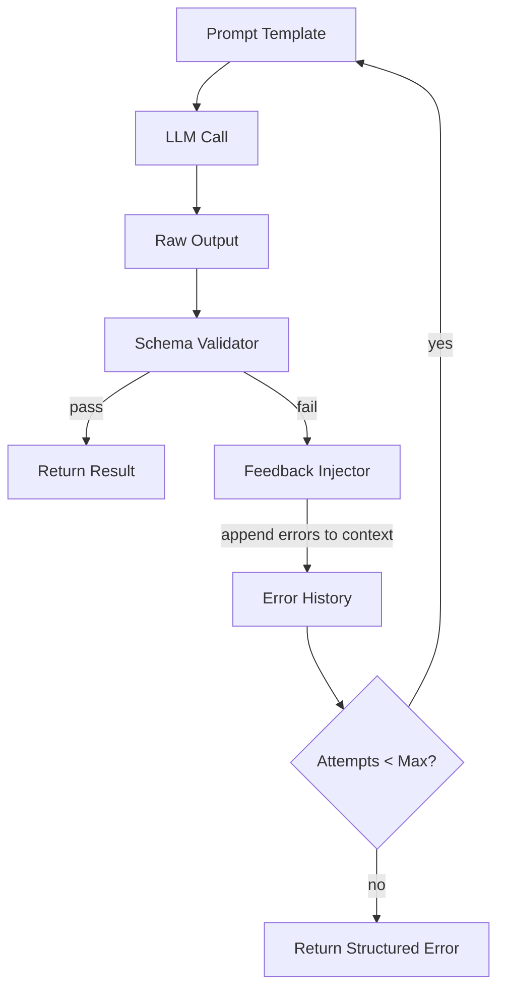

# Lesson: Runtime Feedback Loops

## Learning Objectives

- Build a synchronous feedback loop that validates LLM output against a schema and re-prompts with error context.
- Detect the three failure modes that require feedback injection: missing fields, invalid types, and constraint violations.
- Implement a termination condition that returns a structured error instead of retrying indefinitely.
- Compare a self-correcting loop to a fire-and-forget pipeline and identify when each is appropriate.
- Trace the cost implications of multi-attempt loops in a GTM enrichment context where each retry consumes credits or API budget.

## The Problem

An LLM extracts company data from a raw description. The prompt asks for JSON with `company_name`, `industry`, and `employee_range`. The model returns `{"name": "Stripe", "sector": "Fintech"}` — wrong keys, missing field, hallucinated schema key. Your pipeline accepts it, writes it to the CRM, and three weeks later a BDR is calling a prospect with the wrong industry label because `sector` never mapped to `industry`. The script ran without error because Python parsed valid JSON. The output was structurally valid but semantically wrong, and nothing in the system caught it.

This is the gap between a script that calls an LLM and a system that uses an LLM. The script treats model output as ground truth — whatever comes back goes into the database. The system treats model output as a hypothesis that must be validated before it is trusted. When the hypothesis fails validation, the system does not crash. It feeds the failure back into the input and tries again, carrying the error context so the model can correct itself.

The same gap exists in GTM enrichment. A data provider returns a company profile with `industry: null` because it could not classify the company. Without a feedback loop, that null propagates downstream — your segmentation rules misfire, your personalization templates render with blank fields, and your waterfall stops at the first provider even though a second provider might have the data. The enrichment waterfall pattern is a feedback loop: validate the output, note what is missing, route to the next source with that context. The alternative is silent data loss dressed up as a successful API call.

## The Concept

A runtime feedback loop has three components: a **validator** that checks output against a schema or constraint, a **feedback injector** that appends error context to the next prompt, and a **termination condition** that prevents infinite retries. The mechanism is a `while` loop with state mutation — each iteration accumulates error history so the model sees what failed and why. The model's weights never change. The loop changes the *input context* based on the *output failure*, which is a fundamentally different mechanism from fine-tuning or RLHF.



The critical design decision is the termination condition. A loop without one is an infinite retry on persistent failures — the model keeps making the same mistake, the prompt keeps growing with error context, and the token budget explodes. Three mechanisms prevent this: a hard cap on attempts (simplest), a confidence threshold (requires the model to self-score), or a complexity escalation (switch to a different prompt template on repeated failure). The hard cap is the sane default because it does not depend on the model's ability to assess its own confidence honestly.

The feedback injection itself follows a pattern: the original prompt stays intact, the model's failed output is appended verbatim, and the error description is appended in plain language. This matters because the model needs to see what it produced, not just that it failed. "Your output was invalid" is useless feedback. "Your output used the key `sector` but the required key is `industry`. Your output was: {\"sector\": \"Fintech\"}. Please produce valid JSON with the key `industry`" is actionable feedback. The model corrects because it can diff its output against the stated constraint.

## Build It

The first example runs without an API key. A deterministic function simulates an LLM that makes specific mistakes on the first two attempts and succeeds on the third. This lets you observe the feedback loop mechanics — validation failure, error injection, retry, success — without spending tokens or configuring authentication.

```python
import json

SCHEMA = {
    "company_name": str,
    "industry": str,
    "employee_range": str,
}

def validate(data, schema):
    errors = []
    for field, expected_type in schema.items():
        if field not in data:
            errors.append(f"Missing required field: {field}")
        elif not isinstance(data[field], expected_type):
            errors.append(
                f"Field {field} must be {expected_type.__name__}, "
                f"got {type(data[field]).__name__}"
            )
    return errors

attempts_log = []

def simulated_llm(prompt, attempt_number):
    if attempt_number == 0:
        return {"name": "Stripe", "sector": "Fintech"}
    if attempt_number == 1:
        return {"company_name": "Stripe", "industry": "Fintech"}
    return {
        "company_name": "Stripe",
        "industry": "Financial Technology",
        "employee_range": "5000-10000",
    }

def parse_output(raw):
    try:
        return json.loads(raw) if isinstance(raw, str) else raw
    except json.JSONDecodeError as e:
        return {"__parse_error__": str(e)}

def feedback_loop(prompt_template, max_attempts=3):
    error_history = []
    for attempt in range(max_attempts):
        full_prompt = prompt_template
        if error_history:
            feedback = (
                "\n\nPrevious attempt failed with these errors:\n"
                + "\n".join(f"- {e}" for e in error_history[-1])
                + "\nPlease correct these issues."
            )
            full_prompt = prompt_template + feedback

        print(f"--- Attempt {attempt + 1} ---")
        print(f"Prompt being sent:\n{full_prompt}\n")

        raw_output = simulated_llm(full_prompt, attempt)
        data = parse_output(raw_output)
        print(f"Raw output: {data}")

        errors = validate(data, SCHEMA)
        attempts_log.append({
            "attempt": attempt + 1,
            "output": data,
            "errors": errors,
        })

        if not errors:
            print(f"Validation passed.\n")
            return {"success": True, "data": data, "attempts": attempt + 1}

        print(f"Validation failed: {errors}\n")
        error_history.append(errors)

    return {
        "success": False,
        "last_errors": error_history[-1],
        "attempts": max_attempts,
    }

base_prompt = (
    "Extract company information as JSON with exactly these fields: "
    "company_name (string), industry (string), employee_range (string).\n"
    "Company description: Stripe is a financial technology company "
    "that builds payment infrastructure for the internet."
)

result = feedback_loop(base_prompt)

print("=== FINAL RESULT ===")
print(json.dumps(result, indent=2))
print(f"\n=== ATTEMPT LOG ===")
for entry in attempts_log:
    status = "PASS" if not entry["errors"] else "FAIL"
    print(
        f"Attempt {entry['attempt']}: {status} | "
        f"Output keys: {list(entry['output'].keys())} | "
        f"Errors: {entry['errors']}"
    )
```

Run this and you see three things: attempt 1 fails because the model used `name` and `sector` instead of `company_name` and `industry` and omitted `employee_range` entirely. Attempt 2 fails because `employee_range` is still missing. Attempt 3 succeeds because the accumulated error history told the model exactly what was wrong. The loop produced a correct result that a fire-and-forget call would never have caught.

The second example shows the same pattern against a real API. It requires an Anthropic API key and will not run without one, but the structure is production-shaped — same validator, same feedback injection, same termination logic.

```python
import json
import os
from anthropic import Anthropic

client = Anthropic(api_key=os.environ.get("ANTHROPIC_API_KEY"))

SCHEMA = {
    "company_name": str,
    "industry": str,
    "employee_range": str,
}

def validate(data, schema):
    errors = []
    for field, expected_type in schema.items():
        if field not in data:
            errors.append(f"Missing required field: {field}")
        elif not isinstance(data[field], expected_type):
            errors.append(
                f"Field {field} must be {expected_type.__name__}, "
                f"got {type(data[field]).__name__}"
            )
    return errors

def call_claude(prompt):
    response = client.messages.create(
        model="claude-sonnet-4-20250514",
        max_tokens=512,
        messages=[{"role": "user", "content": prompt}],
    )
    return response.content[0].text

def feedback_loop_live(prompt_template, max_attempts=3):
    error_history = []
    for attempt in range(max_attempts):
        full_prompt = prompt_template
        if error_history:
            feedback = (
                "\n\nYour previous response failed validation:\n"
                + "\n".join(f"- {e}" for e in error_history[-1])
                + "\nReturn ONLY valid JSON with the correct fields."
            )
            full_prompt = prompt_template + feedback

        print(f"--- Attempt {attempt + 1} ---")
        raw = call_claude(full_prompt)
        print(f"Raw LLM output: {raw}")

        try:
            data = json.loads(raw.strip())
        except json.JSONDecodeError as e:
            data = {}
            error_history.append([f"JSON parse error: {e}"])
            print(f"Parse failed: {e}\n")
            continue

        errors = validate(data, SCHEMA)
        if not errors:
            print("Validation passed.\n")
            return {"success": True, "data": data, "attempts": attempt + 1}

        print(f"Validation errors: {errors}\n")
        error_history.append(errors)

    return {
        "success": False,
        "last_errors": error_history[-1],
        "attempts": max_attempts,
    }

base_prompt = (
    "Extract company information from the following description. "
    "Return ONLY a JSON object (no markdown, no explanation) with "
    "exactly these fields:\n"
    "- company_name (string)\n"
    "- industry (string)\n"
    "- employee_range (string)\n\n"
    "Description: A 200-person logistics startup based in Berlin "
    "that builds drone delivery software for European pharmacies."
)

result = feedback_loop_live(base_prompt)
print(json.dumps(result, indent=2))
```

The structure is identical to the simulation — same validator, same feedback injection, same loop with a hard cap. The only difference is that `simulated_llm` is replaced with a real API call. This is the point: the feedback loop pattern is model-agnostic. You can swap Claude for GPT-4 for a local model and the validator, injector, and termination logic do not change.

## Use It

The enrichment waterfall in Clay is a runtime feedback loop applied to data providers instead of LLM calls. When Clay enriches a company profile and the first provider returns incomplete fields, the system validates the output, identifies the missing fields, and routes to the next provider with that context. [CITATION NEEDED — concept: Clay enrichment waterfall implementation details, whether error context is passed between providers]. The mechanism is the same: validate output, inject failure context, retry with adjusted input. Whether the "model" is an LLM or a data provider API does not change the loop structure.

Consider a lead enrichment pipeline where you ask an LLM to classify a company's industry from its website text. The classification returns `"industry": null` because the website was a generic landing page with no industry signal. Without a feedback loop, that null goes straight to your CRM. With a feedback loop, the validator catches the null, the injector adds context like "The previous classification returned null. The website text mentioned healthcare compliance and patient data — classify based on these signals," and the retry produces `"industry": "Healthcare Technology"`. The loop cost one extra API call. The cost of the null propagating through your segmentation, personalization, and routing logic is far higher — wrong playbook assignment, irrelevant outreach, wasted SDR time.

The cost dimension matters in GTM specifically because of Zone 14: credit and token economics. Every retry in a feedback loop is an API call, and every API call has a price. A three-attempt loop on 10,000 leads is 30,000 calls in the worst case, plus the tokens for the growing error context on each retry. The design question is not "should I use a feedback loop" but "what is the maximum cost per enrichment I will accept, and does that budget allow for three attempts on average." If your average success rate on attempt 1 is 85%, your expected attempts per record is `1 + 0.15 + 0.15*0.15 = 1.17`, which is cheap. If your attempt-1 success rate is 50%, the expected attempts climb to `1 + 0.5 + 0.25 = 1.75`, and you need to decide whether the data quality improvement justifies the 75% cost premium. [CITATION NEEDED — concept: Clay credit cost per enrichment step and average provider success rates].

## Ship It

In production, three things change from the examples above. First, the validator gets more specific — instead of just checking field presence and type, it checks value constraints: `employee_range` must be one of `["1-10", "11-50", "51-200", "201-500", "501-1000", "1000+"]`, `industry` must be one of your accepted industry taxonomy values, `company_name` must not be empty or all whitespace. Second, the feedback loop logs every attempt to persistent storage — not just to stdout — so you can analyze failure patterns across thousands of records and identify whether specific input types systematically require more retries. Third, the termination condition becomes cost-aware: the loop checks remaining budget (API credits, token budget, wall-clock time) and terminates early if the budget is exhausted, even if attempts remain.

The production pattern also separates the feedback loop from the business logic. The loop returns a structured result — either `{"success": True, "data": ..., "attempts": n}` or `{"success": False, "errors": [...], "attempts": n}` — and the calling code decides what to do with failures. For enrichment, a failed extraction might write `null` to the CRM and flag the record for manual review. For a classification pipeline, a failure might fall back to a default label. The loop does not make this decision. The loop detects failure, tries to correct it, and reports the outcome. What happens next is a business rule.

Here is a production-shaped validator with value constraints and structured logging:

```python
import json
from datetime import datetime, timezone

VALID_RANGES = {"1-10", "11-50", "51-200", "201-500", "501-1000", "1000+"}
VALID_INDUSTRIES = {
    "SaaS", "Fintech", "Healthcare", "E-Commerce", "Logistics",
    "Manufacturing", "Media", "Education", "Real Estate", "Other",
}

def validate_company(data):
    errors = []
    for field in ("company_name", "industry", "employee_range"):
        if field not in data:
            errors.append(f"Missing required field: {field}")
        elif not isinstance(data[field], str) or not data[field].strip():
            errors.append(f"Field {field} must be a non-empty string")
    if "employee_range" in data and data["employee_range"] not in VALID_RANGES:
        errors.append(
            f"employee_range must be one of {sorted(VALID_RANGES)}, "
            f"got: {data['employee_range']}"
        )
    if "industry" in data and data["industry"] not in VALID_INDUSTRIES:
        errors.append(
            f"industry must be one of {sorted(VALID_INDUSTRIES)}, "
            f"got: {data['industry']}"
        )
    return errors

def enrichment_loop(
    extract_fn, raw_text, entity_id, max_attempts=3
):
    base_prompt = (
        "Extract company data as JSON with fields: "
        "company_name, industry (one of: "
        + ", ".join(sorted(VALID_INDUSTRIES))
        + "), employee_range (one of: "
        + ", ".join(sorted(VALID_RANGES))
        + ").\n\nText: " + raw_text
    )
    log = []
    error_history = []

    for attempt in range(max_attempts):
        prompt = base_prompt
        if error_history:
            prompt += (
                "\n\nPrevious errors:\n"
                + "\n".join(f"- {e}" for e in error_history[-1])
            )
        raw_output = extract_fn(prompt)
        try:
            data = json.loads(raw_output)
        except (json.JSONDecodeError, TypeError) as e:
            data = {}
            error_history.append([f"JSON parse error: {e}"])
            log.append({"entity_id": entity_id, "attempt": attempt + 1,
                        "status": "parse_error", "raw": str(raw_output)[:200]})
            continue

        errors = validate_company(data)
        log.append({
            "entity_id": entity_id,
            "attempt": attempt + 1,
            "status": "pass" if not errors else "validation_error",
            "errors": errors,
            "timestamp": datetime.now(timezone.utc).isoformat(),
        })

        if not errors:
            return {"success": True, "data": data, "log": log}

        error_history.append(errors)

    return {"success": False, "errors": error_history[-1], "log": log}

def mock_extract(prompt):
    if "Previous errors" in prompt:
        return json.dumps({
            "company_name": "TestCo",
            "industry": "SaaS",
            "employee_range": "11-50",
        })
    return json.dumps({
        "company_name": "TestCo",
        "industry": "Software",
        "employee_range": "50 people",
    })

result = enrichment_loop(
    mock_extract,
    "TestCo is a software company with about 50 employees.",
    entity_id="rec_001",
)

print(json.dumps(result, indent=2))
```

Attempt 1 fails because `"Software"` is not in the valid industry set and `"50 people"` is not a valid range. Attempt 2 succeeds because the feedback context told the model the exact valid values. The log records both attempts with timestamps, which you would persist to analyze extraction quality across your full dataset over time.

## Exercises

**Easy:** Add a `website_url` field to the schema and make it a required string. Run the simulated feedback loop and observe how the retry behavior changes — you should see the loop take an additional attempt because the simulated model does not produce `website_url` until the feedback tells it to.

**Medium:** Replace the static `max_attempts=3` termination with a confidence-based termination. Modify `simulated_llm` to return a confidence score alongside the data (simulate it as `0.6` on attempt 0, `0.75` on attempt 1, `0.9` on attempt 2). Add a confidence threshold parameter to `feedback_loop`. The loop should stop as soon as validation passes AND confidence is above `0.8`. Print the confidence at each attempt.

**Hard:** Implement a branching feedback loop. Instead of always retrying the same prompt template, add a fallback template that activates when the same error appears twice. For example, if `employee_range` is missing on both attempt 1 and attempt 2, switch to a prompt that says "Forget everything else. Just tell me the employee count range from this text. Return only one of: 1-10, 11-50, 51-200, 201-500, 501-1000, 1000+." This mirrors the enrichment waterfall pattern — when one approach fails repeatedly, escalate to a different strategy rather than repeating the same failure.

## Key Terms

- **Validator** — A function that checks LLM output against a schema or constraint set and returns a list of specific errors. The validator does not modify the output; it only reports what failed.
- **Feedback Injector** — The component that appends validation errors to the prompt for the next retry. The injection includes the failed output verbatim and a plain-language description of what was wrong.
- **Termination Condition** — The rule that stops the loop: a hard attempt cap, a confidence threshold, a budget limit, or a complexity escalation trigger. Without one, the loop retries indefinitely on persistent failures.
- **Feedback Record** — A structured log entry containing the attempt number, input prompt, raw output, validation errors, and timestamp. Used for post-hoc analysis of failure patterns.
- **Enrichment Waterfall** — The GTM application of a runtime feedback loop across data providers: validate provider output, identify missing fields, route to the next provider with context about the gap.

## Sources

- [CITATION NEEDED — concept: Clay enrichment waterfall implementation details, whether error context is passed between providers]
- [CITATION NEEDED — concept: Clay credit cost per enrichment step and average provider success rates]
- Zone 14, GTM Stack Cost Management: "Every Clay credit is a token cost — optimize like you would LLM calls" (from GTM topic map, Zone table row 14)
- Anthropic API documentation for `messages.create` — https://docs.anthropic.com/en/api/messages