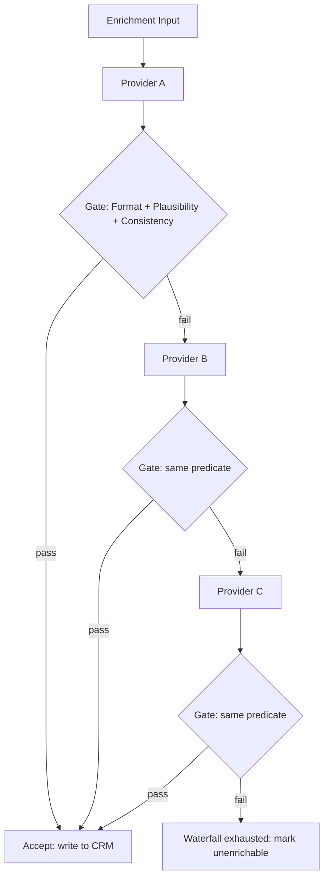

# Verification Gates

## Learning Objectives

- Implement verification gates as pure boolean functions that accept or reject enrichment results.
- Compose multiple gates using AND logic to form a composite predicate across format, plausibility, and consistency dimensions.
- Trace which specific gate caused each rejection in a batch of enrichment records and report the reason.
- Map Python gate logic to Clay's conditional run column mechanism inside an enrichment waterfall.
- Compute the credit-cost impact of inserting gates between waterfall steps.

## The Problem

A waterfall that enriches 10,000 accounts through three providers but accepts every result without inspection has a name: a garbage pipeline. The providers do not guarantee correctness. They return their best guess, charge you a credit for the guess, and move on. If that guess is an email with no domain, a revenue figure of negative four million, or an employee count of twelve million for a two-person startup, the pipeline accepts it, writes it to the CRM, and the rot begins.

One missing gate can corrupt a contact database for months. A sales rep emails a dead address, a rev-ops dashboard reports impossible revenue numbers, an ICP filter silently excludes good accounts because a provider returned a garbage industry code. The damage is quiet. You discover it in a pipeline review when someone asks why last quarter's enrichment had a 3% reply rate on 40,000 contacts, and the answer is that half the emails were syntactically invalid before they were ever sent.

Verification gates are the boolean filters that sit between enrichment steps and reject bad output before it reaches downstream systems. They are not a feature of any specific tool — they are a control-flow pattern you can implement in Python, in a Clay formula column, or in a dbt test. The pattern is the same in all three: take the enrichment result, evaluate a predicate, and decide whether the value proceeds or gets sent back to the next provider in the waterfall.

## The Concept

A verification gate is a pure function. It takes an enrichment result as input and returns a boolean: `True` means accept the value and short-circuit the waterfall, `False` means reject it and let the waterfall fall through to the next provider. The gate produces no side effects. It does not modify the record. It does not call an API. It reads the data, applies a rule, and returns a verdict. This purity is what makes gates composable and testable — you can chain any number of them without worrying about order-dependent mutations.

Three gate types cover the majority of enrichment failure modes. **Format gates** check structural correctness: does the email match RFC 5322? Does the domain have a valid TLD? Does the phone number have the right number of digits? These are regex or pattern checks — fast, deterministic, and zero-cost. **Plausibility gates** check whether the value falls within a credible range: is the employee count between 1 and 10 million? Is the revenue between $0 and $10 trillion? Is the founding year after 1600? These catch provider hallucinations and data-entry corruption. **Consistency gates** cross-reference the returned value against other fields in the same record: does the email domain match the company website? Does the HQ country match the company's primary market? Does the LinkedIn URL contain the company slug?

Gates compose with AND logic. A record must pass every gate to be accepted. If any gate returns `False`, the record is rejected and the waterfall proceeds to the next provider. This composition is the key mechanism — you are building a compound boolean predicate that controls the flow of data through your pipeline. A rejected result does not mean the record is bad forever; it means this provider's answer for this record is not trustworthy enough to use, and the next provider gets a chance.



The diagram above is the control-flow structure of an enrichment waterfall with verification gates. Each provider produces a candidate value. The gate — the same compound predicate each time — decides whether that candidate is accepted or whether the waterfall continues. When all providers are exhausted, the record is marked unenrichable rather than being written with garbage data. This is the mechanism that Clay implements when you configure a conditional run column between enrichment steps: the formula evaluates the previous step's output and returns a boolean that determines whether the next step executes. The conditional run column is a verification gate. Same predicate, same control flow, different interface.

## Build It

The implementation is straightforward: define each gate as a function that takes a record dictionary and returns a tuple of `(bool, str)` — the boolean is the verdict, the string is the reason. Returning the reason alongside the verdict is critical for observability. A gate that returns bare `True` or `False` tells you nothing when 40% of your records are rejected. You need to know which gate is firing and why.

```python
import re

def format_gate_email(record):
    pattern = r'^[a-zA-Z0-9._%+-]+@[a-zA-Z0-9.-]+\.[a-zA-Z]{2,}$'
    email = record.get("email")
    if not email:
        return False, "format_gate_email: missing email field"
    if not re.match(pattern, str(email)):
        return False, f"format_gate_email: '{email}' does not match RFC 5322"
    return True, "format_gate_email: pass"

def plausibility_gate_employees(record, min_val=1, max_val=1000000):
    count = record.get("employee_count")
    if count is None:
        return False, "plausibility_gate_employees: missing employee_count"
    if not isinstance(count, (int, float)):
        return False, f"plausibility_gate_employees: non-numeric value '{count}'"
    if count < min_val or count > max_val:
        return False, f"plausibility_gate_employees: {count} outside [{min_val}, {max_val}]"
    return True, "plausibility_gate_employees: pass"

def consistency_gate_domain(record):
    company = record.get("company_name", "")
    domain = record.get("domain", "")
    if not company or not domain:
        return False, "consistency_gate_domain: missing company_name or domain"
    company_slug = re.sub(r'[^a-z0-9]', '', company.lower())
    domain_root = domain.lower().split(".")[0]
    if company_slug not in domain_root and domain_root not in company_slug:
        return False, f"consistency_gate_domain: '{domain_root}' does not match '{company_slug}'"
    return True, "consistency_gate_domain: pass"

def composite_gate(record, gates):
    for gate_fn in gates:
        passed, message = gate_fn(record)
        if not passed:
            return False, message
    return True, "all gates passed"

mock_results = [
    {"company_name": "Stripe", "domain": "stripe.com",
     "email": "billing@stripe.com", "employee_count": 7000},
    {"company_name": "Acme Corp", "domain": "acmecorp.io",
     "email": "not-an-email", "employee_count": 250},
    {"company_name": "Globex", "domain": "example.com",
     "email": "contact@globex.com", "employee_count": 500},
    {"company_name": "Initech", "domain": "initech.com",
     "email": "support@initech.com", "employee_count": -5},
    {"company_name": "Hooli", "domain": "hooli.com",
     "email": "dev@hooli.com", "employee_count": 15000},
]

gates = [format_gate_email, plausibility_gate_employees, consistency_gate_domain]

print("=" * 70)
print("VERIFICATION GATE BATCH RESULTS")
print("=" * 70)

for i, record in enumerate(mock_results, 1):
    passed, message = composite_gate(record, gates)
    status = "ACCEPT" if passed else "REJECT"
    print(f"\nRecord {i}: {record['company_name']}")
    print(f"  Status:   {status}")
    print(f"  Verdict:  {message}")

print("\n" + "=" * 70)
accepted = sum(1 for r in mock_results if composite_gate(r, gates)[0])
rejected = len(mock_results) - accepted
print(f"Accepted: {accepted}/{len(mock_results)}")
print(f"Rejected: {rejected}/{len(mock_results)}")
print("=" * 70)
```

Run this and you get five records evaluated against three gates, with the exact gate and reason printed for every rejection. Record 1 (Stripe) passes all three gates. Record 2 (Acme Corp) fails the format gate on the email field — `"not-an-email"` does not match the RFC 5322 pattern. Record 3 (Globex) fails the consistency gate — the domain `example.com` does not match the company slug `globex`. Record 4 (Initech) fails the plausibility gate — an employee count of `-5` is outside the allowed range. Record 5 (Hooli) passes all three.

The composite gate short-circuits: it evaluates gates in order and returns `False` on the first failure. This means the order of gates in the list determines which gate gets blamed when multiple gates would fail. Put the cheapest gate first (format checks are regex matches — nanoseconds) and the most expensive last (consistency checks may require additional lookups in a real system). This ordering minimizes compute cost when rejection rates are high.

## Use It

Verification gates — the same boolean predicates built above — are the mechanism that controls step-to-step flow inside a Clay enrichment waterfall. In Clay, the gate lives in a conditional run column: a formula that evaluates the output of the previous enrichment step and returns `True` or `False`. If the formula returns `False`, the next provider in the waterfall executes. If it returns `True`, the waterfall short-circuits and the accepted value is written to the record. The conditional run column is the gate. The formula is the predicate. The mechanism is identical to the Python `composite_gate` function — only the interface changes.

Consider a concrete Clay waterfall for company revenue enrichment. You configure three providers in sequence: Provider A (a primary data vendor), Provider B (a secondary vendor), Provider C (a fallback like Claygent scraping the company website). Between each step, you insert a conditional run column with a formula like `IF(AND(revenue > 0, revenue < 10000000000000), false, true)` — this formula evaluates whether the previous step's revenue output is plausible. If the revenue is zero or absurdly large, the formula returns `true` (meaning "run the next step"), and the waterfall falls through to the next provider. The `AND` inside the formula is the same AND composition used in the Python `composite_gate`.

The cost implications are direct and measurable. Every Clay credit spent on enrichment is a token cost — you optimize it the same way you optimize LLM API calls. [CITATION NEEDED — concept: Clay credit cost equivalence to LLM token costs] A waterfall with three providers and no gates consumes up to three credits per record, every time, regardless of output quality. Insert a gate after the first provider, and records that pass on the first attempt consume one credit instead of three. For a 10,000-record enrichment with a 60% first-provider pass rate, that is 12,000 credits saved — the gate rejected the 40% that needed fallback, but the 60% that passed never touched providers B or C.

Here is a simulator that demonstrates this exact cost dynamic. Three mock providers return revenue values (some good, some garbage). The gate sits between them. The simulator counts credits consumed with and without the gate:

```python
def provider_a(company):
    data = {"Stripe": 14_000_000_000, "Acme Corp": -1, "Globex": 12_000_000,
            "Initech": 0, "Hooli": 15_000_000}
    return data.get(company)

def provider_b(company):
    data = {"Acme Corp": 8_000_000, "Globex": 15_000_000,
            "Initech": "unknown", "Hooli": 15_000_000}
    return data.get(company)

def provider_c(company):
    return 5_000_000

def revenue_gate(value):
    if value is None:
        return False, "null"
    if not isinstance(value, (int, float)):
        return False, f"non-numeric: {value}"
    if value <= 0 or value > 10_000_000_000_000:
        return False, f"out of range: {value}"
    return True, "pass"

def run_waterfall(company, use_gate=True):
    providers = [provider_a, provider_b, provider_c]
    credits = 0
    for provider in providers:
        credits += 1
        value = provider(company)
        if use_gate:
            passed, reason = revenue_gate(value)
            if passed:
                return value, credits, provider.__name__
        else:
            if value is not None:
                return value, credits, provider.__name__
    return None, credits, "exhausted"

companies = ["Stripe", "Acme Corp", "Globex", "Initech", "Hooli"]

print("=" * 70)
print("WATERFALL COST COMPARISON: GATE vs NO GATE")
print("=" * 70)

gate_credits = 0
nogate_credits = 0

for company in companies:
    val_g, cred_g, src_g = run_waterfall(company, use_gate=True)
    val_n, cred_n, src_n = run_waterfall(company, use_gate=False)
    gate_credits += cred_g
    nogate_credits += cred_n
    print(f"\n{company}")
    print(f"  With gate:    {cred_g} credits via {src_g} → value: {val_g}")
    print(f"  Without gate: {cred_n} credits via {src_n} → value: {val_n}")

print(f"\n{'=' * 70}")
print(f"Total credits WITH gate:    {gate_credits}")
print(f"Total credits WITHOUT gate: {nogate_credits}")
print(f"Credits saved by gate:      {nogate_credits - gate_credits}")
print(f"Saving ratio:               {(1 - gate_credits/nogate_credits)*100:.0f}%")
print("=" * 70)
```

Notice what happens with Acme Corp: Provider A returns `-1`, the gate rejects it, Provider B returns `8,000,000`, the gate accepts it. Two credits. Without the gate, Provider A's `-1` would be accepted as the final value — the CRM now has negative revenue for a real company. The gate caught the error and the waterfall produced a correct result at the cost of one extra credit. That is the tradeoff: gates cost credits when they reject (because the waterfall continues), but they save credits when they accept early (because the waterfall stops) and they prevent data corruption in every case.

## Ship It

Shipping verification gates to production means answering two questions on an ongoing basis: are the gates catching real errors, and are they rejecting good data? The first question is about recall — if you disable the gates, how much garbage enters your CRM? The second is about precision — are your gates so strict that legitimate enrichment results are being rejected and sent to more expensive fallback providers unnecessarily?

A gate audit gives you both numbers. Run every gate against a labeled dataset of enrichment results where you know the ground truth (manually verified records). Count true positives (correctly rejected bad data), false positives (incorrectly rejected good data), true negatives (correctly accepted good data), and false negatives (incorrectly accepted bad data). The false negative rate tells you which failure modes your gates are missing — maybe you need a new plausibility bound or a new consistency check. The false positive rate tells you which gates are too strict — maybe your email regex rejects valid plus-addressing or your employee count ceiling is too low for enterprise companies.

```python
labeled_data = [
    {"record": {"email": "valid@company.com", "employee_count": 500,
                "domain": "company.com", "company_name": "Company"},
     "ground_truth": "good"},
    {"record": {"email": "bad-email", "employee_count": 500,
                "domain": "company.com", "company_name": "Company"},
     "ground_truth": "bad"},
    {"record": {"email": "valid@company.com", "employee_count": -10,
                "domain": "company.com", "company_name": "Company"},
     "ground_truth": "bad"},
    {"record": {"email": "valid@company.com", "employee_count": 500,
                "domain": "other.com", "company_name": "Company"},
     "ground_truth": "bad"},
    {"record": {"email": "user+tag@company.com", "employee_count": 3,
                "domain": "company.com", "company_name": "Company"},
     "ground_truth": "good"},
    {"record": {"email": "valid@company.com", "employee_count": 0,
                "domain": "company.com", "company_name": "Company"},
     "ground_truth": "bad"},
]

gates = [format_gate_email, plausibility_gate_employees, consistency_gate_domain]

tp = fp = tn = fn = 0
details = {"true_positive": [], "false_positive": [],
           "true_negative": [], "false_negative": []}

for item in labeled_data:
    record = item["record"]
    truth = item["ground_truth"]
    passed, reason = composite_gate(record, gates)
    predicted = "good" if passed else "bad"

    if predicted == "bad" and truth == "bad":
        tp += 1
        details["true_positive"].append((record.get("email", "?"), reason))
    elif predicted == "bad" and truth == "good":
        fp += 1
        details["false_positive"].append((record.get("email", "?"), reason))
    elif predicted == "good" and truth == "good":
        tn += 1
        details["true_negative"].append((record.get("email", "?"),))
    else:
        fn += 1
        details["false_negative"].append((record.get("email", "?"), reason))

precision = tp / (tp + fp) if (tp + fp) > 0 else 0
recall = tp / (tp + fn) if (tp + fn) > 0 else 0

print("=" * 60)
print("GATE AUDIT REPORT")
print("=" * 60)
print(f"Total records audited:  {len(labeled_data)}")
print(f"True positives (caught bad):  {tp}")
print(f"False positives (rejected good): {fp}")
print(f"True negatives (accepted good): {tn}")
print(f"False negatives (let bad through): {fn}")
print(f"\nGate precision: {precision:.1%} (of rejections, how many were truly bad)")
print(f"Gate recall:    {recall:.1%} (of bad records, how many were caught)")

if fp > 0:
    print(f"\n--- FALSE POSITIVES (good data rejected) ---")
    for email, reason in details["false_positive"]:
        print(f"  {email}: {reason}")

if fn > 0:
    print(f"\n--- FALSE NEGATIVES (bad data accepted) ---")
    for email, reason in details["false_negative"]:
        print(f"  {email}: {reason}")
print("=" * 60)
```

The audit reveals a false positive: `user+tag@company.com` is a valid email (plus-addressing is RFC-compliant), but the format gate's regex rejects it because the `+` character is not in the character class. This is a gate calibration problem — the regex needs to be widened. The audit also confirms the plausibility gate catches the zero-employee-count record (a common provider artifact for companies with no reported headcount) and the consistency gate catches the mismatched domain. Running this audit on a sample of 100-200 manually verified records before deploying gates to production will surface calibration issues before they affect 10,000 records.

In a Clay production workflow, you ship gates by adding them as formula columns that evaluate enrichment output, then referencing those columns in the conditional run settings of subsequent waterfall steps. The formula column is version-controlled in your Clay table schema. When you change a gate — widening the email regex, adjusting the employee count ceiling — you are modifying the predicate that controls your enrichment pipeline. Treat gate changes with the same review discipline as database migrations: test against labeled data first, deploy to a small batch, verify the audit numbers, then scale.

## Exercises

**Easy:** Write a format gate that rejects any email lacking an `@` symbol. Run it against these five inputs: `["valid@test.com", "noatsign.com", "@nodomain.com", "noregion@", "ok@ok.com"]`. Print pass/fail for each. The gate should accept 2 and reject 3.

**Medium:** Build a composite gate for person enrichment that AND-composes three sub-gates: email format (valid RFC 5322), title keyword match (title must contain one of `"engineer"`, `"manager"`, `"director"`), and company domain consistency (email domain must match the provided company domain). Run five mock person records through it. Print pass/fail per record with the name of the first gate that rejected it.

**Hard:** Implement a mini-waterfall simulator with three mock enrichment providers (each returns different values for the same input), two verification gates between them, and a cost tracker that reports total credits consumed and credits saved versus a no-gate baseline. The simulator