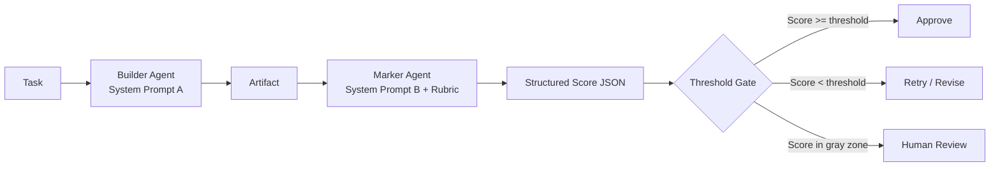

# Reviewer Agent: Separate Builder from Marker

## Learning Objectives

- Implement a two-pass builder-marker pipeline with separate system prompts and a shared JSON output contract.
- Detect self-review bias by comparing single-actor scores against isolated marker scores on the same outputs.
- Configure a score threshold gate that routes outputs to approve, retry, or human-review paths.
- Evaluate marker reliability by running disagreement detection across multiple rubrics on identical builder output.

## The Problem

You ask an LLM to write outbound copy for a prospect. It produces three email variants and reports that all three are "highly relevant, well-targeted, and likely to convert." You ask it to rate its own work on a 1–10 scale. It gives itself an 8. You send the emails. The reply rate is a fraction of what the model predicted.

This is the single-actor trap. When one LLM call both generates content and evaluates it, the evaluation is systematically biased. The bias is not random noise — it is structural. The same context window that produced the reasoning that led to the output is now being asked to assess whether that reasoning was sound. The model has access to its own generation rationale, which means it evaluates its intent rather than its artifact. It knows what it *meant* to say, so it grades the meaning, not the words on the page.

This pattern shows up everywhere in agent design. A coding agent that writes a fix and then verifies it. A research agent that gathers sources and then evaluates whether it gathered enough. A copywriter agent that drafts an email and then judges whether the email is compliant. In each case, the builder and the marker share a context, and that shared context is the source of the bias. The builder's system prompt, chain of thought, and generation rationale all leak into the evaluation. The marker ends up asking "did I do what I intended?" instead of "is this output correct?"

The fix is structural, not stylistic. You do not fix this by adding "be critical" to the system prompt. You do not fix it by asking the model to "review carefully." You fix it by physically separating the builder from the marker — two function calls, two system prompts, two context windows. The marker receives only the artifact. It never sees the builder's reasoning.

## The Concept

The builder-marker architecture is a two-pass pipeline. In the first pass, the builder agent receives a task and produces an artifact — a piece of text, a JSON object, a diff, whatever the task demands. The builder operates with its own system prompt, its own instructions, and its own goals. In the second pass, the marker agent receives the artifact plus a rubric. The rubric is a set of specific, scored criteria. The marker evaluates the artifact against the rubric and returns a structured score.

The critical constraint is context isolation. The marker must not receive the builder's system prompt, chain of thought, or any metadata about how the artifact was produced. The marker sees only the artifact and the rubric. This isolation is what eliminates the self-review bias — the marker cannot grade intent because it has no access to intent. It can only grade the observable output.



The rubric is the other half of the mechanism. A rubric is not a vague instruction like "rate the quality." A rubric is a set of dimensions, each with a specific question and a scoring scale. For outbound email, the dimensions might be: relevance to the prospect's role, compliance with your brand guidelines, tone match, and factual accuracy of claims. Each dimension gets a score. The marker returns all dimension scores plus an aggregate. This structured output is what makes the threshold gate possible — you can route based on specific dimensions, not just a holistic vibe score.

The threshold gate is the routing layer. If the aggregate score meets or exceeds a threshold, the artifact is approved. If it falls below, the artifact goes back to the builder for revision. If it lands in a gray zone — say, above the reject threshold but below the approve threshold — it routes to human review. This gate is what turns the builder-marker pair from a diagnostic into a production pipeline.

## Build It

Here is a minimal builder-marker pipeline in Python. It uses the OpenAI API, with the builder and marker as separate function calls with separate system prompts. Both share a JSON output contract.

```python
import json
import os
from openai import OpenAI

client = OpenAI(api_key=os.environ.get("OPENAI_API_KEY"))

BUILDER_PROMPT = """You are a cold email copywriter. Write a single personalized outbound email.
Return JSON with keys: subject, body, recipient_name, company_name."""

MARKER_PROMPT = """You are an outbound email quality reviewer. You receive an email and score it.
Score each dimension 0-2 where 0=unacceptable, 1=adequate, 2=excellent.

Dimensions:
- relevance: Is the email specific to the recipient's role and company?
- compliance: Does it avoid unverified claims and honor opt-out language?
- tone: Is the tone professional without being sycophantic?
- claim_accuracy: Are all factual statements verifiable or appropriately hedged?

Return JSON with keys: relevance, compliance, tone, claim_accuracy, total, notes.
The total field is the sum of all four dimension scores (max 8)."""

def builder(task):
    response = client.chat.completions.create(
        model="gpt-4o-mini",
        messages=[
            {"role": "system", "content": BUILDER_PROMPT},
            {"role": "user", "content": task},
        ],
        response_format={"type": "json_object"},
        temperature=0.7,
    )
    return json.loads(response.choices[0].message.content)

def marker(artifact):
    response = client.chat.completions.create(
        model="gpt-4o-mini",
        messages=[
            {"role": "system", "content": MARKER_PROMPT},
            {"role": "user", "content": json.dumps(artifact)},
        ],
        response_format={"type": "json_object"},
        temperature=0.2,
    )
    return json.loads(response.choices[0].message.content)

def run_pipeline(task, threshold=6):
    artifact = builder(task)
    score = marker(artifact)
    print(f"Subject: {artifact['subject']}")
    print(f"Score: {score['total']}/8")
    print(f"Notes: {score['notes']}")
    if score["total"] >= threshold:
        print("DECISION: APPROVED")
        return artifact, score, "approved"
    else:
        print("DECISION: REJECTED — below threshold")
        return artifact, score, "rejected"

task = "Write an email to Sarah Chen, VP of Engineering at Datadog, about reducing on-call alert fatigue."
artifact, score, decision = run_pipeline(task)
```

Now let's demonstrate the self-review bias directly. This script compares an isolated marker score against a self-review score on the same artifact. The self-reviewer gets the builder's system prompt and the artifact. The isolated marker gets only the artifact. Run this and observe the gap.

```python
def self_review(task, artifact):
    self_review_prompt = f"""You are a cold email copywriter. You wrote the email below.
Score your own work.

{BUILDER_PROMPT}

Score each dimension 0-2: relevance, compliance, tone, claim_accuracy.
Return JSON with keys: relevance, compliance, tone, claim_accuracy, total, notes.
The total field is the sum of all four dimension scores (max 8)."""
    
    response = client.chat.completions.create(
        model="gpt-4o-mini",
        messages=[
            {"role": "system", "content": self_review_prompt},
            {"role": "user", "content": f"Task: {task}\n\nEmail: {json.dumps(artifact)}"},
        ],
        response_format={"type": "json_object"},
        temperature=0.2,
    )
    return json.loads(response.choices[0].message.content)

task = "Write an email to Sarah Chen, VP of Engineering at Datadog, about reducing on-call alert fatigue."
artifact = builder(task)

isolated_score = marker(artifact)
self_score = self_review(task, artifact)

print("=== ISOLATED MARKER ===")
print(f"Total: {isolated_score['total']}/8")
print(f"Breakdown: relevance={isolated_score['relevance']}, compliance={isolated_score['compliance']}, tone={isolated_score['tone']}, claim_accuracy={isolated_score['claim_accuracy']}")

print("\n=== SELF REVIEW ===")
print(f"Total: {self_score['total']}/8")
print(f"Breakdown: relevance={self_score['relevance']}, compliance={self_score['compliance']}, tone={self_score['tone']}, claim_accuracy={self_score['claim_accuracy']}")

gap = self_score['total'] - isolated_score['total']
print(f"\n=== BIAS GAP ===")
print(f"Self-review scored {gap} points higher than isolated marker")
print(f"This gap is the cost of the single-actor trap")
```

The gap is the bias. Across most runs, the self-review score will be 1–3 points higher than the isolated marker. That gap is not noise — it is the structural effect of the marker having access to the builder's intent. When you see the gap, you are looking at the reason the two-pass architecture exists.

## Use It

The builder-marker split maps directly to outbound content pipelines where quality is non-negotiable. In a Clay waterfall workflow, enrichment data flows through stages — each stage transforms data from the previous stage. The builder-marker pattern is the same structural principle: generation and validation are separate stages with separate logic, not one call doing both.

Consider an outbound email pipeline targeting 200 prospects. The builder generates a personalized variant for each prospect using enriched data — role, company, recent activity, tech stack. The marker scores each variant against a four-dimension rubric before it ever touches your sending infrastructure. Only variants above threshold enter the send queue. Variants that fail go back to the builder with the marker's notes as feedback. This is a content-quality gate that operates at the same level as a verification gate in a code pipeline.

```python
def outbound_gate(prospect_data, max_retries=2, threshold=6):
    task = f"""Write an email to {prospect_data['name']}, {prospect_data['title']} at {prospect_data['company']}.
Context: {prospect_data['enrichment_summary']}
Avoid mentioning competitors by name."""
    
    for attempt in range(max_retries + 1):
        artifact = builder(task)
        score = marker(artifact)
        
        if score["total"] >= threshold:
            return {
                "prospect": prospect_data["name"],
                "email": artifact,
                "score": score,
                "status": "approved",
                "attempts": attempt + 1,
            }
        
        if attempt < max_retries:
            task = f"""Previous attempt scored {score['total']}/8. Notes: {score['notes']}.
Rewrite to address these issues. Original task: {task}"""
    
    return {
        "prospect": prospect_data["name"],
        "email": artifact,
        "score": score,
        "status": "below_threshold",
        "attempts": max_retries + 1,
    }

prospects = [
    {"name": "Sarah Chen", "title": "VP Engineering", "company": "Datadog", "enrichment_summary": "Posted about on-call burnout last week. Uses PagerDuty."},
    {"name": "Marcus Webb", "title": "Head of RevOps", "company": "Gong", "enrichment_summary": "Hiring SDRs aggressively. Just opened a new Salesforce instance."},
    {"name": "Priya Patel", "title": "CTO", "company": "Vercel", "enrichment_summary": "Recent podcast appearance discussing developer productivity metrics."},
]

results = [outbound_gate(p) for p in prospects]

for r in results:
    print(f"Prospect: {r['prospect']}")
    print(f"Status: {r['status']} (score {r['score']['total']}/8, {r['attempts']} attempt(s))")
    print(f"Subject: {r['email']['subject']}")
    print("---")
```

Every Clay credit spent on enrichment is a token cost — the same economics that govern LLM calls apply to the entire enrichment pipeline. The builder-marker gate prevents wasted downstream cost: you do not send a low-scoring email that burns your sender reputation on a secondary domain, and you do not spend API budget on a follow-up sequence for a variant that failed quality review. The gate is a cost-optimization layer as much as a quality layer.

## Ship It

Production wiring adds three things to the builder-marker pair: logging, score persistence, and a fallback path for borderline outputs. Logging means every builder-marker round is written to a JSONL file so you can audit decisions later. Score persistence means the scores are stored alongside the artifacts — you need this for A/B testing builder strategies and for tracking marker drift over time. The fallback path handles the gray zone: scores that are above the reject threshold but below the approve threshold.

```python
import time

LOG_FILE = "builder_marker_log.jsonl"
APPROVE_THRESHOLD = 6
REJECT_THRESHOLD = 4
GRAY_ZONE = (REJECT_THRESHOLD, APPROVE_THRESHOLD)

def log_round(task, artifact, score, decision, attempt):
    entry = {
        "timestamp": time.strftime("%Y-%m-%dT%H:%M:%S"),
        "task": task[:200],
        "artifact": artifact,
        "score": score,
        "decision": decision,
        "attempt": attempt,
    }
    with open(LOG_FILE, "a") as f:
        f.write(json.dumps(entry) + "\n")

def production_gate(task, max_retries=2):
    for attempt in range(max_retries + 1):
        artifact = builder(task)
        score = marker(artifact)
        total = score["total"]

        if total >= APPROVE_THRESHOLD:
            decision = "approved"
        elif total < REJECT_THRESHOLD:
            if attempt < max_retries:
                decision = "retry"
                task = f"Previous attempt scored {total}/8. Notes: {score['notes']}. Fix these issues. Task: {task}"
            else:
                decision = "rejected"
        else:
            decision = "human_review"

        log_round(task, artifact, score, decision, attempt)

        if decision != "retry":
            break

    return {
        "artifact": artifact,
        "score": score,
        "decision": decision,
        "attempts": attempt + 1,
    }

tasks = [
    "Write to Sarah Chen, VP Eng at Datadog, about on-call alert fatigue reduction.",
    "Write to Marcus Webb, Head of RevOps at Gong, about pipeline forecasting accuracy.",
    "Write to Priya Patel, CTO at Vercel, about edge function performance monitoring.",
]

results = [production_gate(task) for task in tasks]

print(f"{'Task':<50} {'Score':>6} {'Decision':<15} {'Attempts':>8}")
print("-" * 85)
for task, result in zip(tasks, results):
    short_task = task[:48] + ".."
    print(f"{short_task:<50} {result['score']['total']:>4}/8 {result['decision']:<15} {result['attempts']:>8}")

print(f"\nFull round-trip logs written to {LOG_FILE}")
```

The gray zone routing matters because the marker is not infallible. A score of 5 out of 8 is ambiguous — it might be a genuinely mediocre output, or it might be a good output that the marker scored conservatively. Routing these to human review is cheaper than sending bad emails and safer than auto-approving. In a production outbound system running on secondary domains, the human review queue becomes your calibration mechanism: a human spot-checks gray-zone outputs, and their decisions inform whether you need to adjust the threshold or retrain the rubric.

## Exercises

**Easy:** Run the builder-marker pipeline on five different prospect tasks. Print the score breakdown for each. Identify which dimension most frequently causes failures.

**Medium:** Add a revision loop to the pipeline. When the marker rejects an artifact, feed the marker's notes back to the builder and retry up to three times. Log the score improvement (or lack thereof) across retries.

**Hard:** Implement the marker as an ensemble of two different rubrics — one focused on engagement potential, one focused on compliance. Run both markers on the same artifact. If they disagree by more than 2 points on the total, flag the artifact for human review. This disagreement detection is a reliability signal: when two independent rubrics disagree, the artifact is inherently ambiguous.

## Key Terms

**Builder agent** — The LLM call that produces the artifact. Operates with its own system prompt, generation parameters, and context.

**Marker agent** — The LLM call that evaluates the artifact against a rubric. Receives only the artifact and the rubric — never the builder's system prompt or reasoning.

**Context isolation** — The constraint that the marker has no access to the builder's generation context. This is the mechanism that eliminates self-review bias.

**Rubric** — A structured set of scored dimensions used by the marker. Each dimension has a specific question and a numeric scale. The rubric converts quality into structured data that a threshold gate can act on.

**Threshold gate** — The routing layer that maps marker scores to decisions: approve, retry, reject, or human review. Turns the builder-marker pair from a diagnostic into a production pipeline.

**Self-review bias** — The systematic inflation of quality scores when the same context that generated an artifact also evaluates it. Measurable as the gap between isolated-marker scores and self-review scores on the same artifact.

## Sources

- Zone 14, GTM Stack Cost Management: "Every Clay credit is a token cost — optimize like you would LLM calls" — Zone table row 14, living GTM stack documentation
- Clay waterfall workflows implement generation and validation as separate stages — [CITATION NEEDED — concept: Clay waterfall architecture separating enrichment from validation stages]
- Secondary domains purchased specifically for outbound, kept separate from primary domain — GTM handbook context, outbound infrastructure section
- [CITATION NEEDED — concept: multi-agent review patterns in GTM pipeline architecture]