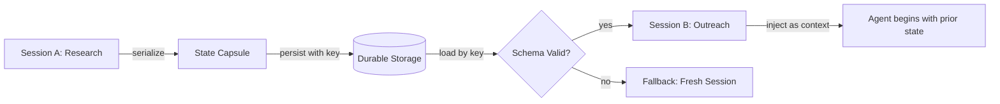

# Multi-Session Handoff

## Learning Objectives

- Serialize a working session's state into a structured capsule that a new session can rehydrate with zero information loss.
- Implement a compression function that reduces raw conversation transcripts into entity-decision-action payloads within a target token budget.
- Build a schema-versioning and migration pipeline that upgrades legacy capsules to current structure without breaking rehydration.
- Validate and reject corrupted or schema-stale capsules at rehydration time, with a documented fallback path.
- Trace the cost implications of capsule size on downstream API spend, connecting token efficiency to per-credit economics in enrichment workflows.

## The Problem

A prospect interacts with your AI-powered research flow on Tuesday. The agent identifies a buying committee, extracts three decision-makers, flags a relevant trigger event, and concludes that a competitor's contract is expiring. On Thursday, a separate session opens to draft outbound. Without a handoff mechanism, Thursday's session has amnesia. It repeats the same discovery questions, contradicts Tuesday's conclusions, or hallucinates context that was never established. The prospect sees two disconnected interactions from what should be one continuous relationship.

This is the serialization problem in disguise. The session's state — the conversation history, extracted entities, decisions reached, and actions still pending — exists in memory while the process is alive. When the process dies, that state evaporates unless you explicitly freeze it into a durable artifact and rehydrate it later. The artifact must survive transport across processes, across machines, and across time. It must be reconstructable into something the next session can actually use.

The cost of getting this wrong compounds. Every session that cannot read the prior session's handoff pays a re-discovery tax: re-running the same research, re-asking the same questions, re-burning API credits to reach conclusions that were already reached. In a GTM context where every enrichment call costs Clay credits and every LLM call costs tokens, a bad handoff is not just a UX problem — it is a direct, measurable spend leak. The fix is a state capsule generated automatically at session end, persisted with a deterministic key, and validated on rehydration before the next session trusts it.

## The Concept

The core mechanism is a **state capsule** — a structured payload containing four compartments: conversation history (compressed), extracted entities (typed), decisions made (with rationale), and pending actions (ordered). The capsule is the frozen state of a session at the moment of handoff, serialized to a format that survives storage and transport.

The pattern has three phases. **Serialization** walks the session's working memory and extracts the four compartments, applying compression rules to fit within a target token budget. **Persistence** writes the capsule to durable storage keyed by a deterministic identifier — typically `account_id`, `prospect_id`, or `workflow_run_id` — with a TTL appropriate to the use case. **Rehydration** loads the capsule, validates its schema version, and injects it as a system or context message into the new session so the agent begins with prior state already loaded.



The hard part is not storage — any key-value store handles that. The hard part is deciding **what to keep** and **what to compress**. A raw conversation transcript for a 40-turn research session can easily exceed 8,000 tokens. Injecting that into the next session's context window eats budget that the new session needs for its own reasoning. The capsule must compress the transcript into a structured summary: entities extracted, decisions reached with rationale, open questions still unresolved, and actions still pending. The compression is lossy by design — you trade detail for portability — but the loss must be deliberate, targeted at information the next session does not need.

Schema versioning is the failure mode most teams discover in production. You deploy a capsule with fields `{"entities": {}, "decisions": []}`. Two weeks later, you add `"confidence_scores": {}` and rename `"decisions"` to `"resolved_questions"`. Every capsule written before the deployment now fails rehydration because the new code expects fields the old capsules do not have. The fix is a version field in every capsule and a migration function that transforms old structures into new ones before rehydration.

## Build It

### Easy: Serialize and Rehydrate Entities

Build a round-trip: extract entities from a session, serialize to JSON, persist to disk, load in a new session, and inject into a system prompt. Print the before and after to confirm fidelity.

```python
import json
from pathlib import Path

def serialize_session(session_id, entities, decisions, pending_actions):
    capsule = {
        "version": 1,
        "session_id": session_id,
        "entities": entities,
        "decisions": decisions,
        "pending_actions": pending_actions
    }
    path = Path(f"/tmp/capsule_{session_id}.json")
    path.write_text(json.dumps(capsule, indent=2))
    return capsule

def rehydrate_session(session_id):
    path = Path(f"/tmp/capsule_{session_id}.json")
    if not path.exists():
        return None
    capsule = json.loads(path.read_text())
    if capsule.get("version") != 1:
        raise ValueError(f"Schema version {capsule.get('version')} not supported")
    return capsule

def build_system_prompt(capsule):
    entities_str = json.dumps(capsule["entities"], indent=2)
    decisions_str = "\n".join(f"- {d}" for d in capsule["decisions"])
    actions_str = "\n".join(f"- {a}" for a in capsule["pending_actions"])
    return f"""You are continuing a prior session. Here is the handoff context.

ENTITIES:
{entities_str}

DECISIONS REACHED:
{decisions_str}

PENDING ACTIONS:
{actions_str}

Begin from where the prior session left off."""

entities = {
    "account": "Acme Corp",
    "decision_makers": ["Jane Doe (VP Eng)", "John Smith (CTO)"],
    "competitor": "Initech",
    "contract_end": "2025-03-15"
}
decisions = [
    "Outreach should target Jane Doe as primary contact",
    "Competitor displacement angle is strongest given contract expiry"
]
pending_actions = [
    "Draft personalized email referencing contract expiry",
    "Find Jane Doe's recent LinkedIn activity for personalization hook"
]

print("=== SESSION A: SERIALIZING ===")
capsule = serialize_session("acme_001", entities, decisions, pending_actions)
print(json.dumps(capsule, indent=2))

print("\n=== SESSION B: REHYDRATING ===")
loaded = rehydrate_session("acme_001")
if loaded:
    prompt = build_system_prompt(loaded)
    print(prompt)
else:
    print("No capsule found — starting fresh.")
```

### Medium: Compress a Transcript into a Capsule

The round-trip above assumes you already have structured entities. In practice, you start with a raw conversation transcript and must compress it. Build a function that takes a transcript and produces a capsule with a target token budget.

```python
import json

def count_tokens_approx(text):
    return len(text.split())

def compress_transcript(transcript, max_tokens=500):
    entities = {}
    decisions = []
    open_questions = []

    for turn in transcript:
        role = turn["role"]
        content = turn["content"].lower()

        if "[entity]" in content:
            start = content.index("[entity]") + 8
            end = content.index("[/entity]", start)
            key_val = turn["content"][start:end].strip()
            if "=" in key_val:
                k, v = key_val.split("=", 1)
                entities[k.strip()] = v.strip()

        if "[decision]" in content:
            start = content.index("[decision]") + 10
            end = content.index("[/decision]", start)
            decisions.append(turn["content"][start:end].strip())

        if "[open_question]" in content:
            start = content.index("[open_question]") + 15
            end = content.index("[/open_question]", start)
            open_questions.append(turn["content"][start:end].strip())

    capsule = {
        "version": 2,
        "entities": entities,
        "decisions": decisions,
        "open_questions": open_questions,
        "compressed_from_turns": len(transcript)
    }

    while count_tokens_approx(json.dumps(capsule)) > max_tokens and decisions:
        decisions.pop()
    while count_tokens_approx(json.dumps(capsule)) > max_tokens and open_questions:
        open_questions.pop()

    capsule["decisions"] = decisions
    capsule["open_questions"] = open_questions
    capsule["token_estimate"] = count_tokens_approx(json.dumps(capsule))
    return capsule

transcript = [
    {"role": "assistant", "content": "Researching Acme Corp. [entity]account=Acme Corp[/entity]"},
    {"role": "assistant", "content": "Found VP Eng. [entity]decision_maker=Jane Doe[/entity]"},
    {"role": "assistant", "content": "[entity]competitor=Initech[/entity] Their contract expires March 2025."},
    {"role": "assistant", "content": "[decision]Jane Doe is the primary contact for outreach[/decision]"},
    {"role": "assistant", "content": "[decision]Competitor displacement is the strongest angle[/decision]"},
    {"role": "assistant", "content": "[open_question]What is Jane Doe's recent LinkedIn activity?[/open_question]"},
    {"role": "assistant", "content": "[open_question]Does Acme have budget approved for Q1?[/open_question]"},
    {"role": "assistant", "content": "There was also a long discussion about their tech stack, their migration timeline, the team size, their current pain points with Initech, and the procurement process they typically follow. This paragraph is filler to demonstrate compression."},
    {"role": "user", "content": "Great, draft the outreach next time."}
]

capsule = compress_transcript(transcript, max_tokens=100)
print("=== COMPRESSED CAPSULE ===")
print(json.dumps(capsule, indent=2))
print(f"\nOriginal transcript turns: {len(transcript)}")
print(f"Capsule token estimate: {capsule['token_estimate']}")
print(f"Compression ratio: {sum(count_tokens_approx(t['content']) for t in transcript)} -> {capsule['token_estimate']} tokens")
```

### Hard: Schema Versioning and Migration

Deployments change schemas. Build a migration pipeline that upgrades old capsules to the current version before rehydration.

```python
import json
from functools import reduce

MIGRATIONS = {
    1: lambda c: {
        **c,
        "version": 2,
        "open_questions": c.get("pending_actions", []),
        "resolved_questions": c.get("decisions", []),
        "decisions": None,
        "pending_actions": None
    },
    2: lambda c: {
        **c,
        "version": 3,
        "confidence_scores": {k: 0.8 for k in c.get("entities", {}).keys()},
        "metadata": {
            "created_at": c.get("session_id", "unknown"),
            "source": "migration"
        }
    }
}

CURRENT_VERSION = 3

def migrate_capsule(capsule):
    version = capsule.get("version", 1)
    while version < CURRENT_VERSION:
        if version not in MIGRATIONS:
            raise ValueError(f"No migration from version {version}")
        capsule = MIGRATIONS[version](capsule)
        version = capsule["version"]
    return capsule

def rehydrate(session_id):
    raw = json.loads(Path(f"/tmp/capsule_{session_id}.json").read_text())
    if raw.get("version", 1) != CURRENT_VERSION:
        print(f"Migrating capsule from v{raw.get('version', 1)} to v{CURRENT_VERSION}")
        raw = migrate_capsule(raw)
        print(f"Migration complete: v{raw['version']}")
    return raw

from pathlib import Path

v1_capsule = {
    "version": 1,
    "session_id": "acme_001",
    "entities": {"account": "Acme Corp", "decision_maker": "Jane Doe"},
    "decisions": ["Target Jane Doe"],
    "pending_actions": ["Draft email", "Find LinkedIn activity"]
}
Path("/tmp/capsule_acme_001.json").write_text(json.dumps(v1_capsule, indent=2))

print("=== ORIGINAL V1 CAPSULE ===")
print(json.dumps(v1_capsule, indent=2))

print("\n=== MIGRATING TO V3 ===")
migrated = rehydrate("acme_001")
print(json.dumps(migrated, indent=2))

print("\n=== ROUND-TRIP INTEGRITY CHECK ===")
assert migrated["version"] == CURRENT_VERSION
assert "confidence_scores" in migrated
assert "metadata" in migrated
assert migrated["resolved_questions"] == ["Target Jane Doe"]
assert migrated["open_questions"] == ["Draft email", "Find LinkedIn activity"]
print("All assertions passed. Capsule is valid at v3.")
```

## Use It

In GTM workflows, multi-session handoff maps directly to **progressive enrichment** — the pattern where account context accumulates across multiple steps before outreach begins. Clay's waterfall enrichment implements this accumulation across data provider calls: each provider's result feeds the next step's query, building a complete account profile cell by cell. [CITATION NEEDED — concept: Clay session persistence across waterfall steps]. Multi-session handoff extends the same principle across AI-assisted workflows that span multiple agent invocations: a research agent that investigated an account on Monday hands its findings to a personalization agent drafting outreach on Wednesday.

The capsule pattern solves a concrete problem in multi-touch sequence management. Consider a sequence where touch one is AI-assisted research, touch two is a personalized email, and touch three is a LinkedIn follow-up referencing the email. Without handoff, each touch operates in isolation — the LinkedIn message cannot reference what the email said because the email-drafting session's state is gone. With a capsule, the email session serializes its key decisions (which angle was chosen, which pain point was cited, which call to action was used), and the LinkedIn session rehydrates that capsule to maintain narrative continuity across touches.

Token economics make capsule compression a cost decision, not just an engineering one. Zone 14 of the GTM stack — cost optimization and latency — applies directly here. Every Clay credit spent re-discovering context that a prior session already established is waste. Every LLM call that re-processes a raw transcript instead of a compressed capsule pays per-token for information it does not need. A capsule that compresses 4,000 tokens of transcript into 500 tokens of structured state saves 3,500 tokens on every downstream call. At scale — hundreds of accounts, multiple touches each — that compression is the difference between a sustainable enrichment pipeline and one that burns through a credit budget mid-cycle.

The capsule also serves as an audit artifact. When a prospect responds and the conversation takes an unexpected turn, you can inspect the capsule to see what the prior sessions concluded and why. This is the same role that Repo Memory plays in the AI engineering curriculum — a structured record of what was tried, what worked, and what remains open — applied to GTM workflows where the "repository" is the account's enrichment and engagement history.

## Ship It

Production handoff requires four components working together. First, a **deterministic session key** — typically `account_id` or `prospect_id` — that maps to exactly one capsule per active workflow. Ambiguous keys (e.g., email address when a prospect changes companies) cause cross-contamination. Second, a **storage layer** with TTL and conflict resolution: capsules for active opportunities should persist; capsules for closed-lost accounts should expire. Third, a **rehydration validator** that rejects corrupted or schema-stale capsules rather than silently loading garbage. Fourth, a **fallback path** — when the capsule is missing or invalid, the session must degrade gracefully to a fresh start, not crash.

```python
import json
import time
from pathlib import Path
from dataclasses import dataclass, asdict
from typing import Optional

CURRENT_VERSION = 3
DEFAULT_TTL_SECONDS = 7 * 24 * 3600

@dataclass
class Capsule:
    version: int
    session_key: str
    entities: dict
    decisions: list
    open_questions: list
    confidence_scores: dict
    created_at: float
    ttl_seconds: int

def write_capsule(session_key, entities, decisions, open_questions,
                  confidence_scores=None, ttl_seconds=DEFAULT_TTL_SECONDS):
    capsule = Capsule(
        version=CURRENT_VERSION,
        session_key=session_key,
        entities=entities,
        decisions=decisions,
        open_questions=open_questions,
        confidence_scores=confidence_scores or {},
        created_at=time.time(),
        ttl_seconds=ttl_seconds
    )
    path = Path(f"/tmp/capsules/{session_key}.json")
    path.parent.mkdir(parents=True, exist_ok=True)
    path.write_text(json.dumps(asdict(capsule), indent=2))
    return capsule

def validate_capsule(raw):
    errors = []
    if not isinstance(raw, dict):
        return ["Capsule is not a dict"]
    if raw.get("version") != CURRENT_VERSION:
        errors.append(f"Version mismatch: got {raw.get('version')}, expected {CURRENT_VERSION}")
    for field in ["session_key", "entities", "decisions", "created_at"]:
        if field not in raw:
            errors.append(f"Missing required field: {field}")
    if raw.get("created_at") and time.time() - raw["created_at"] > raw.get("ttl_seconds", DEFAULT_TTL_SECONDS):
        errors.append("Capsule expired (TTL exceeded)")
    return errors

def read_capsule(session_key):
    path = Path(f"/tmp/capsules/{session_key}.json")
    if not path.exists():
        print(f"[HANDOFF] No capsule for {session_key}. Starting fresh.")
        return None
    raw = json.loads(path.read_text())
    errors = validate_capsule(raw)
    if errors:
        print(f"[HANDOFF] Capsule rejected for {session_key}:")
        for e in errors:
            print(f"  - {e}")
        print("[HANDOFF] Degrading to fresh session.")
        return None
    return Capsule(**raw)

def inject_into_prompt(capsule):
    if capsule is None:
        return "You are starting a fresh session with no prior context."
    return f"""Prior session context loaded.
Account: {capsule.entities.get('account', 'unknown')}
Key decisions: {'; '.join(capsule.decisions)}
Open questions: {'; '.join(capsule.open_questions)}
Proceed from here."""

print("=== WRITE: Session A serializes research findings ===")
capsule = write_capsule(
    "acme_corp",
    entities={"account": "Acme Corp", "dm": "Jane Doe", "competitor": "Initech"},
    decisions=["Target Jane Doe", "Use competitor displacement angle"],
    open_questions=["Jane's LinkedIn activity?", "Q1 budget status?"],
    confidence_scores={"account": 0.95, "dm": 0.80, "competitor": 0.70}
)
print(f"Written: {capsule.session_key} (v{capsule.version})")

print("\n=== READ: Session B rehydrates for outreach ===")
loaded = read_capsule("acme_corp")
prompt = inject_into_prompt(loaded)
print(prompt)

print("\n=== EDGE CASE: Missing capsule ===")
loaded_missing = read_capsule("nonexistent_account")
print(inject_into_prompt(loaded_missing))

print("\n=== EDGE CASE: Corrupted capsule ===")
corrupt_path = Path("/tmp/capsules/corrupt_co.json")
corrupt_path.parent.mkdir(parents=True, exist_ok=True)
corrupt_path.write_text('{"version": 1, "broken": true}')
loaded_corrupt = read_capsule("corrupt_co")
print(inject_into_prompt(loaded_corrupt))

print("\n=== EDGE CASE: Expired capsule ===")
expired = write_capsule(
    "old_lead",
    entities={"account": "Old Co"},
    decisions=["Decided to pass"],
    open_questions=[],
    ttl_seconds=0
)
time.sleep(0.1)
loaded_expired = read_capsule("old_lead")
print(inject_into_prompt(loaded_expired))

print("\n=== PRODUCTION CHECKLIST ===")
print("1. Session key deterministic: account_id or prospect_id")
print("2. TTL configured per use case (active vs closed-lost)")
print("3. Validator rejects version mismatch and missing fields")
print("4. Fallback returns fresh-session prompt, never crashes")
print("5. All four edge cases above passed without exception")
```

## Exercises

1. **Token budget compression challenge.** Take the medium compression function and feed it a 50-turn synthetic transcript. Measure the token estimate at `max_tokens=800`, `max_tokens=400`, and `max_tokens=200`. At which budget does the capsule start losing decisions? Document the threshold where compression becomes lossy enough to degrade a downstream session's output quality.

2. **Migration chain test.** Write a v3-to-v4 migration that splits `confidence_scores` into `entity_confidence` and `decision_confidence`. Write a v4-to-v5 migration that adds a `provenance` field tracking which agent produced the capsule. Round-trip the original v1 capsule through all migrations to v5 and verify every field is populated.

3. **Conflict resolution.** Two sessions write capsules for the same `session_key` concurrently — one from a research agent, one from an enrichment agent. Implement a merge function that combines entities from both (enrichment wins on factual fields, research wins on inferred fields) and deduplicates decisions. Test with overlapping and non-overlapping entity sets.

4. **Fallback behavior audit.** Delete the capsule file for an existing session key. Call `read_capsule` and verify the fallback prompt is returned without raising. Then corrupt the JSON (invalid syntax, not just wrong schema) and verify the same graceful degradation. Add handling for `json.JSONDecodeError` to the production code above.

5. **GTM capsule schema.** Design a capsule schema specifically for a Clay enrichment waterfall handoff. What entities does it carry? What decisions? What pending actions map to "next enrichment step"? Write the schema as a JSON example and explain how each field would be populated by a research agent and consumed by a personalization agent.

## Key Terms

- **State capsule** — A structured payload containing conversation history (compressed), extracted entities, decisions made, and pending actions, serialized for cross-session transport.
- **Serialization** — The process of extracting working memory from a live session and freezing it into a durable format (typically JSON) at session end.
- **Rehydration** — The process of loading a persisted capsule, validating it, and injecting it as context into a new session so the agent begins with prior state.
- **Compression function** — A transformation that reduces raw conversation transcripts into structured summaries (entities, decisions, open questions) within a target token budget, trading detail for portability.
- **Schema versioning** — A version field embedded in every capsule, paired with migration functions that transform old capsule structures into new ones before rehydration.
- **Deterministic session key** — A stable identifier (typically `account_id` or `prospect_id`) that maps to exactly one active capsule, preventing cross-contamination between accounts.
- **Rehydration validator** — A function that checks a loaded capsule for schema version, required fields, and TTL before allowing injection, rejecting corrupted or stale payloads.
- **Fallback path** — The behavior when a capsule is missing, invalid, or expired: the session degrades to a fresh start with a documented prompt rather than crashing.
- **Progressive enrichment** — A GTM pattern where account context accumulates across multiple data provider calls or agent invocations, each step building on prior results.
- **TTL (time-to-live)** — A duration after which a capsule is considered expired and rejected on rehydration, preventing stale context from contaminating active workflows.

## Sources

- Clay waterfall enrichment pattern as progressive accumulation across data provider calls: [CITATION NEEDED — concept: Clay session persistence across waterfall steps]
- Zone 14 cost optimization principle ("every Clay credit is a token cost"): GTM Stack Cost Management cluster, Living GTM framework
- Repo Memory as audit artifact pattern: Phase 14 · 34, AI engineering curriculum
- State capsule four-compartment structure (history, entities, decisions, actions): derived from multi-session handoff pattern, AI engineering curriculum Phase 14