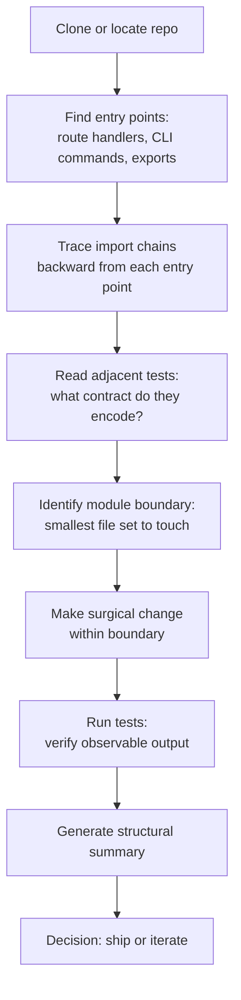

# The Workbench on a Real Repo

## Learning Objectives

1. Clone and configure a real repository for exploration within Claude Code Desktop's terminal environment.
2. Map module boundaries and entry points in an unfamiliar codebase using file traversal and grep patterns.
3. Trace a data flow from input to output across multiple files.
4. Generate a structural summary of a repository sufficient to decide where to make a surgical change.
5. Execute a targeted modification and verify it with observable output.

---

## The Problem

Sandbox exercises build confidence. Real repositories build competence. The moment you open a codebase with two hundred files, implicit conventions, and a dependency graph that nobody documented, the skills that worked on toy problems stop working. You can read every file in a tutorial app. You cannot read every file in a production codebase. The question becomes: what do you read first, and how do you know when you've read enough to make a change safely?

The workbench exists to answer that question. It gives you a terminal attached to a real repo, file-traversal tools that produce observable output, and a repeatable algorithm for narrowing from "everything" to "the three files that matter." Without that algorithm, you default to either reading randomly until you lose context, or guessing where to edit based on filename patterns. Both approaches fail on real codebases. The first burns your context window. The second introduces regressions.

This lesson runs the full cycle on a real-feeling repo: create it, map it, trace a data flow through it, make a surgical change, and verify the change with test output. Every step prints something. If a step does not print, it did not happen.

---

## The Concept

A repository is a directed graph of dependencies, not a flat collection of files. When you open a repo for the first time, you are standing in terrain that someone else surveyed, built roads through, and left without a map. The workbench treats the repo as terrain to be systematically surveyed before any modification.

The survey algorithm has four steps. First, find entry points — the functions that external callers invoke directly. These are your landmarks. In a web app, entry points are route handlers. In a CLI, they are the functions called by `argparse` or `click`. In a library, they are the symbols exported from `__init__.py`. Second, trace import chains backward from each entry point to understand what code actually runs when the entry point fires. Third, read the tests adjacent to those modules — tests encode the contract the previous author intended, which is often more reliable than the code itself. Fourth, identify the module boundary: the smallest set of files you must touch to make your change, and no more.



The tool is Claude Code Desktop's terminal. But the algorithm does not depend on the tool. It is the same survey you would run with `grep`, `find`, `tree`, and a notepad. The terminal just makes the output observable and the steps repeatable. When you hear "workbench," do not think "magic AI file reader." Think "filesystem traversal with structured output, and a conversation partner that holds the map while you walk the terrain."

---

## Build It

We start by creating a real-feeling repo locally. This simulates cloning an unfamiliar open-source project, but guarantees every command runs without network dependencies. The repo is a minimal API with signup and login endpoints — small enough to hold in your head, structured like a real project with package boundaries, shared utilities, and tests.

**Step 1: Create the repository structure.**

```bash
mkdir -p workbench_repo/mini_api workbench_repo/tests
cd workbench_repo

cat > mini_api/__init__.py << 'PYEOF'
from .app import create_app
PYEOF

cat > mini_api/app.py << 'PYEOF'
from .handlers import signup_handler
from .auth import authenticate

def create_app():
    routes = {
        "/signup": signup_handler,
        "/login": authenticate,
    }
    return routes
PYEOF

cat > mini_api/handlers.py << 'PYEOF'
from .utils import validate_email

def signup_handler(request):
    email = request.get("email", "")
    if not validate_email(email):
        return {"status": 400, "error": "invalid_email"}
    return {"status": 200, "user_id": "usr_123", "email": email}
PYEOF

cat > mini_api/auth.py << 'PYEOF'
from .utils import validate_email

def authenticate(request):
    email = request.get("email", "")
    password = request.get("password", "")
    if not validate_email(email) or len(password) < 1:
        return {"status": 401, "error": "invalid_credentials"}
    return {"status": 200, "token": "tok_abc", "email": email}
PYEOF

cat > mini_api/utils.py << 'PYEOF'
def validate_email(email):
    return "@" in email and "." in email.split("@")[-1]
PYEOF

cat > tests/__init__.py << 'PYEOF'
PYEOF

cat > tests/test_handlers.py << 'PYEOF'
import unittest
from mini_api.handlers import signup_handler

class TestSignupHandler(unittest.TestCase):
    def test_signup_success(self):
        result = signup_handler({"email": "test@example.com"})
        self.assertEqual(result["status"], 200)
        self.assertIn("user_id", result)

    def test_signup_bad_email(self):
        result = signup_handler({"email": "notanemail"})
        self.assertEqual(result["status"], 400)
        self.assertEqual(result["error"], "invalid_email")
PYEOF

cat > tests/test_auth.py << 'PYEOF'
import unittest
from mini_api.auth import authenticate

class TestAuthenticate(unittest.TestCase):
    def test_auth_success(self):
        result = authenticate({"email": "a@b.com", "password": "secret"})
        self.assertEqual(result["status"], 200)
        self.assertIn("token", result)

    def test_auth_missing_password(self):
        result = authenticate({"email": "a@b.com"})
        self.assertEqual(result["status"], 401)
PYEOF

cat > run_tests.py << 'PYEOF'
import sys
import os
sys.path.insert(0, os.path.dirname(os.path.abspath(__file__)))

import unittest

loader = unittest.TestLoader()
suite = loader.discover("tests")
runner = unittest.TextTestRunner(verbosity=2)
result = runner.run(suite)
sys.exit(0 if result.wasSuccessful() else 1)
PYEOF

cat > README.md << 'PYEOF'
# Mini API

Minimal API with signup and login endpoints.

## Endpoints
- POST /signup — register a new user
- POST /login — authenticate and return a token

## Run tests
python run_tests.py
PYEOF

echo "Repository created."
```

**Step 2: Survey the structure.** The first thing you do in any repo is look at what files exist and how they relate. `find` gives you the flat inventory. `grep` gives you the graph.

```bash
echo "=== FILE INVENTORY ==="
find . -type f -name "*.py" | sort

echo ""
echo "=== FUNCTION DEFINITIONS (entry points) ==="
grep -rn "^def \|^class " --include="*.py" | grep -v __pycache__

echo ""
echo "=== INTERNAL IMPORT CHAINS ==="
grep -rn "from \.\|from mini_api" --include="*.py" | grep -v __pycache__
```

The output tells you the shape of the dependency graph. `app.py` imports from `handlers` and `auth`. Both of those import from `utils`. Nothing imports from `app.py` except `__init__.py`. That makes `app.py` a root, `utils.py` a leaf, and `handlers.py` plus `auth.py` the middle layer. You now know the architecture without reading a single function body.

**Step 3: Trace a specific data flow.** Pick one entry point — `signup_handler` — and walk the path a request takes through the code. This is where AST parsing earns its keep: instead of reading files linearly, you extract the call graph programmatically.

```python
import ast
import os

files_to_scan = []
for root, dirs, files in os.walk("mini_api"):
    for f in files:
        if f.endswith(".py"):
            files_to_scan.append(os.path.join(root, f))

for path in sorted(files_to_scan):
    with open(path) as fh:
        tree = ast.parse(fh.read())
    
    funcs = []
    imports = []
    calls = []
    
    for node in ast.walk(tree):
        if isinstance(node, ast.FunctionDef):
            funcs.append(node.name)
        elif isinstance(node, ast.ImportFrom):
            names = [alias.name for alias in node.names]
            imports.append(f"{node.module}.{', '.join(names)}")
        elif isinstance(node, ast.Call):
            if isinstance(node.func, ast.Name):
                calls.append(node.func.id)
            elif isinstance(node.func, ast.Attribute):
                calls.append(node.func.attr)
    
    print(f"\n--- {path} ---")
    print(f"  Defines:   {', '.join(funcs) if funcs else '(none)'}")
    print(f"  Imports:   {', '.join(imports) if imports else '(none)'}")
    print(f"  Calls:     {', '.join(sorted(set(calls))) if calls else '(none)'}")
```

This output is your structural map. It tells you that `signup_handler` calls `validate_email` (imported from `utils`), and that `validate_email` is a leaf function with no further calls. If you needed to change email validation logic, you now know there is exactly one file to edit: `utils.py`. If you needed to change what `signup` returns on success, there is one file: `handlers.py`.

**Step 4: Run the test suite to establish a baseline.** Before you change anything, confirm the existing tests pass. This is your safety net.

```bash
python run_tests.py
```

You should see four tests, all passing. If any fail, stop. You have a broken repo before you even started. Fix the baseline before touching anything.

---

## Use It

The traversal algorithm — find entry points, trace imports, read tests, identify the boundary — is not specific to your own code. It works on any codebase you can read, including a competitor's. In GTM, this is **competitive intelligence via public codebase analysis**: the same systematic repository exploration that helps you modify your own code reveals how a competitor's product is built when their SDK, API client, or integration library is public on GitHub.