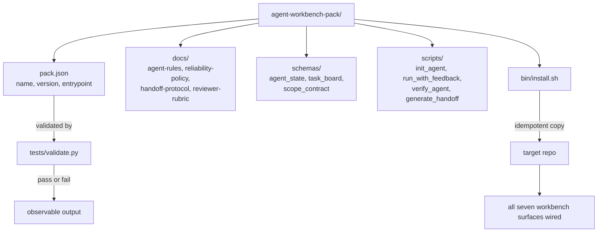

# Capstone: Ship a Reusable Agent Workbench Pack

## Learning Objectives

- Package the seven workbench surfaces into one drop-in directory with a versioned manifest.
- Pin schemas, scripts, and prompt templates so a new repo gets a known-good baseline on first install.
- Write an idempotent installer that lays down the pack into any target repository without clobbering existing files.
- Validate pack integrity programmatically, catching missing files and malformed schemas before deployment.
- Defend the boundary between what ships inside the pack and what stays in the target repo.

## The Problem

You have built agents across this entire module. Each lesson produced a script, a schema, a prompt template, or a policy document. Right now those artifacts live in different directories, some in your lesson outputs, some in a Google Doc you shared with a teammate, some in a chat thread you'll never find again. That distribution is fine for learning. It is not fine for next quarter, when someone else on your team needs to stand up the same agent in a different repo and has to reverse-engineer what you did from scattered artifacts.

The cost of not packaging is measurable. Every rebuild means re-deriving the schema constraints, re-writing the reliability policy from memory, re-discovering which prompt template produced good output. In a GTM context, this maps directly to the Zone 14 cost-optimization principle: every Clay credit spent re-running a broken enrichment is a token cost, and every hour spent reconstructing an agent configuration is an engineering cost that compounds across team members. The handbook frames this as "every Clay credit is a token cost — optimize like you would LLM calls." The same logic applies to agent configuration: the cheapest agent run is the one you don't have to redo because the pack was broken.

The cure is a versioned pack. A single directory with the surfaces, the schemas, the scripts, a manifest that declares what is inside, and a one-command installer that drops it into any repo. You will end this lesson with `outputs/agent-workbench-pack/` on disk, a validation script that confirms its integrity, and an `install.sh` that makes it portable.

## The Concept

A workbench pack is a directory structure containing agent configuration, tool schemas, prompt templates, and a manifest that declares dependencies and version constraints. The mechanism is declarative packaging. The manifest tells the runtime what to load. The schemas tell the runtime what shapes are valid. The scripts tell the runtime what actions are available. No imperative setup logic runs at install time beyond copying files and marking scripts executable. This is the same pattern as a Python package with a `pyproject.toml` or a Node package with `package.json` — the manifest is the contract, and everything else follows from it.

The portability constraint is strict: a valid pack produces identical behavior on any machine that satisfies the declared dependencies. If it does not, the pack is broken by definition. This means no absolute paths, no machine-specific configuration baked into templates, no assumptions about what environment variables exist unless they are declared in the manifest's `env_required` list. When the pack declares `env_required: ["OPENAI_API_KEY"]`, the validation script checks for that variable and fails loudly if it is missing. Silent degradation is the enemy of reproducibility.



The boundary between what ships in the pack and what stays out is the most important design decision. Schemas ship — they are the contract. The four core scripts ship — they implement the agent lifecycle. The policy documents ship — they encode behavioral constraints. What stays out: agent state files (runtime data, not configuration), API keys (declared as dependencies, never stored), and target-repo-specific code (the pack is generic, the repo is specific). If you find yourself wanting to ship a `.env` file or a hardcoded company name inside a template, the pack design is wrong — that information belongs in the target repo's environment, not in the portable pack.

## Build It

The build script below creates the complete pack on disk. It writes every file the manifest declares, then prints the tree so you can verify the structure matches the diagram above. Each file contains real, functional content — the schemas are valid JSON Schema documents, the scripts are executable Python, and the policy documents contain actual constraints, not placeholder text.

```python
import json
from pathlib import Path

ROOT = Path("outputs/agent-workbench-pack")

for d in ["docs", "schemas", "scripts", "bin", "tests"]:
    (ROOT / d).mkdir(parents=True, exist_ok=True)

PACK_JSON = {
    "name": "agent-workbench-pack",
    "version": "1.0.0",
    "entrypoint": "scripts/init_agent.py",
    "schemas": [
        "schemas/agent_state.schema.json",
        "schemas/task_board.schema.json",
        "schemas/scope_contract.schema.json",
    ],
    "scripts": [
        "scripts/init_agent.py",
        "scripts/run_with_feedback.py",
        "scripts/verify_agent.py",
        "scripts/generate_handoff.py",
    ],
    "docs": [
        "AGENTS.md",
        "docs/agent-rules.md",
        "docs/reliability-policy.md",
        "docs/handoff-protocol.md",
        "docs/reviewer-rubric.md",
    ],
    "env_required": [],
}
(ROOT / "pack.json").write_text(json.dumps(PACK_JSON, indent=2))

FILES = {
    "AGENTS.md": "# Agent Workbench\n\nThis pack provides the seven workbench surfaces for agent-assisted development.\nDrop it into any repo to get a known-good baseline.\n\n## Quick Start\n\n```bash\nbash bin/install.sh /path/to/target-repo\n```\n\n## Surfaces\n\n1. Agent rules (docs/agent-rules.md)\n2. Reliability policy (docs/reliability-policy.md)\n3. Handoff protocol (docs/handoff-protocol.md)\n4. Reviewer rubric (docs/reviewer-rubric.md)\n5. Agent state schema (schemas/agent_state.schema.json)\n6. Task board schema (schemas/task_board.schema.json)\n7. Scope contract schema (schemas/scope_contract.schema.json)\n",
    "docs/agent-rules.md": "# Agent Rules\n\n1. Read the scope contract before starting any task.\n2. Write state to agent_state.json after every step.\n3. If a task is blocked, set status to 'blocked' and record the reason in errors.\n4. Never modify files outside the declared scope.\n5. Generate a handoff document when the session ends.\n",
    "docs/reliability-policy.md": "# Reliability Policy\n\n- Maximum 3 retry attempts per tool call.\n- If a tool fails 3 times, mark the task as blocked.\n- Every artifact must have a corresponding schema validation pass.\n- No silent failures: every error gets logged to agent_state.errors.\n- Token budget per session: 50,000 input tokens. Exceeding budget triggers handoff.\n",
    "docs/handoff-protocol.md": "# Handoff Protocol\n\nWhen a session ends or hits a budget limit, generate a handoff document containing:\n\n1. Current agent state (full JSON)\n2. Completed tasks (from task board)\n3. Incomplete tasks with blockers\n4. Artifacts produced this session\n5. Recommended next steps\n\nThe handoff document is the only way a new session should resume work.\n",
    "docs/reviewer-rubric.md": "# Reviewer Rubric\n\nScore each artifact on a 1-3 scale:\n\n- **Schema compliance**: Does the output validate against the declared schema?\n- **Scope adherence**: Does the artifact address only what the scope contract declares?\n- **Completeness**: Are all deliverables from the scope contract present?\n\nTotal score below 6 triggers a revision cycle.\n",
    "schemas/agent_state.schema.json": json.dumps({
        "$schema": "http://json-schema.org/draft-07/schema#",
        "title": "AgentState",
        "type": "object",
        "required": ["agent_id", "status", "current_task", "scope", "artifacts", "errors"],
        "properties": {
            "agent_id": {"type": "string"},
            "status": {"type": "string", "enum": ["idle", "running", "blocked", "complete", "failed"]},
            "current_task": {"type": ["string", "null"]},
            "scope": {"type": "string"},
            "artifacts": {"type": "array", "items": {"type": "string"}},
            "errors": {"type": "array", "items": {"type": "string"}},
        },
    }, indent=2),
    "schemas/task_board.schema.json": json.dumps({
        "$schema": "http://