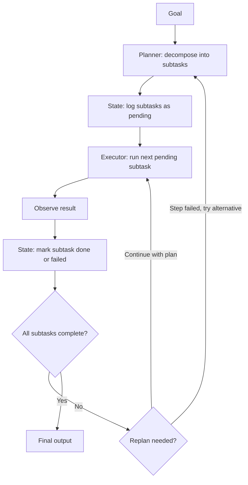

# The Shift from Chatbots to Long-Horizon Agents

## Learning Objectives

1. Compare the architectural limits of single-turn chatbots against multi-step agent loops using a working implementation of both.
2. Implement a planning-execution loop with a hardcoded plan, state dictionary, and per-step model calls.
3. Map enrichment waterfall patterns onto agent loop primitives (planner, executor, state manager).
4. Build an observability wrapper that logs each planning-execution cycle as structured JSON.

## The Problem

A chatbot is a single-turn function. It takes a prompt, returns a reply, and the interaction is done. When you ask a chatbot to "research Stripe and draft a personalized email to their Head of Growth," the model attempts to do all of that work inside one context window. It produces a company description, invents a contact name, guesses at priorities, and drafts the email — all in one unstructured blob. If any individual piece is wrong, you have no way to isolate which step failed. You get the output as a finished product or you don't get it at all.

This is the request-response ceiling. The failure mode is predictable: the prompt gets longer as you add requirements, the context window fills with competing instructions, the model starts dropping or hallucinating pieces, and you end up copying the output into a document to fix it by hand. You've turned the model into a slow typewriter. The practitioner's workflow becomes: prompt → copy output → edit → paste back → prompt again. That round-trip is the chatbot architecture leaking its limits into your process.

The threshold where this breaks is any task with more than one logical step that depends on the output of a prior step. Account research is one example: you need the company description before you can write the email, and you need the contact's role before you know what to personalize. A chatbot collapses these steps into one call and hopes the model holds all the context simultaneously. An agent runs them sequentially, validates each intermediate result, and carries forward only what it needs. The difference is not incremental — it is a different architecture with different failure modes, different cost profiles, and different observability requirements.

## The Concept

The mechanism that separates a chatbot from an agent is the planning-execution loop. A chatbot follows a linear path: `user_input → model → output`. There is one call, one response, no intermediate state. An agent follows a cyclic path: `goal → plan → step → observe → replan → next_step → ... → done`. The model is called multiple times, each call focused on a single subtask, and the results accumulate in a shared state that every subsequent step can read.

Three components define this loop. First, a **planner** decomposes a goal into ordered subtasks — "research the company, then research the contact, then synthesize an email." Second, an **executor** runs one subtask and returns an observation — the output of that specific step, whether it's a model call, an API lookup, or a database query. Third, a **state manager** tracks which steps are completed, failed, or pending, and holds the accumulated results so the next step can use them. The state manager is what makes the agent more than a script: it persists intermediate work and allows the planner to make decisions based on what has already happened.



The canonical implementation of this pattern is ReAct (Yao et al., 2022), which interleaves reasoning traces and actions so the model can decide what tool to call next based on what it has observed so far. ReAct is one instance of the broader pattern — the key insight is the loop, not the specific prompting technique. Other implementations (Plan-and-Solve, Tree of Thoughts, reflexion) vary in how the planner works and whether it revises mid-run, but all share the same skeleton: decompose, execute one step, observe, decide what to do next. [CITATION NEEDED — concept: planning-execution loop origin and alternatives beyond ReAct]. The horizon matters here: METR's Time Horizon benchmark shows the task length a model completes at 50% reliability has been doubling roughly every seven months since GPT-2. As models handle longer tasks, the loop runs for more steps, and the cost of a bad plan or a missing state checkpoint compounds.

## Build It

The clearest way to see the architectural difference is to build both side by side. The chatbot approach sends one long prompt and receives one response. The agent approach sends three focused prompts in sequence, each building on the last, with a state dictionary tracking what has been collected so far. Both use the same model and the same goal — research a company and draft an outreach email — but the internal mechanics are entirely different.

```python
import anthropic
import json

client = anthropic.Anthropic()

company = "Stripe"

print("=" * 60)
print("CHATBOT: single-turn request")
print("=" * 60)

chatbot_prompt = f"""Research {company} and draft a personalized cold email
to their Head of Growth. Include: company description, recent news,
the contact's likely priorities, and a 3-sentence email."""

response = client.messages.create(
    model="claude-sonnet-4-20250514",
    max_tokens=1024,
    messages=[{"role": "user", "content": chatbot_prompt}]
)

output = response.content[0].text
total_tokens = response.usage.input_tokens + response.usage.output_tokens

print(f"\nTokens used (single call): {total_tokens}")
print(f"\nOutput:\n{output[:600]}")
print(f"\n[... {len(output) - 600} more chars]")
print(f"\nProblem: one blob. Cannot verify company research separately")
print(f"from the email draft. No intermediate state to inspect.")
```

```python
import anthropic
import json

client = anthropic.Anthropic()

company = "Stripe"
plan = ["company_research", "contact_research", "synthesis"]
state = {"company": company, "results": {}, "current_step": 0}

print("=" * 60)
print("AGENT: planning-execution loop")
print("=" * 60)
print(f"\nPlan: {plan}")
print(f"Initial state: {json.dumps(state, indent=2)}\n")

for step_name in plan:
    state["current_step"] += 1
    step_num = state["current_step"]

    if step_name == "company_research":
        prompt = (
            f"Provide a 2-sentence factual description of {company}. "
            f"Then list 2 of their publicly known strategic priorities."
        )
    elif step_name == "contact_research":
        prompt = (
            f"A Head of Growth at {company} — what 3 metrics or goals "
            f"would they most likely be responsible for? List them."
        )
    elif step_name == "synthesis":
        research = json.dumps(state["results"])
        prompt = (
            f"Based on this research: {research}. "
            f"Write a 3-sentence personalized cold email to the Head of "
            f"Growth at {company}. Reference one specific priority."
        )

    print(f"--- Step {step_num}/{len(plan)}: {step_name} ---")
    print(f"Executor prompt (first 80 chars): {prompt[:80]}...")

    response = client.messages.create(
        model="claude-sonnet-4-20250514",
        max_tokens=512,
        messages=[{"role": "user", "content": prompt}]
    )

    observation = response.content[0].text
    tokens = response.usage.input_tokens + response.usage.output_tokens

    state["results"][step_name] = observation

    print(f"Tokens this step: {tokens} "
          f"({response.usage.input_tokens} in / "
          f"{response.usage.output_tokens} out)")
    print(f"Observation (first 200 chars): {observation[:200]}...")
    print(f"State: results has {len(state['results'])} entries\n")

print("=" * 60)
print("FINAL OUTPUT (synthesis step)")
print("=" * 60)
print(state["results"].get("synthesis", "No synthesis produced."))
print(f"\nAll steps completed: {list(state['results'].keys())}")
```

Run the chatbot block first, then the agent block. The chatbot produces one response — you see the full output but cannot inspect how the company description was derived or whether the contact research is grounded. The agent block prints each step's prompt, token usage, and observation separately. You can read `state["results"]["company_research"]` before the email is written. That inspectability is the architectural difference, not a convenience feature.

## Use It

An enrichment waterfall is a long-horizon agent with a fixed plan. The planner defines the order: try data source A, if the result is empty or low-confidence, try B, then C, then synthesize. Each enrichment step is an executor subtask that returns an observation — a piece of data or a null. The "fall through" logic (if source A returns nothing, move to source B) is the replanner. The contact record being enriched is the state manager: it holds what has been found so far and what is still missing.

This maps directly to the Clay waterfall pattern. When you enrich a lead record with company size, tech stack, and funding stage, Clay does not paste the lead's LinkedIn URL into one giant prompt and hope. It runs each enrichment as a discrete step — query Clearbit for company size, check BuiltWith for tech stack, search Crunchbase for funding — and backfills only the fields that are still empty. If Clearbit returns a headcount of 0 or null, the waterfall falls through to the next provider. That fall-through is the replanner deciding to try an alternative path because the current step's observation was insufficient.

```python
import anthropic
import json

client = anthropic.Anthropic()

lead = {
    "company": "Vercel",
    "linkedin_url": "linkedin.com/company/vercel",
    "domain": "vercel.com",
    "enriched": {}
}

waterfall = {
    "company_size": [
        ("clearbit", f"What is the approximate employee count for {lead['domain']}?"),
        ("apollo", f"Search Apollo for company size of {lead['company']}"),
        ("llm_inference", f"Based on {lead['domain']} being a frontend deployment platform, estimate employee range."),
    ],
    "tech_stack": [
        ("builtwith", f"What technologies does {lead['domain']} use?"),
        ("wappalyzer", f"Scan {lead['domain']} for detected technologies."),
        ("llm_inference", f"What tech stack is typical for a company like {lead['company']}?"),
    ],
}

for field, sources in waterfall.items():
    if lead["enriched"].get(field):
        continue

    print(f"\n--- Enriching: {field} ---")
    for source_name, query in sources:
        print(f"  Trying source: {source_name}")

        response = client.messages.create(
            model="claude-sonnet-4-20250514",
            max_tokens=200,
            messages=[{"role": "user", "content": query}]
        )

        result = response.content[0].text.strip()

        if result and len(result) > 5:
            lead["enriched"][field] = {"source": source_name, "value": result}
            print(f"  Result: {result[:100]}")
            print(f"  Source used: {source_name}")
            break
        else:
            print(f"  Empty result, falling through to next source...")

    if field not in lead["enriched"]:
        lead["enriched"][field] = {"source": "none", "value": None}
        print(f"  All sources exhausted. Field remains empty.")

print("\n" + "=" * 60)
print("ENRICHED LEAD RECORD")
print("=" * 60)
print(json.dumps(lead, indent=2))
```

The output shows which source produced each field. In a real Clay waterfall, the sources are API integrations (Clearbit, Apollo, BuiltWith) rather than model calls, but the architecture is identical: a fixed plan, per-step execution, fall-through on failure, and a record that accumulates state. The chatbot approach — one prompt asking the model to guess everything — produces untraceable results with no way to know which data point came from where. The agent approach gives you provenance for every field, which matters when a sales rep asks "where did this headcount number come from?" and you need an answer.

## Ship It

Production agents fail in ways chatbots do not. They loop infinitely when a step keeps failing and the replanner keeps retrying. They get stuck on one step and burn tokens without making progress. They silently drop state when an exception isn't caught. The chatbot failure mode is a bad response — annoying but bounded. The agent failure mode is an unbounded run that costs money and produces nothing.

The minimum viable defense is structured logging of every planning-execution cycle. Each cycle should record: which step was attempted, what tool or prompt was used, what observation came back, how many tokens were consumed, and whether the plan changed as a result. This gives you the ability to reconstruct what happened during a run without re-running it.

```python
import anthropic
import json
import time
from datetime import datetime, timezone

client = anthropic.Anthropic()

class LoggedAgent:
    def __init__(self, company, max_retries=1):
        self.company = company
        self.max_retries = max_retries
        self.plan = ["company_research", "contact_research", "synthesis"]
        self.state = {
            "company": company,
            "results": {},
            "completed": [],
            "failed": [],
        }
        self.cycle_logs = []
        self.total_tokens = 0

    def run(self):
        print(f"[agent] Starting run for {self.company}")
        print(f"[agent] Plan: {self.plan}\n")

        for step in self.plan:
            self._execute_with_logging(step)

        self._print_summary()
        return self.state

    def _execute_with_logging(self, step_name):
        for attempt in range(1, self.max_retries + 1):
            cycle_id = len(self.cycle_logs) + 1
            start = time.time()

            cycle = {
                "cycle_id": cycle_id,
                "timestamp": datetime.now(timezone.utc).isoformat(),
                "step": step_name,
                "attempt": attempt,
                "status": "started",
                "tokens_in": 0,
                "tokens_out": 0,
                "plan_changed": False,
                "elapsed_seconds": 0,
            }

            prompt = self._build_prompt(step_name)
            cycle["prompt_preview"] = prompt[:80]

            try:
                response = client.messages.create(
                    model="claude-sonnet-4-20250514",
                    max_tokens=512,
                    messages=[{"role": "user", "content": prompt}]
                )

                observation = response.content[0].text
                cycle["tokens_in"] = response.usage.input_tokens
                cycle["tokens_out"] = response.usage.output_tokens
                cycle["observation_preview"] = observation[:150]
                cycle["status"] = "completed"
                cycle["elapsed_seconds"] = round(time.time() - start, 2)

                self.total_tokens += cycle["tokens_in"] + cycle["tokens_out"]
                self.state["results"][step_name] = observation
                self.state["completed"].append(step_name)

                self.cycle_logs.append(cycle)
                print(json.dumps(cycle, indent=2))
                return

            except Exception as e:
                cycle["status"] = "failed"
                cycle["error"] = str(e)[:200]
                cycle["elapsed_seconds"] = round(time.time() - start, 2)
                self.cycle_logs.append(cycle)
                print(json.dumps(cycle, indent=2))

                if attempt >= self.max_retries:
                    self.state["failed"].append(step_name)
                    cycle["plan_changed"] = True
                    print(f"[agent] Step {step_name} failed permanently. "
                          f"Plan changed: skipping to next step.")
                    return

    def _build_prompt(self, step_name):
        if step_name == "company_research":
            return (f"2-sentence description of {self.company}. "
                    f"List 2 strategic priorities.")
        elif step_name == "contact_research":
            return (f"Head of Growth at {self.company}: "
                    f"what 3 metrics are they responsible for?")
        elif step_name == "synthesis":
            research = json.dumps(self.state["results"])
            return (f"Based on: {research}. Write a 3-sentence "
                    f"cold email to Head of Growth